```{r setup, include=F, message=F}
knitr::opts_chunk$set(
	echo=T, comment=NA, message=F, warning=F,
	fig.align="center", fig.width=5, fig.height=3, dpi=300)
```


### 121个人电脑搭建微生物组分析平台(Win/Mac)

> 本节作者：刘永鑫 中国科学院遗传与发育生物学研究所
>
> 版本1.0.3，更新日期：2020年8月27日

> 本项目永久地址： https://github.com/YongxinLiu/MicrobiomeStatPlot ，本节目录 121WinMacSoft，包含R markdown(\*.Rmd)、Word(\*.docx)文档、测试数据和结果图表，欢迎广大同行帮忙审核校对、并提修改意见。提交反馈的三种方式：1. 公众号文章下方留言；2. 下载Word文档使用审阅模式修改和批注后，发送至微信(meta-genomics)或邮件(metagenome@126.com)；3. 在Github中的Rmd文档直接修改并提交Issue。审稿人请在创作者登记表 https://www.kdocs.cn/l/c7CGfv9Xc 中记录个人信息、时间和贡献，以免专著发表时遗漏。

#### 背景知识

**个人电脑基本要求**

- 操作系统：推荐Windows10 64位版(主流兼容性好)，不推荐32位系统，可选Mac
- 最低配置：CPU双核、内存4G、硬盘10GB空间
- 推荐配置：CPU四核+、内存8G+、硬盘30GB+空间

最好16G内存，可以使用更多需要大内存的软件，如PICRUSt2。

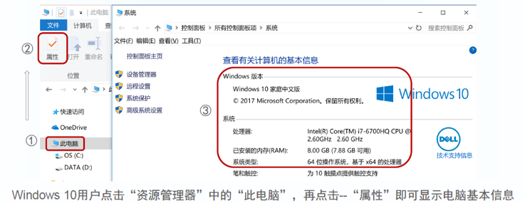

图. Win10中查看系统信息

**常用软件列表**

- 浏览器：谷歌Chrome/微软Edge，稳定使用在线工具(如RStudio Server)
- 数据分析环境Shell + R + IDE：GitForWindows、R、RStudio
- 上传下载文件：Filezilla 或 WinSCP
- 登录服务器：XShell 或 PuTTY
- 网络分析及可视化：Cytoscape
- 图片排版：Adobe Illustrator
- 差异分析和可视化：STAMP
- 扩增子分析流程：USEARCH / VSEARCH

#### 软件安装

以下教程中提及的数十个在微生物组分析中常用的软件，推荐按照教程中说明自行下载最新版软件并安装。

对于Windows用户，可以从
https://github.com/YongxinLiu/MicrobiomeStatPlot/blob/master/Data/BigDataDownlaodList.md 中通过百度云链接批量下载我测试过程中预下载的软件包。

##### 1. 谷歌Chrome浏览器


谷歌Chrome浏览器——远程访问RStudio server或其它网页工具兼容性最好的浏览器。微软在Windows 10中最新版中Edge也更新为Chrome内核，兼容性也不错。

网址：https://www.google.cn/chrome/。

在线安装适合你操作系统的最新版(Google网站访问可能需要科学上网)，可选使用360或电脑官家快速安装最新版。

测试软件版本：Windows 64位版 84.0.4147.89

##### 2. Git for windows命令行(仅限Windows)

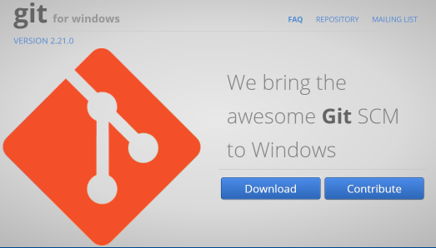

本软件是为Windows用户提供软件项目代码版本管理和备用的工具，同时提供在Windows下运行部分Linux代码的命令行环境，可配合Rstudio使用，高效搭建扩增子分析流程，轻松实现Windows下扩增子数据的分析和可视化。

官网：http://gitforwindows.org/

点击Download下载最新版，按默认参数安装即可。

测试软件版本：Windows 64位版 2.28.0

##### 3. R语言


R语言是目前生物学、经济学等领域最流行的统计分析语言。基本可以完成微生物组领域的全部统计、分析和可视化，而且完全开源免费，支持Windows/Mac/Linux三大主流操作系统。

官网：https://www.r-project.org/

下载最新版：Download CRAN - China Tsinghua - Download R for Windows 或 Mac —— base —— Download R 4.x.x

测试软件版本：Windows 64位版 4.0.2

双击安装程序，建议语言选择英文安装。注意：安装选择组件步可去掉32-bit，节约空间并减少RStudio打开选择版本。


常见问题：中文用户名导致乱码及无法使用

如果您碰到如下错误，是因为用户名中存在中文，导致乱码不能识别，请新建一个用户，名字为纯英文，重新安装以上工具。

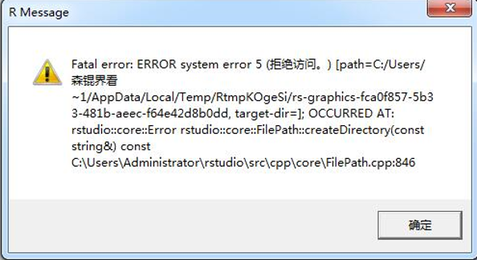

Win10下新建用户操作方法：
Win10开始 —— 设置 —— 帐号 —— 家庭和其它人员 —— 我没有… —— 添加一个… —— 输入用户名和密码 —— 下一步 —— 按提示操作至完成

##### 4. R/Shell编程环境——RStudio


下载页面：https://www.rstudio.com/products/rstudio/download/#download

选择适合自己系统的版本(Win/Mac)，下载安装程序的最新版。

测试软件版本：Windows RStudio-1.3.1056


右键使用管理员身份安装。完成后打开时，会选择R版本(如下图)

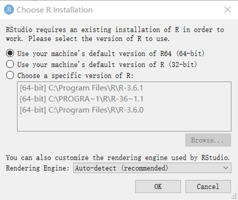

图. RStudio首次启动选择R版本

系统允许下建议选第一项 -
“使用系统默认R64位版本”，
点击OK，默认为使用安装的最新版。

- 常见问题：RStudio中字符乱码处理

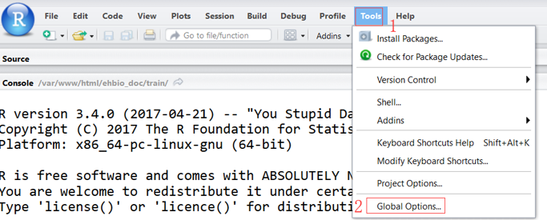

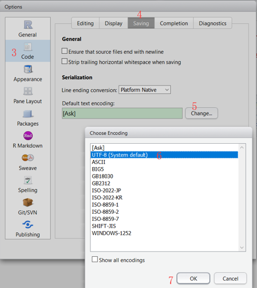

图. RStudio乱码解决方法：Tools菜单 —— Global Options选项 —— Code —— Saving —— Change —— 切换编码为 UTF-8 —— OK

- 常见问题：Windowns 10下不显示文件扩展名问题

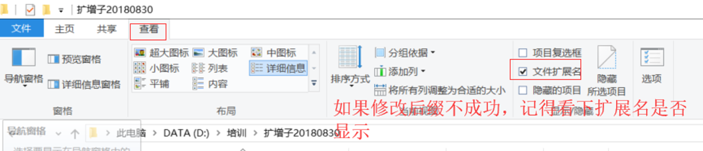

图. 设置Windows显示扩展名的方法。

人们常用文件扩展名决定文件类型，如程序一般为.exe
Linux Shell脚本为.sh，R语言的脚本为.R，R Markdown为.Rmd
只有扩展名正确，RStudio才能正确选择合适的环境运行
Windows资源管理器中“查看” - 勾选“文件扩展名”，方便修改正确识别代码文件。

- 常见问题：RStudio中调出Terminal

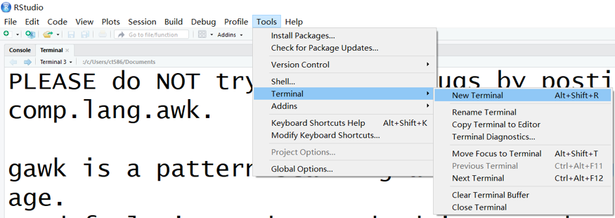

图. RStudio中打开终端(Terminal)的方法：若未看到Terminal或不小心关掉了Terminal，可按下方操作打开。Tools —— Terminal —— New Terminal (快捷键Alt+Shift+R)。

##### 5. R包安装

开源软件存在大量包相互依赖问题，比如你安装一个包，可能其依赖上百个包，初次安装下载时间非常长，而且有些包没有二进此版，需要源码安装还需要额外的工具，如Rtools软件环境的支持才能实现编译安装。

- 方法1. 批量移植相同系统版本下的安装包

我们把预安装好几百个常用R包打包发布，大家可以下载解压 即可使用，缩短安装时间，提高成功率。

R包合辑下载：https://github.com/YongxinLiu/MicrobiomeStatPlot/blob/master/Data/BigDataDownlaodList.md 。提供了Windows 10和Mac系统最新版常用R包的百度云下载链接。

4.0.zip包含了几百个常用R包，Win10下解压至"我的文档/R/win-library"目录，替换其中的4.0目录即可调用，省去了下载安装过程。

如果找不到R包安装位置，可以在RStudio中查看：首先启动RStudio，菜单Tools —— Install Packages (或右侧 Install按扭) 查看"Install to Library:"处默认R包安装目录(如下图)，即安装包位置。

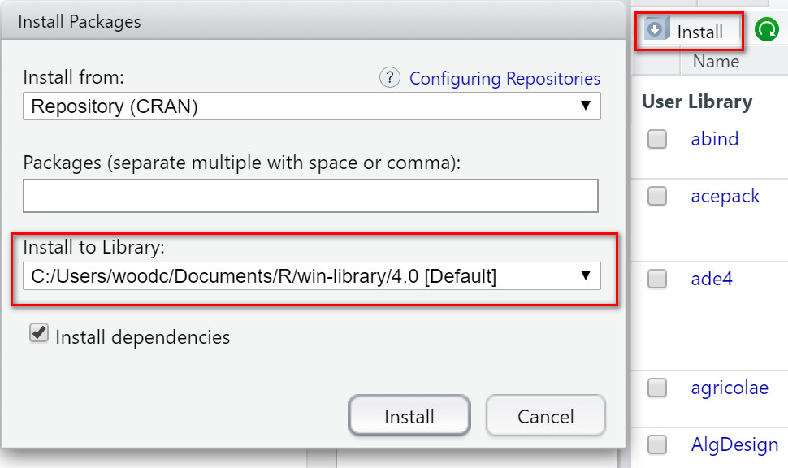
因为R包默认是安装到我的文档/R/win-library目录，如果C盘空间不足，可以查阅相关方法迁移“我的文档”至其他盘即可。

将压缩包4.0.zip复制到上述win-library目录, 选中4.0.zip，右键选择解压缩至当前文件夹, 如提示文件替换，可选择全部选是。

注意：一定要有win-library目录中解压，不要在4.0目录中解压。如在4.0目录下解压出现“4.0/4.0”双层嵌套目录将导致安装无效。

Mac用户的压缩包下载至Downloads目录并解压，会出现library文件夹，运行如下命令复制到指定安装位置：不同版本系统位置可能不同，请在RStudio中按上述方法查看目录位置。

    cp -r ~/Downloads/library/* /Library/Frameworks/R.framework/Versions/4.0/Resources/library/


安装后测试：替换之后，重新启动Rstudio，在左下角 > 后面输入 library(ggplot2)测试，如显示下图则代表安装成功(如下图)。


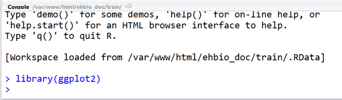
如果出现 Error in library(“ggplot2”) : 不存在叫‘ggplot2’这个名字的程辑包，则说明包未安装成功。可能是前面操作解压覆盖没有成功，如位置不正确，可人为检查并修改。
如果是自己需要用的新包，不存在于提供的压缩包中，则需后面的方式重头安装。

- 方法2. 菜单安装

R包常用CRAN、Biocondoctor、Github三个网站来源安装。

最常用使用RStudio中的包管理页面安装：

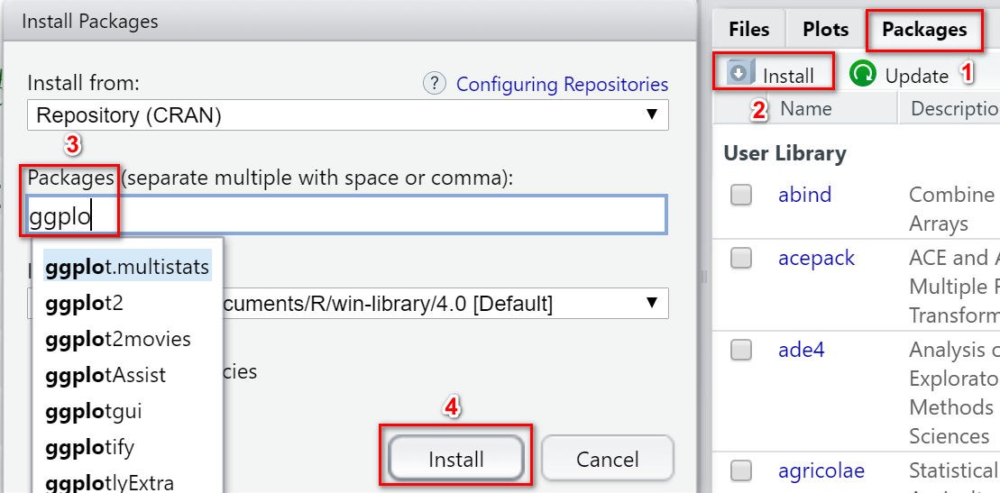

1. 选择右下角 Packages选项卡，
2. 点击Install；
3. 输入包名，会有提示，可供选择；
4. 点击Install安装。

- 方法3. 代码层面安装

代码层面的安装R包的三种方法，请在RStudio中使用。

安装CRAN包，如devtools为包的名字，可替换为其他自己需要的包名。注：devtools包用于安装github来源R包。

```{r}
# 直接安装
if (!requireNamespace("devtools", quietly = TRUE))
    install.packages("devtools")
# 指定镜像安装，通常可加速，有时不可用
site= "https://mirrors.tuna.tsinghua.edu.cn/CRAN"
if (!requireNamespace("devtools", quietly = TRUE))
    install.packages("devtools", repo=site)
```

安装Bioconductor包的新方法。注：edgeR是最流行的测序数据差异比较R包。

```{r}
# 检查BiocManager包是否存在，不存在则安装
if (!requireNamespace("BiocManager", quietly = TRUE))
    install.packages("BiocManager")
if (!requireNamespace("edgeR", quietly = TRUE))
    BiocManager::install("edgeR")
```

安装Github的R包，包名由用户名和包名两部分组成。以我编写的amplicon包为例，保存于github中的microbiota用户下，提供了扩增子分析常用统计分析和绘图样式的函数。

```{r}
if (!requireNamespace("devtools", quietly = TRUE))
    library(devtools)
if (!requireNamespace("amplicon", quietly = TRUE))
    devtools::install_github("microbiota/amplicon")
```

更多代码层面的安装和常见问题将在R语言基础章节详细介绍。

##### 6. 服务器通讯——Xshell 和 FileZilla

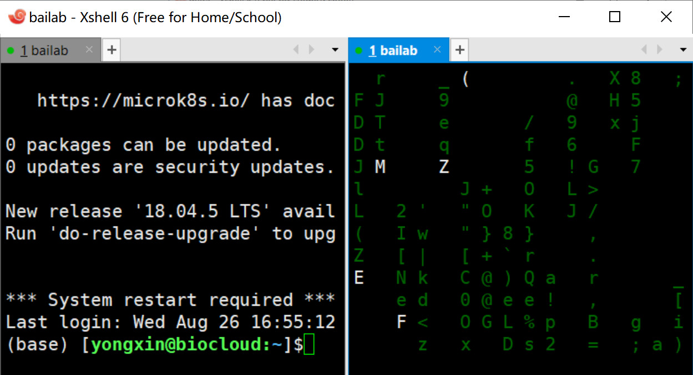

图. Xshell多窗口同屏界面。左侧为登陆服务器的状态；右侧为运行骇客帝国屏保(cmatrix)。Xshell免费版最多支持最多4格同屏。

Xshell是Windows系统下用于登录服务器的终端，Mac用户可直接使用系统自带的Terminal即可。访问 https://www.netsarang.com/zh/free-for-home-school/ 填写姓名、邮箱获取学校/家庭版免费下载链接。
Xshell无法正常运行用户备选PuTTY http://www.putty.be/ 。

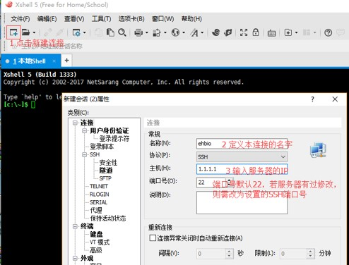

图. Xshell首次使用配置方法。

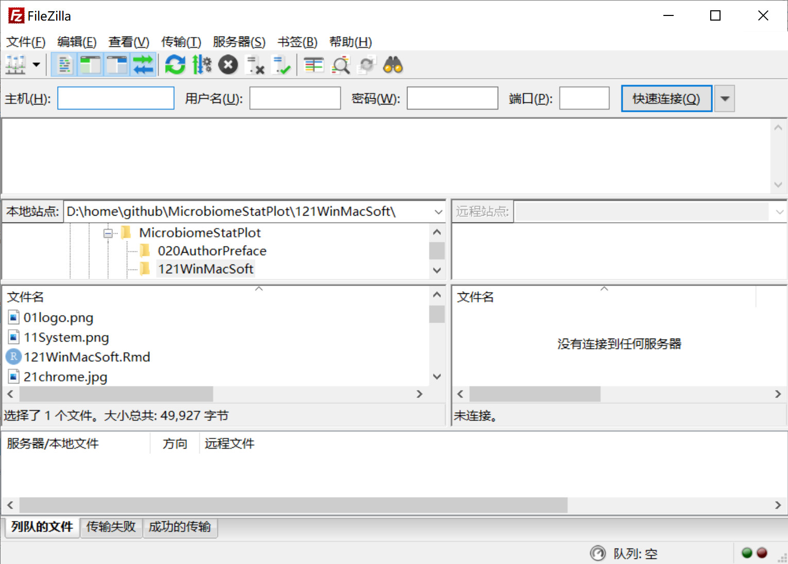

图. FileZilla主界面。上方可快速访问服务器，左侧为本地文件列表，右侧为服务器文件列表。

FileZilla可以断点续传进行上传、下载，上传数据至NCBI。下载链接 https://filezilla-project.org/download.php?type=client 。无法正常运行此软件备选WinSCP https://winscp.net/eng/download.php 或 Xftp (可与Xshell同时下载)

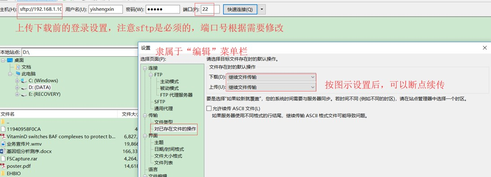
图. FileZilla快速访问服务器示例。需添加主机IP地址、用户名和密码。可调置断点续传。

##### 7. 扩增子分析流程USEARCH / VSEARCH下载

- USEARCH下载

访问 http://www.drive5.com/usearch/download.html  
选择接受许可协议，版本必须选择v10.0
系统根据自己电脑选择Windows/Mac，可多选
填写邮箱 ，提交收到链接，下载后改名为usearch.exe。记得此文件位置，或放到此定位置，如程序均保存至 C:\public\win目录中，方便添加环境变量($PATH)后直接使用。

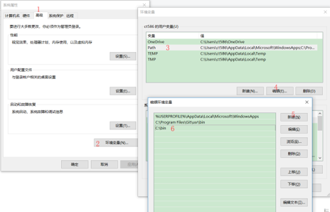

图. Windows永久添加环境变量的方法。在资源管理器中，此电脑 —— 属性 —— 高级系统设置 —— 环境变量 —— Path —— 编辑 —— 新建 —— C:\public\win —— 确定 —— 确定 —— 确定

- VSEARCH下载

https://github.com/torognes/vsearch 主页中找最新下载链接，如 vsearch-2.15.0-win-x86_64.zip
下载后解压其中的 vsearch.exe 至 C:\public\win 目录

##### 8. 微生物组差异比较STAMP

STAMP是一款分析微生物分类和功能谱的软件，最新版本2.1.3， Downloads部分可下载适合自己Windows/Linux/MacOS版本的软件。
Examples处提供了示例分析结果，以及演示数据实例。
STAMP可以现实不同平台下兼容，实现Beta多样性散点图、物种丰度 柱状图、箱线图，以及Post-hoc图展示差异菌。还可以绘制带误差线柱 状图、误差线和柱分离组合图、相关散点图、密度柱状图、p值柱状图 等分析和绘图。
http://kiwi.cs.dal.ca/Software/STAMP 下载系统对应版本

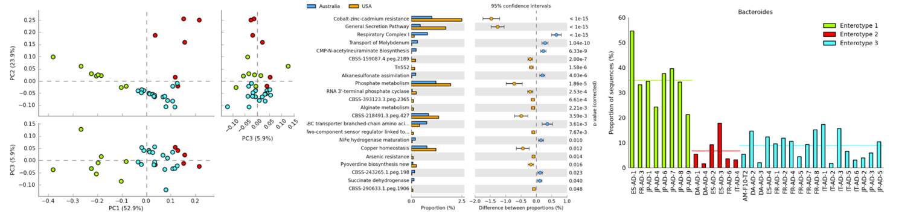

图. STAMP分析常用结果示例。

##### 9. 网络分析和可视化Cytoscape

Cytoscape是一款图形化显示网络软件，生物学中常用于分析转录因子与基因或蛋白与蛋白之间互作关系、GO和KEGG富集分析。

软件下载地址：http://www.cytoscape.org

没安装过Java运行环境的用户，先安装jdk-11.0.7_windows-x64_bin.exe

再下载安装程序Cytoscape_3_8_0_windows_64bit.exe

按默认参数完成安装即可

Cytoscape使用视频教程：https://ke.qq.com/course/261290 

##### 10. 图片美化和排版Adobe Illustrator

Adobe Illustrator，简称"AI"，是一款非常好的矢量图形处理工具、图片排版工具。

是Adobe公司开发的一款收费软件，大家可以在官网下载试用版，或购买授权。

使用视频教程：https://ke.qq.com/course/261607 


##### 其它推荐的跨平台工具

- 下载工具 wget 

https://eternallybored.org/misc/wget/

- csvtk：表格处理

https://github.com/shenwei356/csvtk 

- seqkit：序列处理

https://github.com/shenwei356/seqkit

如下载windows版，均放在 C:/public/win 目录下方便搭建分析流程使用。


#### 应用

现在你的电脑就是一台生物数据分析工作站，几乎可以满足扩增子分析的全部需求。

如果想使用QIIME 2、LEfSe等工具，还可以安装Linux子系统，详见：

- [Windows10安装Linux子系统Ubuntu 20.04LTS，轻松使用生信软件，效率秒杀虚拟机](https://mp.weixin.qq.com/s/0PfA0bqdvrEbo62zPVq4kQ)


具体软件的使用，将会在接下来的章节中结合具体需求，针对性进行学习，以节约大家的宝贵时间。


> 责编：刘永鑫 中科院遗传发育所

> 版本更新历史

> 1.0.0，2020/8/25，刘永鑫，软件简介和流程

> 1.0.1，2020/8/26，刘永鑫，流程校对，添加配图

> 1.0.2，2020/8/27，吴翔宇 宁波大学，全文校对，添加配图

> 1.0.3，2020/8/27，刘永鑫，终审，排版并发布

