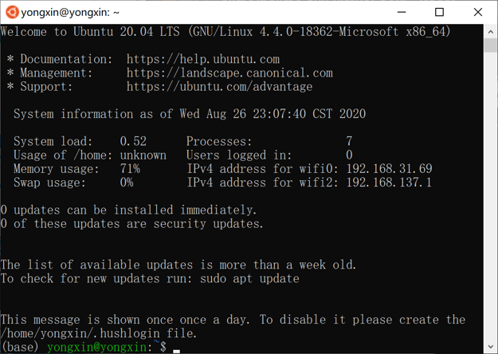
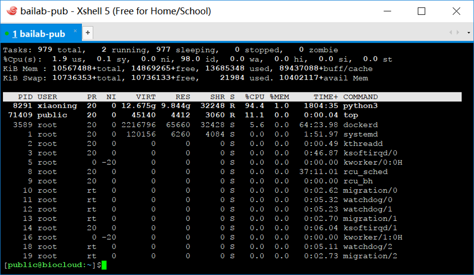
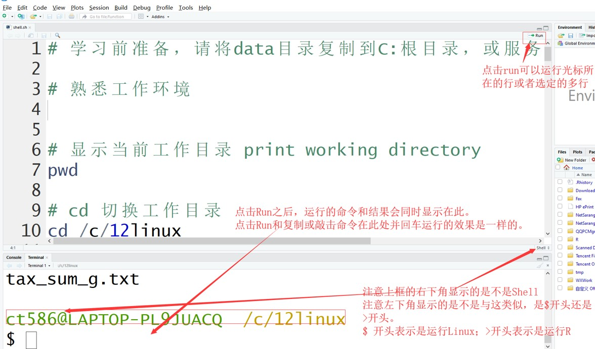

```{r setup, include=F, message=F}
knitr::opts_chunk$set(
	echo=T, comment=NA, message=F, warning=F,
	fig.align="center", fig.width=5, fig.height=3, dpi=300)
```


### 122Linux系统和Shell命令行简介，走上数据分析之路

> 本节作者：刘永鑫 中国科学院遗传与发育生物学研究所
>
> 版本1.0.2，更新日期：2020年8月31日

> 本项目永久地址： https://github.com/YongxinLiu/MicrobiomeStatPlot ，本节目录 122Linux，包含R markdown(\*.Rmd)、Word(\*.docx)文档、测试数据和结果图表，欢迎广大同行帮忙审核校对、并提出修改意见。提交反馈的三种方式：1. 公众号文章下方留言；2. 下载Word文档使用审阅模式修改和批注后，发送至微信(meta-genomics)或邮件(metagenome@126.com)；3. 在Github中的Rmd文档直接修改并提交Issue。审稿人请在创作者登记表 https://www.kdocs.cn/l/c7CGfv9Xc 中记录个人信息、时间和贡献，以免专著发表时遗漏。


本文将带大家熟悉Linux系统的命令行工作模式、软件使用方式和目录结构。带大家熟悉传说中骇客帝国般的代码模式，走上数据分析之路！

开始本节学习前，Windows用户需要完成上一节中的Git+R+RStudio的安装：

- [121个人电脑搭建微生物组分析平台(Win/Mac)](https://mp.weixin.qq.com/s/Z8ZSJYkfFXv9mdE_eTrT8Q)

Mac和Linux用户自带Shell命令行环境，可直接安装R+RStudio即可使用。不同操作系统环境下命令可能会略有不同。本文基于Windows的Git bash环境下测试。测试数据、脚本文件(shell.sh)位于本节目录中，可从github下载。


#### Linux系统简介

##### Linux是什么?

- Linux是一种操作系统
- 支持多用户、多任务操作
- 与Unix类似 (MacOS基于Unix开发)

目前主流的Linux发行版有Ubuntu、CentOS、RHEL(Redhat)和Android等。

##### Linux在哪儿应用？

- 网站服务器、数据库
- 计算服务器及云平台
- 台式机/笔记本等个人电脑
- 路由器
- 智能手机Android系统


##### 为什么学习Linux？

- 系统开源免费——节约成本且更安全
- 90%以上服务器使用Linux系统
- 长期运行的稳定性
- 多数生物学软件只有Linux版本
- 强大的Bash命令简化繁琐的操作，尤其是大大简化重复性工作

##### Shell命令行运行环境

命令行界面(Command-Line Interface, CLI)是在图形用户界面得到普及之前使用最为广泛的用户界面，它通常不支持鼠标，用户通过键盘输入指令，计算机接收到指令后，予以执行。

通常认为，命令行界面（CLI）没有图形用户界面（GUI）那么方便用户操作。由于命令行界面的软件通常需要用户输入具体的操作命令，但命令行界面较图形用户界面更节约计算机系统的资源。并且在熟记命令的前提下，使用命令行界面往往要较使用图形用户界面的操作速度提高数倍，可自动全程可重复。所以，目前拥有图形用户界面的主流操作系统中，都保留着可选的命令行界面。

Linux和Mac系统自带的Terminal程序可直接使用 Shell命令行。Windows自带的Command Prompt和Windows PowerShell两种命令行均为非主流，暂时还不方便开展生信分析。

这里我们主要介绍三种适合在Windows下学习使用调用Linux Shell命令行界面的方法：

一、GitForWindows下模拟Shell命令行


图. Git Bash用户界面

在上一节我们介绍了如何安装Git For Windows，它为系统提供了Git Bash的命令行环境，但本质上仍然是Windows系统，只是把常用的Linux命令编写成了Windows版本。具体使用同Linux基本一致，可以开展有windows版本的命令及软件分析，如usearch和vsearch等扩增子分析。但无法安装仅限Linux版本的软件。

命令行可以通过程序中的Git Bash打开。也可通过鼠标右键菜单中的Git Bash Here快速打开，并切换至当前文件夹。同时也支持在RStudio中的Termial中选择Git bash并调用。

二、Windows子系统中的Linux Ubuntu 20.04 LTS



图. Windows下Linux子系统：Ubuntu 20.04 LTS程序的用户界面


目前Windows 10（确保Win10系统版本>1606，建议为最新版）可以直接在应用商店中安装Linux子系统，并作为应用直接使用，无须挂载虚拟机。本质上相当于轻量级的虚拟机，可以安装众多Linux版本的软件，而且轻松访问原系统中的文件。

详细教程见：

- [Windows10安装Linux子系统Ubuntu 20.04LTS，轻松使用生信软件，效率秒杀虚拟机](https://mp.weixin.qq.com/s/0PfA0bqdvrEbo62zPVq4kQ)

有些同学可能还使用VirtualBox、VMWare等虚拟机安装Linux系统进行学习，这里不推荐使用，因为不仅系统资源占用率较大，而且运行效率也较上述Windows子系统低，体验极差。同样也不建议安装双系统Windows/Linux，在纯Linux下很多常用软件无法运行，学习办公极不方便。

三、远程访问Linux服务器



图. 使用XShell远程访问Linux服务器

个人电脑的性能仍然有限，通常具有2-8个计算核心，8-16GB内存。通常处理10GB以下数据尚能接受，如扩增子分析中几十个样本测序结果。但在面对宏基因组多达几百、几千GB数据时显然无能为力。此时需要性能高达上百个计算核心，同时拥有TB级别内存的高性能计算服务器，而在高性能计算集群中也称为胖结点(配置高的计算结点)。在Windows中，我们通常采用Xshell远程连接服务器并开展数据分析。

##### 计算平台的选择


工作站：包括日常使用的高配置台式机和笔记本，价格5 K – 30 K，可实现1 – 10 GB规模的数据分析；


服务器：搭载专业主板，可以安装CPU ✕ 1~4 + 内存 ✕ 48 + 磁盘阵列 (8T ✕ 12)，价格30 K – 1 M，适合处理 10 GB – 10 TB规模数据。


计算机集群：这里主要指高性能计算集群。集群中成员根据配置特点分为管理结点、登陆结点、计算结点和胖结点，扩增子分析样本数量较少可使用计算结点，而宏基因组拼接通常内存占用较大，多使用胖结点。

- 扩增子分析工作站：预算10 - 50 K起

CPU: Intel i7，i9 / AMD R5, R7, R9 6 ~ 32核

内存：32 ~ 128 GB

磁盘：1~3 ✕ 8 TB(1 TB = 1024 GB)

OS：可选Ubuntu 18.04/20.04 LTS

- 宏基因组分析服务器：预算 30~700 K

CPU: Intel(R) Xeon(R) 10 ~ 28核 X 4颗 (最多112核，224线程)

内存：512GB ~ 2T(1 TB = 1024 GB)

磁盘阵列：48 ~ 96 TB X 2

OS：可选Ubuntu 18.04 / CentOS


#### Linux下Shell运行环境

##### Linux/Mac/Windows Shell比较

Linux是操作系统的类型，而Shell是一种程序和语言，是在Linux下与系统核心（kernel）沟通的一种环境。我们接下来的分析工作，主要依赖Shell环境来实现多种数据分析和可视化，也方便调用各种第三方程序。

Mac OS操作系统是基于Unix系统开发的操作系统，其系统下的Shell环境与主流Linux Shell操作基本一致，而存在细微差异我们将会列出。因为拥有原生的Shell，这也是很多同行喜欢使用Mac电脑的原因之一。但Mac OS系统毕竟小众，可供选择的软件数量相较Windows系统明显减少，而且目前也存在稳定性和兼容性不足的问题，因此不推荐生信新人上手(除非你特别喜欢Mac或折腾，若出现问题就自求多福吧！)。

Windows操作系统也具有Power Shell环境，但命令不够强大，支持软件较少，在生物信息领域并非主流，本领域很少有人使用。但Windows系统中可用软件最齐全，稳定性极高，也可以选择安装Linux子系统或者挂载虚拟机，操作较简单，有多种方式实现Linux Shell，如前文提及Git bash，Ubuntu等方法。

##### Linux目录结构

Linux下所有目录都在根目录下，用 / 表示。下面有几个固定的子文件夹，如/bin, /tmp, /usr, /home, /etc等。因此在访问目录时一般加上 / 指示相对于绝对路径。

登录系统后进入家目录(~ 或 如/home/yongxin)


- /：根目录，所有的目录、文件、设备都在/之下，/就是Linux文件系统的组织者，也是最上级的领导者。
- /bin：bin 就是二进制（binary）英文缩写。在一般的系统当中，都可以在这个目录下找到linux常用的命令。系统所需要的那些命令位于此目录或/usr/bin、/usr/local/bin中。
- /etc：etc (Editable Text Configuration) 目录是linux系统中最重要的目录之一。此目录下存放了系统管理所需的各种配置文件和子目录。例如网络配置文件，文件系统，系统配置文件，设备配置信息，设置用户信息等都在该目录下。
- /home：如果建立一个用户，用户名是“xx”,默认在/home目录下就有一个对应的/home/xx路径，用来存放用户的主目录。当然也可指定新用户家目录于其它位置。
- /mnt：这个目录一般是用于存放挂载储存设备的挂载目录，比如磁盘阵列、U盘和移动硬盘、Windows下的c/d盘等目录。
- /lib：lib是库（library）英文缩写。这个目录用于存放系统动态链接共享库。几乎所有的应用程序都会用到这个目录下的共享库。因此，千万不要轻易对这个目录进行什么操作，一旦发生问题，系统就无法正常工作。

##### Win10 + Rstudio + gitforwindows运行Linux的Shell命令


图. 在Windows系统下RStudio调用Git bash环境运行常用Linux命令

在这里所有的目录结构仍然与系统保持一致。如C盘为`/c`目录。可以轻松使用Linux常见问题，接下来我们的扩增子分析的流程也将在此环境下完成。

下面的教程也基于此模式演示。另外需要注意的是：Windows下linux子系统的安装，必须是Windows 10最新版才能实现；而利用XShell远程登陆Linux服务器则为更专业的Linux操作环境。这些模式的操作方式基本相同，因此其他环境下的朋友也可参考下面的教程继续学习。

#### Linux Shell常用命令

在Linux下，我们都是通过Shell"命令"进行操作的。

命令 = 执行某一个或某一组程序

执行命令，需要在"命令行"输入输令，并按回车执行。常见格式如下：

    [ngs0@localhost ~]$ 命令 [-选项] 参数1 参数2 …… 

说明：

- 命令行永远以可执行程序开始；
- [-选项] 的方括号表示该项目是可选的，不是每次都必须要输入；
- 不同的项之间以空格分隔，命令行以回车结束并即刻执行；
- Linux是区分大小写的，即cd和CD代表不同的意义。

##### 目录操作pwd/mkdir/cd

- 我在哪pwd

Windows图形界面下，我们的出发点通常是桌面、我的文档、C盘、D盘等目录。

在Shell命令行环境下，新人第一次使用会感觉手足无措，首先是我在哪里？

此时我们学习第一个命令来回答你的问题：只有3个字母，pwd

pwd # 显示当前工作目录 (print working directory)

pwd为命令，井号(#)后内容为注释内容，方便读者理解

在Termial中输入pwd并按回车，会显示Terminal终端的当前位置，一般默认为家目录，即/home/yourname，可以缩写为~。

下面是一个在Rmd中插入的Shell代码块，可在RStuido中逐行(Ctril+Enter)或逐块运行(点击Run Current Chunk)，运行会显示当前Rmd文档所在位置，因Rmd文档或R项目会自动切换为文档所在目录。也可复制代码到下方Terimial中粘贴，然后按回车运行，则显示终端的当前位置。

```{bash}
pwd
```
上面运行了pwd命令，显示我当前工作所在的目录。/mnt/d是系统D盘，后面是层级目录，主要有3级，比如我这节122Linux入门教程(122Linux)，就保存于1级home，我个人习惯把电脑的所有文件均存于此，方便备用和迁移；2级是github，我们所代码相关的项目保存于此，与github同步，可提供版本管理、发布和备用的作用，所有内容可在线 https://github.com/yongxinliu 查看；3级是MicrobiomeStatPlot是本系列教程《微生物组数据分析与可视化实战》专著的项目目录。

注意：在你电脑上运行此命令或显示你所在的目录，与我的结果会有不同。

- 新建文件夹mkdir

比如我们要开始一个新的分析项目，最好新建一个文件夹方便集中存放相关文件。
比如现在Windows下的C盘中新建test目录，在Terimial中运行如下命令：
    
    mkdir -p /c/test

mkdir是make directory的缩写，即新建文件夹；-p是参数，它允许我们建立多级目录，如/c/test/a1/today，同时文件夹存在也不会报错中止分析；后面是文件夹的绝对位置，也可以是相对于当前所在位置的相对位置。

我们再执行一次不带-p参数的命令：
    
    mkdir /c/test

会显示：不能创建目录，目标文件已存在(mkdir: cannot create directory '/c/test': File exists)。你可以自己尝试执行带-p参数的命令试试效果。

- 切换工作目录cd

Windows下进入目录需要层层双击，像爬楼梯一样。在Shell下我们使用cd可以快速跳转至任意目录，相当于电梯直达。

cd：切换工作目录 (change dir)，默认为家目录

我们在c盘下新建qiime2目录，并进入，然后确定当前目录

    mkdir -p /c/qiime2
    cd /c/qiime2
    pwd

我们看到新建文件夹成功，并确定切换至/c/qiime2。

值得注意的是，在分析某一项目时，尽量保持在该项目目录下工作，可以更有效使用相对路径读取和写入文件，简化代码。

##### 文件操作ls/cp/mv/rm

窗口模式下进入文件夹会自动显示内容。Linux Shell下需要输入ls(list)命令显示该目录下所有文件：

```{bash}
ls
```

我们通常要详查看个文件，或文件夹的信息，可以在最后面指定名称；如果显示常用文件详细信息，加-l参数(list)

```{bash}
ls -l example.fq.gz
```
文件大小是字节为单位，可以添加-h(human readable)更改为可读的K/M/G的单位
```{bash}
ls -lh example.fq.gz
```
- cp # 拷贝文件，复制原文件至目标位置 (copy)

复制test.sh文件为file_temp.txt文件

```{bash}
# 复制文件
cp test.sh file_temp.txt 
# 查看结果
ls -lh file_temp.txt 
```

复制test.sh至test目录

```{bash}
# touch创建一个空文件，或更新文件修改时间
touch test.sh
# 新建test目录
mkdir -p test
# 复制文件到指定目录
cp test.sh test/ 
# 显示文件夹文件可读(h, human readable)大小(s, size)
ls -hs test/
```

- mv # 移动或重命名文件 (move)

mv可以不同文件夹下移动文件或文件夹

相同文件下移动即为改名

```{bash}
# 移动文件至test目录
mv file_temp.txt test/
# 改名
mv test/file_temp.txt test/test.sh
```
- rm # 删除文件 (remove)

```{bash}
rm test/test.sh # 删除文件
rm -r test # 删除文件夹
```

##### Tab键自动补全

Tab键可用于补全：命令、文件名，因此只需记住一部分名称即可自动补全。

补全的原则：

- 如果唯一，则按一次Tab直接补全；
- 如果有多个选择，按一下补至最大唯一项，则按两次Tab列出全部的可能选项。

如目录存在t开头唯一文件test.sh

    cat t 并按tab键

即可显示如下：

    cat sh

另一种多选情况如下：面对多个选择时，按一下补至最大唯一，再按两次Tab显示所有可能选项

    ls 122 
    # 按tab键，会自动被全为
    ls 122Linux简介和Shell环境.
    # 按两下tab显示候选
    122Linux简介和Shell环境.Rmd   122Linux简介和Shell环境.docx
    
##### 程序中止命令Ctrl+C

Ctrl + C

功能：用于终止当前运行中的命令

用法：在程序运行中，先按住Ctrl键不放，然后再按C键，释放

例如：执行ping -t www.baidu.com

按Ctrl + C终止ping的循环，退回到Linux命令提示符

注：Linux系统下Ctrl+C是程序中止，而在Windows下是复制命令，很容易误操作导致程序中断，建议运行较长时间的命令，可以在结果添加 & 符转后台以防误操作中断。还有Windows下的许多翻译软件或自动复制文字，其不断地发出Ctrl+C的信号，打断命令的输入和执行，所以不建议在使用Shell同时运行此类软件。

##### 编写一个Shell脚本/程序

刚才提到到，Shell既是一种工作环境，也是一门语言，可以写成.sh格式的脚本或程序，批量或成多步操作。

使用cat命令创建一个sh文件

- cat # 查看文件 (concatenate files and print)

```
# 创建文件，并开始写入
cat > test.sh 
# 我们输入如下内容，按Ctrl+D结束输入
#! /bin/bash
echo "Hello metagenome!"
```

“#!”行代表指定代码的解析器，shell脚本通常指定/bin/bash解析 ，echo是输出命令，将输入内容输出到屏幕上。

脚本写好后，可以用bash命令解析执行。如果想直接当作程序运行，还需要添加可执行权限。注：Windows中扩展名为.exe/com/bat类文件可执行，而Linux Shell环境中任何文件能否执行，由是否具有可执行权限决定。


- •	chmod +x # 添加文件可执行权限(change file mode bits)

除了[x]外，还有[r,w,x] ；[r]，[w]，[x]分别代表可读（read）、可写（write）、可执行（execute） 


```{bash}
chmod +x test.sh
```

运行程序，执行结果为Hello metagenome!

```{bash}
./test.sh
```

##### 认识和操作Fastq文件

Illumina测序数据通常是Fastq格式。如果是双端测序，会有两个文件：*_1.fq.gz和*_2.fq.gz。


每4行表示一条reads
- 第一行：@序列ID，包含index序列及read1或read2标志：
- 第二行：碱基序列，大写"ACGTN"；
- 第三行："+"，预留行，有时候是序列ID；
- 第四行：质量值序列：字符的ASCII码值-33=质量值

我们提供了一个fastq文件，example.fq.gz。

gz结尾的格式为压缩文件，使用gunzip命令解压文件 (g-un-zip)

```{bash}
gunzip -c example.fq.gz > example.fq
```

head/tail显示文件头尾，默认10行。-n指定行数，-n与行数间空格可省略。

```{bash}
head -n 4 example.fq
tail -n4 example.fq
```

如果我们想按页查看文件，可使用less命令，-S不换行，空格翻页，q退出

    less -S example.fq

转换fastq为fasta，并按顺序重命名序列

    awk 'NR%4==2 {print ">E"NR/4+0.5"\n"$0}' example.fq > example.fa


显示fasta文件末尾4行

```{bash}
tail -n4 example.fa
```

grep命令查找某条序列，统计fasta文件序列条数。结果较多，使用 | 重定向，并使用head命令只显示前3行

```{bash}
grep 'AAAACACAGGAACCTGGGTGAAAAC' example.fa | head -n3
```
grep -c统计序列条数，每个fasta格式序列有一个>，统计带有>行数。也可以直接统计>的个数。

```{bash}
grep -c '>' example.fa
```

计算fasta文件每条序列长度。-v为排除'>'行仅剩序列，再连用awk的length统计序列长度，并用print输出结果。结果多，仅用head输出前3行结果预览

```{bash}
grep -v '>' example.fa | awk '{print length($0)}' | head -n3
```
统计序列长度分布。在上面基础上按长度数值(-n, number)排序(sort)，并去冗余(uniq命令为unique缩写)统计每种长度的数量(-c)即为长度分布。如想调整排序为由大到小，修改sort -n为sort -nr，r为按反向(reverse)排序。

```{bash}
grep -v '>' example.fa | awk '{print length($0)}' | sort -n | uniq -c
```
- gzip命令压缩fastq文件

    gzip example.fq


##### 元数据/换行符操作

- cat -A预览并检查是metadata.txt是否存在windows/mac换行符

```{bash}
cat -A metadata_win.txt|head -n3
```
结果中"^I"代表制表符，"\$"代表Linux系统标准换行符，而"^M$"为Windows换行符。

我们在分析时，有一半的错误是由于Windows/Mac/Linux三大系统中的换行符不一致导致的。因此分析前，**需要把Windows/Mac格式的换行符转换为Linux格式**。而Linux格式换行符在Windows/Mac中也可正常使用，无须反向转换。

表. 三大系统下换行符及正则表达式

系统 | 符号 | 正则表达式
---|---|-
Windows | ^M$ | \\r\\n
Mac | ^M | \\r
Linux | $ | \\n

- Windows换行符转换为Linux格式

```{bash}
# 预览win格式
cat -A metadata_win.txt|head -n2
# 删除^M即转换为Linux
sed 's/\r//' metadata_win.txt > metadata.txt
# 预览linux格式
cat -A metadata.txt|head -n2
```

注意：我们分析前后用cat -A预览平时不可见的符号。相当于对分析任务的检查，虽然并没有输出结果，在分析中保证结果符合预期是非常必要的检查点(check points)。

- Mac换行符转换为Linux格式

```{bash}
# 预览mac格式，windows下会显示为1行，cut提取前60个字符
cat -A metadata_mac.txt | cut -c 1-60
# 删除^M即转换为Linux，g为单行多次替换
sed 's/\r/\n/g' metadata_mac.txt > metadata.txt
# 预览linux格式
cat -A metadata.txt|head -n3
```

此外，我们还可以使用文本编辑器转换。如Notepad++，在编辑——文档格式转换菜单，可以切换Windows/Macintosh(Mac)/Unix(Linux)三种主流系统的换行符。

- cut列操作

第一列是样本名，我们采用cut提取第一列(-f, field)。后面接head只预览前3行

```{bash}
cut -f 1 metadata.txt | head -n3
```
##### 循环和变量批量操作

- 模拟生成18个测序文件，位于seq目录

```
#新建seq目录
mkdir -p seq
# 循环成生1-18个文件
for i in `seq 1 18`;do
  touch seq/${i}.fq.gz
done
```

seq 1 18命令生成数列，并逐个传递给变量i。然后使用touch命令在seq目录下创建名为*.fq.gz的模拟数据压缩格式文件。

- 按照metadata样本名批量修改样本名

我们的样本名称是1，2，…18完全没有辨识度，而且非字母开头也容易出问题。我们把这些名称按实验设计改为KO1，KO2..，WT6等简洁标记，具有分组和样本重复的合理名称。具体编写请参考metadata.txt。然后使用如下命令批量改名，如把第3列改为第1列。要求每列的名称必须唯一，绝不允许出现重名。

    # 预览元数据
    head -n3 metadata.txt
    # 将3列ID改为1列样本ID
    awk 'BEGIN{OFS=FS="\t"}{system("mv seq/"$3".fq.gz seq/"$1".fq.gz")}' <(tail -n+2 metadata.txt)

我们使用awk逐行读取metadata.txt，并使用system函数调用mv命令对文件进行改名。BEGIN{OFS=FS="\\t"}设置读取文件分隔符为制表符，tail -n+2 metadata.txt代表从第2行读取跳过标题行。

##### sed替换文字内容

假如metadata中的Beijing写错了，需要替换为Nanjing

```{bash}
sed 's/Beijing/Nanjing/' metadata.txt|head -n3
```
- s: substitute
- /: 分隔符，可以是任意字符，前后统一就行
- s/original/new/: 原始的替换为新的
- sed 's/Beijing/Nanjing/' metadata.txt对元数据中的Beijing全部替换为Nanjing，并输出到屏幕，可用>写入新文件

##### awk统计和列操作表格

- 提取两列并交换顺序

取出metadata.txt的前两列，并把第二列作为输出结果的第一列

```{bash}
awk 'BEGIN{OFS=FS="\t"}{print $2,$1}' metadata.txt|head -n3
```
- awk语言的基本语法说明

1.	awk擅长于对文件按行操作，每次读取一行，然后进行相应的操作。
2.	awk读取单个文件时的基本语法格式是awk 'BEGIN{OFS=FS="\\t"}{print $0, $1;}' filename。
3.	读取多个文件时的语法是awk 'BEGIN{OFS=FS="\\t"}ARGIND==1{print $0, $1;}ARGIND==2{}' file1 file2。
4.	awk后面的命令部分是用引号括起来的，可以单引号，可以双引号，但注意不能与内部命令中用到的引号相同，否则会导致最相邻的引号视为一组，引发解释错误。
5.	OFS: 文件输出时的列分隔符 (output field separator)
6.	FS: 文件输入时的列分隔符 (field separator)
7.	BEGIN: 设置初始参数，初始化变量
8.	END: 读完文件后做最终的处理
9.	其它{}：循环读取文件的每一行,大括号内的命令对每一行都有效，除非有额外判断
10.	\$0表示一行内容；\$1, \$2, … \$NF表示第一列，第二列到最后一列。
11.	NF (number of fields)文件多少列；
12.	NR (number of rows) 所有文件当前读取了多少行
13.	FNR 当前文件读取了多少行，常用于多文件操作时
14.	a[$1]=1: 索引操作，类似于python中的字典，在ID map、注释和统计中有很多应用


- 计算每个样品的生物重复个数

    awk 'BEGIN{OFS=FS="\t"}{a[$2]+=1}END{for(i in a) print i,a[i];}' metadata.txt
    
    A	6
    B	6
    C	6
    group	1

结果多了一行，if(FNR>1)略过标题行

    awk 'BEGIN{OFS=FS="\t"}{if(FNR>1) a[$2]+=1}END{for(i in a) print i,a[i];}' metadata.txt

    A	6
    B	6
    C	6
    
- awk中常用几个符号

1.	=： 一个等号表示赋值
2.	==：表示判断两侧的变量是否相等，如FNR==1，若相等返回True
3.	!=：表示判断两侧的变量是否不相等，若不等，返回True
4.	\>, <：判断数值或字符串的大小
5.	+=：自加操作 a+=1 等同于 a = a+1
6.	%：取余数
7.	+, -, * , / ：加减乘除
8.	&&, ||, !：逻辑与，逻辑或，逻辑非

- awk中的括号和引号

1.	()：一般用于函数中，传递参数
2.	[]：一般用于索引列表或字典，取出列表中第几位元素，或字典中某个key对应的value
3.	{}：代码块，多行语句放在一起，属于一个层级
4.	"", ''：双引号和单引号括起的是字符串，bash中双引号中的变量可以解析，单引号不可以。同样的引号不可以嵌套，如 awk "{print "ehbio"}"是不对的，要写成awk '{print "ehbio"}'或awk "{print 'ehbio'}"。
5.	;：分号用于分割语句块

##### Linux Shell程序中的常用符号和命令

- 常用符号

1.	\t：代表TAB键
2.	*：代表任意字符
3.	|：管道符，传递数据，上一条命令的输出作为下一条命令的输入
4.	>：输出重定向，常用语把输出结果写入文件

表. Linux Shell常用命令总结 

pwd   |显示当前目录            |cat    |查看文件                |head   |筛选文件开头N行
:-----|:-----------------------|:------|:-----------------------|:------|:--------------------------
ls    |列出目录内容            |ping   |测试网络连接            |tail   |筛选文件结尾N行
ls -l |详细列出目录内容        |less -S|上下翻页查看文件        |grep   |筛选特定关键词的行
cd    |切换当前目录            |cp     |复制文件                |cut    |列操作
mkdir |创建目录                |mv     |移动文件                |sed    |文本替换
chmod |修改文件权限            |rm     |删除文件                |sort   |排序
gunzip|解压缩gz文件            |awk    |文本处理工具            |uniq -c|去冗余并统计
\|     |管道，命令串联          |Ctrl+D |终止编辑                |Ctrl+C |终止运行程序



图. RStudio中Git bash环境下运行Shell脚本


图. RStudio中Git bash环境下路径变化

开始接触命令行，一个难跨越的概念是文件路径。Linux系统虽然好用，但还没智能到只给文件名就能判断路径的地步，实际也没必要，而且会引发危险。在Windows下访问文件时，会一层层打开文件夹去查看，Linux下也类似，只不过用cd代替了打开操作。如果碰到文件找不到的错误，一定先检查当前所在目录和文件所在目录。

任何新事物的学习和使用，都是一个逐渐学习和熟悉的过程，我们会不断积累常用的命令，不熟悉的自然也会遗忘，逐渐形成自己的知识体系，在此基础上解决科研问题，勇攀科研高峰！


#### 参考文献

- 生信宝典Linux系列教程 http://mp.weixin.qq.com/s/i71OMaUu6QtcY0pt1njHQA 

- 鸟哥的Linux私房菜基础学习篇

- 宏基因组Linux相关教程 https://mp.weixin.qq.com/s/5jQspEvH5_4Xmart22gjMA


> 责编：刘永鑫 中科院遗传发育所

> 版本更新历史

> 1.0.0，2020/8/29，刘永鑫，初稿

> 1.0.1，2020/8/30，吴翔宇 宁波大学，全文校对

> 1.0.2，2020/8/31，刘永鑫，整合校对
