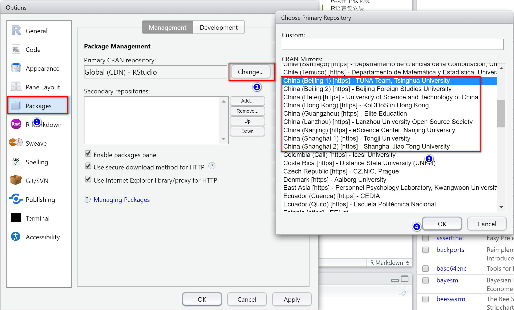
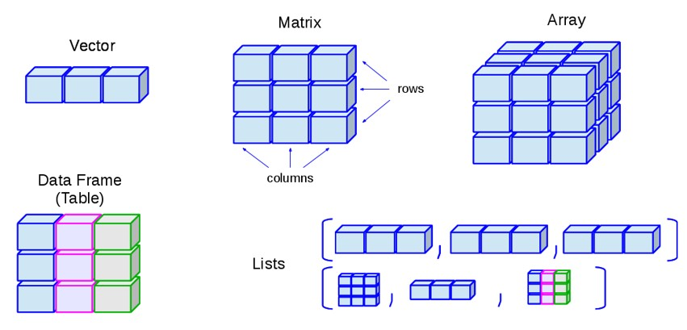
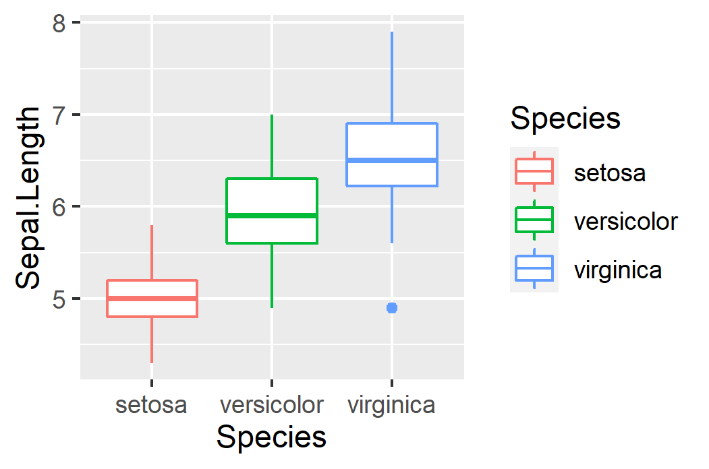

```{r setup, include=F, message=F}
knitr::opts_chunk$set(
	echo=T, comment=NA, message=F, warning=F,
	fig.align="center", fig.width=5, fig.height=3, dpi=300)
```


### 123R简介和统计绘图

> 本节作者：刘永鑫 中国科学院遗传与发育生物学研究所；陈同 中国中医科学院
>
> 版本1.0.2，更新日期：2020年8月31日

> 本项目永久地址： https://github.com/YongxinLiu/MicrobiomeStatPlot ，本节目录 123R，包含R markdown(\*.Rmd)、Word(\*.docx)文档、测试数据和结果图表，欢迎广大同行帮忙审核校对、并提修改意见。提交反馈的三种方式：1. 公众号文章下方留言；2. 下载Word文档使用审阅模式修改和批注后，发送至微信(meta-genomics)或邮件(metagenome@126.com)；3. 在Github中的Rmd文档直接修改并提交Issue。审稿人请在创作者登记表 https://www.kdocs.cn/l/c7CGfv9Xc 中记录个人信息、时间和贡献，以免专著发表时遗漏。

本文教程的源代码见123R简介和统计绘图.Rmd，实战代码详见R.Rmd。

#### 为什么要学习R


图. R常用图形 https://www.r-graph-gallery.com/ 

##### 为什么选择R？ 

- 多领域的资源， CRAN收录16170个R包 (20年9月1日)，涵盖了统计学、经济学、生态学、进化生物学、生物信息学、物理、化学等多学科。
- 跨平台， R可在多个主流操作系统下运行，包括Windows、MacOS和Linux。
- 命令行驱动 R即时解释，输入命令，即可获得相应的结果，满足在绘图中及时修改的需要。

##### R语言优势

- 统计分析能力突出，部分统计功能整合在R语言的底层，但大多数数据分析和可视化功能则以包(packages)的形式提供，资源极其丰富
- R具有强大的数据可视化能力，高质量的图像输出工具以及多种现代绘图系统： 如grid， lattice， ggplot2等
- 扩展和开发能力，在R中可使用简洁的方式编写新的统计方法，甚至整合进其他语言编写的应用程序内。也可以编制自己的函数，或制作独立的统计分析包，快速实现新算法
- 灵活，作为一种平台，方便与其他工具整合，实现数据分析流程化
- 自由、免费、源代码开放，与多数商业统计软件相比，R是完全免费的，它囊括了在其他软件中尚不可用的且先进的统计计算例程(类似于函数，但含义更为丰富，如API接口)，是一个可进行交互式数据分析和探索的高自由度平台


##### R语言缺点

- 学习曲线陡峭：因为其功能丰富，导致对应帮助文件较多，而由独立贡献者编写的部分模块则较零散难以完全掌握，初学者刚开始与代码打交道，需要记住大量常用命令，无疑提高学习难度。
- 需要大量计算资源：所有的待处理数据通常需要全部读入内存后才能处理，因此不适合分析超大规模的数据。
- 运行速度稍慢：即时编译，效率约相当于C语言的1/20。


##### R排名


图. R语言世界使用率2020年8月排名 https://www.tiobe.com/tiobe-index/

目前R语言是世界上最受欢迎的10大语言之一。而且近些年始终处于上升阶段，截止2020年8月位于用户使用率榜单的第8位，较去年同期使用人数近乎翻倍。特别是在生命科学领域，被认为是使用频率最高的语言。其用户主要集中于专业领域，目前在移动设备、网页中使用率较低，但随着云端计算平台的发展，便携式移动端也是R未来的发展方向。

#### R语言统计绘图实战

##### R软件下载安装

R语言 https://www.r-project.org

Rstudio编程集成开发环境(IDE，Integrated Development Environment) https://www.rstudio.com

RStudio是一款R语言的IDE，R自带的环境操作较为复杂，而RStudio很好地解决了该问题，而且它还具有调试、可视化等功能，支持纯R脚本、Rmarkdown (脚本文档混排)、Shiny (交互式网络应用)等。

具体安装和配置步骤，详见：


- [121个人电脑搭建微生物组分析平台(Win/Mac)](https://mp.weixin.qq.com/s/Z8ZSJYkfFXv9mdE_eTrT8Q)


图. RStudio界面。主要分为4个区域。

- 左上-代码编辑区：编辑和修改代码并可及时保存，也可以对单行或选择区域运行特定代码，减少代码复制粘贴的操作。
- 右上-环境变量/历史区：环境(Environment)面板显示当前加载的函数和变量的基本信息，如类型、维度等，还可以鼠标点击查看详细信息，点击数据表会在代码编辑区创建新面板预览。历史面板则显示之前运行过的所有代码和操作。
- 左下-代码执行区：可以随时在此处执行代码，在代码编辑区选择并运行的代码也会显示在此处。
- 右下-文件/图形预览区：文件(Files)面板是一个资源管理器，可以浏览文件并打开，在RStudio server版本中还有文件上传和下载的功能。绘图(Plots)面板为图形预览区，可显示绘图代码的结果，还提供了图片放大，保存为指定尺寸和类型的功能。包(Packages)面板显示己安装的包，并可手动勾选加载或卸载，也可以进行包的安装和升级。


##### R语言包安装

R包主要来源CRAN，Bioconductor和Github三个网站。

- CRAN包安装

CRAN是R官方包的发布网站，安装方法如下：以绘图包ggplot2为例。

    install.packages("ggplot2")

R包默认覆盖安装，反复运行上述代码会多次下载该包并重新安装，不仅非常浪费时间，而且有时还会破坏原有包导致无法正常使用。推荐大家安装包时采用如下条件判断方法安装：即使用requireNamespace()函数判断目标包是否存在，如不存在时才安装。

```{r}
if (!requireNamespace("ggplot2", quietly=TRUE))
  install.packages("ggplot2")
```

在RStudio中默认使用美国数据源，如果下载慢，可指定国内镜像，如清华、中科大等离自己物理距离较近的国内镜像仓库。



图. R包安装源的选择。选择Tools菜单 —— Global Options选项，按上图标识顺序切换为国内源。

也可以在代码层面指定安装源，如清华镜像源"https://mirrors.tuna.tsinghua.edu.cn/CRAN"。

```{r}
site="https://mirrors.tuna.tsinghua.edu.cn/CRAN"
if (!requireNamespace("ggplot2", quietly=TRUE))
  install.packages("ggplot2", repos=site) 
```

- CRAN来源包的菜单安装

使用RStudio中的包管理页面安装：


1. 选择右下角 Packages选项卡，
2. 点击Install；
3. 输入包名，会有提示，可供选择；
4. 点击Install安装。

- Bioconductor包安装

Bioconductor是专门发布生信相关R包的网站，目前已经发了1903个R包。

网址：https://bioconductor.org

安装Bioconductor的包，需要先安装CRAN来源的BiocManager包，此处以edgeR为例。注：edgeR是当前较流行的具有测序数据差异比较功能的R包。

```{r}
# 检查BiocManager包是否存在，不存在则安装
if (!requireNamespace("BiocManager", quietly = TRUE))
    install.packages("BiocManager")
# 使用BiocManager安装Bioconductor的包
if (!requireNamespace("edgeR", quietly = TRUE))
    BiocManager::install("edgeR")
```

- Github的R包安装

CRAN和Bioconductor内都是经过检测正式发布的R包。还有很多临时、或正在开发中的包只存在Github，如果需要使用这些R包，我们可以使用开发者工具devtools进行安装。

安装Github的R包，输入名称由用户名和包名两部分组成。以我编写的amplicon包为例，保存于github中的microbiota用户下，其提供了扩增子分析常用统计分析和绘图样式的函数。


```{r}
# 检查devtools是否存在，没有则安装
if (!requireNamespace("devtools", quietly = TRUE))
    install.packages("devtools")
# 加载devtools
library(devtools)
# 判断amplicon是否存在，没有使用devtools安装
if (!requireNamespace("amplicon", quietly = TRUE))
    devtools::install_github("microbiota/amplicon")
```

此外，很多R包的最新版，也都在github上保存，想要体验最新版本的功能，也可查找软件的github仓库位置并采用上述方法安装所需版本。

注意：R的源码方式安装，有时还需要额外安装Rtools。Windows版本下载链接：https://cran.r-project.org/bin/windows/Rtools/

##### R数据基本类型

- 数值型 (numeric)：1, 2, 3, 5.1, 6.6, 1e5等 (绘图时一般作为连续变量对待)
- 字符型 (character)："yongxin", "meta-genome", 'yi sheng xin' (单个或多个字母或其他符号的组合，需要用引号括起) 
- 逻辑型 (logical)：TRUE, FALSE （布尔值），通常缩写为T和F
- 缺失值：NA, NaN, Inf
- 空值：NULL



图. R语言数据结构。向量(vector)、矩阵(matrix)、数组(array)、数据框(data frame / table)、列表(lists)


图. 向量(vector)、列表(lists)、矩阵(matrix)、数据框(data frame / table)的索引方式

- 向量(vector)

向量存储相同的数据类型。如果有字符型元素，所有元素都转换为字符型。

is.atomic() 判断是否为向量。

is.vector() 判断没有属性或仅有names属性的向量为真(TRUE)

```{r, echo=T}
a <- c(1,2,3,4)
# 判断一个变量是不是vector
is.vector(a)
is.atomic(a)
```

- 因子(factor)

因子是节省存储空间的特殊类型，适用于存在较多重复值情况。每个原值只存储一份，在原数据中用数字表示。去重后的原值被称为水平 (level)，可以修改顺序。绘图时调整顺序就是使用的这个。

```{r, echo=T}
a <- c('y','i','s','h','e','n','g','x','i','n')
b <- as.factor(a)
# 注意levels默认是字母顺序
b
```

更改因子的顺序

```{r, echo=T}
# 设置levels
b <- factor(a, 
        levels=c("y","x","s","e","g","i","h","n"),
        ordered=T)
b
```

- 矩阵(matrix)

矩阵是二维的数组(array)，所有元素都是相同类型。可以使用[row, col]索引。

常用矩阵相关函数：

- dim()：获取矩阵的维数
- rowSums(), colSums()：获取行列加和
- max(), min()：获取最大、最小值

```{r, echo=T}
# 矩阵
a <- matrix(1:20,nrow=5,ncol=4,byrow=T)
a
a[3,4]
```

- 列表(list)

列表是不同类型的变量组合在一起，常用于存储各种复杂类型函数或绘图的输出数据。

```{r, echo=T}
ysx_list <- list(web="www.ehbio.com/Training", 
        staff=c("LYX","CL","ZX","CT"),
        contentL=list(R=c("basic","plot"),
                      Linux=c("basic","windows")))
ysx_list
```

- 数据框(dataframe)

数据框，子列表长度一致的特殊list，具有list和matrix的双重特性，通常与matrix可互换。
若在程序运行时碰到"'x' must be matrix"，需要做下as.matrix转换；若是"'x' must be data.frame"，需要做下as.data.frame转换。这里的x是你提供的数据变量。

```{r}
a <- data.frame(staff=c("CT","YX","ZX","CL"), 
                unit=c("Ehbio","IGDB","IM","IM"))
```

- R数据类型 – 查看

1.	storage.mode 查看变量在内存中存储的方式
2.	class 查看对象所属的类
3.	mode 查看对象的类型
4.	typeof 查看对象的类型
5.	str 查看数据结构
6.	summary 查看数据内容总结

查看数据类型

```{r, echo=T}
mode(a)
class(a)
typeof(a)
storage.mode(a)
mode(ysx_list)
class(ysx_list)
class(ysx_list$web)
storage.mode(class(ysx_list$web))
class(ysx_list$staff)
storage.mode(ysx_list$staff)
typeof(2)
typeof(as.integer(2))
```

##### R数据读写

- read.table读入数据存储为数据框

```{r}
df <- read.table("metadata.txt", header=T, row.names=1, sep="\t",stringsAsFactors=T)
head(df)
```

read.table常用的4个参数。输入文件；标题行(header)，可选T/F；行名(row.names)，默认为NULL，通常指定第一列(1)；分隔符(sep)默认为空，通常要指定制表符(\\t)或分号(;)。

其他常用参数：

- 跳过注释行：comment.char = "#"，如果表头包含#且需要读入，可改为空""。
- 是否转换为因子：在3.x版本时默认转换，在4.x时默认不转换，想要转换为因子，需要使用stringsAsFactors=T自动转换。

更多帮助查看?read.table。

- write.table写数据框或矩阵到文件

```{r}
write.table(df, file="metadata.tsv", append=F, quote=F, sep="\t", row.names=T, col.names=T)
```

write.table常用的参数。

- 要保存的变量(x)
- 输出文件名(file)，要使用双引号；
- 追加写入(append)：默认(F)不追加，没文件创建新文件；有文件时将覆盖；想要多次累计写入改为T；
- 引号(quote)：默认为T，每个单元格加双引号，建议改为F；
- 分隔符(sep)默认为空格，通常要指定制表符(\\t)或分号(;)；
- 换行符(eol)：默认为linux换行符(\\n)，当不需要换行时可改为空""；
- 行名(row.names)，默认为T，不需要使用F，否则会出现1/2/3的行编号；
- 列名(col.names)，默认为T，不需要使用F；

##### 统计t-test/anova

- t-test两组比较

我们先随机生成两组数据，然后用T检验进行显著性分析。

```{r}
# rnorm生成以0为均值，1为标准差的10个数
A = rnorm(10)
# rnorm生成以3为均值，1为标准差的10个数
B = rnorm(10, 3, 1)
# t检验
t.test(A, B)
```
- anova多组比较

```{r}
data(iris) # 加载R内容测试数据——鸢尾花数据
head(iris) # 显示数据格式
# anova统计不同物种花萼长宽数据
model = aov(Sepal.Length ~ Species, data=iris)
Tukey_HSD <- TukeyHSD(model, ordered = TRUE, conf.level = 0.95) # TukeyHSD检验
# 显示统计结果
Tukey_HSD$Species
```

##### 箱线图展示组间差异

library加载ggplot2包，采用内置鸢尾花数据绘制箱线图，并用ggsave保存为指定大小的PDF矢量图。

```{r}
library(ggplot2)
# ggplot命令绘图，指定数据、x、y、颜色、图表类型
(p = ggplot(iris, aes(x=Species, y=Sepal.Length, color=Species)) +
    geom_boxplot())
# ggsave保存图片
ggsave(paste0("26boxplot.pdf"), p, width=89, height=59, units="mm")
ggsave(paste0("26boxplot.png"), p, width=89, height=59, units="mm", dpi=300)
```


更多ggplot2的内容，请阅读ggplot2作者Hadley Wickham编写的《ggplot2 Elegant Graphics for Data Analysis》。此书2016年由Springer出版，目前已经被引用2万余次。本书的最新版及源代码详见：https://github.com/hadley/ggplot2-book

此外公众号也分享过学习ggplot2绘图基础笔记如下，供参考：

- [ggplot2高效实用指南 (可视化脚本、工具、套路、配色)](https://mp.weixin.qq.com/s/f0AUkeTry5oT4F-wm79wVg)
- ggplot2地理信息可视化 [上](https://mp.weixin.qq.com/s/OqO3IgW7qaEzih905xFglQ) [下](https://mp.weixin.qq.com/s/lqdfoiIAxkIU1YPqhopzVQ)
- [1初识ggplot2绘制几何对象](http://mp.weixin.qq.com/s/mY3GTSH8gGUymCfIlw-3Pw)
- [2图层的使用—基础、加标签、注释](https://mp.weixin.qq.com/s/X3rn8w1DGPoVrAdInYHgpw)
- [3工具箱—误差线、加权数、展示数据分布](http://mp.weixin.qq.com/s/lGVgCsm1sMRdVOUJWiJQTg)
- [4语法基础](https://mp.weixin.qq.com/s/TPFLeasq8Ij2iqgXbx1cpA)
- [5通过图层构建图像](http://mp.weixin.qq.com/s/lh37uz8XwmAbtOVrZX4BJw)
- [6标度、轴和图例](https://mp.weixin.qq.com/s/Za0Eoc5eN_N-VhjhI47Pgg)
- [7定位-分面和坐标系](https://mp.weixin.qq.com/s/Ez_eyu6nPUMolrJ_S4JExQ)
- [8主题设置、存储导出](https://mp.weixin.qq.com/s/xg7cggq45tBI0EQUSxPKFw)
- [9绘图需要的数据整理技术](https://mp.weixin.qq.com/s/7eXMJldxZC2BmKKvkGPIPQ)
- [ggThemeAssist：鼠标调整ggplot2主题，不用再记这些代码啦！](https://mp.weixin.qq.com/s/NWXvuTNAgjW3_EzT5J01Zw)
- [不需要懂得编程，但却可以使用ggplot2画出论文级别的图？esquisse](https://mp.weixin.qq.com/s/exxIC3r9IoHXkSLmd1Qz-Q)
- [ggplot版本的华夫饼图吧](https://mp.weixin.qq.com/s/1Ak9YN0Q1U3VsEJG9Nxb4A)


#### 参考文献

- ggplot2 Elegant Graphics for Data Analysis https://github.com/hadley/ggplot2-book

- 宏基因组R相关教程 https://mp.weixin.qq.com/s/5jQspEvH5_4Xmart22gjMA

- 生信宝典R系列教程 http://mp.weixin.qq.com/s/i71OMaUu6QtcY0pt1njHQA 

> 责编：刘永鑫 中科院遗传发育所

> 版本更新历史

> 1.0.0，2020/8/30，刘永鑫，初稿

> 1.0.1，2020/8/31，吴翔宇 宁波大学，全文校对

> 1.0.3，2020/8/31，刘永鑫，整合校对
