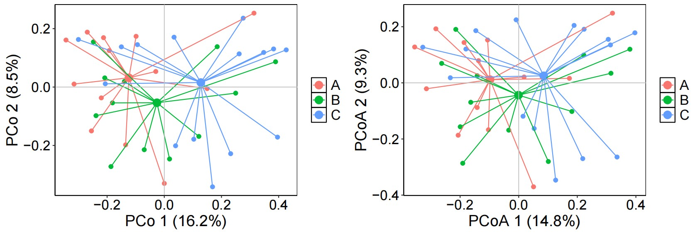

```{r setup, include=FALSE}
knitr::opts_chunk$set(
	echo=T, comment=NA, message=F, warning=F,
	fig.align="center", fig.width=5, fig.height=3, dpi=300)
```


### 测序数据批次效应观察及去除
Observation and removal of batch effects in sequencing data

> 本节作者：白德凤：中国农业科学院深圳基因组研究所
> Author: Defeng Bai Agricultural Genomics Institute at Shenzhen, Chinese Academy of Agricultural Sciences
>
> 版本1.0.0，更新日期：2024年4月24日
>Version 1.0.0, updated on April 24, 2024


### 批次效应的产生和去除
The generation and removal of batch effects

批次效应(Batch effect)往往是不同时间、不同操作者、不同试剂、不同仪器导致的实验误差，与研究中的生物或科学变量无关。其可能扭曲生物学差异。
Batch effects are often experimental errors caused by different times, operators, reagents, and instruments, and are not related to biological or scientific variables in the study. It may distort biological differences.

批次效应的特点包括：1.数据不一致性：批次效应导致同样的生物样本在不同批次中产生不一致的测量结果。2.掩盖生物学信号：批次效应可能掩盖了真实的生物学差异。3.增加噪声：批次效应增加了数据的噪声，降低了实验的灵敏度和准确性。4.降低可重复性：如果批次效应没有被适当地控制和校正，那么实验的可重复性和可比性将会降低。

The characteristics of batch effects include: 1. Data inconsistency: Batch effects result in inconsistent measurement results for the same biological sample in different batches. 2. Masking biological signals: Batch effects may mask true biological differences. 3. Increase noise: The batch effect increases the noise in the data, reducing the sensitivity and accuracy of the experiment. 4. Reduce repeatability: If batch effects are not properly controlled and corrected, the reproducibility and comparability of the experiment will be reduced.

目前已经开发出一些方法针对不同类型的测序数据进行批次效应去除。相关的软件或分析方法包括MMUPHin, Limma, emoveBatchEffect, ComBat, Surrogate Variable Analysis和PLASDA-batch等，这里介绍利用R语言中的MMUPHin软件包进行批次效应的观察和去除。

Currently, some methods have been developed to remove batch effects on different types of sequencing data. Related software or analysis methods include MMUPHin, Limma, removeBatchEffect, ComBat, Surrogate Variable Analysis, and PLASDA batch. Here, we introduce the use of the MMUPHin software package in R language for observing and removing batch effects.


导入软件包
Load packages

```{r setup2, include=FALSE}
knitr::opts_chunk$set(echo = TRUE)
#devtools::install_bitbucket("biobakery/mmuphin@master")

library(MMUPHin) ## 用于微生物组数据meta分析的软件包(A software package for meta-analysis of microbiome data)
library(magrittr) ## R语言中的管道操作符 https://zhuanlan.zhihu.com/p/347900986 (Pipeline operators in R language)
library(dplyr) ## 数据处理软件包 (Data processing software package)
library(ggplot2) ## 绘图软件包 (Drawing software package)
library(vegan) ## 数据分析软件包 (Data analysis software package)
# 载入设置和函数, 这里主要用到了里面的main_theme绘图
#Load settings and functions, mainly using the main_theme drawing inside
#source("script/stat_plot_functions.R")
```


#### 去除批次效应
Remove batch effects

```{r Remove batch effects, include=TRUE}
# Load metadata
# 导入metadata数据
meta.all <- read.csv(file = 'data/group.csv', stringsAsFactors = FALSE, header = TRUE, row.names = 1, check.name = FALSE)
# rownames(meta.all) <- meta.all$Run
meta.all$StudyID <- factor(meta.all$StudyID)

# Import relative abundance data of bacterial species
# 导入细菌物种相对丰度数据
feat.abu <- read.table(file = "data/species.txt", sep = "\t", header = TRUE, check.names = FALSE)

# Sum of Species
# 计算每个Species微生物相对丰度之和，避免有重复Species统计
feat.abu <- aggregate(. ~ Species, data = feat.abu, sum)
rownames(feat.abu) <- feat.abu$Species
feat.abu <- feat.abu[, -1]

# Ensure feat.abu columns match meta.all rownames
feat.abu <- feat.abu[, rownames(meta.all)]

# Replace NA values with 0 and scale the data
# 替换NA值为0并对数据进行缩放
feat.abu[is.na(feat.abu)] <- 0
feat.abu <- feat.abu / 100

# Zero-inflated empirical Bayes adjustment of batch effect in compositional feature abundance data
# 对成分特征丰度数据进行零膨胀经验贝叶斯批次效应调整
fit_adjust_batch <- adjust_batch(
  feature_abd = feat.abu,
  batch = "StudyID",
  covariates = c("Group", "Gender", "Age"),
  data = meta.all,
  control = list(verbose = FALSE)
)

# Adjusted feature abundance data
# 调整后的特征丰度数据
npc_abd_adj <- fit_adjust_batch$feature_abd_adj
npc_abd_adj <- npc_abd_adj * 100

# Save adjusted data to CSV
# 将调整后的数据保存为CSV文件
# write.csv(npc_abd_adj, 'data_npc271/MMUPHin_result/NPC_Bacteria_Species_ra_npc_abd_adj_gender_age.csv')
write.csv(npc_abd_adj, 'results/aSpecies_ra_npc_abd_adj_gener_age_new100.csv')

```


#### 批次效应图示
Batch Effect Diagram

```{r Plot Effect}
# Load packages
# 加载所需包
library(vegan, quietly = TRUE)
library(ggplot2)
library(dplyr)
library(tidyverse)
library(ggthemes)
library(ggpubr)
library(vegan)
library(UpSetR)
library(ggsci)
library(doBy)

# Dissimilarity Indices for Community Ecologists
# 为群落生态学家计算相异性指数
D_before <- vegdist(t(feat.abu))  # 默认计算Bray–Curtis距离 (Bray-Curtis distance as default)
D_after <- vegdist(t(npc_abd_adj))

# Permutational Multivariate Analysis of Variance Using Distance Matrices
# 置换多元回归方差分析
set.seed(1)
fit_adonis_before <- adonis2(D_before ~ StudyID, data = meta.all, permutations = 999, method="bray", binary=F)

# PCoA before batch correction
# 批次矫正前的PCoA分析
feat.abu2 <- as.data.frame(t(feat.abu))
dune_dist_before <- vegdist(feat.abu2, method="bray", binary=F)
dune_pcoa_before <- cmdscale(D_before, k= (nrow(feat.abu2) - 1), eig = TRUE, add = TRUE)
dune_pcoa_points_before <- as.data.frame(dune_pcoa_before$points)
sum_eig_before <- sum(dune_pcoa_before$eig)
eig_percent_before <- round(dune_pcoa_before$eig / sum_eig_before * 100, 1)
colnames(dune_pcoa_points_before) <- paste0("PCoA", 1:3)
dune_pcoa_result_before <- cbind(dune_pcoa_points_before, meta.all)

# Plot PCoA before batch correction
# 绘制批次矫正前的PCoA图
p1 <- ggplot(dune_pcoa_result_before, aes(x=PCoA1, y=PCoA2, color = Group, shape = StudyID)) +
  geom_point(size=2) +
  scale_shape_manual(values = c(15, 10, 17, 18, 19, 8, 25, 3)) +
  labs(x=paste("PCoA 1 (", eig_percent_before[1], "%)", sep=""),
       y=paste("PCoA 2 (", eig_percent_before[2], "%)", sep="")) +
  theme_classic()

plot1 <- ggscatter(dune_pcoa_result_before, x= "PCoA1", y = "PCoA2", color="StudyID",
                   mean.point = TRUE, star.plot = TRUE, ggtheme = theme_minimal()) +
  labs(x=paste("PCo 1 (", eig_percent_before[1], "%)", sep=""),
       y=paste("PCo 2 (", eig_percent_before[2], "%)", sep="")) +
  theme_classic() +
  geom_vline(xintercept = 0, color = 'gray', size = 0.4) + 
  geom_hline(yintercept = 0, color = 'gray', size = 0.4) +
  theme(panel.grid = element_line(color = 'black', linetype = 2, size = 0.1), 
        panel.background = element_rect(color = 'black', fill = 'transparent'), 
        legend.title = element_blank()) +
  theme(axis.title = element_text(size = 18, colour="black"),
        axis.text = element_text(size = 16, colour = "black"),
        legend.text = element_text(size = 16))

# Print the results of permutation multiple regression analysis of variance after batch correction
# 打印批次矫正后的置换多元回归方差分析的结果
set.seed(1)
fit_adonis_after <- adonis2(D_after ~ StudyID, data = meta.all, permutations = 999, method="bray")

# PCoA after batch correction
# 批次矫正后的PCoA分析
npc_abd_adj2 <- as.data.frame(t(npc_abd_adj))
dune_dist_after <- vegdist(npc_abd_adj2, method="bray", binary=F)
dune_pcoa_after <- cmdscale(D_after, k= (nrow(npc_abd_adj2) - 1), eig = TRUE, add = TRUE)
dune_pcoa_points_after <- as.data.frame(dune_pcoa_after$points)
sum_eig_after <- sum(dune_pcoa_after$eig)
eig_percent_after <- round(dune_pcoa_after$eig / sum_eig_after * 100, 1)
colnames(dune_pcoa_points_after) <- paste0("PCoA", 1:3)
dune_pcoa_result_after <- cbind(dune_pcoa_points_after, meta.all)

# Plot PCoA after batch correction
# 绘制批次矫正后的PCoA图
p2 <- ggplot(dune_pcoa_result_after, aes(x=PCoA1, y=PCoA2, color = Group, shape = StudyID)) +
  geom_point(size=2) +
  scale_shape_manual(values = c(15, 10, 17, 18, 19, 8, 25, 3)) +
  labs(x=paste("PCo 1 (", eig_percent_after[1], "%)", sep=""),
       y=paste("PCo 2 (", eig_percent_after[2], "%)", sep="")) +
  theme_classic() +
  stat_ellipse(level=0.95, linetype = 2, size=0.7, aes(color=Group), alpha=0.8)

plot2 <- ggscatter(dune_pcoa_result_after, x= "PCoA1", y = "PCoA2", color="StudyID",
                   mean.point = TRUE, star.plot = TRUE, ggtheme = theme_minimal()) +
  labs(x=paste("PCoA 1 (", eig_percent_after[1], "%)", sep=""),
       y=paste("PCoA 2 (", eig_percent_after[2], "%)", sep="")) +
  theme_classic() +
  geom_vline(xintercept = 0, color = 'gray', size = 0.4) + 
  geom_hline(yintercept = 0, color = 'gray', size = 0.4) +
  theme(panel.grid = element_line(color = 'black', linetype = 2, size = 0.1), 
        panel.background = element_rect(color = 'black', fill = 'transparent'), 
        legend.title = element_blank()) +
  theme(axis.title = element_text(size = 18, colour="black"),
        axis.text = element_text(size = 16, colour = "black"),
        legend.text = element_text(size = 16))

# Combine plots
# 合并图形
library(patchwork)
p_all <- p1 + p2
ggsave(p_all, file = "results/Compare01.pdf", width = 289, height = 150, unit = 'mm')

p_all2 <- plot1 + plot2
ggsave(p_all2, file = "results/Compare04.pdf", width = 289, height = 100, unit = 'mm')

# Print the results of permutation multiple regression analysis of variance after batch correction
# 打印批次矫正后的置换多元回归方差分析的结果
#print(fit_adonis_after$aov.tab)

# Alternatively, MMUPHin packages can be directly used to correct batch effects and obtain differences in microbial communities
# 也可以直接利用MMUPHin包矫正批次效应然后得到菌群差异
# lm_meta函数：Covariate adjusted meta-analytical differential abundance testing
# fit_meta <- lm_meta(feature_abd = feat.abu,
#                     exposure = "Group",
#                     batch = "StudyID",
#                     covariates = c("Gender", "Age"),
#                     control = list(rma_method="HS", transform="AST"),
#                     data = meta.all)
# meta_results <- fit_meta$meta_fits
# maaslin_results <- fit_meta$maaslin_fits

# Export results
# 导出结果
# write.csv(meta_results, 'data_npc271/MMUPHin_result/NPC_Bacteria_Species_ra_unadj_MMUPHin_result_gender_age.csv')
# write.csv(maaslin_results, 'data_npc271/MMUPHin_result/NPC_Bacteria_Species_ra_unadj_MMUPHin_maaslin_result_gender_age.csv')

```


