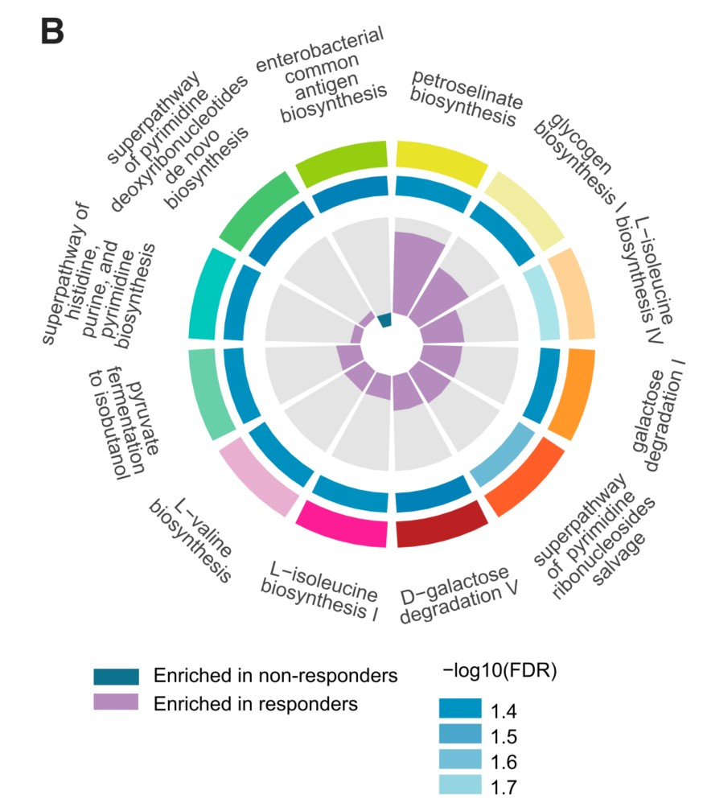
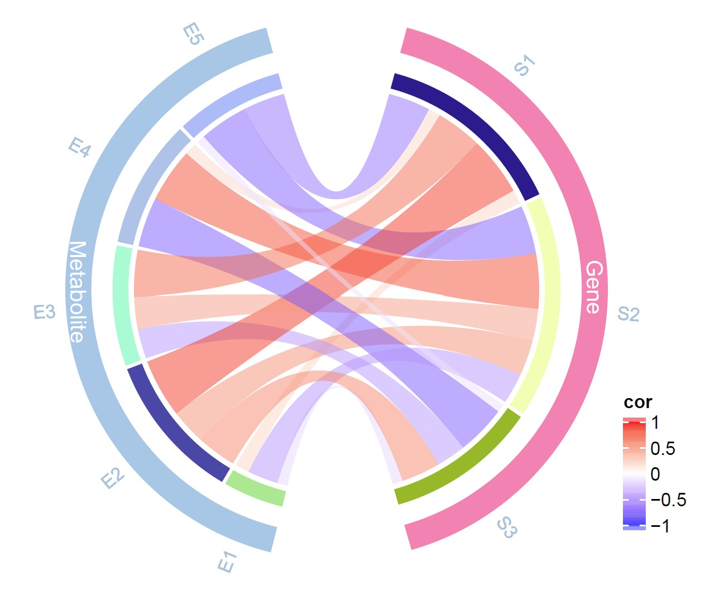
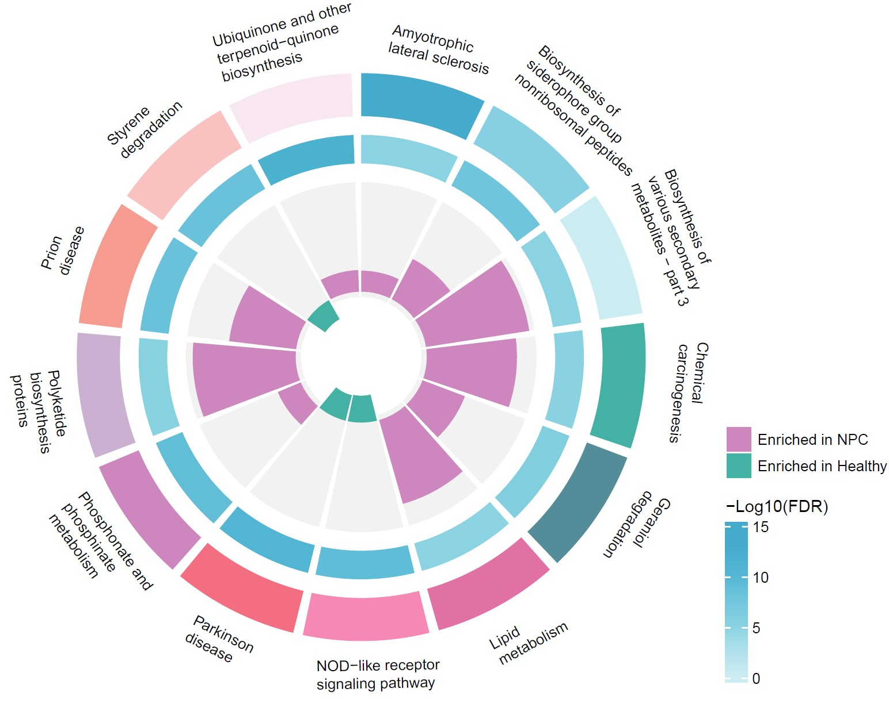

```{r setup, include=FALSE}
knitr::opts_chunk$set(
	echo=T, comment=NA, message=F, warning=F,
	fig.align="center", fig.width=5, fig.height=3, dpi=300)
```

### 弦图在微生物研究中的应用
The Application of Chord Diagram in Microbial Research

什么是弦图？
What is a chord diagram?
弦图（Chord Diagram)，在图论中，任意长度大于3的环都有一个弦的图称为弦图。一般是用来表示多个元素之间的联系，弦图一般分为两个部分：外部的节点和内部的弦。其中节点表示源数据，弦表示数据之间的联系，弦的粗细表示数据联系的强弱。
Chord Diagram, in graph theory, is a graph in which any ring with a length greater than 3 has a chord. It is generally used to represent the connections between multiple elements, and a chord diagram is generally divided into two parts: external nodes and internal strings. The nodes represent the source data, the strings represent the connections between the data, and the thickness of the strings represents the strength of the data connections.


### 弦图案例
Chord Diagram Case

##### 例1：多组学相关性网络弦图
Example 1: Chord diagram of multi omics correlation network

本文是中国农业大学Ren Fazheng团队在2019年的一项发表于Gut microbiota（Wang et al., 2019）的工作。研究异常的肠道微生物群改变了宿主的代谢组对人类和啮齿类动物肾功能衰竭的影响。在图3A中用到弦图展示多组学数据之间的相关性。

This article is a work by Ren Fazheng's team from China Agricultural University, published in Gut microbiota (Wang et al., 2019) in 2019. The study investigated the impact of abnormal gut microbiota on the host's metabolome on renal failure in humans and rodents. In Figure 3A, a chord diagram is used to demonstrate the correlation between multiple omics data.


图3 a-b ESRD患者和健康对照组的肠道微生物组、血清和粪便代谢组的所有变量的组间相关性网络。顶点表示组学变量，线表示在|ρ|>0.35和q<0.01时具有显著的Spearman相关系数。
Figure 3 a-b The interomics correlation networks of all variables for the gut microbiome, serum and faecal metabolomes of patients with ESRD and healthy controls . Vertices indicate omics variables,
and lines indicate a significant Spearman correlation coefficient at |ρ|>0.35 and q<0.01.

**结果**：
To further explore the links between gut microbiota and the metabolome composition, we carried out interomics correlation analysis of abundances of gut MGSs, serum and faecal metabolites. Tight connections were identified in both patients with ESRD and healthy controls (figure 3A,B). However, the ESRD correlation network was clearly different from that of healthy controls, as only ~12% of correlations were common (online supplementary figure 11A–C). Notably, uraemic toxins and bile acids accounted for 95.0% of serum metabolite correlations in patients with ESRD, substantially more than that in healthy controls (69.3%; online supplementary figure 11D,E). Nevertheless, correlations between MGSs, uraemic toxins and bile acids were conserved in the two groups, as regards both the direction (positive or negative) and strength, slightly higher in controls (online supplementary figure 11F,G), further supporting the finding that gut microbiome impacts the levels of these compounds and thus progression of the disease.

为了进一步探索肠道微生物群与代谢组组成之间的联系，我们对肠道MGSs、血清和粪便代谢产物的丰度进行了组间相关性分析。ESRD患者和健康对照组均发现紧密连接（图3A、B）。然而，ESRD相关性网络与健康对照组明显不同，因为只有约12%的相关性是常见的（在线补充图11A-C）。值得注意的是，尿毒症毒素和胆汁酸占ESRD患者血清代谢产物相关性的95.0%，远高于健康对照组（69.3%；在线补充图11D，E）。然而，在两组中，MGSs、尿毒症毒素和胆汁酸之间的相关性在方向（阳性或阴性）和强度方面都是保守的，在对照组中略高（在线补充图11F，G），这进一步支持了肠道微生物组影响这些化合物水平从而影响疾病进展的发现。


##### 例2：圆圈图展示疾病组和健康组KEGG功能通路差异
Example 2: Circle chart showing the differences in KEGG functional pathways between the disease group and the healthy group

本文是上海交通大学Chen Haoyan课题组于2023年发表于Cell Host & Microbe上的一篇文章用到的圆圈图，展示KEGG功能通路差异。题目为：Multi-kingdom gut microbiota analyses define bacterial-fungal interplay and microbial markers of pan-cancer immunotherapy across cohorts。

This article is a circle chart used by Chen Haoyan's research group at Shanghai Jiao Tong University in an article published in Cell Host&Microbe in 2023, showcasing the differences in KEGG functional pathways. The title is: Multi kingdom gut microbiota analyses define bacterial empty interplay and microbial markers of pan cancer immune across cohorts.


Figure 6 (B) Differentially abundant pathways between responders and non-responders when pooling 4 datasets with anti-PD-1 monotherapy. The inner circle shows the generalized fold change of pathways. The median circle shows -log10(FDR) value. The significance was determined using Wilcoxon rank-sum test blocked for study, and p values were adjusted by FDR method.
图 6 (B)将 4 个抗 PD-1 单药治疗的数据集汇总后，应答者和非应答者之间存在不同的丰富通路。内圈表示通路的广义折叠变化。中值圆表示-log10(FDR)值。显著性采用 Wilcoxon 秩和检验进行判定，P 值采用 FDR 方法进行调整。

原文描述：At the pathway level, petroselinate biosynthesis and glycogen biosynthesis showed the highest enrichment in responders (Figure 6B).
在通路水平上，反应物中岩榆酸生物合成和糖原生物合成的富集程度最高（图 6B）。


### 弦图实现

Chord plot using R software

使用R语言软件包circlize中的函数chordDiagram()即可绘制出弦图

The chord diagram can be drawn using the function chordDiagram() in the R language package circle

得到的图包括：最外层的标签为变量名，有刻度的坐标轴展示关联性(值越大表示关联性越强)，内侧有颜色的环形区块代表变量，中央连接各个七块的连接条带表示各个变量之间的关联情况。下图以S1为例，其Links数值的总和为35，所有外层刻度值的范围是--35；S1-E1间的Links数据为1，所以条带非常细，只占坐标轴上的一格。

The obtained graph includes: the outermost label is the variable name, a scaled coordinate axis displays correlation (the larger the value, the stronger the correlation), a colored circular block on the inner side represents the variable, and a connecting strip connecting the seven blocks in the center represents the correlation between the variables. Taking S1 as an example, the total value of its Links is 35, and the range of all outer scale values is -35; The links data between S1-E1 is 1, so the bands are very thin and only occupy one grid on the coordinate axis.

```{r chord, include=TRUE}
# install.packages("circlize")
library(circlize) # 载入软件包
# 导入或构建数据
# Load data
mydata <- data.frame(Start = rep(c("S1", "S2", "S3"), 5),
                     End = c("E1", "E2", "E3", "E4", "E5"),
                     Links = 1:15)
# 绘制弦图
# Chord plot
chordDiagram(mydata)
circos.clear() 
# 设置参数对图进行调整
# Set parameters to adjust the graph
chordDiagram(mydata,
             grid.col = c(S1 = "lightcoral", S2 = "coral2", S3 = "coral4",# 圆环的颜色(The color of the ring)
                          E1 = "lightgreen", E2 = "green", E3 = "green3", E4 = "green4", E5 = "olivedrab4"),
             annotationTrack = c("name", "grid"), # 显示变量名称及圆环，无坐标轴(Display variable names and circles, no coordinate axis)
             col = hcl.colors(15), # 条带的颜色(The color of the stripes)
             transparency = 0.5,   # 透明度(Transparency)
             directional = 1,      # 条带的方向(The direction of the strip)
             link.lwd = 1,         # 条带边框的宽度(Width)
             link.lty = 2,         # 条带边框的类型(Type)
             link.border = 1)      # 条带边框的颜色(Color)
circos.clear()

```


用弦图展示不同组之间的正负相关性
Show the positive and negative correlations between different groups using a chord diagram

此处得到的图除了上图中的元素外，外部增加了大分组的颜色环状标注，内层关系条带变成了样本之间的正负相关性，并显示渐变的图例。

The graph obtained here, in addition to the elements in the above figure, has added color circular annotations for large groups on the outside, and the inner layer relationship strip has become a positive and negative correlation between samples, displaying a gradient legend.

```{r chord2, include=TRUE}
# 导入或构建数据
# Load data
mydata2 <- data.frame(Start = rep(c("S1", "S2", "S3"), 5),
                     End = c("E1", "E2", "E3", "E4", "E5"),
                     Links = runif(15, min = -1, max = 1))
col_fun <- colorRamp2(c(-1, 0, 1), c("blue", "white", "red"), transparency = 0.5)
set.seed(112)
pdf("chord_cor01.pdf",width = 9.5,height = 5)
# circos.clear()
circos.par(start.degree = 75)
# 绘制弦图
# Chord plot
chordDiagram(mydata2,
             big.gap = 30,
             col = col_fun,
             annotationTrack = "grid",
             preAllocateTracks = list(
    track.height = max(strwidth(unlist(dimnames(mydata2))))))
# 添加外部分组颜色环
# Add external grouping color ring
highlight.sector(mydata2$Start, track.index = 1, col = "#fc82b2",
                 text = "Gene", cex = 1, text.col = "white",
                 niceFacing = TRUE, padding = c(-.3, 0, -.2, 0))
highlight.sector(mydata2$End, track.index = 1, col = "#a3c6e7",
                 text = "Metabolite", cex = 1, text.col = "white",
                 niceFacing = TRUE, padding = c(-.3, 0, -.2, 0))
# 增加label注释，把label放在分组track外部
# Add label comments and place the label outside the grouping track
circos.trackPlotRegion(track.index = 1, panel.fun = function(x, y) {
    xlim = get.cell.meta.data("xlim")
    ylim = get.cell.meta.data("ylim")
    sector.name = get.cell.meta.data("sector.index")

    circos.text(mean(xlim), ylim[1] + 1, sector.name,
              facing = "clockwise", niceFacing = TRUE, adj = c(0, 0.5), cex=0.8)

}, bg.border = NA)
# 修改label颜色
# Change lable color
circos.trackPlotRegion(track.index = 1, panel.fun = function(x, y) {
    xlim = get.cell.meta.data("xlim")
    ylim = get.cell.meta.data("ylim")
    sector.name = get.cell.meta.data("sector.index")
    if (startsWith(sector.name, "Gen")) {
        circos.text(mean(xlim), ylim[1] + 1, sector.name,
              facing = "clockwise", niceFacing = TRUE, adj = c(0, 0.5), cex=0.8,
              col = "#fc82b2")
    } else {
        circos.text(mean(xlim), ylim[1] + 1, sector.name,
              facing = "clockwise", niceFacing = TRUE, adj = c(0, 0.5), cex=0.8,
              col = "#a3c6e7")}
    }, bg.border = NA)
dev.off()

# 增加渐变色图例，不同颜色代表正负相关，颜色深浅代表正负相关的强弱
# Add gradient color legend, where different colors represent positive and negative correlations, and color depth represents the strength of positive and negative correlations
pdf("Chord_plot_legend01.pdf", height = 3, width = 2)
library(ComplexHeatmap)
lgd_links = Legend(at = c(-1, -0.5, 0, 0.5, 1), col_fun = col_fun,
                   title_position = "topleft", title = "cor")
grid.draw(lgd_links)
dev.off()

```




### 圆圈图实现
Circle chart using R software

差异分析并计算Generalized fold change
Differential analysis and calculation of generalized fold change

```{r Raw level pathways difference heatmap}
library(DESeq2)
library(dplyr)
library(purrr)
# 779 samples
data <- read.table("pathway_raw.txt",header = TRUE,row.names = 1,sep = "\t")
group <- read.table("group779_2.txt",header = FALSE,sep = "\t")
group = group[-1,]

# 计算KEGG raw
# Calculate KEGG raw
row=as.numeric(length(row.names(data)))
col=as.numeric(length(colnames(data)))
col_sum=rep(colSums(data), row)
col_sum=matrix(col_sum, nrow = col, ncol = row)
data2=data/t(col_sum)
data22 = data2

data2 = log10(data2 + 1e-8)
data3 = apply(data2, 1, function(x){
  return((x-mean(x))/sd(x))
})
data3 = t(data3)
data <- t(data3)
data1 <- data.frame(data,group$V2)
colnames(data1) <- c(colnames(data),"Group")
data1$Group <- as.factor(data1$Group)

# wilcox test
diff <- data1 %>% 
    select_if(is.numeric) %>%
    map_df(~ broom::tidy(wilcox.test(. ~ Group,data = data1, conf.int = TRUE)), .id = 'var')
diff$padjust <- p.adjust(diff$p.value,"BH")

feat.all1 <- data22
feat.all2 <- feat.all1
feat.all2 <- as.matrix(feat.all2)

meta = group
colnames(meta) <- c("Sample_ID", "group")
rownames(meta) <- meta$Sample_ID

library(dplyr)
result_list <- list()
for (f in row.names(feat.all2)) {
  # other metrics
  x <- feat.all2[f, meta %>% filter(group=='NPC') %>% pull(Sample_ID)]
  y <- feat.all2[f, meta %>% filter(group=='Healthy') %>% pull(Sample_ID)]
  
  # FC
  q.p <- quantile(log10(x+1e-8), probs=seq(.1, .9, .05))
  q.n <- quantile(log10(y+1e-8), probs=seq(.1, .9, .05))
  fc <- sum(q.p - q.n)/length(q.p)
  #print(fc)
  result_list[f] <- list(col1 = fc)
}
result_df2 <- do.call(rbind, lapply(result_list, data.frame))
colnames(result_df2) <- c("gFC")

diff2 <- diff
diff2$gFC <- result_df2$gFC

# res2 <- res[c(-1,-2), ]
res2 <- diff2
rownames(res2) <- res2$var
res2$gFC <- result_df2$gFC
res2$log2gFC <- log2(res2$gFC+1)

# 火山图
# Volcano plot
DEG2<-res2
# logFC_cutoff<-2
gFC_cutoff <- 0.2
DEG2$change2<-as.factor(ifelse(DEG2$padjust<1e-5&abs(DEG2$gFC)>gFC_cutoff,
                             ifelse(DEG2$gFC>gFC_cutoff,"UP","DOWN"),
                             "NOT"))
this_title <- paste0('Cutoff for gFC is ',round(gFC_cutoff,3),
                     '\nThe number of up gene is ',nrow(DEG2[DEG2$change2 =='UP',]) ,
                     '\nThe number of down gene is ',nrow(DEG2[DEG2$change2 =='DOWN',]))
DEG2<-na.omit(DEG2)
library(ggplot2)
ggplot(data=DEG2,aes(x=gFC,
                    y=-log10(padjust),
                    color=change2))+
  geom_point(alpha=0.8,size=3)+
  labs(x="gFC")+ ylab("-log10 FDR")+
  ggtitle(this_title)+theme_bw(base_size = 20)+
  theme(plot.title = element_text(size=15,hjust=0.5),)+
  scale_color_manual(values=c('#a121f0','#bebebe','#ffad21')) -> p2
p2
# write.csv(DEG2, "pathway_raw_difference_selectedO01.csv")

```


选取差异最显著的通路用圆圈图进行展示
Select the path with the most significant difference and display it in a circle chart
NPC KEGG

```{r pressure, echo=TRUE}
pdf("pathway_circle_plot3.pdf", height = 5, width = 7)
# 读取数据
# Load data
dat <- read.delim('pathway_npc.txt', sep = '\t', row.names = 1, stringsAsFactors = FALSE, check.names = FALSE)
# 首先排序，默认按照原表格中的排列顺序
# Sort first, default to the original order in the table
dat$Path2 <- factor(rownames(dat), levels = rownames(dat))
# 加载 circlize 包
# Load package
library(circlize)

# 整体布局
# Overall layout
circos.par(gap.degree = 2, #gap.after = 2, 
           track.margin = c(0.04, 0.01), 
           start.degree = 90)
# 第一圈，绘制 ko
# First circle, draw ko
# Select the mapping dataset and define the total number range of genes in the ko block
# plot_data <- dat[c('Path2', 'gene_num.min', 'gene_num.max')]  
plot_data <- dat[c('Path2','gene_num_min', 'gene_num_max')]

# ko_color <- c(rep('#F7CC13', 15), rep('#954572', 2), rep('#0796E0', 3))  #Set color
ko_color <- c('#0ca9ce', '#78cfe5', '#c6ecf1','#00b1a5', "#448c99",'#eb6fa6', '#ff88b5','#ff6f81', '#d386bf','#cdb1d2', '#ff9c8f', '#ffc2c0','#fae6f0')
 
circos.genomicInitialize(plot_data, plotType = NULL, major.by = 1)  #Overall layout
circos.track(
    # 圈图的高度、颜色等设置
    # The height, color, and other settings of the circle chart
    ylim = c(0, 1), track.height = 0.15, bg.border = NA, bg.col = ko_color,  
    panel.fun = function(x, y) {
        #ylim、xlim 用于指定 ko id 文字标签添加的合适坐标
        #Ylim and xlim are used to specify the appropriate coordinates for adding ko id text labels
        ylim = get.cell.meta.data('ycenter')  
        xlim = get.cell.meta.data('xcenter')
        #sector.name 用于提取 ko id 名称
        #Sector.name is used to extract the ko id name
        sector.name = get.cell.meta.data('sector.index')  
        #circos.axis(h = 'top', labels.cex = 0.4, major.tick.percentage = 0.4, labels.niceFacing = FALSE)  #绘制外周的刻度线(Draw outer scale lines)
        #将 ko id 文字标签添加在图中指定位置处
        #Add the ko id text label to the designated location in the image
        circos.text(xlim, ylim, sector.name, cex = 0.4, niceFacing = FALSE)  
    } )

# 第二圈，绘制富集的基因和富集 p 值
# In the second circle, draw the enriched genes and enriched p-values
# 选择作图数据集，包括富集基因数量以及 p 值等信息
# 选择作图数据集，包括富集基因数量以及 p 值等信息
plot_data <- dat[c('ko.id', 'gene_num_min', 'gene_num_rich', 'log10p')]
# 标签数据集，仅便于作图时添加相应的文字标识用
# Label dataset, for the purpose of adding corresponding text labels during drawing
label_data <- dat['gene_num_rich']  
# 定义一个 p 值的极值，以方便后续作图
# Define an extremum of p-value to facilitate subsequent plotting
p_max <- round(max(dat$'log10p')) + 1  
# 这两句用于定义 p 值的渐变颜色
# These two sentences are used to define the gradient color of the p-value
colorsChoice <- colorRampPalette(c('#c6ecf1', '#0ca9ce')) 
color_assign <- colorRamp2(breaks = 0:p_max, col = colorsChoice(p_max + 1))
 
circos.genomicTrackPlotRegion(
    # 圈图的高度、颜色等设置(The height, color, and other settings of the circle chart)
    plot_data, track.height = 0.13, bg.border = NA, stack = TRUE,  
    panel.fun = function(region, value, ...) {
        #区块的长度反映了富集基因的数量，颜色与 p 值有关
        #The length of the block reflects the number of enriched genes, and the color is related to the p-value
        circos.genomicRect(region, value, col = color_assign(value[[1]]), border = NA, ...)
        #同上文，ylim、xlim、sector.name 等用于指定文字标签（富集基因数量）添加的合适坐标
        #As mentioned earlier, ylim, xlim, sector.name, etc. are used to specify the appropriate coordinates for adding text labels (enriching the number of genes)
        ylim = get.cell.meta.data('ycenter')  
        xlim = label_data[get.cell.meta.data('sector.index'),1] / 2
        sector.name = label_data[get.cell.meta.data('sector.index'),1]
        #circos.text(xlim, ylim, sector.name, cex = 0.4, niceFacing = FALSE) 
    } )

# 第四圈，绘制富集因子
# Fourth circle, draw enrichment factors
plot_data <- dat[c('Path2','gene_num_min', 'gene_num_max', 'gFC')]  
# 将通路的分类信息提取出，和下一句一起，便于作图时按分组分配颜色
# Extract the classification information of the pathway and combine it with the next sentence to facilitate color allocation by grouping during drawing
label_data <- dat['change3'] 
# color_assign <- c('Metabolism' = '#F7CC13', 'Environment Information Processing ' = '#954572', 'Organismal Systems' = '#0796E0')
color_assign <- c("UP" = "#d386bf", "DOWN" = "#00b1a5")

circos.genomicTrack(
    plot_data, ylim = c(0, 1), track.height = 0.4,  bg.col = 'gray95', bg.border = NA, 
    panel.fun = function(region, value, ...) {
        sector.name = get.cell.meta.data('sector.index') 
        circos.genomicRect(region, value, col = color_assign[label_data[sector.name,1]], border = NA, ytop.column = 1, ybottom = 0, ...)
        #circos.lines(c(0, max(region)), c(0.5, 0.5), col = 'gray', lwd = 0.3)  
    })
dev.off()

pdf("pathway_circle_plot_legend.pdf", height = 3, width = 2)
updown_legend <- Legend(
    labels = c('Enriched in NPC', 'Enriched in Healthy'), 
    type = 'points', pch = NA, background = c('#d386bf', '#00b1a5'), 
    labels_gp = gpar(fontsize = 8), grid_height = unit(0.5, 'cm'), grid_width = unit(0.5, 'cm'))
 
pvalue_legend <- Legend(
    col_fun = colorRamp2(round(seq(0, p_max, length.out = 6), 0), 
    colorRampPalette(c('#c6ecf1', '#0ca9ce'))(6)),
    legend_height = unit(3, 'cm'), labels_gp = gpar(fontsize = 8), 
    title_gp = gpar(fontsize = 9), title_position = 'topleft', title = '-Log10(FDR)')
 
lgd_list_vertical <- packLegend(updown_legend, pvalue_legend)
grid.draw(lgd_list_vertical)
dev.off()

```



