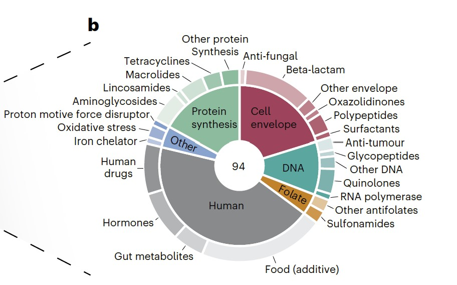

```{r setup, include=FALSE}
knitr::opts_chunk$set(
	echo=T, comment=NA, message=F, warning=F,
	fig.align="center", fig.width=5, fig.height=3, dpi=300)
```


### 旭日图在微生物研究中的应用
The Application of Sunburst Chart in Microbial Research

什么是旭日图？
What is the sunburst chart?

旭日图（Sunburst Chart），其实是一种特殊的饼图或环状图，常用于展示数据的多层数据结构关系。
The Sunburst Chart is actually a special type of pie chart or circular chart commonly used to display the multi-level data structure relationships of data.


### 旭日图案例
Case study of the Sunburst Chart

本文是Ana Rita Brochado团队2024年发表在Nature Microbiology（Brenzinger et al., 2024）上的一篇论文用到的旭日图。题目：The Vibrio cholerae CBASS phage defence system modulates resistance and killing by antifolate antibiotics. 

This article is a sunrise chart used by Ana Rita Brocado's team in a paper published in Nature Microbiology (Brenzinger et al., 2024) in 2024. Title: The Vibrio cholerae CBASS phase defense system modulates resistance and killing by antagonistic antibiotics


Figure 1 b, Composition of the compound library tested in this study. Compounds are classified by target (in the case of antimicrobials, inner ring) and compound class (outer ring).
图1B，本研究中测试的化合物库的组成。化合物按目标（在抗菌药物的情况下，内环）和化合物类别（外环）进行分类。

**结果**：
We sought to systematically investigate the impact of CBASS on antimicrobial activity by assessing bacterial growth of wild-type (WT) V. cholerae and CBASS operon-deleted (ΔCBASS) strains in the presence of 94 small molecules, including antibiotics, human drugs, human endogenous metabolites, and food additives (Fig. 1b and Supplementary Table 1).
我们试图通过评估野生型（WT）霍乱弧菌和CBASS操纵子缺失（ΔCBASS）菌株在94种小分子（包括抗生素、人类药物、人类内源性代谢产物和食品添加剂）存在下的细菌生长，系统地研究CBASS对抗微生物活性的影响（图1b和补充表1）。


### 旭日图R语言实现
Implementation of Sunburst Chart using R software

绘制饼图
Draw a pie chart
参考：https://mp.weixin.qq.com/s/xUQM-1h-OeeWGjJlRw3d_g

```{r, include=TRUE}
# 载入软件包
# Load packages
library(ggplot2)
library(dplyr)

# 构建数据
# Building data
count.data <- data.frame(
  class = c("1st", "2nd", "3rd", "Crew"),
  n = c(325, 285, 706, 885),
  prop = c(14.8, 12.9, 32.1, 40.2)
)
count.data

# 计算标签位置
# Add label position
count.data <- count.data %>%
  arrange(desc(class)) %>% # 重排序 (reorder)
  mutate(lab.ypos = cumsum(prop) - 0.5 * prop) # 计算标签位置 (calculate label position)
count.data

# 绘制饼图
# Draw a pie chart
mycols <- c("#0073C2FF", "#EFC000FF", "#868686FF", "#CD534CFF")
ggplot(count.data, aes(x = "", y = prop, fill = class)) +
  geom_bar(width = 1, stat = "identity", color = "white") +
  coord_polar("y", start = 0) +
  geom_text(aes(y = lab.ypos, label = prop), color = "white") +
  scale_fill_manual(values = mycols) +
  theme_void()

# 空心饼图
# Hollow Pie Chart
ggplot(count.data, aes(x = 2, y = prop, fill = class)) +
  geom_bar(stat = "identity", color = "white") +
  coord_polar(theta = "y", start = 0) +
  geom_text(aes(y = lab.ypos, label = prop), color = "white") +
  scale_fill_manual(values = mycols) +
  theme_void() +
  xlim(1, 2.5)

```


使用ggplot2包作图
Drawing using ggplot2 package
参考：https://mp.weixin.qq.com/s/19clA4xZqoAl7KuY96ZJjQ?search_click_id=9261072915409092102-1714444702544-1010392356

```{r ggplot2, include=TRUE}
# 加载包
# Load packages
library(ggplot2)
# install.packages("formattable") # 安装不成功从官网下载包安装
library(formattable)

# 加载数据
# Load data
df <- read.table("data.txt", header = 1, check.names = F, sep = "\t")
# head(df)

# 根据不同分组计算值及标签位置
# Calculate values and label positions based on different groups

## group1
# 使用aggregate函数计算每个组的值和
# Use the aggregate function to calculate the values of each group
data1 <- aggregate(value ~ group1, df, sum)
# 计算相对丰度
# Calculate relative abundance
data1$Rel <- data1$value / sum(data1$value)
# 转换为百分比
# Convert to percentage
data1$per <- percent(data1$Rel, 1)
data1$group1 <- factor(data1$group1, levels = c("g1", "g2", "g3", "g4", "g5"))
# 确定标签位置
# Determine label position
data1$ymax <- cumsum(data1$Rel)
data1$ymin <- c(0, head(data1$ymax, n = -1))
data1$labelposition <- (data1$ymax + data1$ymin) / 2

## group2
data2 <- aggregate(value ~ group2, df, sum)
data2$Rel <- data2$value / sum(data2$value)
data2$per <- percent(data2$Rel, 1)
data2$group2 <- factor(data2$group2, levels = c("A", "B", "C"))
data2$ymax <- cumsum(data2$Rel)
data2$ymin <- c(0, head(data2$ymax, n = -1))
data2$labelposition <- (data2$ymax + data2$ymin) / 2

## group3
data3 <- aggregate(value ~ group3, df, sum)
data3$Rel <- data3$value / sum(data3$value)
data3$per <- percent(data3$Rel, 1)
data3$group3 <- factor(data3$group3, levels = c("G1", "G2"))
data3$ymax <- cumsum(data3$Rel)
data3$ymin <- c(0, head(data3$ymax, n = -1))
data3$labelposition <- (data3$ymax + data3$ymin) / 2

# 绘制圆环图
# Draw a circular diagram
p1 <- ggplot(data1, aes(ymax = ymax, ymin = ymin, xmax = 3, xmin = 2)) +
  geom_rect(aes(fill = group1)) +
  geom_text(x = 2.5, aes(y = labelposition, label = paste0(group1, "\n(", per, ")")), size = 4, color = "black") +
  xlim(1, 3) +
  coord_polar(theta = "y") +
  theme_void() +
  theme(legend.position = "none") +
  scale_fill_manual(values = c("#ffaaaa", "#ffc2e5", "#ebffac", "#c1f1fc", "#00c7f2"))
p1

# 在环图中间增加空白间隔
# Add blank intervals in the middle of the loop diagram
p2 <- p1 + ylim(0, 1.1)
p2

# 绘制双环图
# Draw a double loop diagram
p3 <- ggplot() +
  geom_rect(data = data2, aes(ymax = ymax, ymin = ymin, xmax = 2, xmin = 0, fill = group2), color = "white", linewidth = 1) +
  geom_rect(data = data1, aes(ymax = ymax, ymin = ymin, xmax = 3.5, xmin = 2, fill = group1), color = "white", linewidth = 1, alpha = 0.4) +
  geom_text(data = data2, aes(x = 1, y = labelposition, label = paste0(group2, "\n(", per, ")")), size = 4, color = "black") +
  geom_text(data = data1, aes(x = 2.75, y = labelposition, label = paste0(group1, "\n(", per, ")")), size = 3, color = "black") +
  xlim(0, 3.5) +
  coord_polar(theta = "y") +
  theme_void() +
  theme(legend.position = "none") +
  scale_fill_manual(values = c("A" = "#ffc168", "B" = "#2dde98", "C" = "#1cc7d0", "g1" = "#ffc168", "g2" = "#ffc168", "g3" = "#2dde98", "g4" = "#1cc7d0", "g5" = "#1cc7d0"))
p3

# 在环图中间增加空白间隔
# Add blank intervals in the middle of the loop diagram
p4 <- p3 + ylim(0, 1.1)
p4

# 绘制三环旭日图
# Draw the Sunburst plot of the Three Rings
p5 <- ggplot() +
  geom_rect(data = data3, aes(ymax = ymax, ymin = ymin, xmax = 2, xmin = 0, fill = group3), color = "white", linewidth = 1) +
  geom_rect(data = data2, aes(ymax = ymax, ymin = ymin, xmax = 3.5, xmin = 2, fill = group2), color = "white", linewidth = 1, alpha = 0.6) +
  geom_rect(data = data1, aes(ymax = ymax, ymin = ymin, xmax = 5, xmin = 3.5, fill = group1), color = "white", linewidth = 1, alpha = 0.3) +
  geom_text(data = data3, aes(x = 1, y = labelposition, label = paste0(group3, "\n(", per, ")")), size = 3.5, color = "black") +
  geom_text(data = data2, aes(x = 2.75, y = labelposition, label = paste0(group2, "\n(", per, ")")), size = 3, color = "black") +
  geom_text(data = data1, aes(x = 4.25, y = labelposition, label = paste0(group1, "\n(", per, ")")), size = 3, color = "black") +
  xlim(0, 5) +
  coord_polar(theta = "y") +
  theme_void() +
  theme(legend.position = "none") +
  scale_fill_manual(values = c("G1" = "#ff4e00", "G2" = "#01cd74", "A" = "#ff4e00", "B" = "#ff4e00", "C" = "#01cd74", "g1" = "#ff4e00", "g2" = "#ff4e00", "g3" = "#ff4e00", "g4" = "#01cd74", "g5" = "#01cd74"))
p5

# 在环图中间增加空白间隔
# Add blank intervals in the middle of the loop diagram
p6 <- p5 + ylim(0, 1.1)
p6

```
