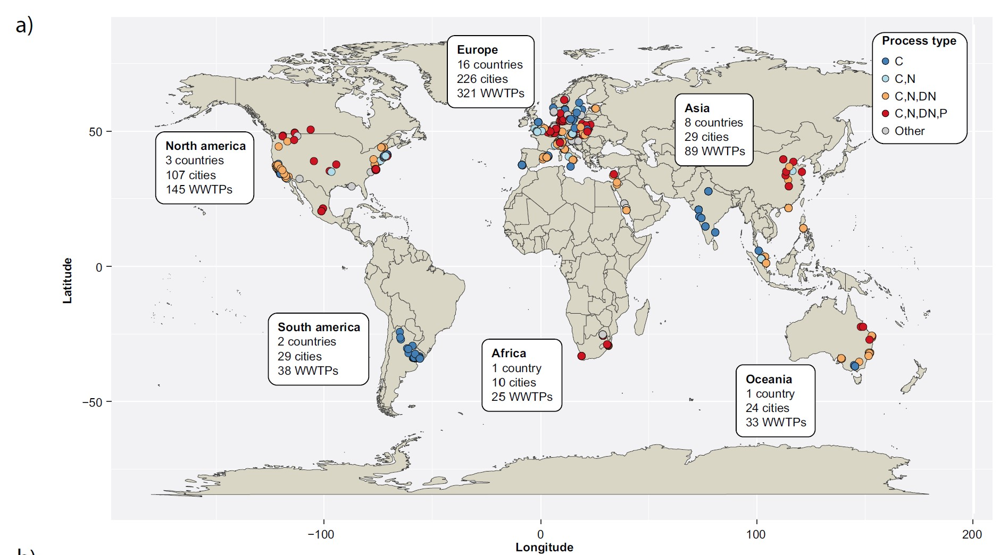
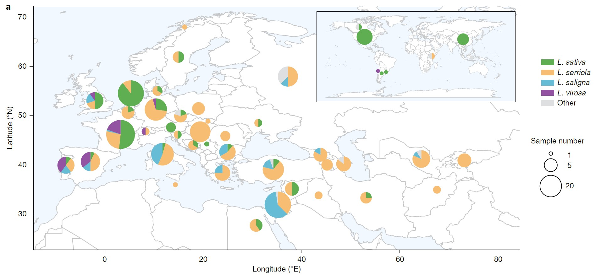
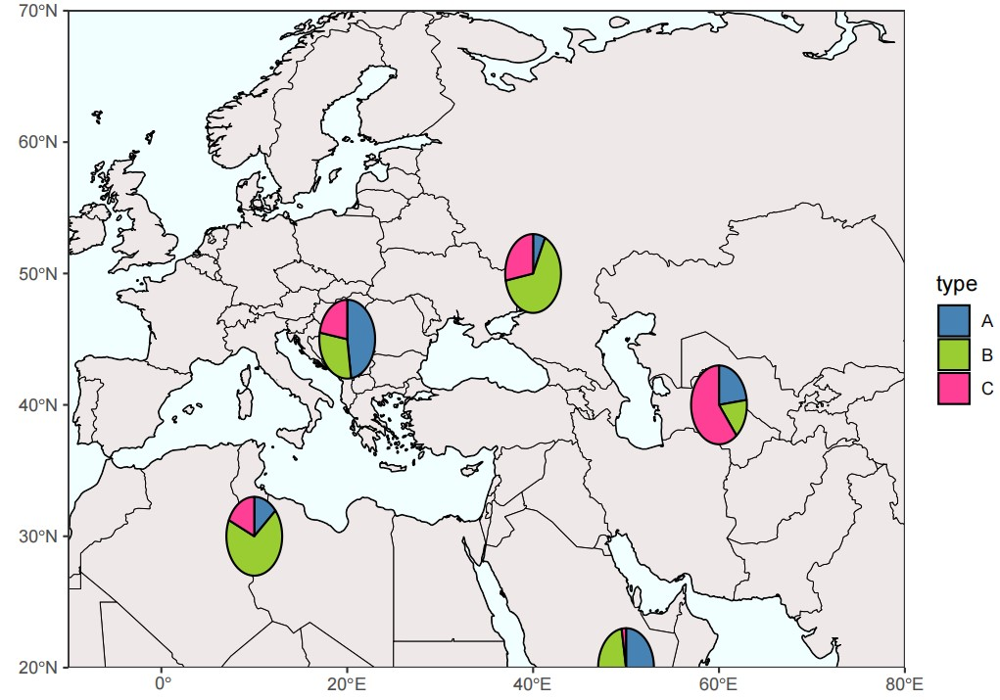
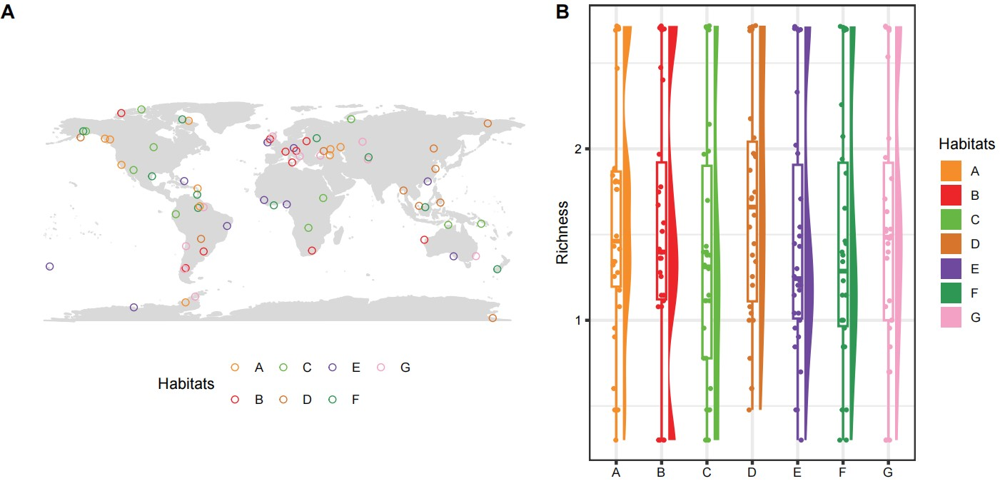

```{r setup, include=FALSE}
knitr::opts_chunk$set(
	echo=T, comment=NA, message=F, warning=F,
	fig.align="center", fig.width=5, fig.height=3, dpi=300)
```


### 采样点分布地图在微生物研究中的应用
Application of Sampling Point Distribution Map in Microbial Research

采样点分布地图是在地图上展示样本采集的地理信息，同时可以展示不同地理区块采样点的基础信息等。
The distribution map of sampling points displays the geographic information of sample collection on the map, and can also display the basic information of sampling points in different geographical blocks.


### 采样点分布地图案例
Sample point distribution map case study

**案例1**：
**Case 1**:

本文是Per Halkjær Nielsen在2022年发表于Nature Communications上（Dueholm et al., 2022）文章用到的样本分布地图。题目：MiDAS 4: A global catalogue of full-length 16S rRNA gene sequences and taxonomy for studies of bacterial communities in wastewater treatment plants。

This article is a sample distribution map used by Per Halkj æ r Nielsen in his article published in Nature Communications in 2022 (Dueholm et al., 2022). Title: MiDAS 4: A global catalog of full length 16S rRNA gene sequences and taxonomy for studies of bacterial communities in wastewater treatment plants.


Figure 1a Geographical distribution of WWTPs included in the study and their process configuration.
图 1a 研究范围内污水处理厂的地理分布及其工艺配置。

**结果**：
**Result**
Samples were obtained in duplicates from 740 WWTPs in 425 cities, 31 countries on six continents (Fig. 1a).
从六大洲 31 个国家 425 个城市的 740 个污水处理厂重复采集了样本（图 1a）。


**案例2**：
**Case 2 * *:
此图是Huan Liu团队2021年发表于Nature Genetics上（Wei et al., 2021）的文章，其中用到了地图叠加饼图的形式。题目：Whole-genome resequencing of 445 Lactuca accessions reveals the domestication history of cultivated lettuce。

This image is an article published by the Huan Liu team in Nature Genetics in 2021 (Wei et al., 2021), which uses the form of a map overlay pie chart. Title: Whole genome resequencing of 445 Lactuca visits received the domestication history of cultivated legacy.


Figure 1 a, Global distribution and statistics of the Lactuca accessions used in this study. The radius of each pie represents the sample size in each country and the colors indicate the proportions of cultivated lettuce (L. sativa; green), the three main wild relatives (L. serriola (orange), L. saligna (blue) and L. virosa (purple)) and other wild species (gray). The world map was constructed using the R package ggplot2 with the Natural Earth dataset (http://www.naturalearthdata.com).

图 1 a：本研究中使用的莴苣属植物的全球分布和统计数据。每个饼的半径代表每个国家的样本量，颜色表示栽培莴苣（L. sativa；绿色）、三种主要野生近缘种（L. serriola（橙色）、L. saligna（蓝色）和 L. virosa（紫色））以及其他野生物种（灰色）的比例。世界地图使用 R 软件包 ggplot2 和自然地球数据集 (http://www.naturalearthdata.com) 绘制。


**案例3**：
**Case 3 * *:
本文是浙江大学Bin Ma课题组2023年发表于Advanced Science上的一篇论文（Wang et al., 2023），其中用到了地图分布点和云雨图展示不同类型栖息地有害物质的丰度。题目为：Tackling Soil ARG-Carrying Pathogens with Global-Scale Metagenomics。

This article is a paper published by the Bin Ma research group of Zhejiang University in Advanced Science in 2023 (Wang et al., 2023), which uses map distribution points and cloud rain maps to display the abundance of harmful substances in different types of habitats. The title is: Tackling Soil ARG Carrying Pathgenes with Global Scale Metagenomics.


Figure 1 c) Global profile of AP richness for each sample. A total of 1643 samples were collected and filtered to the 1443 samples containing APs. d) Comparison of AP richness (n = 1443) in seven habitats. Each sample is represented by a dot with horizontal jitter for visibility. The horizontal box lines represent the first quartile, the median, and the third quartile. Boxplot midline indicates data median. Different letters indicate statistically significant difference. 

图 1 c) 每个样本的全球 AP 丰富度概况。共收集了 1643 个样本，筛选出含有 AP 的 1443 个样本。 d) 七种生境中 AP 丰富度的比较（n = 1443）。每个样本用一个圆点表示，为便于观察，圆点有水平抖动。水平框线代表第一四分位数、中位数和第三四分位数。方框图中线表示数据中位数。不同字母表示差异具有统计学意义。


### 采样点分布地图R语言代码实现
Implementation of R language code for sampling point distribution map

#### 分组位点地图
Grouping Site Map

```{r map1, include=TRUE}
# 载入需要的软件包
# Load required packages
library(ggplot2)
library(tidyverse)
library(maps)
library(ggtext)

# 绘制空白世界地图
#Draw a blank world map
world <- map_data("world")
world.map <- ggplot() +
  geom_polygon(data = world, aes(x = long, y = lat, group = group), fill = "#dedede") +
  theme_bw() +
  scale_y_continuous(expand = expansion(mult = c(0, 0))) +
  scale_x_continuous(expand = expansion(add = c(0, 0)))

# 读取数据
# Load data
df <- read.csv("figure1df.csv")

# 以Plant_type作为分组进行展示
# Displaying Plant_type as a group
plant_type_map <- world.map +
  geom_point(data = df, aes(x = Longitude, y = Latitude, colour = Plant_type), size = 2) +
  scale_color_manual(values = c("#3373a5", "#97b1c0", "#f8ad63", "#d8191a", "#d8192a", "#c4c4c5", "#c4c4c4"))

# 对Process_type数据分组进行整理后在图上展示
# Organize the Process_type data into groups and display them on the graph
df <- df %>% 
  replace(is.na(.), "Other") %>%
  mutate(Process_type2 = fct_other(Process_type, keep = c("C", "C,N", "C,N,DN", "C,N,DN,P")))

process_type_map <- world.map +
  geom_point(data = df, aes(x = Longitude, y = Latitude, colour = Process_type2), size = 2) +
  scale_color_manual(values = c("#3373a5", "#97b1c0", "#f8ad63", "#d8191a", "#c4c4c4"))

# 添加标签
# add labels
dftext <- data.frame(
  x = c(-180, -150, -10, 100, 50, -50),
  y = c(40, -50, -50, -50, 50, 60),
  label = c("**North America**<br>3 countries<br>107 cities<br>145 WWTPs",
            "**South America**<br>2 countries<br>29 cities<br>38 WWTPs",
            3, 4, 5, 6)
)

# 完整地图
# Whole map
final_map <- process_type_map +
  theme(legend.position = c(0.9, 0.7),
        legend.background = element_rect(fill = "transparent"),
        legend.box.background = element_rect(color = "gray", fill = "transparent"),
        legend.key = element_rect(fill = "transparent")) +
  geom_richtext(data = dftext, aes(x = x, y = y, label = label), nudge_x = 0, hjust = 0, fill = "transparent")

# 保存地图
# Save map
ggsave(filename = "Figure_mp1.pdf", plot = final_map, width = 10, height = 5, useDingbats = FALSE, limitsize = FALSE)


```


#### 地图叠加饼图
Map overlay pie chart

```{r map2, include=TRUE}
# 加载软件包
# Load packages
library(rnaturalearthdata)
library(rnaturalearth)
library(ggplot2)
library(tidyverse)
library(rgeos)
library(scatterpie)

# 获取世界海岸线数据
# Get world coastline data
world <- ne_coastline(scale = "medium", returnclass = "sf")

# 构建绘制饼图数据
# Build and draw pie chart data
d <- data.frame(
  x = sample(seq(10, 60, 10), 5), 
  y = sample(seq(20, 50, 5), 5)
)
d$A <- abs(rnorm(5, sd = 1))
d$B <- abs(rnorm(5, sd = 2))
d$C <- abs(rnorm(5, sd = 3))

# 获取世界地图数据
# Get world map data
wr <- map_data("world")

# 绘制地图
# Draw the map
mp2 <- ggplot(data = world) +
  geom_sf(fill = "red") +
  geom_map(aes(map_id = region), map = wr, data = wr,
           color = "black", fill = "#EEE9E9", size = 0.1) +
  labs(x = "Longitude", y = "Latitude") +
  theme_bw() +
  theme(panel.grid = element_blank(),
        panel.background = element_rect(fill = "#F0FFFF")) +
  labs(x = NULL, y = NULL) +
  coord_sf(xlim = c(-10, 80.00), ylim = c(20.00, 70.00), expand = FALSE) +
  geom_scatterpie(aes(x = x, y = y, r = 3), 
                  data = d, 
                  cols = c("A", "B", "C")) +
  scale_fill_manual(values = c("steelblue", "yellowgreen", "violetred1"))

# 保存地图
# Save the map
ggsave(filename = "Figure_mp2.pdf", plot = mp2, width = 10, height = 5, useDingbats = FALSE, limitsize = FALSE)
# mp2

```




#### 分布点地图结合云雨图
Distribution point map combined with cloud and rain map

```{r map3, include=TRUE}
# maps用于加载世界地图
# Maps is used to load world maps
library(maps)
library(dplyr)
library(ggplot2)

# 获取世界地图数据
# Get world map data
world <- map_data("world")

# 构建一个取样点和生态系统类型数据集
# Build a dataset of sampling points and ecosystem types
set.seed(2344)  # 设置种子以确保结果可重复
train <- sample(nrow(world), 70)
df <- world[train, ]

# 取样点经纬度
# Sampling point longitude and latitude
df$lat <- df$lat + rnorm(length(rownames(df)), 0, 1)
df$long <- df$long + rnorm(length(rownames(df)), 0, 1)

# 添加环境和数值
# Add environment and values
Abundance <- runif(70, min = 0, max = 100)
Habitat <- rep(c("A", "B", "C", "D", "E", "F", "G"), 10)
df_map <- data.frame(df, Abundance, Habitat)

# 绘制世界地图
# Draw a world map
p1 <- ggplot() +
  borders("world", colour = "gray85", fill = "gray85") +
  geom_polygon(fill = "gray50", colour = "gray50", linetype = "dashed") +
  geom_point(data = df_map, mapping = aes(x = long, y = lat, color = Habitat), size = 2, shape = 21) +
  coord_equal() +
  labs(y = "", x = "", color = "Habitats", shape = "Habitats") +
  scale_color_manual(values = c("#F48D2A", "#EB2529", "#67B745", "#D7752D", '#6E499E', "#2D9753", '#F3A1C5')) +
  theme_void() +
  theme(
    panel.grid.major = element_blank(),
    panel.grid.minor = element_blank(),
    legend.position = "bottom",
    legend.direction = "horizontal",
    axis.text = element_text(colour = 'white', size = 11)
  )

# 云雨图可视化病原菌丰度
# Visualization of pathogen abundance in cloud and rain maps
library(ggdist)
library(gghalves)

# 读取测试数据
# Read test data
otu <- read.csv("test/test_otu.csv", row.names = 1)

# 随机构建一个数据框
# Randomly construct a data frame
aa <- data.frame(rep(c("A", "B", "C", "D", "E", "F", "G"), 30), rep(c("Bacteria"), 210))
colnames(aa) <- c("name", "title")
index <- cbind(aa, otu[1:210, ])

# 对数据进行log转化，方便可视化
# Convert data into logs for easy visualization
index$Sample1 <- log10(index$A1 + 1)

# 将柱状图和散点放在一起
# Put the bar chart and scatter plot together
p2 <- ggplot(index, mapping = aes(x = name, y = Sample1, color = name)) +
  geom_boxplot(aes(), position = position_nudge(), linetype = "solid", width = 0.2, size = 0.8) +
  stat_halfeye(mapping = aes(fill = name), width = 0.25, justification = -0.65, .width = 0, point_colour = NA) +
  geom_jitter(position = position_jitter(0.08), size = 1) +
  scale_color_manual(values = c("#F48D2A", "#EB2529", "#67B745", "#D7752D", '#6E499E', "#2D9753", '#F3A1C5')) +
  scale_fill_manual(values = c("#F48D2A", "#EB2529", "#67B745", "#D7752D", '#6E499E', "#2D9753", '#F3A1C5')) +
  labs(x = "", y = "Richness", color = "Habitats", fill = "Habitats") +
  theme_bw(base_line_size = 1.05, base_rect_size = 1.05) +
  theme(axis.text = element_text(colour = 'black', size = 9))

# 拼图
# Combine plots
library(cowplot)
p3 <- cowplot::plot_grid(p1, p2, nrow = 1, rel_widths = c(1.2, 1), labels = LETTERS[1:2])
ggsave(filename = "Figure_mp3.pdf", plot = p3, width = 10, height = 5, useDingbats = FALSE, limitsize = FALSE)
# p3

```


