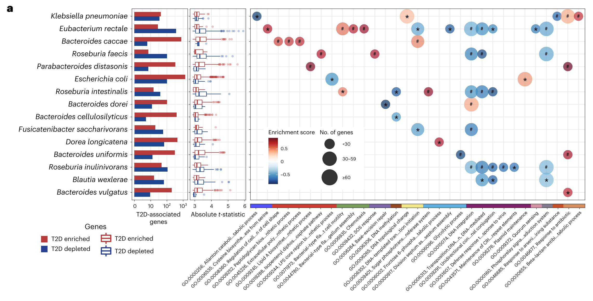
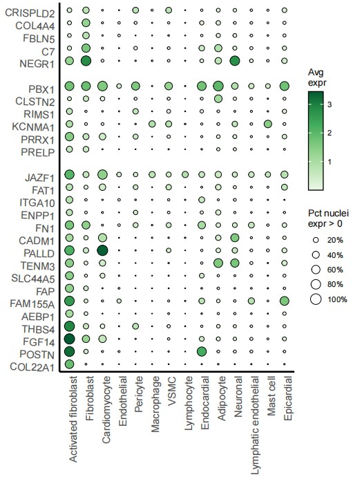
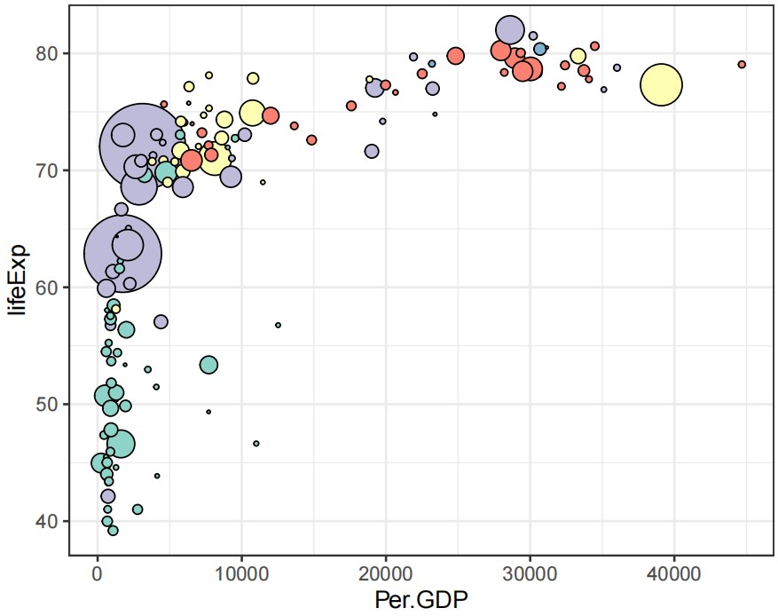

```{r setup, include=FALSE}
knitr::opts_chunk$set(
	echo=T, comment=NA, message=F, warning=F,
	fig.align="center", fig.width=5, fig.height=3, dpi=300)
```


## 气泡图在微生物组数据分析中的应用
The application of bubble chart in microbial data analysis

什么是气泡图？
What is a bubble chart?

气泡图（Bubble Chart）用于呈现三维数据的关系。这种图通常使用气泡的位置、大小和颜色来表示变量之间的关系，使得观察者能够直观的理解复杂数据集。其基本组成由X, Y坐标的位置，气泡的大小和气泡的颜色构成。气泡图的基础是二维平面上的坐标系，其中每个气泡由其在X轴和Y轴上的位置决定。这些坐标可以表示两个变量或维度，例如时间、空间或不同的类别。每个气泡的大小代表了第三个维度的数值，通常气泡越大表示的数值越大。这个大小维度可以表示各种新信息，比如数据点的频率、重要性等。颜色是气泡图中的第三个可用于信息的维度。通过对气泡着色，可以进一步传达关于数据的分类、群组或其他属性的信息。颜色也可以用于强调特定的趋势或模式。
A bubble chart is used to present the relationships of three-dimensional data. This type of graph typically uses the position, size, and color of bubbles to represent the relationships between variables, allowing observers to intuitively understand complex datasets. Its basic composition consists of the position of the X and Y coordinates, the size of the bubbles, and the color of the bubbles. The basis of a bubble chart is a coordinate system on a two-dimensional plane, where each bubble is determined by its position on the X and Y axes. These coordinates can represent two variables or dimensions, such as time, space, or different categories. The size of each bubble represents the numerical value of the third dimension, and usually the larger the bubble, the greater the numerical value. This size dimension can represent various new information, such as the frequency and importance of data points. Color is the third dimension in a bubble chart that can be used for information. By coloring bubbles, information about the classification, grouping, or other attributes of data can be further conveyed. Colors can also be used to emphasize specific trends or patterns.


## 气泡图应用案例
Bubble chart application cases

**案例1**：

这是Wang Shaopu课题组2024年发表于Nature Communications上的文章，第一作者为Zeng Shuqin，题目为：A metagenomic catalog of the early-life human gut virome

This is an article published by Wang Shaopu's research group in Nature Communications in 2024. The first author is Zeng Shuqin, and the title is A metagenomic catalog of the early life human gut virus


Fig. 2 d Dynamics of the relative abundance of viral families in the first two (VLPs, top) or three (bulk, bottom) years of life. Only the viral families with a prevalence >1% in VLPs-enrichedmetagenomes are plotted. For better visualization of the changes of each viral family, viral families are stratified into three groups basedon themean relative abundanceofVLPs-enrichedmetagenomes at each time point (i.e., maximal mean relative abundance ≤1% (left, n = 12, red), maximal mean relative abundance >1% and <40% (middle, n = 11, light green), maximal mean relative abundance ≥40% (right, n = 2, dark green)). The bar plot shows the proportion of relative abundance of all 25 viral families, which are indicated in the legend on the right side. The P values were obtained with linear mixed modeling with “study” as random factor. **** P<0.0001, *** P<0.001, ** P<0.01, * P<0.05.

图2 d生命前两年（VLP，顶部）或三年（体积，底部）病毒家族相对丰度的动态。仅绘制了VLP富集型基因组中流行率>1%的病毒家族。为了更好地显示每个病毒家族的变化，根据每个时间点VLP富集物的平均相对丰度，将病毒家族分为三组（即最大平均相对丰度≤1%（左，n=12，红色），最大平均相对丰富度>1%和<40%（中，n=11，浅绿色），最大相对丰度≥40%（右，n=2，深绿色））。条形图显示了所有25个病毒家族的相对丰度比例，如右侧图例所示。P值是通过以“研究”为随机因素的线性混合模型获得的。***P<0.0001，***P<0.001，**P<0.01，*P<0.05。


**结果**：
Out of 42 viral families with a prevalence >1%, 25 families accounted for >99% ofviral abundance in 1608 VLPs-enriched metagenomes. Of these, five families with significant changes and only Microviridae increased in abundance as infants aged (Fig. 2d). When examining these 25 viral families in bulk metagenomes, 21 families were detected and accounted for >99% of viral abundance in 5990 bulk metagenomes. Of these, 14 families had a statistically significant difference (P< 0.05) in their abundance as infants aged, with half of the families increased, such as Adenoviridae, Duneviridae,and Forsetiviridae; and the other half decreased, such as Siphoviridae, Myoviridae, Microviridae,and Peduoviridae. Furthermore, the mean relative abundance ofForsetiviridae was sparse with <0.3% in the first 12 months, but steadily increased to 0.97 % and 1.24% at months 24 and 36, respectively. Of note, we also found that some families reached the peak in relative abundance at months 1 or 3 (i.e., Myoviridae, Peduoviridae, Rountreeviridae, Siphoviridae) and afterward decreased gradually, showing that certain viral taxa did not change uniformly early in life (Fig. 2d).

在流行率>1%的42个病毒家族中，有25个家族占1608个富含VLP的宏基因组中病毒丰度的99%以上。其中，有五个家族发生了重大变化，只有微小病毒科的数量随着婴儿年龄的增长而增加（图2d）。当在大量宏基因组中检查这25个病毒家族时，检测到21个家族，占5990个大量宏基因组病毒丰度的99%以上。其中，14个家族在婴儿年龄增长时的丰度存在统计学显著差异（P<0.05），其中一半的家族数量增加，如腺病毒科、盾形病毒科和毛喉病毒科；另一半减少，如细胞病毒科、Myoviridae、Microviridae和Pedooviride。此外，前12个月，福氏病毒科的平均相对丰度较低，<0.3%，但在第24个月和第36个月分别稳步增加到0.97%和1.24%。值得注意的是，我们还发现，一些科的相对丰度在第1个月或第3个月达到峰值（即肌病毒科、Pedooviride、Rountreeviridae、Siphoviridae），然后逐渐减少，这表明某些病毒分类群在生命早期并没有发生一致的变化（图2d）。


**案例1**：

这是哈佛大学医学院Dong D. Wang团队2024年发表于Nature Medicine上的一篇论文用到的气泡图，论文题目为：Strain-specific gut microbial signatures in type 2 diabetes identified in a cross-cohort analysis of 8,117 metagenomes



Fig. 5 | Strain-specific gene carriage and biochemistry contribute to the pathogenesis of T2D. a, Many differentially distributed UniRef90 gene families (clustered sets of protein sequences) provide functional explanations for the varying associations of subspecies with T2D. The bar plots show the number of UniRef90 gene families significantly associated with T2D after adaptive filtering. The boxplot presents the distribution of effect sizes (t-statistic) of UniRef90 gene families positively (red) and inversely (blue) associated with T2D in each species. The centers of boxes show the median of the t-statistic, with boxes indicating their IQR, and upper and lower whiskers indicating 1.5× the IQR from above the upper quartile and below the lower quartile, respectively. The right panel shows the results of gene set enrichment analyses based on GO terms and t-statistics from the gene association model in anpan using 1,000 permutations. The bubble plot presents the enrichment scores and size of GO terms. GO terms with a positive normalized enrichment score (NES) contained UniRef90 gene families upregulated in T2D patients. GO terms with a negative NES contained UniRef90 gene families downregulated in T2D patients. All of the results were corrected for multiple hypothesis testing by controlling the FDR using the Benjamini– Hochberg method with a target rate of 0.10. *0.05 ≤ FDR < 0.10; #FDR < 0.05.

图5|菌株特异性基因携带和生物化学有助于T2D的发病机制。a、 许多差异分布的UniRef90基因家族（蛋白质序列的聚类集）为亚种与T2D的不同关联提供了功能解释。条形图显示了自适应滤波后与T2D显著相关的UniRef90基因家族的数量。箱形图显示了每个物种中与T2D呈正相关（红色）和负相关（蓝色）的UniRef90%基因家族的效应大小（t-统计量）的分布。方框的中心显示t统计量的中位数，方框表示其IQR，上须和下须分别表示上四分位数以上和下四分位数以下的IQR的1.5倍。右图显示了基于GO项和t-统计量的基因集富集分析的结果，该分析来自使用1000个排列的anpan中的基因关联模型。气泡图显示GO术语的富集分数和大小。具有正归一化富集评分（NES）的GO术语包含在T2D患者中上调的UniRef90基因家族。NES阴性的GO术语包含在T2D患者中下调的UniRef90基因家族。通过使用Benjamini–Hochberg方法控制FDR（目标比率为0.10），对所有结果进行了多重假设检验校正*0.05≤FDR<0.10#FDR＜0.05。


**结果**：
Complementary to the within-species phylogenetic analysis, we leveraged the UniRef90 data to identify gene families associated with T2D in each species using the gene association model in anpan (Supplementary Table 9 and Methods). Of note, of all of the species with genes differentially distributed between cases and controls, only E. coli was a biomarker species; all other species were not biomarker species (Fig. 5a). This indicates that critical strain-specific functions may have been overlooked by focusing solely on species-level taxonomic features and community-level functions.

作为种内系统发育分析的补充，我们利用UniRef90数据，使用安潘的基因关联模型，在每个物种中鉴定与T2D相关的基因家族（补充表9和方法）。值得注意的是，在病例和对照组之间基因分布差异的所有物种中，只有大肠杆菌是生物标志物物种；所有其他物种都不是生物标志物物种（图第5a段）。这表明，由于只关注物种水平的分类特征和群落水平的功能，关键菌株特异性功能可能被忽视了。

To extend this characterization of strain-specific biological processes across species, we performed a gene set enrichment analysis based on the gene association model results (Fig. 5a, Extended Data Fig. 9 and Supplementary Table 10; Methods). A total of 31 gene ontology (GO) terms were associated with T2D (FDR < 0.10). Extending our findings in E. coli, GO terms related to HGT explained the strain-level diversity in multiple species. In T2D patients, the enriched GO terms encompassed biological processes related to glycolysis, biosynthesis of bacterial structural components, and those crucial for survival in adverse conditions, as well as virulence factor and antibiotic resistance genes. Additionally, taking E. rectale as an example, we found that genes involved in flagellum-dependent cell motility and chemotaxis were more prevalent in T2D patients, indicating strain-specific adaptations to oxidative stress and inflammation in the gut, while the GO term of quorum sensing was enriched in normoglycemic controls, suggesting survival advantages of the strains.

为了在物种间扩展菌株特异性生物过程的特征，我们基于基因关联模型结果进行了基因集富集分析（图5a，扩展数据图9和补充表10；方法）。共有31个基因本体论（GO）术语与T2D相关（FDR<0.10）。扩展我们在大肠杆菌中的发现，与HGT相关的GO术语解释了多个物种中菌株水平的多样性。在T2D患者中，富集的GO术语包括与糖酵解、细菌结构成分的生物合成相关的生物过程，以及在不利条件下生存的关键过程，以及毒力因子和抗生素耐药性基因。此外，以大肠杆菌为例，我们发现参与鞭毛依赖性细胞运动和趋化性的基因在T2D患者中更为普遍，这表明菌株对肠道氧化应激和炎症的特异性适应，而群体感应的GO术语在血糖正常的对照中富集，这表明了菌株的生存优势。


## 气泡图R语言实战
Bubble Chart R Language Practice

示例数据来自于：nature期刊Single-nucleus profiling of human dilated and hypertrophic cardiomyopathy
Example data from: Nature journal Single nucleus profiling of human diluted and hypertrophic cardiopathy
参考：https://mp.weixin.qq.com/s/ebnntaEIwZNuNKuBRpBPNw

实战1
Practice 1

```{r Practice_1, include=TRUE}
# Load required packages
library(ggplot2)
library(dplyr)
library(readxl)

# Load data
sing.df <- read_xlsx("41586_2022_4817_MOESM18_ESM.xlsx")

# Transform factors
sing.df <- sing.df %>%
  mutate(
    Gene = factor(Gene, levels = rev(unique(Gene))),
    CellType = factor(CellType, levels = unique(CellType))
  )

# Define breaks and limits for the y-axis
y_breaks <- c(levels(sing.df$Gene)[1:16], "skip", levels(sing.df$Gene)[17:22], "skip", levels(sing.df$Gene)[23:27])

# Plot
p1 <- ggplot(sing.df, aes(CellType, Gene, fill = Avg_Expr, size = Pct_Expr0)) + 
  geom_point(shape = 21, color = "black") + 
  theme_classic() +  
  scale_y_discrete(breaks = y_breaks) + 
  scale_size_continuous(breaks = seq(0.2, 1, 0.2), limits = c(0, 1), range = c(0, 5.5), labels = scales::percent) + 
  scale_fill_distiller(palette = "Greens", direction = 1) + 
  theme(
    axis.text.x = element_text(angle = 90, size = 12, hjust = 1), 
    axis.text.y = element_text(size = 12, angle = -2, vjust = 1),
    axis.line = element_line(size = 1),
    axis.ticks = element_blank()
  ) + 
  guides(fill = guide_colorbar(ticks = FALSE, barheight = 8, frame.colour = "black")) + 
  labs(x = NULL, y = NULL, fill = "Avg\nexpr", size = "Pct nuclei\nexpr > 0")

# Save plot
ggsave("Bubble_plot01.pdf", plot = p1, width = 6, height = 8)

```




实战2
Practice 2

```{r practice2, include=TRUE}
# Load required packages
library(RColorBrewer)
library(ggplot2)
library(gapminder)
library(dplyr)
library(viridis)

# Convert the gapminder dataset to a data frame
gapminder <- as.data.frame(gapminder)

# Extract data for the year 2002
mydata <- gapminder %>% filter(year == 2002)

# Create the plot
p3 <- ggplot(mydata, aes(x = gdpPercap, y = lifeExp, size = pop, fill = continent)) +
  geom_point(shape = 21, color = "black") + 
  scale_size(range = c(0.1, 18)) + 
  scale_fill_brewer(palette = "Set3") + 
  theme_bw() + 
  labs(x = "Per.GDP", y = "lifeExp", size = "Population", fill = "Continent") + 
  theme(legend.position = "none")

# Save the plot
ggsave("Bubble_plot02.pdf", plot = p3, width = 5, height = 4)

```




实战3
Practice 3

```{r practice3, include=TRUE}
# Load required packages
library(ggplot2)
library(dplyr)
library(scales)
library(RColorBrewer)
library(ggpubr)
library(grid)
library(paletteer)
library(cowplot)
library(magrittr)
library(stringr)
library(egg)

# Load data
dat_gene_num <- read.csv("fig5a_1.csv", header = TRUE)
re_gene_com <- read.csv("fig5a_2.csv", header = TRUE)
re_gsea <- read.csv("fig5a_3.csv", header = TRUE)

# Process data
dat_gene_num <- dat_gene_num %>%
  mutate(bug_name = factor(bug_name, levels = unique(re_gene_com$species_update)))

re_gsea <- re_gsea %>%
  mutate(
    go_id_description = factor(go_id_description, levels = unique(go_id_description)),
    species_update = factor(species_update, levels = rev(unique(species_update))),
    category = factor(category, levels = unique(category)),
    padj_annot1 = case_when(padj >= 0.05 & padj < 0.1 ~ "*", TRUE ~ ""),
    padj_annot2 = case_when(padj < 0.05 ~ "#", TRUE ~ "")
  )

# Define color palettes
breaklist <- seq(-1, 1, by = 0.001)
red_blue <- rev(brewer.pal(n = 11, name = "RdBu"))
col_red_blue <- colorRampPalette(red_blue)(length(breaklist))

col_panel <- c(paletteer::paletteer_d("ggsci::default_igv")[1:15], "grey70", "grey90")
names(col_panel) <- c(
  "Amino acid metabolism", "Bacterial structural components", "Cell motility",
  "DNA replication & transcription", "Fatty acid metabolism", "Genetic Rearrangement",
  "Glucose metabolism", "Phage and HGT", "Proteolysis", "Quorum sensing",
  "DNA methylation", "Signal transduction", "Stress response",
  "Virulence and antibiotic resistance", "Damaged DNA repair", "Other", "Unknown"
)

# Plot gene number bar plot
p_gene_num <- ggplot(dat_gene_num, aes(x = log10(gene_num), y = bug_name, fill = gene_ind)) +
  geom_bar(stat = "identity", position = "dodge", width = 0.7) +
  scale_fill_manual(values = c("#1F4690", "#B73E3E")) +
  labs(x = "T2D-associated genes") +
  theme_bw() +
  theme(
    axis.title.y = element_blank(),
    axis.text.y = element_text(size = 14, face = "italic", color = "black"),
    axis.text.x = element_text(size = 8),
    plot.margin = unit(c(5.5, 1, 5.5, 0), "points"),
    legend.position = "none"
  )

# Plot boxplot
p_box <- ggplot(re_gene_com, aes(y = species_update, x = abs(t_statistic), color = Direction)) +
  geom_boxplot(position = position_dodge(0.7), alpha = 0.3, width = 0.7) +
  scale_color_manual(values = c("#1F4690", "#B73E3E")) +
  labs(x = "Absolute t statistic") +
  theme_bw() +
  theme(
    axis.title.y = element_blank(),
    axis.text.x = element_text(size = 8),
    axis.text.y = element_blank(),
    plot.margin = unit(c(5.5, 1, 5.5, 1), "points"),
    legend.position = "none"
  )

# Plot bubble plot
p_bub <- ggplot(re_gsea, aes(x = go_id_description, y = species_update, color = ES, size = genenum_cat)) +
  geom_point(alpha = 0.7) +
  geom_text(aes(label = padj_annot1), color = "black", size = 7, nudge_y = -0.2) +
  geom_text(aes(label = padj_annot2), color = "black", size = 4, nudge_y = 0) +
  scale_size(range = c(8, 13), breaks = c(1, 2, 3), name = "Num. of Genes") +
  labs(x = "Species", y = "GO term") +
  scale_color_gradientn(colours = col_red_blue, name = "Enrichment score") +
  theme_bw() +
  theme(
    axis.text.y = element_blank(),
    axis.text.x = element_blank(),
    axis.title.y = element_blank(),
    axis.ticks.x = element_blank(),
    axis.title = element_text(size = 13),
    plot.margin = unit(c(5.5, 1, 5.5, 1), "points"),
    legend.position = "none"
  )

# Legend for bubble plot
p_bub_lgd <- ggplot(re_gsea, aes(x = go_id_description, y = species_update, color = ES, size = genenum_cat)) +
  geom_point(alpha = 0.8) +
  scale_size(range = c(8, 13), breaks = c(1, 2, 3), name = "Num. of Genes") +
  geom_text(aes(label = padj_annot1), color = "black", size = 7, nudge_y = -0.2) +
  geom_text(aes(label = padj_annot2), color = "black", size = 4, nudge_y = 0) +
  labs(x = "Species", y = "GO term") +
  scale_color_gradientn(colours = col_red_blue, name = "Enrichment score") +
  theme(
    axis.title.y = element_blank(),
    axis.ticks.x = element_blank(),
    axis.ticks.y = element_blank(),
    axis.text.x = element_text(size = 13, angle = 45, face = "italic", hjust = 1, vjust = 1),
    axis.title = element_text(size = 13),
    axis.title.x = element_blank()
  )
p_bub_legend <- ggpubr::get_legend(p_bub_lgd)

pdf("legend_bubble_plot.pdf", width = 8, height = 5)
grid::grid.draw(p_bub_legend)
dev.off()

# Plot category annotation
breaks_go <- as.character(unique(re_gsea$go_id_description))
labels_go <- ifelse(str_length(breaks_go) < 35, breaks_go, paste0(str_sub(breaks_go, 1, 30), "...", str_sub(breaks_go, -15, -1)))

p_cat <- ggplot(re_gsea, aes(y = 1, x = go_id_description)) +
  geom_tile(aes(fill = category), width = 1) +
  labs(fill = "Category") +
  scale_fill_manual(values = col_panel) +
  coord_cartesian(expand = FALSE) +
  scale_x_discrete(breaks = breaks_go, labels = labels_go) +
  theme_bw() +
  theme(
    panel.grid = element_blank(),
    axis.text.x = element_text(size = 11, angle = 30, vjust = 1, hjust = 1, color = "black"),
    axis.text.y = element_blank(),
    axis.ticks.y = element_blank(),
    axis.title = element_blank(),
    plot.margin = unit(c(0, 5.5, 5.5, 5.5), "points"),
    legend.position = "none"
  )

# Legend for category annotation
p_cat_lgd <- ggplot(re_gsea, aes(x = 1, y = go_id_description)) +
  geom_tile(aes(fill = category), width = 1) +
  labs(fill = "Category") +
  scale_fill_manual(values = col_panel) +
  guides(fill = guide_legend(reverse = FALSE)) +
  theme_bw() +
  theme(
    panel.grid = element_blank(),
    axis.text.y = element_text(size = 12, color = "black"),
    axis.text.x = element_blank(),
    axis.ticks.x = element_blank(),
    axis.title = element_text(size = 13),
    axis.title.x = element_blank()
  )
cat_legend <- cowplot::get_legend(p_cat_lgd)

pdf("go_category_legend.pdf", width = 5, height = 5)
grid::grid.draw(cat_legend)
dev.off()

# Combine all plots into one figure
blank <- ggplot()+theme_void()
pdf("fig5a.pdf", width = 15.5, height = 8)
egg::ggarrange(
  p_gene_num, p_box, p_bub, 
  blank, blank, p_cat,
  nrow = 2, ncol = 3,
  heights = c(5, 0.1),
  widths = c(1, 1, 6)
)
dev.off()

```


