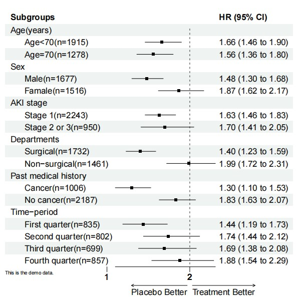
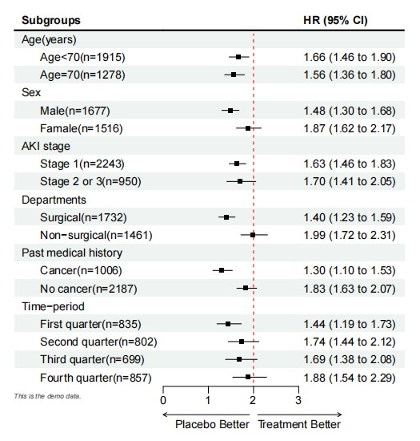

```{r setup, include=FALSE}
knitr::opts_chunk$set(
	echo=T, comment=NA, message=F, warning=F,
	fig.align="center", fig.width=5, fig.height=3, dpi=300)
```


### 森林图在微生物组分析中的应用
The application of forest map in microbial community analysis

什么是森林图？
What is a forest map?
参考：https://mp.weixin.qq.com/s/vwNf_sFlmhp7DeSYaQ3NxQ

森林图是以统计指标和统计分析方法为基础，用数值运算结果绘制出的图形。它在平面直角坐标系中，以一条垂直的无效线（横坐标刻度为1或0）为中心，用平行于横轴的多条线段描述了每个被纳入研究的效应量和置信区间，用一个图形描述了多个研究合并的效应量及置信区间。

A forest map is a graph drawn based on statistical indicators and analysis methods, using numerical operation results. It is in a Cartesian coordinate system, with a vertical invalid line (with a scale of 1 or 0 on the horizontal axis) as the center, and multiple line segments parallel to the horizontal axis are used to describe the effect magnitude and confidence interval of each included study. A graph is used to describe the combined effect magnitude and confidence interval of multiple studies.


### 森林图案例
Forest Plot Case

这是Jakob Stokholm课题组2023年发表于Nature Medicine上的文章，第一作者为Cristina Leal Rodríguez，题目为：The infant gut virome is associated with preschool asthma risk independently of bacteria

This is an article published by the Jakob Stokholm research group in Nature Medicine in 2023. The first author is Cristina Leal Rodr í guez, and the title is: The incident gut virus is associated with pre-school astroma risk independently of bacteria


Fig. 6 | Virome asthma signature score associations with early life exposures. Forest plot showing beta coefficients and P values from two-sided linear regressions with dots indicating the point estimate and horizontal lines the 95% CIs for the association between early life exposures and the 1-year asthma virome signature score. Exposures are sorted by their R2 contribution. For birth season, the baseline was winter; for delivery, the baseline was vaginal birth. BMI, body mass index.

图6|病毒性哮喘特征评分与早期生活暴露的关系。森林图显示了双侧线性回归的β系数和P值，点表示点估计值，水平线表示早期暴露与1年哮喘病毒组特征评分之间相关性的95%置信区间。风险敞口按其R2贡献进行排序。对于出生季节，基线为冬季；分娩时，基线是阴道分娩。BMI，体重指数。

**结果**：
Next, we examined whether early life exposures could influence the virome signature score (Fig. 6). The presence of siblings at home (R2 = 1.64%; β = −0.26 (−0.41 to −0.10); P = 0.001), summer birth (versus = 0.83%; β = −0.27 (−0.49 to −0.05); P = 0.017), birth weight = 0.78%; β = −0.16 (−0.30 to −0.02); P = 0.027) and fish oil supplementation during pregnancy (R2 winter, R2 (R2 = 0.67%; β = −0.16 (−0.32 to 0.01); P = 0.04) were all negatively associated with a higher virome score. Only cat ownership at birth (R2 = 0.76%; β = 0.21 (0.02–0.41); P = 0.027) was positively associated with a higher virome score. After adjusting for these exposures, the virome score remained associated with later asthma (OR = 1.32 (1.09–1.61); P = 0.005).

接下来，我们研究了早期暴露是否会影响病毒组特征评分（图6）。家中有兄弟姐妹（R2=1.64%；β=−0.26（−0.41至−0.10）；P=0.001），夏季出生（相对=0.83%；β=−0.27（−0.49至−0.05）；P=0.017），出生体重=0.78%；β=−0.16（−0.30至−0.02）；P=0.027）和妊娠期补充鱼油（R2冬季，R2（R2=0.67%；β=−0.16（−0.32至0.01）；P=0.04）均与较高的病毒组评分呈负相关。出生时只养猫（R2=0.76%；β=0.21（0.02–0.41）；P=0.027）与较高的病毒组评分呈正相关。在对这些暴露进行调整后，病毒组评分仍与后期哮喘相关（OR=1.32（1.09-1.61）；P＝0.005）。


### 森林图R语言实战 
Forest Plor R Language Practice

使用R语言中forestploter软件包实现
Implementing the forestploter package in R language

```{r forest, include=TRUE}
# 加载R包
# Load R packages
# install.packages("forestploter")
library(forestploter)

# 载入数据
# Load data
library(readxl)
dt <- read_excel("forest.xlsx")

# 数据处理
# Data processing
# 组别前添加空格
# Add a space before the group
dt$Subgroups <- ifelse(is.na(dt$HR),
                       dt$Subgroups,
                       paste0("      ", dt$Subgroups))

# 创建一列空列，用来后面存放森林图的图形部分
# Create an empty column to store the graphical part of the forest plot later
dt$` ` <- paste(rep(" ", 20), collapse = " ")

# 正常需要在图形显示数据的文本部分，代码实现
# Normally, it is necessary to display the text part of the data in the graphics, and implement the code accordingly
dt$`HR (95% CI)` <- ifelse(is.na(dt$HR), "",
                           sprintf("%.2f (%.2f to %.2f)",
                                   dt$HR, dt$LowerCI, dt$UpperCI))

# 绘制图形
# Plot
# 使用forest()函数来简单绘制图形，首先选中需要在图上显示的列，这里只需要数据框中的第1，5，6列，2，3，4列用来绘制图形部分
# To draw a simple graph using the forest() function, first select the columns that need to be displayed on the graph. Here, only the first, fifth, and sixth columns in the data frame are needed to draw the graph part
# 用ci_column参数指定图形部分存放的位置
# Use the ci_column parameter to specify the location where the graphic part is stored
plot <- forest(dt[, c(1, 6, 7)],
               est = dt$HR,
               lower = dt$LowerCI,
               upper = dt$UpperCI,
               ci_column = 2)

# 自定义森林图参数
# Custom Forest Plot Parameters
# 添加参考线，可以使用ref_line来绘制参考线，默认位置是1
# Add reference lines, use ref_line to draw reference lines, default position is 1
plot <- forest(dt[, c(1, 6, 7)],
               est = dt$HR,
               lower = dt$LowerCI,
               upper = dt$UpperCI,
               ci_column = 2,
               ref_line = 2)

# 添加轴标题和脚注
# Add axis titles and footnotes
# 使用arrow_lab参数和footnote参数来添加轴标题和脚注
# Add axis titles and footnotes using the arrow_lab and footnote parameters
pdf("Forest_map01.pdf", width = 6, height = 7)
forest(dt[, c(1, 6, 7)],
               est = dt$HR,
               lower = dt$LowerCI,
               upper = dt$UpperCI,
               ci_column = 2,
               ref_line = 2,
               arrow_lab = c("Placebo Better", "Treatment Better"),
               footnote = "This is the demo data.")
dev.off()

# 设置轴范围和刻度位置
# Set axis range and scale position
# 使用xlim参数设置坐标轴的限制范围，使用ticks_at参数设置坐标轴的刻度位置
# Use the xlim parameter to set the limit range of the coordinate axis, and use the ticks_at parameter to set the scale position of the coordinate axis
plot <- forest(dt[, c(1, 6, 7)],
               est = dt$HR,
               lower = dt$LowerCI,
               upper = dt$UpperCI,
               ci_column = 2,
               ref_line = 2,
               arrow_lab = c("Placebo Better", "Treatment Better"),
               footnote = "This is the demo data.",
               xlim = c(0, 3),
               ticks_at = c(0, 1, 2, 3))

# 设置图形主题
# Set graphic theme
# 有专门的图形主题函数forest_theme()用来美化图形
# There is a specialized graphic theme function, the forest_theme(), used to beautify graphics
tm <- forest_theme(base_size = 10,
                   refline_col = "red",
                   footnote_col = "#636363",
                   footnote_fontface = "italic")

plot <- forest(dt[, c(1, 6, 7)],
               est = dt$HR,
               lower = dt$LowerCI,
               upper = dt$UpperCI,
               ci_column = 2,
               ref_line = 2,
               arrow_lab = c("Placebo Better", "Treatment Better"),
               footnote = "This is the demo data.",
               xlim = c(0, 3),
               ticks_at = c(0, 1, 2, 3),
               theme = tm)

# 其他函数
# Other functions
# 可以使用add_text函数在绘制好的森林图中添加文字，使用add_underline函数在森林图的第一行添加水平粗线
# The add_text function can be used to add text to the drawn forest plot, and the add_underline function can be used to add horizontal bold lines to the first line of the forest plot
plot <- forest(dt[, c(1, 6, 7)],
               est = dt$HR,
               lower = dt$LowerCI,
               upper = dt$UpperCI,
               ci_column = 2,
               ref_line = 2,
               arrow_lab = c("Placebo Better", "Treatment Better"),
               footnote = "This is the demo data.",
               xlim = c(0, 3),
               ticks_at = c(0, 1, 2, 3),
               theme = tm)
pdf("Forest_map02.pdf", width = 6, height = 7)
add_border(plot, row = NULL, col = NULL, part = "header")
dev.off()

```






