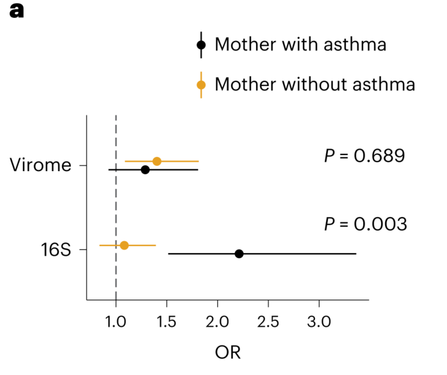
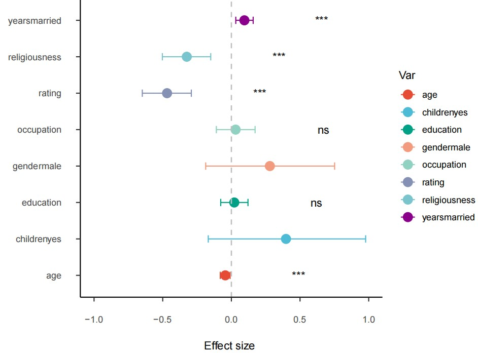

```{r setup, include=FALSE} 
knitr::opts_chunk$set(
	echo=T, comment=NA, message=F, warning=F,
	fig.align="center", fig.width=5, fig.height=3, dpi=300)
```


### 逻辑斯蒂回归简介
Introduction to Logistic Regression

参考：https://mp.weixin.qq.com/s/WS9k3vmO07i660cGYRX8ZA

逻辑斯蒂回归（logistic regression）是最常见的机器学习算法之一，它可以用于预测事件发生的概率。由于其简单性，逻辑斯蒂回归常被用做基准模型与其他更复杂的模型进行比较。该模型的名称包含“逻辑”一次，因为它使用逻辑函数（sigmod）将输入特征的线性组合转换为概率。逻辑斯蒂回归的输出介于0和1之间的连续值，因此它的名称中还包含“回归”一词，但是通常作为二元分类器使用，通过选择宇哥阈值，将概率大于阈值的输入分类为正类，低于阈值的分类为负类。
Logistic regression is one of the most common machine learning algorithms that can be used to predict the probability of events occurring. Due to its simplicity, logistic regression is often used as a benchmark model for comparison with other more complex models. The name of this model includes "logic" once because it uses a logic function (sigmod) to convert the linear combination of input features into probability. The output of logistic regression is a continuous value between 0 and 1, so its name also includes the word "regression", but it is usually used as a binary classifier. By selecting the Yu Ge threshold, inputs with a probability greater than the threshold are classified as positive, while those below the threshold are classified as negative.

logistic回归分析计算OR值和置信区间：
Logistic regression analysis calculates OR values and confidence intervals:
OR值（odds ratio）是一种统计量，用于度量两个事件的概率发生的相对大小。在二分类GWAS（基因组关联研究）分析中，OR值用于衡量某个基因（或基因型）与某个疾病（或特征）之间的关联程度。OR值大于1表示基因变异和疾病间存在正相关，即该变异可能增加患病的概率；OR值小于1则表示基因便于和疾病之间存在负相关，即该便于可能减少患病的概率。一般情况下，OR值越大表示基因变异和疾病间的关联程度越强。在二分类GWAS分析中，通过计算每个基因变异的OR值，可以评估其与疾病之间的关联程度，从而推断基因变异对疾病风险的共线。这可以帮助研究人员了解潜在的遗传基础以及疾病风险的变化。
Odds ratio is a statistical measure used to measure the relative magnitude of the probability of two events occurring. In binary GWAS (Genomic Association Studies) analysis, OR values are used to measure the degree of association between a gene (or genotype) and a disease (or feature). An OR value greater than 1 indicates a positive correlation between genetic variation and disease, indicating that the variation may increase the probability of developing the disease; If the OR value is less than 1, it indicates a negative correlation between gene convenience and disease, which may reduce the probability of disease. In general, the larger the OR value, the stronger the correlation between gene variation and disease. In binary GWAS analysis, by calculating the OR value of each gene variation, the degree of association between it and the disease can be evaluated, thereby inferring the collinearity of gene variation on disease risk. This can help researchers understand the potential genetic basis and changes in disease risk.


### 逻辑斯蒂回归应用示例
Example of Logistic Regression Application

这是Jakob Stokholm课题组2023年发表于Nature Medicine上的文章，第一作者为Cristina Leal Rodríguez，题目为：The infant gut virome is associated with preschool asthma risk independently of bacteria

This is an article published by the Jakob Stokholm research group in Nature Medicine in 2023. The first author is Cristina Leal Rodr í guez, and the title is: The incident gut virus is associated with pre-school astroma risk independently of bacteria


Fig. 5 a, Asthma versus sPLS asthma signature scores derived from the 1-year-old infant gut temperate virome and bacteriome (16S) in children born to mothers with and without asthma. ORs and two-sided P values for the asthma–mother interaction were computed by logistic regression. Dots indicate point estimates, and horizontal lines indicate 95% CIs.

图5 a，哮喘与sPLS哮喘特征评分，来源于患有和不患有哮喘的母亲所生儿童的1岁婴儿肠道温和病毒组和细菌组（16S）。通过逻辑回归计算哮喘与母亲相互作用的ORs和双侧P值。点表示点估计值，水平线表示95%的CI。

**结果**：
Similarly, although the bacteriome score was associated with asthma only in children born to mothers with asthma (interaction, P = 0.003), the virome score association was independent of maternal asthma status (interaction, P = 0.69) (Fig. 5a).

类似地，尽管细菌组评分仅与患有哮喘的母亲所生的儿童的哮喘相关（相互作用，P=0.003），但病毒组评分的相关性与母亲的哮喘状况无关（相互作用），P=0.69（图第5a段）。


### 逻辑斯蒂回归R语言实战
Logistic Regression in R Language Practice

简单示例
Simple example

```{r, include=TRUE}
# 构建模型
# Build models
library(tidyverse)
set.seed(100)
data(mtcars)
summary(mtcars)

my_model =glm(formula = vs ~ hp,
               family = binomial(link = logit),
               data = mtcars)
summary(my_model)

#获得OR值和置信区间
# Get OR and confidence intervals
library(questionr)
odds.ratio(my_model)

```


利用森林图展示逻辑斯蒂回归分析的结果
Using forest maps to display the results of logistic regression analysis
参考：https://mp.weixin.qq.com/s/pAWb0-NAddEuEwO96VW1PQ

```{r forest, include=TRUE}
# 构建模型
# Building models
data(Affairs, package = "AER")
df <- Affairs

# 创建因变量，表示是否有外遇
# Create a binary outcome variable indicating whether there was an affair
df$ynaffairs <- ifelse(df$affairs > 0, 1, 0)
df$ynaffairs <- factor(df$ynaffairs, levels = c(0, 1), labels = c("No", "Yes"))

# 拟合逻辑回归模型
# Fit a logistic regression model
fit.full <- glm(ynaffairs ~ gender + age + yearsmarried + children + religiousness + education + occupation + rating, data = df, family = binomial())

# 提取模型结果
# Extract model results
fit.result <- summary(fit.full)
df1 <- fit.result$coefficients
df2 <- confint(fit.full)
df3 <- cbind(df1, df2)

# 整理结果数据框
# Organize the results into a data frame
df4 <- data.frame(df3[-1, c(1, 4, 5, 6)])
df4$Var <- rownames(df4)
colnames(df4) <- c("OR", "Pvalue", "OR_1", "OR_2", "Var")
df5 <- df4[, c(5, 1, 2, 3, 4)]
df5$OR_mean <- df5$OR
df5$OR <- paste0(round(df5$OR, 2), " (", round(df5$OR_1, 2), "~", round(df5$OR_2, 2), ")")
df5$Pvalue <- round(df5$Pvalue, 3)

# 保存结果为CSV文件
# Save the results as a CSV file
write.csv(df5, file = "forestplot_example.csv", quote = FALSE, row.names = FALSE)

# 森林图绘制逻辑斯蒂结果
# Forest plot drawing logistic regression results
library(forestplot)
fp <- read.csv("forestplot_example.csv", header = TRUE)

# 绘制基本森林图
# Draw basic forest plot
p1 <- forestplot(labeltext = as.matrix(fp[, 1:3]),
                 mean = fp$OR_mean,
                 lower = fp$OR_1,
                 upper = fp$OR_2,
                 zero = 0,
                 boxsize = 0.2,
                 graph.pos = 2)

# 美化森林图
# Beautify the forest plot
p2 <- forestplot(labeltext = as.matrix(fp[, 1:3]),
                 mean = fp$OR_mean,
                 lower = fp$OR_1,
                 upper = fp$OR_2,
                 zero = 0,
                 boxsize = 0.2,
                 lineheight = unit(7, 'mm'),
                 colgap = unit(2, 'mm'),
                 lwd.zero = 1.5,
                 lwd.ci = 2,
                 col = fpColors(box = '#458B00',
                                summary = '#8B008B',
                                lines = 'black',
                                zero = '#7AC5CD'),
                 xlab = "OR",
                 lwd.xaxis = 1,
                 txt_gp = fpTxtGp(ticks = gpar(cex = 0.85),
                                  xlab  = gpar(cex = 0.8),
                                  cex = 0.9),
                 lty.ci = "solid",
                 title = "Forestplot",
                 line.margin = 0.08,
                 graph.pos = 2)

# 调用R包
# Load necessary libraries
library(ggthemes)
library(ggplot2)
library(ggpubr)

# 读取数据
# Read the dataset
dataset <- read.csv("forestplot_example.csv", header = TRUE)

# 使用ggplot2绘制森林图
# Draw forest plot using ggplot2
p3 <- ggplot(dataset, aes(OR_mean, Var)) +
  geom_point(size = 4) +
  geom_errorbarh(aes(xmax = OR_2, xmin = OR_1), size = 0.5, height = 0.2) +
  scale_x_continuous(limits = c(-1, 1)) +
  geom_vline(aes(xintercept = 0), color = "gray", linetype = "dashed", size = 0.6) +
  xlab('Effect size ') +
  ylab(' ') +
  theme_few() +
  theme(axis.text.x = element_text(size = 24, color = "black")) +
  theme(axis.text.y = element_text(size = 24, color = "black")) +
  theme(title = element_text(size = 24)) +
  theme_classic() +
  theme(axis.ticks.length = unit(-0.25, "cm"),
        axis.text.x = element_text(margin = unit(c(0.5, 0.5, 0.5, 0.5), "cm")),
        axis.text.y = element_text(margin = unit(c(0.5, 0.5, 0.5, 0.5), "cm")))

# 添加显著性标记
# Add significance markers
dataset$signif <- ifelse(dataset$Pvalue < 0.001, "***", 
                         ifelse(dataset$Pvalue < 0.01, "**", 
                                ifelse(dataset$Pvalue < 0.05, "*", "ns")))

# 带颜色和显著性的森林图
# Forest plot with colors and significance
p4 <- ggplot(dataset, aes(OR_mean, Var)) +
  geom_point(size = 4, aes(color = Var)) +
  geom_errorbarh(aes(xmax = OR_2, xmin = OR_1, color = Var), size = 0.5, height = 0.2) +
  scale_color_manual(values = c("#E64B35FF", "#4DBBD5FF", "#00A087FF", "#F39B7FFF", "#91D1C2FF", "#8491B4FF", "#7AC5CD", "#8B008B")) +
  scale_x_continuous(limits = c(-1, 1)) +
  geom_vline(aes(xintercept = 0), color = "gray", linetype = "dashed", size = 0.6) +
  geom_text(aes(label = signif, x = OR_2 + 0.5)) +
  xlab('Effect size ') +
  ylab(' ') +
  theme_few() +
  theme(axis.text.x = element_text(size = 24, color = "black")) +
  theme(axis.text.y = element_text(size = 24, color = "black")) +
  theme(title = element_text(size = 24)) +
  theme_classic() +
  theme(axis.ticks.length = unit(0.15, "cm"),
        axis.text.x = element_text(margin = unit(c(0.5, 0.5, 0.5, 0.5), "cm")),
        axis.text.y = element_text(margin = unit(c(0.5, 0.5, 0.5, 0.5), "cm")))

# 保存为PDF文件
# Save the plot as a PDF file
ggsave(filename = "Logistic_regression_plot01.pdf", plot = p4, width = 7, height = 5, useDingbats = FALSE, limitsize = FALSE)

```



