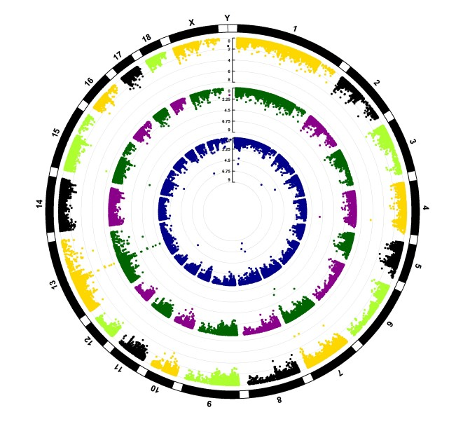

```{r setup, include=FALSE}
knitr::opts_chunk$set(
	echo=T, comment=NA, message=F, warning=F,
	fig.align="center", fig.width=5, fig.height=3, dpi=300)
```


# 曼哈顿图
Manhattan Plot

曼哈顿图(Manhattan Plot)是一种散点图，通常用于显示具有大量非零的波动数据点，以及更高幅度值的分布，常常用在全基因组关联研究(GWAS)中。它的图像因与曼哈顿的天际线相似而得名。在微生物分析中，曼哈顿图可以用来展示差异OTU/ASV的上下调和差异OTU/ASV归属情况。曼哈顿图在其他研究中的应用包括：1.展示全基因组数据，直观的展示整个基因组中的统计显著性，通常以染色体为单位来展示数据点; 2.识别显著性区域，通过颜色或高度的变化，可以快速识别出具有统计显著性的区域，这些区域可能与某些疾病或性状相关；3.比较不同研究，可以用来比较不同研究或不同群体之间的统计显著性差异；3.可视化P值分布，使用负对数尺度(-log10)来表示P值，这使得观察者可以很容易识别出P值的分布情况；4.软色体位置的可视化，通常沿着X轴展示染色体的位置，使得观察者可以直观地看到每个显著性信号在基因组中的位置；5.辅助假设生成，通过观察曼哈顿上的模式，研究人员可以生成新的科学假设，比如那些基因或区域可能与研究的性状有关联。

A Manhattan Plot is a scatterplot that is usually used to display distributions with a large number of non-zero fluctuating data points and higher amplitude values. It is often used in genome-wide association studies (GWAS). Its image is named for its resemblance to the Manhattan skyline. In microbial analysis, Manhattan plots can be used to display the up- and down-regulation and clearing of differential OTUs/ASVs and the attribution of differential OTUs/ASVs. Applications of Manhattan plots in other studies include: 1. Displaying whole-genome data, intuitively displaying statistical significance in the entire genome, usually displaying data points in chromosome units; 2. Identifying significant areas, through color or High changes can quickly identify statistically significant areas that may be related to certain diseases or traits; 3. Compare different studies, which can be used to compare statistically significant differences between different studies or different groups. ; 3. Visualize the P value distribution, using a negative logarithmic scale (-log10) to represent the P value, which allows the observer to easily identify the distribution of the P value; 4. Visualization of the position of the soft color body, usually along X The axis shows the position of the chromosome, allowing the observer to intuitively see the position of each significant signal in the genome; 5. Auxiliary hypothesis generation, by observing the patterns on Manhattan, researchers can generate new scientific hypotheses, such as those Genes or regions may be associated with the trait being studied.


### 曼哈顿图案例
Manhattan Plot Example

案例 1
Example 1

这是中国科学院遗传发育所白洋课题组2019年发表于Nature Biotechnology上的一篇论文用到的曼哈顿图。论文题目为：NRT1.1B is associated with root microbiota composition and nitrogen use in field-grown rice。

This is the Manhattan diagram used in a paper published in Nature Biotechnology in 2019 by Bai Yang's research group at the Institute of Genetics and Developmental Biology, Chinese Academy of Sciences. The title of the paper is: NRT1.1B is associated with root microbiota composition and nitrogen use in field-grown rice.


Fig. 3 a,b, Manhattan plot showing OTUs enriched in indica or japonica in field I (a) and field II (b). Each dot or triangle represents a single OTU. OTUs enriched in indica or japonica are represented by filled or empty triangles, respectively (FDR adjusted P<0.05, Wilcoxon rank sum test). OTUs are arranged in taxonomic order and colored according to the phylum or, for Proteobacteria, the class. CPM, counts per million.

图 3 a、b，曼哈顿图显示田块 I (a) 和田块 II (b) 中富含籼稻或粳稻的 OTU。每个点或三角形代表一个 OTU。富含籼稻或粳稻的 OTU 分别用实心或空心三角形表示（FDR 调整 P<0.05，Wilcoxon 秩和检验）。OTU 按分类顺序排列，并根据门或变形菌纲着色。CPM，每百万计数。

总结：该图利用曼哈顿图展示了在籼稻或粳稻中富集的OTU。想参考图标题描述可进一步阅读文末链接中的教程。


**结果**

Root microbiota and nitrogen use. Next we examined differences in the root microbiota of indica and japonica rice subspecies at the OTU level. First, we analyzed the enrichment of OTUs according to their taxonomy using Manhattan plots (Fig. 3a,b and Supplementary Table 6). In both fields, OTUs enriched in indica belonged to a wide range of bacterial phyla, including Acidobacteria, Proteobacteria, Actinobacteria, Bacteroidetes, Chloroflexi, Firmicutes and Verrucomicrobia (FDR adjusted P<0.05, Wilcoxon rank sum test; Fig. 3a,b and Supplementary Table 6). Japonica roots retained the capacity to enrich OTUs belonging to Proteobacteria, Bacteroidetes and Firmicutes (FDR adjusted P<0.05, Wilcoxon rank sum test; Fig. 3a,b and Supplementary Table 6)

根系微生物组和氮利用。接下来我们在OTU水平上研究了籼稻和粳稻亚种根系微生物组的差异。首先，我们使用曼哈顿图分析了OTU的富集情况（图3a、b和补充表6）。在两个田块中，籼稻中富集的OTU属于广泛的细菌门，包括酸杆菌门、变形菌门、放线菌门、拟杆菌门、绿弯菌门、厚壁菌门和疣微菌门（FDR调整后的P<0.05，Wilcoxon秩和检验；图3a、b和补充表6）。粳稻根系保留了富集属于变形菌门、拟杆菌门和厚壁菌门的OTU的能力（FDR调整后的P<0.05，Wilcoxon秩和检验；图3a、b和补充表6）

正文描述：通过曼哈顿图展示了OTU水平上籼稻和粳稻亚种根系微生物组的差异。使用曼哈顿图分析了OTU的富集情况。想参考正文描述可进一步阅读文末链接中的教程。


案例 2
Example 2

这是约翰霍普金斯大学彭博公共卫生学院Nilanjan Chatterjee团队2022年发表于Nature Genetics上的一篇论文。论文的题目是：Plasma proteome analyses in individuals of European and African ancestry identify cis-pQTLs and models for proteome-wide association studies。


Fig. 4 | Miami plots for PWAS and TWAS analyses for serum urate level and gout. a,b Miami plot for PWAS (upper) and TWAS (lower) of urate (a) and gout (b). Each point represents a P value for a two-sided z-test of association between the phenotypes and the cis-genetic regulated plasma protein or expression level of a gene, ordered by genomic position on the x axis and the −log10(P value) for the association strength on the y axis. The black horizontal dash lines are the significance threshold after Bonferroni correction for the total number of imputation models (P value = 3.7 × 10−5 for PWAS and 2.1 × 10−7 for TWAS). Urate PWAS and TWAS in a are truncated in the y axis at −log10(P value) = 30 and −log10(P value) = 150 for better display. Nearby TWAS genes (±500 kb) for significant PWAS genes are colored by GTEx tissues. The most significant nearby TWAS gene is labeled with its gene name and corresponding tissue. The TWAS of IL1RN does not reach TWAS significance threshold and thereby was labeled with gray. All primary TWAS analyses are conducted based on established models developed using data from GTEx V7, and results for the identified top genes/tissue combinations are further validated using preliminary models available from GTEx V8 (Supplementary Table 16). To reduce the size of the figure, we plotted only a fraction of the points for the TWAS results that were highly insignificant (P value >0.05).

图 4 | 血清尿酸水平和痛风的 PWAS 和 TWAS 分析的迈阿密图。a、b 尿酸 (a) 和痛风 (b) 的 PWAS (上) 和 TWAS (下) 的迈阿密图。每个点代表表型与顺式遗传调节的血浆蛋白或基因表达水平之间关联的双侧 z 检验的 P 值，按 x 轴上的基因组位置和 y 轴上的关联强度的 −log10(P 值) 排序。黑色水平虚线是 Bonferroni 校正后对总插补模型数量的显着性阈值（P 值 = 3.7 × 10−5（PWAS）和 TWAS 的 2.1 × 10−7）。为了更好地显示，a 中的尿酸 PWAS 和 TWAS 在 y 轴上以 −log10(P 值) = 30 和 −log10(P 值) = 150 截断。重要 PWAS 基因附近的 TWAS 基因（±500 kb）按 GTEx 组织着色。最显著的附近 TWAS 基因标有其基因名称和相应的组织。IL1RN 的 TWAS 未达到 TWAS 显著性阈值，因此标记为灰色。所有主要 TWAS 分析均基于使用 GTEx V7 数据开发的既定模型进行，并使用 GTEx V8 提供的初步模型进一步验证已确定的顶级基因/组织组合的结果（补充表 16）。为了减小图形的大小，我们仅绘制了 TWAS 结果中非常不显著（P 值 >0.05）的一小部分点。

注释：TWAS, 全转录组关联研究; PWAS, 全蛋白质组关联研究

总结：通过曼哈顿图展示了TWAS和PWAS分析得到的表型与血浆蛋白或基因表达之间关联的显著性。想参考正文描述可进一步阅读原文或者文末链接中的教程。


**结果**

Integrating pQTL with the functional and regulatory annotations of the genome, curated from existing database (Methods), offers a powerful way to understand the molecular mechanisms and consequences of genetic regulatory effects. We found that cis-pQTL were enriched for several protein altering functions, which may be caused by the epitope-binding effects noted earlier (Extended Data Fig. 4a,b). After adjusting for PAVs, independent sentinel cis-pQTL were enriched in a large spectrum of functional annotations including untranslated regions (5′ and 3′), promoters and transcription factor binding sites, with a pattern that was consistent across two populations (Extended Data Fig. 4c,d and Supplementary Table 9).

将 pQTL 与从现有数据库 (方法) 中整理的基因组功能和调控注释整合在一起，提供了一种了解遗传调控效应的分子机制和后果的有效方法。我们发现顺式 pQTL 富含几种改变蛋白质的功能，这可能是由前面提到的表位结合效应引起的 (扩展数据图 4a、b)。调整 PAV 后，独立的哨兵顺式 pQTL 在大量功能注释中富集，包括非翻译区 (5′ 和 3′)、启动子和转录因子结合位点，其模式在两个种群中一致 (扩展数据图 4c、d 和补充表 9)。


### 曼哈顿图R语言实战
Manhattan Plot Using R Software

实战1
Practice 1

通过曼哈顿图展示OTU的上调、下调或者不显著
Display the up-regulation, down-regulation or insignificant OTU through Manhattan plot

参考：https://mp.weixin.qq.com/s/VmRgcd3uX7bUbvvCVLr8MA
https://mp.weixin.qq.com/s/EkToRMkOe58wBY6Aa2Xg5g

```{r Manhattan Plot}
# 加载必要的库
# Load packages
library(ggplot2)
library(dplyr)

# 读取数据
# Read data
data <- read.csv("result.csv")

# 根据p值和logFC进行分类
# Classification based on p-value and logFC
data <- data %>%
  mutate(change = case_when(
    P.Value < 0.05 & abs(logFC) > 1 ~ ifelse(logFC < 0, "depleted", "enriched"),
    TRUE ~ "nosig"
  ))

# 将p值取负对数
# Take the negative logarithm of the p-value
data <- data %>%
  mutate(P.Value = -log10(P.Value))

# 绘制图形
# Plot
plot <- ggplot(data, aes(x = Phylum, y = P.Value)) +
  geom_point(aes(color = Phylum, shape = change, size = logFC), position = position_jitter(width = 0.5), alpha = 0.7) +
  scale_y_continuous(expand = expansion(mult = c(0, 0)), limits = c(0, 15)) +
  scale_size_continuous(range = c(1, 3.5)) +
  scale_shape_manual(values = c(6,17,16)) +
  scale_color_brewer(palette = "Set2") +
  geom_hline(yintercept = -log10(0.05), linetype = "dotted", color = "darkred") +
  labs(x = "Phylum", y = "-log10(P-Value)", title = "Manhattan Plot") +
  theme_light() +
  theme(legend.position = "top", 
        legend.title = element_text(size = 12),
        legend.text = element_text(size = 10),
        axis.title = element_text(size = 12),
        axis.text = element_text(size = 10),
        plot.title = element_text(size = 14, face = "bold"))

# 保存图形
# Save plot
ggsave("manhattan_plot.pdf", plot, width = 8, height = 5)
```


实战2
Practice2

通过曼哈顿图展示关联分析的显著性
Demonstrating the significance of correlation analysis through Manhattan plots

参考：https://mp.weixin.qq.com/s/dMliN58Upe4XjyEC8WY6Tg

曼哈顿图目前也被广泛用于全基因组关联研究(GWAS)。其核心思想是表示大量非显著数据点，以及少数几个显著数据点的簇，这些显著点在图中呈现高耸的塔状结构。在常见的应用中，曼哈顿图用于绘制p值，但是通过使用-log10(p)进行转换，使得较小的p值有更高的转换值。

Manhattan plots are also currently widely used in genome-wide association studies (GWAS). The core idea is to represent a large number of non-significant data points and clusters of a few significant data points. These significant points present a towering tower-like structure in the graph. In common applications, Manhattan plots are used to plot p-values, but are transformed using -log10(p) so that smaller p-values have higher transformed values.


```{r MP}
# 加载必要的库
# Load packages
library(ggplot2)
library(readr)
library(ggrepel)
library(patchwork)

# 读取数据
# Read data
datafile <- "41588_2022_1051_MOESM8_ESM.txt"
data_df <- read_tsv(datafile)

# 统计染色体数量
# Count the number of chromosomes
nCHR<-length(unique(data_df$CHR))

# 根据疾病列筛选数据
# Filter data based on disease column
data_filtered <- data_df %>% filter(disease == "Urate")

# 计算染色体中心位置
# Calculate the chromosome center position
chr_centers <- data_filtered %>%
  group_by(CHR) %>%
  summarise(center = (max(BPcum) + min(BPcum)) / 2, .groups = 'drop')

# 根据组织列筛选数据
# Filter data based on organization column
data_plasma <- data_filtered %>% filter(tissue == "Plasma")

# 绘制基本图形
# Plot
plot_base <- ggplot(data = data_plasma, aes(x = BPcum, y = -log10(P), color = as.factor(CHR), size = -log10(P))) +
  geom_point(alpha = 0.7) +
  scale_x_continuous(
    breaks = chr_centers$center,
    labels = chr_centers$CHR,
    limits = c(min(data_plasma$BPcum), max(data_plasma$BPcum))
  ) +
  scale_y_continuous(
    limits = c(0, 32),
    expand = expansion(mult = c(0, 0))
  ) +
  scale_color_manual(values = rep(c("#5ebcc2", "#005c72"), nCHR)) +
  scale_size_continuous(range = c(1, 4)) +
  geom_hline(yintercept = -log10(3.7e-5), linetype = "dotted", color = "#a63b00") +
  labs(
    x = NULL,
    y = expression(-log[10](P)),
    title = NULL
  ) +
  guides(color = "none") + 
  theme_classic() +
  theme(
    axis.text.x = element_text(size = 8, angle = 45, hjust = 1),
    axis.text.y = element_text(size = 8),
    axis.title = element_text(size = 10),
    plot.title = element_text(size = 12, face = "bold")
  )

# 定义标签
# Set labels
genes <- c("INHBB", "ITIH1", "BTN3A3", "INHBA", "C11orf68", "B3GAT3", "INHBC(7.95e-63)", "SNUPN", "NEO1", "FASN")
labels_data <- data_plasma %>% filter(ID %in% genes) %>%
  mutate(logP = -log10(P))

# 添加文本标签
# Add text labels
plot_labels <- plot_base +
  ggrepel::geom_label_repel(
    data = labels_data,
    aes(x = BPcum, y = logP, label = ID),
    size = 3,
    box.padding = 0.3,
    segment.color = "black",
    direction = "both",
    nudge_y = 0.2
  )

# 拼接图形
# Patchwork
final_plot <- plot_base+
  scale_color_manual(values = rep(c("#aba9dd", "#5ebcc2"), nCHR))+
  theme(legend.direction = "horizontal")+
  plot_labels + theme(legend.direction = "horizontal")+
  plot_layout(guides="collect")+
  plot_annotation(theme = theme(legend.position = "top"))
final_plot

# 保存图形
# Save plot
ggsave("Manhattan_Plot2.pdf", final_plot, width = 10, height = 6)
```


实战3
Practice3

通过环状曼哈顿图对比多组之间关联分析差异情况
Compare the differences in association analysis between multiple groups through the annular Manhattan plot

环状曼哈顿图
Circular Manhattan plot

用CMplot软件包绘制曼哈顿圈图
Using CMPlot package to plot Manhattan plot

CMplot has been integrated into our developed GWAS package rMVP, please cite the following paper:
Yin, L. et al. rMVP: A Memory-efficient, Visualization-enhanced, and Parallel-accelerated tool for Genome-Wide Association Study, Genomics, Proteomics & Bioinformatics (2021), doi: 10.1016/j.gpb.2020.10.007.

参考：https://mp.weixin.qq.com/s/TS1ZO5KQcz3jMMtwDFQr0A

```{r MP2}
# 加载必要的包
# Load packages
library(CMplot)

# 示例数据
# Load data
data("pig60K")   # 猪的60K SNP数据(60K SNP data of pig)
data("cattle50K") # 牛的50K SNP数据(50K SNP data for cattle)

# 示例 1: 基本的圆形图，显示GWAS结果的p值(Example 1: Basic pie chart showing p-values of GWAS results)
# CMplot(pig60K, plot.type = "c", r = 0.5, LOG10 = TRUE, col = c("grey30", "grey60"), outward = FALSE)

# 示例 2: 更改图的方向，显示结果向外扩展
# Example 2: Change the direction of the graph to show the results expanding outwards
CMplot(pig60K,
       plot.type = "c",
       r = 1,
       LOG10 = TRUE,
       col = c("grey30", "grey60"),
       outward = TRUE)

# 示例 3: 在圆形图上添加染色体标签
# Example 3: Add chromosome labels to a circular plot
CMplot(pig60K,
       plot.type = "c",
       r = 1,
       LOG10 = TRUE,
       col = c("grey30", "grey60"),
       outward = TRUE,
       cir.chr = TRUE,
       cir.chr.h = 1.3)

# 示例 4: 每个圆圈使用不同的颜色
# Example 4: Use a different color for each circle
CMplot(pig60K,
       plot.type = "c",
       r = 1,
       cir.chr.h = 1.3,
       col = matrix(c("darkblue", "darkgreen", "darkmagenta"), nrow = 3, byrow = TRUE))

# 示例 5: 相同染色体使用相同的颜色
# Example 5: Use the same color for the same chromosome
CMplot(pig60K,
       plot.type = "c",
       r = 1,
       LOG10 = TRUE,
       cir.chr.h = 1.3,
       col = c("darkblue", "darkgreen", "darkmagenta"))

# 示例 6: 每个圆圈使用不同数量的颜色
# Example 6: Using a different number of colors for each circle
CMplot(pig60K,
       plot.type = "c",
       r = 1,
       LOG10 = TRUE,
       cir.chr.h = 1.3,
       col = matrix(c("darkblue", NA, NA,
                      "darkgreen", "darkmagenta", NA,
                      "gold", "black", "greenyellow"),
                    nrow = 3, byrow = TRUE))

```




教程：https://note.youdao.com/s/NU6cuXqx
github地址：https://github.com/YongxinLiu/MicrobiomeStatPlot; https://github.com/baidefeng/MicrobiomeStatPlot
