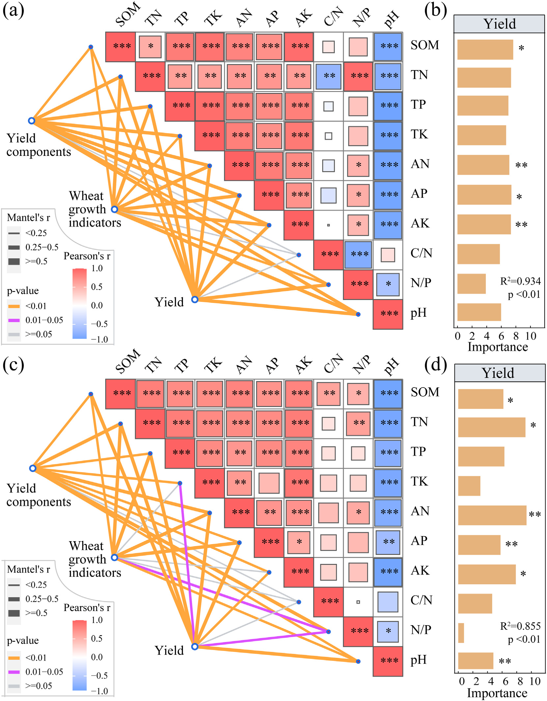

```{r setup, include=FALSE}
knitr::opts_chunk$set(
	echo=T, comment=NA, message=F, warning=F,
	fig.align="center", fig.width=5, fig.height=3, dpi=300)
```


# 热图结合网络图展示mantel检验相关性
Heat map combined with network diagram to demonstrate the correlation of Mantel test

Mantel检验是一种将两个矩阵放在一起，求它们之间的相关性的一种方法。Mantel检验的分析过程主要包括：分别使用各自的距离公式计算两个数据矩阵的距离矩阵，然后将两个距离矩阵进行压缩得到两个压缩距离列，然后计算这两列的相关性；在完成一次计算后，对原数据矩阵中的一列或者两列进行置换，重新计算距离公式以及压缩距离公式，计算新的相关性系数；经过成千上万次的置换后，观察实际数据的相关性系数在经过多次置换后所得的相关性系数分布中位置，如果跟随机置换得到的结果站队接近，则说明相关性不显著，相反则说明两个矩阵具有较强的显著相关性。Mantel分析一般用于植物、微生物群落与生态环境之间相关性的建议以及人体肠道微生物群落与人体疾病相关性检验等领域。

Mantel test is a method of putting two matrices together to determine their correlation. The analysis process of Mantel test mainly includes: calculating the distance matrices of two data matrices using their respective distance formulas, compressing the two distance matrices to obtain two compressed distance columns, and then calculating the correlation between these two columns; After completing a calculation, replace one or two columns in the original data matrix, recalculate the distance formula and compression distance formula, and calculate the new correlation coefficient; After thousands of permutations, observe the position of the correlation coefficient of the actual data in the distribution of correlation coefficients obtained after multiple permutations. If the results obtained from random permutations are close to each other, it indicates that the correlation is not significant. On the contrary, it indicates that the two matrices have a strong and significant correlation. Mantel analysis is generally used to provide recommendations on the correlation between plants, microbial communities, and the ecological environment, as well as to test the correlation between human gut microbiota and human diseases.


### 热图结合网络图展示mantel检验相关性案例
Heat map combined with network diagram to demonstrate the correlation case of Mantel test

这篇文章是石河子大学Li Junhua团队2022年发表于Science of the Total Environment（He et al., 2022）上的一篇论文,论文题目为：Commercial organic fertilizer substitution increases wheat yield by improving soil quality

This article is a paper published by Li Junhua's team at Shihezi University in Science of the Total Environment (He et al., 2022) in 2022. The title of the paper is: Commercial organic fertilizer substitution increases while yield by
improving soil quality



Fig. 3. Correlation analysis of soil properties and the Mantel test analysis of wheat plant characteristics (wheat growth indicators, yield components and yield) and soil properties (a and c) in low (LF) and high (HF) fertility soils from 2018 to 2019, as well as the random forest model predicts the key soil factors affecting wheat yield (b and d). LF including figures a and b; HF including figures c and d. SOM, soil organic matter; TN, soil total nitrogen; TP, soil total phosphorus; TK, soil total potassium; AN, soil alkali-hydrolyzable nitrogen; AP, soil available phosphorus; AK, soil available potassium; C/N, soil carbon and nitrogen ratio; N/P, soil carbon and phosphorus ratio; pH, soil pH. The R2 value represents the explained variation. *, ** and *** indicate the significance level at p < 0.05, p < 0.01 and p < 0.001.

图3。2018年至2019年低（LF）和高（HF）肥力土壤中土壤性质的相关性分析和小麦植株特征（小麦生长指标、产量组成和产量）以及土壤性质（a和c）的Mantel检验分析，以及随机森林模型预测了影响小麦产量的关键土壤因素（b和d）。LF，包括图a和图b；HF，包括图c和d。SOM，土壤有机质；TN，土壤总氮；TP，土壤总磷；TK，土壤总钾；AN，土壤碱解氮；AP，土壤有效磷；AK，土壤有效钾；C/N、土壤碳氮比；N/P、土壤碳磷比；pH，土壤pH。R2值代表解释的变化。*，*****表示p<0.05、p<0.01和p<0.001的显著性水平。


**结果**：
3.4. Comprehensive analysis of soil properties and wheat plant characteristics
3.4. 土壤性质与小麦植株特性的综合分析

Correlation analysis showed a significant (p < 0.05) positive correlation between wheat growth indicators and yield components (except 1000-grain weight) in both LF and HF, whereas these indicators were significantly (p < 0.01) positively correlated with yield (Fig. S2). Additionally, there was a significant positive correlation (p < 0.05) between SOM and soil total and available nutrients (except AP and TK in HF) in LF and HF (p < 0.05, Fig. 3a and c). The pH was significantly negatively correlated with most soil indicators (except C/N) in LF and HF (p < 0.05, Fig. 3a and c).
相关分析显示，LF和HF中的小麦生长指标与产量组成部分（除1000粒重外）之间存在显著（p<0.05）正相关，而这些指标与产量显著（p<0.01）正相关（图S2）。此外，在LF和HF中，SOM与土壤总养分和有效养分（HF中的AP和TK除外）之间存在显著的正相关（p<0.05）（图第3a和c段）。在LF和HF中，pH与大多数土壤指标（C/N除外）呈显著负相关（p<0.05，图第3a和C段）。

Mantel test analysis showed that soil properties (except C/N) were significantly positively correlated with wheat growth indicators (except TK and AK in HF), and yield and its components in LF and HF (p < 0.05, Mantel'r≥0.25, Fig. 3a and c). The random forest model further identified that SOM, AN, AP and AK in LF (p < 0.05, Fig. 3b), and SOM, TN, AN, AP, AK and pH in HF were the key soil factors affecting yield (p < 0.05, Fig. 3d).

Mantel检验分析表明，土壤性质（C/N除外）与小麦生长指标（HF中的TK和AK除外）以及LF和HF中的产量及其成分显著正相关（p<0.05，Mantel’r≥0.25，图第3a和C段）。随机森林模型进一步确定，LF中的SOM、AN、AP和AK（p<0.05，图3b），HF中的SOM、TN、AN、美联社、AK和pH是影响产量的关键土壤因素（p<0.05，图图3d）。


### 热图结合网络图展示mantel检验相关性R语言实战
Heat map combined with network diagram to demonstrate the practical application of Mantel test correlation R language

参考：https://mp.weixin.qq.com/s/T4kJP-3L6Va_o9b3HTFZjQ

```{r mantel test}
# Clear workspace
# rm(list=ls())

# Load necessary packages
library(vegan)
library(dplyr)
library(ggplot2)
# library(ggcor)  # Uncomment if needed
# devtools::install_github("Hy4m/linkET", force = TRUE)  # Uncomment if needed
library(linkET)

# Load and transform data
## OTU data
df <- read.table("otu.txt", header = TRUE, row.names = 1, check.names = FALSE, sep = "\t")
df <- data.frame(t(df))
df <- df[c(1, 3, 4, 2, 8, 10, 6, 9, 7, 11, 5, 12), ]

## Environmental data
env <- read.table("env.txt", sep = "\t", header = TRUE, row.names = 1, check.names = FALSE)
env <- as.data.frame(env)

# Perform Mantel test and create custom labels
df_mantel <- mantel_test(df, env,
                        spec_select = list(
                            "Yield components" = 1:4,
                            "Wheat growth indicators" = 5:8,
                            "Yield" = 9:12
                        )) %>%
  mutate(
    df_r = cut(r, breaks = c(-Inf, 0.25, 0.5, Inf),
               labels = c("< 0.25", "0.25 - 0.5", ">= 0.5")),
    df_p = cut(p, breaks = c(-Inf, 0.01, 0.05, Inf),
               labels = c("< 0.01", "0.01 - 0.05", ">= 0.05"))
  )

# Save the plot
pdf("mantel_plot.pdf", width = 10, height = 8)  # Adjust width and height as needed
# Plotting
qcorrplot(correlate(env), type = "lower", diag = FALSE) +
  geom_square() +
  geom_couple(
    aes(
      xend = .xend + 1.25,  # Define end of line for connections
      yend = .yend + 0.5,
      colour = df_p,
      size = df_r
    ),
    data = df_mantel,
    curvature = 0.1
  ) +
  geom_diag_label(
    mapping = aes(y = .y + 0.05),  # Define label positions on the diagonal
    hjust = 0.15
  ) +
  scale_fill_gradientn(colours = RColorBrewer::brewer.pal(11, "RdBu")) +  # Color scale for squares
  scale_size_manual(values = c(0.5, 1, 2)) +
  scale_colour_manual(values = color_pal(3)) +
  guides(
    size = guide_legend(
      title = "Mantel's r",
      override.aes = list(colour = "grey35"),
      order = 2
    ),
    colour = guide_legend(
      title = "Mantel's p",
      override.aes = list(size = 3),
      order = 1
    ),
    fill = guide_colorbar(title = "Pearson's r", order = 3)
  ) +
  theme(
    axis.text.y = element_blank()  # Remove y-axis text
  )
dev.off()  # Close the PDF device

```

