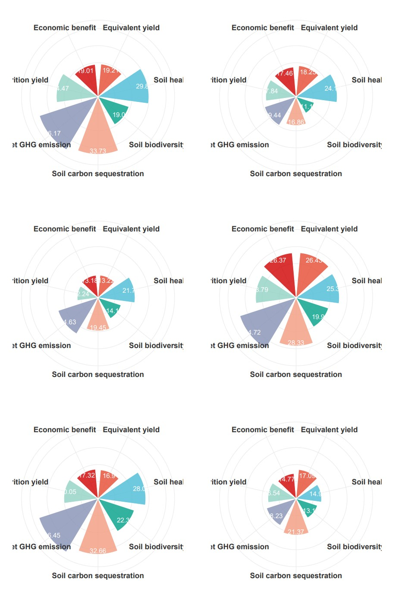

```{r setup, include=FALSE}
knitr::opts_chunk$set(
	echo=T, comment=NA, message=F, warning=F,
	fig.align="center", fig.width=5, fig.height=3, dpi=300)
```


# 玫瑰花瓣图
Nightingale Rose Chart

参考：https://mp.weixin.qq.com/s/kxrZQ6b8w26cJTvhYrk3ag
玫瑰花瓣图(Nightingale Rose Chart)是一种像花瓣一样的环形柱状图，在极坐标中将平面根据组别划分为若干等角区域，再根据数据大小的不同进行填充，形成一片片花瓣，非常适用于不同组别间数据大小的比对。

The Nightingale Rose Chart is a petal-like annular bar chart. In polar coordinates, the plane is divided into several equiangular areas according to the groups, and then filled according to the different data sizes to form petals. It is very suitable for comparing the data sizes between different groups.


### 玫瑰花瓣图案例
An example using Nightingale Rose Chart

这是中国农业大学Yantai Gan课题组2024年发表于Nature Communications上的一篇文章，题目为：Diversifying crop rotation increases food
production, reduces net greenhouse gas emissions and improves soil health

This is an article published in Nature Communications by Yantai Gan's research group at China Agricultural University in 2024. The title is: Diversifying crop rotation increases food production, reduces net greenhouse gas emissions and improves soil health


Fig. 6 d, Nightingale Rose Charts of multiple objectives analysis to assess the detailed functions for each crop rotation
图6 d，多目标分析的南丁格尔玫瑰图，用于评估每种作物轮作的详细功能


**结果**：
We used the comprehensive evaluation index concept (CEI) to assess the synergies and trade-offs of the different crop rotations related to
yield, nutritional value, soil-related indicators (health, C sequestration, microbial biodiversity), net GHG emissions, and economic benefit
(Eqs. 11–20 in Methods) (Fig. 6a, d).

我们使用综合评价指数概念（CEI）来评估不同作物轮作在产量、营养价值、土壤相关指标（健康、碳封存、微生物生物多样性）、温室气体净排放和经济效益方面的协同作用和权衡（方法中的等式11–20）（图6a，d）。


### 玫瑰花瓣图R语言实战
Nightingale Rose Chart Using R Software

```{r Nightingale Rose Chart}
# 加载必要的包
# Load required packages
library(ggplot2)
library(tidyverse)
library(patchwork)

# 读取数据
# Load the data
data <- read.csv('testdata.csv', header = TRUE, row.names = 1, check.names = FALSE)

# 数据转换
# Transform the data
data_long <- data %>%
  as_tibble(rownames = 'crop_rotation') %>%
  pivot_longer(cols = -crop_rotation, names_to = 'detailed_functions', values_to = 'values') %>%
  mutate(detailed_functions = factor(detailed_functions, levels = unique(detailed_functions)))

# 提取各组数据
# Extract data for each group
plot_data <- split(data_long, data_long$crop_rotation)

# 定义颜色调色板
# Define color palette
colors <- c('#e74a32', '#4cbcd6', '#00a188', '#f39c80', '#8592b5', '#92d2c3', '#d00000')

# 绘制极坐标柱状图函数
# Function to create polar bar plot
create_polar_plot <- function(df, colors) {
  ggplot(df, aes(x = detailed_functions, y = values, fill = detailed_functions)) +
    geom_col(width = 0.8, color = 'white', alpha = 0.8) +
    geom_text(aes(label = values), nudge_y = -2, color = 'white', size = 5) +
    scale_y_continuous(limits = c(0, 40)) +
    coord_polar(start = 0) +
    scale_fill_manual(values = colors) +
    theme_minimal() +
    theme(
      axis.title = element_blank(),
      axis.text.y = element_blank(),
      axis.text.x = element_text(size = 16, face = 'bold', color = '#333333'),
      legend.position = 'none',
      plot.margin = unit(c(1, 1, 1, 1), "cm")
    )
}

# 绘制所有组的图
# Create plots for all groups
plots <- lapply(plot_data, function(df) {
  create_polar_plot(df, colors)
})

# 组合图形并显示
# Combine and display plots
combined_plot <- wrap_plots(plots, ncol = 2) # Adjust ncol to control the number of columns in the layout
#combined_plot

# 保存图形到 PDF 文件
# Save the plot to a PDF file
ggsave("combined_plot.pdf", plot = combined_plot, width = 12, height = 18, units = "in", dpi = 300)

```


