```{r setup, include=FALSE}
knitr::opts_chunk$set(
	echo=T, comment=NA, message=F, warning=F,
	fig.align="center", fig.width=5, fig.height=3, dpi=300)
```


## 示意图或图形摘要
Schematic or graphical abstract

什么是示意图？
What is a schematic diagram?

示意图表示的是大体上描述或表示物体的形状、相对大小、物体与物体之间的联系，描述某器材或某机械的大体结构和工作的基本原理，描述某个工艺过程简单图示叫做示意图。示意图的特点就是简单明了，它突出了重点，忽略很多次要的细节。示意图具有将文字内容图形化、抽象内容具体化、复杂内容简单化、静态内容动态化等功能，同时还具有重点突出、高度概括、清晰易懂的特点。

A schematic diagram is a general description or representation of the shape, relative size, and connection between objects, describing the general structure and basic working principle of a certain equipment or machine, or describing a certain process. The characteristic of a schematic diagram is that it is simple and clear. It highlights the key points and ignores many minor details. The schematic diagram has the functions of graphically representing textual content, concretizing abstract content, simplifying complex content, and making static content dynamic. It also has the characteristics of highlighting the key points, being highly summarized, and being clear and easy to understand.

这里列举示意图素材获取的网站(Here are the websites where schematic materials were obtained)：
1.IAN MEDIA LIBRARY
参考：https://mp.weixin.qq.com/s/Veo5RJrcQapkhdQGgdWy3g

网站链接：https://ian.umces.edu/

IAN（Integration and Application Network），一个为环境管理和决策提供支持的资源网站，旨在通过整合科学和技术，推动环境可持续发展，由马里兰大学环境科学学院创建和管理。
IAN (Integration and Application Network) is a resource website that provides support for environmental management and decision-making. It aims to promote environmental sustainability by integrating science and technology. It was created and managed by the School of Environmental Science at the University of Maryland.

进入IAN，在菜单栏找到媒体库MEDIA LIBRARY，展开可看到四大类素材（Symbols、Graphics、Photos、Videos）可选。
Enter IAN, find the MEDIA LIBRARY in the menu bar, and expand it to see four major categories of materials (Symbols, Graphics, Photos, Videos) to choose from.

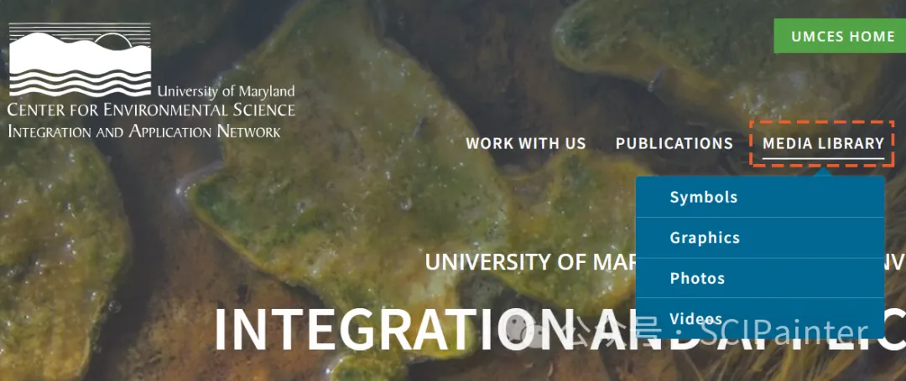

## Symbol

IAN的symbol库当前包含了3042+定制的矢量生物图标素材，可单独下载所需，也可多选或全部打包（含AI、SVG及PNG格式）。
IAN's symbol library currently contains 3042+ customized vector biological icon materials, which can be downloaded individually, or multiple selections or all packages (including AI, SVG and PNG formats).


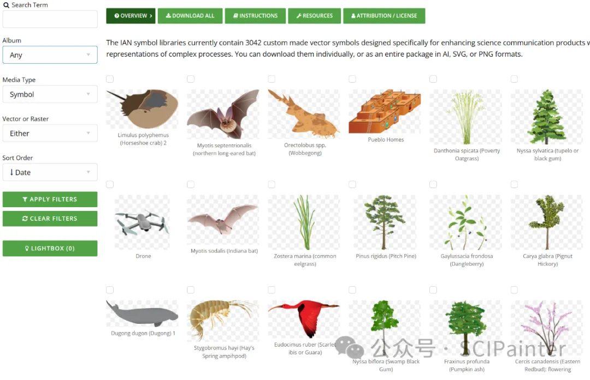

在左侧栏目中筛选，Album可切换素材分类，如不同生态系统（海洋、沙漠、淡水、草原等）、动物群（两栖、鸟、哺乳、昆虫、甲壳、软体动物等）、植物群（真菌、苔藓、草本、藻类、灌木）、人类（农业、林业、渔业等）等等类目，具体根据自己的研究背景选择。
By filtering in the left column, Album can switch material categories, such as different ecosystems (ocean, desert, freshwater, grassland, etc.), fauna (amphibians, birds, mammals, insects, crustaceans, mollusks, etc.), flora (fungi, mosses, herbs, algae, shrubs), humans (agriculture, forestry, fisheries, etc.), etc. You can choose according to your research background.


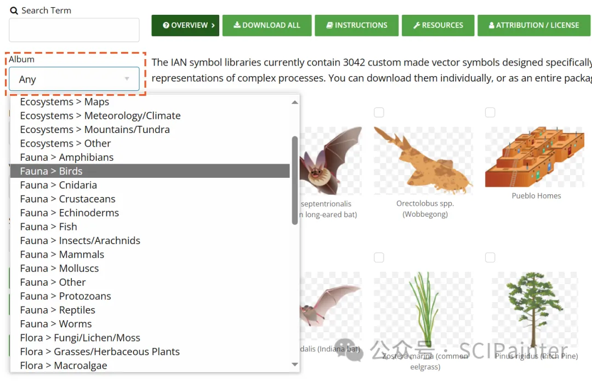
如选择Fauna>Birds，点击APPLY FILTERS，可以看到不同鸟类的素材，名称为拉丁学名。
If you select Fauna>Birds and click APPLY FILTERS, you can see the materials of different birds with their Latin scientific names.


又如切换到Grasses/Herba，可以看到各类草本类植物素材：
For example, if you switch to Grasses/Herba, you can see various herbal plant materials:

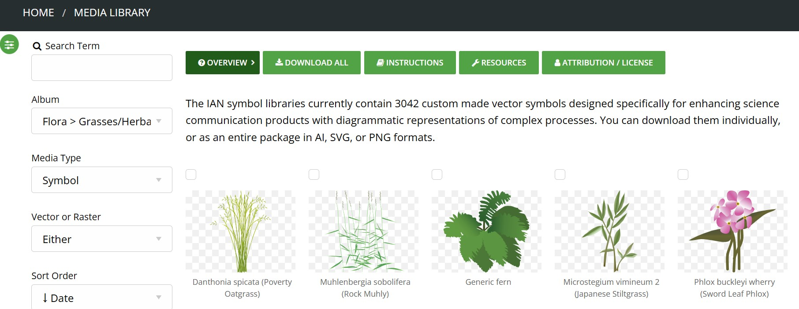

当然，也可以直接在Search Term中输入拉丁学名或关键词进行检索。点击目标素材，选择所需格式即可下载到本地。
Of course, you can also directly enter the Latin name or keyword in the Search Term to search. Click the target material, select the required format and download it to your local computer.

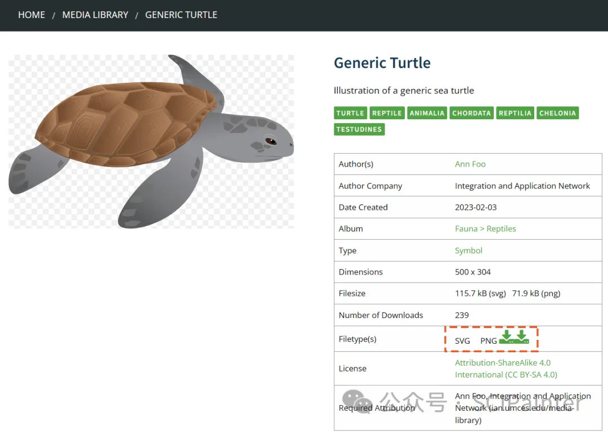


## Graphic

在Graphic中主要提供了大量生态系统研究相关的组合示意图表，相关研究背景的同学可作为灵感收集，也可下载素材，结合自己的需求进行二次加工修改，或者直接调用其中的小素材元素（矢量格式）。
Graphic mainly provides a large number of combined schematic diagrams related to ecosystem research. Students with relevant research backgrounds can collect them for inspiration, download materials, and perform secondary processing and modification based on their own needs, or directly call small material elements (vector format).

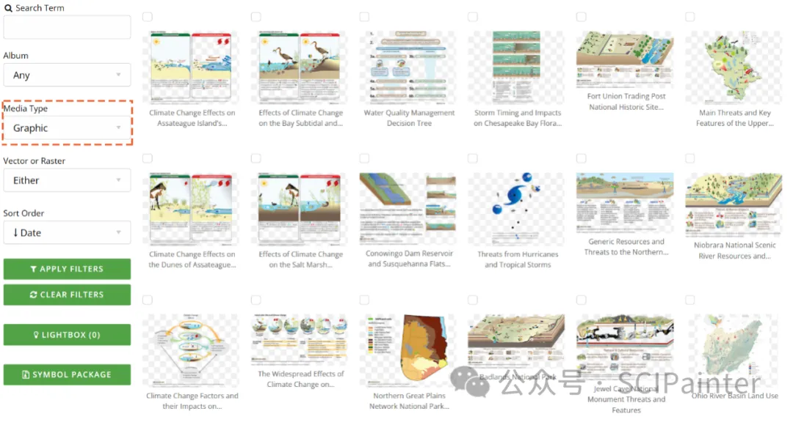


## Photos and Video

在Photo和Video中提供了大量动植物、生态相关的高质量照片和视频，这里我们不再过多赘述，感兴趣可自行查看检索。
Photo and Video provide a large number of high-quality photos and videos related to animals, plants, and ecology. We will not go into details here. If you are interested, you can check and search them yourself.

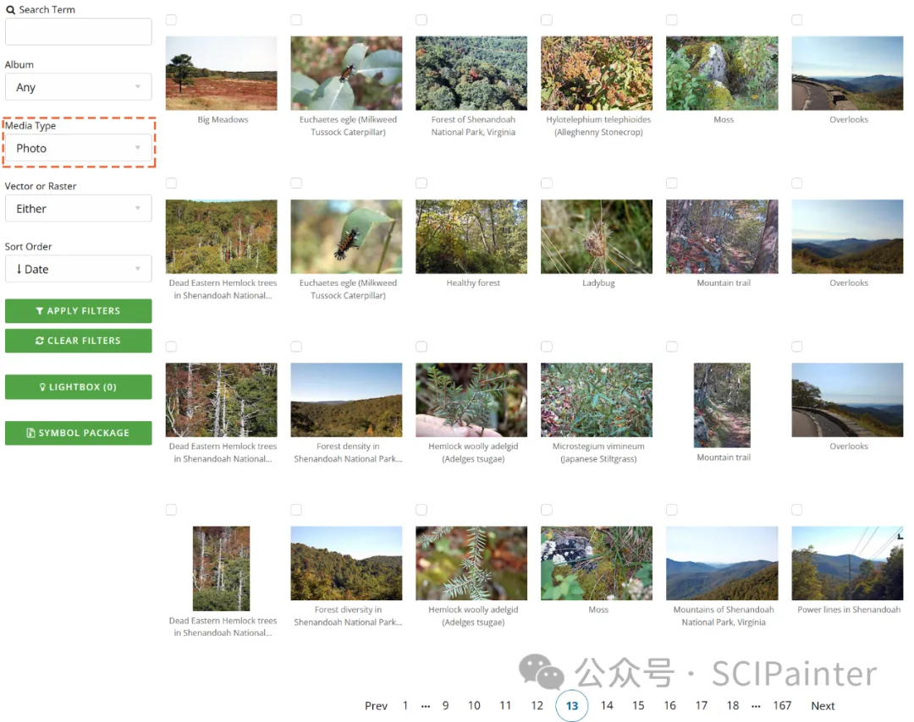


2.Bioicons

参考：https://mp.weixin.qq.com/s/W5SE5bHnclNHfR9T9npsMg

网址：https://bioicons.com/

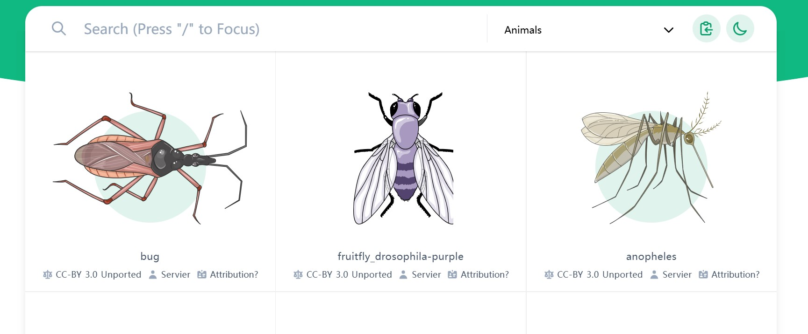


3.SciDraw

网址：https://scidraw.io/

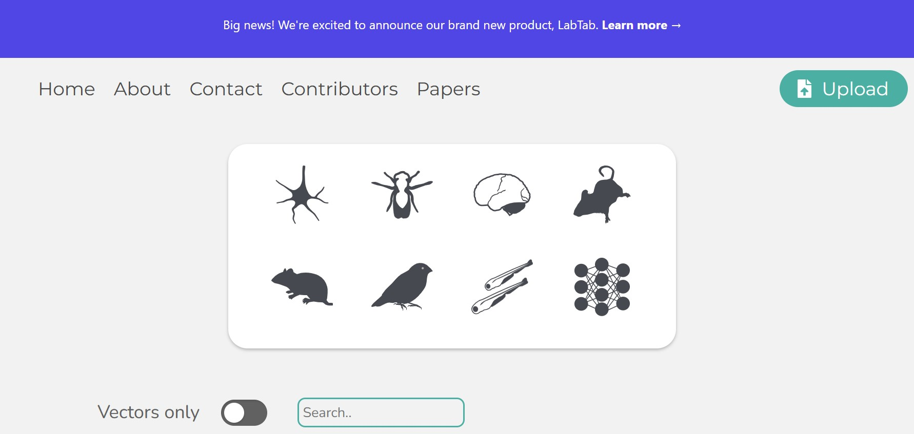


4.SMART

参考：https://mp.weixin.qq.com/s/8OpdGjXCQ_bW9aj0BriqIw

网址：https://smart.servier.com/

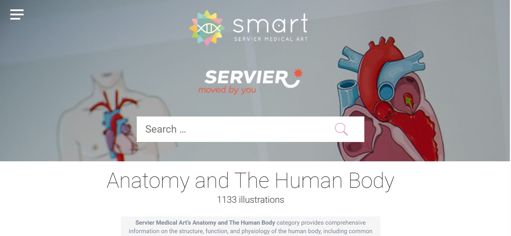


5.Phylopic

参考：https://mp.weixin.qq.com/s/ky4Dt3v5xt1If8l0ZfmDwQ

网址：https://www.phylopic.org/

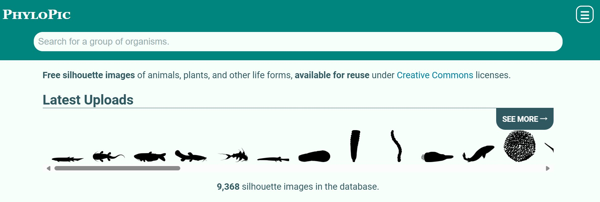


6.SwissBioPics

参考：https://mp.weixin.qq.com/s/RCGOUg_eXfb3gWuPp7Gynw

网址：https://www.swissbiopics.org/

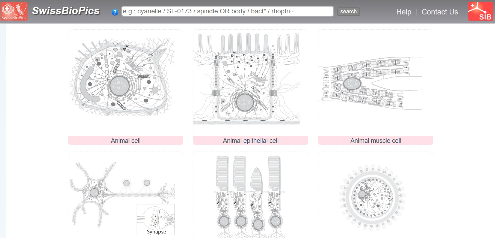


7.Freepik

高质量综合型素材网站，矢量图、照片、视频都囊括。我们可以直接检索生物相关的关键词查找素材，如这里我们勾选矢量图和免费，检索DNA：
A high-quality comprehensive material website that includes vector graphics, photos, and videos. We can directly search for biological-related keywords to find materials. For example, here we check vector graphics and free to search for DNA:

网址：https://www.freepik.com/


8.Noun Project

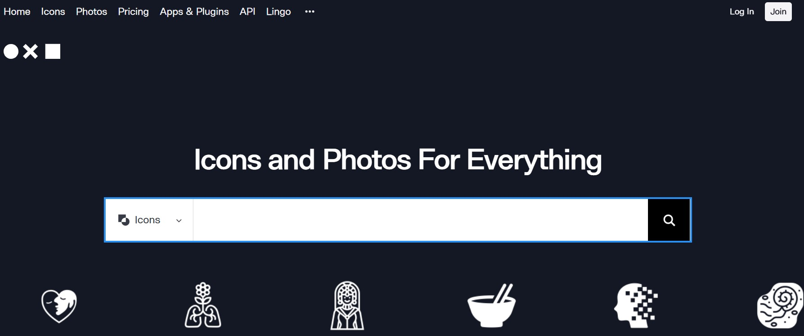


9.BioRender

BioRender是一个在线绘图网站，提供免疫学、微生物学、神经科学等30多个领域的海量图形素材和模板，其图标库拥有超过20,000个科研图标，基本可以满足生物医学领域的绘图需求。
BioRender is an online drawing website that provides a large amount of graphic materials and templates in more than 30 fields such as immunology, microbiology, neuroscience, etc. Its icon library has more than 20,000 scientific research icons, which can basically meet the drawing needs in the biomedical field.

网址：https://biorender.com/

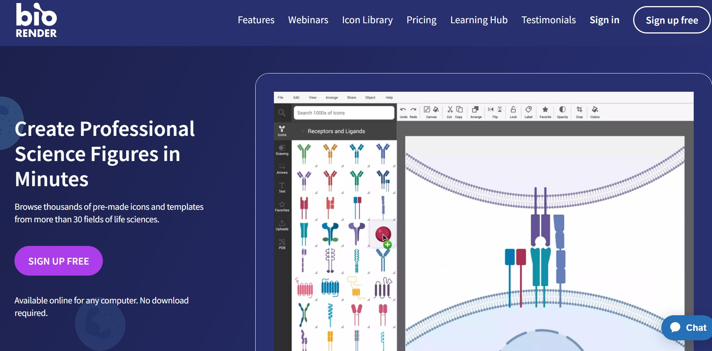


10.FigDraw

网址：https://www.figdraw.com/static/index.html#/

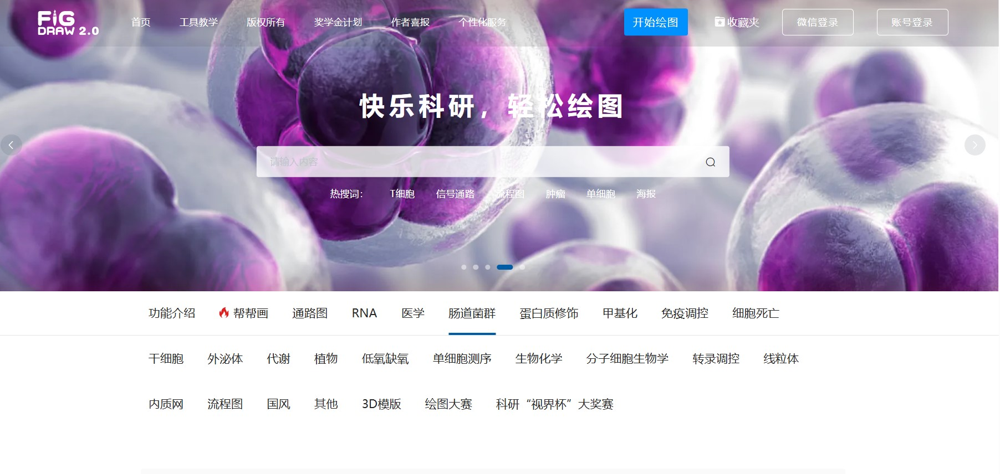


11.ColorSpace

ColorSpace是一个在线调色板生成工具，通过输入主色调颜色号，可以一键生成多种类型的配色方案，如通用渐变、匹配梯度等。
ColorSpace is an online color palette generation tool. By entering the main color number, you can generate various types of color schemes with one click, such as general gradient, matching gradient, etc.

网址：https://mycolor.space/

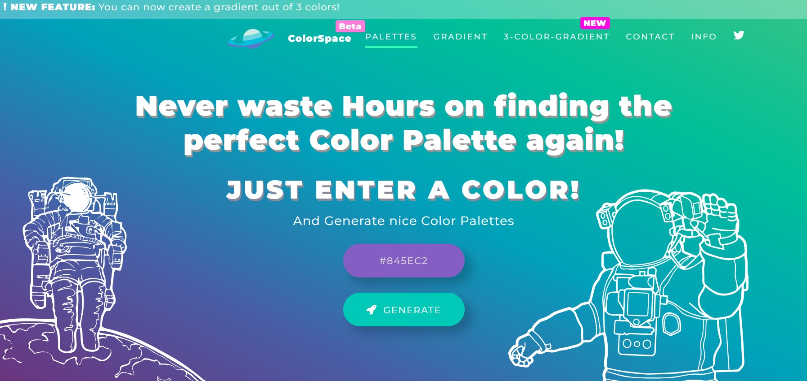


12.vecteezy

网址：https://www.vecteezy.com/

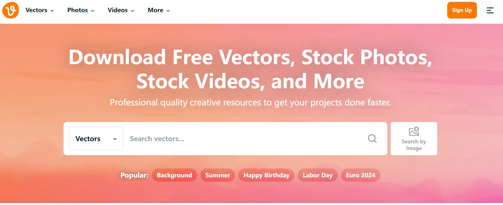


13.基因蛋白结构示意图绘制网站
13. Gene protein structure diagram drawing website

参考：https://mp.weixin.qq.com/s/7vY-RqvCNEODGKNudD_9GA

网址：https://ibs.renlab.org/

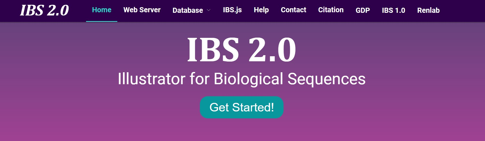

