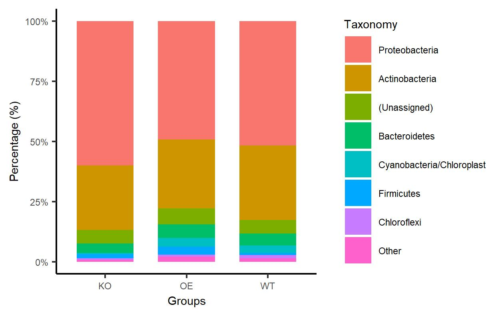
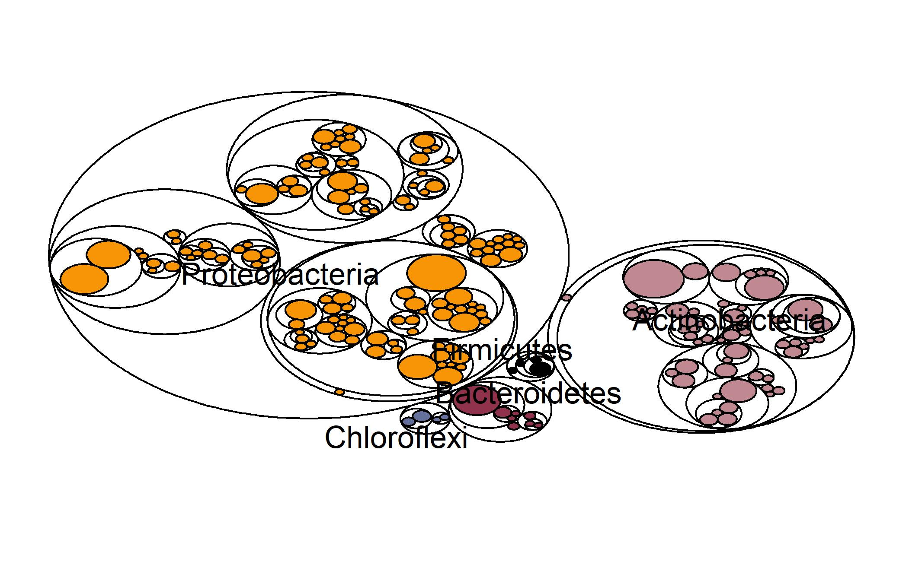
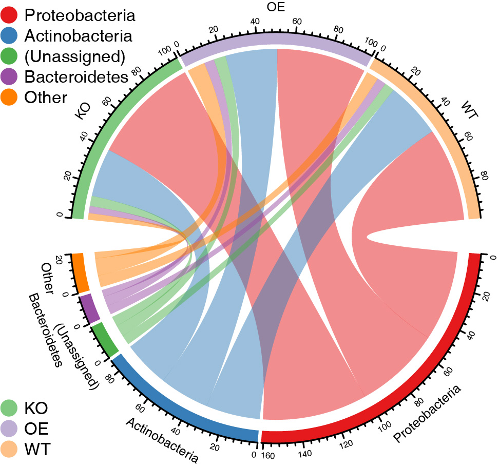

```{r setup, include=FALSE}
# 设置全局格式
knitr::opts_chunk$set(
	echo=T, comment=NA, message=F, warning=F,
	fig.align="center", fig.width=5, fig.height=3, dpi=300)
```

### 231.菌群物种组成堆叠柱状图、弦图、词云

> 本节作者：文涛，南京农业大学；刘永鑫，中科院遗传发育所
>
> 版本1.0.3，更新日期：2020年9月7日

> 本项目永久地址： https://github.com/YongxinLiu/MicrobiomeStatPlot ，本节目录 222CPCoA，包含R markdown(\*.Rmd)、Word(\*.docx)文档、测试数据和结果图表，欢迎广大同行帮忙审核校对、并提修改意见。提交反馈的三种方式：1. 公众号文章下方留言；2. 下载Word文档使用审阅模式修改和批注后，发送至微信(meta-genomics)或邮件(metagenome@126.com)；3. 在Github中的Rmd文档直接修改并提交Issue。审稿人请在创作者登记表 https://www.kdocs.cn/l/c7CGfv9Xc 中记录个人信息、时间和贡献，以免专著发表时遗漏。


#### 背景介绍

微生物群落中的物种分类学注释，常用七级分类注释系统，分别是 界（Kingdom）、门（Phylum）、纲（Class）、目（Order）、科（Family）、属（Genus）、种（Species）。虽然我们用16S扩增子测序可以得到的最详细的分类等级是种，但由于测序片段通常只有300-500bp，其实大部分只在科水平和属水平上得到较高可信度的注释。所以样本微生物群落的物种组成，通常在门、科和属这几个分类等级的丰度展示。

文章中常见的微生物物种分布展示方式种类较多样，使用频率最多的是样本或组的堆叠柱状图，来概述项目中门或属等分类级中物种分类主体的种类和丰度组成。此外还有弦度、树图、词云，以及聚类+堆叠柱状图等展示方法。下面就带大家先读懂文章，然后动手绘制这些常见各类的物种组成，以便选择合适的样本展示不同样本、不同处理或者环境微生物群落的概述和差异。

#### 实例解读

##### 例1. 不同地点+分组的微生物组门水平相对丰度堆叠柱状图

此文章是中科院遗传发育所白洋团队于2019年6月5日发表在Nature Biotechnology 杂志(37卷第6期)，并选为当期封面文章。介绍了水稻群体层面微生物组的研究并揭示了宿主调控根系微生物参与氮利用的现象。详细内容参见作者的文章解读：- [《NBT封面：水稻NRT1.1B基因调控根系微生物组参与氮利用》](https://mp.weixin.qq.com/s/s7Q1_MeodqJ0hjwDumeiXQ)。在这里，我们选择了文章中图1f为例进行讲解。


图1f. 堆叠柱状图展示两块地下籼粳稻门水平的组成。变形菌门(所占比例太高)在纲水平进行展示 。图中的样本量如下：地块1：籼稻 (n=201), 粳稻 (n=80), 土壤 (n=12); 地块2, 籼稻 (n=201), 粳稻 (n=81), 土壤 (n=12)。

> Figure 1f. Phylum-level distribution of the indica and japonica root microbiota in two fields. Proteobacteria are shown at the class level. The numbers of replicated samples in this figure are as follows: in field I, indica (n=201), japonica (n=80), soil (n=12); in field II, indica (n=201), japonica (n=81), soil (n=12).

- 结果

籼粳稻间微生物组差异在门水平也存在显著差异(图1f)。在两块地中，籼、粳稻间根系微生物组相比，籼稻更富集δ-变形菌纲(Deltaproteobacteria)、放线菌门(Actinobacteria)、产酸菌门(Acidobacteria)、拟杆菌门(Bacteroidetes)、螺旋体门(Spirochaetes)、绿弯菌门(Chloroflexi)、 Ignavibacteriae、硝化螺旋菌门(Nitrospirae)和疣微菌门(Verrucomicrobia)，而粳稻更富集α-变形杆菌纲(Alphaproteobacteria)（Wilcoxon秩和检验，FDR < 0.05，附表4. 籼粳稻间差异的门和变形菌纲）。这些数据表明，水稻亚种间差异的微生物组，在不同地块中可重复。

> The differences in the root microbiota between indica and japonica were significant and detectable at the phylum level (**Fig. 1f**). In both fields, Deltaproteobacteria, Actinobacteria, Acidobacteria, Bacteroidetes, Spirochaetes, Chloroflexi, Ignavibacteriae, Nitrospirae, and Verrucomicrobia were present at higher relative abundance in indica compared with japonica, whereas the relative abundance of Alphaproteobacteria was higher in japonica (false discovery rate (FDR) adjusted P < 0.05, Wilcoxon rank sum test; Supplementary Table 4). These data show that the root microbiota were reproducibly different in these rice subspecies.

在长期的种植历史过程中，亚洲两个主要水稻栽培亚种(籼稻和粳稻)拥有不同的基因型和表型。在这里，我们在田间条件对籼稻和粳稻多个代表品种的根系微生物组的差异进行研究，发现籼稻、粳稻品种的根系微生物组明显不同(图1)。

> During the long history of rice cultivation, two major types of Asian cultivated rice, indica and japonica, have emerged with dis-tinct genotypes and phenotypes. Here, we examined varia-tions in the root microbiota of multiple representative varieties of indica and japonica rice grown under field conditions, and showed that indica and japonica varieties recruit distinct root microbiota  (**Fig. 1**). 

##### 例2. 聚类+组均值堆叠条形图

本文2020年1月发表于《Nature Ecology & Evolution》，来自德国科隆马克斯普朗克植物育种研究所关于欧洲拟南芥群落根系微生物群的组装与适应性分化最新研究成果，该研究表明土壤和气候条件对根系微生物群落中的细菌和真菌的分化有不同的控制作用，气候是土壤中真菌位点变异和地理分布的关键驱动因素，而土壤细菌的地理分布主要受土壤因素的控制。气候的差异比土壤和本地微生物群的差异更重要。中文解读详见：- [《欧洲拟南芥群落根系微生物群的组装与适应性分化》 https://www.dxy.cn/bbs/newweb/pc/post/42609332 ](https://www.dxy.cn/bbs/newweb/pc/post/42609332)。在这里，我们选择了文章中图1b为例进行讲解。


图1b. 基于Bray-Curtis相似度的树状图显示了3年中在每个地点每个取样部位的微生物群落组成，从左至右分别为细菌、真菌、卵菌。取样部位由侧边彩色方块表示，深红色：土壤；灰色：根际（RS）；浅绿色：根际表面/根表（RP）；深绿色：根。彩色堆叠条形图表示群落组成（纲或目分类水平）。黑色柱形图表示微生物的α多样性。从土壤到根内圈，细菌、真菌和卵菌的α多样性逐渐下降，其中细菌的下降幅度大于丝状真核生物。Bray-Curtis距离聚类显示RS与Soil间的细菌群落组成有较高相似性，根表与根间的细菌群落组成有较高相似性。

注：中文一般横向条纹称为条形图，纵置则被称为柱状图/柱形图。在英文中没有明显区别，均为bar chart或bar plot。上文中的多条堆叠图称为堆叠状状图或堆叠条形图(stacked bar chart/graph/plot)

> Figure 1b. Bray–Curtis similarity-based dendrogram showing averaged bacterial (left), fungal (middle) and oomycetal (right) community composition for each compartment at each site across the 3 years. Only OTUs with RA > 0.1% were considered. The total number of processed samples was 896 and only those with more than 1,000 reads were used to calculate average Bray–Curtis distances. Compartments are indicated with coloured squares (dark red: soil; grey: rhizosphere (RS); light green: rhizoplane (RP); dark green: root). For each sample, community composition (class or order level) is indicated with bar plots, and microbial alpha diversity is represented with black bars according to the number of observed OTUs in the corresponding rarefied datasets (1,000 reads).

- 结果

基于多个重复和多年平均Bray–Curtis距离的微生物群落结构分析显示根际和根内，根际和土体土壤都按照部位聚类（图1b）。但是对于真菌和卵菌没有观察到明显的聚集现象（图1b）。

> Analysis of microbial community structure based on average Bray–Curtis distances across replicates and years revealed that bacterial communities in the root endosphere and rhizoplane cluster by compartments, and by site in the rhizosphere and soil (Fig. 1b). In contrast, no clear clustering by compartment was observed for fungi and oomycetes (Fig. 1b).


##### 例3. 堆叠柱状图+组间连线

本文于2020年7月7日由南京农业大学资源与环境科学学院沈其荣团队发表于The ISME Journal, [IF 9.49]。- [《ISME：南农沈其荣团队基于大数据准确预测土壤的枯萎病发生》](https://mp.weixin.qq.com/s/k0nqrOfhDIumX7T0mVOnFg)。在这里，我们选择了文章中图1C为例进行讲解。这里堆叠柱状图每个微生物门类之间都通过曲线连接，这在有限的微生物堆叠柱状图中可以更加清晰的观察不同处理对应的微生物门类的丰度大小变化。


图1C. 展示了枯萎病发病土壤和健康土壤的细菌群落在门水平的主要微生物相对丰度。

> Fig.1C show the relative abundance (%) of the major phyla present in the  bacterial communities in diseased and healthy soil samples.

- 结果

发病土壤具有高丰度的厚壁菌门，拟杆菌门，绿弯菌们和*Gemmatimonadetes*，但是健康土壤中却有较高丰度的变形菌门，放线菌门和酸杆菌门。

> The diseased soils harbored a higher relative abundance of Firmicutes, Bacteroidetes, Choroflexi, and Gemmatimonadetes, while the
healthy soils harbored higher relative abundances of Proteobacteria, Actinobacteria, and Acidobacteria (Fig. 1C).

##### 例4. 气泡图/树状图展示物种组成丰度和层级关系

本文由Víctor J. Carrión团队于2019年11月份发表在Science上的题为Pathogen-induced activation of disease-suppressive functions in the endophytic root microbiome的研究论文，报导了病原菌激活植物内生菌群抑病功能的现象和潜在机理， 具体的中文解读和maptree图形绘制参考宏基因组推送：

- [《Science：病原菌激活植物内生菌群的抑病功能》](https://mp.weixin.qq.com/s/zdNvGDv6Zwn2uYcqtikWYw)
- [《手把手重现Science的主图Maptree》](https://mp.weixin.qq.com/s/VPMEgjZoNH6rNYwYUT7nhQ)


图1A. 通过宏基因组提取16S rRNA基因序列注释细菌群落并统计不同门类细菌差异，最大的圈代表门水平，逐渐缩小的圈按照梯度分别代表纲，科，属。

> (A) Taxonomic differences are based on 16S rRNA sequences extracted from the metagenome. The largest circles represent phylum level, and the inner circles represent class, family, and genus.


图1B. 基于宏基因组序列注释功能和物种相关功能差异。最小的圈代表COG功能单位。圆圈大小代表了不同物种或者功能的平均丰度。S组富集的物种或者功能使用绿色标记，S+R组富集的使用蓝色标记。不显著的物种或者功能使用黄色标记。

> (B) Functional differences are based on the metagenome sequence data and assigned to taxonomic groups. The smallest circles represent the COG categories groups. The circle sizes represent the mean read relative abundance of the differentially abundant taxa and functions. Bacterial taxa or functions that are significantly enriched (FDR < 0.1) in the comparison between S and S+R are indicated in green for S and in blue for S+R; nonsignificant taxa and functions are indicated in yellow.

- 结果

发现与这些基因高度相关的微生物门类均在S+R中显著增加，包括：*Chitinophagaceae*和*Flavobacteriaceae* (*Bacteroidetes*); *Pseudomonadaceae*和 *Xanthomonadaceae* (*Gammaproteobacteria*); *Hyphomicrobiaceae*和*Rhizobiaceae* (*Alpha-proteobacteria*); 和 *Burkholderiaceae* (*Betaproteobacteria*) (图1B/C, 和附图9A)。

> Several endophytic bacterial families—including *Chitinophagaceae* and *Flavobacteriaceae* (*Bacteroidetes*); *Pseudomonadaceae* and *Xanthomonadaceae* (*Gammaproteobacteria*); *Hyphomicrobiaceae* and *Rhizobiaceae* (*Alphaproteobacteria*); and *Burkholderiaceae* (*Betaproteobacteria*)—were specifically associated with the functional enrichment we observed (Fig. 1, B and C, and fig. S9A).


#### 实战

##### 堆叠柱状图

这里使用amplicon包中的函数tax_stackplot()函数基于物种组成表、元数据分组快速绘制样本、分组下的堆叠柱状图。

安装和载入R包

```{R}
if (!requireNamespace("devtools", quietly=TRUE))
    install.packages("devtools")
library(devtools)
if (!requireNamespace("amplicon", quietly=TRUE))
    install_github("microbiota/amplicon")
suppressWarnings(suppressMessages(library(amplicon)))
```

数据常用以下格式从文件的本地或网址读取。和程序 使用的内置数据一致，供参考：

```
# 从文件读取元数据，特征表和物种注释
metadata=read.table("http://210.75.224.110/github/EasyAmplicon/data/metadata.tsv", header=T, row.names=1, sep="\t", comment.char="", stringsAsFactors=F)
otutab=read.table("http://210.75.224.110/github/EasyAmplicon/data/otutab.txt", header=T, row.names=1, sep="\t", comment.char="", stringsAsFactors=F)
taxonomy=read.table("http://210.75.224.110/github/EasyAmplicon/data/taxonomy.txt", header=T, row.names=1, sep="\t", comment.char="", stringsAsFactors=F)
```

- 分组均值门水平堆叠柱状图

使用amplicon包内置数据，输入文件为物种组成表，这里使用门水平、样本元数据并指定分组列。结果用ggsave导出指定大小的位图(jpg)和矢量图(pdf)。

```{R}
# 加载内置门水平物种组成表
data(tax_phylum)
# 加载内置元数据, 包括SampleID, Group and Site
data(metadata)
# 门水平物种组成表和元数据作为输入，分组列名为Group，默认显示前8个分类，按丰度排序
(p=tax_stackplot(tax_phylum, metadata, groupID="Group"))
zoom=1.2 # 控制图片缩放比例
# 输出图片
ggsave(paste0("p1.stackplot.group.jpg"), p, width=89*zoom, height=56*zoom, units="mm")
ggsave(paste0("p1.stackplot.group.pdf"), p, width=89*zoom, height=56*zoom, units="mm")
```



图. 门水平堆叠柱状图。以分组均值绘制，颜色采用ggplot2默认配色，展示丰度最高的7个门，其余归类为其他(Other)。

- 分组样本门水平堆叠柱状图

指定图例数量(topN)，默认为8，这里改为10。

样本而非分组均值，style默认为group，设为sample。

排序方法默认为丰度(abundance)，可选字母(alphabet)。

更多帮助查看?tax_stackplot

```{R}
# topN指定图例数量，style指定类型为样本/分组，排序可选字母
(p=tax_stackplot(tax_phylum, metadata, groupID="Group", topN=10, style="sample", sorted="alphabet"))
# 保存图片
zoom=1.5 # 控制图片缩放比例
ggsave(paste0("p2.stackplot.sample.jpg"), p, width=89*zoom, height=56*zoom, units="mm")
ggsave(paste0("p2.stackplot.sample.pdf"), p, width=89*zoom, height=56*zoom, units="mm")
```


图. 门水平样本结合分组堆叠柱状图。颜色采用ggplot2默认配色，展示丰度最高的9个门，其余归类为其他(Other)，门按字母顺序排列。图中柱数量和图例增加，放大画布比例，以确定内容处于画布中。

##### 调色板RColorBrewer

在使用中要采选择不同的配色方案。RColorBrewer包提供了多套可选配色方案。

```{r}
# 修改配色方案
library(RColorBrewer)
zoom=25.4/3 # 控制图片缩放比例
# pdf保存非ggplot2类型图片
pdf("p3.brewer.all.pdf", width=89/zoom, height=56/zoom)
display.brewer.all()
dev.off()
# jpeg保存为jpg格式
jpeg("p3.brewer.all.jpg", width=89/zoom, height=56/zoom, units="in", res=300)
display.brewer.all()
dev.off()
```


图. RColorBrewer包中可选的调色板。分类3类：连续单色渐变18种均为9个梯度、分类颜色8套包括8-12种颜色、连续双色渐变9种均为11个梯度。

我们选用Set3方案为例：

```{r}
(p=p + scale_fill_brewer(palette="Set3"))
zoom=1.5
ggsave(paste0("p4.stackplot.sample.set1.jpg"), p, width=89*zoom, height=56*zoom, units="mm")
ggsave(paste0("p4.stackplot.sample.set1.pdf"), p, width=89*zoom, height=56*zoom, units="mm")
```


图. 按Set3配色方案着色的门水平样本结合分组的堆叠柱状图。

##### 气泡图/树状图展示微生物分类

绘制树图(maptree)，也称为气泡图，如上面例4中示例展示分类学间的层级嵌套关系。

```{R}
#为保证顺利生成phyloseq对象，将两个对象调整为矩阵
otutab=as.matrix(otutab)
taxonomy=as.matrix(taxonomy)

# Input feature table, taxonomy and Top N features, and format into mapdata
mapdata=format2maptree(otutab, taxonomy, 200)
# Add mean abundance size and phylum color for maptree
mapadd=tax_maptree(mapdata)
# Saving and plotting maptree
(p=mapadd[[1]])

zoom=2
ggsave(paste0("p5.maptree.pdf"), p, width=89*zoom, height=56*zoom, units="mm")
ggsave(paste0("p5.maptree.jpg"), p, width=89*zoom, height=56*zoom, units="mm")
```



图. 树状图展示分类层级关系。按不同门着色。

##### 弦图展示微生物门类信息

tax_circlize()函数绘制弦图，方法和参数同tax_stackplot()。
结果直接保存为circlize.pdf和circlize_legend.pdf两个文件。

```{R}
# Set 4 parameters: set top 5 taxonomy, group by "Group"
tax_circlize(tax_sum=tax_phylum, metadata, topN=5, groupID="Group")
```

结果图片将直接保存到当前路径中。图例文字有重叠可用Adobe Illustrator矢量图编辑工具调整。



图. 弦图展示分组和物种组成间的对应关系。

##### 聚类+堆叠柱状图

这部分图形的实现，使用了ggtree中的分面策略，十分好用，在这里要致谢余光创教授的R包。

- 加载依赖关系

这里的ggtree需要使用19年7月以后的版本，因为这以后的版本才支持将聚类结果转化为树结构。

如果你的Bioconductor版本较旧，可能一直会安装旧版ggtree。升新方法如下：

```
## 先卸载先前的安装控制程序
remove.packages(c("BiocInstaller", "BiocManager", "BiocVersion"))
## 再安装新版程序
install.packages("BiocManager")
BiocManager::install(update=TRUE, ask=FALSE)
```

```{R library}
library("ggplot2")
library("ggdendro")
library(phyloseq)
library(tidyverse)
library(ggtree)
library(ggstance)
```

使用amplicon包中的tax_stack_clust函数绘制样本/分组的聚类图。

```{R}
result <- tax_stack_clust(otu=otutab, tax=taxonomy, map=metadata,
                            rep=6, # 重复数量是6个
                            Top=10, # 提取丰度前十的物种注释
                            tran=TRUE, # 转化为相对丰度值
                            dist="bray", hcluter_method="complete",
                            cuttree=3,
                            Group="Group")
```

- 提取样本hclust聚类结果

- 样本聚类图

结果列表中第一个元素即为样本聚类图，采用双中括号方式提取。

```{R}
(p <- result[[1]])
```

- 样本聚类和堆叠柱状图结合的图形

```{R}
(p <- result[[2]])
zoom=2 # 控制图片缩放比例
# 输出图片
ggsave(paste0("p7.stack_cluster.sample.jpg"), p, width=89*zoom, height=56*zoom, units="mm")
ggsave(paste0("p7.stack_cluster.sample.pdf"), p, width=89*zoom, height=56*zoom, units="mm")
```


图. 样本基于Bray-Curtis距离聚类样本并右侧添加门水平堆叠柱状图

- 提取分组均值聚类的结果

```{R}
(p <- result[[3]])
```

- 分组聚类和堆叠柱状图

```{R}
p <- result[[4]]
zoom=2 # 控制图片缩放比例
# 输出图片
ggsave(paste0("p7.stack_cluster.group.jpg"), p, width=89*zoom, height=56*zoom, units="mm")
ggsave(paste0("p7.stack_cluster.group.pdf"), p, width=89*zoom, height=56*zoom, units="mm")
```


图. 样本基于Bray-Curtis距离聚类样本并右侧添加门水平堆叠柱状图

##### 词云展示微生物门类信息

```{R}
library(amplicon)
# j选择分类级别，facet按分类分面，abundance是否显示丰度，rand随机数确定布局
result <- tax_wordcloud(otu=otutab, map=metadata, tax=taxonomy, group="Group", j="Phylum", facet=F, abundance=F, rand=1)
(p <- result[[1]])
zoom=2 # 控制图片缩放比例
# 输出图片
ggsave(paste0("p8.wordcloud.group.jpg"), p, width=89*zoom*3, height=56*zoom, units="mm")
ggsave(paste0("p8.wordcloud.group.pdf"), p, width=89*zoom*3, height=56*zoom, units="mm")
```


图. 词云展示各组门水平相对丰度。字体大小代表相对丰度大小。


## 参考文献

Jingying Zhang, Yong-Xin Liu, Na Zhang, Bin Hu, Tao Jin, Haoran Xu, Yuan Qin, Pengxu Yan, Xiaoning Zhang, Xiaoxuan Guo, Jing Hui, Shouyun Cao, Xin Wang, Chao Wang, Hui Wang, Baoyuan Qu, Guangyi Fan, Lixing Yuan, Ruben Garrido-Oter, Chengcai Chu & Yang Bai. (2019). NRT1.1B is associated with root microbiota composition and nitrogen use in field-grown rice. Nature Biotechnology 37, 676-684, doi: https://doi.org/10.1038/s41587-019-0104-4

Thorsten Thiergart, Paloma Durán, Thomas Ellis, Nathan Vannier, Ruben Garrido-Oter, Eric Kemen, Fabrice Roux, Carlos Alonso-Blanco, Jon Ågren, Paul Schulze-Lefert & Stéphane Hacquard. (2020). Root microbiota assembly and adaptive differentiation among European Arabidopsis populations. Nature Ecology & Evolution 4, 122-131, doi: https://doi.org/10.1038/s41559-019-1063-3

Jun Yuan, Tao Wen, He Zhang, Mengli Zhao, C. Ryan Penton, Linda S. Thomashow & Qirong Shen. (2020). Predicting disease occurrence with high accuracy based on soil macroecological patterns of Fusarium wilt. The ISME Journal, doi: https://doi.org/10.1038/s41396-020-0720-5

Víctor J. Carrión, Juan Perez-Jaramillo, Viviane Cordovez, Vittorio Tracanna, Mattias de Hollander, Daniel Ruiz-Buck, Lucas W. Mendes, Wilfred F.J. van Ijcken, Ruth Gomez-Exposito, Somayah S. Elsayed, Prarthana Mohanraju, Adini Arifah, John van der Oost, Joseph N. Paulson, Rodrigo Mendes, Gilles P. van Wezel, Marnix H. Medema & Jos M. Raaijmakers. (2019). Pathogen-induced activation of disease-suppressive functions in the endophytic root microbiome. Science 366, 606-612, doi: https://doi.org/10.1126/science.aaw9285

Guangchuang Yu, David K. Smith, Huachen Zhu, Yi Guan & Tommy Tsan-Yuk Lam. (2017). ggtree: an r package for visualization and annotation of phylogenetic trees with their covariates and other associated data. Methods in Ecology and Evolution 8, 28-36, doi: https://doi.org/10.1111/2041-210x.12628

> 责编：刘永鑫 中科院遗传发育所

> 版本更新历史

> 1.0.0，2020/9/1，文涛，初稿

> 1.0.1，2020/9/3，刘永鑫，全文校对、代码检验

> 1.0.2，2020/9/5，卢洪叶 北大口腔，全文校对、代码检验

> 1.0.3，2020/9/7，刘永鑫，整合修改


