```{r setup, include=F, message=F}
knitr::opts_chunk$set(
	echo=T, comment=NA, message=F, warning=F,
	fig.align="center", fig.width=5, fig.height=3, dpi=300)
```

### 245热图展示微生物组的物种和功能丰度或有无

> 本节作者：吴一磊 中科院微生物所
>
> 版本1.0.7，更新日期：2020年8月13日

> 本项目永久地址： https://github.com/YongxinLiu/MicrobiomeStatPlot ，本节目录 245Heatmap，包含R markdown(\*.Rmd)、Word(\*.docx)文档、测试数据和结果图表，欢迎广大同行帮忙审核校对、并提修改意见。提交反馈的三种方式：1. 公众号文章下方留言；2. 下载Word文档使用审阅模式修改和批注后，发送至微信(meta-genomics)或邮件(metagenome@126.com)；3. 在Github中的Rmd文档直接修改并提交Issue。审稿人请在创作者登记表 https://www.kdocs.cn/l/c7CGfv9Xc 中记录个人信息、时间和贡献，以免专著发表时遗漏。

#### 背景介绍

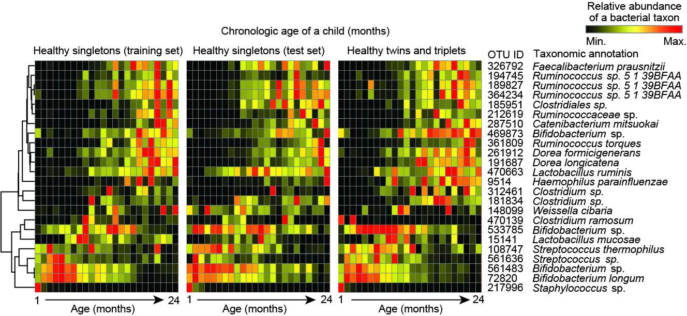

图b1. 热图展示婴儿肠道1-24个月内OTU的丰度变化。

热图是使用颜色来展示数值矩阵的图形，图中每一个小方格都代表一个数值，不同的数值对应着不同的颜色。热图通常还会结合行、列聚类分析，以展示实验数据多层面的结果。

热图在生物学领域应用广泛，尤其在高通量测序的结果展示中很流行，如样品-基因表达，样品-OTU相对丰度矩阵，都适合采用热图呈现。

在16s rDNA下游分析中，一般根据所有样本在属水平的物种注释及丰度信息，选取丰度排名前20~30的属，从物种和样本两个层面进行聚类并绘制成热图，便于发现哪些物种在哪些样本中聚集较多或含量较低。

由于阅读数字时需要思考和比较，无法形成大范围的感官印象；而热图采用颜色的深浅代替数据表使得很多规律性的结果更加明显。而且，热图在非常小的区域展示了大量的基因表达/细菌丰度数据，既可以快速比较组间的差别，同时还可以显示组内每个样品的的丰度，以及组内各样品间的重复情况，便于从中挖掘规律。结合聚类结果，使得整个实验的结果更加清晰和易于解释。

#### 实例解读

##### 例1. 不同样品中的相对丰度

本文是美国北卡罗来纳州Jeffery Dangl团队于2015年在Science发表的最早开展植物人工重组菌群的文章，研究了植物水杨酸对微生物组的影响，是该领域的开山之作，值得阅读。以下以文中图2C热图为例，为了对整图逻辑更好把握，我们将对全图进行讲解。

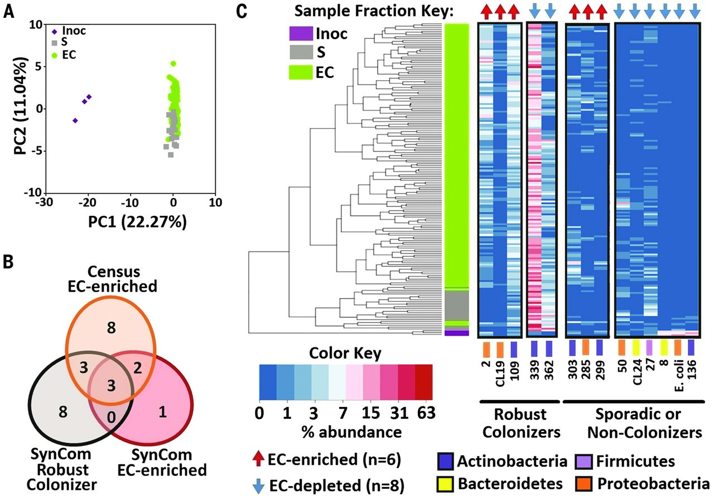

图2. 一个由38个分离培养菌组成的合成菌群在根系上的差异化定植。（A）主坐标分析（PCoA）显示接种物（Inoc，紫色菱形），土壤（S，灰色方块）和植物内生菌（EC，绿色圆圈）样品。 （B）合成群落中细菌成员的重叠情况，它们是野生型稳定植菌（黑色），EC富集的（红色）或野生农场土壤中生长根EC一致富集的（橙色）（图 1）。 （C）层级聚类热图展示了所选菌株的丰度百分比（log2转换）。 样本聚类按分数（左）拆分，EC样本按生物学重复分组。 分离株按其在大多数野生型EC样品中存在（稳定定植菌）或在大多数野生型EC样品中的不存在（零星或非定植菌）进行分组。 如图1所示，分离株的门用不同颜色表示。顶部显示的是相对于土体土壤而言，在EC中明显更丰富（红色箭头）或更不丰富（蓝色箭头）的分离株。

> Fig. 2. A 38-member synthetic community recapitulates differentiated microbiome colonization. (A) Principal coordinates analysis showing the inoculum (purple diamonds), soil (gray squares), and EC (green circles) samples. (B) The overlap of SynCom members that were robust colonizers of Col-0 EC (black), EC-enriched (red), or matched EC-enriched families from the census of roots grown in wild Mason Farm soil (orange) (Fig. 1). (C) Hierarchical clustering and heat map showing percent abundance (log2 scale) of selected isolates. Sample clustering splits by fraction (left) and EC samples grouping by biological replicate. Isolates are grouped by their presence in the majority of Col-0 EC samples (Robust colonizers) or absence in the majority of Col-0 EC samples (sporadic or non-colonizers). Isolates are color-coded to phyla as in Fig. 1. Isolates that were significantly more abundant (red arrows) or less abundant (blue arrows) in EC with respect to bulk soil are denoted along the top.

1. 图片元素解读

- 左侧聚类图为所有样品聚类的结果，左上角的图例代表三大类样品，紫、灰和绿它们分别代表接种菌、土壤和根样品，颜色标签在热图中第一列，用以区分样品组；  
- 右侧为图的主图区，展示左侧样品中对应筛选的14个差异丰度菌的相对丰度值，丰度值百分比采用log2转换来缩小数据范围，并根据数值从小到大对应的颜色梯度为蓝、白、红，即颜色越红相对丰度越高，颜色越蓝相对丰度越低。对应的图例为下方左上角的Color Key;  
- 右侧正文区上方红上或蓝下箭头，代表这些菌的表达差异情况，为上调或下调，对应的图例为下方图例区的左下方(EC-enriched/depleted)；  
- 右侧正文区下方菌的标签上还有颜色，对应最下面图例区的菌门信息；同时菌还继续分为两类，稳定定植者(Robust Colonizers)和偶然或非定植者(Sporadic or Non-Colonizers)。

2. 图表结果：图中展示了人工重组的菌在接种后，也可以形成丰度各异的微生物群体，并与自然条件下很多组成结构保持一致。

3. 图表结论或规律：受水杨酸调控差异表达的菌，可以在人工重组实验中得到验证。  

4. 图片优点：配色采用红白蓝，比较严肃；图中添加了聚类信息、分组信息和菌分类信息，极大的增加了图片的信息丰富度和可读性。

##### 例2. OTU分类丰富+饼图+宏基因组差异物种

本文是美国德克萨斯大学MD安德森癌症中心J. A. Wargo团队于2018年发表于Science杂志的文章。本研究分析了112名接受抗PD-1免疫疗法患者的口腔与肠道菌群，发现那些对免疫疗法“有反应”的患者，其菌群的组成和多样性均和“无反应”的患者有显著不同。对30名“有反应”以及13名“无反应”的患者粪便分析结果表明，前者体内Ruminococcaceae科的细菌丰度更高。而功能性分析则进一步发现，前者体内的合成代谢通路更为丰富，系统免疫力与抗肿瘤免疫力也更强。因此，对微生物组的调控有望成为肿瘤免疫疗法的重要组成部分。本文是肠道菌群和肿瘤交叉学科的热点，发表仅两年引用1100余次。

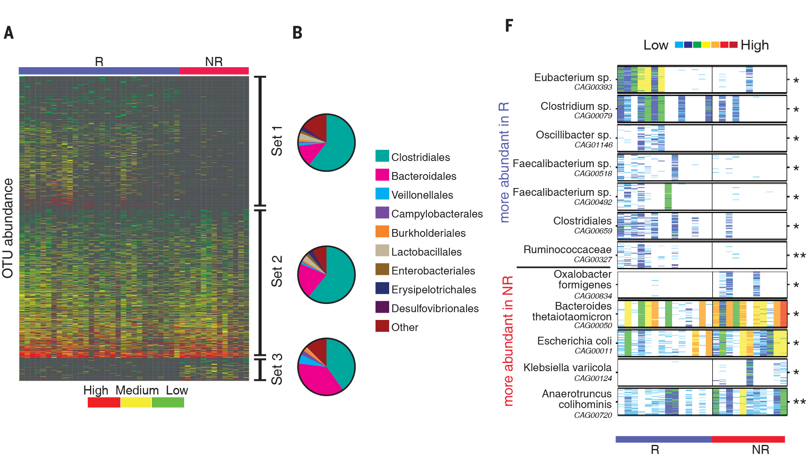

图2. 肠道微生物组成差异与免疫治疗反应相关。（A）R（n=30）和NR（n=13）中OTU丰度的热图。 列表示按治疗后反应分组分为R分组和NR分组的患者，并将它们按照多样性进行了排序； 行表示细菌OTU，根据其相对于R与NR的富集和/或消减，分为三组，然后按每组内的平均丰度进行排序。 集合1（在R中富集），集合2（未富集）和集合3（在NR中富集）。 （B）在目水平的（A）中描述的每个集合内的OTU的分类组成。 （F）将R（n=14，蓝色）和NR（n=11，红色）的粪便样本（n=25）的宏基因组测序鉴定的物种进行成对比较(MW检验)。

> Fig. 2 Compositional differences in the gut microbiome are associated with responses to anti–PD-1 immunotherapy. (A) Heatmap of OTU abundances in R (n=30) and NR (n=13). Columns denote patients grouped by response and sorted by diversity within R and NR groups; rows denote bacterial OTUs grouped into three sets according to their enrichment and/or depletion in R versus NR and then sorted by mean abundance within each set. Set 1 (enriched in R), Set 2 (unenriched), and Set 3 (enriched in NR). (B) Phylogenetic composition of OTUs within each set described in (A) at the order level. (F) Pairwise comparisons by MW test of abundances of metagenomic species identified by metagenomic WGS sequencing in fecal samples (n=25) for R (n=14, blue) and NR (n=11, red).


1. 图片元素解读

- 图A左上方展示了作者通过影像学评估对病人分为治疗后有效组(responder, R) 和 治疗后无效组(noresponder, nr)，用以表示样本的差异。
- 图A的主图区，展示上方对应样品中的OTU相对丰度值，按从小到大对应的颜色梯度为红、黄、绿，即越红越高，越绿越低。对应的图例在下方。
- 图A右侧线段，代表这些OTUs被区分为3类，集合1（在R中富集），集合2（不富集），集合3（在NR中富集）。
- 图B通过扇形图进一步展示目水平中丰度前10的物种分布情况；同时，扇形图上下排布位置与集合分类对应。
- 图C进一步结合用热图展示宏基因组数据，扩展扩增子无法区分的种水平差异。
     
2. 图表结果：图中展示了免疫治疗后，R和NR组微生物组成发生了改变；并通过扇形图具体指示了目水平上的具体分布比例(top10)。

3. 图片优点：配色采用红黄绿，对比强烈；结合OTUs富集分组信息和分组信息，丰富了解读角度。扇形图的添加，把热图的模糊差异信息具现化，使得读者能够看到具体物种分布比例的变化情况。进一步结合宏基因组测序分析，提高分析精度，并与扩增子测序结果形成双重证据链，以提高结果可信度。

##### 例3. 展示OTU潜在功能有无和物种相对丰度的时间序列变化

此文章是中科院遗传发育所白洋团队于2019年发表于国际技术类顶级期刊(Naute Biotechnology，NBT)的文章，介绍了水稻群体层面微生物组的研究并揭示了宿主调控根系微生物参与氮利用的现象。详细内容参见作者的文章解读：- [《NBT封面：水稻NRT1.1B基因调控根系微生物组参与氮利用》](https://mp.weixin.qq.com/s/s7Q1_MeodqJ0hjwDumeiXQ)。

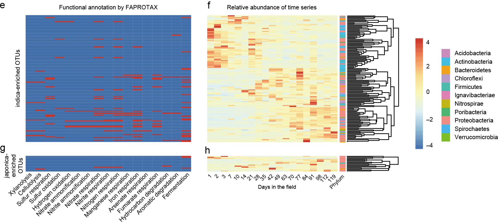

图3. 籼粳稻根系微生物组物种和功能的差异。e/g. 基于FAPROTAX注释两块中共有籼稻(e)和粳稻(g)中特异富集的OTUs。每行代表一个OTU，红色代表有文献报导包括此类功能。f/h. OTUs对应的北京昌平农场种植的水稻时间序列样品数据中的相对丰度，列代表取样天数。

> Fig. 3 | Taxonomic and functional characteristics of differential bacteria between the indica and japonica root microbiota. e,g, Metabolic and ecological functions of OTUs enriched in indica (e) and japonica (g) in two fields based on FAPROTAX. Each row represents an OTU. The presence of functions is shown in red. f,h, Pattern of relative abundance of the corresponding OTUs enriched in indica (f) or japonica (h) according to time-course data from the rice root microbiota in the field on Changping Farm.

- 结果

明显的是，大多数籼稻富集的OTUs(25.5%, 36/141 OTUs)与氮循环相关，尤其在硝酸盐氨化、硝酸盐反硝化、硝酸盐还原、硝化和亚硝酸盐氨化通路中显著富集(置换检验*P*=0.025，图3e,g；附表7)，反映出水稻淹水土壤中复杂的氮形式。值得注意的是，氮循环相关的OTUs在田间水稻生长后期相对丰度增长(图3f，g；附表7)，表明植物水稻可能与环境微生物群体活跃合作，以调节土壤中养分来优化植物的生长。

> Notably, most indica-enriched OTUs were related to nutrient cycles, especially significant (25.5%, 36 out of 141 OTUs) in nitrogen metabolism, including nitrate ammonification, nitrate denitrification, nitrate reduction, nitrification and nitrite ammonification (*P*=0.025, permutation test; Fig. 3e,g and Supplementary Table 7), reflecting the complexity of nitrogen forms used by rice in flooded soil. Notably, the relative abundance of nitrogen cycle-related OTUs increased during the later stage of rice growth in the field compared to plants at the seedling stage (Fig. 3f,h and Supplementary Table 7), suggesting that rice plants might actively coordinate the environmental microbial community to modulate soil nutrients for optimal plant growth.

- 总结

1. 图左使用热图展示不同组中特异OTU对应的功能是否存在，将枯燥的OTU编号与功能相连接，提高了结果的可读性。
2. 图右将OTU与已知时间序列数据相联系，是对这个分类单元在全生育期动态变化的呈列，使用结果描述的角度更显全面。


#### 绘图实战

最常用的是R语言的包，如heatmap、heatmap.2、pheatmap和ComplexHeatmap等。
此外Excel, matlab也可以。
不想学语言的可以使用一些专门绘制工具，如最简单的是使用ImageGP在线绘图：http://www.ehbio.com/ImageGP/index.php/Home/Index/PHeatmap.html

##### pheatmap主要参数

pheatmap(漂亮热图，Pretty Heatmaps)包只有pheatmap一个函数，使用grid图型系统构建，可以利用grid系统的相关函数进一步添加组分。由于只有一个函数，有特别多的参数，可以通过?pheatmap查看，常用的有：

- mat：用于可视化的数据矩阵

- color: 配色要求

- cellwidth/cellheight: 矩形色块的宽/高

- treeheight_row/col：行/列聚类树的高度

- cluster_rows/cluster_cols：是否对行或列聚类(TRUE/FALSE)

- clustering_distance_rows/cols：聚类时使用的距离类型，和dist()函数相同

- clustering_method：聚类方法，与hclust()相同

- show_colnames/rownames: 是否显示行/列名(TRUE/FALSE)

- annotation_row/col：给行或列添加注释信息


##### 基础热图

```{r message=FALSE}
# 加载漂亮热图绘制包pheatmap
library(pheatmap)

# 读取数据表并标准化百分比
otu <- read.delim("otutab.txt", header=T, row.names=1)
otu=as.data.frame(t(t(otu)/colSums(otu)*100))
# 通常我们只关注高丰度且显著差异的，按每个OTU的总丰度排序
otu$sum <- rowSums(otu)
# 按每行的和降序排列
otu_order <- otu[order(otu$sum, decreasing=TRUE), ]
# 取丰度前30的OTUs
mat <- otu_order[1:20, -ncol(otu)]

# pheatmap绘制热图
pheatmap(mat=mat)
# pheatmap保存图片，指定文件和图片宽高(英寸)
pheatmap(mat=mat, filename="p1.pheatmap_OTU_top20.pdf", width=4, height=3)
pheatmap(mat=mat, filename="p1.pheatmap_OTU_top20.jpg", width=4, height=3)
```
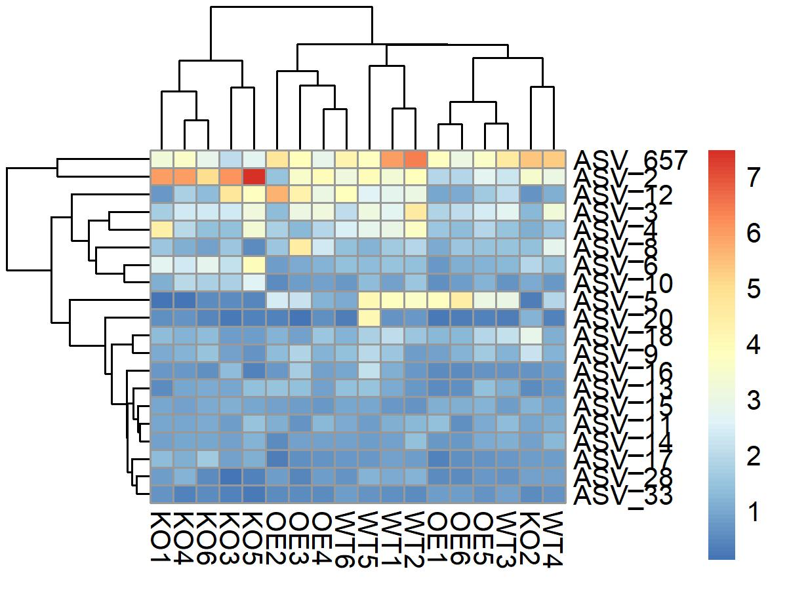

图1. ASV丰度默认热图样式。行列聚类观察样本和特征分组情况。数值范围0-7代表最高丰度的ASV仅为7%左右。

```{r message=FALSE}
# 参数: 边框色border_color默认为灰，列树高treeheight_col默认50改为5
# 指定单元格宽cellwidth和高cellheight，默认按绘图区大小自动优化
# cluster_row/cluster_col按行列聚类，show_rownames/show_colnames显示行/列名
pheatmap(mat=mat,  
         border_color='grey60', 
         treeheight_col=5,
         cellwidth=15,  cellheight=5, 
         cluster_row=F,  cluster_col=T, 
         show_rownames=F, show_colnames=T,
         clustering_method="complete", 
         filename="p2.pheatmap_OTU_top20_sample.jpg", width=4, height=2)
```

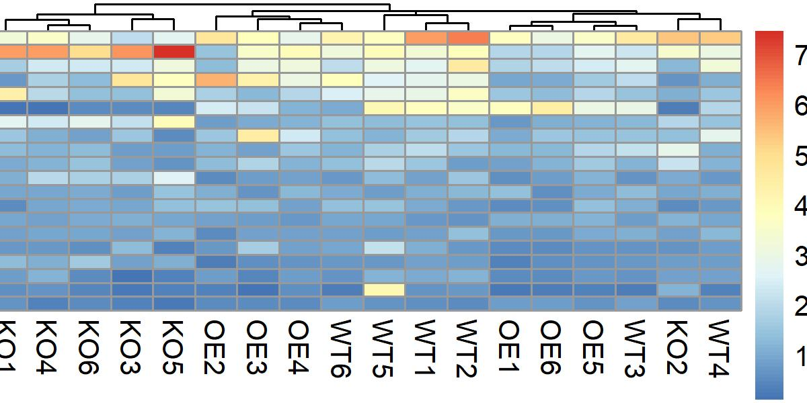

图2. 样本聚类热图。

本图打开样本聚类，用于观察样本与实验组间的对应关系，对分析结果的整体评估，同时也可以筛选异常样本并查找可能原因。列宽(cellwidth)增加防止样本名重叠。行名(show_rownames)太多看不清楚时，关闭反而效果更好。

##### 数据转换(归一化/标准化)

如果使用原始相对丰度或表达值，范围通常为0-100或0-1000000，而大部分的OTU或基因较低，做出的图会使绝大数据的数量颜色处于低丰度区，很难发现规律；因此需要数据变换，常用的方法有两类：

1. log2(x+1) x为丰度或表达值

- 给原始值+1是为了保证结果仍为正值，因为2的0次方为1；
- 为什么要使用log变换，以log2为例，0-1000的表达范围，经变化为0-10的范围，颜色梯度范围更容易使人与数值建立对应关系。
- 为什么常用log2对数变化，因为筛选差异的标准通常为两倍，log2对数变化后，每相差1的两个值都有两倍差异，选择目标很方便；有时也会根据具体情况，选择ln， log10等转换方式；

2. Z-score标准化：标准分数（standard score）也叫z分数（z-score）,是一个分数与平均数的差再除以标准差的过程。用公式表示为：z=(x-μ)/σ。其中x为某一具体分数，μ为平均数，σ为标准差。
此种方法可以使有差异且稳定变化的两组明显区分为不同的颜色，但却丢失了原始相对丰度、差异倍数的信息。但由于结果比较美观，规律明显，使用频率较高。

```{r}
# log2 转换，通常百万比经常log2转换，数据范围由1-1000000变为1-20
scale_test <- apply(mat, 2, function(x) log2(x+1))
pheatmap(mat=scale_test, treeheight_col=5, 
         cellwidth=15,  cellheight=5,
         cluster_row=F,show_rownames=F, 
         filename="p3.pheatmap_OTU_top20_sample_log2.jpg", width=4, height=2)
```
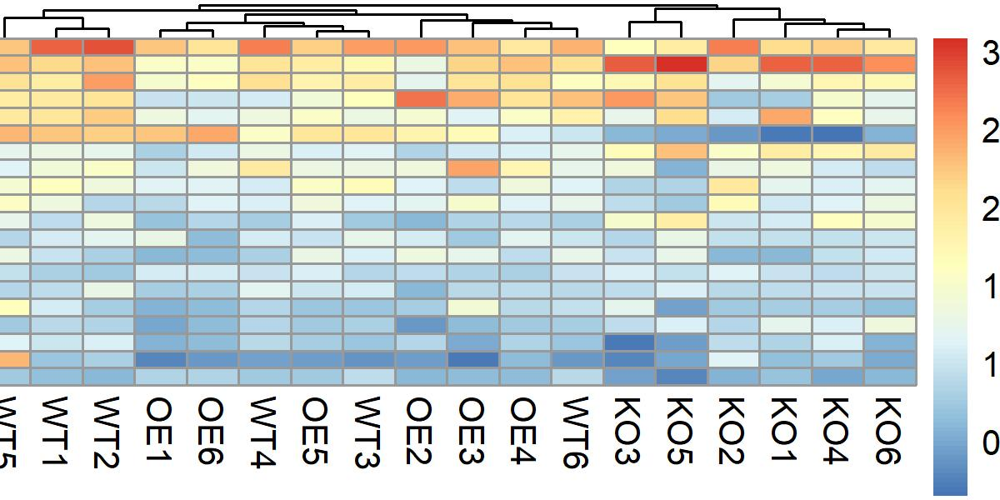

图3. 相对丰度log2转换热图。注意图例的范围由原始0-8转换为0-3之间，因为2的三次方为8。

```{r}
# scale 转换
scale_test <- apply(mat, 2, scale)
pheatmap(mat=scale_test,border_color='grey60', 
         treeheight_col=5,cellwidth=15,  cellheight=5, 
         cluster_row=F,show_rownames=F, 
         filename="p4.pheatmap_OTU_top20_sample_zscore.jpg", width=4, height=2)
```

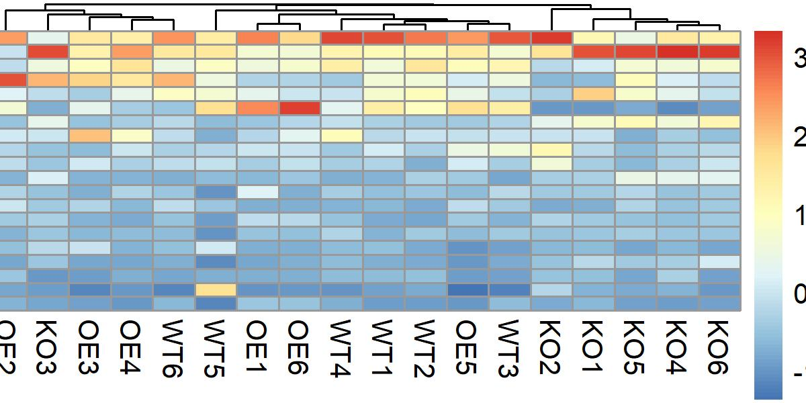

图4. 相对丰度Z-Score转换热图。注意图例的范围出现负数，代表差异相对标准差异的倍数。+1代表差异为1倍标准差，-1为负一倍标准差。在后面的差异结果可视化中常用。

##### 根据聚类结果分割热图

```{r}
# cutree_cols=3分割热图指定为3类
pheatmap(mat=scale_test, treeheight_col=5,
         cluster_row=F, show_rownames=F,
         cutree_cols=3, 
         filename="p5.pheatmap_OTU_top20_sample_cutree3.jpg", width=4, height=2)
```
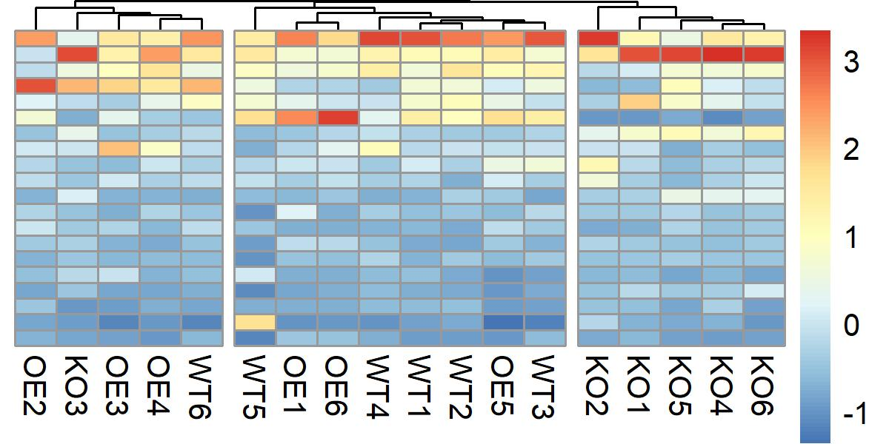

图5. 相对丰度Z-Score转换热图。可以依据聚类簇将热图分为多个板块，这样我们就可以在热图主体中直接获得不同聚类簇的信息，而不会分心去查看聚类情况，在大量数据聚集在一起的时候，非常好用。这个技巧在实战中分组规律明显时也常用。

##### 热图自定义配色

```{r}
# 利用colorRampPalette生成梯度渐变颜色，参考?colorRampPalette
first <- colorRampPalette(c("white", "navy"))(10)
second <- colorRampPalette(c("navy", "red"))(40)
palette <- c(first, second)
# color=palette自定义颜色白-海军蓝-红
pheatmap(mat=scale_test, color=palette,treeheight_col=5,
         cluster_row=F, show_rownames=F, 
         filename="p6.pheatmap_OTU_top20_sample_color.jpg", width=4, height=2)
```
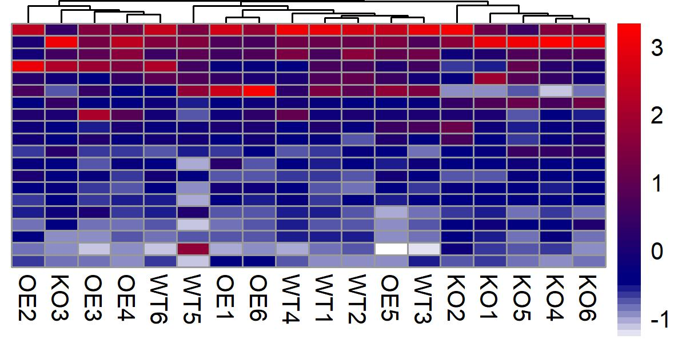

图6. 相对丰度Z-Score转换并指定白-蓝-红热图。

##### 添加行列注释信息

```{r}
# 读取元数据，添加样本注释
design <- read.delim("metadata.txt", header=T, row.names=1)
annot_data <- data.frame(row.names=colnames(mat), group=design$Group)
# 绘制添加样本列注释的图
pheatmap(mat=scale_test,treeheight_col=5,cluster_row=F,
         show_rownames=F,cutree_cols=3, annotation_col=annot_data, 
         filename="p7.pheatmap_column_annotation.jpg", width=4, height=2)
```

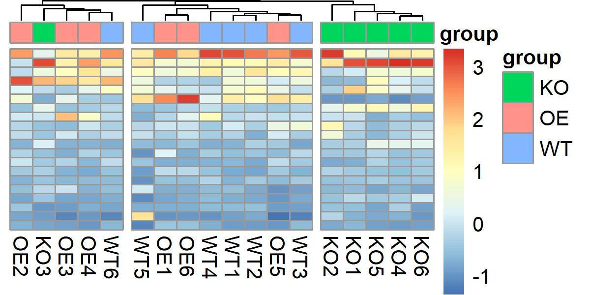

图7. 按样本列添加分组注释的热图。

##### 差异ASV+分组+分类展示

下面我综合利用上面的绘图技术，绘制一张差异比较结果的图。

差异比较可以采用R中的t.test、wilcox秩和检验、edgeR/DESeq2等，或由图形界面软件STAMP分析产生。

```{r}
# 读取比较列表
input = read.table("KO-WT.txt", header=T, row.names=1, sep="\t", comment.char="", stringsAsFactors=F)
# 筛选显著差异部分
input = subset(input, level %in% c("Enriched","Depleted"))
# 筛选差异比较中样本数据
norm = input[,-(1:7)]

# 读取实验设计注释列分组
design = read.table("metadata.txt", header=T, row.names=1, sep="\t", comment.char="")
# 准备行列注释
anno_col = data.frame(Group = design$Group, row.names = rownames(design))
# 读取物种分类添加行注释 
taxonomy = read.table("taxonomy.txt", sep = "\t", row.names=1, header=T)
input$Phylum = taxonomy[rownames(input),"Phylum"]
anno_row = data.frame(Level = input$level, Taxonomy = input$Phylum, row.names = rownames(input))
# 绘图
pheatmap(norm,
  scale = "row",
  treeheight_col=15,treeheight_row=15,
  cutree_rows=2,cutree_cols = 2,
  cluster_cols = TRUE,
  annotation_col = anno_col,
  annotation_row = anno_row,
  filename = paste("p8.KO-WT.heatmap.jpg", sep=""),
  width=8, height=5,
  annotation_names_row= T,annotation_names_col=T,
  show_rownames=T,show_colnames=T,
  fontsize=7,display_numbers=F)
```

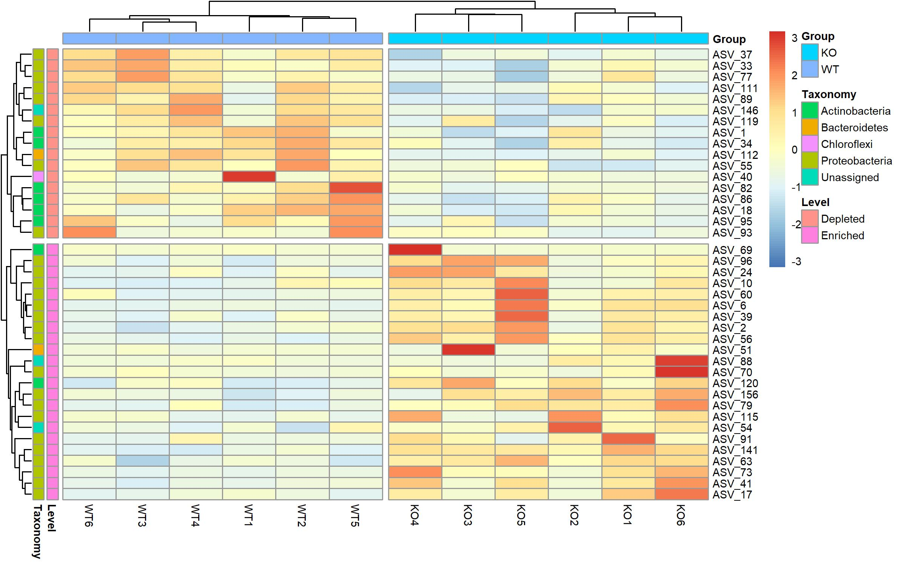

图8. KO与WT组中差异ASV热图。
行分为两个簇，分别为KO组中显著富集或消减的ASV。列分为两个簇，正好与样本分组对应，表示样本可以非常好的聚类，组间差异明显。同时ASV添加了门水平颜色注释，便于观察ASV的属性，如绝大多数显著差异ASV来源于变形菌门和放线菌门。

##### 距离矩阵+分组注释展示

Beta多样性的距离或相似矩阵也非常适合用热图展示，这里使用usearch计算的Bray-Curtis距离为例。

```{r}
# 读取比较列表
dis = read.table("bray_curtis.txt", header=T, row.names=1, sep="\t", comment.char="", stringsAsFactors=F)
# 读取实验设计注释列分组
design = read.table("metadata.txt", header=T, row.names=1, sep="\t", comment.char="")
# 准备行/列注释
anno_col = data.frame(Group = design$Group, row.names = rownames(design))
anno_row = data.frame(Group = design$Group, row.names = rownames(design))
# 绘图
pheatmap(dis,
  treeheight_col=15,treeheight_row=15,
  annotation_names_row= T,annotation_names_col=T,
  annotation_col = anno_col,annotation_row = anno_row,
  filename = paste("p9.Bray-Curtis.jpg", sep=""),width=6, height=4,
  fontsize=7,display_numbers=T)
```

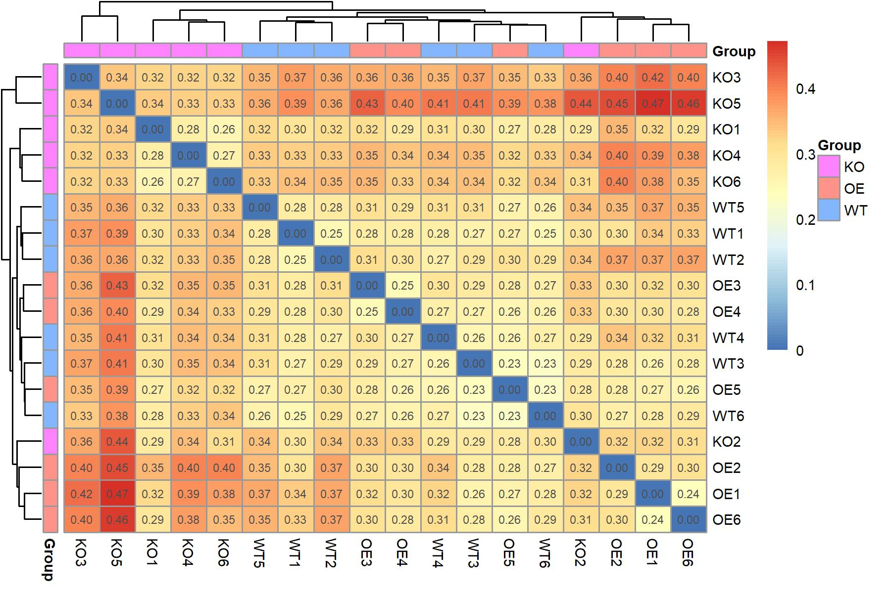

图9. 热图展示样本间的Bray-Curtis距离和聚类结果。

热图展示范围0-1之间的距离或相似性非常直观。图中对角度为自身相比距离为零为蓝色，越红则差别越大。具体的差异程度(距离)显示在小格中。样本聚类并添加分组颜色，方便筛选异常样本，如KO组中的KO2与其他5个样本没有聚类在一起，就需要注释KO2样本的实验和分析步骤是否存在异常。如有实验处理不当、数据量过高/低、数据质量过高/低等情况，可考虑调置合适的筛选阈值，以达到过滤异常样本的目的。

#### 扩展阅读

- [R语言学习笔记之热图绘制](https://mp.weixin.qq.com/s/uNh_BaoY07nn7VWnWp9ikg)
- [获取pheatmap热图聚类后和标准化后的结果](https://mp.weixin.qq.com/s/1UyGfTI5OrLa6HvOPesC-Q)
- [五彩进化树与热图更配ggtree](http://mp.weixin.qq.com/s/yWzFAS8Nk6fpTuAJzbG6nA)
- [使用ComplexHeatmap包绘制个性化热图](https://mp.weixin.qq.com/s/k4egGfHr3Yd41yKl14siQg)

#### 参考文献

- [宏基因组公众号：扩增子图表解读3热图-差异菌、OTU及功能 https://mp.weixin.qq.com/s/R8YLEKmwmJhmJrcZEze0rg](https://mp.weixin.qq.com/s/R8YLEKmwmJhmJrcZEze0rg)
- Sathish Subramanian, Sayeeda Huq, Tanya Yatsunenko, Rashidul Haque, Mustafa Mahfuz, Mohammed A. Alam, Amber Benezra, Joseph DeStefano, Martin F. Meier, Brian D. Muegge, Michael J. Barratt, Laura G. VanArendonk, Qunyuan Zhang, Michael A. Province, William A. Petri Jr, Tahmeed Ahmed & Jeffrey I. Gordon. (2014). Persistent gut microbiota immaturity in malnourished Bangladeshi children. Nature 510, 417, doi: https://doi.org/10.1038/nature13421
- Sarah L. Lebeis, Sur Herrera Paredes, Derek S. Lundberg, Natalie Breakfield, Jase Gehring, Meredith McDonald, Stephanie Malfatti, Tijana Glavina del Rio, Corbin D. Jones, Susannah G. Tringe & Jeffery L. Dangl. (2015). Salicylic acid modulates colonization of the root microbiome by specific bacterial taxa. Science 349, 860-864, doi: https://doi.org/10.1126/science.aaa8764
- V. Gopalakrishnan, C. N. Spencer, L. Nezi, A. Reuben, M. C. Andrews, T. V. Karpinets, P. A. Prieto, D. Vicente, K. Hoffman, S. C. Wei, A. P. Cogdill, L. Zhao, C. W. Hudgens, D. S. Hutchinson, T. Manzo, M. Petaccia de Macedo, T. Cotechini, T. Kumar, W. S. Chen, S. M. Reddy, R. Szczepaniak Sloane, J. Galloway-Pena, H. Jiang, P. L. Chen, E. J. Shpall, K. Rezvani, A. M. Alousi, R. F. Chemaly, S. Shelburne, L. M. Vence, P. C. Okhuysen, V. B. Jensen, A. G. Swennes, F. McAllister, E. Marcelo Riquelme Sanchez, Y. Zhang, E. Le Chatelier, L. Zitvogel, N. Pons, J. L. Austin-Breneman, L. E. Haydu, E. M. Burton, J. M. Gardner, E. Sirmans, J. Hu, A. J. Lazar, T. Tsujikawa, A. Diab, H. Tawbi, I. C. Glitza, W. J. Hwu, S. P. Patel, S. E. Woodman, R. N. Amaria, M. A. Davies, J. E. Gershenwald, P. Hwu, J. E. Lee, J. Zhang, L. M. Coussens, Z. A. Cooper, P. A. Futreal, C. R. Daniel, N. J. Ajami, J. F. Petrosino, M. T. Tetzlaff, P. Sharma, J. P. Allison, R. R. Jenq & J. A. Wargo. (2018). Gut microbiome modulates response to anti–PD-1 immunotherapy in melanoma patients. Science 359, 97-103, doi: https://doi.org/10.1126/science.aan4236
- Science封面：重磅三连！肠道菌群竟对肿瘤免疫疗法如此重要 https://mp.weixin.qq.com/s/_pfxKCqFV0QDGMamZOqVNw
- Jingying Zhang, Yong-Xin Liu, Na Zhang, Bin Hu, Tao Jin, Haoran Xu, Yuan Qin, Pengxu Yan, Xiaoning Zhang, Xiaoxuan Guo, Jing Hui, Shouyun Cao, Xin Wang, Chao Wang, Hui Wang, Baoyuan Qu, Guangyi Fan, Lixing Yuan, Ruben Garrido-Oter, Chengcai Chu & Yang Bai. (2019). NRT1.1B is associated with root microbiota composition and nitrogen use in field-grown rice. Nature Biotechnology 37, 676-684, doi: https://doi.org/10.1038/s41587-019-0104-4
- Nat. Biotechnol.：水稻NRT1.1B基因调控根系微生物组参与氮利用 https://mp.weixin.qq.com/s/s7Q1_MeodqJ0hjwDumeiXQ


> 责编：刘永鑫 中科院遗传发育所

> 版本更新历史

> 1.0.0，2020/6/6，吴一磊，初稿

> 1.0.1，2020/6/9，刘永鑫，文涛修改建议

> 1.0.2，2020/7/13，吴一磊，大修

> 1.0.3，2020/7/13，刘永鑫，修改补充背景和实例

> 1.0.4，2020/7/14，吴一磊，小修

> 1.0.5，2020/8/11，刘永鑫，补充实例、和代码

> 1.0.6，2020/8/13，卢洪叶，校对

> 1.0.7，2020/8/13，刘永鑫，校对、网络发行
