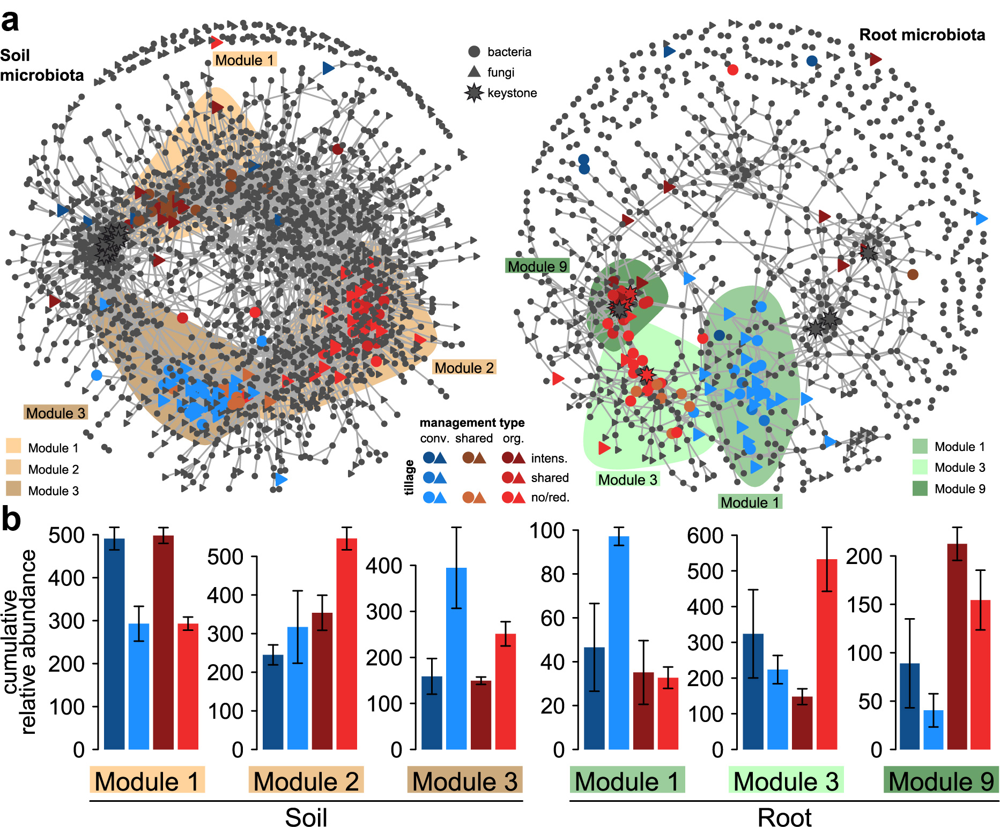
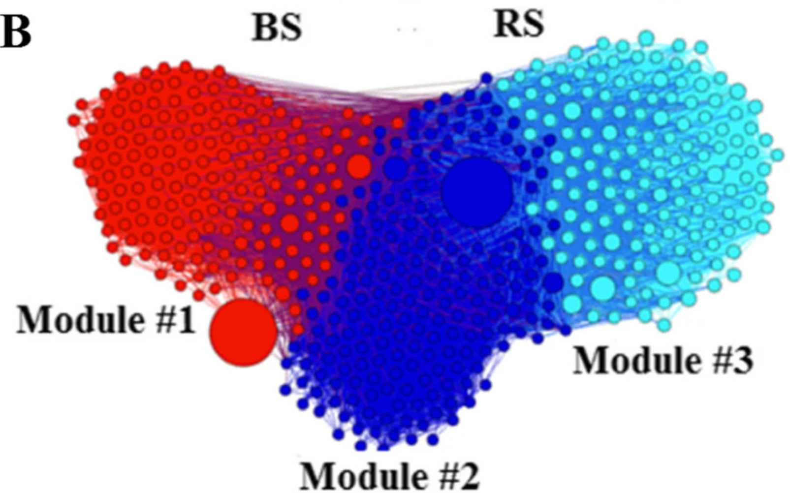
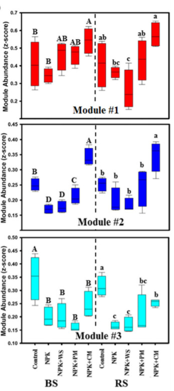
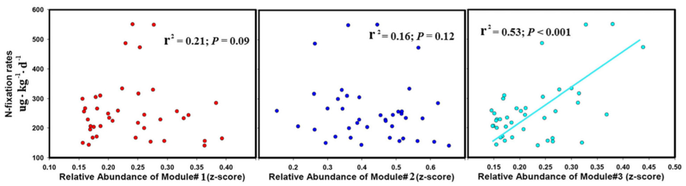
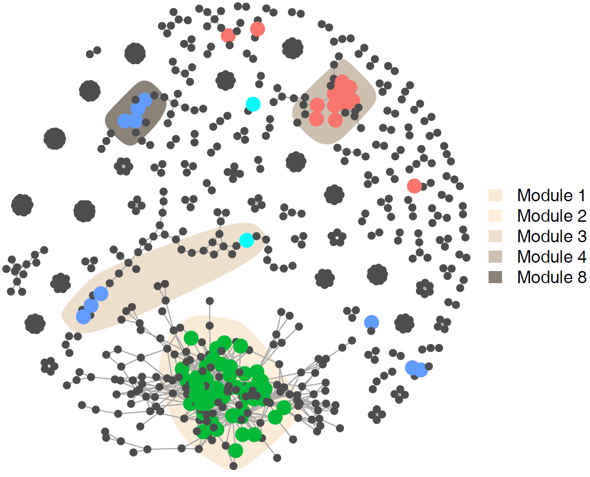
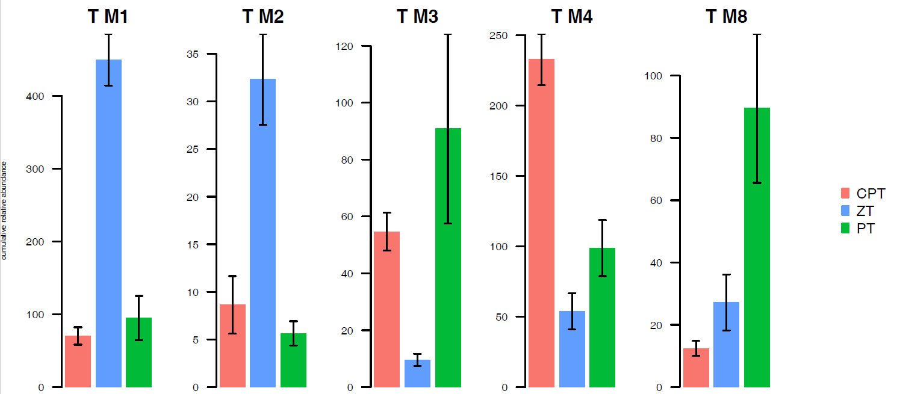
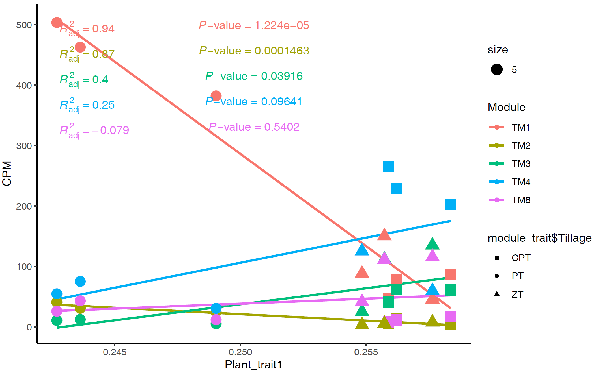

```{r setup, include=F, message=F}
knitr::opts_chunk$set(
	echo=T, comment=NA, message=F, warning=F,
	fig.align="center", fig.width=5, fig.height=3, dpi=300)
```

### 252体现组间差异OTU/模块的微生物网络图

> 本节作者：李雨泽 西北农林科技大学
>
> 版本1.0.2，更新日期：2020年8月20日

> 本项目永久地址： https://github.com/YongxinLiu/MicrobiomeStatPlot ，本节目录 252NetworkModule，包含R markdown(\*.Rmd)、Word(\*.docx)文档、测试数据和结果图表，欢迎广大同行帮忙审核校对、并提修改意见。提交反馈的三种方式：1. 公众号文章下方留言；2. 下载Word文档使用审阅模式修改和批注后，发送至微信(meta-genomics)或邮件(metagenome@126.com)；3. 在Github中的Rmd文档直接修改并提交Issue。审稿人请在创作者登记表 https://www.kdocs.cn/l/c7CGfv9Xc 中记录个人信息、时间和贡献，以免专著发表时遗漏。

#### 网络分析的概念、组成及特征

基于图论，网络分析将系统中的个体看作节点，利用节点间两两相关性形成的边构建起整体网络，以呈现系统的整体、个别拓扑性质。作为微生物生态学数据分析的一个重要手段受到了广泛关注，近年来从社会学、信息科学等学科向生态学、医学扩展。一般地，网络由节点、边作为基本的组成成分，点可以根据映射的属性设置颜色、大小、形状，边也如此；在微生物生态学分析中，网络节点一般为OTU/其它分类水平中的成员，着色则是门、纲水平的分类学信息、或反映当前处理/环境下的微生物群落属性。然而，部分学科，尤其是农业相关的学科往往具有较多处理，双因素试验较常见，使用常规的网络分析表现力有限，因此，从节点丰度在处理间/组间的差异入手，将来自不同处理/环境的OTU融入同一个网络中进行分析是一项具有新意的微生物组数据分析可视化方法；此外，受到传统农学“3重复”思维的影响，试验计划开始时设计重复数不足，导致较少的样本数往往不足以进行稳定可信的网络分析，将多个样本合并可以在很大程度上解决这一问题，为数据的进一步挖掘分析提供更多选择。

在这类网络分析中，微生物共现网络（co-occurrence network）或被按照所有模块着色，寻找这些模块间的丰度差异；或被按照差异OTU着色，寻找这些OTU所在模块的丰度差异。最终的组间差异模块还可以和测定的其它土壤、植物性状进行相关性/回归分析，进一步体现微生物网络分析的实际意义。

#### 体现组间差异OTU/模块的网络图实例


##### 例1.不同处理间差异OTU及模块在网络中展示

此文章是瑞士苏黎世农业研究中心Klaus Schlaeppi团队于2018年发表于Microbiome (IF = 11.607)的文章，以基于成员丰度比较的网络分析揭示了不同的智慧农业管理方式（有机农业，保护性耕作）对土壤、根系微生物网络的影响，尤其是加深了对种植方式敏感微生物的理解，为开发智慧农业的微生物组管理提供了基础。本文是一篇制作精良非常值得学习的文章，发表两年被引过百次。这里以原文中的图4a，b为例。



图4. 种植方式敏感OTUs的共丰度网络。a, 土壤（左图）、根系（右图）中的细菌和真菌共现性网络。b, 土壤、根系微生物**网络中包含有组间差异OTU的主要模块的相对丰度**。

> Fig. 4 Co-occurrence patterns of cropping sensitive OTUs. a, Co-occurrence networks visualizing significant correlations (ρ > 0.7, p < 0.001; indicated with gray lines) between bacteria and fungi OTUs in soil and root communities. b, Cumulative relative abundance (as counts per million, CPM; y-axis in ×1000) of all bacteria and fungi of the cropping sensitive modules in soil and root networks.

- 结果

我们探索了土壤和根系细菌和真菌的亚共存模式中种植方式敏感OTUs(csOTU)的分布模式（图4a，表1）。微生物群落成员的互作网络分析表明，微生物成员的丰度模式响应种植方式（处理）。 

> We explored the distribution patterns of csOTUs in meta co-occurrence patterns of bacteria and fungi in soil and root communities (Fig. 4a, Table 1). We found that the abundance patterns of inter-kingdom microbial associations also responded to cropping practices. 

在土壤微生物网络中，耕作对群落的影响很明显，模块M1明显在网络中独立聚类存在，其中包含集约耕作的差异OTU，与其他两个模块（M2和M3）分开；M2和M3主要包含O-RT（有机管理少耕耕作）和C-NT（常规管理免耕耕作）处理下的差异OTU（图4a，b）。农业管理也是根微生物网络的主要驱动力（图2），属于有机管理的大量差异OTU位于模块M3和M9中，并与包含常规管理差异OTU的模块M1分开（图4b）。 

> The effect of tillage intensity in the soil communities was apparent with a discrete module (M1) in the soil network, containing csOTUs specific to intensive tillage practices. M1 was separated from two other modules (M2 and M3) that primarily contained csOTUs specific to the O-RT and C-NT cropping systems (Fig. 4a, b). Similarly, management type presented the main driver in root communities (Fig. 2), and the numerous csOTUs assigned to organic management were predominantly located in modules M3 and M9 and separated from module M1 containing primarily conventional management specific OTUs (Fig. 4b).

- 讨论

在土壤和根微生物网络中都观察到了包含大量组件差异OTU及其所在的模块，这些模块对不同的耕作方式有相似的响应（图4，附加文件1：图S14）。差异OTU被聚集在不同的模块中，这些模块的丰度差异反映在不同的种植系统下。

> In both soil and root meta-networks, we identified modules containing high proportions of OTUs responding similarly to different cropping practices (Fig. 4, Additional file 1: Fig. S14). We observed that csOTUs grouped in distinct modules that reflected the different cropping systems. 

##### 例2.不同处理和生态位间OTU网络的模块

此文章是中国科学院南京土壤研究所褚海燕团队于2019年发表于Microbiome (IF = 11.607)的文章，该文章发现长期的施肥抑制土壤固氮及固氮菌群。其中将所有样本（不同生态位，不同处理）纳入一个网络中进行模块划分及丰度比较，这里以原文中的图1b，d，图3为例。详细解读见：[Microbiome：40年施肥处理后固氮菌及氮固定受抑制](https://mp.weixin.qq.com/s/jQ21NFLVPLha6JdmzbGSZg) [新闻稿:南土所褚海燕组揭示长期施肥抑制根际微生物固氮的作用机制](https://mp.weixin.qq.com/s/XcUp6Nt14ELES9cpgir-yg)。

 

图1b. 来自所有的样本进行网络分析，其节点根据三个主要生态簇进行着色（模块1-3）。

> b. Network diagram with nodes colored according to each of the three main ecological clusters (modules #1–3). 


 

图1d. 不同施肥方式（处理）下、不同生态位间的模块相对丰度的比较。不同字母代表不同组间存在显著差异。

Relative abundance of the ecological clusters in different fertilization treatments. Different letters indicate the values that differ significantly among treatments at *P* < 0.05 (Duncan’s test) in bulk soil (A, B, C) and rhizosphere soil (a, b, c).

- 结果

我们建立了一个包含所有固氮菌的相关网络，并发现了3个固氮菌生态簇（模块）彼此强烈共生（模块＃1，＃2和＃3;图1b）。

> We built a correlation network incorporating the detected dominant diazotrophic phylotypes and found three ecological clusters of N fixers strongly co-occurring with each other (modules #1, #2, and #3; Fig. 1b). 

长期施肥导致生态簇（模块）相对丰度发生剧烈变化，模块3的相对丰度大大降低，模块1和2的相对丰度有所提高（图1d）。 

> Long-term fertilization resulted in drastic changes in the relative abundance of ecological clusters; the relative abundance of module #3 was strongly reduced and that of modules #1 and #2 was somewhat increased—particularly under NPK + CM additions (Fig. 1d).

##### 例3. 观测指标与组间差异模块丰度进行联合分析

同样是例2中的文献，为了理解固氮菌的共丰度网络中模块丰度及固氮速率的关系，将二者进行了回归分析。 

 

图3. 不同的固氮菌模块与固氮速率的线性回归关系。

> Regressions between the nitrogen fixation rates and the relative abundance of the main diazotrophic ecological clusters. From left to right are modules #1, #2, and #3, represented by red, blue, and cyan plots, respectively）

- 结果

模块3的相对丰度变化与固氮速率之间存在显著正相关关系（图3）；模块1，模块2相对丰度和固氮速率之间无显著关联（图3）。

> A strong and significant positive association between the relative abundance of module #3 and N fixation rates was found (Fig. 3). However, no significant association was detected between the relative abundance of module #1, module #2, and N fixation rates (Fig. 3). 

- 讨论

物种（及所属模块）相对丰度的降低也可能对固氮速率产生负面影响。事实上，通过降低模块3中固氮菌的相对丰度，发现长期施肥与固氮间接地负相关。这表明在长期施肥下，模块3中的固氮菌受抑制，对固氮速率产生负面影响。 

Reductions in the relative abundance of these taxa could also negatively influence N fixation rates. In fact, long-term fertilizations were found to be indirectly negatively associated with N fixation, by decreasing the relative abundance of N fixers within module #3. This indicates that taxa within module #3 will be suppressed under long-term fertilization with negative consequences for N fixation rates.

#### 组间差异OTU/模块网络图的

测试数据及代码 

模拟的测试数据设定处理为三种耕作措施CPT，PT，ZT下的作物根际土壤，每个处理三次重复，于T，J，F三个时期采样，这里利用以下分析流程将存在显著耕作间差异的OTU及其在网络中所在模块凸显出来，并绘制模块相对丰度比较图，最后与植株性状进行关联分析。示例仅选取T时期下的样本进行操作。 

##### 包和数据的准备

```{r}
#####所需的包
# Bioconductor包安装器
if (!requireNamespace("BiocManager", quietly=TRUE))
 install.packages("BiocManager")
library(BiocManager)
# 检查bioconductor来源包是否需要安装
if (!requireNamespace("edgeR", quietly=TRUE))
 BiocManager::install("edgeR")

library(edgeR)#用于基于edgeR的组间差异OTU识别
library(indicspecies)#用于基于indicator species的组间差异OTU识别
library(igraph)#用于共现性网络的绘制
library(Hmisc)#进行共现性网络构建前的OTU两两相关性计算
library(sciplot)#用于基于模块丰度的绘图
library(reshape2)#用于长宽数据转换
library(ggpmisc)#用于其它观测指标与组间差异模块丰度关系分析

#####输入OTU表格数据 #####
otu_its <- read.table("d1_otu_table.txt",row.names=1,sep="\t",header=T, blank.lines.skip=F,check.names=F)
otu_its <- as.matrix(otu_its)

#####输入OTU物种分类数据 #####
tax_its <- read.table("d2_otu_taxa.txt",row.names=1, sep="\t", header=F,stringsAsFactors=F,quote="")
colnames(tax_its) <- c("Kingdom","Phylum","Class","Order", "Family", "Genus", "Species")
tax_its[tax_its==""] <- "unassigned"

#####输入metadata数据 #####
design_its <- read.table("d3_metadata.txt", header=T, row.names=1, na.strings="NA")
design_its$tillage <- factor(design_its $tillage,c("CPT","PT","ZT"))
design_its$stage <- factor(design_its $stage ,c("T","J","F"))
design_its$tilstag <- factor(design_its $tilstag,c("CPTT","CPTJ","CPTF","PTT","PTJ", "PTF","ZTT","ZTJ","ZTF"))

#####输入其它性状（plant_trait）数据 #####
plant_trait <- read.table("d4_plant_trait.txt", header=T, row.names=1, na.strings="NA")
```

##### 数据筛选

由于示例涉及较多水平的样本，因此计划采用合并耕作处理，将3个生育时期分别展示的策略，这里以T时期下的网络为例

```{r}
#####以其中的T时期为例进行network的绘制#####
tsamples <- rownames(design_its)[which(design_its$stage == "T")]
otu_its_t <- otu_its[,tsamples]
#去除一些低丰度OTU，在至少i个样本中具有至少j个序列
#otu_its_t <- otu_its_t[which(rowSums(otu_its_t >= j) >= i),]
design_its_t <- droplevels(design_its[tsamples,])
tax_t_its <- tax_its[rownames(otu_its_t),] 
```

##### 差异分析

在绘制网络之前需要找出具有组间差异的OTU，往往取2-3种差异判别方法的交集，如indicator species分析、edgeR分析、limma分析

```{r}
#####寻找基于indicator species的组间显著差异OTU并保存结果#####
edgeR_its_t <- DGEList(counts=otu_its_t, 
      group=design_its_t$tillage,
      genes=tax_t_its)
#CPM标准化
otu_norm_its_t <- cpm(edgeR_its_t, normalized.lib.sizes=T, log=F)
# 准备数据：T时期下组间的indicator species
indic_t_its <- as.data.frame(t(otu_norm_its_t))
indic_t_groups_its <- design_its_t$tillage
# 设置随机数种子，保证置换检验可重复
set.seed(8046)
# 鉴定各组指示种
indicatorsp_t_its <- multipatt(indic_t_its,indic_t_groups_its,func = "r.g",control=how(nperm=1000))
indic_t_df_its <- indicatorsp_t_its$sign

#按照阈值p.value < 0.05筛选各组显著的指示OTU
CPT_t_its <- as.matrix(indic_t_df_its[which(indic_t_df_its$s.CPT == 1 & indic_t_df_its$p.value < 0.05),])
PT_t_its <- as.matrix(indic_t_df_its[which(indic_t_df_its$s.PT == 1 & indic_t_df_its$p.value < 0.05),])
ZT_t_its <- as.matrix(indic_t_df_its[which(indic_t_df_its$s.ZT == 1 & indic_t_df_its$p.value < 0.05),])
#合并
t_r_values_its <- rbind(CPT_t_its,PT_t_its,ZT_t_its)
# 组名修正，删除多余的"s."
# colnames(t_r_values_its)[1:3] <- c("CPT","PT","ZT")
colnames(t_r_values_its)[1:3] <- gsub("s.","",colnames(t_r_values_its)[1:3])

#####寻找基于edgeR的组间显著差异OTU#####
model_matt_its <- model.matrix(~tillage, data=design_its_t)
edgeR_its_t_tillage <- DGEList(counts=otu_its_t, group=design_its_t$tillage, genes=tax_t_its)
edgeR_its_t_tillage <- calcNormFactors(edgeR_its_t_tillage)
dge_ttillage_its <- estimateGLMRobustDisp(edgeR_its_t_tillage, design=model_matt_its)
fit_ttillage_its <- glmFit(dge_ttillage_its, design=model_matt_its)
# 2，3组分别与1组比较
lrt_ttillage_its <- glmLRT(fit_ttillage_its, coef=2:3)
tillage_t_its <- topTags(lrt_ttillage_its, n=Inf, p.value=0.05)
tillage_t_its <- tillage_t_its$table

##### (可选)limma分析，取indicator species、edgeR、limma的交集，但是这样可能太严格导致OTU极少
#limma_voom_t_its <- voom(edgeR_its_t_tillage, model_matt_its)
#fit_t_its <- lmFit(limma_voom_t_its, model_matt_its)
#fit_t_its <- eBayes(fit_t_its)
#limma_t_its<-topTable(fit, coef = 2:3)
#indic_edge_its_t <- Reduce(intersect,list(rownames(t_r_values_its),rownames(tillage_t_its),rownames(limma_t_its)))
```

##### 网络分析

进行上述分析即能够将具有组间差异的OTU“标记”，接下来就进行共现网络(co-occurrence network)的绘制及在网络图上标记这些OTU和所在的主要模块 


```{r}
######绘制能够体现组件丰度差异OTU/模块的共现性网络图co-occurence network #####
#取基于indicator species分析和edgeR分析得到的显著组间差异OTU的交集
indic_edge_its_t <- intersect(rownames(t_r_values_its),rownames(tillage_t_its))
#基于TMM标准化的OTU表格进行OTU的两两Spearman相关计算
t_its_otu_cor <- rcorr(t(otu_norm_its_t),type=c("spearman"))
## 邻接矩阵转化为边表
CorrDF <- function(cormat, pmat) {
 ut <- upper.tri(cormat)
 data.frame(
 from = rownames(cormat)[col(cormat)[ut]],
 to = rownames(cormat)[row(cormat)[ut]],
 cor =(cormat)[ut],
 p = pmat[ut]
 )
}
t_its_cor_df <- CorrDF(t_its_otu_cor$r,t_its_otu_cor$P)
# p值校正
t_its_cor_df$padj <- p.adjust(t_its_cor_df$p, method = "none") #method可选c("holm", "hochberg", "hommel", "bonferroni", "BH", "BY", "fdr", "none")
#取Spearman's rho > 0.7且p-value < 0.001的关系作为入选共现性网络co-occurence network的边
t_its_cor_df_padj <- t_its_cor_df[which(t_its_cor_df$cor > 0.7),]
t_its_cor_df_padj <- t_its_cor_df_padj[which(t_its_cor_df_padj$padj < 0.001),]

#生成node属性表
# 边两列合并为结点
nodeattrib_t_its <- data.frame(node = union(t_its_cor_df_padj$from,t_its_cor_df_padj$to))
# 显著的添加标签
nodeattrib_t_its$indicgroup <- 0
for (i in as.character(nodeattrib_t_its$node))
{
 if (i %in% indic_edge_its_t == TRUE)
 {nodeattrib_t_its[nodeattrib_t_its$node==i,"indicgroup"] <- paste(colnames(t_r_values_its)[which(t_r_values_its[i,1:3]==1)],collapse = "_")}
 else
 { nodeattrib_t_its[nodeattrib_t_its$node==i,"indicgroup"] <- "NA"}
}
#将OTU，即节点分类信息添加到node属性表
nodeattrib_t_its <- cbind(nodeattrib_t_its,tax_its[as.character(nodeattrib_t_its$node),])
#用igraph绘制共现性网络图co-occurence network
t_net_its <- graph_from_data_frame(t_its_cor_df_padj,direct=F, vertices = nodeattrib_t_its)
## 网络中的节点相对丰度
t_ra_its <- apply(otu_norm_its_t,1,mean)
t_ra_its <- t_ra_its[V(t_net_its)$name]
#将上述显著组间差异的OTU着色，这里有CPT,ZT,PT三种处理，因此理论上有6种可能的差异丰度分布情况
cs <- c("CPT","CPT_ZT","ZT","CPT_PT","ZT_PT","PT")
unique(V(t_net_its)$indicgroup)
V(t_net_its)$color <- V(t_net_its)$indicgroup
V(t_net_its)$color[!V(t_net_its)$color %in% cs] <- "gray30"
V(t_net_its)$color[V(t_net_its)$color == "CPT"] <- "#F8766D"
V(t_net_its)$color[V(t_net_its)$color == "CPT_ZT"] <- "#00FFFF"
V(t_net_its)$color[V(t_net_its)$color == "ZT"] <- "#619CFF"
V(t_net_its)$color[V(t_net_its)$color == "CPT_PT"] <- "#800080"
V(t_net_its)$color[V(t_net_its)$color == "ZT_PT"] <- "#FFFF00"
V(t_net_its)$color[V(t_net_its)$color == "PT"] <- "#00BA38"
V(t_net_its)$frame.color <- V(t_net_its)$color
#上述着色信息映射到node属性表中
tits_nodes <- rownames(nodeattrib_t_its[nodeattrib_t_its$indicgroup %in% cs,])
#设置节点形状
V(t_net_its)$shape <- "circle"
##设置节点大小，非显著组间差异OTU设置为"3"，显著的为"6"
V(t_net_its)$size <- V(t_net_its)$name
V(t_net_its)$size[!V(t_net_its)$size %in% tits_nodes] <- 3
V(t_net_its)$size[V(t_net_its)$size %in% tits_nodes] <- 6
tits_nodesizes <- as.numeric(V(t_net_its)$size)
#向量化各类型的显著组间差异OTU以便后续计算
CPT_nodes_t <- rownames(nodeattrib_t_its[nodeattrib_t_its$indicgroup=="CPT",])
CZ_nodes_t <- rownames(nodeattrib_t_its[nodeattrib_t_its$indicgroup=="CPT_ZT",])
ZT_nodes_t <- rownames(nodeattrib_t_its[nodeattrib_t_its$indicgroup=="ZT",])
CP_nodes_t <- rownames(nodeattrib_t_its[nodeattrib_t_its$indicgroup=="CPT_PT",])
ZP_nodes_t <- rownames(nodeattrib_t_its[nodeattrib_t_its$indicgroup=="ZT_PT",])
PT_nodes_t <- rownames(nodeattrib_t_its[nodeattrib_t_its$indicgroup=="PT",])
cs_nodes_t_all <- c(CPT_nodes_t,CZ_nodes_t,ZT_nodes_t,CP_nodes_t,ZP_nodes_t,PT_nodes_t)
#将网络中的节点/OTU进行聚类，这里采用fast greedy法
cfg_t <- cluster_fast_greedy(as.undirected(t_net_its))
#查看包含OTU数量最多的10个模块，以进行后续的着色
t_modules <- sort(table(membership(cfg_t)),decr=T)
t_modules_10 <- t_modules[1:10]
sm10_plot <- t_modules_10
names(sm10_plot) <- as.factor(1:10)
#寻找包含OTU数量最多的10个模块中具有显著组间差异OTU的模块
t_modules_cs <- table(factor(membership(cfg_t)[cs_nodes_t_all],levels=names(t_modules)))
t_modules_cs_10 <- t_modules_cs[names(t_modules_10)]
smcs10_plot <- t_modules_cs_10
names(smcs10_plot) <- as.factor(1:10)
#将OTU数量最多的10个模块中的OTU向量化
t_modules_points <- membership(cfg_t)[membership(cfg_t) %in% names(t_modules_10)]
t_points <- NULL
for(i in t_modules_points){
 tx <- which(names(t_modules_10)==i)
 t_points <- c(t_points, tx)
}
names(t_points) <- names(t_modules_points)
#按照组间差异OTU的类型着色这些OTU
t_all_cols <- sort(t_points)
t_all_cols[!names(t_all_cols) %in% cs] <- "gray30"
t_all_cols[names(t_all_cols) %in% CPT_nodes_t] <- "#F8766D"
t_all_cols[names(t_all_cols) %in% CZ_nodes_t] <- "#00FFFF"
t_all_cols[names(t_all_cols) %in% ZT_nodes_t] <- "#619CFF"
t_all_cols[names(t_all_cols) %in% CP_nodes_t] <- "#800080"
t_all_cols[names(t_all_cols) %in% ZP_nodes_t] <- "#FFFF00"
t_all_cols[names(t_all_cols) %in% PT_nodes_t] <- "#00BA38"
#设置节点样式，1为空心圆代表普通节点，16为实心圆代表组间差异OTU
t_all_pch <- sort(t_points)
t_all_pch[names(t_all_pch) %in% rownames(otu_norm_its_t)] <- 1
t_all_pch[names(t_all_pch) %in% intersect(rownames(otu_norm_its_t),cs_nodes_t_all)] <- 16
#设置节点缩放倍数，1为普通节点1倍，2为组间差异OTU2倍
t_all_cex <- sort(t_points)
t_all_cex[!names(t_all_cex) %in% cs_nodes_t_all] <- 1
t_all_cex[names(t_all_cex) %in% cs_nodes_t_all] <- 2
#哪些模块包含有组间差异OTU
t_mods_list_cs <- list()
for (i in names(t_modules_cs_10)){
 x1 <- names(membership(cfg_t)[membership(cfg_t)==i])
 x2 <- x1[x1 %in% cs_nodes_t_all]
 t_mods_list_cs[[i]] <- as.numeric(V(t_net_its)[x2])
}
# t_mods_list_cs
#设定layout出图，这里选择Fruchterman & Reingold
set.seed(8051)
coords_t_its <- layout_(t_net_its,with_fr(niter=9999, grid="nogrid"))
#每次运行耗费时间，可以把文件储存
#write.table(coords_t_its,paste0(output,"coords_t_its.txt"),sep="\t",row.names=F,col.names=F,quote=F)
#coords_t_its <- as.matrix(read.table("coords_t_its.txt"))
#dimnames(coords_t_its) <- NULL
```


```{r}
#出图
pdf(paste0("p1_network.pdf"),width=7,height=5)
par(mfrow=c(1,1), mar=c(0,0,0,0))
t_cols <- c("antiquewhite","antiquewhite1","antiquewhite2","antiquewhite3","antiquewhite4")
plot(t_net_its,vertex.label=NA,vertex.size=tits_nodesizes, layout=coords_t_its,
  mark.groups=list(t_mods_list_cs$`1`,t_mods_list_cs$`2`,t_mods_list_cs$`3`,t_mods_list_cs$`4`,t_mods_list_cs$`8`),
  mark.col=t_cols, mark.border=t_cols)
legend("right",legend=c("Module 1","Module 2", "Module 3", "Module 4", "Module 8"),col=t_cols,
  bty="n",fill=t_cols,border=t_cols)
dev.off()
```

得到体现组间差异OTU及所在主要模块的co-ouccurrence network，原plot中该图仅占1/3的位置，为J, F两个时期的plot留了空间。

 

图1. 共现网络展示了真菌OTU之间存在的显著相关关系。在特定耕作处理下大量富集的组间差异OTU被着色。CPT红色，ZT蓝色，PT绿色；组间差异不显著的OTU呈灰色。凸出显示了前10个网络模块中包含这些OTU的模块。

##### 模块中组内OTU相对丰度比较

```{r}
pdf(paste0("p2_module_abundance.pdf"),width=7,height=3)
par(mfrow=c(1,6), mar=c(0.5,3.5,2,0))#根据模块数调整mfrow
CS_cols <- c("#F8766D","#619CFF","#00BA38")
names(CS_cols) <- c("CPT","ZT", "PT")
#T module 1
bargraph.CI(design_its_t$tillage, colSums(otu_norm_its_t[cfg_t[[1]],])/1000, 
   las=2, ylab="cumulative relative abundance", cex.lab=.5, cex.axis=.7, cex.names=.7,
   err.width=.025, main="T M1", col=CS_cols, border=F)
#T module 2
bargraph.CI(design_its_t$tillage, colSums(otu_norm_its_t[cfg_t[[2]],])/1000, 
   las=2, ylab="", cex.lab=.5, cex.axis=.7, cex.names=.7,
   err.width=.025, main="T M2", col=CS_cols, border=F)
#T module 3
bargraph.CI(design_its_t$tillage, colSums(otu_norm_its_t[cfg_t[[3]],])/1000, 
   las=2, ylab="", cex.lab=.5, cex.axis=.7, cex.names=.7,
   err.width=.025, main="T M3", col=CS_cols, border=F)
#T module 4
bargraph.CI(design_its_t$tillage, colSums(otu_norm_its_t[cfg_t[[4]],])/1000, 
   las=2, ylab="", cex.lab=.5, cex.axis=.7, cex.names=.7,
   err.width=.025, main="T M4", col=CS_cols, border=F)
#T module 8
bargraph.CI(design_its_t$tillage, colSums(otu_norm_its_t[cfg_t[[8]],])/1000, 
   las=2, ylab="", cex.lab=.5, cex.axis=.7, cex.names=.7,
   err.width=.025, main="T M8", col=CS_cols, border=F)
plot.new()
par(mar=c(0.5,0,2,0))
legend("left", bty="n", cex=1, #x.intersp=0.1, y.intersp=1,
  legend=names(CS_cols), 
  fill=CS_cols, 
  border=CS_cols , xpd=T)
dev.off()
```

得到组间差异OTU所在主要模块在各个处理下的丰度

 
图2. 在当前共发生网络下，图6中所示包含组间差异OTU模块的累积相对丰度。

##### 模块丰度与其它观测指标回归

```{r}
#####将包含显著差异OTU的主要模块丰度与其它观测指标进行回归#####
#提取这些模块的丰度
csmodule<-rbind(colSums(otu_norm_its_t[cfg_t[[1]],])/1000,colSums(otu_norm_its_t[cfg_t[[2]],])/1000,colSums(otu_norm_its_t[cfg_t[[3]],])/1000,colSums(otu_norm_its_t[cfg_t[[4]],])/1000,colSums(otu_norm_its_t[cfg_t[[8]],])/1000)
row.names(csmodule)<-c("TM1","TM2","TM3","TM4","TM8")
#宽数据转化为长数据
csmodule_long<-melt(csmodule,measure.vars = c('CPT1','ZT3'))
names(csmodule_long)<-c("Module","Tillage","CPM")
#将性状数据与模块丰度数据对应起来，这里有5个模块所以each=5
plant_trait1 <- plant_trait[rep(1:nrow(plant_trait),each=5),]
module_trait<-cbind(csmodule_long,plant_trait1)
#去除重复的数字标号（i.e., CPT1→CPT）
module_trait$Tillage<-gsub("\\d","",module_trait$Tillage)
#绘制每个模块丰度-植物性状关系
t1<-ggplot(module_trait, aes(x = Plant_trait1, y = CPM, color = Module)) +
 geom_smooth(method = 'lm', formula = y ~ x, se = F) + 
 stat_poly_eq(aes(label = paste(..adj.rr.label.., sep = '~~~~')), formula = y ~ x, parse = T) + 
 scale_linetype_manual() + 
 geom_point(aes(size=5,shape=module_trait$Tillage)) +
 scale_shape_manual(values=c(15,16,17)) +
 theme_classic()+ 
 stat_fit_glance(method = "lm", 
     label.x = "centre",
     label.y = "top",
     aes(label = paste("italic(P)*\"-value = \"*", 
          signif(..p.value.., digits = 4), sep = "")),
     parse = TRUE)
ggsave(t1, file=paste0("p3_regression.pdf"), width=8, height=5)
```

得到组间差异OTU所在主要模块丰度与植株性状指标的关系

图3. 植物性状与网络模块的累积相对丰度之间的回归关系

#### 参考文献

- Kyle Hartman, Marcel G. A. van der Heijden, Raphaël A. Wittwer, Samiran Banerjee, Jean-Claude Walser & Klaus Schlaeppi. (2018). Cropping practices manipulate abundance patterns of root and soil microbiome members paving the way to smart farming. Microbiome 6, 14, doi: https://doi.org/10.1186/s40168-017-0389-9
- Kunkun Fan, Manuel Delgado-Baquerizo, Xisheng Guo, Daozhong Wang, Yanying Wu, Mo Zhu, Wei Yu, Huaiying Yao, Yong-guan Zhu & Haiyan Chu. (2019). Suppressed N fixation and diazotrophs after four decades of fertilization. Microbiome 7, 143, doi: https://doi.org/10.1186/s40168-019-0757-8
- Natacha Bodenhausen, Vincent Somerville, Alessandro Desirò, Jean-Claude Walser, Lorenzo Borghi, Marcel G. A. van der Heijden & Klaus Schlaeppi. (2019). Petunia- and Arabidopsis-Specific Root Microbiota Responses to Phosphate Supplementation. Phytobiomes Journal 3, 112-124, doi: https://doi.org/10.1094/pbiomes-12-18-0057-r

> 责编：刘永鑫 中科院遗传发育所

> 版本更新历史

> 1.0.0，2020/7/7，李雨泽，初稿

> 1.0.1，2020/7/8，李雨泽，大修

> 1.0.2，2020/8/20，刘永鑫，全文修改