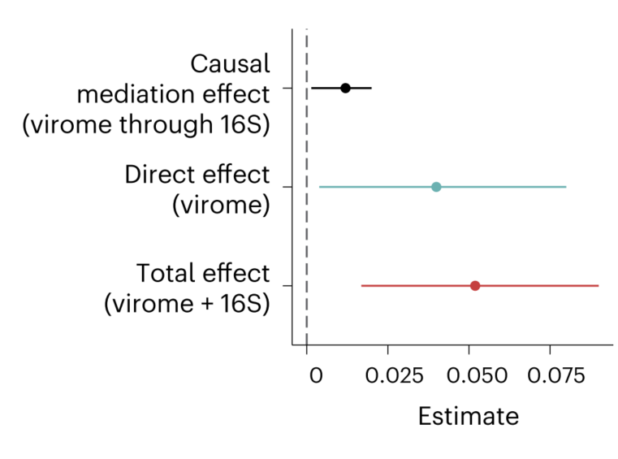
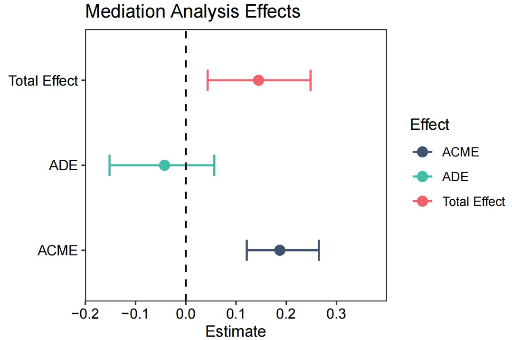

```{r setup, include=FALSE}
knitr::opts_chunk$set(
  collapse = T, echo=T, comment="#>", message=F, warning=F,
	fig.align="center", fig.width=5, fig.height=3, dpi=150)
```


The Causal mediation analysis scripts is referenced from MicrobiomeStatPlot [Inerst Reference below].

If you use this script, please cited 如果你使用本代码，请引用：

**Yong-Xin Liu**, Lei Chen, Tengfei Ma, Xiaofang Li, Maosheng Zheng, Xin Zhou, Liang Chen, Xubo Qian, Jiao Xi, Hongye Lu, Huiluo Cao, Xiaoya Ma, Bian Bian, Pengfan Zhang, Jiqiu Wu, Ren-You Gan, Baolei Jia, Linyang Sun, Zhicheng Ju, Yunyun Gao, **Tao Wen**, **Tong Chen**. 2023. EasyAmplicon: An easy-to-use, open-source, reproducible, and community-based pipeline for amplicon data analysis in microbiome research. **iMeta** 2(1): e83. https://doi.org/10.1002/imt2.83

The online version of this tuturial can be found in https://github.com/YongxinLiu/MicrobiomeStatPlot


**Authors**
First draft(初稿)：Defeng Bai(白德凤)；Proofreading(校对)：Ma Chuang(马闯) and Jiani Xun(荀佳妮)；Text tutorial(文字教程)：Defeng Bai(白德凤)


# Introduction简介

什么是因果中介分析（Causal Mediation Analysis）？
What is Causal Mediation Analysis?
参考：https://blog.csdn.net/weixin_42812146/article/details/126052147

1.传统中介分析模型的局限
1. Limitations of traditional intermediary analysis models
传统中介分析模型是基于系数乘积法或系数差值法来估计间接效应。传统中介分析假设线性回归模型的残差是呈正态分布的，且模型中的自变量满足方差齐性，观测样本间相互独立，并且假设估计的效应没有效应修正因子或混淆因素的干扰。其中效应修正因子的干扰可以考虑通过在模型中包括交互项，随后估计效应修正因子取不同值时的直接或间接效应来解释。传统中介分析模型不适用于离散中介变量或者结果变量。当使用传统中介分析来估计具有非联系中介变量或结果变量的中介模型的效应时，就会出现歧义。此外，尽管在传统中介分析的文献中建议评估exposure-mediator交互作用，但没有给出具体暴漏-中介交互作用的中介模型的效应估计和解释的指导。
The traditional mediation analysis model is based on coefficient product method or coefficient difference method to estimate indirect effects. Traditional mediation analysis assumes that the residuals of a linear regression model are normally distributed, and the independent variables in the model satisfy homogeneity of squared differences. The observed samples are independent of each other, and the estimated effects are assumed to have no interference from effect correction factors or confounding factors. The interference of the effect correction factor can be explained by including the interaction term in the model, and then estimating the direct or indirect effects when the effect correction factor takes different values. Traditional mediation analysis models are not suitable for discrete mediation variables or outcome variables. When using traditional mediation analysis to estimate the effects of mediation models with unrelated mediation variables or outcome variables, ambiguity arises. In addition, although it is recommended to evaluate the exposure mediator interaction in traditional mediation analysis literature, there is no guidance on the estimation and interpretation of the effects of specific mediation models for exposure mediator interaction.

2.因果中介分析
2. Causal mediation analysis
因果中介分析可以在暴露-中介交互作用存在时，基于潜在结果框架，将总暴露效应分解为因果直接影响和间接影响。因果效应定义的一个优势是它是非参数的，因此可以应用于任何类型的中介模型以得出因果效应估计，包括具有暴露-中介交互作用和具有非连续中介变量或非连续结果变量的模型等。
Causal mediation analysis can decompose the total exposure effect into causal direct effects and indirect effects based on the potential outcome framework when there is an exposure mediation interaction. One advantage of defining causal effects is that it is non parametric and can therefore be applied to any type of mediation model to obtain causal effect estimates, including models with exposure mediation interactions and models with discontinuous mediation variables or discontinuous outcome variables.
反事实和潜在结果模型 Counterfactual and Potential Outcomes Model：理想情况下，在一项完美的因果推理的实验中，同一参与者应该同时参与治疗组和对照组，并在每种条件下对因变量进行评估。那么显而易见这是不可能发生的。
因果效应定义（Causal effect defination）是基于这样一个假设：即每个单独的被试对于每个治疗水平都有一个潜在的结果值。
Counterfactual and Potential Outcomes Model: Ideally, in a perfect causal reasoning experiment, the same participant should participate in both the treatment group and the control group, and evaluate the dependent variable under each condition. So it is obvious that this is impossible to happen.
The definition of causal effect is based on the assumption that each individual participant has a potential outcome value for each treatment level.

中介分析或者中介效应分析经常被用于探索因果关系。中介效应是指某个变量在另外两个之间扮演了中间人的角色。这里变量可以是测量变量或者模型，如果是测量变量，该模型是个路径分析模型；如果是模型，则是结构方程模型。
Mediation analysis or mediation effect analysis is often used to explore causal relationships. The mediating effect refers to a variable playing the role of a mediator between two other variables. Here, variables can be measured variables or models. If it is a measured variable, the model is a path analysis model; If it is a model, then it is a structural equation model.

在考虑mediantion分析时，一些重要的考虑因素包括：1.mediator必须是内生的，这意味着mediator不能是治疗或研究条件。mediator本身必须依赖外生变量，而外生变量往往是实验研究中的治疗或研究条件。2.mediator必须对自变量如何影响因变量有更深入的了解。mediator揭示了一些关于过程的东西。因此，mediator帮助我们找到自变量是如何影响因变量的。通过运行中介分析，我们是测试关于自变量是如何影响因变量的过程的假设。
When considering mediation analysis, some important considerations include: 1. Mediators must be endogenous, which means they cannot be treatment or research conditions. The mediator itself must rely on exogenous variables, which are often treatment or research conditions in experimental studies. The mediator must have a deeper understanding of how the independent variable affects the dependent variable. The mediator revealed some things about processes. Therefore, mediators help us find out how the independent variable affects the dependent variable. By running mediation analysis, we are testing hypotheses about how the independent variable affects the process of the dependent variable.


关键字：微生物组数据分析、MicrobiomeStatPlot、因果中介分析、R语言可视化

Keywords: Microbiome analysis, MicrobiomeStatPlot, Causal mediation analysis, R visulization


## Case study of causal mediation analysis因果中介分析案例

这是Jakob Stokholm课题组2023年发表于Nature Medicine上的文章，第一作者为Cristina Leal Rodríguez，题目为：The infant gut virome is associated with preschool asthma risk independently of bacteria. https://doi.org/10.1038/s41591-023-02685-x

This is an article published by the Jakob Stokholm research group in Nature Medicine in 2023. The first author is Cristina Leal Rodr í guez, and the title is: The incident gut virus is associated with pre-school astroma risk independently of bacteria. https://doi.org/10.1038/s41591-023-02685-x




Fig. 5 c, Estimates from a causal mediation analysis for quantifying the bacterial contribution to the virome effect on preschool asthma are shown in a forest plot. Dots indicate point estimates and horizontal lines indicate 95% CIs.

图5C，用于量化细菌对学龄前哮喘病毒组效应的贡献的因果中介分析的估计显示在森林图中。点表示点估计值，水平线表示95%的CI。

**结果**：
As the virome associations seemed to have a different phenotypic link to the bacterial counterpart despite their close relationship, we estimated the extent to which the virome association with preschool asthma was mediated via the gut bacteria, using causal mediation analysis (Fig. 5c). The relationship between the virome and the bacteriome scores was modest (Pearson’s r = 0.32; P < 0.001). However, the indirect bacterial effect mediated only 23% (P = 0.030) of the virome association with preschool asthma compared to the direct virome effect (77%; P = 0.026), suggesting that only a minor indirect effect of the virome association with preschool asthma was mediated through bacteria. We further tested for moderated mediation between children born to mothers with and without asthma. We found that the average causal mediation effect (virome through bacteriome) was higher in children born to mothers with asthma (proportion of mediation, mothers with asthma, 88% versus mothers without asthma, 3%; P < 2.2 × 10−16) but not for direct effects (virome only) (P = 0.336). In an alternative causal mediation model, we further found that 26% (P = 0.026) of the bacterial association with preschool asthma was mediated through the virome.

由于病毒组关联似乎与细菌对应物有不同的表型联系，尽管它们之间关系密切，我们使用因果中介分析估计了病毒组关联与学龄前哮喘通过肠道细菌介导的程度（图第5c段）。病毒组和细菌组评分之间的关系不大（Pearson’s r=0.32；P<0.001）。然而，与直接病毒组效应（77%；P=0.026）相比，间接细菌效应仅介导23%（P=0.030）的病毒组与学龄前哮喘的相关性，这表明病毒组与学前哮喘的相关性只有很小的间接效应是通过细菌介导的。我们进一步测试了患有和不患有哮喘的母亲所生的孩子之间的适度介导。我们发现，患有哮喘的母亲所生的孩子的平均因果中介作用（病毒组通过细菌组）更高（中介作用的比例，患有哮喘母亲为88%，而没有哮喘的母亲为3%；P<2.2×10−16），但直接作用（仅病毒组）则不高（P=0.336）。在另一个因果中介模型中，我们进一步发现26%（P=0.026）的细菌与学龄前哮喘的相关性是通过病毒组介导的。


## Packages installation软件包安装

```{r}
# 基于CRAN安装R包，检测没有则安装
p_list = c("ggplot2", "dplyr", "mediation")
for(p in p_list){if (!requireNamespace(p)){install.packages(p)}
    library(p, character.only = TRUE, quietly = TRUE, warn.conflicts = FALSE)}

# 加载R包 Load the package
suppressWarnings(suppressMessages(library(ggplot2)))
suppressWarnings(suppressMessages(library(dplyr)))
suppressWarnings(suppressMessages(library(mediation)))
```


# Causal mediation analysis因果中介分析

## Causal mediation analysis using R software因果中介分析R语言实战

```{r Causal_mediation_analysis, fig.show='asis', fig.width=4, fig.height=2.5}
# 模拟一个中介效应，设定随机种子并生成模拟数据
# Simulate a mediation effect, set the random seed and generate simulated data
set.seed(2344)
df <- iris %>%
  mutate(
    random_factor1 = runif(n(), min = min(Sepal.Length), max = max(Sepal.Length)),
    mediator_var = 0.4 * Sepal.Length + 0.6 * random_factor1,  # 模拟中介变量
    random_factor2 = runif(n(), min = min(mediator_var), max = max(mediator_var)),
    dependent_var = 0.4 * mediator_var + 0.6 * random_factor2  # 模拟因变量
  )

# 统计分析
# Statistics
# 1. 计算总效应（自变量对因变量的总影响）
# 1. Calculate the total effect (the total impact of the independent variable on the dependent variable)
total_effect_model <- lm(dependent_var ~ Sepal.Length, data = df)
summary(total_effect_model)

# 2. 计算自变量对中介变量的影响
# 2. Calculate the impact of the independent variable on the mediating variable
mediator_model <- lm(mediator_var ~ Sepal.Length, data = df)
summary(mediator_model)

# 3. 在控制自变量的情况下，计算中介变量对因变量的影响
# 3. Calculate the impact of the mediating variable on the dependent variable while controlling the independent variable
mediated_effect_model <- lm(dependent_var ~ Sepal.Length + mediator_var, data = df)
summary(mediated_effect_model)

# 4. 因果中介分析
# 4. Causal mediation analysis
causal_mediation_results <- mediate(
  model.m = mediator_model, 
  model.y = mediated_effect_model, 
  treat = "Sepal.Length", 
  mediator = "mediator_var", 
  boot = TRUE
)
summary_results <- summary(causal_mediation_results)
#summary(causal_mediation_results)

# 提取所需的结果：平均因果中介效应 (ACME)，直接效应，和总效应
effect_data <- data.frame(
  Effect = c("ACME", "ADE", "Total Effect"),
  Estimate = c(summary_results$d.avg, summary_results$z.avg, summary_results$tau.coef),
  LowerCI = c(summary_results$d.avg.ci[1], summary_results$z.avg.ci[1], summary_results$tau.ci[1]),
  UpperCI = c(summary_results$d.avg.ci[2], summary_results$z.avg.ci[2], summary_results$tau.ci[2])
)

# 绘制误差棒图
# Plotting error bar plot
p1 <- ggplot(effect_data, aes(x = Effect, y = Estimate)) +
  geom_point(size = 3, aes(color = Effect)) +  # 绘制点
  geom_errorbar(aes(ymin = LowerCI, ymax = UpperCI, color = Effect),
                width = 0.25, cex = 0.7) +  # 绘制误差棒
  geom_hline(aes(yintercept = 0.0), size = 0.6, linetype = "dashed", 
             colour = "gray2") +
  labs(
    title = "Mediation Analysis Effects",
    x = "",
    y = "Estimate"
  ) +
  coord_flip()+
  theme(
    plot.title = element_text(face = "bold", size = 14),
    axis.title = element_text(size = 12, face = "bold"),
    axis.text = element_text(size = 10)
  )+
  scale_y_continuous(expand = c(0, 0), limit = c(-0.2, 0.4)) +
  scale_color_manual(values = c("#3E516F", "#3FBDA7", "#F1606C")) +
  theme_bw() + 
  theme(panel.grid.major = element_blank(), panel.grid.minor = element_blank()) +
  theme(axis.text = element_text(colour = 'black', size = 10))
#p1

# 保存图形
# Save plot
ggsave("results/Mediation_Analysis_Plot.pdf", p1, width=89 * 1.5, height=58 * 1.5, units = "mm")

# ACME代表平均因果中介效应
# ACME represents the average causal mediating effect
# ADE是平均直接效应的意思
# ADE means average direct effect
# Total effect是指IV对DV的总效应（直接+间接）
# Total effect refers to the total effect of IV on DV (direct+indirect)
# Prop. Mediated描述的是IV对DV的影响通过mediator的比例
# Prop Mediated describes the impact of IV on DV through the proportion of mediators
```





If used this script, please cited:
使用此脚本，请引用下文：

**Yong-Xin Liu**, Lei Chen, Tengfei Ma, Xiaofang Li, Maosheng Zheng, Xin Zhou, Liang Chen, Xubo Qian, Jiao Xi, Hongye Lu, Huiluo Cao, Xiaoya Ma, Bian Bian, Pengfan Zhang, Jiqiu Wu, Ren-You Gan, Baolei Jia, Linyang Sun, Zhicheng Ju, Yunyun Gao, **Tao Wen**, **Tong Chen**. 2023. EasyAmplicon: An easy-to-use, open-source, reproducible, and community-based pipeline for amplicon data analysis in microbiome research. **iMeta** 2: e83. https://doi.org/10.1002/imt2.83

Copyright 2016-2024 Defeng Bai <baidefeng@caas.cn>, Chuang Ma <22720765@stu.ahau.edu.cn>, Jiani Xun <15231572937@163.com>, Yong-Xin Liu <liuyongxin@caas.cn>

