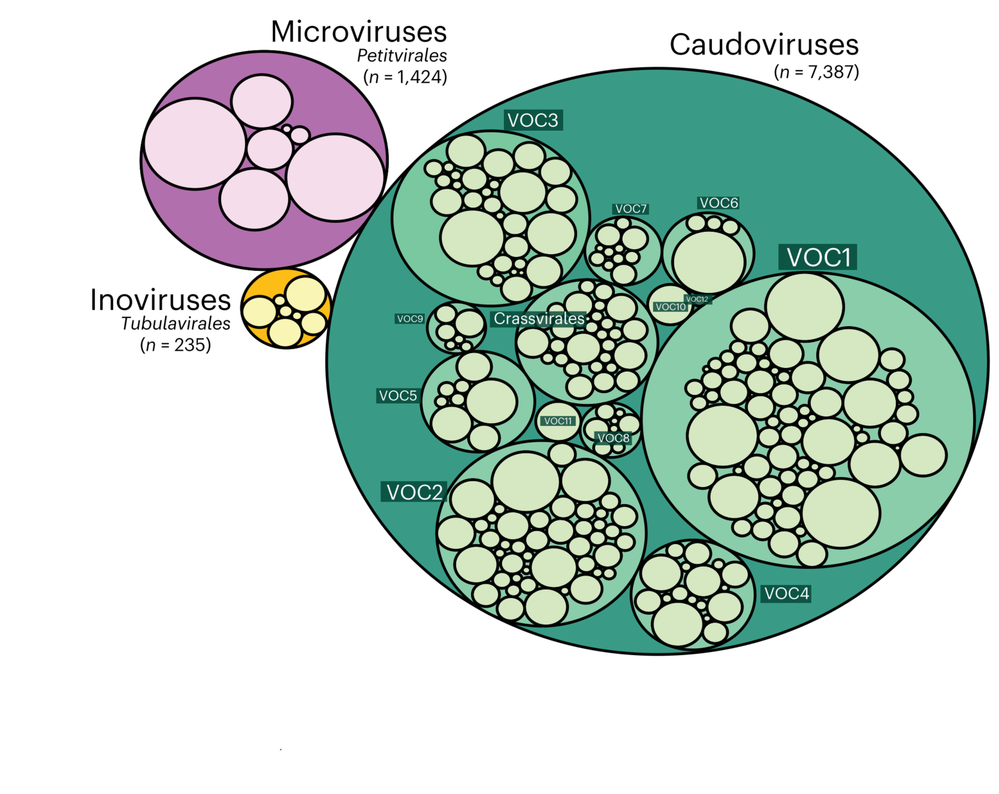
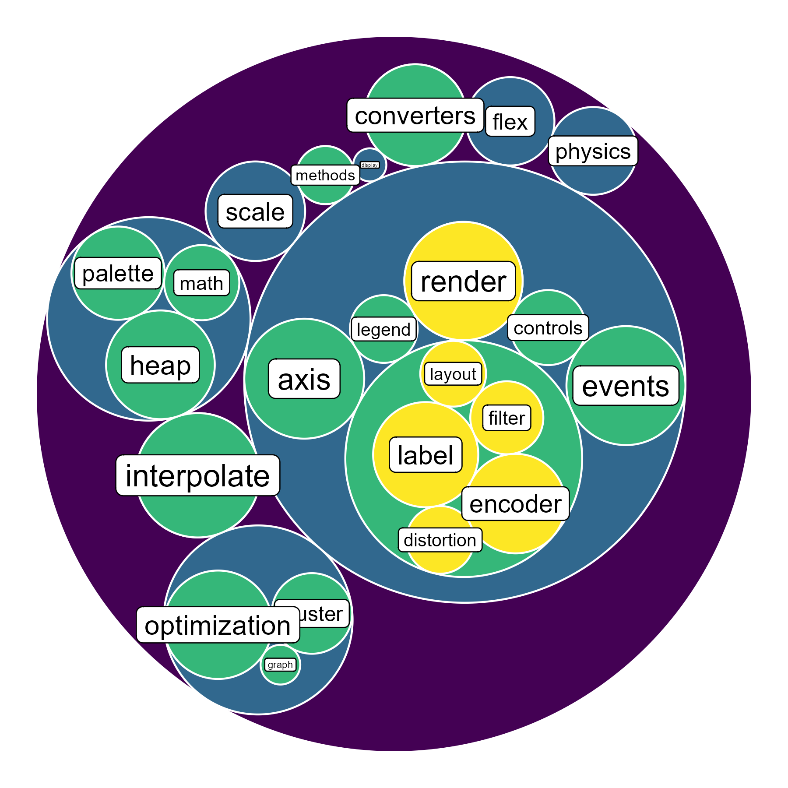

```{r setup, include=FALSE}
knitr::opts_chunk$set(
  collapse = T, echo=T, comment="#>", message=F, warning=F,
	fig.align="center", fig.width=5, fig.height=3, dpi=150)
```


The Circle packing plot scripts is referenced from MicrobiomeStatPlot [Inerst Reference below].


If you use this script, please cited 如果你使用本代码，请引用：

**Yong-Xin Liu**, Lei Chen, Tengfei Ma, Xiaofang Li, Maosheng Zheng, Xin Zhou, Liang Chen, Xubo Qian, Jiao Xi, Hongye Lu, Huiluo Cao, Xiaoya Ma, Bian Bian, Pengfan Zhang, Jiqiu Wu, Ren-You Gan, Baolei Jia, Linyang Sun, Zhicheng Ju, Yunyun Gao, **Tao Wen**, **Tong Chen**. 2023. EasyAmplicon: An easy-to-use, open-source, reproducible, and community-based pipeline for amplicon data analysis in microbiome research. **iMeta** 2(1): e83. https://doi.org/10.1002/imt2.83

The online version of this tuturial can be found in https://github.com/YongxinLiu/MicrobiomeStatPlot


**Authors**
First draft(初稿)：Defeng Bai(白德凤)；Proofreading(校对)：Ma Chuang(马闯) and Xun Jiani(荀佳妮)；Text tutorial(文字教程)：Defeng Bai(白德凤)


# Introduction简介

## circle packing plot 圆堆积图

什么是圆堆积图？
What is circle packing plot?

圆堆积图，circle packing plot是树形图的变体，使用圆形一层又一层的代表整个层次结构：树木的每个分支由一个圆圈表示，其子分支以圆圈内的圆圈来表示。每个圆圈的面积也可用来表示数量或文件大小等。也可用颜色将数据进行分类。

A circle packing plot is a variant of a tree diagram that uses circles to represent the entire hierarchical structure layer by layer: each branch of a tree is represented by a circle, and its sub branches are represented by circles within the circle. The area of each circle can also be used to indicate quantity or file size, etc. Color can also be used to classify data.


关键字：微生物组数据分析、MicrobiomeStatPlot、圆堆积图、R语言可视化

Keywords: Microbiome analysis, MicrobiomeStatPlot, Circle packing plot, R visulization


## circle packing plot case 圆堆积图案例：

这是Jakob Stokholm课题组2023年发表于Nature Medicine上的文章，第一作者为Cristina Leal Rodríguez，题目为：The infant gut virome is associated with preschool asthma risk independently of bacteria. https://doi.org/10.1038/s41591-023-02685-x

This is an article published by the Jakob Stokholm research group in Nature Medicine in 2023. The first author is Cristina Leal Rodr í guez, and the title is: The incident gut virus is associated with pre-school astroma risk independently of bacteria. https://doi.org/10.1038/s41591-023-02685-x


Fig. 1 a, Circle packing visualization of the three distinct phage classes in the 1-year-old infant gut viromes. vOTUs were clustered at the protein level to define a taxonomic hierarchy. The outer circles represent the three main (caudoviral, microviral and inoviral) phage classes, and the inner circles, from darker to lighter colors, represent virus order-level clades (VOCs) and family-level clades (VFCs). Microviral and inoviral classes comprise only a single order each (Petitvirales and Tubulavirales, respectively). The size of each circle corresponds to the number of vOTUs embedded in each taxonomic group (n, total number of vOTUs per class).

图1 a，1岁婴儿肠道病毒中三种不同噬菌体类别的圆形包装可视化。vOTU在蛋白质水平上聚类以定义分类层次。外圈代表三种主要的噬菌体类别（尾病毒、微病毒和无病毒），内圈从较深到较浅的颜色代表病毒级分支（VOC）和家族级分支（VFCs）。微病毒类和非病毒类各仅包含一个单目（分别为小病毒类和管病毒类）。每个圆圈的大小对应于每个分类组中嵌入的vOTU的数量（n，每个类别的vOTu总数）。


## Packages installation软件包安装

```{r}
# 基于CRAN安装R包，检测没有则安装
p_list = c("ggraph", "igraph", "tidyverse", "viridis")
for(p in p_list){if (!requireNamespace(p)){install.packages(p)}
    library(p, character.only = TRUE, quietly = TRUE, warn.conflicts = FALSE)}

# 加载R包 Load the package
suppressWarnings(suppressMessages(library(ggraph)))
suppressWarnings(suppressMessages(library(igraph)))
suppressWarnings(suppressMessages(library(tidyverse)))
suppressWarnings(suppressMessages(library(viridis)))
```


# Circle packing plot圆堆积图

## Circle packing plot using R software 圆堆积图R语言实战
参考：https://mp.weixin.qq.com/s/5RizmZk7N9UyLGeI6so5Kw

```{r Circle packing plot, fig.show='asis', fig.width=4, fig.height=2.5}
# Data used
edge_data <- flare$edges
vertex_data <- flare$vertices
graph_data <- graph_from_data_frame(edge_data, vertices = vertex_data)

# Set colors
custom_colors <- scale_fill_viridis_c(option = "B", direction = -1, begin = 0.3, end = 0.9)

# 圆堆积图 1：按深度上色，添加白色边框
# Circle packing plot 1: color by depth, add white border
circle_plot1 <- ggraph(graph_data, layout = 'circlepack', weight = size) + 
  geom_node_circle(aes(fill = depth), color = "white", size = 0.5) +
  theme_void() +
  custom_colors +
  theme(legend.position = "none")
ggsave(circle_plot1, filename = 'results/CirclePlot1.png', width = 6, height = 6, dpi = 300)
print(circle_plot1)


# 圆堆积图 2：按深度上色，添加节点标签
# Circle packing plot 2: color by depth, add node labels
circle_plot2 <- ggraph(graph_data, layout = 'circlepack', weight = size) + 
  geom_node_circle(aes(fill = depth), color = "white", size = 0.5) +
  geom_node_text(aes(label = shortName, filter = leaf, size = size), color = "black", vjust = 0.5, hjust = 0.5) +
  theme_void() +
  custom_colors +
  theme(legend.position = "none")
ggsave(circle_plot2, filename = 'results/CirclePlot2.png', width = 6, height = 6, dpi = 300)
print(circle_plot2)


# 子集数据与graph对象构建
# Subset data and graph object
subset_edges <- edge_data %>% filter(to %in% from) %>% droplevels()
subset_vertices <- vertex_data %>% filter(name %in% c(subset_edges$from, subset_edges$to)) %>% droplevels()
subset_vertices$size <- runif(nrow(subset_vertices))
graph_subset <- graph_from_data_frame(subset_edges, vertices = subset_vertices)

# 圆堆积图 3：按深度上色，展示文本标签，使用Viridis调色板
# Circle packing plot 3: Color by depth, display text labels, using the Viridis palette
circle_plot3 <- ggraph(graph_subset, layout = 'circlepack', weight = size) + 
  geom_node_circle(aes(fill = depth), color = "white", size = 0.5) +
  geom_node_text(aes(label = shortName, filter = leaf, size = size), color = "black", vjust = 0.5, hjust = 0.5) +
  theme_void() +
  scale_fill_viridis() +
  theme(legend.position = "none")
ggsave(circle_plot3, filename = 'results/CirclePlot3.png', width = 6, height = 6, dpi = 300)
print(circle_plot3)


# 圆堆积图 4：添加标签边框，提升可读性
# Circle packing plot 4: Add label borders to improve readability
circle_plot4 <- ggraph(graph_subset, layout = 'circlepack', weight = size) + 
  geom_node_circle(aes(fill = depth), color = "white", size = 0.5) +
  geom_node_label(aes(label = shortName, filter = leaf, size = size), fill = "white", label.size = 0.3, label.r = unit(0.2, "lines")) +
  theme_void() +
  scale_fill_viridis() +
  theme(legend.position = "none")

ggsave(circle_plot4, filename = 'results/CirclePlot4.png', width = 6, height = 6, dpi = 300)
#print(circle_plot4)
```





If used this script, please cited:
使用此脚本，请引用下文：

**Yong-Xin Liu**, Lei Chen, Tengfei Ma, Xiaofang Li, Maosheng Zheng, Xin Zhou, Liang Chen, Xubo Qian, Jiao Xi, Hongye Lu, Huiluo Cao, Xiaoya Ma, Bian Bian, Pengfan Zhang, Jiqiu Wu, Ren-You Gan, Baolei Jia, Linyang Sun, Zhicheng Ju, Yunyun Gao, **Tao Wen**, **Tong Chen**. 2023. EasyAmplicon: An easy-to-use, open-source, reproducible, and community-based pipeline for amplicon data analysis in microbiome research. **iMeta** 2: e83. https://doi.org/10.1002/imt2.83

Copyright 2016-2024 Defeng Bai <baidefeng@caas.cn>, Chuang Ma <22720765@stu.ahau.edu.cn>, Jiani Xun <15231572937@163.com>, Yong-Xin Liu <liuyongxin@caas.cn>