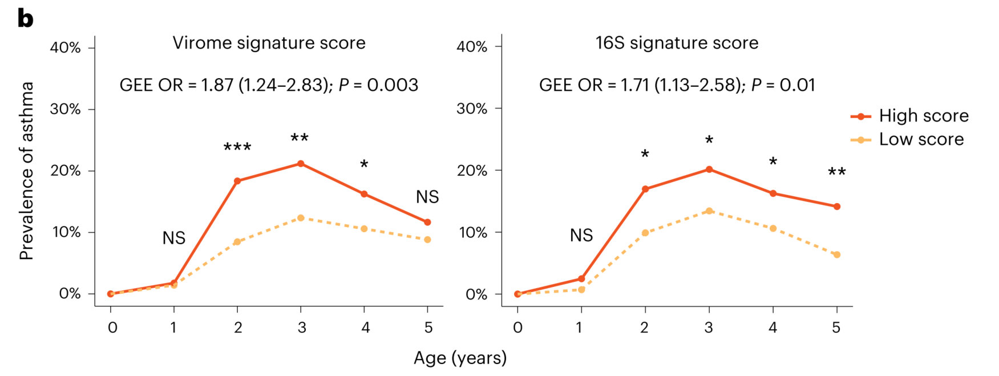

```{r setup, include=FALSE}
knitr::opts_chunk$set(
  collapse = T, echo=T, comment="#>", message=F, warning=F,
	fig.align="center", fig.width=5, fig.height=3, dpi=150)
```


The Generalized estimating equation analysis scripts is referenced from MicrobiomeStatPlot [Inerst Reference below].


If you use this script, please cited 如果你使用本代码，请引用：

**Yong-Xin Liu**, Lei Chen, Tengfei Ma, Xiaofang Li, Maosheng Zheng, Xin Zhou, Liang Chen, Xubo Qian, Jiao Xi, Hongye Lu, Huiluo Cao, Xiaoya Ma, Bian Bian, Pengfan Zhang, Jiqiu Wu, Ren-You Gan, Baolei Jia, Linyang Sun, Zhicheng Ju, Yunyun Gao, **Tao Wen**, **Tong Chen**. 2023. EasyAmplicon: An easy-to-use, open-source, reproducible, and community-based pipeline for amplicon data analysis in microbiome research. **iMeta** 2(1): e83. https://doi.org/10.1002/imt2.83

The online version of this tuturial can be found in https://github.com/YongxinLiu/MicrobiomeStatPlot


**Authors**
First draft(初稿)：Defeng Bai(白德凤)；Proofreading(校对)：Ma Chuang(马闯) and Xun Jiani(荀佳妮)；Text tutorial(文字教程)：Defeng Bai(白德凤)


# Introduction简介

什么是广义估计方程分析（Generalized estimating equation analysis）？
What is Generalized Estimating Equation Analysis?
参考：https://mp.weixin.qq.com/s/nJb94D61Tb7Cc6jGzPrlxw

临床研究中经常遇到重复测量数据或相关数据的问题，如研究一种药物时，需要观察患者在治疗前后的指标变化。这些数据之间存在相关性和依赖结构，传统的分析方法可能无法很好的处理这些问题。广义估计方程是一种基于广义线性模型的非参数估计方法，可以有效处理这类数据分析问题。GEE是一种灵活的方法，对于不同类型的数据都可以适用。它可以通过考虑观测之间的相关性来提高参数估计的准确度，并且不需要对数据的概率分析进行过多的假设。在临床医学领域，广义估计方程的应用得到了广泛关注，并且已经在很多研究中证明了它的有效性。
In clinical research, repeated measurement data or related data are often encountered, such as when studying a drug, it is necessary to observe changes in the patient's indicators before and after treatment. There are correlations and dependency structures between these data, and traditional analysis methods may not be able to handle these issues well. Generalized estimation equation is a non parametric estimation method based on generalized linear models, which can effectively handle such data analysis problems. GEE is a flexible method that can be applied to different types of data. It can improve the accuracy of parameter estimation by considering the correlation between observations, without making too many assumptions about the probability analysis of the data. In the field of clinical medicine, the application of generalized estimation equations has received widespread attention and its effectiveness has been proven in many studies.

原理和概念：
Principles and Concepts:

广义估计方程设计两部分内容，一是模型的选择，二是矩阵结构。在模型的选择方面，可以根据具体的问题选择适当的广义线性模型，如logit，probit或正态等函数。在建立模型时，需要考虑自变量和因变量之间的函数关系，并通过最大似然估计方法对模型参数进行估计。

The design of generalized estimation equations consists of two parts: model selection and matrix structure. In terms of model selection, appropriate generalized linear models can be selected based on specific problems, such as logit, probit, or normal functions. When establishing a model, it is necessary to consider the functional relationship between the independent and dependent variables, and estimate the model parameters through the maximum likelihood estimation method.

在矩阵结构方法，GEE需要考虑观测之间的相关性和依赖结构，即协方差结构。常见的协方差结构包括独立、交叉、自相关等形式。通过选择适当的协方差结构，可以更好的描述数据之间的相关性，从而提高参数估计的准确性。

In the matrix structure method, GEE needs to consider the correlation and dependency structure between observations, namely the covariance structure. Common covariance structures include independence, crossover, autocorrelation, and other forms. By selecting appropriate covariance structures, the correlation between data can be better described, thereby improving the accuracy of parameter estimation.

GEE的核心思想是建立一组广义估计方程，利用加权修正对参数进行估计，从而得到更文件的结果。在这个过程中，GEE采用了类似于迭代夹权最小二乘法的方法，以最小化误差函数。

The core idea of GEE is to establish a set of generalized estimation equations, use weighted correction to estimate parameters, and obtain more accurate results. In this process, GEE adopted a method similar to the iterative clamp weight least squares method to minimize the error function.

GEE概念主要包括以下几个要素：1.依赖结构，指的是观测数据之间的相关性和依赖关系，常见的依赖结构包括自相关结构、交叉分类结构等。2.线性预测模型，使用广义线性模型作为GEE的基础模型，其中自变量可以是连续变量，分类变量或其他形式的数据。3.广义估计方程，通过建立一组方程，利用加权修正对参数进行估计，从而得到更可靠的结果。

The concept of GEE mainly includes the following elements: 1. Dependency structure, which refers to the correlation and dependency relationship between observed data. Common dependency structures include autocorrelation structure, cross classification structure, etc. 2. Linear prediction model, using generalized linear model as the basic model of GEE, where the independent variables can be continuous variables, categorical variables, or other forms of data. 3. Generalized estimation equation, by establishing a set of equations and using weighted correction to estimate parameters, more reliable results can be obtained.


关键字：微生物组数据分析、MicrobiomeStatPlot、广义估计方程分析、R语言可视化

Keywords: Microbiome analysis, MicrobiomeStatPlot, Generalized estimating equation analysis, R visulization


## Example of generalized estimation equation analysis 广义估计方程分析示例

这是Jakob Stokholm课题组2023年发表于Nature Medicine上的文章，第一作者为Cristina Leal Rodríguez，题目为：The infant gut virome is associated with preschool asthma risk independently of bacteria. https://doi.org/10.1038/s41591-023-02685-x

This is an article published by the Jakob Stokholm research group in Nature Medicine in 2023. The first author is Cristina Leal Rodr í guez, and the title is: The incident gut virus is associated with pre-school astroma risk independently of bacteria. https://doi.org/10.1038/s41591-023-02685-x




Fig. 5 b, Risk analysis of asthma trajectory over the first 5 years of life using generalized estimating equation analysis (GEE) according to virome and bacterial (16S) asthma signature scores (left, virome; right, 16S) with corresponding overall two-sided P values. Children were grouped into high (orange solid line, above median) and low (yellow dotted line, below median) score groups. Associations with ongoing asthma diagnosis are shown for each year. ***P < 0.001, **P < 0.01, *P < 0.05. NS, not significant (P > 0.05). P values obtained from two-sided logistic regressions.

图5 b，根据病毒组和细菌（16S）哮喘特征评分（左，病毒组；右，16S）和相应的双侧P值，使用广义估计方程分析（GEE）对生命前5年的哮喘轨迹进行风险分析。儿童被分为高分组（橙色实线，高于中位数）和低分组（黄色虚线，低于中位数）。显示了每年与正在进行的哮喘诊断的相关性***P＜0.001，**P＜0.01，*P＜0.05。NS无显著性差异（P>0.05）。通过双侧逻辑回归获得的P值。

**结果**：

Given that preschool asthma often has a transient course, the virome and bacteriome scores were also used to investigate the asthma persistence–by time interaction during the first 5 years of life. The prevalence of asthma from baseline to each time point was compared between children with high (above median) and low (below median) signature scores from the temperate virome (OR = 1.87 (1.24–2.83); P = 0.003) and bacteriome (OR = 1.71 (1.13–2.58); P = 0.01) (Fig. 5b). In addition, the association between virome scores and ongoing asthma diagnosis, tested yearly, highlighted that the virome score was indicative of a more transient phenotype of asthma, whereas the bacteriome indicated a more persistent phenotype.

鉴于学龄前哮喘通常有一个短暂的过程，病毒组和细菌组评分也被用于研究哮喘在生命的前5年的持续性——通过时间相互作用。从基线到每个时间点，在温带病毒组特征得分高（高于中位数）和低（低于中位数）的儿童之间比较哮喘的患病率（OR=1.87（1.24–2.83）；P=0.003）和菌群（OR=1.71（1.13-2.58）；P=0.01）（图5b）。此外，每年测试的病毒组评分与正在进行的哮喘诊断之间的相关性突出表明，病毒组评分表明哮喘的表型更为短暂，而细菌组则表明表型更为持久。


## Packages installation软件包安装

```{r}
# 基于CRAN安装R包，检测没有则安装
p_list = c("geepack", "tidyverse")
for(p in p_list){if (!requireNamespace(p)){install.packages(p)}
    library(p, character.only = TRUE, quietly = TRUE, warn.conflicts = FALSE)}

# 加载R包 Load the package
suppressWarnings(suppressMessages(library(geepack)))
suppressWarnings(suppressMessages(library(tidyverse)))
```


## Generalized Estimating Equation Analysis using R software 广义估计方程分析实战

参考：https://mp.weixin.qq.com/s/1TCxQ2sQ9DvtlEP2N4Jnqg

对于纵向研究的数据或者重复测量数据，不能简单的使用方差分析、广义线性回归等方法，因为数据之间极可能存在一定程度的相关性，比如说同一动物连续一周观测提问，前一天的体温与后一天的体温之间是存在关联的，而不是独立的。广义估计方程可以简单理解为广义线性混合模型的拓展，是一种半参数化方法，相较之下所受的条件限制较少，同时结果更加稳健。

For longitudinal research data or repeated measurement data, simple methods such as analysis of variance and generalized linear regression cannot be used, as there may be a certain degree of correlation between the data. For example, if the same animal is observed continuously for a week, there is a correlation between the temperature of the previous day and the temperature of the following day, rather than independence. The generalized estimation equation can be simply understood as an extension of the generalized linear mixed model, which is a semi parametric method that is less constrained by conditions and results are more robust.


```{r GEE, fig.show='asis', fig.width=4, fig.height=2.5}
# 载入数据集
# Load data
data("dietox")

# 数据预处理：因子化处理
# Data preprocessing: factorization
dietox <- dietox %>%
  mutate(Cu = factor(Cu),
         Evit = factor(Evit))

# 定义模型公式
# Define fomula
model_formula <- Weight ~ Time + Evit + Cu

# 独立相关结构假设模型（Independence correlation structure）
gee_independent <- geeglm(model_formula, id = Pig, data = dietox, 
                          family = gaussian, corstr = "ind")
summary(gee_independent)
anova(gee_independent)
# 结果解读：Time变量显著影响体重
# Interpretation of results: Time variable significantly affects weight

# 交换相关结构假设模型（Exchangeable correlation structure）
gee_exchangeable <- geeglm(model_formula, id = Pig, data = dietox, 
                           family = gaussian, corstr = "ex")
summary(gee_exchangeable)
anova(gee_exchangeable)
# 结果解读：Time变量依然是唯一显著的影响因素
# Interpretation of results: Time variable is still the only significant influencing factor

# AR(1) 自回归相关结构假设模型（Autoregressive correlation structure）
gee_ar1 <- geeglm(model_formula, id = Pig, data = dietox, 
                  family = gaussian, corstr = "ar1")
summary(gee_ar1)
anova(gee_ar1)
# 结果解读：Time变量继续保持显著性，系数与标准误几乎未变
# Interpretation of results: The Time variable continues to remain significant, and the coefficient and standard error have almost remained unchanged.

# 非结构化相关结构假设模型（Unstructured correlation structure）
gee_unstructured <- geeglm(model_formula, id = Pig, data = dietox, 
                           family = gaussian, corstr = "unstructured")
#summary(gee_unstructured)
anova(gee_unstructured)
# 结果解读：Evit变量在该相关结构下显示出了一定的影响，系数与标准误有所变化
# Result interpretation: The Evit variable shows a certain influence under this correlation structure, and the coefficient and standard error have changed

# 结果汇总
# Results summary
model_summaries <- list(
  "Independence" = summary(gee_independent),
  "Exchangeable" = summary(gee_exchangeable),
  "AR(1)" = summary(gee_ar1),
  "Unstructured" = summary(gee_unstructured)
)

# 从模型结果中可以看出，Time变量在不同的相关结构假设下均表现出显著的影响，
# 而Evit变量仅在非结构化相关假设下表现出显著性，这表明不同的相关结构选择可能对模型结果有一定影响。
# It can be seen from the model results that the Time variable shows significant influence under different correlation structural assumptions.
# The Evit variable only shows significance under the unstructured correlation assumption, which indicates that different correlation structure choices may have a certain impact on the model results.
```


If used this script, please cited:
使用此脚本，请引用下文：

**Yong-Xin Liu**, Lei Chen, Tengfei Ma, Xiaofang Li, Maosheng Zheng, Xin Zhou, Liang Chen, Xubo Qian, Jiao Xi, Hongye Lu, Huiluo Cao, Xiaoya Ma, Bian Bian, Pengfan Zhang, Jiqiu Wu, Ren-You Gan, Baolei Jia, Linyang Sun, Zhicheng Ju, Yunyun Gao, **Tao Wen**, **Tong Chen**. 2023. EasyAmplicon: An easy-to-use, open-source, reproducible, and community-based pipeline for amplicon data analysis in microbiome research. **iMeta** 2: e83. https://doi.org/10.1002/imt2.83

Copyright 2016-2024 Defeng Bai <baidefeng@caas.cn>, Chuang Ma <22720765@stu.ahau.edu.cn>, Jiani Xun <15231572937@163.com>, Yong-Xin Liu <liuyongxin@caas.cn>