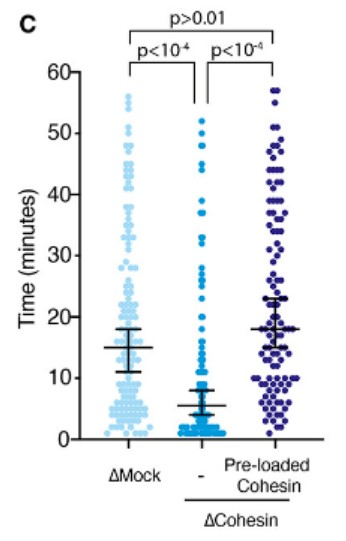
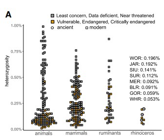
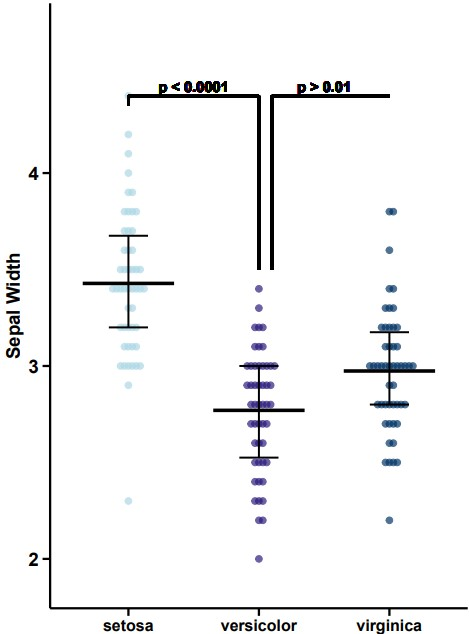
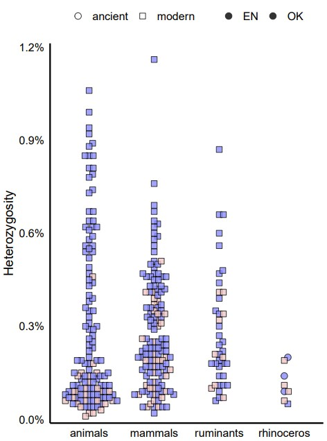

```{r setup, include=FALSE}
knitr::opts_chunk$set(
  collapse = T, echo=T, comment="#>", message=F, warning=F,
	fig.align="center", fig.width=5, fig.height=3, dpi=150)
```


The Hexbin plot scripts is referenced from MicrobiomeStatPlot [Inerst Reference below].

If you use this script, please cited 如果你使用本代码，请引用：

**Yong-Xin Liu**, Lei Chen, Tengfei Ma, Xiaofang Li, Maosheng Zheng, Xin Zhou, Liang Chen, Xubo Qian, Jiao Xi, Hongye Lu, Huiluo Cao, Xiaoya Ma, Bian Bian, Pengfan Zhang, Jiqiu Wu, Ren-You Gan, Baolei Jia, Linyang Sun, Zhicheng Ju, Yunyun Gao, **Tao Wen**, **Tong Chen**. 2023. EasyAmplicon: An easy-to-use, open-source, reproducible, and community-based pipeline for amplicon data analysis in microbiome research. **iMeta** 2(1): e83. https://doi.org/10.1002/imt2.83

The online version of this tuturial can be found in https://github.com/YongxinLiu/MicrobiomeStatPlot


**Authors**
First draft(初稿)：Defeng Bai(白德凤)；Proofreading(校对)：Ma Chuang(马闯) and Jiani Xun(荀佳妮)；Text tutorial(文字教程)：Defeng Bai(白德凤)


# Introduction简介

什么是蜂窝图？
What is a Hexbin Plot
参考：https://mp.weixin.qq.com/s/nbIrHdYxxho7klFkF8b0Zw

蜂窝图(Hexbin Plot)是一种用于可视化二维数据分布的图表类型。它类似于散点图，但在数据密集区域使用六边形（蜂窝）来表示数据点分分布密度。蜂窝图的主要目的是更好的呈现高密度区域的数据趋势，并减少在这些区域可能出现的重叠。

A Hexbin Plot is a type of chart used to visualize the distribution of two-dimensional data. It is similar to a scatter plot, but uses hexagons (honeycombs) to represent the distribution density of data points in data-dense areas. The main purpose of a Hexbin Plot is to better present data trends in high-density areas and reduce possible overlap in these areas.

蜂窝图适用于以下情况：1.高密度数据，当数据点在特定区域内非常密集时，蜂窝图能够更好地反映这些密集区域的数据趋势；2.数据分布可视化，蜂窝图有助于观察数据的整体分布，并识别可能存在的聚类或趋势；3.避免重叠，通过使用六边形蜂窝，蜂窝图可以减少在高密度区域出现的散点图重叠问题。

Honeycomb charts are suitable for the following situations: 1. High-density data. When data points are very dense in a specific area, honeycomb charts can better reflect the data trends in these dense areas. 2. Data distribution visualization. Honeycomb charts help observe the overall distribution of data and identify possible clusters or trends. 3. Avoid overlap. By using hexagonal honeycombs, honeycomb charts can reduce the overlap problem of scatter plots in high-density areas.


关键字：微生物组数据分析、MicrobiomeStatPlot、蜂窝图、R语言可视化

Keywords: Microbiome analysis, MicrobiomeStatPlot, Hexbin plot, R visulization


## Hexbin plot example蜂窝图案例

**案例1**：

这是Hasan Yardimci课题组2024年发表于Science上(Cameron et al., 2024)的一篇论文用到的蜂窝图，论文题目为：Sister chromatid cohesion establishment during DNA replication termination. https://doi.org/10.1126/science.adf0224

This is a honeycomb diagram used in a paper published in Science in 2024 by Hasan Yardimci's group (Cameron et al., 2024). The title of the paper is: Sister chromatid cohesion establishment during DNA replication termination. https://doi.org/10.1126/science.adf0224



Figure 3.c, Time that collapsed DNA strands remain together in extracts that are mock-depleted, cohesin-depleted and cohesin-depleted with purified cohesin pre-loaded onto DNAs. n=3 independent experiments. Data are mean ± SEM, compared with a two-sided t-test.

图3.c，坍塌的DNA链在模拟耗竭、凝聚素耗竭和凝聚素耗竭的提取物中保持在一起的时间，其中纯化的凝聚素预加载到DNA上。n=3个独立实验。与双侧t检验相比，数据为平均值±SEM。


**结果**：

The collapsed sister DNAs remained associated significantly and reproducibly longer in mock depleted extracts compared to cohesin-depleted extracts, indicating 
that cohesin contributes to physical association of daughter strands.

与粘着蛋白缺失的提取物相比，在模拟缺失的提取物中，坍塌的姐妹DNA保持显著且可重复的关联时间更长，这表明粘着蛋白有助于子链的物理关联。


**案例2**：

这是Thomas P. Gilbert团队2021年发表于Cell上的一篇论文用到的蜂窝图。论文题目为：Ancient and modern genomes unravel the evolutionary history of the rhinoceros family. https://doi.org/10.1016/j.cell.2021.07.032

This is a honeycomb diagram used in a paper published in Cell by Thomas P. Gilbert's team in 2021. The title of the paper is: Ancient and modern genomes unravel the evolutionary history of the rhinoceros family. https://doi.org/10.1016/j.cell.2021.07.032



Figure 3 (A) Heterozygosity estimates of a broad range of animals, mammals, and ruminants. Species with heterozygosity values >1% were not included.

图3（A）各种动物、哺乳动物和反刍动物的杂合性估计。杂合性值>1%的物种不包括在内。


**结果**：

Our results showed that present-day rhinoceros genomes exhibit significantly lower GWH compared to the historical Javan and extinct genomes (one-way ANOVA, n = 8, F = 7.4, p = 0.04). On the other hand, our comparison with a broad range of animals shows that rhinoceroses in general display comparatively low levels of GWH, especially relative to not only the combined dataset of all animals but also ruminants and other large herbivores (Figure 3A). 

我们的结果表明，与历史上的爪哇人和已灭绝的犀牛基因组相比，现在的犀牛基因组表现出显著较低的GWH（单因素方差分析，n=8，F=7.4，p=0.04）。另一方面，我们与各种动物的比较表明，犀牛通常表现出相对较低的GWH水平，尤其是相对于所有动物以及反刍动物和其他大型食草动物的组合数据集（图3A）。


## Packages installation软件包安装

```{r}
# 基于CRAN安装R包，检测没有则安装
p_list = c("ggplot2", "ggbeeswarm", "ggsignif", "dplyr", "scales")
for(p in p_list){if (!requireNamespace(p)){install.packages(p)}
    library(p, character.only = TRUE, quietly = TRUE, warn.conflicts = FALSE)}

# 加载R包 Load the package
suppressWarnings(suppressMessages(library(ggplot2)))
suppressWarnings(suppressMessages(library(ggbeeswarm)))
suppressWarnings(suppressMessages(library(ggsignif)))
suppressWarnings(suppressMessages(library(dplyr)))
suppressWarnings(suppressMessages(library(scales)))
```


## Hexbin plot using R software蜂窝图R语言实战

### Practice1实战1

```{r Hexbin_plot1, fig.show='asis', fig.width=4, fig.height=2.5}
# Convert iris dataset to dataframe
df <- as.data.frame(iris)

# Create a new ggplot object with updated aesthetics and additional features
p1 <- ggplot(df, aes(x = Species, y = Sepal.Width)) +
  geom_beeswarm(aes(color = Species), size = 2, alpha = 0.7) +
  #geom_box(aes(color = Species), size = 2, alpha = 0.7) +
  scale_color_manual(values = c("lightblue", "#2A1A7C", "#003366")) +
  scale_y_continuous(expand = expansion(mult = c(0.02, 0.1)), limits = c(1.8, 4.6)) +
  theme_minimal(base_size = 14) +
  theme(
    panel.grid.major = element_blank(),
    panel.grid.minor = element_blank(),
    axis.line = element_line(size = 0.8, color = "black"),
    axis.ticks = element_line(size = 0.8),
    axis.ticks.length = unit(0.2, "cm"),
    axis.text.y = element_text(size = 14, color = "black"),
    axis.text.x = element_text(size = 12, color = "black"),
    axis.title.y = element_text(size = 14, color = "black"),
    legend.position = "none",
    text = element_text(face = "bold")
  ) +
  labs(x = "", y = "Sepal Width") +
  stat_summary(fun = mean, geom = "crossbar", width = 0.7, size = 0.5, color = 'black') +
  stat_summary(
    fun.data = function(x) {
      median_hilow(x, conf.int = 0.5)
    },
    geom = "errorbar", width = 0.3, size = 0.7, color = 'black'
  ) +
  geom_segment(aes(x = 1, xend = 2, y = 4.4, yend = 4.4), color = "black", size = 0.8) +
  geom_segment(aes(x = 1, xend = 1, y = 4.35, yend = 4.4), color = "black", size = 0.8) +
  geom_segment(aes(x = 2, xend = 2, y = 3.5, yend = 4.4), color = "black", size = 0.8) +
  geom_text(x = 1.5, y = 4.45, label = "p < 0.0001", color = "black", size = 4, fontface = "bold") +
  geom_segment(aes(x = 2.1, xend = 3, y = 4.4, yend = 4.4), color = "black", size = 0.8) +
  geom_segment(aes(x = 2.1, xend = 2.1, y = 3.5, yend = 4.4), color = "black", size = 0.8) +
  geom_text(x = 2.5, y = 4.45, label = "p > 0.01", color = "black", size = 4, fontface = "bold") 
#p1

# 保存图形为高分辨率PDF
# Save plot
ggsave("results/Hexbin_Plot_01.pdf", plot = p1, width = 5, height = 7)
```





### Practice2实战2

Another style
另一种样式

```{r Hexbin_plot2, fig.show='asis', fig.width=4, fig.height=2.5}
# Load data with manual column names
ht <- read.table("data/heterCombined.txt1", header = FALSE, col.names = c("V1", "V2", "V3", "V4", "V5", "V6"))

# Load packages
library(ggplot2)
library(scales)
library(ggbeeswarm)

# Create the plot
p2 <- ggplot(data = ht, aes(x = V1, y = round(V4, 4), fill = V6, shape = V5)) +
  geom_beeswarm(cex = 1.6, size = 3, priority = "density", alpha = 0.8) +
  scale_shape_manual(values = c(21, 22)) +
  scale_fill_manual(values = c("#F1C6C6", "#8B8DFF")) +
  scale_y_continuous(
    name = "Heterozygosity",
    limits = c(0, 0.012),
    expand = expansion(mult = c(0.01, 0.01)),
    labels = scales::percent_format(accuracy = 0.1)
  ) +
  scale_x_discrete(
    name = "",
    limits = c("animals", "mammals", "ruminants", "rhinoceros")
  ) +
  theme_minimal(base_size = 14) +
  theme(
    panel.grid = element_blank(),
    axis.line = element_line(color = "black", size = 0.8),
    axis.text = element_text(size = 12, color = "black"),
    axis.title = element_text(size = 14, color = "black"),
    legend.position = "top",
    legend.title = element_blank(),
    legend.text = element_text(size = 12, color = "black")
  )
#p2

# 保存图形为高分辨率PDF
# Save plot
ggsave("results/Hexbin_Plot_02.pdf", plot = p2, width = 5, height = 7)
```





If used this script, please cited:
使用此脚本，请引用下文：

**Yong-Xin Liu**, Lei Chen, Tengfei Ma, Xiaofang Li, Maosheng Zheng, Xin Zhou, Liang Chen, Xubo Qian, Jiao Xi, Hongye Lu, Huiluo Cao, Xiaoya Ma, Bian Bian, Pengfan Zhang, Jiqiu Wu, Ren-You Gan, Baolei Jia, Linyang Sun, Zhicheng Ju, Yunyun Gao, **Tao Wen**, **Tong Chen**. 2023. EasyAmplicon: An easy-to-use, open-source, reproducible, and community-based pipeline for amplicon data analysis in microbiome research. **iMeta** 2: e83. https://doi.org/10.1002/imt2.83

Copyright 2016-2024 Defeng Bai <baidefeng@caas.cn>, Chuang Ma <22720765@stu.ahau.edu.cn>, Jiani Xun <15231572937@163.com>, Yong-Xin Liu <liuyongxin@caas.cn>
