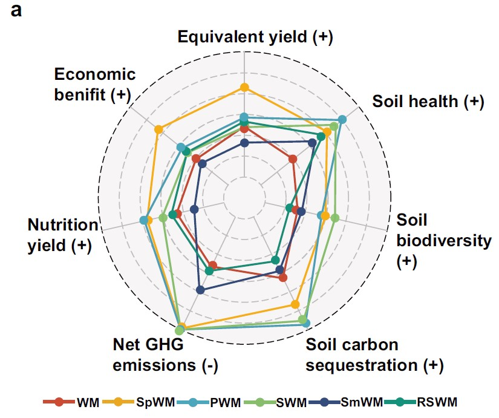
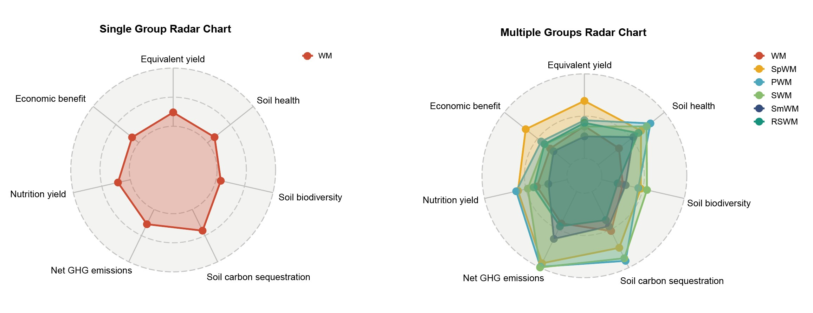

```{r setup, include=FALSE}
knitr::opts_chunk$set(
  collapse = T, echo=T, comment="#>", message=F, warning=F,
	fig.align="center", fig.width=5, fig.height=3, dpi=150)
```


The Ladar plot scripts is referenced from MicrobiomeStatPlot [Inerst Reference below].


If you use this script, please cited 如果你使用本代码，请引用：

**Yong-Xin Liu**, Lei Chen, Tengfei Ma, Xiaofang Li, Maosheng Zheng, Xin Zhou, Liang Chen, Xubo Qian, Jiao Xi, Hongye Lu, Huiluo Cao, Xiaoya Ma, Bian Bian, Pengfan Zhang, Jiqiu Wu, Ren-You Gan, Baolei Jia, Linyang Sun, Zhicheng Ju, Yunyun Gao, **Tao Wen**, **Tong Chen**. 2023. EasyAmplicon: An easy-to-use, open-source, reproducible, and community-based pipeline for amplicon data analysis in microbiome research. **iMeta** 2(1): e83. https://doi.org/10.1002/imt2.83

The online version of this tuturial can be found in https://github.com/YongxinLiu/MicrobiomeStatPlot


**Authors**
First draft(初稿)：Defeng Bai(白德凤)；Proofreading(校对)：Ma Chuang(马闯) and Jiani Xun(荀佳妮)；Text tutorial(文字教程)：Defeng Bai(白德凤)


# Introduction简介

什么是雷达图？
What is ladar plot?

雷达图又称为蜘蛛图，非常适合展示对象在多个维度的属性值或得分，又或是用于展示不同样本、细胞亚群中目标基因的表达水平、微生物在不同环境中的丰度变化等等。

Radar charts, also known as spider charts, are very suitable for displaying the attribute values or scores of objects in multiple dimensions, or for displaying the expression levels of target genes in different samples and cell subpopulations, the abundance changes of microorganisms in different environments, etc.


关键字：微生物组数据分析、MicrobiomeStatPlot、雷达图、R语言可视化

Keywords: Microbiome analysis, MicrobiomeStatPlot, Ladar plot, R visulization


## Ladar chart example雷达图案例

这是中国农业大学Yantai Gan课题组2024年发表于Nature Communications上的一篇文章，题目为：Diversifying crop rotation increases food production, reduces net greenhouse gas emissions and improves soil health. https://doi.org/10.1038/s41467-023-44464-9

This is an article published in Nature Communications by Yantai Gan's research group at China Agricultural University in 2024. The title is: Diversifying crop rotation increases food production, reduces net greenhouse gas emissions and improves soil health. https://doi.org/10.1038/s41467-023-44464-9



Fig. 6 a radar map of multiple objective analysis to assess the various functions of the rotations
图6多目标分析的雷达图，用于评估旋转的各种功能


**结果**：
We used the comprehensive evaluation index concept (CEI) to assess the synergies and trade-offs of the different crop rotations related to yield, nutritional value, soil-related indicators (health, C sequestration, microbial biodiversity), net GHG emissions, and economic benefit (Eqs. 11–20 in Methods) (Fig. 6a, d).

我们使用综合评价指数概念（CEI）来评估不同作物轮作在产量、营养价值、土壤相关指标（健康、碳封存、微生物生物多样性）、温室气体净排放和经济效益方面的协同作用和权衡（方法中的等式11–20）（图6a，d）。


## Packages installation软件包安装

```{r}
# 基于CRAN安装R包，检测没有则安装
p_list = c("ggplot2", "ggthemes")
for(p in p_list){if (!requireNamespace(p)){install.packages(p)}
    library(p, character.only = TRUE, quietly = TRUE, warn.conflicts = FALSE)}

# 基于github安装
library(devtools)
if(!requireNamespace("ggradar", quietly = TRUE))
  install_github("ricardo-bion/ggradar")

# 加载R包 Load the package
suppressWarnings(suppressMessages(library(ggplot2)))
suppressWarnings(suppressMessages(library(ggradar)))
suppressWarnings(suppressMessages(library(ggthemes)))
```


# Ladar Chart雷达图

## Ladar chart using R software雷达图R语言实战

```{r Ladar_plot, fig.show='asis', fig.width=4, fig.height=2.5}
# Load data
dt <- read.csv('data/LadarData.csv', header = TRUE, check.names = FALSE)

# View data range
range(dt[,-1])

# Define custom color palette
mycol <- c('#cd4a33', '#eaa822', '#4ca7bd', '#88bd6d', '#354d7d', '#14927c')

# Convert 'group' column to factor for consistent ordering
dt$group <- factor(dt$group, levels = unique(dt$group))

# Single group radar chart
single_radar <- ggradar(dt[1,],
                        grid.min = 11,
                        grid.mid = 23.75,
                        grid.max = 36.5,
                        values.radar = NA,  # Hide values on the radar chart
                        gridline.mid.colour = 'grey',  # Mid grid line color
                        axis.label.size = 6,  # Axis label size
                        group.colours = mycol[1],
                        group.point.size = 4,  # Point size
                        group.line.width = 1,  # Line width
                        background.circle.colour = '#D7D6D1',  # Background circle color
                        background.circle.transparency = 0.3,  # Background circle transparency
                        legend.position = 'none',  # No legend for single group
                        plot.title = "Single Group Radar Chart",  # Plot title
                        fill = TRUE,  # Fill areas under the curves
                        fill.alpha = 0.3)  # Fill transparency

# Multiple groups radar chart
multiple_radar <- ggradar(dt,
                          grid.min = 5,
                          grid.mid = 20.75,
                          grid.max = 36.5,
                          values.radar = NA,  # Hide values on the radar chart
                          gridline.mid.colour = 'grey',  # Mid grid line color
                          axis.label.size = 6,  # Axis label size
                          group.colours = mycol,
                          group.point.size = 4,  # Point size
                          group.line.width = 1,  # Line width
                          background.circle.colour = '#D7D6D1',  # Background circle color
                          background.circle.transparency = 0.3,  # Background circle transparency
                          legend.position = 'bottom',  # Legend position
                          legend.text.size = 12,  # Legend text size
                          plot.title = "Multiple Groups Radar Chart",  # Plot title
                          fill = TRUE,  # Fill areas under the curves
                          fill.alpha = 0.3)  # Fill transparency

# Theme customization for publication quality
single_radar <- single_radar +
  theme_minimal(base_size = 12) +
  theme(
    plot.title = element_text(size = 14, face = "bold"),
    #axis.text = element_text(size = 12),
    axis.text = element_blank(),
    axis.title = element_blank(),
    #panel.grid.major = element_line(color = "grey80"),
    #panel.grid.minor = element_line(color = "grey90")
    panel.grid.major = element_line(color = "white"),
    panel.grid.minor = element_line(color = "white")
  )

multiple_radar <- multiple_radar +
  theme_minimal(base_size = 14) +
  theme(
    plot.title = element_text(size = 14, face = "bold"),
    #axis.text = element_text(size = 12),
    axis.text = element_blank(),
    axis.title = element_blank(),
    #panel.grid.major = element_line(color = "grey80"),
    #panel.grid.minor = element_line(color = "grey90")
    panel.grid.major = element_line(color = "white"),
    panel.grid.minor = element_line(color = "white")  
  )

# Display the radar charts
# print(single_radar)
# print(multiple_radar)

library(patchwork)
single_multiple_radar <- single_radar + multiple_radar

# 保存图形为高分辨率PDF
# Save plot
ggsave("results/Radar_Plot_01.pdf", plot = single_multiple_radar, width = 15, height = 7)
```





If used this script, please cited:
使用此脚本，请引用下文：

**Yong-Xin Liu**, Lei Chen, Tengfei Ma, Xiaofang Li, Maosheng Zheng, Xin Zhou, Liang Chen, Xubo Qian, Jiao Xi, Hongye Lu, Huiluo Cao, Xiaoya Ma, Bian Bian, Pengfan Zhang, Jiqiu Wu, Ren-You Gan, Baolei Jia, Linyang Sun, Zhicheng Ju, Yunyun Gao, **Tao Wen**, **Tong Chen**. 2023. EasyAmplicon: An easy-to-use, open-source, reproducible, and community-based pipeline for amplicon data analysis in microbiome research. **iMeta** 2: e83. https://doi.org/10.1002/imt2.83

Copyright 2016-2024 Defeng Bai <baidefeng@caas.cn>, Chuang Ma <22720765@stu.ahau.edu.cn>, Jiani Xun <15231572937@163.com>, Yong-Xin Liu <liuyongxin@caas.cn>
