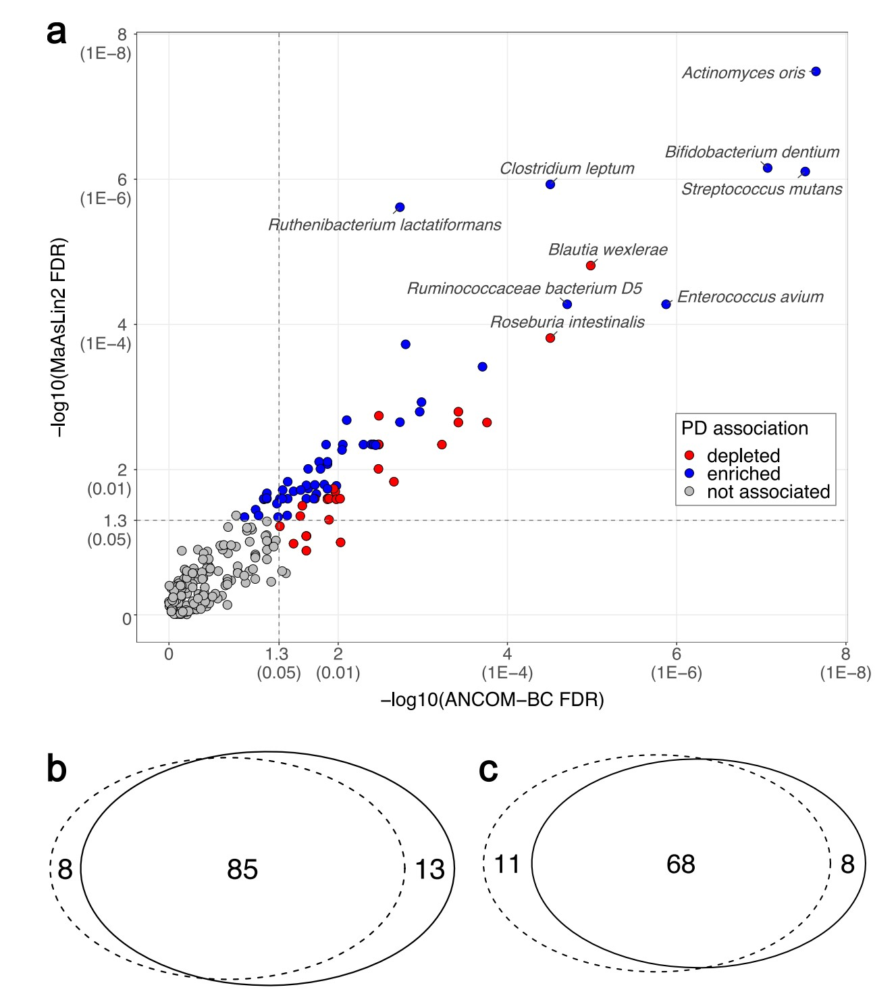

```{r setup, include=FALSE}
knitr::opts_chunk$set(
  collapse = T, echo=T, comment="#>", message=F, warning=F,
	fig.align="center", fig.width=5, fig.height=3, dpi=150)
```


The ANCOMBC Analysis scripts is referenced from MicrobiomeStatPlot [Inerst Reference below].

If you use this script, please cited 如果你使用本代码，请引用：

**Yong-Xin Liu**, Lei Chen, Tengfei Ma, Xiaofang Li, Maosheng Zheng, Xin Zhou, Liang Chen, Xubo Qian, Jiao Xi, Hongye Lu, Huiluo Cao, Xiaoya Ma, Bian Bian, Pengfan Zhang, Jiqiu Wu, Ren-You Gan, Baolei Jia, Linyang Sun, Zhicheng Ju, Yunyun Gao, **Tao Wen**, **Tong Chen**. 2023. EasyAmplicon: An easy-to-use, open-source, reproducible, and community-based pipeline for amplicon data analysis in microbiome research. **iMeta** 2(1): e83. https://doi.org/10.1002/imt2.83

The online version of this tuturial can be found in https://github.com/YongxinLiu/MicrobiomeStatPlot


**Authors**
First draft(初稿)：Defeng Bai(白德凤)；Proofreading(校对)：Ma Chuang(马闯) and Jiani Xun(荀佳妮)；Text tutorial(文字教程)：Defeng Bai(白德凤)


# Introduction简介

ANCOMBC 偏差校正法分析微生物群落的组成

相关参考：https://mirrors.nju.edu.cn/bioconductor/3.15/bioc/vignettes/ANCOMBC/inst/doc/ANCOMBC.html
https://github.com/FrederickHuangLin/ANCOMBC
https://zhuanlan.zhihu.com/p/705784637
https://mp.weixin.qq.com/s/i4q15_lwR_f_fmjLAQ06Zw

Lin, H., Peddada, S.D. Multigroup analysis of compositions of microbiomes with covariate adjustments and repeated measures. Nat Methods (2023). https://doi.org/10.1038/s41592-023-02092-7

ANCOMBC(Analysis of Compositions of Microbiomes with Bias Correction), 这个方法估计未知的抽样分数并纠正由它们在样本之间的差异引起的偏差。绝对丰度数据使用线性回归框架建模。ANCOM-BC能够对偏差进行了矫正。目前已经开发了ANCOMBC-2版本。ANCOM-BC2除了像ANCOM-BC一样考虑了样本特定偏差，为了更好的控制FDR，ANCOM-BC2还考虑了分类单元特定偏差。这很重要，因为不同类群的测序效率可能有所不同，当在测序过程中某些类群比其他类群优先测量时，会导致类群特异性偏差。例如，革兰氏阳性细菌的细胞壁比革兰氏阴性细菌更强，这使得它们在数据准备步骤中更难提取。因此，革兰氏阳性细菌在观察到的计数中可能代表性不足，如果在分析中未正确考虑分类单元特异性偏差，则会导致结果出现偏差。

另外，在高通量数据分析中，通常观察到的是，小的效应大小（effect sizes）与小的方差（variances）相关联。这意味着，当效应大小较小时，数据的波动（或变异）也相对较小。但这种情况下，一个问题是测试统计量的值（test statistics）可能会被夸大。测试统计量是用来决定一个结果是否统计显著的数值。当测试统计量的值被夸大时，会导致P值（P value）过于显著。P值是用来衡量结果偶然出现的概率，一个非常小的P值意味着结果非常显著，但如果这个值是因为测试统计量的夸大而产生的，那么这种显著性就可能是误导的。

为了解决这个问题，作者提到受到微阵列数据分析（significance analysis of microarrays, SAM）方法启发，他们采用了一种对方差进行调整（regularize）的方法。通过调整方差，可以避免测试统计量的值被夸大，从而使P值更加合理，更好地控制假发现率（FDR, false discovery rate）。假发现率是指在所有被声明为显著的发现中，错误地被判定为显著的比例。通过这种方法，可以在统计分析中获得更加准确和可靠的结果。

最后，零是基于对数丰度的差异方法（包括ANCOM-BC）的常见问题。通常，此类方法在取对数之前使用伪计数来处理零。然而，伪计数的选择可能会影响包含过多零的稀有分类群的结果，这可能导致FDR夸大。为了缓解这个问题，作者进行了敏感性分析来过滤可能误报的差异的分类单元。

ANCOM-BC2使用受限统计推断方法和混合方向假发现率（mdFDR）方法进行多重成对比较，结合上述方法，用于多组微生物组研究。重要的是，ANCOM-BC2允许对协变量以及重复测量进行建模。


关键字：微生物组数据分析、MicrobiomeStatPlot、偏差校正法分析微生物群落的组成、R语言可视化

Keywords: Microbiome analysis, MicrobiomeStatPlot, ANCOMBC , R visulization


## ANCOMBC分析案例
ANCOMBC analysis example

这是Haydeh Payami团队2022年发表于Nature Communications上的一篇论文用到的MaAsLin2和ANCOM-BC分析宏基因组数据。论文题目为：Metagenomics of Parkinson’s disease implicates the gutmicrobiome inmultiple disease mechanisms。

This is the metagenomic data analyzed by MaAsLin2 and ANCOM-BC in a paper published by Haydeh Payami’s team in Nature Communications in 2022. The title of the paper is: Metagenomics of Parkinson’s disease implicates the gutmicrobiome inmultiple disease mechanisms.



Fig. 2 | PD-associated species nominated by consensus ofMaAsLin2 and ANCOM-BC. Analysis included N= 724 biologically independent samples from490 PD and 234 neurologically healthy control (NHC) subjects. a 257 species (denoted by circles in the plot) were tested in microbiome-wide association study (MWAS) with two statistical methods: MaAsLin2 and ANCOM-BC. The results are shown according to significance (−log10 of the FDR) achieved by MaAslin2 (Y-axis) vs ANCOM-BC (X-axis). Corresponding untransformed FDR values are provided in parentheses on the Xand Yaxes for easier interpretation. 84 species were nominated as PD-associated, defined by FDR <0.05 by one method and FDR≤0.1 by the other: 68 achieved FDR< 0.05by bothmethods, 10achievedANCOM-BCMaAsLin2 FDR < 0.05 byMaAsLin2 and FDR≤0.1 by ANCOM-BC, and 6 achieved FDR < 0.05 by ANCOM-BC and FDR≤0.1 by MaAsLin2. Blue: abundance is significantly elevated in PD. Red: abundance is significantly reduced in PD.Gray: not significantly associated with PD. Vertical and horizontal dashed lines denote points on Xand Yaxes that correspond to FDR=0.05. b, c Venn diagrams summarizing the overlap of species detected by MaAsLin2 (dotted circle) and ANCOM-BC (solid circle) at FDR≤0.1 (b), and at FDR <0.05 (c).

图 2 | 根据 MaAsLin2 和 ANCOM-BC 共识提名的 PD 相关物种。分析包括来自 490 名 PD 患者和 234 名神经健康对照 (NHC) 受试者的 N= 724 个生物学独立样本。在微生物组范围关联研究 (MWAS) 中，使用两种统计方法测试了 257 个物种（图中用圆圈表示）：MaAsLin2 和 ANCOM-BC。结果根据 MaAslin2（Y 轴）与 ANCOM-BC（X 轴）实现的显著性（FDR 的 -log10）显示。为了便于解释，在 X 轴和 Y 轴的括号中提供了相应的未转换 FDR 值。 84 个物种被提名为与 PD 相关，其中一种方法定义为 FDR <0.05，另一种方法定义为 FDR≤0.1：68 个物种通过两种方法实现 FDR< 0.05，10 个物种通过 MaAsLin2 实现 ANCOM-BCMaAsLin2 FDR < 0.05，通过 ANCOM-BC 实现 FDR≤0.1，6 个物种通过 ANCOM-BC 实现 FDR < 0.05，通过 MaAsLin2 实现 FDR≤0.1。蓝色：PD 中丰度显著升高。红色：PD 中丰度显著降低。灰色：与 PD 无显著关联。垂直和水平虚线表示 X 和 Yaxes 上与 FDR=0.05 相对应的点。 b、c 维恩图总结了 MaAsLin2（虚线圆）和 ANCOM-BC（实线圆）在 FDR≤0.1（b）和 FDR <0.05（c）时检测到的物种重叠情况。


**结果**

We conducted an unbiased metagenome-wide association study (MWAS) to test differential abundances of species in PD vs. NHC, using two statistical methods (MaAsLin2 and ANCOM-BC). We also conducted MWAS at genus level tobe able to interpret our results in thecontext of the existing literature. The full MWAS results are provided in Supplementary Data 1 and 2. We nominated a species or genus as PDassociated ifit achieved significancebyMaAsLin2 andANCOM-BC (i.e., false discovery rate (FDR) <0.05 by one and FDR≤0.1 by the other). By this stringent definition, 84 of 257 species tested were associated with PD: 64 achieved FDR<0.05 by bothMaAsLin2 and ANCOM-BC, 10 had FDR < 0.05 by MaAsLin2 and FDR≤0.1 by ANCOM-BC, and 6 had FDR < 0.05 by ANCOM-BC and FDR≤0.1 byMaAsLin2 (Fig. 2).

我们进行了一项无偏的宏基因组关联研究 (MWAS)，以测试 PD 与 NHC 中物种的差异丰度，使用两种统计方法（MaAsLin2 和 ANCOM-BC）。我们还在属级进行了 MWAS，以便能够在现有文献的背景下解释我们的结果。完整的 MWAS 结果在补充数据 1 和 2 中提供。如果一个物种或属通过 MaAsLin2 和 ANCOM-BC 达到显著性（即，一个物种或属的错误发现率 (FDR) <0.05，另一个物种或属的错误发现率≤0.1），我们将该物种或属提名为 PD 相关。根据这一严格的定义，在所测试的 257 种物种中，有 84 种与 PD 相关：64 种通过 MaAsLin2 和 ANCOM-BC 测试的 FDR < 0.05，10 种通过 MaAsLin2 测试的 FDR < 0.05 且通过 ANCOM-BC 测试的 FDR≤0.1，6 种通过 ANCOM-BC 测试的 FDR < 0.05 且通过 MaAsLin2 测试的 FDR≤0.1（图 2）。


## Packages installation软件包安装

```{r packages}
# 基于CRAN安装R包，检测没有则安装 Installing R packages based on CRAN and installing them if they are not detected
p_list = c("dplyr", "reshape2",  "readxl", "phyloseq", "tibble",  "openxlsx",
           "foreach", "data.table",  "gridExtra", "scales", "ggplot2",  "ggh4x",
           "ggfortify", "ggvenn",  "ggrepel", "vegan", "pairwiseCI",  "vcd",
           "ANCOMBC")
for(p in p_list){if (!requireNamespace(p)){install.packages(p)}
    library(p, character.only = TRUE, quietly = TRUE, warn.conflicts = FALSE)}

#### LOAD REQUIRED R PACKAGES ####
suppress <- function(x){invisible(capture.output(suppressMessages(suppressWarnings(x))))}

suppress(library(dplyr))
suppress(library(reshape2))
suppress(library(readxl))
suppress(library(phyloseq))
suppress(library(tibble))
suppress(library(openxlsx))
suppress(library(foreach))
suppress(library(data.table))
suppress(library(gridExtra))
suppress(library(scales))
suppress(library(ggplot2))
suppress(library(ggh4x))
suppress(library(ggfortify))
suppress(library(ggvenn))
suppress(library(ggrepel))
suppress(library(vegan))
suppress(library(pairwiseCI))
suppress(library(vcd))
suppress(library(ANCOMBC))
```


## 创建输出目录
Make directories for output

```{r output, attr.source='.numberLines', echo=TRUE, eval=F}
# CREATE OUTPUT DIRECTORIES
system('mkdir results')
system('mkdir results/Taxonomic_associations')
```


## ANCOMBC analysis using R software MaAsLin2分析R语言实战
Practice using R software

这是参考上面案例中Nature Communications论文分析的思路这里进行代码的复现
This is a reference to the analysis of the Nature Communications paper in the above case. Here is the code reproduction

### Load data for species difference analysis 加载数据进行物种差异分析

```{r load data}
#Prepare relative abundance and count data
metadata <- data.frame(read_xlsx('data/source_data.xlsx', sheet='subject_metadata'))
rownames(metadata) <- metadata$sample_name

# read in tables that were previously generated by taxonomic profiling
abun <- data.frame(read_xlsx('data/source_data.xlsx', sheet='metaphlan_counts'))

# order same as metadata
abun <- abun[,c('clade_name',metadata$sample_name)]

# make table sample x feature
rownames(abun) <- abun$clade_name
abun <- data.frame(t(abun[,-1]), check.names=FALSE)

# compile count data into phyloseq objects for species and genus taxonomic levels
# "s__|UNKNOWN" 是一个正则表达式，表示匹配包含 “s__” 或 “UNKNOWN” 的字符串。
abun.sub <- abun[,grep("s__|UNKNOWN", colnames(abun))]
abun.ps.s <- phyloseq(otu_table(as.matrix(abun.sub), taxa_are_rows=FALSE),
                      sample_data(metadata),
                      tax_table(as.matrix(
                      data.frame(Kingdom=sapply(strsplit(colnames(abun.sub), "\\|"),
                                                function(x){x[1]}),
                                 Phylum=sapply(strsplit(colnames(abun.sub), "\\|"),
                                                function(x){x[2]}),
                                 Class=sapply(strsplit(colnames(abun.sub), "\\|"),
                                                function(x){x[3]}),
                                 Order=sapply(strsplit(colnames(abun.sub), "\\|"),
                                                function(x){x[4]}),
                                 Family=sapply(strsplit(colnames(abun.sub), "\\|"),
                                                function(x){x[5]}),
                                 Genus=sapply(strsplit(colnames(abun.sub), "\\|"),
                                                function(x){x[6]}),
                                 Species=sapply(strsplit(colnames(abun.sub), "\\|"),
                                                function(x){x[7]}),
                                 check.names=FALSE, row.names=colnames(abun.sub)))))
abun.sub <- abun[,intersect(grep("s__", colnames(abun), invert=TRUE), 
                            grep("g__|UNKNOWN", colnames(abun)))]
abun.ps.g <- phyloseq(otu_table(as.matrix(abun.sub), taxa_are_rows=FALSE),
                      sample_data(metadata),
                      tax_table(as.matrix(
                      data.frame(Kingdom=sapply(strsplit(colnames(abun.sub), "\\|"),
                                                function(x){x[1]}),
                                 Phylum=sapply(strsplit(colnames(abun.sub), "\\|"),
                                                function(x){x[2]}),
                                 Class=sapply(strsplit(colnames(abun.sub), "\\|"),
                                                function(x){x[3]}),
                                 Order=sapply(strsplit(colnames(abun.sub), "\\|"),
                                                function(x){x[4]}),
                                 Family=sapply(strsplit(colnames(abun.sub), "\\|"),
                                                function(x){x[5]}),
                                 Genus=sapply(strsplit(colnames(abun.sub), "\\|"),
                                                function(x){x[6]}),
                                 Species=sapply(strsplit(colnames(abun.sub), "\\|"),
                                                function(x){x[7]}),
                                 check.names=FALSE, row.names=colnames(abun.sub)))))

#### SPECIES AND GENUS MWAS ####
sample_data(abun.ps.s)$Case_status <- dplyr::recode(sample_data(abun.ps.s)$Case_status, 
                                                          `Patients`=1, Control=2)
sample_data(abun.ps.g)$Case_status <- dplyr::recode(sample_data(abun.ps.g)$Case_status, 
                                                          `Patients`=1, Control=2)
sample_data(abun.ps.s)$Sex <- dplyr::recode(sample_data(abun.ps.s)$Sex, 
                                                          `F`=1, M=2)
sample_data(abun.ps.g)$Sex <- dplyr::recode(sample_data(abun.ps.g)$Sex, 
                                                          `F`=1, M=2)
sample_data(abun.ps.s)$Age <- dplyr::recode(sample_data(abun.ps.s)$Age, 
                                                          `young`=1, old=2)
sample_data(abun.ps.g)$Age <- dplyr::recode(sample_data(abun.ps.g)$Age, 
                                                          `young`=1, old=2)

```


## ANCOMBC 偏差校正法分析微生物群落的组成

Perform differential abundance analysis using ANCOM-BC with count data 

```{r ANCOMBC}

library(phyloseq)
library(ANCOMBC)
ps=abun.ps.s
formula="Case_status + Sex + Age"
ci <- function(coef, se){
  lower.ci <- coef - 1.96*se
  upper.ci <- coef + 1.96*se
  return(c(lower.ci=lower.ci,upper.ci=upper.ci))
}
# make sure samples are rows and features are columns
if (taxa_are_rows(ps)){
  ps <- phyloseq(t(otu_table(ps)), sample_data(ps))
}
# run ANCOM-BC
zero_cut=0.95
if ('prv_cut' %in% names(as.list(args(ancombc)))){
  suppressWarnings(
  ancom.res <- ancombc(ps, 
                       formula="Case_status + Sex + Age",
                       p_adj_method="BH", 1-zero_cut, lib_cut=0,
                        group=NULL, struc_zero=FALSE,  neg_lb=FALSE, tol=1E-5, max_iter=100, 
                        conserve=FALSE, alpha=0.05, global=FALSE)
  )
}else{
  suppressWarnings(
  ancom.res <- ancombc(ps, 
                       formula="Case_status + Sex + Age",
                       p_adj_method="BH", zero_cut, lib_cut=0,
                        group=NULL, struc_zero=FALSE,  neg_lb=FALSE, tol=1E-5, max_iter=100, 
                        conserve=FALSE, alpha=0.05, global=FALSE)
  )
}
  
# calculate bias-corrected abundances
samp_frac <- ancom.res$samp_frac
samp_frac[is.na(samp_frac)] <- 0
ps.adj <- prune_taxa(rownames(ancom.res$feature_table), ps)
otu_table(ps.adj) <- log(otu_table(ps.adj) + 1) - samp_frac
for (var in 1:3){
  ps <- phyloseq(otu_table(ps), 
    sample_data(ps)[!is.na(sample_data(ps)[,strsplit(formula, " \\+ ")[[1]][var]]),])
  ps.adj <- phyloseq(otu_table(ps.adj), 
    sample_data(ps.adj)[!is.na(sample_data(ps.adj)[,strsplit(formula, " \\+ ")[[1]][var]]),])
}

# get summary of results
res <- data.frame()
#seq_len(ncol(ancom.res$res[[1]]))
for (var in 1:3){
  # get variable name
  var.name1 <- strsplit(formula, " \\+ ")[[1]][var]
  #var.name2 <- colnames(ancom.res$res[[1]])[var]
  var.name2 <- colnames(ancom.res$res[[1]])[var+2]
  # get N in each group
  if (length(table(sample_data(ps)[,var.name1])) == 2){
    group.1.index <- sample_data(ps)[,var.name1] == 
                      names(table(sample_data(ps)[,var.name1]))[2]
    group.1.index[is.na(group.1.index)] <- FALSE
    group.2.index <- sample_data(ps)[,var.name1] == 
                      names(table(sample_data(ps)[,var.name1]))[1]
    group.2.index[is.na(group.2.index)] <- FALSE
    n1 <- colSums(otu_table(ps)[group.1.index,] > 0)
    n2 <- colSums(otu_table(ps)[group.2.index,] > 0)
    mean1 <- exp(colMeans(otu_table(ps.adj)[group.1.index,]))
    mean2 <- exp(colMeans(otu_table(ps.adj)[group.2.index,]))
  }else{
    n1 <- rep(nsamples(ps), ntaxa(ps))
    names(n1) <- taxa_names(ps)
    n2 <- rep(NA, ntaxa(ps))
    names(n2) <- taxa_names(ps)
    mean1 <- exp(colMeans(otu_table(ps.adj)))
    mean2 <- rep(NA, ntaxa(ps.adj))
    names(mean2) <- taxa_names(ps.adj)
  }
  # calculate fold change and confidence interval of fold change
  if(length(table(sample_data(ps)[,var.name1])) == 2){
    FC <- exp(ancom.res$res[[1]][,var.name2])
    FC.lower <- c()
    FC.upper <- c()
    for (coef in seq_along(ancom.res$res[[1]][,var.name2])){
      FC.lower <- c(FC.lower, exp(ci(ancom.res$res[[1]][,var.name2][coef],
                                      ancom.res$res[[2]][,var.name2][coef])['lower.ci']))
      FC.upper <- c(FC.upper, exp(ci(ancom.res$res[[1]][,var.name2][coef],
                                      ancom.res$res[[2]][,var.name2][coef])['upper.ci']))
    }
  }else{
    FC <- NA
    FC.lower <- NA
    FC.upper <- NA
  }
  # summarize results for variable
  rvar <- data.frame(Variable=var.name1,
                    Feature=rownames(ancom.res$feature_table),
                    N1=n1[rownames(ancom.res$feature_table)],
                    N2=n2[rownames(ancom.res$feature_table)],
                    Mean1=mean1[rownames(ancom.res$feature_table)],
                    Mean2=mean2[rownames(ancom.res$feature_table)],
                    Beta=ancom.res$res[[1]][,var.name2],
                    SE=ancom.res$res[[2]][,var.name2],
                    P=ancom.res$res[[4]][,var.name2],
                    FDR=ancom.res$res[[5]][,var.name2],
                    FC=FC, FC_lower=FC.lower, FC_upper=FC.upper,
                    check.names=FALSE)
  res <- rbind(res, rvar[order(rvar$P),])
  # add untested features if they exist
  if (nrow(rvar) != ntaxa(ps)){
    res <- rbind(res,
            data.frame(Variable=var.name1,
                      Feature=taxa_names(ps)[!(taxa_names(ps) %in% 
                                               rownames(ancom.res$feature_table))],
                      N1=n1[taxa_names(ps)[!(taxa_names(ps) %in% 
                                              rownames(ancom.res$feature_table))]],
                      N2=n2[taxa_names(ps)[!(taxa_names(ps) %in% 
                                              rownames(ancom.res$feature_table))]],
                      Mean1=NA, Mean2=NA, Beta=NA, SE=NA, P=NA, FDR=NA, 
                      FC=NA, FC_lower=NA, FC_upper=NA,
                      check.names=FALSE))
  }
}
#return(list(result.summary=res, ancom.output=ancom.res, bias.corrected.ps=ps.adj))
ancom.s.patients = list(result.summary=res, ancom.output=ancom.res, bias.corrected.ps=ps.adj)

library(phyloseq)
library(ANCOMBC)
ps=abun.ps.g
formula="Case_status + Sex + Age"
ci <- function(coef, se){
  lower.ci <- coef - 1.96*se
  upper.ci <- coef + 1.96*se
  return(c(lower.ci=lower.ci,upper.ci=upper.ci))
}
# make sure samples are rows and features are columns
if (taxa_are_rows(ps)){
  ps <- phyloseq(t(otu_table(ps)), sample_data(ps))
}
# run ANCOM-BC
zero_cut=0.95
if ('prv_cut' %in% names(as.list(args(ancombc)))){
  suppressWarnings(
  ancom.res <- ancombc(ps, 
                       #formula="Case_status + Sex + Region",
                       formula="Case_status + Sex + Age",
                       p_adj_method="BH", 1-zero_cut, lib_cut=0,
                        group=NULL, struc_zero=FALSE,  neg_lb=FALSE, tol=1E-5, max_iter=100, 
                        conserve=FALSE, alpha=0.05, global=FALSE)
  )
}else{
  suppressWarnings(
  ancom.res <- ancombc(ps, 
                       #formula="Case_status + Sex + Region",
                       formula="Case_status + Sex + Age",
                       p_adj_method="BH", zero_cut, lib_cut=0,
                        group=NULL, struc_zero=FALSE,  neg_lb=FALSE, tol=1E-5, max_iter=100, 
                        conserve=FALSE, alpha=0.05, global=FALSE)
  )
}
  
# calculate bias-corrected abundances
samp_frac <- ancom.res$samp_frac
samp_frac[is.na(samp_frac)] <- 0
ps.adj <- prune_taxa(rownames(ancom.res$feature_table), ps)
otu_table(ps.adj) <- log(otu_table(ps.adj) + 1) - samp_frac
# filter for samples with data for variables included in model
for (var in 1:3){
  ps <- phyloseq(otu_table(ps), 
    sample_data(ps)[!is.na(sample_data(ps)[,strsplit(formula, " \\+ ")[[1]][var]]),])
  ps.adj <- phyloseq(otu_table(ps.adj), 
    sample_data(ps.adj)[!is.na(sample_data(ps.adj)[,strsplit(formula, " \\+ ")[[1]][var]]),])
}

# get summary of results
res <- data.frame()
# seq_len(ncol(ancom.res$res[[1]]))
for (var in 1:3){
  # get variable name
  var.name1 <- strsplit(formula, " \\+ ")[[1]][var]
  #var.name2 <- colnames(ancom.res$res[[1]])[var]
  var.name2 <- colnames(ancom.res$res[[1]])[var+2]
  # get N in each group
  if (length(table(sample_data(ps)[,var.name1])) == 2){
    group.1.index <- sample_data(ps)[,var.name1] == 
                      names(table(sample_data(ps)[,var.name1]))[2]
    group.1.index[is.na(group.1.index)] <- FALSE
    group.2.index <- sample_data(ps)[,var.name1] == 
                      names(table(sample_data(ps)[,var.name1]))[1]
    group.2.index[is.na(group.2.index)] <- FALSE
    n1 <- colSums(otu_table(ps)[group.1.index,] > 0)
    n2 <- colSums(otu_table(ps)[group.2.index,] > 0)
    mean1 <- exp(colMeans(otu_table(ps.adj)[group.1.index,]))
    mean2 <- exp(colMeans(otu_table(ps.adj)[group.2.index,]))
  }else{
    n1 <- rep(nsamples(ps), ntaxa(ps))
    names(n1) <- taxa_names(ps)
    n2 <- rep(NA, ntaxa(ps))
    names(n2) <- taxa_names(ps)
    mean1 <- exp(colMeans(otu_table(ps.adj)))
    mean2 <- rep(NA, ntaxa(ps.adj))
    names(mean2) <- taxa_names(ps.adj)
  }
  # calculate fold change and confidence interval of fold change
  if(length(table(sample_data(ps)[,var.name1])) == 2){
    FC <- exp(ancom.res$res[[1]][,var.name2])
    FC.lower <- c()
    FC.upper <- c()
    for (coef in seq_along(ancom.res$res[[1]][,var.name2])){
      FC.lower <- c(FC.lower, exp(ci(ancom.res$res[[1]][,var.name2][coef],
                                      ancom.res$res[[2]][,var.name2][coef])['lower.ci']))
      FC.upper <- c(FC.upper, exp(ci(ancom.res$res[[1]][,var.name2][coef],
                                      ancom.res$res[[2]][,var.name2][coef])['upper.ci']))
    }
  }else{
    FC <- NA
    FC.lower <- NA
    FC.upper <- NA
  }
  # summarize results for variable
  rvar <- data.frame(Variable=var.name1,
                    Feature=rownames(ancom.res$feature_table),
                    N1=n1[rownames(ancom.res$feature_table)],
                    N2=n2[rownames(ancom.res$feature_table)],
                    Mean1=mean1[rownames(ancom.res$feature_table)],
                    Mean2=mean2[rownames(ancom.res$feature_table)],
                    Beta=ancom.res$res[[1]][,var.name2],
                    SE=ancom.res$res[[2]][,var.name2],
                    P=ancom.res$res[[4]][,var.name2],
                    FDR=ancom.res$res[[5]][,var.name2],
                    FC=FC, FC_lower=FC.lower, FC_upper=FC.upper,
                    check.names=FALSE)
  res <- rbind(res, rvar[order(rvar$P),])
  # add untested features if they exist
  if (nrow(rvar) != ntaxa(ps)){
    res <- rbind(res,
            data.frame(Variable=var.name1,
                      Feature=taxa_names(ps)[!(taxa_names(ps) %in% 
                                               rownames(ancom.res$feature_table))],
                      N1=n1[taxa_names(ps)[!(taxa_names(ps) %in% 
                                              rownames(ancom.res$feature_table))]],
                      N2=n2[taxa_names(ps)[!(taxa_names(ps) %in% 
                                              rownames(ancom.res$feature_table))]],
                      Mean1=NA, Mean2=NA, Beta=NA, SE=NA, P=NA, FDR=NA, 
                      FC=NA, FC_lower=NA, FC_upper=NA,
                      check.names=FALSE))
  }
}
ancom.g.patients = list(result.summary=res, ancom.output=ancom.res, bias.corrected.ps=ps.adj)
```


### Results summary 结果汇总

```{r results summary}
# remove temporary output directory
system('rm -r temp_directory')

# coalesce results for species
res.summ <- #merge(
            data.frame(Variable=ancom.s.patients$result.summary$Variable,
                       Kingdom=gsub('_', ' ', 
                                    gsub('k__', '', 
                                         sapply(strsplit(ancom.s.patients$result.summary$Feature, "\\|"), 
                                                function(x){x[1]}))),
                       Phylum=gsub('_', ' ',
                                   gsub('p__', '', 
                                        sapply(strsplit(ancom.s.patients$result.summary$Feature, "\\|"), 
                                               function(x){x[2]}))),
                       Class=gsub('_', ' ', 
                                  gsub('c__', '', 
                                       sapply(strsplit(ancom.s.patients$result.summary$Feature, "\\|"), 
                                              function(x){x[3]}))),
                       Order=gsub('_', ' ', 
                                  gsub('o__', '', 
                                       sapply(strsplit(ancom.s.patients$result.summary$Feature, "\\|"), 
                                              function(x){x[4]}))),
                       Family=gsub('_', ' ', 
                                   gsub('f__', '', 
                                        sapply(strsplit(ancom.s.patients$result.summary$Feature, "\\|"), 
                                               function(x){x[5]}))),
                       Genus=gsub('_', ' ', 
                                  gsub('g__', '', 
                                       sapply(strsplit(ancom.s.patients$result.summary$Feature, "\\|"), 
                                              function(x){x[6]}))),
                       Species=gsub('_', ' ', 
                                    gsub('s__', '', 
                                         sapply(strsplit(ancom.s.patients$result.summary$Feature, "\\|"), 
                                                function(x){x[7]}))),
                       `N Patients`=ancom.s.patients$result.summary$N2,
                       `N Control`=ancom.s.patients$result.summary$N1,
                       space_1='',
                       `RA in Patients`=ancom.s.patients$result.summary$Mean2,
                       `RA in Control`=ancom.s.patients$result.summary$Mean1,
                       ancom.s.patients$result.summary[,c('Beta','SE','P','FDR','FC')],
                       `FC lower`=ancom.s.patients$result.summary$FC_lower, 
                       `FC upper`=ancom.s.patients$result.summary$FC_upper, 
                       space_2='', check.names=FALSE)

res.summ <- res.summ[res.summ$Variable=='Case_status',-1]
colnames(res.summ) <- c('Kingdom', 'Phylum', 'Class', 'Order',
                        'Famiy', 'Genus', 'Species',
                        'N Patients', 'N Control', '',
                        'RA in Patients', 'RA in Control',
                        'Beta', 'SE', 'P','FDR', 'FC',
                        'FC lower', 'FC upper', '')
res.summ <- as.data.frame(res.summ)
write.csv(res.summ, "results/Taxonomic_associations/Species_ANCOMBC_results.csv")

# coalesce results for genera
res.summ <- #merge(
            data.frame(Variable=ancom.g.patients$result.summary$Variable,
                       Kingdom=gsub('_', ' ', 
                                    gsub('k__', '', 
                                         sapply(strsplit(ancom.g.patients$result.summary$Feature, "\\|"), 
                                                function(x){x[1]}))),
                       Phylum=gsub('_', ' ',
                                   gsub('p__', '', 
                                        sapply(strsplit(ancom.g.patients$result.summary$Feature, "\\|"), 
                                               function(x){x[2]}))),
                       Class=gsub('_', ' ', 
                                  gsub('c__', '', 
                                       sapply(strsplit(ancom.g.patients$result.summary$Feature, "\\|"), 
                                              function(x){x[3]}))),
                       Order=gsub('_', ' ', 
                                  gsub('o__', '', 
                                       sapply(strsplit(ancom.g.patients$result.summary$Feature, "\\|"), 
                                              function(x){x[4]}))),
                       Family=gsub('_', ' ', 
                                   gsub('f__', '', 
                                        sapply(strsplit(ancom.g.patients$result.summary$Feature, "\\|"), 
                                               function(x){x[5]}))),
                       Genus=gsub('_', ' ', 
                                  gsub('g__', '', 
                                       sapply(strsplit(ancom.g.patients$result.summary$Feature, "\\|"), 
                                              function(x){x[6]}))),
                       `N Patients`=ancom.g.patients$result.summary$N2,
                       `N Control`=ancom.g.patients$result.summary$N1,
                       space_1='',
                       `RA in Patients`=ancom.g.patients$result.summary$Mean2,
                       `RA in Control`=ancom.g.patients$result.summary$Mean1,
                       ancom.g.patients$result.summary[,c('Beta','SE','P','FDR','FC')],
                       `FC lower`=ancom.g.patients$result.summary$FC_lower, 
                       `FC upper`=ancom.g.patients$result.summary$FC_upper, 
                       space_2='', check.names=FALSE)

res.summ <- res.summ[res.summ$Variable=='Case_status',-1]
colnames(res.summ) <- c('Kingdom', 'Phylum', 'Class', 'Order',
                        'Famiy', 'Genus', 
                        'N Patients', 'N Control', '',
                        'BC-OA in Patients', 'BC-OA in Control',
                         'Beta', 'SE', 'P', 'FDR', 'FC',
                        'FC lower', 'FC upper')
res.summ <- as.data.frame(res.summ)
write.csv(res.summ, "results/Taxonomic_associations/Genus_ANCOMBC_results.csv")
```


### Results filtering 结果筛选

```{r fdr_plot, attr.source='.numberLines', echo=TRUE, eval=F}
# get FDR q-values ready for plotting
plot.data <- ancom.s.patients$result.summary[ancom.s.patients$result.summary$Variable == 'Case_status',
                                       c('Feature','FDR','FC')]
plot.data <- plot.data[rowSums(is.na(plot.data)) == 0,]

plot.data$`NPC association` <- ifelse(plot.data[,2] < 0.05 | round(plot.data[,2],1) <= 0.1,
                                      ifelse(plot.data[,3] > 1, 
                                            'depleted',
                                      ifelse(plot.data[,3] < 1,
                                                    'enriched','opposite directions')),
                                     'not associated')

# create column to label features reaching FDR 1E-4 in either method
labels <- gsub('_',' ',sapply(plot.data[,1], function(x){strsplit(x, 's__')[[1]][2]}))
plot.data$labels <- ''
plot.data$labels[plot.data[,2] < 1E-4] <- labels[plot.data[,2] < 1E-4]

# tag what species were detected at FDR q-value thresholds of 0.1 and 0.05
plot.data$`MaAsLin2 FDR<0.1`[plot.data$FDR < 0.1] <- TRUE
plot.data$`MaAsLin2 FDR<0.1`[plot.data$FDR > 0.1] <- FALSE
plot.data$`MaAsLin2 FDR<0.05`[plot.data$FDR < 0.05] <- TRUE
plot.data$`MaAsLin2 FDR<0.05`[plot.data$FDR > 0.05] <- FALSE

plot.data$`MaAsLin2 FDR<0.1`[plot.data$`MaAsLin2 FDR<0.1` == 0] <- NA
plot.data$`ANCOM-BC FDR<0.1`[plot.data$`MaAsLin2 FDR<0.1` == 0] <- NA
plot.data$`MaAsLin2 FDR<0.05`[plot.data$`MaAsLin2 FDR<0.05` == 0] <- NA
plot.data$`ANCOM-BC FDR<0.05`[plot.data$`MaAsLin2 FDR<0.05` == 0] <- NA

write.csv(plot.data, 'results/Taxonomic_associations/ANCOMBC_plot_data_Case_status.csv')
```


If used this script, please cited:
使用此脚本，请引用下文：

**Yong-Xin Liu**, Lei Chen, Tengfei Ma, Xiaofang Li, Maosheng Zheng, Xin Zhou, Liang Chen, Xubo Qian, Jiao Xi, Hongye Lu, Huiluo Cao, Xiaoya Ma, Bian Bian, Pengfan Zhang, Jiqiu Wu, Ren-You Gan, Baolei Jia, Linyang Sun, Zhicheng Ju, Yunyun Gao, **Tao Wen**, **Tong Chen**. 2023. EasyAmplicon: An easy-to-use, open-source, reproducible, and community-based pipeline for amplicon data analysis in microbiome research. **iMeta** 2: e83. https://doi.org/10.1002/imt2.83

Copyright 2016-2024 Defeng Bai <baidefeng@caas.cn>, Chuang Ma <22720765@stu.ahau.edu.cn>, Jiani Xun <15231572937@163.com>, Yong-Xin Liu <liuyongxin@caas.cn>

