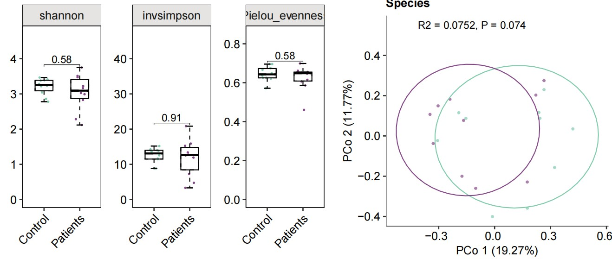

```{r setup, include=FALSE}
knitr::opts_chunk$set(
  collapse = T, echo=T, comment="#>", message=F, warning=F,
	fig.align="center", fig.width=5, fig.height=3, dpi=150)
```


The Alpah Beta Diversity With Adjustable scripts is referenced from MicrobiomeStatPlot [Inerst Reference below].

If you use this script, please cited 如果你使用本代码，请引用：

**Yong-Xin Liu**, Lei Chen, Tengfei Ma, Xiaofang Li, Maosheng Zheng, Xin Zhou, Liang Chen, Xubo Qian, Jiao Xi, Hongye Lu, Huiluo Cao, Xiaoya Ma, Bian Bian, Pengfan Zhang, Jiqiu Wu, Ren-You Gan, Baolei Jia, Linyang Sun, Zhicheng Ju, Yunyun Gao, **Tao Wen**, **Tong Chen**. 2023. EasyAmplicon: An easy-to-use, open-source, reproducible, and community-based pipeline for amplicon data analysis in microbiome research. **iMeta** 2(1): e83. https://doi.org/10.1002/imt2.83

The online version of this tuturial can be found in https://github.com/YongxinLiu/MicrobiomeStatPlot


**Authors**
First draft(初稿)：Defeng Bai(白德凤)；Proofreading(校对)：Ma Chuang(马闯) and Jiani Xun(荀佳妮)；Text tutorial(文字教程)：Defeng Bai(白德凤)


# Introduction简介

肠道微生物的alpha多样性和beta多样性是衡量微生物群落组成的两个重要指标，常用于分析不同样本或群体之间的微生物群落差异。Alpha多样性通常用于评估一个群体中不同样本的群落稳定性或健康状态。例如，肠道微生物的高多样性通常与健康肠道相关。Beta多样性有助于比较不同群体之间的差异。例如，病人与健康人之间的肠道微生物组成差异可以通过Beta多样性分析揭示。

The alpha diversity and beta diversity of intestinal microorganisms are two important indicators to measure the composition of microbial communities, and are often used to analyze the differences in microbial communities between different samples or groups. Alpha diversity is often used to evaluate the community stability or health status of different samples in a group. For example, a high diversity of intestinal microorganisms is usually associated with a healthy intestine. Beta diversity helps to compare differences between different groups. For example, the difference in intestinal microbial composition between patients and healthy people can be revealed by Beta diversity analysis.

Alpha多样性时衡量单个样本中微生物群落的多样性，即微生物物种的丰富度和均匀度。常见指标包括：物种丰富度（Species Richness），样本中微生物种类的数量；香农指数（Shannon Index），结合物种的丰富度和均匀度，反映群落多样性；辛普森指数（Simpson Index），主要衡量物种均匀度，值越大表示群落中的物种越均匀；Faith's Phylogenetic Diversity：基于进化距离的多样性度量。

Alpha diversity measures the diversity of microbial communities in a single sample, that is, the richness and uniformity of microbial species. Common indicators include: Species Richness, the number of microbial species in a sample; Shannon Index, which combines species richness and uniformity to reflect community diversity; Simpson Index, which mainly measures species uniformity, with larger values indicating more uniform species in the community; Faith's Phylogenetic Diversity: a diversity measure based on evolutionary distance.

Beta多样性是衡量不同样本之间微生物群落的差异，即群落组成的变化程度。常见指标包括：Bray-Curtis距离，考虑物种丰度的相似性，用于计算样本之间的物种组成差异；Unifrac距离，基于系统发育树计算微生物群落的差异。包括加权和未加权Unifrac，加权版本考虑物种的相对丰度，未加权版本仅考虑物种的存在与否；Jaccard距离，基于物种的存在与否来衡量样本间的相似性。

Beta diversity is a measure of the differences in microbial communities between different samples, that is, the degree of change in community composition. Common indicators include: Bray-Curtis distance, which considers the similarity of species abundance and is used to calculate the differences in species composition between samples; Unifrac distance, which calculates the differences in microbial communities based on phylogenetic trees. It includes weighted and unweighted Unifrac, the weighted version considers the relative abundance of species, and the unweighted version only considers the presence or absence of species; Jaccard distance, which measures the similarity between samples based on the presence or absence of species.

分析工具
在微生物群落的alpha和beta多样性分析中，常用的工具和方法有：QIIME 2，支持多样性分析，包括alpha和beta多样性计算，并能生成相应的可视化图；R包 phyloseq 和vegan：用于微生物生态数据的多样性分析和可视化，支持计算各种多样性指数和距离矩阵。

Analysis tools
In the analysis of alpha and beta diversity of microbial communities, commonly used tools and methods include: QIIME 2, which supports diversity analysis, including alpha and beta diversity calculations, and can generate corresponding visualizations; R packages phyloseq and vegan: used for diversity analysis and visualization of microbial ecological data, supporting the calculation of various diversity indices and distance matrices.


关键字：微生物组数据分析、MicrobiomeStatPlot、可调整代码α和β多样性、R语言可视化

Keywords: Microbiome analysis, MicrobiomeStatPlot, Alpah Beta Diversity With Adjustable Code , R visulization


## Alpah Beta Diversity example α和β多样性案例

这是来自于上海交通大学医学院Haoyan Chen团队2023年发表于Cell Host & Microbe上的一篇论文用到的组间alpha和beta多样性比较。论文题目为：Multi-kingdom gut microbiota analyses define bacterial-fungal interplay and microbial markers of pan-cancer immunotherapy across cohorts. https://doi.org/10.1016/j.chom.2023.10.005


Figure 1 (F) a-diversity (Shannon index) of responders and non-responders calculated in all 9 studies, respectively. Significance was determined using Wilcoxon rank-sum test (two-sided). (G) Principal-component analysis based on fungal abundance of samples from all 9 studies. Green dots represent responders and blue dots represent nonresponders. p value was calculated with PERMANOVA by 999 permutations (two-sided test). 

图 1 (F) 在所有 9 项研究中分别计算了有反应者和无反应者的 a-多样性（香农指数）。使用 Wilcoxon 秩和检验（双侧）确定显著性。（G）基于所有 9 项研究中样本真菌丰度的主成分分析。绿点代表有反应者，蓝点代表无反应者。p 值通过 999 次排列（双侧检验）用 PERMANOVA 计算。

**结果**

For fungal richness, higher a-diversity (Shannon index) based on fungal species level was detected in responders of the Derosa et al. dataset, whereas no significant difference was identified in other datasets (Figure 1F). Principal-component analysis (PCA) produced a slight difference in b-diversity between the responders and non-responders when pooling all 9 datasets (p = 0.001, PERMANOVA testing; Figure 1G) or 4 cohorts with anti-PD-1 monotherapy (p = 0.001, PERMANOVA testing; Figure S2A), although the PCA’s explanatory power is quite limited. 

对于真菌丰富度，在 Derosa 等人的数据集中检测到了更高的基于真菌物种水平的 a 多样性（香农指数），而在其他数据集中没有发现显著差异（图 1F）。在汇总所有 9 个数据集（p = 0.001，PERMANOVA 检验；图 1G）或 4 个使用抗 PD-1 单药治疗的队列（p = 0.001，PERMANOVA 检验；图 S2A）时，主成分分析 (PCA) 在响应者和无响应者之间产生了轻微的 b 多样性差异，尽管 PCA 的解释能力非常有限。


## Packages installation软件包安装

```{r}
# 基于CRAN安装R包，检测没有则安装 Installing R packages based on CRAN and installing them if they are not detected
p_list = c("ggplot2", "reshape2", "vegan", "ggpubr", "patchwork", "ape","scales",
           "tidyr","magrittr","dplyr","multcompView","ggsignif","amplicon","ggrepel",
           "rdacca.hp","psych","cowplot")
for(p in p_list){if (!requireNamespace(p)){install.packages(p)}
    library(p, character.only = TRUE, quietly = TRUE, warn.conflicts = FALSE)}

# 基于Bioconductor安装R包
if (!requireNamespace("MMUPHin", quietly = TRUE))
    BiocManager::install("MMUPHin")

# 加载R包 Loading R packages
suppressWarnings(suppressMessages(library(ggplot2)))
suppressWarnings(suppressMessages(library(reshape2)))
suppressWarnings(suppressMessages(library(vegan)))
suppressWarnings(suppressMessages(library(ggpubr)))
suppressWarnings(suppressMessages(library(patchwork)))
suppressWarnings(suppressMessages(library(ape)))
suppressWarnings(suppressMessages(library(tidyr)))
suppressWarnings(suppressMessages(library(magrittr)))
suppressWarnings(suppressMessages(library(dplyr)))
suppressWarnings(suppressMessages(library(multcompView)))
suppressWarnings(suppressMessages(library(ggsignif)))
suppressWarnings(suppressMessages(library(amplicon)))
suppressWarnings(suppressMessages(library(ggrepel)))
suppressWarnings(suppressMessages(library(rdacca.hp)))
suppressWarnings(suppressMessages(library(psych)))
suppressWarnings(suppressMessages(library(cowplot)))
suppressWarnings(suppressMessages(library(scales)))
```


## Alpha and beta diversity index calculation 计算alpha和beta多样性指数

Alpha and beta diversity index calculation

```{r Alpha Beta diversity index}

#### α diversity ####
# Results from metaphlan4
otutable <- read.table("data/taxonomy.tsv",header=T,sep='\t',stringsAsFactors = F)
otutable <- separate(otutable, clade_name, c("Kingdom","Phylum","Class","Order","Family","Genus","Species","Taxonomy"),sep="\\|",extra = "drop", fill = "right")
otutable <- otutable[-which(is.na(otutable$Taxonomy)),]

otutable = data.frame(otutable,stringsAsFactors = F) 
otutable[,9:ncol(otutable)] = as.data.frame(lapply(otutable[,9:ncol(otutable)],as.numeric))
metadata = read.table(paste("data/group2.txt",sep=""), header=T, row.names=1, sep="\t", comment.char="")
metadata$Group <- NULL
colnames(metadata)[4] <- 'Group'

i = 7
level = cbind(otutable[,i],otutable[,9:ncol(otutable)])
level = melt(level,id.vars= colnames(level)[1],
              measure.vars = colnames(level[,2:ncol(level)]),
              variable.name = "sample",value.name = "relative_abundance")
level = dcast(level, otutable[, i] ~ sample, fun.aggregate = sum)
#RA transposition
level = t(level)
colnames(level) = level[1,]
level = level[-1,]
level = data.frame(level,stringsAsFactors = F) 
colnames(level) = gsub('\\.','',colnames(level))
level1 = apply(level,2,as.numeric)
rownames(level1)=rownames(level)
level=level1

#Calculate diversity
level_diversity = data.frame(Sample_ID = colnames(otutable[9:ncol(otutable)]),
                              observed_species=specnumber(level),
                              shannon=vegan::diversity(level, index="shannon"),
                              simpson=vegan::diversity(level, index="simpson"),
                              invsimpson=vegan::diversity(level, index="invsimpson"),
                              Pielou_evenness=vegan::diversity(level,
                              index="shannon")/log(specnumber(level)))
  
#Export diversity table
write.table(level_diversity, file = paste0('results/',colnames(otutable)[i],'_alpha_diversity.txt'),
            quote = FALSE, sep = "\t", row.names = FALSE,col.names = TRUE)


#### β diversity ####
i=7 #Select species level for β diversity analysis
level = cbind(otutable[,i],otutable[,9:ncol(otutable)])
level = melt(level,id.vars= colnames(level)[1],
             measure.vars = colnames(level[,2:ncol(level)]),
             variable.name = "sample",value.name = "relative_abundance")
level = dcast(level, otutable[, i] ~ sample, fun.aggregate = sum)
#RA transposition
level = t(level)
colnames(level) = level[1,]
level = level[-1,]
level = data.frame(level,stringsAsFactors = F) 
colnames(level) = gsub('\\.','',colnames(level))
level1 = apply(level,2,as.numeric)
rownames(level1)=rownames(level)
level=level1

DCA=decorana(level)
#DCA=summary(DCA)

RA <- otutable
RA[,9:ncol(RA)] <- apply(RA[,9:ncol(RA)],2, function(x) x / sum(x) )

level = cbind(RA[,i],RA[,9:ncol(RA)])
level = melt(level,id.vars= colnames(level)[1],
              measure.vars = colnames(level[,2:ncol(level)]),
              variable.name = "Sample_ID",value.name = "relative_abundance")
level = dcast(level, RA[, i] ~ Sample_ID, fun.aggregate = sum)
#RA transposition
level = t(level)
colnames(level) = level[1,]
level = level[-1,]
level = data.frame(level,stringsAsFactors = F) 
colnames(level) = gsub('\\.','',colnames(level))
level1 = apply(level,2,as.numeric)
rownames(level1)=rownames(level)
level <- as.data.frame(level1)

level.reset = level
level.reset$Sample_ID <- rownames(level.reset)
level.reset <- merge(metadata, level.reset, by='Sample_ID')
colnames(level.reset)[3] = 'Group2'

rownames(level.reset) = level.reset[,1]

level_distance = vegdist(level.reset[,-c(1:12)])  #Get β diversity bray curtis distance matrix
level_distance = as.matrix(level_distance)
# Export bray curtis  matrix
write.table(level_distance, file = paste0('results/',colnames(otutable)[i],'_beta_diversity.txt'),
            quote = FALSE, sep = "\t", row.names = FALSE,col.names = TRUE)
```


## Alpha diversity boxplots α多样性箱线图

Alpha diversity index plots for two group compare: Patients and Healthy controls
两组比较的 Alpha 多样性指数图：患者和健康对照者


```{r alpha_boxplot, echo = TRUE}

mytheme = theme_bw() + theme(text = element_text(family = "sans", size = 8))+
    theme(legend.position="none",
    legend.text = element_text(size=10),
    legend.title = element_blank(), 
    panel.background = element_blank(),
    panel.grid = element_blank(),
    axis.text.y = element_text(size=10, colour="black", family = "sans", angle = 0), 
    axis.text.x = element_text(size=10, colour="black", family = "sans", angle = 0, hjust = 0),
    axis.title= element_text(size=10, family = "sans"),
    strip.text.x = element_text(size=10, angle = 0),
    strip.text.y = element_text(size=10, angle = 0),
    plot.title = element_text(size=10, angle = 0),
    strip.background.x = element_rect(fill = "#E5E4E2", colour = "black", size = 0.2))+
    theme(axis.text.x=element_text(angle=0,vjust=1, hjust=0.6))+
    theme(axis.line = element_line(size = 0.1, colour = "black"))

# Source and edited from package amplicon
alpha_boxplot2 <- function(alpha_div, metadata, index = "shannon", groupID = "group", levels = c(), outlier = FALSE){
  p_list = c("ggplot2", "dplyr", "multcompView")
    for (p in p_list) {
        if (!requireNamespace(p)) {
            install.packages(p)
        }
        suppressPackageStartupMessages(library(p, character.only = TRUE, 
            quietly = TRUE, warn.conflicts = FALSE))
    }
  idx = rownames(metadata) %in% rownames(alpha_div)
  metadata = metadata[idx, , drop = F]
  alpha_div = alpha_div
  idx = rownames(metadata) %in% rownames(alpha_div)
  metadata = metadata[idx, , drop = F]
  alpha_div = alpha_div[rownames(metadata), ]
  sampFile = as.data.frame(metadata[, groupID], row.names = row.names(metadata))
  df = cbind(alpha_div[rownames(sampFile), index], sampFile)
  colnames(df) = c(index, "group")
  max = max(df[, c(index)])
  min = min(df[, index])
  x = df[, c("group", index)]
  y = x %>% group_by(group) %>% summarise_(Max = paste("max(", index, ")", sep = ""))
  y = as.data.frame(y)
  rownames(y) = y$group
  df$y = y[as.character(df$group), ]$Max + (max - min) * 0.05
  levels(as.factor(df$group))
  df = df %>%
    mutate(group = ordered(df$group,levels=levels))
  df$class = index
  compaired = list(c(levels[1], levels[2]))
  wt = wilcox.test(df[[index]] ~ df$group, alternative=c("two.sided"))
  FDR = p.adjust(wt$p.value, method = "BH")
  p1 = ggplot(df, aes(x = group, y = .data[[index]])) +
    geom_jitter(aes(color=group),position = position_jitter(0.15), size = 0.3, alpha = 1) +
    geom_boxplot(position=position_dodge(width =0.4),width=0.5, size = 0.4,
               fill = "transparent", 
               outlier.shape = NA,
               linetype = "dashed", color = "black") +
    stat_boxplot(aes(ymin=..lower..,ymax=..upper..,
                   fill=group
                   ),
               color="black",
               fill = "transparent",position=position_dodge(width =0.4),width=0.5, size = 0.4,outlier.shape = NA)+
    stat_boxplot(geom = "errorbar",aes(ymin=..ymax..),
               width=0.18,color="black",size = 0.4)+
    stat_boxplot(geom = "errorbar",aes(ymax=..ymin..),
               width=0.18,color="black",size = 0.4)+
    labs(x = NULL, y = NULL, color = groupID) + 
    scale_y_continuous(labels = label_number(accuracy = 0.1)) +
    #scale_fill_manual(values = c("#74add1","#a60026"))+
    #scale_color_manual(values = c("#74add1","#a60026"))+
    #scale_fill_manual(values = c("#4177a4","#b33e5b"))+
    #scale_color_manual(values = c("#4177a4","#b33e5b"))+
    scale_fill_manual(values = c("#81CBAB","#854888"))+
    scale_color_manual(values = c("#81CBAB","#854888"))+
    geom_signif(comparisons = compaired,
              step_increase = 0.3,
              map_signif_level = F,
              test = wilcox.test,
              color = "black",
              size = 0.2,
              textsize = 3
              )+
    mytheme+
    facet_grid(.~class)
  p1
}

alpha_div <- level_diversity
metadata2 <- as.data.frame(metadata)

p1 <- alpha_boxplot2(alpha_div, metadata2, index = "shannon", groupID = "Group2", levels = c("Control", "Patients"))+
  scale_y_continuous(limits = c(0,4.7))+theme(axis.text.x=element_text(angle=45, vjust=1, hjust=1, size = 10),
          axis.line = element_line(linewidth = 0.2))
p2 <- alpha_boxplot2(alpha_div, metadata2, index = "invsimpson", groupID = "Group2", levels = c("Control", "Patients"))+
  scale_y_continuous(limits = c(0,47))+theme(axis.text.x=element_text(angle=45, vjust=1, hjust=1, size = 10),
          axis.line = element_line(linewidth = 0.2))
p3 <- alpha_boxplot2(alpha_div, metadata2, index = "Pielou_evenness", groupID = "Group2", levels = c("Control", "Patients"))+
  scale_y_continuous(limits = c(0,0.85))+theme(axis.text.x=element_text(angle=45, vjust=1, hjust=1, size = 10),
          axis.line = element_line(linewidth = 0.2))

library(patchwork)
p_all_alpha = p1 + p2 + p3
#ggsave(paste("results/Figure_1B5",".pdf", sep=""), p_all_alpha, width=105 * 1.5, height=65 * 1.5, unit='mm')
#p_all_alpha
```


## Beta diversity PCoA β多样性PCoA图

Functions to plot pcoa plots
PCoA图函数

```{r pcoa functions}

# Source and edited from package amplicon
beta_pcoa2 = function (dis_mat, metadata, groupID = "Group", groupID2 = "Group2", ellipse = T, 
    label = F, PCo = 12) 
  {
    p_list = c("ggplot2", "vegan", "ggrepel")
    for (p in p_list) {
        if (!requireNamespace(p)) {
            install.packages(p)
        }
        suppressWarnings(suppressMessages(library(p, character.only = T)))
    }
    idx = rownames(metadata) %in% rownames(dis_mat)
    metadata = metadata[idx, , drop = F]
    dis_mat = dis_mat[rownames(metadata), rownames(metadata)]
    sampFile = as.data.frame(metadata[, groupID], row.names = row.names(metadata))
    sampFile2 = as.data.frame(metadata[, groupID2], row.names = row.names(metadata))
    pcoa = cmdscale(dis_mat, k = 3, eig = T)
    points = as.data.frame(pcoa$points)
    eig = pcoa$eig
    points = cbind(points, sampFile[rownames(points), ])
    points = cbind(points, sampFile2[rownames(points), ])
    colnames(points) = c("x", "y", "z", "group", "group2")
    points$group2 = metadata$Group2
    points$x = points$x
    #points$y = -points$y
    levels(as.factor(points$group))
    points = points %>%
        mutate(group = ordered(points$group,
                         levels=c("Patients", "Control")
                         ))
    if (PCo == 12) {
        p = ggplot(points, aes(x = x, y = y, color = group, shape = group2)) + #, shape = group2
            labs(x = paste("PCo 1 (", format(100 * eig[1]/sum(eig), 
                digits = 4), "%)", sep = ""), y = paste("PCo 2 (", 
                format(100 * eig[2]/sum(eig), digits = 4), "%)", 
                sep = ""), color = groupID)
    }
    if (PCo == 13) {
        p = ggplot(points, aes(x = x, y = z, color = group, shape = group2)) + 
            labs(x = paste("PCo 1 (", format(100 * eig[1]/sum(eig), 
                digits = 4), "%)", sep = ""), y = paste("PCo 3 (", 
                format(100 * eig[2]/sum(eig), digits = 4), "%)", 
                sep = ""), color = groupID)
    }
    if (PCo == 23) {
        p = ggplot(points, aes(x = y, y = z, color = group, shape = group2)) + 
            labs(x = paste("PCo 2 (", format(100 * eig[1]/sum(eig), 
                digits = 4), "%)", sep = ""), y = paste("PCo 3 (", 
                format(100 * eig[2]/sum(eig), digits = 4), "%)", 
                sep = ""), color = groupID)
    }
    p = p + geom_point(alpha = 0.7, size = 0.6) + theme_classic() + 
        theme(text = element_text(family = "sans", size = 7)
              )+
      #scale_fill_manual(values = c("#a60026","#74add1"))+
      #scale_color_manual(values = c("#a60026","#74add1"))+
      #scale_fill_manual(values = c("#4177a4","#b33e5b"))+
    #scale_color_manual(values = c("#4177a4","#b33e5b"))+
      scale_fill_manual(values = c("#81CBAB","#854888"))+
    scale_color_manual(values = c("#81CBAB","#854888"))+
      scale_shape_manual(values = c(19, 19))#+
      coord_fixed(ratio = 1)
    if (ellipse == T) {
        p = p + stat_ellipse(data = filter(points, group == "Patients"), aes(group = group), level = 0.78, size = 0.4)+
          stat_ellipse(data = filter(points, group == "Control"), aes(group = group), level = 0.78, size = 0.4)+
          theme(text = element_text(family = "sans", size = 7))+theme(legend.position="none",
    legend.text = element_text(size=10),
    legend.title = element_blank(),
    axis.text.y = element_text(size=10, colour="black", family = "sans", angle = 0),
    axis.text.x = element_text(size=10, colour="black", family = "sans", angle = 0, hjust = 0),
    axis.title= element_text(size=10)
    )+
    theme(axis.text.x=element_text(angle=0,vjust=1, hjust=0.6))+
    theme(axis.line = element_line(size = 0.2, colour = "black"))
    }
    if (label == T) {
        p = p + geom_text_repel(label = paste(rownames(points)),
            colour = "black", size = 2)
    }
    p
}

```


## Species β diversity 物种组间β多样性

```{r Species PCoA}
# species
distance_mat = level_distance

metadata2 = t(metadata)
distance_mat2 = distance_mat[rownames(distance_mat) %in% rownames(metadata), ]
distance_mat3 = distance_mat2[, colnames(distance_mat2) %in% colnames(metadata2)]
distance_mat = distance_mat3

rows01 = rownames(metadata)
distance_mat2 = distance_mat[rows01, ]
distance_mat2 = t(distance_mat2)
distance_mat3 = distance_mat2[rows01, ]
distance_mat = t(distance_mat3)

# Plotting Constrained PCoA based on distance matrix
level_distance <- distance_mat
pcoa = cmdscale (level_distance,eig=TRUE,k =3)
level.pcoa = pcoa$points[,c(1,2)]
colnames(level.pcoa)=c('PC1','PC2')
pc = round(pcoa$eig/sum(pcoa$eig)*100,digits=2)
level.pcoa = as.data.frame(level.pcoa)
level.pcoa$Sample_ID = row.names(level.pcoa)
level.pcoa = merge(metadata,level.pcoa,by='Sample_ID')
colnames(level.pcoa)[3] = 'Group2'
level.pcoa$Group2 = factor(level.pcoa$Group2,levels = c('Control','Patients'))

# Differential test
#adonis function used fot PCoA
level.adonis = adonis2(level_distance~level.pcoa[,3],data=level.pcoa[,c(5,6)],distance = "bray",permutations = 999)
level.adonis

(p_beta_s = beta_pcoa2(distance_mat, metadata, groupID = "Group2",groupID2 = "Group2", ellipse = T))
p_beta_s = p_beta_s + annotate(geom = "text", x = -0.41, y = 0.55, label = "R2 = 0.0752, P = 0.074", hjust = "left", size = 3)+ 
  ggtitle("Species")+theme(plot.title = element_text(face="bold", size = 10))
#ggsave(paste("results/beta_diversity_species03",".pdf", sep=""), p_beta_s, width=89 * 1.5, height=70 * 1.5, unit='mm')
```


alpha and beta diversity plots

```{r alpha and beta diversity}
gg <- ggdraw()+draw_plot(p_all_alpha, x=0, y=0, width=0.55, height=1) +  
    draw_plot(p_beta_s, 0.55, 0, 0.45, 1)
ggsave(paste("results/figure_alpha_beta",".pdf", sep=""), gg, width=125 * 1.5, height=55 * 1.5, unit='mm')
#gg
```





If used this script, please cited:
使用此脚本，请引用下文：

**Yong-Xin Liu**, Lei Chen, Tengfei Ma, Xiaofang Li, Maosheng Zheng, Xin Zhou, Liang Chen, Xubo Qian, Jiao Xi, Hongye Lu, Huiluo Cao, Xiaoya Ma, Bian Bian, Pengfan Zhang, Jiqiu Wu, Ren-You Gan, Baolei Jia, Linyang Sun, Zhicheng Ju, Yunyun Gao, **Tao Wen**, **Tong Chen**. 2023. EasyAmplicon: An easy-to-use, open-source, reproducible, and community-based pipeline for amplicon data analysis in microbiome research. **iMeta** 2: e83. https://doi.org/10.1002/imt2.83

Copyright 2016-2024 Defeng Bai <baidefeng@caas.cn>, Chuang Ma <22720765@stu.ahau.edu.cn>, Jiani Xun <15231572937@163.com>, Yong-Xin Liu <liuyongxin@caas.cn>

