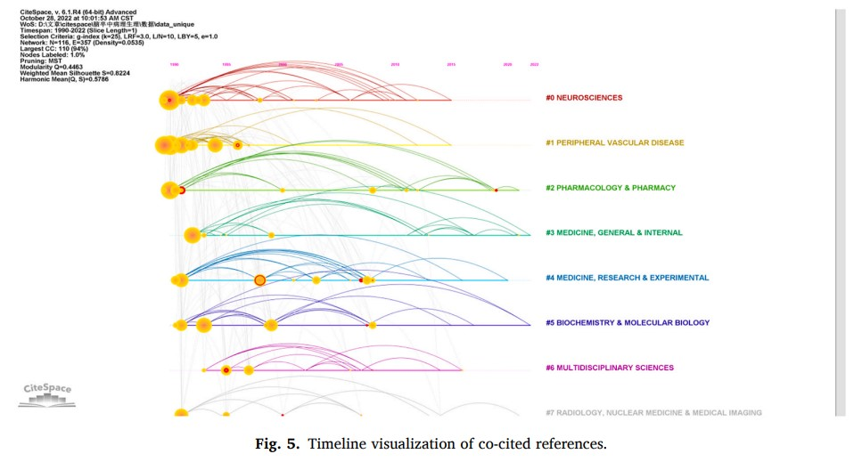
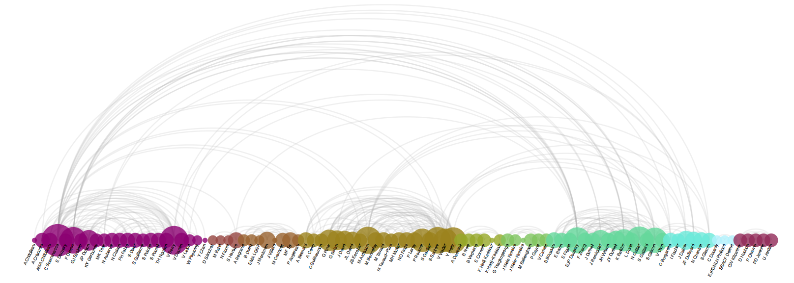

```{r setup, include=FALSE}
knitr::opts_chunk$set(
  collapse = T, echo=T, comment="#>", message=F, warning=F,
	fig.align="center", fig.width=5, fig.height=3, dpi=150)
```


The ArcDiagram scripts is referenced from MicrobiomeStatPlot [Inerst Reference below].

If you use this script, please cited 如果你使用本代码，请引用：

**Yong-Xin Liu**, Lei Chen, Tengfei Ma, Xiaofang Li, Maosheng Zheng, Xin Zhou, Liang Chen, Xubo Qian, Jiao Xi, Hongye Lu, Huiluo Cao, Xiaoya Ma, Bian Bian, Pengfan Zhang, Jiqiu Wu, Ren-You Gan, Baolei Jia, Linyang Sun, Zhicheng Ju, Yunyun Gao, **Tao Wen**, **Tong Chen**. 2023. EasyAmplicon: An easy-to-use, open-source, reproducible, and community-based pipeline for amplicon data analysis in microbiome research. **iMeta** 2(1): e83. https://doi.org/10.1002/imt2.83

The online version of this tuturial can be found in https://github.com/YongxinLiu/MicrobiomeStatPlot


**Authors**
First draft(初稿)：Defeng Bai(白德凤)；Proofreading(校对)：Ma Chuang(马闯) and Jiani Xun(荀佳妮)；Text tutorial(文字教程)：Defeng Bai(白德凤)


# Introduction简介

什么是弧线图？
What is an arc diagram?

弧线图是一种特殊结构的网络图，常用于展示不同数据节点间的联系或频率。在弧线图中，节点沿单一轴线显示，节点间的链接用弧线表示。相比常规网络图，弧线图能够按需自行定义或优化每个节点的顺序，更好的突出显示群组和分支，同时还能清楚展示每个节点的文本标签。

Arc diagram is a special structure of network diagram, which is often used to show the connection or frequency between different data nodes. In the arc diagram, the nodes are displayed along a single axis, and the links between the nodes are represented by arcs. Compared with the conventional network diagram, the arc diagram can define or optimize the order of each node as needed, better highlight the groups and branches, and clearly display the text label of each node.

关键字：微生物组数据分析、MicrobiomeStatPlot、弧线图、R语言可视化

Keywords: Microbiome analysis, MicrobiomeStatPlot, Arc Diagram , R visulization

参考：https://mp.weixin.qq.com/s/-beK8ycxXpbKE8O0nyWpIQ

参考文献1：https://doi.org/10.1016/j.heliyon.2024.e28597
参考文献2：https://doi.org/10.1126/science.adm8762


## Arc diagram example  弧线图案例

这是成都中医药大学Nan Zeng团队2024年发表于Heliyon上的一篇论文(Bao et al., 2024)用到的图。论文题目为：Ischemic stroke pathophysiology: A bibliometric and visualization analysis from 1990 to 2022. https://doi.org/10.1016/j.heliyon.2024.e28597 

This is a picture used in a paper (Bao et al., 2024) published in Heliyon by Nan Zeng's team from Chengdu University of Traditional Chinese Medicine in 2024. The title of the paper is: Ischemic stroke pathophysiology: A bibliometric and visualization analysis from 1990 to 2022. https://doi.org/10.1016/j.heliyon.2024.e28597 




Fig. 5. Timeline visualization of co-cited references. 
图 5. 同引参考文献的时间线可视化。


**结果**

CiteSpace can be applied to conducting a statistical and correlation analysis of co-cited references into clusters. In this study, we identified eight different clusters in the network of co-cited references, with significant modularity and silhouette scores, indicating highly credible clusters (Q = 0.4463, S = 0.8224). The eight clusters are displayed in Fig. 5, including #0 Neurosciences, #1 Peripheral Vascular Disease, #2 Pharmacology & Pharmacy, #3 Medicine, General &Internal, #4 Medicine, Research & Experimental, #5 Biochemistry & Molecular Biology, #6 Multidisciplinary Sciences and #7 Radiology, Nuclear Medicine & Medical Imaging.

CiteSpace 可用于对同引文献进行统计和相关性分析，将其划分为聚类。在本研究中，我们在同引文献网络中确定了八个不同的聚类，这些聚类具有显著的模块性和轮廓得分，表明这些聚类具有很高的可信度（Q = 0.4463，S = 0.8224）。图 5 显示了八个聚类，包括 #0 神经科学、#1 外周血管疾病、#2 药理学和药学、#3 医学、综合和内科、#4 医学、研究和实验、#5 生物化学和分子生物学、#6 多学科科学和 #7 放射学、核医学和医学成像。

Besides, as shown in Fig. 5, the research clusters out of date mainly referred to #0 Neurosciences, #1 Peripheral Vascular Disease, and #6 Multidisciplinary Sciences. Popular research clusters until 2022 were #2 Pharmacology & Pharmacy, #3 Medicine, General &Internal, #5 Biochemistry & Molecular Biology, and #7 Radiology, Nuclear Medicine & Medical Imaging, which are the hotspots in the exploration of ischemic stroke pathophysiology

此外，如图 5 所示，过时的研究集群主要指 #0 神经科学、#1 外周血管疾病和 #6 多学科科学。截至 2022 年，热门研究集群为 #2 药理学与药学、#3 医学、全科与内科、#5 生物化学与分子生物学和 #7 放射学、核医学与医学成像，这些是缺血性中风病理生理学探索的热点


## Packages installation软件包安装

```{r}
# 基于CRAN安装R包，检测没有则安装
p_list = c("tidyverse", "viridisLite", "patchwork", "hrbrthemes", "igraph", "ggraph", 
           "scico","RColorBrewer")
for(p in p_list){if (!requireNamespace(p)){install.packages(p)}
    library(p, character.only = TRUE, quietly = TRUE, warn.conflicts = FALSE)}

# 加载R包 Load the package
suppressWarnings(suppressMessages(library(tidyverse)))
suppressWarnings(suppressMessages(library(viridisLite)))
suppressWarnings(suppressMessages(library(patchwork)))
suppressWarnings(suppressMessages(library(hrbrthemes)))
suppressWarnings(suppressMessages(library(igraph)))
suppressWarnings(suppressMessages(library(ggraph)))
suppressWarnings(suppressMessages(library(scico)))
suppressWarnings(suppressMessages(library(RColorBrewer)))
```


# Arc diagram

## Arc diagram using R software 弧线图R语言实战

参考：https://mp.weixin.qq.com/s/-beK8ycxXpbKE8O0nyWpIQ

```{r Arc diagram, fig.show='asis', fig.width=4, fig.height=2.5}
# 创建边列表(Create edge list)
links <- data.frame(
  source = c("A", "A", "A", "A", "B"),
  target = c("B", "C", "D", "F", "E")
)

# 转换为 igraph 对象(Convert to an igraph object)
mygraph <- graph_from_data_frame(links)

# 自定义颜色(Set color)
node_colors <- brewer.pal(n = 6, name = "Set1")

# 创建常规网络图(Creating a general network diagram)
p1 <- ggraph(mygraph) +
  geom_edge_link(edge_colour = "gray50", edge_alpha = 0.5, edge_width = 0.5) +
  geom_node_point(aes(color = name), size = 7) +
  scale_color_manual(values = node_colors) +
  geom_node_text(aes(label = name), repel = TRUE, size = 4.5, color = "black") +
  theme_void() +
  theme(legend.position = "none")

# 创建弧形图(Creat Arc diagram)
p2 <- ggraph(mygraph, layout = "linear") +
  geom_edge_arc(edge_colour = "gray50", edge_alpha = 0.5, edge_width = 0.5) +
  geom_node_point(aes(color = name), size = 7) +
  scale_color_manual(values = node_colors) +
  geom_node_text(aes(label = name), size = 4.5, color = "black", nudge_y = -0.3) +
  theme_void() +
  theme(legend.position = "none")

# 并排显示两个图表Display two graphs side by side
#p1 + p2

# 加载数据
# Load data
dataUU <- read.table("data/13_AdjacencyUndirectedUnweighted.csv", header=TRUE)

# 将邻接矩阵转换为长格式(Convert adjacency matrix to long format)
connect <- dataUU %>%
  pivot_longer(cols = -1, names_to = "to", values_to = "value") %>%
  mutate(to = str_replace_all(to, "\\.", " ")) %>%
  drop_na()

# 计算每个人的连接数(Count the number of connections per person)
coauth <- tibble(name = unique(c(connect$from, connect$to))) %>%
  group_by(name) %>%
  summarize(n = sum(connect$from == name) + sum(connect$to == name))

# 创建图对象(Creating a graph object)
mygraph <- graph_from_data_frame(connect, vertices = coauth, directed = FALSE)

# 查找聚类群(Check clusters)
com <- cluster_walktrap(mygraph)

# 重新排序数据集并生成图表(Reorder the dataset and generate a graph)
coauth <- coauth %>%
  mutate(grp = as.factor(membership(com))) %>%
  arrange(grp)

# 仅保留前 10 个聚类(Keep only the first 10 clusters)
coauth <- coauth %>%
  filter(as.numeric(grp) <= 10)

# 仅保留边中存在的这些人(Only keep those people who exist in the edge)
connect <- connect %>%
  filter(from %in% coauth$name & to %in% coauth$name)

# 创建图对象(Creating a graph object)
mygraph <- graph_from_data_frame(connect, vertices = coauth, directed = FALSE)

# 设置颜色(Set color)
mycolor <- scico(max(as.numeric(coauth$grp)), palette = "hawaii")

# 生成图表(Plot)
p <- ggraph(mygraph, layout = "linear") +
  geom_edge_arc(edge_colour = "grey70", edge_alpha = 0.2, edge_width = 0.4, fold = TRUE) +
  geom_node_point(aes(size = n, color = as.factor(grp), fill = grp), alpha = 0.8) +
  scale_size_continuous(range = c(1, 10)) +
  scale_color_manual(values = mycolor) +
  geom_node_text(aes(label = name), angle = 65, hjust = 1, nudge_y = -0.5, size = 3) +
  theme_void() +
  theme(
    legend.position = "none",
    plot.margin = unit(rep(0, 4), "cm"),
    axis.title = element_blank(),
    axis.text = element_blank(),
    axis.ticks = element_blank()
  ) +
  expand_limits(x = c(-1.2, 1.2), y = c(-6, 1.2))

# 显示图表(Save plot)
# print(p)
ggsave("results/ArcDiagram.pdf",width = 8,height = 3,limitsize = FALSE)
```



If used this script, please cited:
使用此脚本，请引用下文：

**Yong-Xin Liu**, Lei Chen, Tengfei Ma, Xiaofang Li, Maosheng Zheng, Xin Zhou, Liang Chen, Xubo Qian, Jiao Xi, Hongye Lu, Huiluo Cao, Xiaoya Ma, Bian Bian, Pengfan Zhang, Jiqiu Wu, Ren-You Gan, Baolei Jia, Linyang Sun, Zhicheng Ju, Yunyun Gao, **Tao Wen**, **Tong Chen**. 2023. EasyAmplicon: An easy-to-use, open-source, reproducible, and community-based pipeline for amplicon data analysis in microbiome research. **iMeta** 2: e83. https://doi.org/10.1002/imt2.83

Copyright 2016-2024 Defeng Bai <baidefeng@caas.cn>, Chuang Ma <22720765@stu.ahau.edu.cn>, Jiani Xun <15231572937@163.com>, Yong-Xin Liu <liuyongxin@caas.cn>
