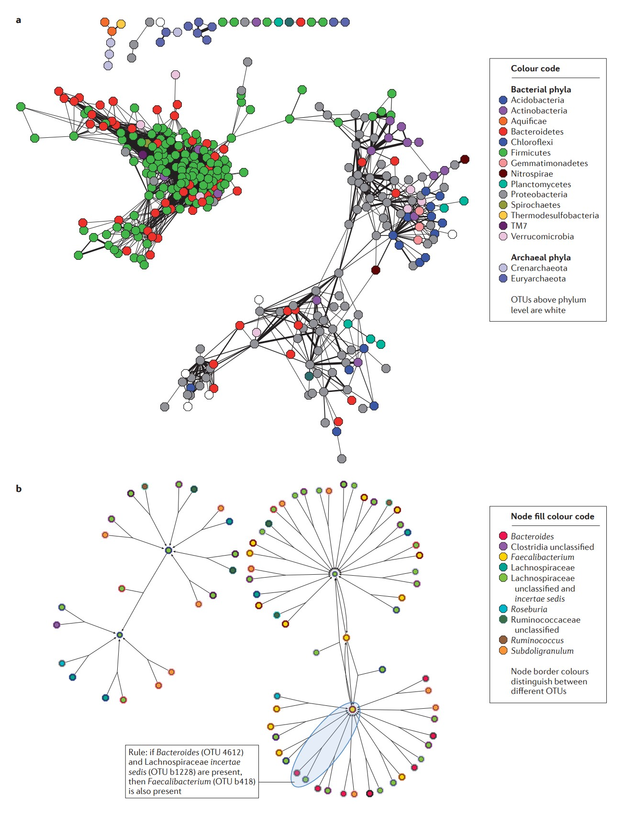
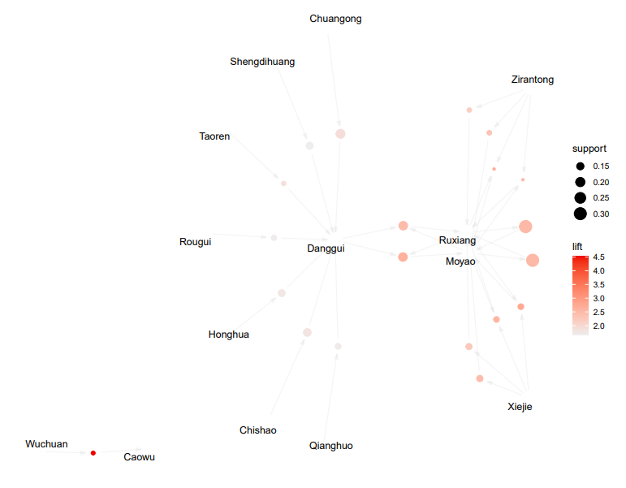

```{r setup, include=FALSE}
knitr::opts_chunk$set(
  collapse = T, echo=T, comment="#>", message=F, warning=F,
	fig.align="center", fig.width=5, fig.height=3, dpi=150)
```


The Bubble plot scripts is referenced from MicrobiomeStatPlot [Inerst Reference below].

If you use this script, please cited 如果你使用本代码，请引用：

**Yong-Xin Liu**, Lei Chen, Tengfei Ma, Xiaofang Li, Maosheng Zheng, Xin Zhou, Liang Chen, Xubo Qian, Jiao Xi, Hongye Lu, Huiluo Cao, Xiaoya Ma, Bian Bian, Pengfan Zhang, Jiqiu Wu, Ren-You Gan, Baolei Jia, Linyang Sun, Zhicheng Ju, Yunyun Gao, **Tao Wen**, **Tong Chen**. 2023. EasyAmplicon: An easy-to-use, open-source, reproducible, and community-based pipeline for amplicon data analysis in microbiome research. **iMeta** 2(1): e83. https://doi.org/10.1002/imt2.83

The online version of this tuturial can be found in https://github.com/YongxinLiu/MicrobiomeStatPlot


**Authors**
First draft(初稿)：Defeng Bai(白德凤)；Proofreading(校对)：Ma Chuang(马闯) and Jiani Xun(荀佳妮)；Text tutorial(文字教程)：Defeng Bai(白德凤)


# Introduction简介

## Association rule mining 关联规则挖掘

参考：https://mp.weixin.qq.com/s/ysC0I3eFSM0rHE9z1YrdpQ

什么是关联规则？
What are association rules?

关联规则是数据挖掘领域的一种常见算法，用于寻找数据集中的有趣关系。这种算法可以帮助我们发现数据集中的频繁项集，然后将这些频繁项集转化为关联规则。这些规则可以帮助我们理解数据集中的特定模式，并用于预测未来的行为或事件。两种主要的关联规则算法包括Apriori算法和FP-growth算法。

Association rules are a common algorithm in the field of data mining that is used to find interesting relationships in a data set. This algorithm can help us discover frequent item sets in a data set and then convert these frequent item sets into association rules. These rules can help us understand specific patterns in a data set and be used to predict future behaviors or events. The two main association rule algorithms include the Apriori algorithm and the FP-growth algorithm.

关联规则的基本思想是发现数据集中的频繁项集，并转换为关联规则，这些规则可以用于预测未来的行为或事件。

The basic idea of association rules is to discover frequent item sets in a data set and convert them into association rules, which can be used to predict future behaviors or events.

寻找关联规则是一个需要大量计算的任务，特别是当数据集很大时。因此，我们通常使用机器学习算法来帮助我们快速有效地寻找关联规则。

Finding association rules is a computationally intensive task, especially when the dataset is large. Therefore, we often use machine learning algorithms to help us find association rules quickly and efficiently.

常用关联规则算法
Common association rule algorithms

1.Apriori算法(Apriori algorithm)
-算法原理(Algorithm principle)
Apriori算法是一种常用的关联规则算法，它通过扫描数据集多次，从而找到频繁项集。Apriori算法使用一种称为“先验”的概念，它假设如果一个项集是频繁的，那么它的所有子集也必须是频繁的。
The Apriori algorithm is a commonly used association rule algorithm that finds frequent item sets by scanning the data set multiple times. The Apriori algorithm uses a concept called "prior", which assumes that if an item set is frequent, then all its subsets must also be frequent.

2.FP-growth算法(FP-growth algorithm)
-算法原理(Algorithm principle)
FP-growth算法是一种基于树的算法，与Apriori算法不同。它使用一种称为“FP树”的数据结构来查找频繁项集。FP-growth算法通过一遍扫描来构建FP树，并使用它来查找频繁项集。相比之下，Apriori算法需要多次扫描数据集，因此效率较低。
The FP-growth algorithm is a tree-based algorithm, which is different from the Apriori algorithm. It uses a data structure called "FP tree" to find frequent itemsets. The FP-growth algorithm builds the FP tree by scanning once and uses it to find frequent itemsets. In contrast, the Apriori algorithm needs to scan the data set multiple times, so it is less efficient.

FP-growth算法在处理大型数据集时表现良好。
FP-growth algorithms perform well when dealing with large datasets.

参考：https://mp.weixin.qq.com/s/Rjuc7OFlljMtEA9-RcRtmA

关联规则分析对于挖掘事件之间的联系具有重要作用，尤其是在海量的数据中。中医用药的辨证论治，个性化治疗所产生的海量的方剂，是医生数十年的经验总结，其中包含着众多尚未发现的潜在用药规律，反映了方药配伍的特殊规律与内在联系，应用关联规则方法，对大量验方进行药对挖掘研究，证实类方中一些已知药对的常用性以及发现未知药对，这对于揭示药对配伍的科学内涵，挖掘和提高中医方药理论，以及拓展临床用药思路，都具有十分重要的意义。

Association rule analysis plays an important role in mining the connections between events, especially in massive data. The vast amount of prescriptions produced by the dialectical treatment of TCM and personalized treatment are the summary of doctors' decades of experience, which contain many potential medication rules that have not yet been discovered, reflecting the special rules and internal connections of prescription-drug compatibility. Applying the association rule method, a large number of prescriptions are mined for drug pairs, confirming the commonness of some known drug pairs in similar prescriptions and discovering unknown drug pairs. This is of great significance for revealing the scientific connotation of drug pair compatibility, mining and improving TCM prescription-drug theory, and expanding clinical medication ideas.

规则关联分析常用算法主要有Apriori、FP-Tree、Eclat和灰色关联法；其中Apriori是关联规则分析中最常用、最经典的挖掘频繁项集的算法，核心思想是通过连接产生候选项及其支持度，然后通过剪枝生成频繁项集，无法处理连续型数值变量，往往分析之前需要对数据进行离散化。

Common algorithms for rule association analysis include Apriori, FP-Tree, Eclat and grey association method; Apriori is the most commonly used and classic algorithm for mining frequent item sets in association rule analysis. The core idea is to generate candidate items and their support through connection, and then generate frequent item sets through pruning. It cannot handle continuous numerical variables, and often needs to discretize data before analysis.

相关概念
Related concepts
项集：项的集合。包含k个项的项集成为k项集，如集合{牛奶、麦片、糖}是一个3项集。
Itemset: A collection of items. An item set containing k items is called a k-item set, such as the set {milk, cereal, sugar} is a 3-item set.
频繁项集：如果项集I的相对支持度满足预定义的最小支持度阈值，则I是频繁项集。
Frequent itemsets: If the relative support of itemset I satisfies a predefined minimum support threshold, then I is a frequent itemset.
支持度（相对支持度）：项集A、B同时发生的概率。
Support (relative support): the probability that item sets A and B occur simultaneously.
置信度：项集A发生，则项集B发生的概率。
Confidence: The probability that item set B will occur if item set A occurs.
最小支持度：用户或专家定义的衡量支持度的一个阈值，表示项集在统计意义上的最低重要性。
Minimum support: A threshold for measuring support defined by users or experts, indicating the minimum statistical importance of an item set.
最小置信度：用户或专家定义的衡量置信度的一个阈值，表示关联规则的最低可靠性。同时满足最小支持度阈值和最小置信度阈值的规则成为强规则。
Minimum confidence: A threshold for measuring confidence defined by users or experts, indicating the minimum reliability of association rules. Rules that meet both the minimum support threshold and the minimum confidence threshold are considered strong rules.


关键字：微生物组数据分析、MicrobiomeStatPlot、关联规则挖掘、R语言可视化

Keywords: Microbiome analysis, MicrobiomeStatPlot, Association rule mining , R visulization


## Association rule mining case 关联规则挖掘案例

这是来来自于布鲁塞尔自由大学的Karoline Faust和Jeroen Raes在2012年发表于Nature Reviews上的论文用到的一个例子。论文题目为：Microbial interactions: from networks 
to models

This is an example from a paper published in Nature Reviews in 2012 by Karoline Faust and Jeroen Raes from the Free University of Brussels. The title of the paper is: Microbial interactions: from networks to models



Figure 3 | Examples for the prediction of pairwise versus complex relationships. Pairwise (a) and complex relationships (b) were inferred from a global microbial operational taxonomic unit (OTU) presence–absence data set22. a | Each node represents an OTU, and each edge represents a significant pairwise association between them. Significant relationships were detected with the hypergeometric distribution (the P values of which were adjusted for multiple testing). The edge thickness increases with significance. b | This network summarizes association rules mined with the a priori algorithm21,109 and filtered with the multiple testing correction suggested in REF. 110. The text box provides an example for such a rule. As the data set is extremely sparse, rules are restricted to positive associations involving up to three OTUs. Each node in network b represents an OTU, whereas each edge corresponds to a rule. In contrast to network a, an edge can connect three OTUs if they are all involved in the same rule. For ease of interpretation, the same OTU (with the same node fill and border colour) may occur  multiple times in network b.

图 3 | 预测成对关系与复杂关系的示例。成对关系 (a) 和复杂关系 (b) 是从全球微生物操作分类单元 (OTU) 存在-不存在数据集 22 推断出来的。a | 每个节点代表一个 OTU，每条边代表它们之间的显著成对关联。使用超几何分布 (其 P 值经过多重检验调整) 检测到显著关系。边的厚度随显著性而增加。b | 该网络总结了使用先验算法 21,109 挖掘的关联规则，并使用 REF. 110 中建议的多重测试校正进行过滤。文本框提供了此类规则的一个示例。由于数据集非常稀疏，规则仅限于涉及最多三个 OTU 的正关联。网络 b 中的每个节点代表一个 OTU，而每条边对应一条规则。与网络 a 相比，如果三个 OTU 都涉及同一条规则，一条边可以连接它们。为了便于解释，相同的 OTU（具有相同的节点填充和边框颜色）可能在网络 b 中出现多次。

**结果**
A complex relationship that is inferred through multiple regression or association rule mining can be represented in the resulting network as an edge that connects more than two nodes in a directed way to point from the independent taxa to the dependent taxon. Networks with such edges are formally known as directed hypergraphs. FIGURE 3a displays a network inferred from a similarity-based approach, in which pairwise relationships are represented by edges connecting two nodes, whereas FIG. 3b gives an example of a directed hypergraph that results from association rule mining in a global microbial presence–absence data set and that visualizes complex relationships with hyper-edges connecting up to three nodes. This said, more developments will be needed to design and to apply targeted multivariate approaches truly to disentangle complex relationships as well as to visualize them.

通过多元回归或关联规则挖掘推断出的复杂关系可以在生成的网络中表示为一条有向边，该边以有向方式连接两个以上的节点，从独立分类单元指向从属分类单元。具有此类边的网络正式称为有向超图。图 3a 显示了从基于相似性的方法推断出的网络，其中成对关系由连接两个节点的边表示，而图 3b 给出了一个有向超图的示例，该超图是从全局微生物存在-不存在数据集中的关联规则挖掘中得出的，它可视化了复杂关系，超边连接多达三个节点。话虽如此，仍需要更多的发展来设计和应用有针对性的多元方法，真正解开复杂关系并将其可视化。


## Packages installation软件包安装

```{r}
# 基于CRAN安装R包，检测没有则安装
p_list = c("readr", "ggplot2", "dplyr", "arules", "arulesViz", "colorspace"
           , "scales", "RColorBrewer")
for(p in p_list){if (!requireNamespace(p)){install.packages(p)}
    library(p, character.only = TRUE, quietly = TRUE, warn.conflicts = FALSE)}

# 加载R包 Load the package
suppressWarnings(suppressMessages(library(readr)))
suppressWarnings(suppressMessages(library(ggplot2)))
suppressWarnings(suppressMessages(library(dplyr)))
suppressWarnings(suppressMessages(library(arules)))
suppressWarnings(suppressMessages(library(arulesViz)))
suppressWarnings(suppressMessages(library(colorspace)))
suppressWarnings(suppressMessages(library(scales)))
suppressWarnings(suppressMessages(library(RColorBrewer)))
```


# Association rule mining 关联规则分析

## Association rule mining using R software 关联规则分析R语言实战

参考：https://mp.weixin.qq.com/s/Rjuc7OFlljMtEA9-RcRtmA

```{r, Association rule mining, fig.show='asis', fig.width=4, fig.height=2.5}
# load data
# 读取文件内容
file_content <- readLines("data/fangji2.csv", encoding = "GB2312")

# 转换编码为UTF-8
# Convert encoding to UTF-8
file_content_utf8 <- iconv(file_content, from = "GB2312", to = "UTF-8")

# 将转换后的内容写入新的文件
# Write the converted content to a new file
writeLines(file_content_utf8, "results/fangji_utf8.csv")

# 读取转换后的文件
# Read the converted file
data <- read.csv("results/fangji_utf8.csv", fileEncoding = "UTF-8")

# 查看数据
mydata <- data

# 创建空的dataframe
# Create an empty dataframe
df <- data.frame()

# 判断数据行数
# Determine the number of data rows
nrow<-nrow(mydata)

# 将每组成改为单个
# Change the prescription composition to multiple single medicines
for(i in 1:nrow){
  d<-data.frame(mydata[[1]][i],strsplit(mydata[[2]][i],";"))
  ID<-d[,1]
  ZY<-d[,2]
  d<-data.frame(ID,ZY)
  df<-rbind (df, d)
}
write.csv(df,"results/df.csv")

# 计算各处方中的药味数
# Calculate the number of medicinal flavors in each prescription
ID_zy <- df %>%group_by(ID)%>%summarise(num=n())
summary(ID_zy)
write.csv(ID_zy,file="results/ID_zy.csv")

# 绘制频数图
# Draw a frequency chart
ZY_id <- df %>%
  group_by(ZY)%>%
  summarise(num = n())

# 统计
# Statistics
summary(ZY_id)

# 降序排列
# Sort in descending order
ZY_id<-ZY_id[order(ZY_id$num,decreasing =T),]

# 绘制前30的数据
# Draw the first 30 data
p1 <- ggplot(ZY_id[1:30,],aes(x = reorder(ZY,-num),y = num)) +
  theme_bw(base_family = "sans",base_size = 10) +
  geom_bar(stat = "identity",fill = "#5ebcc2") +
  labs(x = "Medicine",y = "Frequency") + 
  coord_flip() + 
  geom_text(aes(x = reorder(ZY,-num),y = num+0.1*num,label = num),size = 3)
ggsave('results/ZY_id_top30.pdf', p1, width = 6, height = 4)


# 规则关联分析
# Rule association analysis
mydata <- read.csv("results/df.csv",header=T)
gzgldata<- split(x=mydata$ZY,f=mydata$ID)
sum(sapply(gzgldata,length))

# 过滤掉相同的数据
# Filter out the same data
gzgldata <- lapply(gzgldata,unique)
sum(sapply(gzgldata,length))

# 转换数据形式，用于关联规则分析
# Convert data to association rule analysis
gzgldata <- as(gzgldata, "transactions")

# 绘制频率大于0.1，排名前20
# Draw the top 20 Chinese medicines with a frequency greater than 0.1
# (itemFrequencyPlot(gzgldata, topN=20,support = 0.1,col = "#7a76b7",
#                   xlab = "Medicine",ylab = "Frequency",
#                   main = ""))

# 利用apriori算法挖掘关联规则
# Use apriori algorithm to mine association rules
myrule <- apriori(data = gzgldata,
         parameter = list(support = 0.1,
                          confidence = 0.7,
                          minlen =2))

# 将规则按照提升度lift排序
# Sort the rules by lift
sortlift <- arules::sort(myrule,decreasing = TRUE,by = "lift")

# 显示排名前20的规则
# Display the top 20 rules
inspect(sortlift[1:20])

# 规则校验（类似测试集）
# Rule verification (similar to test set)
qualityMeasures<-interestMeasure(myrule,c("coverage","fishersExactTest",
                                          "conviction","chiSquared"), 
                                 transactions=gzgldata)

# 将结果保存为数据表的形式并导出
# Save the results as a data table and export
ruledf <- as(myrule,"data.frame")
write.csv(ruledf,file="results/ruledf.csv")

# 排名前20规则可视化为网络图的结构
# Visualize the top 20 rules as a network graph structure
pdf(file = "results/rule_network_graph.pdf", width = 10, height = 8)
plot(sortlift[1:20], method = "graph")
dev.off()

# 可视化所有的规则
# Visualize all rules
p3 <- plot(sortlift, method="graph")


# 所有规则的气泡图1
# Bubble chart of all rules 1
p4 <- plot(myrule, method="scatterplot",
     control=list(jitter=2, col = rev(brewer.pal(3, "Blues"))), 
     shading = "lift")

# 所有规则的气泡图2
# Bubble chart of all rules 2
p5 <- plot(myrule, 
     control=list(jitter=2, col = rev(brewer.pal(3, "Blues"))), 
     shading = "lift",method = "grouped")

# 将规则可视化为grouped matrix的形式
# Visualize the rules as a grouped matrix
p6 <- plot(sortlift[1:20], method = "grouped matrix")
```





If used this script, please cited:
使用此脚本，请引用下文：

**Yong-Xin Liu**, Lei Chen, Tengfei Ma, Xiaofang Li, Maosheng Zheng, Xin Zhou, Liang Chen, Xubo Qian, Jiao Xi, Hongye Lu, Huiluo Cao, Xiaoya Ma, Bian Bian, Pengfan Zhang, Jiqiu Wu, Ren-You Gan, Baolei Jia, Linyang Sun, Zhicheng Ju, Yunyun Gao, **Tao Wen**, **Tong Chen**. 2023. EasyAmplicon: An easy-to-use, open-source, reproducible, and community-based pipeline for amplicon data analysis in microbiome research. **iMeta** 2: e83. https://doi.org/10.1002/imt2.83

Copyright 2016-2024 Defeng Bai <baidefeng@caas.cn>, Chuang Ma <22720765@stu.ahau.edu.cn>, Jiani Xun <15231572937@163.com>, Yong-Xin Liu <liuyongxin@caas.cn>
