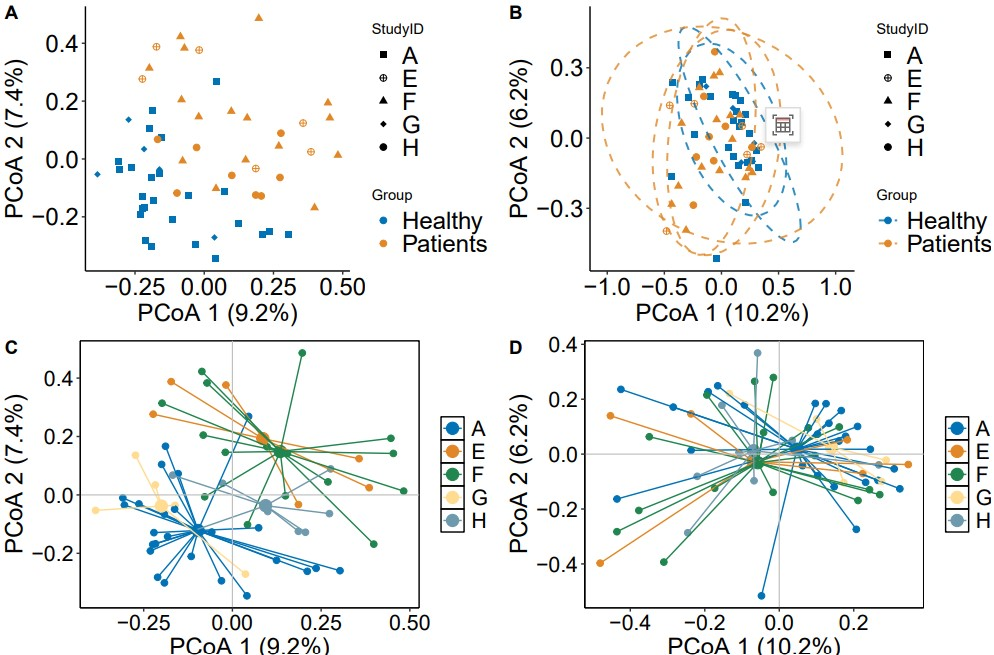

```{r setup, include=FALSE}
knitr::opts_chunk$set(
  collapse = T, echo=T, comment="#>", message=F, warning=F,
	fig.align="center", fig.width=5, fig.height=3, dpi=150)
```


The Batch effects correction scripts is referenced from MicrobiomeStatPlot [Inerst Reference below].


If you use this script, please cited 如果你使用本代码，请引用：

**Yong-Xin Liu**, Lei Chen, Tengfei Ma, Xiaofang Li, Maosheng Zheng, Xin Zhou, Liang Chen, Xubo Qian, Jiao Xi, Hongye Lu, Huiluo Cao, Xiaoya Ma, Bian Bian, Pengfan Zhang, Jiqiu Wu, Ren-You Gan, Baolei Jia, Linyang Sun, Zhicheng Ju, Yunyun Gao, **Tao Wen**, **Tong Chen**. 2023. EasyAmplicon: An easy-to-use, open-source, reproducible, and community-based pipeline for amplicon data analysis in microbiome research. **iMeta** 2(1): e83. https://doi.org/10.1002/imt2.83

The online version of this tuturial can be found in https://github.com/baidefeng/MicrobiomeStatPlot/tree/master/3.Visualization_and_interpretation


**Authors**
First draft(初稿)：Defeng Bai(白德凤)；Proofreading(校对)：Ma Chuang(马闯) and Xun Jiani(荀佳妮)；Text tutorial(文字教程)：Defeng Bai(白德凤)


# Introduction简介

批次效应的产生和去除
The generation and removal of batch effects

批次效应(Batch effect)往往是不同时间、不同操作者、不同试剂、不同仪器导致的实验误差，与研究中的生物或科学变量无关。其可能扭曲生物学差异。

Batch effects are often experimental errors caused by different times, operators, reagents, and instruments, and are not related to biological or scientific variables in the study. It may distort biological differences.

批次效应的特点包括：1.数据不一致性：批次效应导致同样的生物样本在不同批次中产生不一致的测量结果。2.掩盖生物学信号：批次效应可能掩盖了真实的生物学差异。3.增加噪声：批次效应增加了数据的噪声，降低了实验的灵敏度和准确性。4.降低可重复性：如果批次效应没有被适当地控制和校正，那么实验的可重复性和可比性将会降低。

The characteristics of batch effects include: 1. Data inconsistency: Batch effects result in inconsistent measurement results for the same biological sample in different batches. 2. Masking biological signals: Batch effects may mask true biological differences. 3. Increase noise: The batch effect increases the noise in the data, reducing the sensitivity and accuracy of the experiment. 4. Reduce repeatability: If batch effects are not properly controlled and corrected, the reproducibility and comparability of the experiment will be reduced.

目前已经开发出一些方法针对不同类型的测序数据进行批次效应去除。相关的软件或分析方法包括MMUPHin, Limma, emoveBatchEffect, ComBat, Surrogate Variable Analysis和PLASDA-batch等，这里介绍利用R语言中的MMUPHin软件包进行批次效应的观察和去除。

Currently, some methods have been developed to remove batch effects on different types of sequencing data. Related software or analysis methods include MMUPHin, Limma, removeBatchEffect, ComBat, Surrogate Variable Analysis, and PLASDA batch. Here, we introduce the use of the MMUPHin software package in R language for observing and removing batch effects.


关键字：微生物组数据分析、MicrobiomeStatPlot、批次效应矫正、R语言可视化

Keywords: Microbiome analysis, MicrobiomeStatPlot, Batch effects correction, R visulization


## Packages installation软件包安装

```{r}
# 基于CRAN安装R包，检测没有则安装
p_list = c("magrittr","dplyr","ggplot2","vegan","ggpubr","ggsci","patchwork")
for(p in p_list){if (!requireNamespace(p)){install.packages(p)}
    library(p, character.only = TRUE, quietly = TRUE, warn.conflicts = FALSE)}

# 基于github安装
library(devtools)
if(!requireNamespace("MMUPHin", quietly = TRUE))
  install_github("biobakery/mmuphin@master")

# 加载R包 Load the package
suppressWarnings(suppressMessages(library(MMUPHin)))
suppressWarnings(suppressMessages(library(magrittr)))
suppressWarnings(suppressMessages(library(dplyr)))
suppressWarnings(suppressMessages(library(ggplot2)))
suppressWarnings(suppressMessages(library(vegan)))
suppressWarnings(suppressMessages(library(ggpubr)))
suppressWarnings(suppressMessages(library(ggsci)))
suppressWarnings(suppressMessages(library(patchwork)))
```


# Batch effects correction

## Remove batch effects去除批次效应

```{r Remove batch effects, fig.show='asis', fig.width=4, fig.height=2.5}
# Load data
# 导入metadata数据
meta.all <- read.csv(file = 'data/group.csv',stringsAsFactors = FALSE, header = TRUE, row.names = 1,
                     check.name = FALSE)
meta.all$StudyID <- factor(meta.all$StudyID)

# 导入细菌物种相对丰度数据
# Import relative abundance data of bacterial species
feat.abu <- read.table(file = "data/species_data.txt", sep = "\t", header = T, check.names = FALSE)

# sum of Species
# 计算每个Species微生物相对丰度之和，避免有重复Species统计
feat.abu<-aggregate(.~ Species,data=feat.abu,sum)
rownames(feat.abu) = feat.abu$Species
feat.abu = feat.abu[, -1]

feat.abu <- feat.abu[,rownames(meta.all)]

feat.abu[is.na(feat.abu)] <- 0
feat.abu <- feat.abu/100

# Zero-inflated empirical Bayes adjustment of batch effect in compositional feature abundance data
# 成分特征丰度数据中批次效应的零膨胀经验贝叶斯调整
fit_adjust_batch <- adjust_batch(feature_abd = feat.abu,
                                 batch = "StudyID",
                                 covariates = c("Gender", "Age"),
                                 data = meta.all,
                                 control = list(verbose = FALSE))

npc_abd_adj <- fit_adjust_batch$feature_abd_adj
npc_abd_adj <- npc_abd_adj*100
write.csv(npc_abd_adj, 'results/NPC_Bacteria_Species_ra_abd_adj_gener_age01.csv')
```


## Batch Effect plot批次效应图示


```{r Remove batch effects2, fig.show='asis', fig.width=4, fig.height=2.5}
# 计算Bray-Curtis距离矩阵
# Calculate Bray-CUrtis distance matrix
D_before <- vegdist(t(feat.abu))
D_after <- vegdist(t(npc_abd_adj))

# 置换多元回归方差分析（PERMANOVA）
set.seed(42)
fit_adonis_before <- adonis2(D_before ~ StudyID, data = meta.all, permutations = 999, method="bray")
fit_adonis_after <- adonis2(D_after ~ StudyID, data = meta.all, permutations = 999, method="bray")

# 计算PCoA并提取坐标和特征，k 设置为 2 用于绘制二维PCoA图
# Calculate PCoA and extract coordinates and features, k is set to 2 for drawing a two-dimensional PCoA graph
dune_pcoa_before <- cmdscale(D_before, k = 2, eig = TRUE, add = TRUE)
dune_pcoa_after <- cmdscale(D_after, k = 2, eig = TRUE, add = TRUE)

# 计算特征的解释比例
# Calculate the explanation ratio of the feature
eig_percent_before <- round(dune_pcoa_before$eig / sum(dune_pcoa_before$eig) * 100, 1)
eig_percent_after <- round(dune_pcoa_after$eig / sum(dune_pcoa_after$eig) * 100, 1)

# 转换为数据框
# Convert to data frame
dune_pcoa_points_before <- as.data.frame(dune_pcoa_before$points)
dune_pcoa_points_after <- as.data.frame(dune_pcoa_after$points)
colnames(dune_pcoa_points_before) <- paste0("PCoA", 1:2)
colnames(dune_pcoa_points_after) <- paste0("PCoA", 1:2)

# 将坐标与元数据结合
# Combine coordinates with metadata
pcoa_result_before <- cbind(dune_pcoa_points_before, meta.all)
pcoa_result_after <- cbind(dune_pcoa_points_after, meta.all)

# 定义8种颜色的调色板
# Define colors
custom_colors <- c("#0072B5", "#E18727", "#20854E", "#FFDC91", "#6F99AD", "#B24745", "#374E55", "#8B4513")

# 绘制批次矫正前的PCoA图
# 绘制批次矫正前的PCoA图
p1 <- ggplot(pcoa_result_before, aes(x=PCoA1, y=PCoA2, color=Group, shape=StudyID)) +
  geom_point(size=2) +
  scale_shape_manual(values=c(15, 10, 17, 18, 19, 8, 25, 3)) +
  scale_color_manual(values=custom_colors) +
  labs(x=paste("PCoA 1 (", eig_percent_before[1], "%)", sep=""),
       y=paste("PCoA 2 (", eig_percent_before[2], "%)", sep="")) +
  theme_classic()+
  theme(axis.title=element_text(size=18, colour="black"),
        axis.text=element_text(size=18, colour="black"),
        legend.text=element_text(size=18))

# 绘制批次矫正后的PCoA图
# Draw the batch-corrected PCoA graph
p2 <- ggplot(pcoa_result_after, aes(x=PCoA1, y=PCoA2, color=Group, shape=StudyID)) +
  geom_point(size=2) +
  scale_shape_manual(values=c(15, 10, 17, 18, 19, 8, 25, 3)) +
  scale_color_manual(values=custom_colors) +
  labs(x=paste("PCoA 1 (", eig_percent_after[1], "%)", sep=""),
       y=paste("PCoA 2 (", eig_percent_after[2], "%)", sep="")) +
  theme_classic() +
  stat_ellipse(level=0.95, linetype=2, size=0.7, aes(color=Group), alpha=0.8)+
  theme(axis.title=element_text(size=18, colour="black"),
        axis.text=element_text(size=18, colour="black"),
        legend.text=element_text(size=18))

# 批次矫正前的PCoA图 (plot1)
# PCoA plot before batch correction (plot1)
p3 <- ggscatter(pcoa_result_before, x="PCoA1", y="PCoA2", color="StudyID",
                   mean.point=TRUE, star.plot=TRUE,
                   ggtheme=theme_minimal()) +
  labs(x=paste("PCoA 1 (", eig_percent_before[1], "%)", sep=""),
       y=paste("PCoA 2 (", eig_percent_before[2], "%)", sep="")) +
  theme_classic() +
  scale_color_manual(values=custom_colors) +
  geom_vline(xintercept=0, color='gray', size=0.4) + 
  geom_hline(yintercept=0, color='gray', size=0.4) +
  theme(panel.grid=element_line(color='black', linetype=2, size=0.1), 
        panel.background=element_rect(color='black', fill='transparent'), 
        legend.title=element_blank()) +
  theme(axis.title=element_text(size=7, colour="black"),
        axis.text=element_text(size=5, colour="black"),
        legend.text=element_text(size=5))

# 批次矫正后的PCoA图 (plot2)
# PCoA plot after batch correction (plot2)
p4 <- ggscatter(pcoa_result_after, x="PCoA1", y="PCoA2", color="StudyID",
                   mean.point=TRUE, star.plot=TRUE,
                   ggtheme=theme_minimal()) +
  labs(x=paste("PCoA 1 (", eig_percent_after[1], "%)", sep=""),
       y=paste("PCoA 2 (", eig_percent_after[2], "%)", sep="")) +
  theme_classic() +
  scale_color_manual(values=custom_colors) +
  geom_vline(xintercept=0, color='gray', size=0.4) + 
  geom_hline(yintercept=0, color='gray', size=0.4) +
  theme(panel.grid=element_line(color='black', linetype=2, size=0.1), 
        panel.background=element_rect(color='black', fill='transparent'), 
        legend.title=element_blank()) +
  theme(axis.title=element_text(size=7, colour="black"),
        axis.text=element_text(size=5, colour="black"),
        legend.text=element_text(size=5))

# 组合图形
# Combined plots
library(patchwork)
p_all <- p1 + p2
p_all2 <- p3 + p4

# 保存组合后的图形
# Save plots
ggsave(p_all, file="results/PCoA_comparison01.pdf", width=289, height=150, unit='mm')
#p_all

ggsave(p_all2, file="results/PCoA_comparison02.pdf", width=289, height=100, unit='mm')
#p_all2
```


# Combo plots排版

Combo plots to published-ready figure

组合多个子图为发表格式

```{r Remove batch effects3, fig.show='asis', fig.width=4, fig.height=2.5}
library(cowplot)
width = 89
height = 59
p0 = plot_grid(p1 ,p2, p3, p4, labels = c("A", "B", "C", "D"), ncol = 2)
ggsave("results/batch_effects_plot01.pdf", p0, width = width * 3, height = height * 3, units = "mm")
```





If used this script, please cited:
使用此脚本，请引用下文：

**Yong-Xin Liu**, Lei Chen, Tengfei Ma, Xiaofang Li, Maosheng Zheng, Xin Zhou, Liang Chen, Xubo Qian, Jiao Xi, Hongye Lu, Huiluo Cao, Xiaoya Ma, Bian Bian, Pengfan Zhang, Jiqiu Wu, Ren-You Gan, Baolei Jia, Linyang Sun, Zhicheng Ju, Yunyun Gao, **Tao Wen**, **Tong Chen**. 2023. EasyAmplicon: An easy-to-use, open-source, reproducible, and community-based pipeline for amplicon data analysis in microbiome research. **iMeta** 2: e83. https://doi.org/10.1002/imt2.83

Copyright 2016-2024 Defeng Bai <baidefeng@caas.cn>, Chuang Ma <22720765@stu.ahau.edu.cn>, Jiani Xun <15231572937@163.com>, Yong-Xin Liu <liuyongxin@caas.cn>


