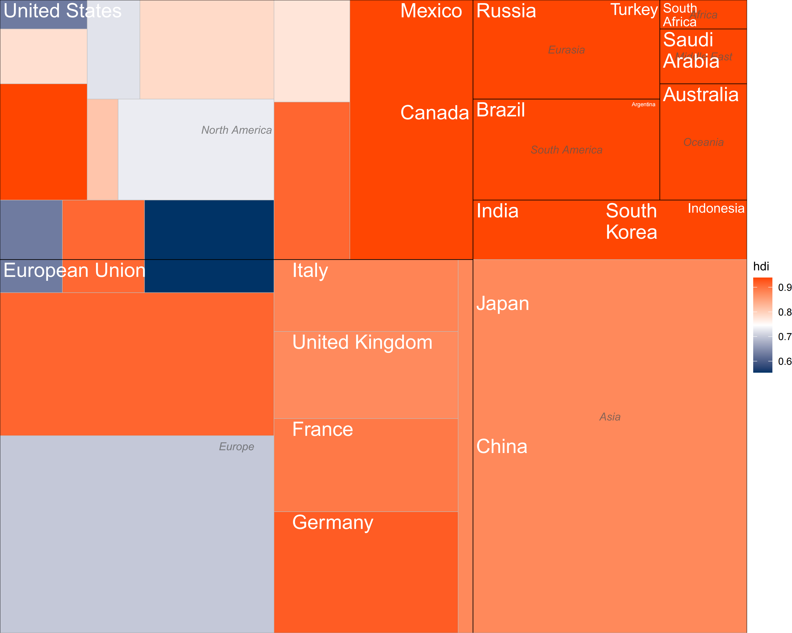

```{r setup, include=FALSE}
knitr::opts_chunk$set(
  collapse = T, echo=T, comment="#>", message=F, warning=F,
	fig.align="center", fig.width=5, fig.height=3, dpi=150)
```


The Block treemap scripts is referenced from MicrobiomeStatPlot [Inerst Reference below].

If you use this script, please cited 如果你使用本代码，请引用：

**Yong-Xin Liu**, Lei Chen, Tengfei Ma, Xiaofang Li, Maosheng Zheng, Xin Zhou, Liang Chen, Xubo Qian, Jiao Xi, Hongye Lu, Huiluo Cao, Xiaoya Ma, Bian Bian, Pengfan Zhang, Jiqiu Wu, Ren-You Gan, Baolei Jia, Linyang Sun, Zhicheng Ju, Yunyun Gao, **Tao Wen**, **Tong Chen**. 2023. EasyAmplicon: An easy-to-use, open-source, reproducible, and community-based pipeline for amplicon data analysis in microbiome research. **iMeta** 2(1): e83. https://doi.org/10.1002/imt2.83

**Yunyun Gao**, Danyi Li, **Yong-Xin Liu**, Microbiome research outlook: past, present, and future, Protein & Cell, 2023, pwad031, https://doi.org/10.1093/procel/pwad031. 

The online version of this tuturial can be found in https://github.com/YongxinLiu/MicrobiomeStatPlot


**Authors**
First draft(初稿)：Defeng Bai(白德凤)；Proofreading(校对)：Ma Chuang(马闯) and Jiani Xun(荀佳妮)；Text tutorial(文字教程)：Defeng Bai(白德凤)


# Introduction简介

参考：https://mp.weixin.qq.com/s/cLvQ-fr5l5qDJFoVPZzxAw

矩形树图由一组矩形组成，这些矩形代表数据中的不同类别，其大小由与各自类别相关的数值定义。例如，一幅树状地图可以显示地球上的大陆，根据它们的人口大小。为了进行更深入的分析，树图可以包括嵌套的矩形，即类别中的类别。在我们的示例中，在每个大陆矩形中，新的矩形可以代表国家及其人口。树状图（treemap）将分层数据显示为一组嵌套矩形。每组由一个矩形表示，该矩形的面积与其数值值成正比。树状图的主要优点之一是，它允许用一张简明的图解释大量的数据。它非常适合显示部分到整体的关系，并突出显示数据中的层次结构。当定义矩形大小的变量变化不大时，不要使用树图。

A treemap consists of a set of rectangles that represent different categories in the data, with sizes defined by the numerical values associated with the respective categories. For example, a treemap could show the continents on Earth, according to the size of their population. For a more in-depth analysis, a treemap can include nested rectangles, i.e. categories within categories. In our example, within each continent rectangle, new rectangles could represent countries and their populations. A treemap displays hierarchical data as a set of nested rectangles. Each group is represented by a rectangle whose area is proportional to its numerical value. One of the main advantages of a treemap is that it allows a large amount of data to be explained with a single concise diagram. It is well suited to showing part-to-whole relationships and highlighting hierarchical structures in the data. Do not use a treemap when the variable defining the size of the rectangles does not vary much.


关键字：微生物组数据分析、MicrobiomeStatPlot、矩形树图、R语言可视化

Keywords: Microbiome analysis, MicrobiomeStatPlot, Block Treemap, R visulization


## Block Treemap case矩形树图案例

这是D. Sean Froese团队2023年发表于Nature Metabolism上的一篇论文用到的图。论文题目为：Integrated multi-omics reveals anapleroticrewiring in methylmalonyl-CoA mutasedeficiency. https://doi.org/10.1038/s42255-022-00720-8

This is a figure used in a paper published by D. Sean Froese's team in Nature Metabolism in 2023. The title of the paper is: Integrated multi-omics reveals anaplerotic rewiring in methylmalonyl-CoA mutase deficiency. https://doi.org/10.1038/s42255-022-00720-8


Fig. 1i Proportions of affected genes identified in the whole cohort.
图 1i 整个队列中发现的受影响基因的比例。


**结果**

In summary, we found a diagnosis for 177 out of 210 (84%) affected individuals (Fig. 1i), including 150 with deficiency of MMUT and 19 with damaging variants in ACSF3, accounting  for the largest cohort of ACSF3 deficiency.

综上所述，我们发现 210 名（84%）受影响个体中有 177 名得到诊断（图 1i），其中 150 名患有 MMUT 缺陷，19 名患有 ACSF3 损伤性变异，占 ACSF3 缺陷的最大群体。


## Packages installation软件包安装

```{r}
# 基于CRAN安装R包，检测没有则安装
p_list = c("treemapify", "ggplot2")
for(p in p_list){if (!requireNamespace(p)){install.packages(p)}
    library(p, character.only = TRUE, quietly = TRUE, warn.conflicts = FALSE)}

# 加载R包 Load the package
suppressWarnings(suppressMessages(library(treemapify)))
suppressWarnings(suppressMessages(library(ggplot2)))
```


# Block Treemap

## Block Treemap R Language Practice 矩形树图R语言实战

实战一
Practice1

参考：https://mp.weixin.qq.com/s/1sfaLZ4s50QHVid_HX8L0A
https://mp.weixin.qq.com/s/nf6KNedDIWj1uRWyaPz4pw

```{r, Block Treemap, fig.show='asis', fig.width=4, fig.height=2.5}
# 使用treemapify自带的数据G20绘图Use treemapify package data G20
# 绘制矩形树图，优化色彩和整体布局
# Draw a Block Treemap, optimize the color and overall layout
p1 <- ggplot(G20, aes(area = gdp_mil_usd, fill = hdi)) +
  geom_treemap(start = "bottomright") +  # 改变起点，确保图形均匀分布
  scale_fill_gradientn(colours = c("#003366", "#FFFFFF", "#FF4500")) +  # 使用更具对比度的颜色
  theme_void()  # 移除背景和网格，保证图形简洁

# 添加标签Add labels
p2 <- ggplot(G20, aes(area = gdp_mil_usd, fill = hdi, label = country)) +
  geom_treemap(start = "bottomright") +
  geom_treemap_text(fontface = "bold", colour = "#333333",  
                    size = 14, place = "centre", 
                    padding.x = grid::unit(2, "mm"), 
                    padding.y = grid::unit(1.5, "mm")) + 
  scale_fill_gradientn(colours = c("#003366", "#FFFFFF", "#FF4500")) +  
  theme_minimal()  # 使用简洁的主题样式

# 优化分组显示，添加更多区分度
# Optimize group display and add more differentiation
p3 <- ggplot(G20, aes(area = gdp_mil_usd, fill = hdi, 
                label = country, subgroup = region)) +
  geom_treemap(start = "bottomright") +
  geom_treemap_subgroup_border(colour = "#000000", size = 0.7) +
  geom_treemap_subgroup_text(place = "centre", colour = "#555555", 
                             fontface = "italic", size = 10, 
                             alpha = 0.7) +  # 标签半透明，避免喧宾夺主
  geom_treemap_text(colour = "#FFFFFF", place = "topleft", reflow = TRUE) +  
  scale_fill_gradientn(colours = c("#003366", "#FFFFFF", "#FF4500")) + 
  theme_void() 
# 保存矩形树状图
# Save plot
ggsave("results/optimized_treemap.pdf", p3, width = 10, height = 8, device = "pdf")
```





实战二
Practice2

此处参考Yunyun Gao, Danyi Li, Yong-Xin Liu, Microbiome research outlook: past, present, and future, Protein & Cell, 2023, pwad031, https://doi.org/10.1093/procel/pwad031. 绘制矩形树图用到数据和代码来自于该文献。


```{r, Block Treemap2, fig.show='asis', fig.width=4, fig.height=2.5}
# Load data
# 载入数据
mydata<- read.table("data/Figure1BTreeMap.txt", header = T, sep='\t')

# Define the desired order of legends
# 定义所需的图例顺序
legend_order <- c("North America", "Europe", "Asia", "Oceania", "South America", "Africa", "Others")

# Plotting TreeMap Graph
# 绘制 TreeMap 图
p4 <- ggplot(mydata, aes(area = NumberOfPublication, fill = Regions,
                 label = paste0(Places, "\n", NumberOfPublication), subgroup = Regions)) +
  geom_treemap(layout = "squarified") +
  geom_treemap_text(place = "centre", size = 12, family = "sans", min.size = 12, alpha = 0.5, colour = 'black') +
  geom_treemap_subgroup_border(colour = "white", size = 3)+
  scale_fill_manual(values = c("#8dd3c7", "#ffffb3", "#fb8072", "#bebada", "#80b1d3", "#fdb462", "#b3de69"),
                    breaks = legend_order) +
  labs(fill = "Regions") +
  theme(legend.position = "bottom",
        legend.text = element_text(size = 16),
        legend.title = element_text(size = 16),
        legend.key.height = unit(0.5, "cm"),
        legend.key.width = unit(0.5, "cm"),
        legend.direction = "horizontal",
        legend.box = "horizontal",
        legend.box.just = "center",
        legend.box.spacing = unit(0.2, "cm"),
        legend.margin = margin(t = 0, r = 0, b = 0, l = 0))
# 保存矩形树状图
# Save plot
ggsave("results/optimized_treemap2.pdf", p4, width = 10, height = 8, device = "pdf")
```


If used this script, please cited:
使用此脚本，请引用下文：

**Yong-Xin Liu**, Lei Chen, Tengfei Ma, Xiaofang Li, Maosheng Zheng, Xin Zhou, Liang Chen, Xubo Qian, Jiao Xi, Hongye Lu, Huiluo Cao, Xiaoya Ma, Bian Bian, Pengfan Zhang, Jiqiu Wu, Ren-You Gan, Baolei Jia, Linyang Sun, Zhicheng Ju, Yunyun Gao, **Tao Wen**, **Tong Chen**. 2023. EasyAmplicon: An easy-to-use, open-source, reproducible, and community-based pipeline for amplicon data analysis in microbiome research. **iMeta** 2: e83. https://doi.org/10.1002/imt2.83

**Yunyun Gao**, Danyi Li, **Yong-Xin Liu**, Microbiome research outlook: past, present, and future, Protein & Cell, 2023, pwad031, https://doi.org/10.1093/procel/pwad031. 

Copyright 2016-2024 Defeng Bai <baidefeng@caas.cn>, Chuang Ma <22720765@stu.ahau.edu.cn>, Jiani Xun <15231572937@163.com>, Yong-Xin Liu <liuyongxin@caas.cn>
