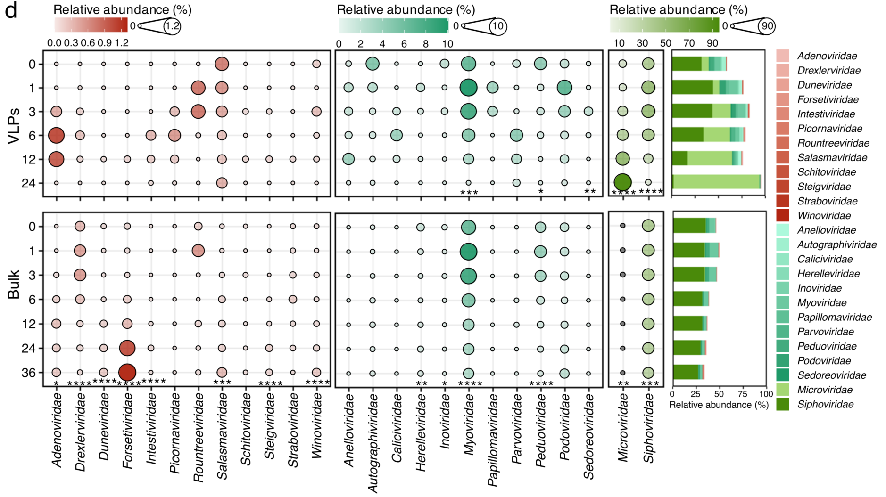
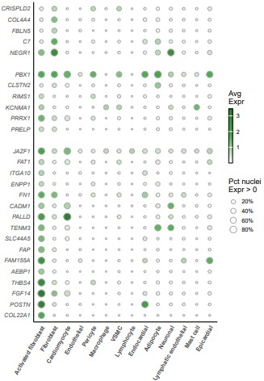
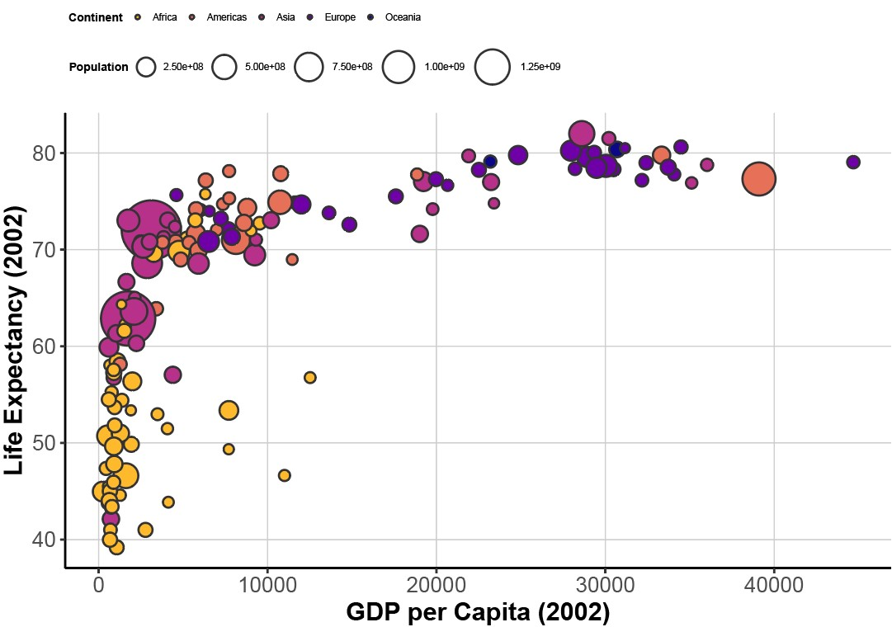
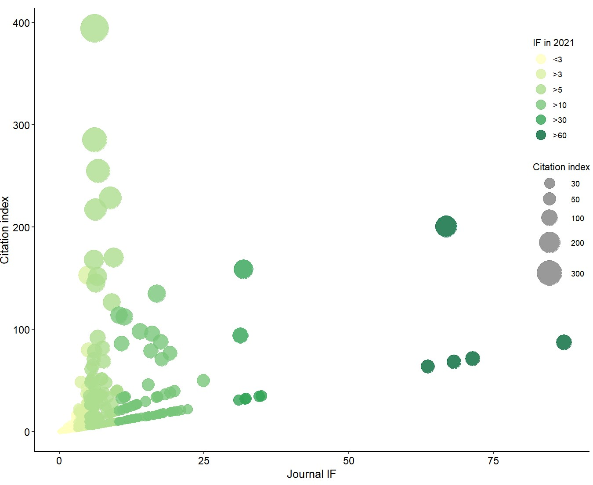
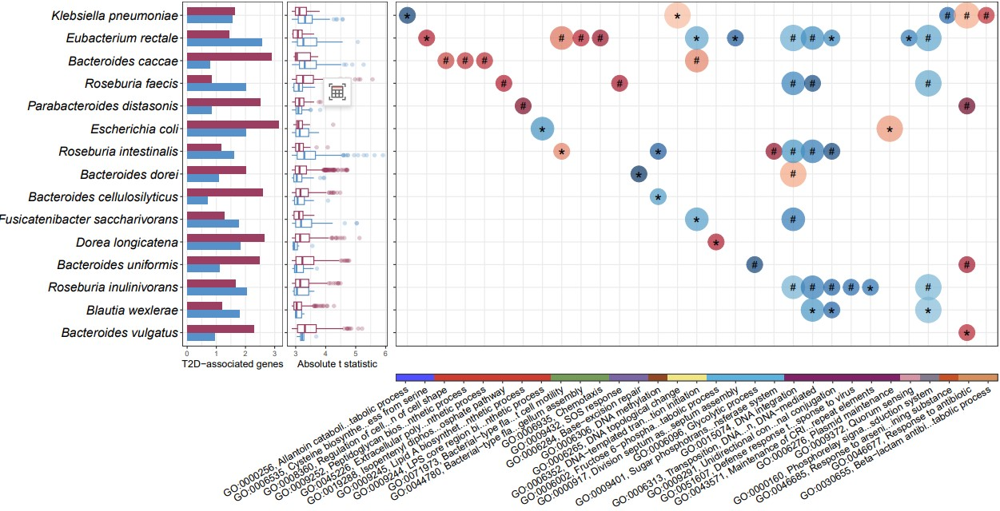

```{r setup, include=FALSE}
knitr::opts_chunk$set(
  collapse = T, echo=T, comment="#>", message=F, warning=F,
	fig.align="center", fig.width=5, fig.height=3, dpi=150)
```


The Bubble plot scripts is referenced from MicrobiomeStatPlot [Inerst Reference below].

If you use this script, please cited 如果你使用本代码，请引用：

**Yong-Xin Liu**, Lei Chen, Tengfei Ma, Xiaofang Li, Maosheng Zheng, Xin Zhou, Liang Chen, Xubo Qian, Jiao Xi, Hongye Lu, Huiluo Cao, Xiaoya Ma, Bian Bian, Pengfan Zhang, Jiqiu Wu, Ren-You Gan, Baolei Jia, Linyang Sun, Zhicheng Ju, Yunyun Gao, **Tao Wen**, **Tong Chen**. 2023. EasyAmplicon: An easy-to-use, open-source, reproducible, and community-based pipeline for amplicon data analysis in microbiome research. **iMeta** 2(1): e83. https://doi.org/10.1002/imt2.83

**Yunyun Gao**, Danyi Li, **Yong-Xin Liu**, Microbiome research outlook: past, present, and future, Protein & Cell, 2023, pwad031, https://doi.org/10.1093/procel/pwad031. 

The online version of this tuturial can be found in https://github.com/YongxinLiu/MicrobiomeStatPlot


**Authors**
First draft(初稿)：Defeng Bai(白德凤)；Proofreading(校对)：Ma Chuang(马闯) and Jiani Xun(荀佳妮)；Text tutorial(文字教程)：Defeng Bai(白德凤)


# Introduction简介

什么是气泡图？
What is a bubble plot?

气泡图（Bubble plot）用于呈现三维数据的关系。这种图通常使用气泡的位置、大小和颜色来表示变量之间的关系，使得观察者能够直观的理解复杂数据集。其基本组成由X, Y坐标的位置，气泡的大小和气泡的颜色构成。气泡图的基础是二维平面上的坐标系，其中每个气泡由其在X轴和Y轴上的位置决定。这些坐标可以表示两个变量或维度，例如时间、空间或不同的类别。每个气泡的大小代表了第三个维度的数值，通常气泡越大表示的数值越大。这个大小维度可以表示各种新信息，比如数据点的频率、重要性等。颜色是气泡图中的第三个可用于信息的维度。通过对气泡着色，可以进一步传达关于数据的分类、群组或其他属性的信息。颜色也可以用于强调特定的趋势或模式。

A bubble plot is used to present the relationships of three-dimensional data. This type of graph typically uses the position, size, and color of bubbles to represent the relationships between variables, allowing observers to intuitively understand complex datasets. Its basic composition consists of the position of the X and Y coordinates, the size of the bubbles, and the color of the bubbles. The basis of a bubble chart is a coordinate system on a two-dimensional plane, where each bubble is determined by its position on the X and Y axes. These coordinates can represent two variables or dimensions, such as time, space, or different categories. The size of each bubble represents the numerical value of the third dimension, and usually the larger the bubble, the greater the numerical value. This size dimension can represent various new information, such as the frequency and importance of data points. Color is the third dimension in a bubble chart that can be used for information. By coloring bubbles, information about the classification, grouping, or other attributes of data can be further conveyed. Colors can also be used to emphasize specific trends or patterns.


关键字：微生物组数据分析、MicrobiomeStatPlot、气泡图、R语言可视化

Keywords: Microbiome analysis, MicrobiomeStatPlot, Bubble plot, R visulization


## Bubble plot example气泡图应用案例

这是Jakob Stokholm课题组2023年发表于Nature Medicine上的文章，第一作者为Cristina Leal Rodríguez，题目为：The infant gut virome is associated with preschool asthma risk independently of bacteria. https://doi.org/10.1038/s41591-023-02685-x.

This is an article published by the Jakob Stokholm research group in Nature Medicine in 2023. The first author is Cristina Leal Rodr í guez, and the title is: The incident gut virus is associated with pre-school astroma risk independently of bacteria


Fig. 2 d Dynamics of the relative abundance of viral families in the first two (VLPs, top) or three (bulk, bottom) years of life. Only the viral families with a prevalence >1% in VLPs-enrichedmetagenomes are plotted. For better visualization of the changes of each viral family, viral families are stratified into three groups basedon themean relative abundanceofVLPs-enrichedmetagenomes at each time point (i.e., maximal mean relative abundance ≤1% (left, n = 12, red), maximal mean relative abundance >1% and <40% (middle, n = 11, light green), maximal mean relative abundance ≥40% (right, n = 2, dark green)). The bar plot shows the proportion of relative abundance of all 25 viral families, which are indicated in the legend on the right side. The P values were obtained with linear mixed modeling with “study” as random factor. **** P<0.0001, *** P<0.001, ** P<0.01, * P<0.05.

图2 d生命前两年（VLP，顶部）或三年（体积，底部）病毒家族相对丰度的动态。仅绘制了VLP富集型基因组中流行率>1%的病毒家族。为了更好地显示每个病毒家族的变化，根据每个时间点VLP富集物的平均相对丰度，将病毒家族分为三组（即最大平均相对丰度≤1%（左，n=12，红色），最大平均相对丰富度>1%和<40%（中，n=11，浅绿色），最大相对丰度≥40%（右，n=2，深绿色））。条形图显示了所有25个病毒家族的相对丰度比例，如右侧图例所示。P值是通过以“研究”为随机因素的线性混合模型获得的。***P<0.0001，***P<0.001，**P<0.01，*P<0.05。


**结果**：
Out of 42 viral families with a prevalence >1%, 25 families accounted for >99% ofviral abundance in 1608 VLPs-enriched metagenomes. Of these, five families with significant changes and only Microviridae increased in abundance as infants aged (Fig. 2d). When examining these 25 viral families in bulk metagenomes, 21 families were detected and accounted for >99% of viral abundance in 5990 bulk metagenomes. Of these, 14 families had a statistically significant difference (P< 0.05) in their abundance as infants aged, with half of the families increased, such as Adenoviridae, Duneviridae,and Forsetiviridae; and the other half decreased, such as Siphoviridae, Myoviridae, Microviridae,and Peduoviridae. Furthermore, the mean relative abundance ofForsetiviridae was sparse with <0.3% in the first 12 months, but steadily increased to 0.97 % and 1.24% at months 24 and 36, respectively. Of note, we also found that some families reached the peak in relative abundance at months 1 or 3 (i.e., Myoviridae, Peduoviridae, Rountreeviridae, Siphoviridae) and afterward decreased gradually, showing that certain viral taxa did not change uniformly early in life (Fig. 2d).

在流行率>1%的42个病毒家族中，有25个家族占1608个富含VLP的宏基因组中病毒丰度的99%以上。其中，有五个家族发生了重大变化，只有微小病毒科的数量随着婴儿年龄的增长而增加（图2d）。当在大量宏基因组中检查这25个病毒家族时，检测到21个家族，占5990个大量宏基因组病毒丰度的99%以上。其中，14个家族在婴儿年龄增长时的丰度存在统计学显著差异（P<0.05），其中一半的家族数量增加，如腺病毒科、盾形病毒科和毛喉病毒科；另一半减少，如细胞病毒科、Myoviridae、Microviridae和Pedooviride。此外，前12个月，福氏病毒科的平均相对丰度较低，<0.3%，但在第24个月和第36个月分别稳步增加到0.97%和1.24%。值得注意的是，我们还发现，一些科的相对丰度在第1个月或第3个月达到峰值（即肌病毒科、Pedooviride、Rountreeviridae、Siphoviridae），然后逐渐减少，这表明某些病毒分类群在生命早期并没有发生一致的变化（图2d）。


## Packages installation软件包安装

```{r}
# 基于CRAN安装R包，检测没有则安装
p_list = c("ggplot2", "dplyr", "readxl", "gapminder", "viridis", "scales", 
           "RColorBrewer", "magrittr", "stringr")
for(p in p_list){if (!requireNamespace(p)){install.packages(p)}
    library(p, character.only = TRUE, quietly = TRUE, warn.conflicts = FALSE)}

# 加载R包 Load the package
suppressWarnings(suppressMessages(library(ggplot2)))
suppressWarnings(suppressMessages(library(dplyr)))
suppressWarnings(suppressMessages(library(readxl)))
suppressWarnings(suppressMessages(library(gapminder)))
suppressWarnings(suppressMessages(library(viridis)))
suppressWarnings(suppressMessages(library(scales)))
suppressWarnings(suppressMessages(library(RColorBrewer)))
suppressWarnings(suppressMessages(library(magrittr)))
suppressWarnings(suppressMessages(library(stringr)))
```


# Bubble plot气泡图

## Bubble plot using R software气泡图R语言实战

### Practice 1实战1

横纵坐标为分类变量
The horizontal and vertical axes are categorical variables

示例数据来自于：nature期刊Single-nucleus profiling of human dilated and hypertrophic cardiomyopathy.https://doi.org/10.1038/s41586-022-04817-8.
Example data from: Nature journal Single nucleus profiling of human diluted and hypertrophic cardiopathy. https://doi.org/10.1038/s41586-022-04817-8.


```{r bubble_plot, fig.show='asis', fig.width=4, fig.height=2.5}
# 读取数据
# Read data
sing.df <- read_xlsx("data/41586_2022_4817_MOESM18_ESM.xlsx")

# 调整因子顺序
# Change factor order
sing.df$Gene <- factor(sing.df$Gene, levels = rev(unique(sing.df$Gene)))
sing.df$CellType <- factor(sing.df$CellType, levels = unique(sing.df$CellType))

# 绘制优化图形
# Plot
p1 <- ggplot(sing.df, aes(x = CellType, y = Gene, fill = Avg_Expr, size = Pct_Expr0)) +
  geom_point(shape = 21, color = "darkgray", stroke = 0.5) +
  theme_minimal(base_size = 14) +
  scale_y_discrete(breaks = levels(sing.df$Gene),
                   limits = c(levels(sing.df$Gene)[1:16], NA, 
                              levels(sing.df$Gene)[17:22], NA, 
                              levels(sing.df$Gene)[23:27])) +
  scale_size(range = c(1, 6), breaks = seq(0.2, 1, 0.2), 
             labels = scales::percent_format(accuracy = 1)) +
  scale_fill_gradientn(colors = c("white", "#4CAF50", "#2E7D32"),
                       na.value = "lightgray") +
  theme(axis.text.x = element_text(angle = 60, vjust = 1, hjust = 1, face = "bold"),
        axis.text.y = element_text(face = "italic", size = 11),
        axis.line = element_line(size = 0.8),
        panel.grid.major = element_blank(),
        panel.grid.minor = element_blank(),
        legend.position = "right") +
  guides(fill = guide_colorbar(ticks = FALSE, barwidth = 0.5, barheight = 7, 
                               frame.colour = "black", title = "Avg\nExpr"),
         size = guide_legend(title = "Pct nuclei\nExpr > 0")) +
  labs(x = NULL, y = NULL)

# 显示图形
# Print plot
# print(p1)

# 保存图形为高分辨率PDF
# Save plot
ggsave("results/Optimized_Bubble_Plot_01.pdf", plot = p1, width = 7, height = 10)
```




### Practice2实战2

横纵坐标为连续变量,分组着色
The horizontal and vertical axes are continuous variables


```{r bubble_plot2, fig.show='asis', fig.width=4, fig.height=2.5}
# 将gapminder数据集转换为数据框
# Load data
gapminder_df <- as.data.frame(gapminder)

# 提取2002年数据
# Extract data in 2002
data_2002 <- gapminder_df %>% filter(year == 2002)

# 绘制图形并优化参数
# Plot
p2 <- ggplot(data_2002, aes(x = gdpPercap, y = lifeExp, size = pop, fill = continent)) +
  geom_point(shape = 21, stroke = 0.7, color = "gray20") + # 优化点边框颜色和宽度
  scale_size_continuous(range = c(2, 15), guide = guide_legend(title = "Population")) + # 调整点的大小范围
  scale_fill_viridis_d(option = "C", end = 0.85, direction = -1) + # 使用viridis配色
  #theme_minimal(base_size = 14) + # 更简洁的主题
  theme_classic()+
  labs(x = "GDP per Capita (2002)", y = "Life Expectancy (2002)", 
       fill = "Continent") +
  theme(panel.grid.minor = element_blank(),
        panel.grid.major = element_line(color = "gray80", size = 0.2),
        axis.title = element_text(face = "bold", size = 14),
        axis.text = element_text(size = 12),
        legend.title = element_text(face = "bold"),
        legend.position = "top") # 调整图例位置和样式

# 显示图形
# Print plot
#print(p2)

# 保存为高分辨率的PDF文件
# Save plot
ggsave("results/Optimized_Bubble_Plot_021.pdf", plot = p2, width = 7, height = 5)
```




### Practice3实战3

横纵坐标为连续变量，分组渐变色
The horizontal and vertical axes are continuous variables

此处参考Yunyun Gao, Danyi Li, Yong-Xin Liu, Microbiome research outlook: past, present, and future, Protein & Cell, 2023, pwad031, https://doi.org/10.1093/procel/pwad031. 绘制矩形树图用到数据和代码来自于该文献。

```{r bubble_plot3, fig.show='asis', fig.width=4, fig.height=2.5}
# Load data
# 载入数据
mydata <- read.table("data/Figure1dBubbleplot.txt", header = TRUE, sep = "\t")

# Create a color palette for the data types
# 为数据类型创建调色板
mycolors <- c("<3" = "#ffffbf", ">3"="#d9f0a3",">5" = "#addd8e", ">10" = "#78c679", ">30" = "#31a354", ">60" = "#006837")

# Plot
# 绘图
p3 = ggplot(mydata, aes(x = IF, y = index, size = index, color = type)) +
  geom_point(alpha = 0.8) +
  scale_color_manual(values = mycolors, 
                     limits = c("<3",">3", ">5", ">10", ">30", ">60")) + # specify the legend order
  scale_size(range = c(2, 15), breaks = c(30, 50, 100, 200, 300), 
             labels = c(30, 50, 100, 200, 300)) +
  xlab("Journal IF") +
  ylab("Citation index") +
  guides(
    color = guide_legend(
      title = "IF in 2021", 
      override.aes = list(size=5),
      direction = "vertical",    # change the direction of color legend to horizontal
      label.position = "right", # place the labels on the right
      title.position = "top"
    ),
    size = guide_legend(
      title = "Citation index", 
      override.aes = list(color = "grey50"),
      direction = "vertical",      # change the direction of size legend to vertical
      label.position = "right",     # place the labels on the right
      title.position = "top"
    )
  )

p4 <- p3+theme_classic() +
  theme(
    panel.background = element_rect(fill="white", colour="white", size=0.25),
    axis.line = element_line(colour="black", size=0.5),
    axis.title = element_text(size=13, color="black"),
    axis.text = element_text(size=12, color="black"),
    aspect.ratio = 0.8,
    legend.position = c(0.95, 0.65), # set position of color legend
  )

# 保存文件
# Save plot
ggsave("results/Optimized_Bubble_Plot3.pdf", plot = p4, width = 7, height = 5)
```





### Practice4实战4

分类变量气泡图、柱状图和箱线图组合
Combination of bubble chart, bar chart and box plot for categorical variables

这里参考Mei et al., 2024论文的图5a的代码进行整理，具体内容请阅读原文。参考文献：Mei et al., 2024. Strain-specific gut microbial signatures in type 2 diabetes identified in a cross-cohort analysis of 8,117 metagenomes. Nature Medicine. https://doi.org/10.1038/s41591-024-03067-7. 


```{r bubble_plot4, fig.show='asis', fig.width=4, fig.height=2.5}

# 加载数据 (Load data)
dat_gene_num <- read.csv("data/barplot_data.csv", header = TRUE, sep = ",")  # 条形图数据 (Barplot data)
re_gene_com <- read.csv("data/boxplot_data.csv", header = TRUE, sep = ",")   # 箱线图数据 (Boxplot data)
re_gsea <- read.csv("data/bubbleplot_data.csv", header = TRUE, sep = ",")       # 气泡图数据 (Bubble plot data)

# 1. 条形图 (Bar plot)
dat_gene_num$bug_name <- factor(dat_gene_num$bug_name, levels = unique(re_gene_com$species_update))
p_gene_num <- ggplot(dat_gene_num, aes(x = log10(gene_num), y = bug_name, fill = gene_ind)) +
  geom_bar(stat = "identity", position = "dodge", width = 0.7) +
  scale_fill_manual(values = c("#5791c9", "#9c3d62")) +  # 设置颜色 (Set colors)
  labs(x = "T2D-associated genes") +
  theme_bw() +
  theme(
    axis.title.y = element_blank(),
    axis.text.y = element_text(size = 14, face = "italic", color = "black"),
    axis.text.x = element_text(size = 8),
    plot.margin = unit(c(5.5, 1, 5.5, 0), "point"),
    legend.position = "none"
  )

# 2. 箱线图 (Boxplot)
p_box <- ggplot(re_gene_com, aes(y = species_update, x = abs(t_statistic), color = Direction)) +
  geom_boxplot(position = position_dodge(0.7), alpha = 0.3, width = 0.7) +
  scale_color_manual(values = c("#5791c9", "#9c3d62")) +
  labs(x = "Absolute t statistic") +
  theme_bw() +
  theme(
    axis.title.y = element_blank(),
    axis.text.x = element_text(size = 8),
    axis.text.y = element_blank(),
    plot.margin = unit(c(5.5, 1, 5.5, 1), "point"),
    legend.position = "none"
  )

# 箱线图图例 (Boxplot legend)
p_box_lgd <- ggplot(re_gene_com, aes(y = species_update, x = abs(t_statistic), color = Direction)) +
  geom_boxplot(position = position_dodge(0.8), alpha = 0.3) +
  scale_color_manual(values = c("#5791c9", "#9c3d62")) +
  labs(x = "Absolute t statistic \nfrom anpan gene model") +
  theme_bw() +
  theme(
    axis.title.y = element_blank(),
    axis.text.x = element_text(size = 11),
    axis.text.y = element_text(size = 11, face = "italic"),
    legend.position = "left"
  )

# 提取图例并保存为PDF (Extract legend and save as PDF)
p_box_legend <- ggpubr::get_legend(p_box_lgd)
pdf("results/gene_model_boxplot_legend.pdf", width = 5, height = 5, onefile = FALSE)
grid::grid.draw(p_box_legend)
dev.off()

# 3. 气泡图 (Bubble plot)
re_gsea <- re_gsea %>%
  mutate(
    padj_annot = case_when(padj >= 0.05 & padj < 0.1 ~ "*", padj < 0.05 ~ "#"),
    padj_annot1 = ifelse(padj >= 0.05 & padj < 0.1, "*", ""),
    padj_annot2 = ifelse(padj < 0.05, "#", "")
  )

# Data preparation
re_gsea$go_id_description <-
  factor(re_gsea$go_id_description,levels = unique(re_gsea$go_id_description))
re_gsea$species_update <-
  factor(re_gsea$species_update,levels = rev(unique(re_gsea$species_update))) #rev
#head(re_gsea)
re_gsea$category <-
  factor(re_gsea$category,levels = (unique(re_gsea$category))) #rev
length(unique(re_gsea$go_id_description)) #35
length(unique(re_gsea$species_update)) #29

re_gsea$species_update <-
  factor(re_gsea$species_update,levels = rev(unique(re_gsea$species_update)))
levels(re_gsea$species_update)

length(unique(re_gsea$go_description)) #31
breaklist <- seq(-1,1,by=0.001)
#red_blue <- rev(brewer.pal(n=11,name="RdBu"))
red_blue <- rev(brewer.pal(n=11,name="RdYlBu"))
#scales::show_col(red_blue)
col_red_blue <- colorRampPalette(red_blue)(length(breaklist))

#purple_green <- rev(brewer.pal(n=11,name="PRGn"))
purple_green <- rev(brewer.pal(n=11,name="PiYG"))
#scales::show_col(purple_green)
col_purple_green <- colorRampPalette(purple_green)(length(breaklist))

# 绘制气泡图 (Plot bubble plot)
p_bub <- ggplot(re_gsea,
                aes(x=go_id_description,y=species_update,color=ES,size=genenum_cat))+
  geom_point(alpha=0.7)+
  geom_text(aes(label=padj_annot1),color="black",size=7,nudge_y = -0.2)+
  geom_text(aes(label=padj_annot2),color="black",size=4,nudge_y = 0)+
  scale_size(range = c(8,13),
             breaks = c(1,2,3),
             name = "Num. of Genes")+
  labs(x="Species",y="GO term")+
  scale_color_gradientn(colours = col_red_blue,name="Enrichment score")+
  theme_bw()+
  theme(axis.text.y = element_blank(),
        axis.text.x = element_blank(),
        axis.title.y = element_blank(),
        axis.ticks.x = element_blank(),
        axis.title = element_text(size = 13),
        axis.title.x = element_blank(),
        plot.margin = unit(c(5.5,1,5.5,1),"point"),
        legend.position = "none")
#p_bub

# 3 气泡图图例 (Bubble plot legend)
p_bub_lgd <- ggplot(re_gsea, aes(x = go_id_description, y = species_update, color = ES, size = genenum_cat)) +
  geom_point(alpha = 0.8) +
  scale_size(range = c(8, 13), breaks = c(1, 2, 3), name = "Num. of Genes") +
  scale_color_gradientn(colours = rev(brewer.pal(11, "RdBu")), name = "Enrichment score") +
  #labs(x = "Species", y = "GO term") +
  theme(
    axis.ticks.x = element_blank(),
    axis.ticks.y = element_blank(),
    axis.title.x = element_blank(),
    axis.title.y = element_blank(), 
    axis.text.x = element_text(size = 13, angle = 45, face = "italic", hjust = 1, vjust = 1)#,
    #axis.title = element_text(size = 13)
  )

# 保存气泡图图例为PDF (Save bubble plot legend as PDF)
p_bub_legend <- ggpubr::get_legend(p_bub_lgd)
pdf("results/legend_bubble_plot.pdf", width = 8, height = 5, onefile = FALSE)
grid::grid.draw(p_bub_legend)
dev.off()

# 4. GO 分类注释图 (GO category annotation)
table(re_gsea$category)
length(unique(re_gsea$category)) #13;14; 12
unique(re_gsea$category)
paletteer::paletteer_d("ggsci::default_igv")
col_panel <- c(paletteer::paletteer_d("ggsci::default_igv")[1:15],
                "grey70","grey90")
#scales::show_col(col_panel)
#length(col_panel)
names(col_panel) <- c(
  "Amino acid metabolism",
  "Bacterial structural components",
  "Cell motility",
  "DNA replication & transcription",
  "Fatty acid metabolism",
  "Genetic Rearrangement", #E.coli heatmap
  "Glucose metabolism",
  "Phage and HGT",
  "Proteolysis", #E.coli heatmap
  "Quorum sensing",
  "DNA methylation", # newly added
  "Signal transduction",
  "Stress response",
  "Virulence and antibiotic resistance",
  "Damaged DNA repair", # newly added
  "Other", #E.coli heatmap
  "Unknown" #E.coli heatmap
  )

breaks_go <- as.character(unique(re_gsea$go_id_description))
labels_go <- ifelse(str_length(breaks_go) < 35,
                     breaks_go,
                     paste0(str_sub(breaks_go,1,30),"...",
                            str_sub(breaks_go,-15,-1)))

# 绘制GO分类注释图 (Plot GO category annotation)
p_cat <- ggplot(re_gsea,aes(y=1,x=go_id_description))+
  geom_tile(aes(fill=category),width=1)+ 
  labs(fill="Category")+ 
  scale_fill_manual(values=col_panel) +
  coord_cartesian(expand = FALSE)+
  scale_x_discrete(breaks=breaks_go,labels=labels_go)+
  theme_bw()+
  theme(panel.grid = element_blank(),
        axis.text.x = element_text(size = 11,angle = 30,vjust = 1,hjust = 1,
                                   colour = "black"), 
        axis.text.y = element_blank(),
        axis.ticks.y = element_blank(),
        axis.title = element_blank(),
        plot.margin = unit(c(0,5.5,5.5,5.5),"point"),
        legend.position = "none")
#p_cat

# GO分类图例 (GO category legend)
p_cat_lgd <- ggplot(re_gsea, aes(x = 1, y = go_id_description)) +
  geom_tile(aes(fill = category), width = 1) +
  scale_fill_manual(values = col_panel) +
  theme_bw() +
  theme(
    panel.grid = element_blank(),
    axis.text.y = element_text(size = 12, colour = "black"),
    axis.ticks.x = element_blank(),
    axis.title.x = element_blank()
  )

# 保存GO分类图例为PDF (Save GO category legend as PDF)
cat_legend <- cowplot::get_legend(p_cat_lgd)
pdf("results/go_category_legend.pdf", width = 5, height = 5, onefile = FALSE)
grid::grid.draw(cat_legend)
dev.off()

# 组合图 (Combine figures)
blank <- ggplot() + theme_void()
pdf("results/Bar_box_bubble_combine_plot.pdf", width = 15.5, height = 8, onefile = FALSE)
egg::ggarrange(
  p_gene_num, p_box, p_bub,
  blank, blank, p_cat,
  nrow = 2, ncol = 3,
  heights = c(5, 0.1),
  widths = c(1, 1, 6)
)
dev.off()

```





If used this script, please cited:
使用此脚本，请引用下文：

**Yong-Xin Liu**, Lei Chen, Tengfei Ma, Xiaofang Li, Maosheng Zheng, Xin Zhou, Liang Chen, Xubo Qian, Jiao Xi, Hongye Lu, Huiluo Cao, Xiaoya Ma, Bian Bian, Pengfan Zhang, Jiqiu Wu, Ren-You Gan, Baolei Jia, Linyang Sun, Zhicheng Ju, Yunyun Gao, **Tao Wen**, **Tong Chen**. 2023. EasyAmplicon: An easy-to-use, open-source, reproducible, and community-based pipeline for amplicon data analysis in microbiome research. **iMeta** 2: e83. https://doi.org/10.1002/imt2.83

**Yunyun Gao**, Danyi Li, **Yong-Xin Liu**, Microbiome research outlook: past, present, and future, Protein & Cell, 2023, pwad031, https://doi.org/10.1093/procel/pwad031. 

Copyright 2016-2024 Defeng Bai <baidefeng@caas.cn>, Chuang Ma <22720765@stu.ahau.edu.cn>, Jiani Xun <15231572937@163.com>, Yong-Xin Liu <liuyongxin@caas.cn>

