```{r setup, include=F, message=F}
knitr::opts_chunk$set(
	echo=T, comment=NA, message=F, warning=F,
	fig.align="center", fig.width=5, fig.height=3, dpi=300)
```

### 222Beta多样性限制性排序CPCoA/CCA/RDA/LDA

> 本节作者：文涛，南京农业大学；刘永鑫，中科院遗传发育所
>
> 版本1.0.5，更新日期：2020年8月12日

> 本项目永久地址： https://github.com/YongxinLiu/MicrobiomeStatPlot ，本节目录 222CPCoA，包含R markdown(\*.Rmd)、Word(\*.docx)文档、测试数据和结果图表，欢迎广大同行帮忙审核校对、并提修改意见。提交反馈的三种方式：1. 公众号文章下方留言；2. 下载Word文档使用审阅模式修改和批注后，发送至微信(meta-genomics)或邮件(metagenome@126.com)；3. 在Github中的Rmd文档直接修改并提交Issue。审稿人请在创作者登记表 https://www.kdocs.cn/l/c7CGfv9Xc 中记录个人信息、时间和贡献，以免专著发表时遗漏。

#### 基本概念

在本章节中以下概念可以通用：

限制性=约束性=有监督=典范

非限制性=非约束性=无监督

上一节我们主要讲了非限制性排序分析(Unconstrained ordination / indirect gradient analyis)《[221.Beta多样性PCoA和NMDS排序](https://mp.weixin.qq.com/s/roqJmna0ihVhskCs5vElEw)》。今天重点讲限制性(constrained ordination / direct gradient analysis)排序分析。

**限制性排序**，又称为限制性排序，不同于非约束排序。因为限制性排序从一开始就考虑到了解释变量，并进行运算，然后提取出来和解释变量相关的数据结构。其实非限制性排序也可以加入解释变量，只是在计算之后进行的被动添加，也就是说非限制性排序并不受外部变量的影响。

从表达的意义上来讲限制性排序可以探索解释变量矩阵和响应变量矩阵之间的关系，而非限制性排序只是一种描述响应变量矩阵的，探索性的分析方法。

限制性排序是两个矩阵之间关系的寻找，这就牵扯到不同的限制性排序方法。如果仅仅关注于微生物生态学领域，经常用的有两种，分别是冗余分析（RDA）和典范对应分析（CCA）。这两种方法作为典型的生态方向的应用都是使用多元回归寻找解释变量矩阵和响应变量矩阵之间的关系，分别结合PCA排序或者CA排序展示结果。两个矩阵之间的关系往往可以做显著性分析，这里经常使用置换检验。

这里额外提及**LDA和CPCoA，他们也是限制性排序，只是将连续型变量替换为分类型变量(分组)，目的是寻找能够解释已知分组对象的定量解释变量的组合**，也就是分组可以解释响应变量矩阵的程度。

总结一下常见排序分析，包括主成分分析（Principal Component Analysis，PCA）、主坐标分析（Principal Coordinate Analysis，PCoA）、对应分析（Correspondence Analysis，CA）、去趋势对应分析（Detrended Correspondence Analysis，DCA）和非度量多维尺度分析（Non-metric Multi-Dimensional Scaling，NMDS)、冗余分析（Redundancy Analysis，RDA）、典范对应分析（Canonical Correspondence Analysis，CCA）都属于降维排序分析方法，其区别总结成一个表格如下：

表1. 常见限制性和约束制排序分类

类型                                  |原始数据(线性模型)        |原始数据(单峰模型)        | 距离矩阵(多种距离)
:-------------------------------------|:-------------------------|:-------------------------|:-------------
非限制性排序(间接梯度排序)            |PCA                       |CA，DCA                   |PCoA，NMDS
限制性排序(直接梯度排序)              |RDA                       |CCA                       |CPCoA，db-RDA

##### 冗余分析(RDA）

主成分分析（Principal Component Analysis，PCA）结合多元回归分析，即为冗余分析（Redundancy analysis，RDA）。作为限制性排序的代表方法之一，在微生物生态学领域经常用于寻找环境变量和微生物群落之间的关系等。首先计算解释变量同微生物群落之间的多元多重线性回归，其次使用回归拟合值矩阵进行PCA排序。如果回归拟合值矩阵使用对应分析（Correspondence Analysis，CA）排序拟合，那么就是典范对应分析（CCA）。

如果有解释变量作为协变量，从此衍生出来偏RDA分析，表示在控制协变量后解释变量可以解释的响应变量矩阵。

从上一节《[221.Beta多样性PCoA和NMDS排序](https://mp.weixin.qq.com/s/roqJmna0ihVhskCs5vElEw)》我们也逐渐认识到，随着生态学的发展，以欧氏距离为代表的传统分析方法并不能很好解决微生物组数据，由此衍生出来的Bray-Curtis距离等诸多适合于生态学领域的距离。这些距离是没有办法使用RDA分析的，随之而来就有了基于距离的冗余分析（Distance-based redundancy analysis，db-RDA）。当然不仅仅是生态学的距离，任何距离都可以使用db-RDA。随着研究进一步发展，我们了解到微生物和解释变量之间会有大量的非线性关系，比如单峰响应，此时可以使用非线性关系的CCA分析。

无论是哪种方法，发展到如今，都可以通过R包Vegan进行很好的处理生态学数据，下面我们就一个公开发表文章中的案例进行结果解读，而后进行简单的示范性演示。

RDA分析结果得到排序，总结了响应矩阵中主要的变化模式，可以通过解释变量矩阵来解释。可以用于讨论选择适当的可视化尺度并解释此排序。在RDA的结果中经常会显示有关多个约束轴（RDA轴）和非约束轴（PCA轴）的信息。每个RDA轴都有一个与之关联的特征值。由于总方差等于所有特征值的总和（受约束的），因此每个轴解释的方差比例只是给定特征值与解的总方差的商。有时，残差的排序和/或残差之间的相关性可能比特征明确的残差更具有生态学意义。通过排序和相关性检查RDA解决方案的非规范（不受约束）向量，可以部分解释残差。或者，可以在对一组响应变量执行多元线性回归（multiple linear regression，MLR）之后，对残差矩阵执行PCA分析，探索生态学意义。 RDA可以将PCA轴与RDA轴一起显示。 PCA轴汇总了不受约束的（残差）方差。

##### 阅读RDA排序的双序图和三序图

RDA结果可以表示为双序图或三序图（图1）。 这些图的解释取决于所选择的标尺。 通常，如果对象之间的距离具有特定值，或者大多数解释性变量是逻辑值，则考虑I型标准化(type I scaling，又常被翻译为归一化、缩放)。 如果对变量之间的相关关系更感兴趣，请考虑使用II型标准化。 进一步的解释在下面讨论。

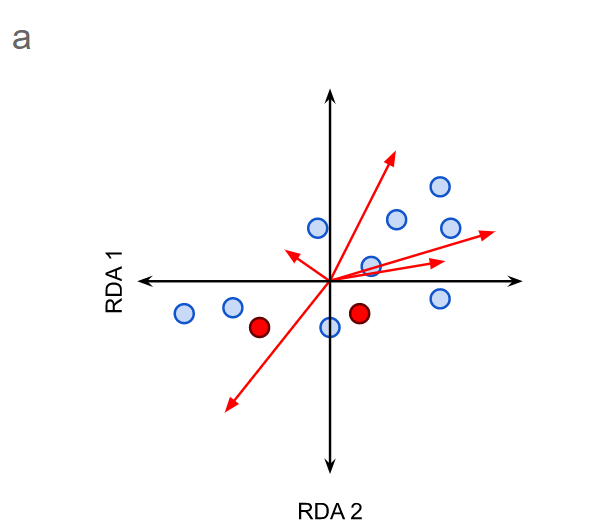 

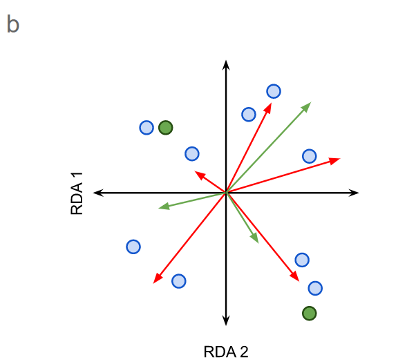

图1. RDA双序图(a)和RDA三序图(b)的示意图。

a）RDA双序图将对象作为点，将响应或解释变量作为向量（红色箭头）。 标称变量(Levels of nominal variables)的级别绘制为点（红色）。

b）在一个三序图中，对象被标为点（蓝色），而响应变量和解释变量（分别为红色和绿色箭头）被绘制为矢量。物种绘制为点（绿色）。 

- I型标准化-距离图（以对象为中心）

目标点之间的距离近似于欧几里得距离。因此，可以期望将靠近在一起的对象具有相似的变量值。这并非总是如此，因为RDA仅展示了数据集中的部分变化（图2）。

代表响应变量的矢量之间的角度是没有意义的。

代表响应变量的点和代表解释变量的矢量之间的角度反映了它们的（线性）相关性。

- II型标准化-相关图（关注响应变量）

对象点之间的距离不是近似欧几里得距离。

对象在表示响应变量的点上的直角投影近似于给定对象的变量值。

所有矢量之间的角度反映了它们的（线性）相关性。相关性等于矢量之间的角度的余弦值。

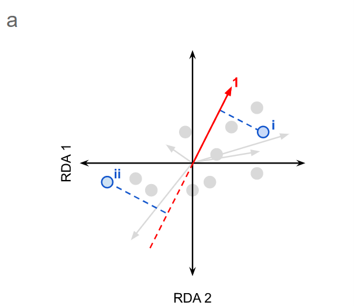

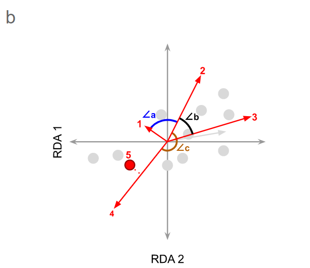

图2. RDA图坐标对象的投影和角度示例。
a）坐标对象在矢量上的投影，b）矢量之间的角度。

坐标点在变量向量上的投影（如图2a中的点i所示）近似于为该对象实现的变量值。因此，目测与大多数其他对象相比，可以预期对象i受变量1影响较大。但是，可以预期对象ii相对于其他对象受的变量1影响较小。请注意，虚线通常不会在双序图中显示，此处为演示而显示。使用II型尺度缩放时，向量之间的夹角余弦近似于它们表示的变量之间的相关性。在这种情况下，**∠a接近90，这表明变量“ 1”和“ 2”显示出很小的相关性（即它们几乎是正交的，就像独立的轴一样**）。 **∠b小于90°，表明变量“ 2”和“ 3”之间呈正相关，而∠c接近180°，表明变量“ 2”和“ 4”之间具有强烈的负相关（即变量“增加”的方向） 2”和“ 4”彼此相对）。变量5是非数值解释变量，由点表示。在变量4上的直角投影表明两者是正相关的**。

##### 典范对应分析(CCA）

同RDA有许多相似之处，作为非限制性排序典型算法的CCA，是基于单峰模型，同CA分析一样的基础算法，但在排序迭代过程中将解释变量同响应变量矩阵之间做了加权回归分析。这里重点关注CCA使用的条件：1. 物种在整个生态梯度环境中都有采样；2. 物种在生态梯度上呈现单峰分布响应。


##### 限制性主坐标分析(CPCoA）

限制性主坐标分析(Constrained PCoA，CPCoA），也称限制性主坐标轴分析。是在PCoA的的分析中即添加了分组信息，以寻找在自定分组条件下可最大解释组间差异的平面。结果展示为在指定分组条件下的解析率，**要求至少3组及以上才可开展此类分析**。

```{r eval=FALSE, include=TRUE}
library(amplicon)
(p1=beta_pcoa(beta_bray_curtis, metadata, groupID="Group"))
ggsave("b5.pcoa.pdf", p1, width=91, height=59, units="mm")
ggsave("b5.pcoa.png", p1, width=91, height=59, units="mm")
(p2=beta_cpcoa_dis(beta_bray_curtis, metadata, groupID="Group"))
ggsave("b6.cpcoa.pdf", p2, width=91, height=59, units="mm")
ggsave("b6.cpcoa.png", p2, width=91, height=59, units="mm")
library(cowplot)
(p0 = plot_grid(p1, p2, labels = c("A", "B"), ncol = 2))
ggsave("b3_pcoa_cpcoa.pdf", p0, width=91*2, height=59, units="mm")
ggsave("b3_pcoa_cpcoa.png", p0, width=91*2, height=59, units="mm")
```

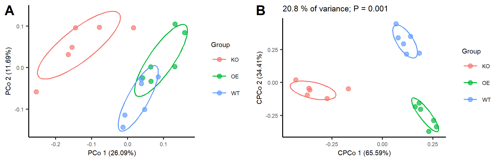

图3. PCoA和CPCoA比较。

表2. PCoA和CPCoA差异比较

特征        |PCoA                                   |CPCoA
:-----------|:--------------------------------------|:---------------------------------------------
解析率      |整体是100%                             |整体仅为0%~100%间，见左上角或图注
坐标轴      |PCo1/2，解析率为整体的百分比           |CPCo1/2，解析率为本图的百分比
组间分开    |不明显                                 |明显
显著性      |需要单独统计                           |整体anova.cca统计值见左上角
分析数据量  | >= 3个样本                            | >= 3个实验组

##### 线性判别分析(LDA）

线性判别分析(Linear Discriminant Analysis,LDA)在模式识别领域（比如人脸识别，舰艇识别等图形图像识别领域）中有非常广泛的应用，在生物学大数据研究中同样也有广泛应用，比如Sicence封面文章哈扎人菌群研究就使了此方法(详见例4)。

LDA是一种监督学习的降维技术，也就是说它的数据集的每个样本是有类别输出的。这点和PCA不同。PCA是不考虑样本类别输出的无监督降维技术。LDA的思想可以用一句话概括，就是“投影后类内方差最小，类间方差最大”。更多信息详见下文。

- [LDA分析、作图及添加置信-ggord](https://mp.weixin.qq.com/s/F9c_ISpOpjHyiCNahoYTqQ)

#### 实例解读

##### 例1. CPCoA组间整体差异

[本文是2016年德国马普Paul Schulze-Lefert组发表于PNAS的文章](http://www.pnas.org/content/113/49/E7996.short) ，分析了百脉根根瘤的微生物群落组成，同时在根瘤缺失突变体中发现根和根际微生物组均有较大差异的变化。

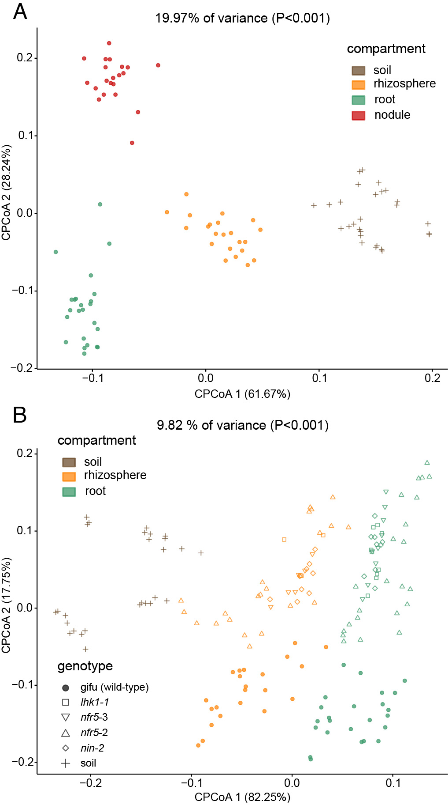

图2. 散点图展示限制性主坐标轴分析取材部位和基因型间的差异。

(A) 基于野生型样本的Bray-Curtis距离采用限制性主坐标分析不同取样部分样本间的差异。该条件下基于94个样本最大可解析整体19.97%的变异，且组间至少存在一个两组间的显著差异 (P<0.001)。

(B) 以基因型为条件分析最大解释基因型组间差异的空间平面，可解释9.82%的变异，并且基因型间存在显著差异，其中作者按形状标出了各基因型；同时作者还按取样部分进行着色，在这一平面上取样部仍能很好的分开。

> Fig. 2. (A) Constrained PCoA plot of Bray–Curtis distances between samples including only the WT constrained by compartment (19.97% of variance, P > 0.001; n=94). (B) Constrained PCoA plot of Bray–Curtis distances constrained by genotype (9.82% of variance explained, P < 0.001; n=164). Each point corresponds to a different sample colored by compartment, and each host genotype is represented by a different shape. The percentage of variation indicated in each axis corresponds to the fraction of the total variance explained by the projection.

图表结果：主要结果包括取样位置可解释19.97%差异，且区分明显；突变体与野生型可以区分，但区分不大(占9.82%变异中的17.75%的纵轴上可区分)；各突变体间很难区分，完全混在一起；在基因型最大解释平面上，取样位置仍能非常好的在第一轴上区分。

图2在原文中共被引用了11次。让我们跟着作者学习两个小图如何写成几大段文字的。

值得注意的是，我们发现与四个共生突变体中的每一个的根和根际相关的群落彼此相似，但与野生型植物的群落显著不同（图2B）。采用典范主坐标分析整个群落，宿主基因型对细菌群落存在显著影响，解释了9.82％的变异（图2B）。 根瘤是根上的锚定结构，但两个生境仍具有独特的细菌组合（图2A）。

> Remarkably, we found that communities associated with the roots and rhizospheres of each of the four symbiosis mutants were similar to each other, but significantly different from the communities of WT plants (Fig. 2B). Furthermore, CAP performed on the entire dataset revealed a prominent effect of the host genotype on bacterial communities, explaining 9.82% of the variance (Fig. 2B). Nodules are root-derived and -anchored structures, and yet the two organs host distinctive bacterial assemblages (Fig. 2A). 

由于测试的共生突变体之间的菌群没有显著差异（图2B，详者注：没有显著差异也是发现），我们使用来自所有土壤批次的所有突变体基因型的组合样本进行了分析。 接下来，我们直接比较了野生型和突变体，以确定根或根际差异丰富的OTU（附录，图S10和S11，详者注：除主图外还需要有大量的附图和表对同一结论的支撑）。 我们发现，宿主基因型的使用群落结构转变（图2B）很大程度上是由大量OTU引起的，这些OTU为突变体根样品相对于野生型根中特异富集（n=45）或消减（n=15）至少属于14个细菌纲（附录，图2B，图S10A，S11 A和B）。

> Due to the fact that the bacterial assemblages of the tested symbiosis mutants do not significantly differ among each other (Fig. 2B), we performed our analyses using the combined samples from all mutant genotypes across all soil batches. Next, we compared directly the WT and mutants to identify OTUs differentially abundant in the root or rhizosphere (SI Appendix, Figs. S10 and S11). We found that the community shift that separates host genotypes (Fig. 2B) is largely caused by numerous OTUs that are specifically enriched (n=45) or depleted (n=15) in WT roots with respect to mutant root samples (SI Appendix, Fig. S10A) belonging to at least 14 bacterial orders (SI Appendix, Fig. S11 A and B). 

我们的统计分析揭示了宿主基因型对百脉根的根系微生物群的重大影响，这解释了数据中9.82％的差异（图2B）。 这种基因型效应几乎比野生型和严重免疫受损的拟南芥突变体的根相关群落（讨论：与2015的Science结果比较）或拟南芥与三种3千5百万年分化的十字花科物种之间鉴定的效应大两倍（讨论：与2014的PNAS结果比较）。 有趣的是，在nfr5，nin和lhk1突变体根中检测到的群落转变具有高度类似（图2B）。

> Our statistical analyses revealed a major impact of the host genotype on the Lotus root microbiota, which explains 9.82% of the variance in the data (Fig. 2B). This genotype effect is almost twofold larger than the effect identified when comparing the root associated communities of WT and severely immunocompromised A. thaliana mutants (52) or between A. thaliana and three Brassicaceae species that diverged up to 35 Mya (29). Interestingly, the community shifts detected in nfr5, nin, and lhk1 mutant roots are highly comparable (Fig. 2B).

为了评估不同取样部分对细菌群落组装的影响，我们使用Bray–Curtis距离比较了β-多样性（样本间多样性），并进行了典范主坐标分析。该分析揭示了根、根际、根瘤和土壤不同取样部分的明显区别，这解释了高达数据总方差的19.97％（图2A； P < 0.001），而归因于 土壤批次相对较小（方差的8.01％，P < 0.001）。

> To assess the effect of the different compartments on the assembly of bacterial communities, we compared the β-diversity (between- samples diversity) using Bray–Curtis distances and performed a canonical analysis of principal coordinates (CAP) (30) (Materials and Methods). This analysis revealed a clear differentiation of samples belonging to the root, rhizosphere, nodule, and soil compartments that explains as much as 19.97% of the overall variance of the data (Fig. 2A; P < 0.001), whereas the effect attributable to the soil batch was comparatively small (8.01% of the variance, P < 0.001).

我们利用了科隆土壤中存在的百脉根和根瘤菌之间的相容共生关系，并对在这种土壤中生长的野生型植物的附生植物枯竭的功能性根瘤细菌群落进行了分析（材料和方法）。 我们发现，与根部和根际中的根瘤相比，根瘤中有一个独特的细菌群落（图2A）。  重要的是，根瘤和根的群落与根际相似（从第二主坐标轴分离；图2A）。

> We took advantage of the compatible symbiotic association between Lotus and rhizobia present in Cologne soil and performed an analysis of the bacterial community of epiphyte-depleted, functional nodules of WT plants grown in this soil (Materials and Methods). We found that nodules were inhabited by a distinctive bacterial community compared with those present in the root and rhizosphere (Fig. 2A). Importantly, the nodule and root communities were similarly divergent from the rhizosphere (separation by second component; Fig. 2A).

图表结论或规律：取样部位对微生物组成影响较大，基因型其次；不同根瘤突变体差异极小。

图片优点：配色选择各组区分较好，不同图配色方案一致；图片使用矢量图线条和文字清楚(大部分PNAS和Microbiome文章中是位图，经过PDF的压缩，文字非常模糊)。个人建议，只要不是照片，画的图都用矢量，无极缩放不失真，一般体积还小，而且方便编辑修改。

##### 例2. CAP细菌/真菌群落和双标图biplot

这篇文章由瑞士伯尔尼大学的Matthias Erb和Klaus Schlaeppi团队合作于2018年发表在Nature Communications期刊发表关于根系分泌代谢物通过塑造根际微生物群来驱动植物土壤对生长和防御的反馈的研究，揭示了植物根际微生物区系组成、植物性能和植物-草食相互作用的机制。[详细中文解读](https://mp.weixin.qq.com/s/d80uZRffhhIsA-gOOxcKmA)

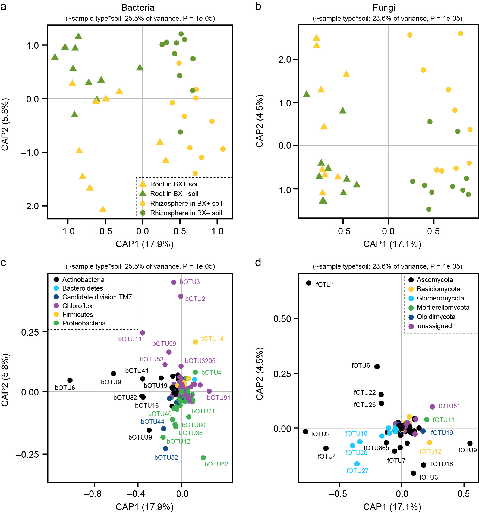

图7. 苯并恶嗪类化合物(BX)调节可在第二代植物的根和根际中塑造土壤微生物群。

a，b对先前曾受野生型（BX +）或苯并恶嗪类（BX）缺乏的突变植物作用的土壤中生长的野生型（WT）植物（n=10）的根际和根细菌（a）和真菌（b）根际主坐标的偏典范分析（CAP）。 **使用Bray-Curtis距离的CAP分析样本类型和土壤条件的限制。 在图上方标出了模型解释的总方差和模型显著性。轴报告受约束的轴解释的总变化的比例**。 c，d用CAP的细菌操作分类单位（bOTU，c）和真菌OTU（fOTU，d）的双标图，显示各个OTU对不同处理分离的贡献。

> Fig. 7 Benzoxazinoid-conditioning shapes soil microbiota in the roots and rhizosphere of the second plant generation. a, b Partial Canonical analysis of Principal Coordinates (CAP) of rhizosphere and root bacterial (a) and fungal (b) communities of wild type (WT) plants grown in soils previously conditioned by WT (BX+) or benzoxazinoid (BX)-deficient bx1 mutant plants (BX−) (n=10). **CAP ordinations using Bray–Curtis distance were constrained for the factors sample type and soil conditioning. Model, explained fraction of total variance and model significance are indicated above the plots. Axes report the proportions of total variation explained by the constrained axes**. c, d Biplot with the bacterial Operational Taxonomic Unit (bOTU, c) and fungal OTU (fOTU, d) scores of the CAP showing the contribution of individual OTUs to the separation of the different treatments.


**结果描述**：

为了了解BX土壤处理是否改变了响应植物的根相关菌群，研究人员分析了生长在BX+和BX−土壤中野生植物的根和根际样品中的真菌和细菌群落。非限制性和限制性的纵坐标显示，细菌和真菌在根际和根之间以及在BX+和BX−土壤之间有明显的分离（图7a, b，补充图9a, b）。多变量统计证实了这些效应的显著性（补充表7和8；参考补充数据3来深入分析BX土壤处理对微生物多样性的影响）。放线菌门OTUs和属于子囊菌纲和球囊菌门的OTUs的亚群对根和根际样品的分离贡献最大（图7c, d）

> To understand whether BX soil conditioning changes the rootassociated microbiota of the responding plants, we profiled fungal and bacterial communities in root and rhizosphere samples of WT plants grown in BX+ and BX− soils. Both unconstrained and constrained ordinations revealed a clear separation of bacteria and fungi between rhizosphere and roots and between BX+ and BX− soils (Fig. 7a, b, Supplementary Fig. 9a, b). Multivariate statistics confirmed the significance of these effects (Supplementary Tables 7 and 8; we refer to the Supplementary Data 3 for in depth analysis of BX soil conditioning effects on microbial diversity). Actinobacteria OTUs and a subset of OTUs belonging to Ascomycota and Glomeromycota contributed most strongly to the separation of root and rhizosphere samples (Fig. 7c, d).

- **总结**

1. 研究中同时对细菌和真菌测序分析，可以使用同类图形并行展示，增加结果的全面和丰富性；
2. 图注中对图形的描述比较清楚，在上文中已经加粗，供写作参考；
3. 同一个图除了CAP还可采用双标图(Biplot)展示，增加结果样本丰度度和看问题的角度。

- **结果**：

在RDA分析中，2014年采集的土壤样品中20个最高丰度门中的16个更高，而2015年采集的土壤样品中只有3个更高，这与之前的结果一致。如图7b所示，第一轴解释方差为82.1％（p=.001；置换检验）和
第二轴解释方差为0.9％（p=.992；置换检验），表明第一轴基于硝化微生物群落将所有环境变量和土壤样品显著分开。

> In the RDA analysis, the relative abundance of 16 out of the 20 top phyla were higher in the soil samples collected in 2014, whereas only three of these phyla were higher in the soil samples collected in 2015, which was consistent with the previous results. As shown in Figure 7b, 82.1% (p=.001; permutation test) and 0.9% (p=.992; permutation test) of the cumulative variance of the relationship were explained by the first and second axes of RDA, respectively, which indicated that the first axis significantly separated all of the environmental variables and soil samples based on nitrifying microbial communities.

##### 例3. RDA分析环境因子对微生物群落影响

本文由北京师范大学环境学院黄来斌(Laibin Huang)等人于2020年发表在Global Change Biology上，在人类活动强度高于全球沿海生态系统平均水平的情况下，分析了在大尺度生态系统解除胁迫因子后，微生物群落整体也能在短时间内恢复到与原始状态相似的状态，这意味着即使在强烈的人为干扰下，土壤微生物群落也具有很强的恢复能力。[点击访问中文解读](https://mp.weixin.qq.com/s/_w07hBrDtCzh6Vnj6QpPgg)


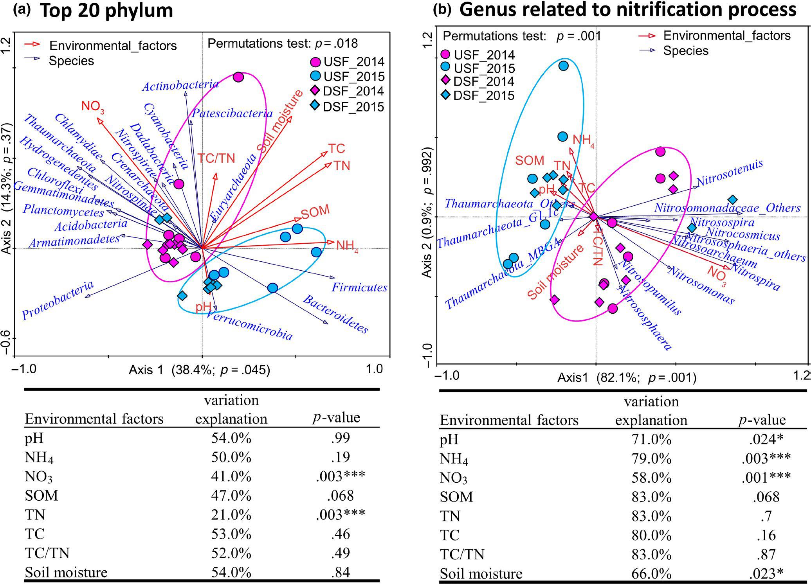

图7. RDA分析对珠江三角洲沿岸微生物群落变化的环境解释。（a） 前20门变化的环境解释；（b）与硝化过程有关的属变化的环境解释。USF_2014（粉色圆圈）和USF_2015（蓝色圆圈）分别代表2014年和2015年上游的原位土壤；DSF_（粉色钻石）和DSF_（蓝色钻石）分别代表2014年和2015年下游的原位土壤（无限制置换检验，n=999）。

> FIGURE7 Environmental explanation of the changes in microbial community along the Pearl River Estuary by RDA analysis. (a) Environmental explanation of the changes in top 20 phylum; (b) environmental explanation of the changes in genus related to nitrification process. USF_2014 (pink circle) and USF_2015 (blue circle) represent field soils from upstream in 2014 and 2015, respectively; DSF_2014 (pink diamond) and DSF_2015 (blue diamond) represent field soils from downstream in 2014 and 2015, respectively. *.05; **.01; ***<.001 (Unrestricted permutation test, n=999)


- **结果**：

在RDA分析中，2014年采集的土壤样品中20个最高丰度门中的16个更高，而2015年采集的土壤样品中只有3个更高，这与之前的结果一致。如图7b所示，第一轴解释方差为82.1％（p=.001；置换检验）和
第二轴解释方差为0.9％（p=.992；置换检验），表明第一轴基于硝化微生物群落将所有环境变量和土壤样品显著分开。

> In the RDA analysis, the relative abundance of 16 out of the 20 top phyla were higher in the soil samples collected in 2014, whereas only three of these phyla were higher in the soil samples collected in 2015, which was consistent with the previous results. As shown in Figure 7b, 82.1% (p=.001; permutation test) and 0.9% (p=.992; permutation test) of the cumulative variance of the relationship were explained by the first and second axes of RDA, respectively, which indicated that the first axis significantly separated all of the environmental variables and soil samples based on nitrifying microbial communities.

##### 例4. LDA展示肠道菌群四季的变化

本文为2017年8月25日发表在Sciences杂志上的封面文章为例，介绍了采集狩猎的非洲哈扎人肠道菌群存在一年四季的动态变化。详细介绍见- [3分和30分文章差距在哪里？](http://mp.weixin.qq.com/s/kD-x7K4hI5KMgGXikyLt0Q)

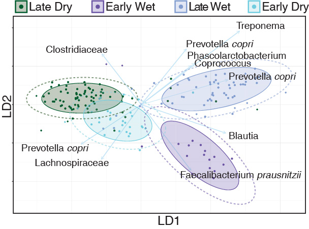

图 1. 哈扎人肠道菌群随季节变化。(E) [线性判别分析  (LDA，一种限制性排序分析)](https://mp.weixin.qq.com/s/F9c_ISpOpjHyiCNahoYTqQ)展示按季节分组最大贡献的OTUs；箭头的长度和方向指示每个特征（OTUs）的标准化比例。

> Fig. 1. Hadza gut microbial community compositions are cyclic and can be differentiated by season. (E) Linear discriminant analysis, a supervised learning approach that utilizes a linear combination of features to maximize the separation of classes, successfully separates the subseasons, except for the dry seasons.The length and direction of the arrows indicate the normalized scalings for each of the features (OTUs).

- **结果**：

专门尝试通过整合OTU的线性组合来区分群体的监督学习方法无法区分连续年份中的同一季节（旱季），从而支持了菌群周期性重新配置的规律（图1E，图S3A和表S2）。

> A supervised learning approach that specifically attempts to distinguish groups by integrating a linear combination of OTUs was unable to differentiate the same season (dry) in sequential years, supporting the cyclic nature of the reconfiguration (Fig. 1E, fig. S3A, and table S2).

##### 例5. CPCoA展示基因型对菌群的调控

本文是2019年5月中科院遗传发育所白洋组与JIC的Anne Osbourn组合作在拟南芥代谢物调控根系微生物组领域取得重大突破，成果以长文形式发表于Science杂志，海南大学罗杰教授对本工作的意义进行点评。详细报导请点击下方链接：- [Science：拟南芥三萜化合物特异调控根系微生物组*](https://mp.weixin.qq.com/s/KmMDEmptBKz8Fv7VSdz2Jg) [专家点评](https://mp.weixin.qq.com/s/xlYx9Jb9cBVNs1QrW48RAg)。

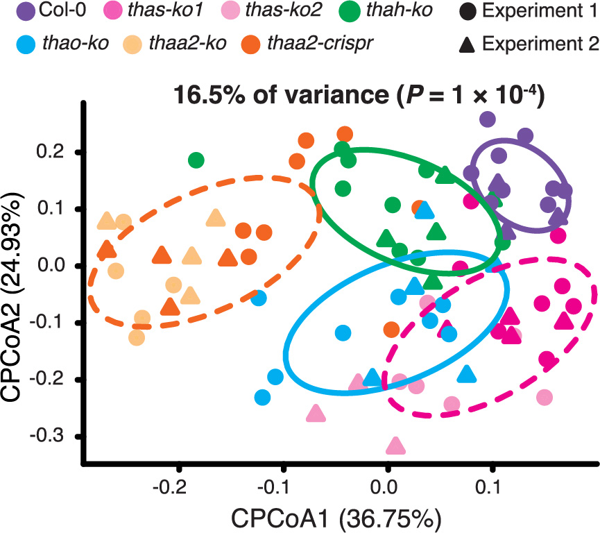

图4. 三萜通路的突变体特异调控的根系细菌类群。(A) 基于Bray-Curtis距离的有监督主坐标轴分析展示基因型对菌群调控的效应。用于分析的每组植物数量：Col-0（n = 12），thas-ko1（n = 12），thas-ko2（n = 9），thah-ko（n = 14），thao-ko（n = 13），thaa2-ko（n = 9）和thaa2-crispr（n = 12）。 来自两个独立实验（实验1和2）的生物学重复（单个植物）分别用点和三角形表示。 椭圆包括每种基因型的68％样品。

> Fig. 4 Modulation of specific root bacterial taxa in triterpene pathway mutants. (A) Constrained principal coordinate analysis (CPCoA) of Bray-Curtis dissimilarity showing triterpene mutant effects. Total number of individual plants used for analyses: Col-0 (n = 12), thas-ko1 (n = 12), thas-ko2 (n = 9), thah-ko (n = 14), thao-ko (n = 13), thaa2-ko (n = 9), and thaa2-crispr (n = 12). Biological replicates (individual plants) from two independent experiments (experiment 1 and 2) are indicated with dots and triangles, respectively. Ellipses include 68% of samples from each genotype. 

- **结果**：

有监督的主坐标轴分析(CPCoA)展示了野生型与突变体根系微生物组的差异(可以解析16.5%的总体变异，多元变量置换检验 P < 0.001，图4A，附表18-22)。存在两个独立来源的突变体THAS (thas-ko1和thas-ko2) 和THAA2 (thaa2-ko和thaa2-cripsr)表现出相似的代谢缺陷（附图18-22）也同样拥有相似的微生物组成和多样性（图4A，附图23，表23-26）。

> Constrained principal coordinate analysis (CPCoA) revealed differences in root microbiota between the wild-type (Col-0) and mutant lines (16.5% of total variance was explained by the plant genotypes, P < 0.001, permutational multivariate analysis of variance) (Fig. 4A and tables S18 to S22). Pairs of independent mutant lines for THAS (thas-ko1 and thas-ko2) and THAA2 (thaa2-ko and thaa2-cripsr) each display similar metabolite defects (figs. S18 to S22) and have similar microbiota profiles and microbial diversity (Fig. 4A, fig. S23, and tables S23 to S26). 


#### 绘图实战

##### 安装和加载R包：amplicon

```{r install}
# 基于github安装包，需要devtools，检测是否存在，不存在则安装
if (!requireNamespace("devtools", quietly=TRUE))
    install.packages("devtools")
# 注：提示安装源码包的最新版时，推荐选否，加速安装预编译的稳定版。原码包编译时间长且容易出错
# 第一次运行，会自动在C:\Users\User\Documents\R\win-library\4.0目录中安装75个包
# 加载github包安装工具
library(devtools)

# 检测amplicon包是否安装，没有从源码安装
if (!requireNamespace("amplicon", quietly=TRUE))
    install_github("microbiota/amplicon")
# 提示升级，选择3 None不升级；升级会容易出现报错
# library加载包，suppress不显示消息和警告信息
suppressWarnings(suppressMessages(library(amplicon)))
```

##### 输入文件和基本参数

设置基本参数：读取实验设计、设置分组列名、图片宽高

```{r parameter, warning=FALSE}
# 读取元数据
metadata=read.table("metadata.txt", header=T, row.names=1, sep="\t", comment.char="", stringsAsFactors=F)
# 设置实验分组列名
group="Group"
# 图片16：10，即半版89 mm x 56 mm; 183 mm x 114 mm
w=89
h=59
```

##### 限制性PCoA

限制性PCoA(Constrained PCoA)，要求至少分组数量 >= 3时才可用，否则请跳过此步分析。

方法1. 基于特征OTU/ASV表使用vegan包计算矩阵矩阵并进行限制性主坐标分析。

```{r}
library(amplicon)
# 读取特征ASV表，多样性分析输入抽平标准化的表
otutab=read.table("otutab_rare.txt", header=T, row.names=1, sep="\t", comment.char="")
# 基于特征表、原数据、距离类型、分组列名、是否添加置信椭圆，是否添加样本标签
(p = beta_cpcoa(otutab, metadata, dis="bray", groupID="Group", ellipse=T, label=T))
ggsave("p1.cpcoa_otutab.pdf", p, width=w, height=h, units="mm")
ggsave("p1.cpcoa_otutab.png", p, width=w, height=h, units="mm", dpi=300)
```

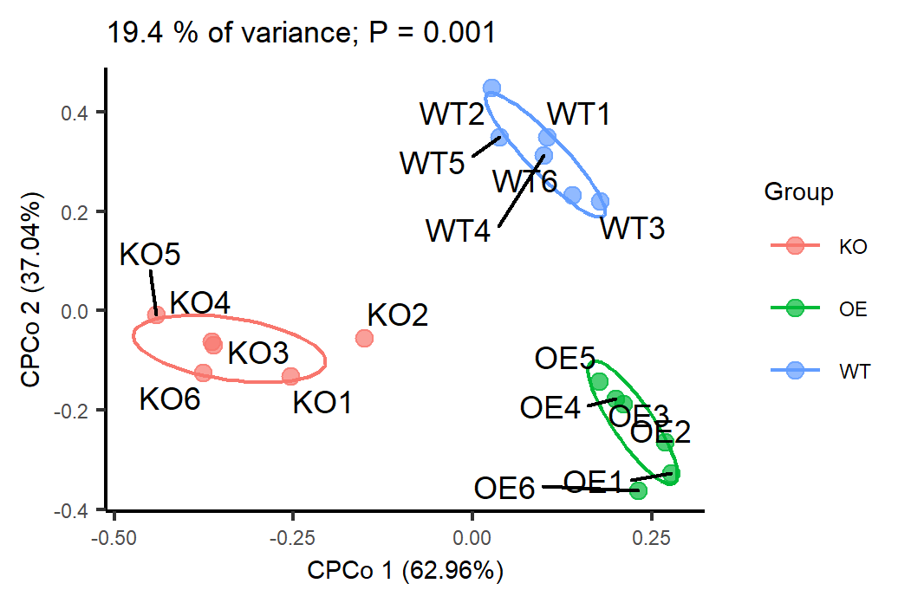
图1. 基于Bray-Curtis距离的限制性主坐标分析不同基因型分组

我们输入文件为更常用为各种类型的距离矩阵，可以基于OTU表使用QIIME的beta_diversity.py、USEARCH的-beta_div计算。

常用的矩阵类型常用Bray-Curtis、Jaccard、Unifrac和Unweighted unifrac等。下面以Unifrac距离矩阵为例绘制

```{r}
distance_mat=read.table("unifrac.txt", header=T, row.names=1, sep="\t", comment.char="")
distance_mat[1:3, 1:3]
(p=beta_cpcoa_dis(distance_mat, metadata, groupID=group))
ggsave("p2.cpcoa_unifrac_distance.pdf", p, width=w, height=h, units="mm")
ggsave("p2.cpcoa_unifrac_distance.png", p, width=w, height=h, units="mm", dpi=300)
```

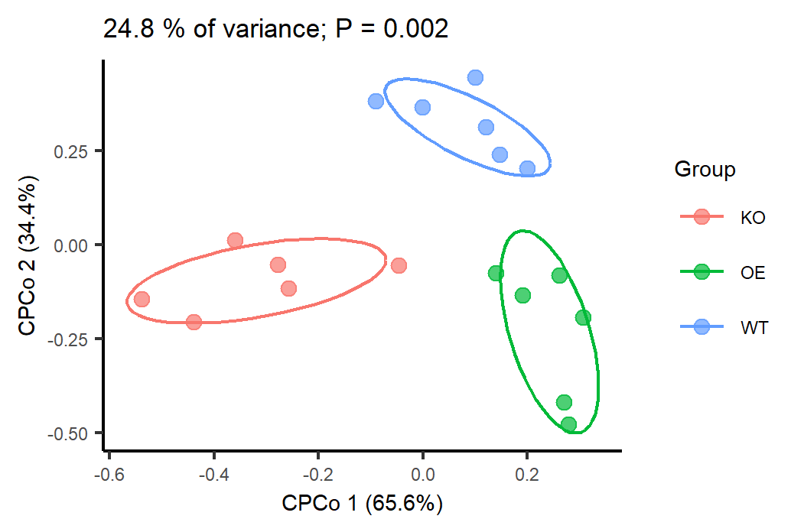
图2. 基于Unifrac距离的限制性主坐标分析不同基因型分组

##### RDA/CCA

加载代码包和输入文件

```{R}
otu=read.delim("otutab_rare.txt",row.names=1)
# 导入环境因子文件
env=read.delim("env.txt",row.names=1)
```

RDA 或CCA 模型的选择原则：RDA是基于线性模型，CCA是基于单峰模型。一般会选择CCA来做直接梯度分析。首先函数先做DCA(detrended correspondence analysis)分析，并提取结果中Lengths of gradient第一轴的大小。如果大于4.0，就应该选CCA；如果3.0-4.0 之间，选RDA 和CCA均可；如果小于3.0，RDA 的结果要好于CCA。

所以这里会有同时做RDA和CCA的情况。

```{R}
result = RDA_CCA(otutab,metadata,ps=NULL,env=env,group="Group")
#--提取图
p=result[[1]]
p
ggsave("p3.RDA.pdf", p, width=w*1.5, height=h*1.5, units="mm")
ggsave("p3.RDA.png", p, width=w*1.5, height=h*1.5, units="mm", dpi=300)
```
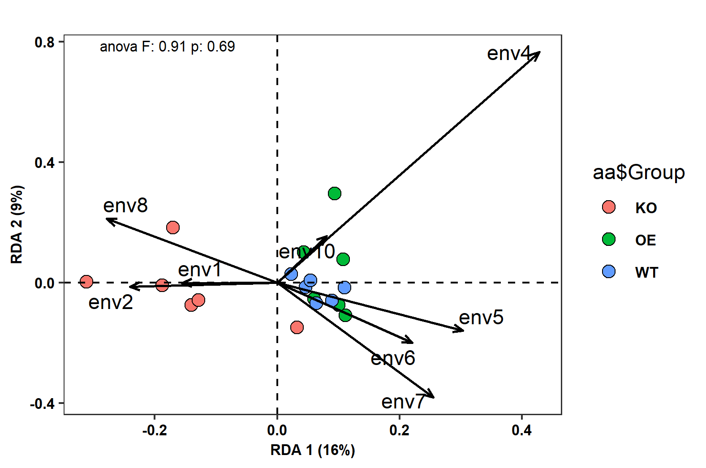
图3. RDA分析结果图。点代表样本，箭头代表环境因子。

```{R}
#--提取作图数据
plotdata=result[[2]]
plotdata[1:3,1:3]
```


```{R}
# 提取带有样本标签的图形
p2=result[[3]]
p2
```

检测解释变量对响应变量的解释度和显著性。

```{R}
# 提取环境因子同群落的差异检测
table=result[[4]]
head(table)
```

Lengths ofgradient 的第一轴的大小在3.0-4.0 之间，会同时计算RDA和CCA，供选择。

```{R}
# 如果两种模型都选择，则列表中5，6就被激活了#
result[[5]]
result[[6]]
```

##### LDA

LDA部分的分析集成到BetaDiv函数中。

```{r LDA}
# 安装Bioconductor的R包phyloseq
if (!requireNamespace("BiocManager", quietly=TRUE))
    install.packages("BiocManager")
suppressWarnings(suppressMessages(library(BiocManager)))
if (!requireNamespace("phyloseq", quietly=TRUE))
    BiocManager::install("phyloseq")
library(phyloseq)

# 输入抽平标准化的特征表、元数据、分组列名、距离类型、降维和统计方法
result=BetaDiv(otu=otutab_rare, map=metadata, group="Group", 
                 dist="bray", method="LDA")
# 返回结果列表：标准图，数据，标签图，成对比较结果，整体结果

#提取排序散点图(结果列表中的1)
(p=result[[1]])
ggsave(paste0("p4.LDA.jpg"), p, width=w, height=h, units="mm")
ggsave(paste0("p4.LDA.pdf"), p, width=w, height=h, units="mm")
```
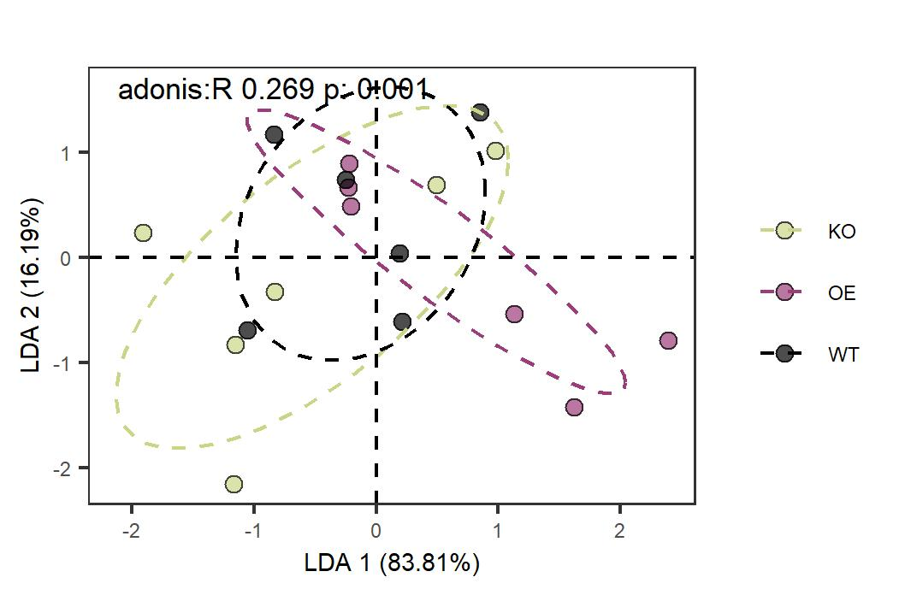

图4. LDA分析样本微生物群落结构。本数据在LDA分析的结果还没有PCoA按组分开明显，更不如CPCoA。不同方法只是不同看问题的角度，适合的结果是不同方法尝试结合背景知识综合思考后选择的。

```{r}
# 提取出图坐标
plotdata=result[[2]]
plotdata[1:3,1:3]
# 提取带标签排序散点图
(p=result[[3]])
```


#### 参考文献

- Rafal Zgadzaj, Ruben Garrido-Oter, Dorthe Bodker Jensen, Anna Koprivova, Paul Schulze-Lefert & Simona Radutoiu. (2016). Root nodule symbiosis in Lotus japonicus drives the establishment of distinctive rhizosphere, root, and nodule bacterial communities. Proceedings of the National Academy of Sciences of the United States of America 113, E7996-E8005, doi: https://doi.org/10.1073/pnas.1616564113
- Lingfei Hu, Christelle A. M. Robert, Selma Cadot, Xi Zhang, Meng Ye, Beibei Li, Daniele Manzo, Noemie Chervet, Thomas Steinger, Marcel G. A. van der Heijden, Klaus Schlaeppi & Matthias Erb. (2018). Root exudate metabolites drive plant-soil feedbacks on growth and defense by shaping the rhizosphere microbiota. Nature Communications 9, 2738, doi: https://doi.org/10.1038/s41467-018-05122-7
- Laibin Huang, Junhong Bai, Xiaojun Wen, Guangliang Zhang, Chengdong Zhang, Baoshan Cui & Xinhui Liu. (2020). Microbial resistance and resilience in response to environmental changes under the higher intensity of human activities than global average level. Global Change Biology 26, 2377-2389, doi: https://doi.org/10.1111/gcb.14995
- Samuel A. Smits, Jeff Leach, Erica D. Sonnenburg, Carlos G. Gonzalez, Joshua S. Lichtman, Gregor Reid, Rob Knight, Alphaxard Manjurano, John Changalucha, Joshua E. Elias, Maria Gloria Dominguez-Bello & Justin L. Sonnenburg. (2017). Seasonal cycling in the gut microbiome of the Hadza hunter-gatherers of Tanzania. Science 357, 802-806, doi: https://doi.org/10.1126/science.aan4834
- Ancheng C. Huang, Ting Jiang, Yong-Xin Liu, Yue-Chen Bai, James Reed, Baoyuan Qu, Alain Goossens, Hans-Wilhelm Nützmann, Yang Bai & Anne Osbourn. (2019). A specialized metabolic network selectively modulates Arabidopsis root microbiota. Science 364, eaau6389, doi: https://doi.org/10.1126/science.aau6389
- GUSTA ME http://mb3is.megx.net/gustame/constrained-analyses/rda
- 排序分析PCA、PCoA、CA、NMDS、RDA、CCA等区别与联系 https://www.omicsclass.com/article/148


> 责编：刘永鑫 中科院遗传发育所

> 版本更新历史

> 1.0.0，2020/6/27，文涛，初稿

> 1.0.1，2020/7/13，刘永鑫，LDA/CCA/CPCoA背景介绍

> 1.0.2，2020/7/17，席娇，全文校对

> 1.0.3，2020/8/8，刘永鑫，全文修改

> 1.0.4，2020/8/12，文涛，添加LDA分析，修改RDA分析不依赖taxonomy文件

> 1.0.5，2020/8/12，刘永鑫，添加两篇Science实例解读LDA和CPCoA
