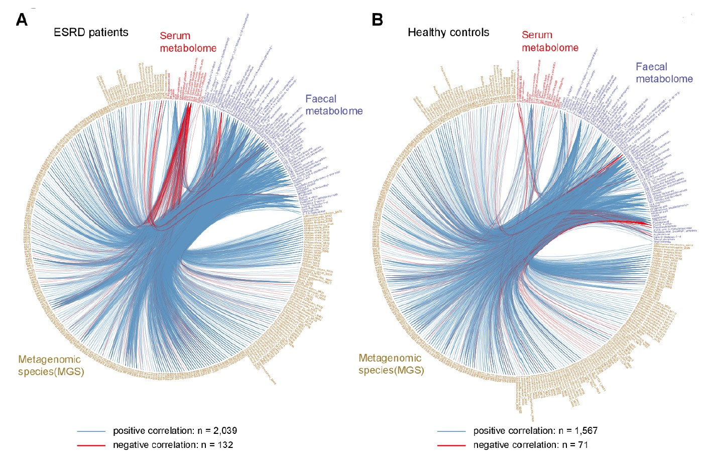
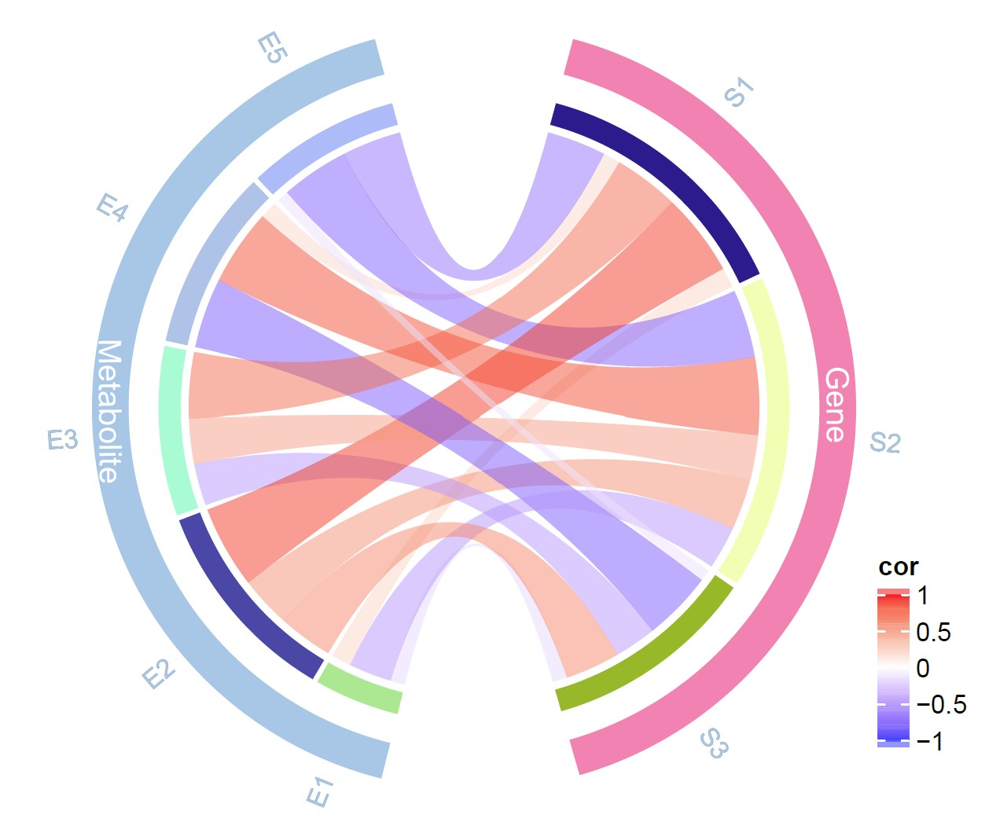

```{r setup, include=FALSE}
knitr::opts_chunk$set(
  collapse = T, echo=T, comment="#>", message=F, warning=F,
	fig.align="center", fig.width=5, fig.height=3, dpi=150)
```


The Chord plot scripts is referenced from MicrobiomeStatPlot [Inerst Reference below].


If you use this script, please cited 如果你使用本代码，请引用：

**Yong-Xin Liu**, Lei Chen, Tengfei Ma, Xiaofang Li, Maosheng Zheng, Xin Zhou, Liang Chen, Xubo Qian, Jiao Xi, Hongye Lu, Huiluo Cao, Xiaoya Ma, Bian Bian, Pengfan Zhang, Jiqiu Wu, Ren-You Gan, Baolei Jia, Linyang Sun, Zhicheng Ju, Yunyun Gao, **Tao Wen**, **Tong Chen**. 2023. EasyAmplicon: An easy-to-use, open-source, reproducible, and community-based pipeline for amplicon data analysis in microbiome research. **iMeta** 2(1): e83. https://doi.org/10.1002/imt2.83

The online version of this tuturial can be found in https://github.com/baidefeng/MicrobiomeStatPlot/tree/master/3.Visualization_and_interpretation


**Authors**
First draft(初稿)：Defeng Bai(白德凤)；Proofreading(校对)：Ma Chuang(马闯) and Xun Jiani(荀佳妮)；Text tutorial(文字教程)：Defeng Bai(白德凤)


# Introduction简介

什么是弦图？
What is a chord diagram?

弦图（Chord Diagram)，在图论中，任意长度大于3的环都有一个弦的图称为弦图。一般是用来表示多个元素之间的联系，弦图一般分为两个部分：外部的节点和内部的弦。其中节点表示源数据，弦表示数据之间的联系，弦的粗细表示数据联系的强弱。

Chord Diagram, in graph theory, is a graph in which any ring with a length greater than 3 has a chord. It is generally used to represent the connections between multiple elements, and a chord diagram is generally divided into two parts: external nodes and internal strings. The nodes represent the source data, the strings represent the connections between the data, and the thickness of the strings represents the strength of the data connections.


关键字：微生物组数据分析、MicrobiomeStatPlot、弦图、R语言可视化

Keywords: Microbiome analysis, MicrobiomeStatPlot, Chord plot, R visulization


## Chord plot example 弦图案例

Example 1: Chord diagram of multi omics correlation network 例1：多组学相关性网络弦图

本文是中国农业大学Ren Fazheng团队在2019年的一项发表于Gut microbiota（Wang et al., 2019）的工作。研究异常的肠道微生物群改变了宿主的代谢组对人类和啮齿类动物肾功能衰竭的影响。在图3A中用到弦图展示多组学数据之间的相关性。论文题目为：Aberrant gut microbiota alters host metabolome and impacts renal failure in humans and rodents. https://doi.org/10.1136/gutjnl-2019-319766

This article is a work by Ren Fazheng's team from China Agricultural University, published in Gut microbiota (Wang et al., 2019) in 2019. The study investigated the impact of abnormal gut microbiota on the host's metabolome on renal failure in humans and rodents. In Figure 3A, a chord diagram is used to demonstrate the correlation between multiple omics data. The title of this paper was: Aberrant gut microbiota alters host metabolome and impacts renal failure in humans and rodents. https://doi.org/10.1136/gutjnl-2019-319766




图3 a-b ESRD患者和健康对照组的肠道微生物组、血清和粪便代谢组的所有变量的组间相关性网络。顶点表示组学变量，线表示在|ρ|>0.35和q<0.01时具有显著的Spearman相关系数。

Figure 3 a-b The interomics correlation networks of all variables for the gut microbiome, serum and faecal metabolomes of patients with ESRD and healthy controls . Vertices indicate omics variables,
and lines indicate a significant Spearman correlation coefficient at |ρ|>0.35 and q<0.01.

**结果**：

To further explore the links between gut microbiota and the metabolome composition, we carried out interomics correlation analysis of abundances of gut MGSs, serum and faecal metabolites. Tight connections were identified in both patients with ESRD and healthy controls (figure 3A,B). However, the ESRD correlation network was clearly different from that of healthy controls, as only ~12% of correlations were common (online supplementary figure 11A–C). Notably, uraemic toxins and bile acids accounted for 95.0% of serum metabolite correlations in patients with ESRD, substantially more than that in healthy controls (69.3%; online supplementary figure 11D,E). Nevertheless, correlations between MGSs, uraemic toxins and bile acids were conserved in the two groups, as regards both the direction (positive or negative) and strength, slightly higher in controls (online supplementary figure 11F,G), further supporting the finding that gut microbiome impacts the levels of these compounds and thus progression of the disease.

为了进一步探索肠道微生物群与代谢组组成之间的联系，我们对肠道MGSs、血清和粪便代谢产物的丰度进行了组间相关性分析。ESRD患者和健康对照组均发现紧密连接（图3A、B）。然而，ESRD相关性网络与健康对照组明显不同，因为只有约12%的相关性是常见的（在线补充图11A-C）。值得注意的是，尿毒症毒素和胆汁酸占ESRD患者血清代谢产物相关性的95.0%，远高于健康对照组（69.3%；在线补充图11D，E）。然而，在两组中，MGSs、尿毒症毒素和胆汁酸之间的相关性在方向（阳性或阴性）和强度方面都是保守的，在对照组中略高（在线补充图11F，G），这进一步支持了肠道微生物组影响这些化合物水平从而影响疾病进展的发现。


## Packages installation软件包安装

```{r}
# 基于CRAN安装R包，检测没有则安装
p_list = c("circlize")
for(p in p_list){if (!requireNamespace(p)){install.packages(p)}
    library(p, character.only = TRUE, quietly = TRUE, warn.conflicts = FALSE)}

# 基于github安装
library(devtools)
if(!requireNamespace("ComplexHeatmap", quietly = TRUE))
  install_github("jokergoo/ComplexHeatmap")

# 加载R包 Load the package
suppressWarnings(suppressMessages(library(circlize)))
suppressWarnings(suppressMessages(library(ComplexHeatmap)))
```


## Chord plot using R software 弦图R语言实战

使用R语言软件包circlize中的函数chordDiagram()即可绘制出弦图

The chord diagram can be drawn using the function chordDiagram() in the R language package circle

得到的图包括：最外层的标签为变量名，有刻度的坐标轴展示关联性(值越大表示关联性越强)，内侧有颜色的环形区块代表变量，中央连接各个七块的连接条带表示各个变量之间的关联情况。下图以S1为例，其Links数值的总和为35，所有外层刻度值的范围是--35；S1-E1间的Links数据为1，所以条带非常细，只占坐标轴上的一格。

The obtained graph includes: the outermost label is the variable name, a scaled coordinate axis displays correlation (the larger the value, the stronger the correlation), a colored circular block on the inner side represents the variable, and a connecting strip connecting the seven blocks in the center represents the correlation between the variables. Taking S1 as an example, the total value of its Links is 35, and the range of all outer scale values is -35; The links data between S1-E1 is 1, so the bands are very thin and only occupy one grid on the coordinate axis.

```{r Chord plot, fig.show='asis', fig.width=4, fig.height=2.5}
# 导入或构建数据
# Load data
mydata <- data.frame(Start = rep(c("S1", "S2", "S3"), 5),
                     End = c("E1", "E2", "E3", "E4", "E5"),
                     Links = 1:15)
# 绘制弦图
# Chord plot
chordDiagram(mydata)
circos.clear() 

# 设置参数对图进行调整
# Set parameters to adjust the graph
chordDiagram(mydata,
             grid.col = c(S1 = "lightcoral", S2 = "coral2", S3 = "coral4",# 圆环的颜色(The color of the ring)
                          E1 = "lightgreen", E2 = "green", E3 = "green3", E4 = "green4", E5 = "olivedrab4"),
             annotationTrack = c("name", "grid"), # 显示变量名称及圆环，无坐标轴(Display variable names and circles, no coordinate axis)
             col = hcl.colors(15), # 条带的颜色(The color of the stripes)
             transparency = 0.5,   # 透明度(Transparency)
             directional = 1,      # 条带的方向(The direction of the strip)
             link.lwd = 1,         # 条带边框的宽度(Width)
             link.lty = 2,         # 条带边框的类型(Type)
             link.border = 1)      # 条带边框的颜色(Color)
circos.clear()
```


用弦图展示不同组之间的正负相关性
Show the positive and negative correlations between different groups using a chord diagram

此处得到的图除了上图中的元素外，外部增加了大分组的颜色环状标注，内层关系条带变成了样本之间的正负相关性，并显示渐变的图例。

The graph obtained here, in addition to the elements in the above figure, has added color circular annotations for large groups on the outside, and the inner layer relationship strip has become a positive and negative correlation between samples, displaying a gradient legend.

```{r Chord plot2, fig.show='asis', fig.width=4, fig.height=2.5}
# 导入或构建数据
# Load data
mydata2 <- data.frame(Start = rep(c("S1", "S2", "S3"), 5),
                     End = c("E1", "E2", "E3", "E4", "E5"),
                     Links = runif(15, min = -1, max = 1))
col_fun <- colorRamp2(c(-1, 0, 1), c("blue", "white", "red"), transparency = 0.5)

# 绘制弦图
# Chord plot
set.seed(112)
pdf("results/chord_cor01.pdf",width = 9.5,height = 5)
circos.par(start.degree = 75)
chordDiagram(mydata2,
             big.gap = 30,
             col = col_fun,
             annotationTrack = "grid",
             preAllocateTracks = list(
    track.height = max(strwidth(unlist(dimnames(mydata2))))))

# 添加外部分组颜色环
# Add external grouping color ring
highlight.sector(mydata2$Start, track.index = 1, col = "#fc82b2",
                 text = "Gene", cex = 1, text.col = "white",
                 niceFacing = TRUE, padding = c(-.3, 0, -.2, 0))
highlight.sector(mydata2$End, track.index = 1, col = "#a3c6e7",
                 text = "Metabolite", cex = 1, text.col = "white",
                 niceFacing = TRUE, padding = c(-.3, 0, -.2, 0))

# 增加label注释，把label放在分组track外部
# Add label comments and place the label outside the grouping track
circos.trackPlotRegion(track.index = 1, panel.fun = function(x, y) {
    xlim = get.cell.meta.data("xlim")
    ylim = get.cell.meta.data("ylim")
    sector.name = get.cell.meta.data("sector.index")
    circos.text(mean(xlim), ylim[1] + 1, sector.name,
              facing = "clockwise", niceFacing = TRUE, adj = c(0, 0.5), cex=0.8)
    }, bg.border = NA)

# 修改label颜色
# Change lable color
circos.trackPlotRegion(track.index = 1, panel.fun = function(x, y) {
    xlim = get.cell.meta.data("xlim")
    ylim = get.cell.meta.data("ylim")
    sector.name = get.cell.meta.data("sector.index")
    if (startsWith(sector.name, "Gen")) {
        circos.text(mean(xlim), ylim[1] + 1, sector.name,
              facing = "clockwise", niceFacing = TRUE, adj = c(0, 0.5), cex=0.8,
              col = "#fc82b2")
    } else {
        circos.text(mean(xlim), ylim[1] + 1, sector.name,
              facing = "clockwise", niceFacing = TRUE, adj = c(0, 0.5), cex=0.8,
              col = "#a3c6e7")}
    }, bg.border = NA)
dev.off()

# 增加渐变色图例，不同颜色代表正负相关，颜色深浅代表正负相关的强弱
# Add gradient color legend, where different colors represent positive and negative correlations, and color depth represents the strength of positive and negative correlations
pdf("results/Chord_plot_legend01.pdf", height = 3, width = 2)
lgd_links = Legend(at = c(-1, -0.5, 0, 0.5, 1), col_fun = col_fun,
                   title_position = "topleft", title = "cor")
grid.draw(lgd_links)
dev.off()
```





If used this script, please cited:
使用此脚本，请引用下文：

**Yong-Xin Liu**, Lei Chen, Tengfei Ma, Xiaofang Li, Maosheng Zheng, Xin Zhou, Liang Chen, Xubo Qian, Jiao Xi, Hongye Lu, Huiluo Cao, Xiaoya Ma, Bian Bian, Pengfan Zhang, Jiqiu Wu, Ren-You Gan, Baolei Jia, Linyang Sun, Zhicheng Ju, Yunyun Gao, **Tao Wen**, **Tong Chen**. 2023. EasyAmplicon: An easy-to-use, open-source, reproducible, and community-based pipeline for amplicon data analysis in microbiome research. **iMeta** 2: e83. https://doi.org/10.1002/imt2.83

Copyright 2016-2024 Defeng Bai <baidefeng@caas.cn>, Chuang Ma <22720765@stu.ahau.edu.cn>, Jiani Xun <15231572937@163.com>, Yong-Xin Liu <liuyongxin@caas.cn>

