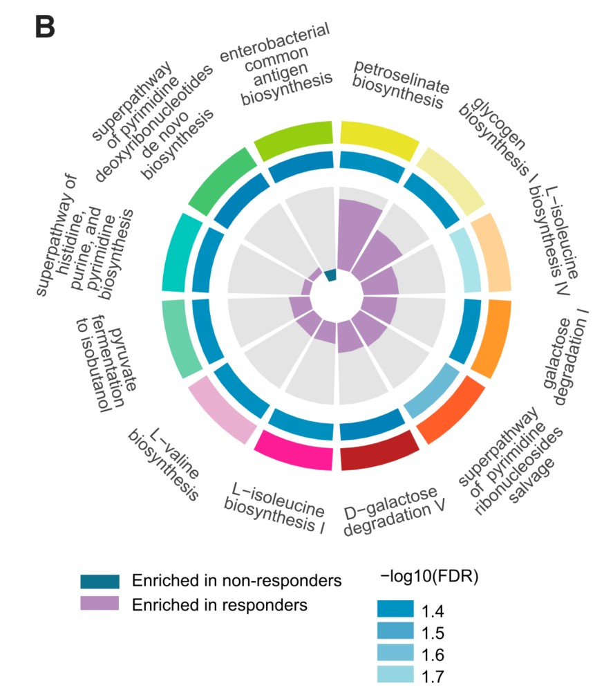
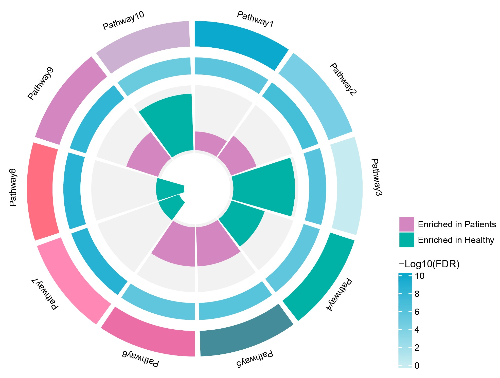

```{r setup, include=FALSE}
knitr::opts_chunk$set(
  collapse = T, echo=T, comment="#>", message=F, warning=F,
	fig.align="center", fig.width=5, fig.height=3, dpi=150)
```


The Ring and pie plot scripts is referenced from MicrobiomeStatPlot [Inerst Reference below].


If you use this script, please cited 如果你使用本代码，请引用：

**Yong-Xin Liu**, Lei Chen, Tengfei Ma, Xiaofang Li, Maosheng Zheng, Xin Zhou, Liang Chen, Xubo Qian, Jiao Xi, Hongye Lu, Huiluo Cao, Xiaoya Ma, Bian Bian, Pengfan Zhang, Jiqiu Wu, Ren-You Gan, Baolei Jia, Linyang Sun, Zhicheng Ju, Yunyun Gao, **Tao Wen**, **Tong Chen**. 2023. EasyAmplicon: An easy-to-use, open-source, reproducible, and community-based pipeline for amplicon data analysis in microbiome research. **iMeta** 2(1): e83. https://doi.org/10.1002/imt2.83

The online version of this tuturial can be found in https://github.com/baidefeng/MicrobiomeStatPlot/tree/master/3.Visualization_and_interpretation


**Authors**
First draft(初稿)：Defeng Bai(白德凤)；Proofreading(校对)：Ma Chuang(马闯) and Xun Jiani(荀佳妮)；Text tutorial(文字教程)：Defeng Bai(白德凤)


# Introduction简介

环状图和饼状图的组合能够用于组间差异的展示，如和利用外圈环状图展示差异的功能通路，内圈展示功能通路差异的组间p值，并用颜色区分是上升或下降。

The combination of ring charts and pie charts can be used to display differences between groups, such as using the outer ring chart to display the different functional pathways, the inner ring to display the p-values between groups of the functional pathway differences, and using colors to distinguish whether they are rising or falling.


关键字：微生物组数据分析、MicrobiomeStatPlot、环图结合饼图、R语言可视化

Keywords: Microbiome analysis, MicrobiomeStatPlot, Ring and pie plot, R visulization


## Ring and pie plot example环图结合饼图案例

环图结合饼图展示疾病组和健康组KEGG功能通路差异
Circle chart showing the differences in KEGG functional pathways between the disease group and the healthy group 


本文是上海交通大学Chen Haoyan课题组于2023年发表于Cell Host & Microbe上的一篇文章用到的圆圈图，展示KEGG功能通路差异。题目为：Multi-kingdom gut microbiota analyses define bacterial-fungal interplay and microbial markers of pan-cancer immunotherapy across cohorts. https://doi.org/10.1016/j.chom.2023.10.005

This article is a circle chart used by Chen Haoyan's research group at Shanghai Jiao Tong University in an article published in Cell Host&Microbe in 2023, showcasing the differences in KEGG functional pathways. The title is: Multi kingdom gut microbiota analyses define bacterial empty interplay and microbial markers of pan cancer immune across cohorts. https://doi.org/10.1016/j.chom.2023.10.005




Figure 6 (B) Differentially abundant pathways between responders and non-responders when pooling 4 datasets with anti-PD-1 monotherapy. The inner circle shows the generalized fold change of pathways. The median circle shows -log10(FDR) value. The significance was determined using Wilcoxon rank-sum test blocked for study, and p values were adjusted by FDR method.
图 6 (B)将 4 个抗 PD-1 单药治疗的数据集汇总后，应答者和非应答者之间存在不同的丰富通路。内圈表示通路的广义折叠变化。中值圆表示-log10(FDR)值。显著性采用 Wilcoxon 秩和检验进行判定，P 值采用 FDR 方法进行调整。

原文描述：At the pathway level, petroselinate biosynthesis and glycogen biosynthesis showed the highest enrichment in responders (Figure 6B).
在通路水平上，反应物中岩榆酸生物合成和糖原生物合成的富集程度最高（图 6B）。


## Packages installation软件包安装

```{r}
# 基于CRAN安装R包，检测没有则安装
p_list = c("dplyr", "purrr", "circlize")
for(p in p_list){if (!requireNamespace(p)){install.packages(p)}
    library(p, character.only = TRUE, quietly = TRUE, warn.conflicts = FALSE)}

# 基于Bioconductor安装R包
if (!requireNamespace("DESeq2", quietly = TRUE))
    BiocManager::install("DESeq2")

# 基于github安装
library(devtools)
if(!requireNamespace("ComplexHeatmap", quietly = TRUE))
  install_github("jokergoo/ComplexHeatmap")

# 加载R包 Load the package
suppressWarnings(suppressMessages(library(dplyr)))
suppressWarnings(suppressMessages(library(purrr)))
suppressWarnings(suppressMessages(library(DESeq2)))
suppressWarnings(suppressMessages(library(circlize)))
suppressWarnings(suppressMessages(library(ComplexHeatmap)))
```


## Ring and pie plot using R software环图结合饼图R语言实战

差异分析并计算Generalized fold change
Differential analysis and calculation of generalized fold change

```{r Ring and pie plot, fig.show='asis', fig.width=4, fig.height=2.5}
# Pathways功能通路
data <- read.table("data/pathway_raw.txt",header = TRUE,row.names = 1,sep = "\t")
group <- read.table("data/group.txt",header = FALSE,sep = "\t")
group = group[-1,]

# 统计
# Statistics
row=as.numeric(length(row.names(data)))
col=as.numeric(length(colnames(data)))
col_sum=rep(colSums(data), row)
col_sum=matrix(col_sum, nrow = col, ncol = row)
data2=data/t(col_sum)
data22 = data2

data2 = log10(data2 + 1e-8)
data3 = apply(data2, 1, function(x){
  return((x-mean(x))/sd(x))
})
data3 = t(data3)
data <- t(data3)
data1 <- data.frame(data,group$V2)
colnames(data1) <- c(colnames(data),"Group")
data1$Group <- as.factor(data1$Group)

# wilcox test(差异检验)
diff <- data1 %>% 
    select_if(is.numeric) %>%
    map_df(~ broom::tidy(wilcox.test(. ~ Group,data = data1, conf.int = TRUE)), .id = 'var')
diff$padjust <- p.adjust(diff$p.value,"BH")

feat.all1 <- data22
feat.all2 <- feat.all1
feat.all2 <- as.matrix(feat.all2)

meta = group
colnames(meta) <- c("Sample_ID", "group")
rownames(meta) <- meta$Sample_ID

# 计算gFC(Calculate generalized fold change)
result_list <- list()
for (f in row.names(feat.all2)) {
  # other metrics
  x <- feat.all2[f, meta %>% filter(group=='Patients') %>% pull(Sample_ID)]
  y <- feat.all2[f, meta %>% filter(group=='Healthy') %>% pull(Sample_ID)]
  
  # FC
  q.p <- quantile(log10(x+1e-8), probs=seq(.1, .9, .05))
  q.n <- quantile(log10(y+1e-8), probs=seq(.1, .9, .05))
  fc <- sum(q.p - q.n)/length(q.p)
  #print(fc)
  result_list[f] <- list(col1 = fc)
}
result_df2 <- do.call(rbind, lapply(result_list, data.frame))
colnames(result_df2) <- c("gFC")

diff2 <- diff
diff2$gFC <- result_df2$gFC

#res2 <- res[c(-1,-2), ]
res2 <- diff2
rownames(res2) <- res2$var
res2$gFC <- result_df2$gFC
res2$log2gFC <- log2(res2$gFC+1)

# 火山图
# Volcano plot
DEG2<-res2
# logFC_cutoff<-2
gFC_cutoff <- 0.2
DEG2$change2<-as.factor(ifelse(DEG2$padjust<1e-2&abs(DEG2$gFC)>gFC_cutoff,
                             ifelse(DEG2$gFC>gFC_cutoff,"UP","DOWN"),
                             "NOT"))
this_title <- paste0('Cutoff for gFC is ',round(gFC_cutoff,3),
                     '\nThe number of up gene is ',nrow(DEG2[DEG2$change2 =='UP',]) ,
                     '\nThe number of down gene is ',nrow(DEG2[DEG2$change2 =='DOWN',]))
DEG2<-na.omit(DEG2)
library(ggplot2)
ggplot(data=DEG2,aes(x=gFC,
                    y=-log10(padjust),
                    color=change2))+
  geom_point(alpha=0.8,size=3)+
  labs(x="gFC")+ ylab("-log10 FDR")+
  ggtitle(this_title)+theme_bw(base_size = 20)+
  theme(plot.title = element_text(size=15,hjust=0.5),)+
  scale_color_manual(values=c('#a121f0','#bebebe','#ffad21')) -> p2
# p2
# write.csv(DEG2, "results/pathway_raw_difference_selectedO01.csv")
```


选取差异最显著的通路用圆圈图进行展示
Select the path with the most significant difference and display it in a circle chart

```{r Ring and pie plot2, fig.show='asis', fig.width=4, fig.height=2.5}
pdf("results/pathway_circle_plot3.pdf", height = 5, width = 7)
# 读取数据Load data(构建数据，不代表任何含义)
dat <- read.delim('data/pathway_patients.txt', sep = '\t', row.names = 1, stringsAsFactors = FALSE, check.names = FALSE)
# 首先排序，默认按照原表格中的排列顺序Sort first, default to the original order in the table
dat$Path2 <- factor(rownames(dat), levels = rownames(dat))

# 整体布局Overall layout
circos.par(gap.degree = 2, #gap.after = 2, 
           track.margin = c(0.04, 0.01), 
           start.degree = 90)
# 第一圈，绘制 ko First circle, draw ko
plot_data <- dat[c('Path2','gene_num_min', 'gene_num_max')]

#Set color
ko_color <- c('#0ca9ce', '#78cfe5', '#c6ecf1','#00b1a5', "#448c99",'#eb6fa6', '#ff88b5','#ff6f81', '#d386bf','#cdb1d2', '#ff9c8f', '#ffc2c0','#fae6f0')
 
circos.genomicInitialize(plot_data, plotType = NULL, major.by = 1)  #Overall layout
circos.track(
    # 圈图的高度、颜色等设置
    # The height, color, and other settings of the circle chart
    ylim = c(0, 1), track.height = 0.15, bg.border = NA, bg.col = ko_color,  
    panel.fun = function(x, y) {
        # ylim、xlim 用于指定 ko id 文字标签添加的合适坐标
        # Ylim and xlim are used to specify the appropriate coordinates for adding ko id text labels
        ylim = get.cell.meta.data('ycenter')  
        xlim = get.cell.meta.data('xcenter')
        # sector.name 用于提取 ko id 名称
        # Sector.name is used to extract the ko id name
        sector.name = get.cell.meta.data('sector.index')  
        # circos.axis(h = 'top', labels.cex = 0.4, major.tick.percentage = 0.4, labels.niceFacing = FALSE)  #绘制外周的刻度线(Draw outer scale lines)
        # 将 ko id 文字标签添加在图中指定位置处
        # Add the ko id text label to the designated location in the image
        circos.text(xlim, ylim, sector.name, cex = 0.4, niceFacing = FALSE)  
    } )

# 第二圈，绘制富集的基因和富集 p 值
# In the second circle, draw the enriched genes and enriched p-values
plot_data <- dat[c('ko.id', 'gene_num_min', 'gene_num_rich', 'log10p')]

# 标签数据集，仅便于作图时添加相应的文字标识用
# Label dataset, for the purpose of adding corresponding text labels during drawing
label_data <- dat['gene_num_rich']  

# 定义一个 p 值的极值，以方便后续作图
# Define an extremum of p-value to facilitate subsequent plotting
p_max <- round(max(dat$'log10p')) + 1 

# 这两句用于定义 p 值的渐变颜色
# These two sentences are used to define the gradient color of the p-value
colorsChoice <- colorRampPalette(c('#c6ecf1', '#0ca9ce')) 
color_assign <- colorRamp2(breaks = 0:p_max, col = colorsChoice(p_max + 1))
 
circos.genomicTrackPlotRegion(
    # 圈图的高度、颜色等设置(The height, color, and other settings of the circle chart)
    plot_data, track.height = 0.13, bg.border = NA, stack = TRUE,  
    panel.fun = function(region, value, ...) {
        # 区块的长度反映了富集基因的数量，颜色与 p 值有关
        # The length of the block reflects the number of enriched genes, and the color is related to the p-value
        circos.genomicRect(region, value, col = color_assign(value[[1]]), border = NA, ...)
        # 同上文，ylim、xlim、sector.name 等用于指定文字标签（富集基因数量）添加的合适坐标
        # As mentioned earlier, ylim, xlim, sector.name, etc. are used to specify the appropriate coordinates for adding text labels (enriching the number of genes)
        ylim = get.cell.meta.data('ycenter')  
        xlim = label_data[get.cell.meta.data('sector.index'),1] / 2
        sector.name = label_data[get.cell.meta.data('sector.index'),1]
        #circos.text(xlim, ylim, sector.name, cex = 0.4, niceFacing = FALSE) 
    } )

# 第四圈，绘制富集因子
# Fourth circle, draw enrichment factors
plot_data <- dat[c('Path2','gene_num_min', 'gene_num_max', 'gFC')]  
# 将通路的分类信息提取出，和下一句一起，便于作图时按分组分配颜色
# Extract the classification information of the pathway and combine it with the next sentence to facilitate color allocation by grouping during drawing
label_data <- dat['change3'] 
color_assign <- c("UP" = "#d386bf", "DOWN" = "#00b1a5")

circos.genomicTrack(
    plot_data, ylim = c(0, 1), track.height = 0.4,  bg.col = 'gray95', bg.border = NA, 
    panel.fun = function(region, value, ...) {
        sector.name = get.cell.meta.data('sector.index') 
        circos.genomicRect(region, value, col = color_assign[label_data[sector.name,1]], border = NA, ytop.column = 1, ybottom = 0, ...)
    })
dev.off()

pdf("results/pathway_circle_plot_legend.pdf", height = 3, width = 2)
updown_legend <- Legend(
    labels = c('Enriched in Patients', 'Enriched in Healthy'), 
    type = 'points', pch = NA, background = c('#d386bf', '#00b1a5'), 
    labels_gp = gpar(fontsize = 8), grid_height = unit(0.5, 'cm'), grid_width = unit(0.5, 'cm'))
pvalue_legend <- Legend(
    col_fun = colorRamp2(round(seq(0, p_max, length.out = 6), 0), 
    colorRampPalette(c('#c6ecf1', '#0ca9ce'))(6)),
    legend_height = unit(3, 'cm'), labels_gp = gpar(fontsize = 8), 
    title_gp = gpar(fontsize = 9), title_position = 'topleft', title = '-Log10(FDR)')
lgd_list_vertical <- packLegend(updown_legend, pvalue_legend)
grid.draw(lgd_list_vertical)
dev.off()
```





If used this script, please cited:
使用此脚本，请引用下文：

**Yong-Xin Liu**, Lei Chen, Tengfei Ma, Xiaofang Li, Maosheng Zheng, Xin Zhou, Liang Chen, Xubo Qian, Jiao Xi, Hongye Lu, Huiluo Cao, Xiaoya Ma, Bian Bian, Pengfan Zhang, Jiqiu Wu, Ren-You Gan, Baolei Jia, Linyang Sun, Zhicheng Ju, Yunyun Gao, **Tao Wen**, **Tong Chen**. 2023. EasyAmplicon: An easy-to-use, open-source, reproducible, and community-based pipeline for amplicon data analysis in microbiome research. **iMeta** 2: e83. https://doi.org/10.1002/imt2.83

Copyright 2016-2024 Defeng Bai <baidefeng@caas.cn>, Chuang Ma <22720765@stu.ahau.edu.cn>, Jiani Xun <15231572937@163.com>, Yong-Xin Liu <liuyongxin@caas.cn>

