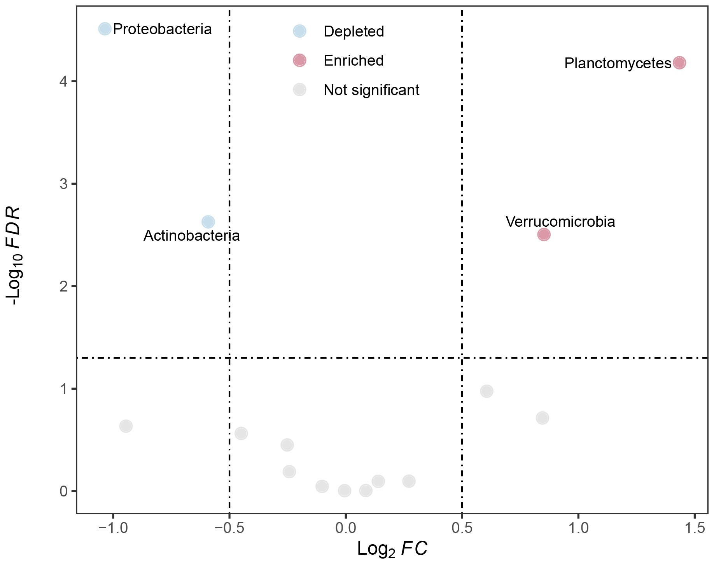
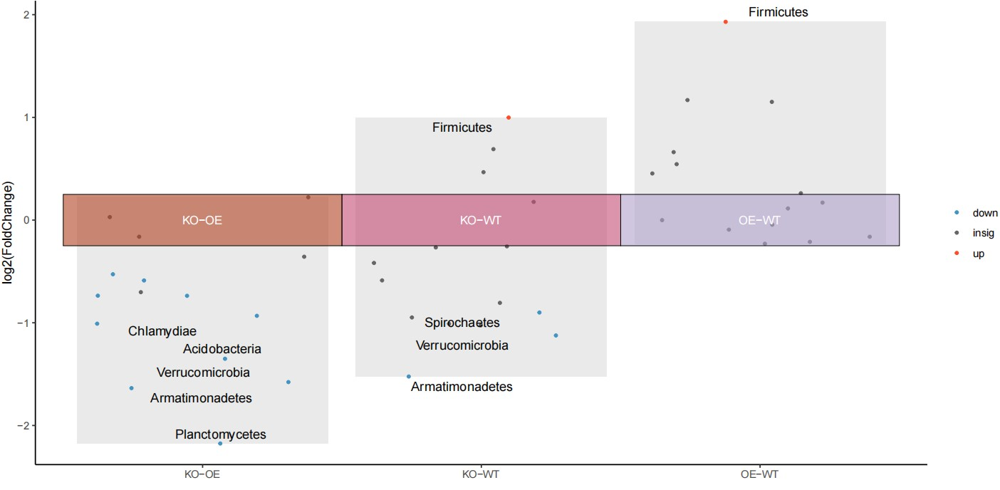

```{r setup, include=FALSE}
knitr::opts_chunk$set(
  collapse = T, echo=T, comment="#>", message=F, warning=F,
	fig.align="center", fig.width=5, fig.height=3, dpi=150)
```


The Difference analysis volcano plot scripts is referenced from MicrobiomeStatPlot [Inerst Reference below].

If you use this script, please cited 如果你使用本代码，请引用：

**Yong-Xin Liu**, Lei Chen, Tengfei Ma, Xiaofang Li, Maosheng Zheng, Xin Zhou, Liang Chen, Xubo Qian, Jiao Xi, Hongye Lu, Huiluo Cao, Xiaoya Ma, Bian Bian, Pengfan Zhang, Jiqiu Wu, Ren-You Gan, Baolei Jia, Linyang Sun, Zhicheng Ju, Yunyun Gao, **Tao Wen**, **Tong Chen**. 2023. EasyAmplicon: An easy-to-use, open-source, reproducible, and community-based pipeline for amplicon data analysis in microbiome research. **iMeta** 2(1): e83. https://doi.org/10.1002/imt2.83

The online version of this tuturial can be found in https://github.com/YongxinLiu/MicrobiomeStatPlot


**Authors**
First draft(初稿)：Defeng Bai(白德凤)；Proofreading(校对)：Ma Chuang(马闯) and Jiani Xun(荀佳妮)；Text tutorial(文字教程)：Defeng Bai(白德凤)


# Introduction简介

火山图（Volcano Plot）是一种用于可视化基因表达或其他高通量数据中显著性和效应大小的图形工具。它通过将每个基因或特征的显著性（通常是负对数转换的p值）与效应大小（通常是折叠变化，log2FC，也可以是其它效应值）相结合，帮助研究人员快速识别出在实验中显著变化的基因或特征。火山图的特点：X轴：通常表示效应大小（如log2折叠变化），反映了不同条件下的差异。Y轴：表示显著性（通常是-log10(p值)），越高的值表示越显著的结果。点的颜色和形状：不同颜色或形状的点可以表示不同的基因组类别或显著性水平，帮助快速识别上调和下调的物种或基因。火山图的优点包括直观显示哪些基因或特征在比较中显著变化，可以同时显示多个变量，便于综合分析，适用于大规模基因组数据的探索性分析。

The Volcano Plot is a graphical tool for visualizing significance and effect sizes in gene expression or other high-throughput data. It helps researchers quickly identify each gene or feature by combining significance (usually a negative log-transformed p-value) with an effect size (usually a fold change, log2FC, but other effect sizes are also possible) Genes or traits that change significantly in experiments. Features of volcano plots: X-axis: usually represents the effect size (such as log2 fold change), reflecting the difference under different conditions. Y-axis: indicates significance (usually -log10 (p value)), with higher values indicating more significant results. Point color and shape: Points of different colors or shapes can represent different genome categories or significance levels, helping to quickly identify up- and down-regulated species or genes. The advantages of volcano plots include visually displaying which genes or features change significantly in comparisons, being able to display multiple variables at the same time, facilitating comprehensive analysis, and being suitable for exploratory analysis of large-scale genomic data.


关键字：微生物组数据分析、MicrobiomeStatPlot、差异分析火山图、R语言可视化

Keywords: Microbiome analysis, MicrobiomeStatPlot, Difference analysis volcano plot , R visulization


## Difference analysis volcano plot example 差异分析火山图案例


这是香港中文大学Siew C. Ng课题组2024年发表于Nature Microbiology上的一篇论文，论文题目为：Multikingdom and functional gut microbiota markers for autism spectrum disorder. https://doi.org/10.1038/s41564-024-01739-1

This is a paper published in Nature Microbiology in 2024 by Siew C. Ng's group at the Chinese University of Hong Kong. The title of the paper is: Multikingdom and functional gut microbiota markers for autism spectrum disorder. https://doi.org/10.1038/s41564-024-01739-1


Fig. 1 d, Volcano plots show the associations between multikingdom (archaea, bacteria, fungi and viruses) species and ASD calculated using MaAsLin2 after adjusting for significant confounders. Associations with FDR < 0.05 were considered as significant and marked in red (enriched in ASD) or blue (depleted in ASD). Top-ranked species are labelled with name.

图 1d，火山图显示了使用 MaAsLin2 计算的多界（古菌、细菌、真菌和病毒）物种与 ASD 之间的关联，该关联在调整了显著混杂因素后得到。FDR < 0.05 的关联被视为显著，并标记为红色（ASD 丰富）或蓝色（ASD 贫乏）。排名靠前的物种标有名称。


**结果**

A total of 14 archaeal, 51 bacterial, 7 fungal and 18 viral species showed differential abundances between children considered neurotypical and children with ASD (Fig. 1d). The relative abundance of 80 out of 90 identified microbial species was found to be significantly decreased in children with ASD compared with children considered neurotypical (Fig. 1d). This finding was most pronounced for the bacterial communities, where 50 bacterial species were depleted in children with ASD whereas only one bacteria species was enriched (Fig. 1d). Alterations in bacterial species in children with ASD were driven by the depletion of Streptococcus thermophilus and short-chain fatty acids-producing bacteria, such as Bacteroides sp. PHL2737 and Lawsonibacter asaccharolyticus.

总共有 14 种古细菌、51 种细菌、7 种真菌和 18 种病毒在神经正常儿童和 ASD 儿童之间表现出不同的丰度（图 1d）。与神经正常儿童相比，在 90 种已鉴定的微生物物种中，有 80 种在 ASD 儿童中的相对丰度显著降低（图 1d）。这一发现在细菌群落中最为明显，ASD 儿童中有 50 种细菌减少了，而只有一种细菌增加了（图 1d）。ASD 儿童细菌种类的变化是由于嗜热链球菌和产生短链脂肪酸的细菌（如拟杆菌属 PHL2737 和不解糖劳森杆菌）的减少所致。


## Packages installation软件包安装

```{r}
# 基于CRAN安装R包，检测没有则安装 Installing R packages based on CRAN and installing them if they are not detected
p_list = c("ggplot2", "ggVolcano", "dplyr")
for(p in p_list){if (!requireNamespace(p)){install.packages(p)}
    library(p, character.only = TRUE, quietly = TRUE, warn.conflicts = FALSE)}

# install.packages("devtools")
# 基于github安装
library(devtools)
if(!requireNamespace("ggVolcano", quietly = TRUE))
  install_github("BioSenior/ggvolcano")

# 加载R包 Loading R packages
suppressWarnings(suppressMessages(library(ggVolcano)))
suppressWarnings(suppressMessages(library(dplyr)))
suppressWarnings(suppressMessages(library(ggplot2)))
```


# Difference analysis volcano plot 差异分析火山图

### Two-group difference analysis volcano plot（两组差异分析火山图）

```{r two_group difference analysis volcano plot, fig.show='asis', fig.width=4, fig.height=2.5}
# load data
# 这里使用的数据是DESeq2前面分析得到的结果(The data used here is the result of the previous analysis of DESeq2)
data_vol <-read.table("data/data_volcano.txt",header=T,sep="\t",row.names=1)
data_vol = as.data.frame(data_vol)
# use add_regulate function to add a regulate column to the DEG result data. 
data <- add_regulate(data_vol, log2FC_name = "log2FC",
                     fdr_name = "padj",log2FC = 1, fdr = 0.05)
#data <- data[, -6]
data$regulate <- data_vol$association
colnames(data)[3] <- "FoldChange"
data$padj2 <- -log10(as.numeric(data$padj))

#logFC = 0.5
#P.Value = 0.05
p_volcano1 <- ggplot(data = data, ggplot2::aes(x = FoldChange, y = padj2)) +
  geom_point(alpha = 0.4, size = 3.0, ggplot2::aes(color = regulate)) + 
  ylab("-log10(Pvalue)") +
  scale_color_manual(values = c("#74add1","#a60026", "grey")) +
#scale_color_manual(values = c("#4177a4","#b33e5b", "grey")) +
  #scale_color_manual(values = c("#81CBAB","#854888", "grey")) +
  geom_vline(xintercept = c(-0.5, 0.5), lty = 4, col = "black", lwd = 0.4) + 
  geom_hline(yintercept = -log10(0.05), lty = 4, col = "black", lwd = 0.4) + 
  labs(x = bquote(Log[2]~italic(FC)), y= bquote(atop(-Log[10]~italic(FDR))))+
  ggplot2::theme_bw()

# add labels
# select top 5 enriched species
up_data1 <- filter(data, data$regulate == "Enriched")
up_data2 <- dplyr::arrange(up_data1, dplyr::desc(up_data1$padj2))
up_data_5 <- up_data2[1:5, ] 
  
# select top 25 depleted species
down_data1 <- filter(data, data$regulate == "Depleted")
down_data2 <- dplyr::arrange(down_data1, desc(down_data1$padj2))
down_data_25 <- down_data2[1:5, ] 

# using geom_text_repel() to add labels
library(ggrepel)
p_volcano2 <- p_volcano1 +  
  geom_text_repel(data = up_data_5, ggplot2::aes(x = FoldChange, 
                                        y = padj2, 
                                        label = up_data_5$row), size = 3) + 
  geom_text_repel(data = down_data_25, ggplot2::aes(x = FoldChange, 
                                           y = padj2, 
                                           label = down_data_25$row), size = 3)+  
  theme(legend.position = c(0.84, 0.85),panel.grid = element_blank())
ggplot2::ggsave(paste("results/Two_group_volcano_plot",".pdf", sep=""), 
       p_volcano2, width=100 * 1.5, height=80 * 1.5, unit='mm')
#p_volcano2
```





### Multi-group difference analysis volcano plot（多组差异分析火山图）

```{r multi_group difference analysis volcano plot, fig.show='asis', fig.width=4, fig.height=2.5}
# 导入数据
# Load data
otutab2 <- read.table("data/otutab2.txt", header=T, row.names=1, sep="\t", comment.char="", stringsAsFactors = F)
design <- read.delim(file = "data/metadata2.txt", sep = '\t', stringsAsFactors = FALSE)
rownames(design) <- design$SampleID

# Phylum level
# 门水平统计，如果要分析其它分类级别，自行调整
otutab_p <- otutab2[, c(2, 8:25)]
otutab_p2 <- aggregate(. ~ Phylum, data = otutab_p, sum)
rownames(otutab_p2) <- otutab_p2$Phylum
otutab_p2 <- otutab_p2[, -1]

# 自定义函数进行比较
# Compare functions
run_wilcox_test <- function(data, design, compare_pair) {
    group_list <- strsplit(compare_pair, "-")[[1]]
    idx <- rownames(design) %in% colnames(data)
    metadata <- design[idx, , drop = FALSE]
    data <- data[, rownames(metadata)]
    
    norm <- t(t(data) / colSums(data, na = TRUE) * 100)
    idx <- rowMeans(norm) > 0.01
    norm <- norm[idx, ]
    
    idx <- metadata$Group %in% group_list
    sub_metadata <- metadata[idx, , drop = FALSE]
    
    GroupA <- norm[, rownames(sub_metadata[sub_metadata$Group == group_list[1], , drop = FALSE])]
    GroupB <- norm[, rownames(sub_metadata[sub_metadata$Group == group_list[2], , drop = FALSE])]
    
    nrDAF <- data.frame(Phylum = rownames(norm), logFC = NA, logCPM = NA, PValue = NA)
    
    for (i in 1:nrow(nrDAF)) {
        FC <- (mean(GroupA[i, ], na.rm = TRUE) + 1e-07) / (mean(GroupB[i, ], na.rm = TRUE) + 1e-07)
        nrDAF$logFC[i] <- log2(FC)
        nrDAF$logCPM[i] <- log2(max(c(GroupA[i, ], GroupB[i, ], na.rm = TRUE)) * 10000)
        nrDAF$PValue[i] <- suppressWarnings(wilcox.test(as.numeric(GroupA[i, ]), as.numeric(GroupB[i, ]))$p.value)
    }
    
    nrDAF$FDR <- p.adjust(nrDAF$PValue, method = "fdr")
    nrDAF$compared_group <- compare_pair
    return(nrDAF)
}

# 运行比较
# Run functions
results1 <- run_wilcox_test(otutab_p2[, 1:12], design[1:12, ], "KO-OE")
results2 <- run_wilcox_test(otutab_p2[, c(1:6, 13:18)], design[c(1:6, 13:18), ], "KO-WT")
results3 <- run_wilcox_test(otutab_p2[, 7:18], design[7:18, ], "OE-WT")

# 合并结果
# Combine results
dat2 <- rbind(results1, results2, results3)


# 第一种绘图方式(First way)
# 数据整理和准备
# Reshaping data
log2Foldchange=0.28
adjp=0.1
dat.plot <- dat2 %>% ggpubr::mutate(
  "significance"=case_when(FDR < adjp & logFC>= log2Foldchange  ~ 'up',
                     FDR < adjp &logFC<= -log2Foldchange  ~ 'down',
                     TRUE ~ 'insig'))

# Referring the levels of x axis
dat.plot$compared_group <- factor(dat.plot$compared_group,
                                  levels = c("KO-OE",
                                             "KO-WT",
                                             "OE-WT"))

# 设置背景及需要标记的数据
# Reshaping data for geom_col function
top_marker=5
background.dat <- data.frame(
  dat.plot %>% group_by(compared_group) %>% filter(logFC>0) %>% 
    dplyr::summarise("y.localup"=max(logFC)),
  dat.plot %>% group_by(compared_group) %>% filter(logFC<0) %>% 
    dplyr::summarise("y.localdown"=min(logFC)),
  x.local=seq(1:length(unique(dat.plot$compared_group)))
) %>% select(-compared_group.1)
names(background.dat)

# 整理数据
# Prepare data
x.number <- background.dat %>% select(compared_group,x.local) 
dat.plot <- dat.plot%>% left_join(x.number,by = "compared_group")
names(dat.plot)
# selecting top-up and top-down proteins
dat.marked.up <- dat.plot %>% filter(significance=="up") %>% 
  group_by(compared_group) %>% plyr::arrange(-logFC) %>% 
  top_n(top_marker,abs(logFC))
dat.marked.down <- dat.plot %>% filter(significance=="down") %>% 
  group_by(compared_group) %>% plyr::arrange(logFC) %>% 
  top_n(top_marker,abs(logFC))
dat.marked <- dat.marked.up %>% bind_rows(dat.marked.down)
# referring group information data
dat.infor <- background.dat %>% 
  ggpubr::mutate("y.infor"=rep(0,length(compared_group)))
names(dat.infor)

# Plot
# 绘图
max_overlaps=10
vol.plot <- ggplot()+
  geom_col(background.dat,mapping=ggplot2::aes(x.local,y.localup),
           fill="grey50",alpha=0.2,width=0.9,just = 0.5)+
  geom_col(background.dat,mapping=ggplot2::aes(x.local,y.localdown),
           fill="grey50",alpha=0.2,width=0.9,just = 0.5)+
  geom_jitter(dat.plot,mapping=ggplot2::aes(x.local,logFC,
                                   color=significance,
                                   fill=significance),
              size=1.5,width = 0.4,alpha= 0.4)+
  scale_color_manual(values = c("#82677e","#eaebea","#59829e"))+
  geom_tile(dat.infor,mapping=ggplot2::aes(x.local,y.infor,fill=compared_group,
                                  color = compared_group),
            height=log2Foldchange*1.5,
            color = unique(dat.plot$compared_group),
            alpha = 0.6,
            width=0.9)+guides(size=guide_legend(title="Count"))+ 
  labs(x=NULL,y="log2 Fold change")+
  geom_text(dat.infor,mapping=ggplot2::aes(x.local,y.infor,label=compared_group))+
  ggrepel::geom_label_repel(dat.marked.up,mapping=ggplot2::aes(x.local,logFC,label=Phylum,color=significance),
                            force = 2,size=2, 
                            max.overlaps = max_overlaps,
                            seed = 233,
                            min.segment.length = 0,
                            force_pull = 2,
                            box.padding = 0.1,
                            segment.linetype = 3, 
                            segment.color = 'black', 
                            segment.alpha = 0.5, 
                            direction = "x", 
                            hjust = 0.5)+
  ggrepel::geom_label_repel(dat.marked.down,mapping=ggplot2::aes(x.local,logFC,label=Phylum,color=significance),
                            force = 2,size=2, 
                            max.overlaps = max_overlaps,
                            seed = 233,
                            min.segment.length = 0,
                            force_pull = 2,
                            box.padding = 0.1,
                            segment.linetype = 3, 
                            segment.color = 'black', 
                            segment.alpha = 0.5, 
                            direction = "x", 
                            hjust = 0.5)+
  ggplot2::annotate("text", x=1.5, y=max(background.dat$y.localup)+2, 
           label=paste0("|log2FC|>=",log2Foldchange," & FDR<0.05"))+
  ggplot2::theme_classic()+
  theme(
    legend.spacing.x=unit(0.1,'cm'),
    legend.key.width=unit(0.5,'cm'),
    legend.key.height=unit(0.5,'cm'),
    legend.background=element_blank(),
    legend.box="horizontal",
    legend.position = c(0.15,0.72),legend.justification = c(1,0)
    )
#vol.plot
#saving plot as png and pdf
filename = paste("results/Multi_group_vol01.pdf",sep = "")
ggplot2::ggsave(filename,vol.plot,width = 12,height = 6,limitsize = FALSE)


## 第二种绘图方式(Another way to draw)
# Data preparation
# 准备数据
log2Foldchange=0.28
adjp=0.1
dat.plot <- dat2 %>% ggpubr::mutate(
  "significance"=case_when(FDR < adjp & logFC>= log2Foldchange  ~ 'up',
                     FDR < adjp &logFC<= -log2Foldchange  ~ 'down',
                     TRUE ~ 'insig'))

# Referring the levels of x axis
dat.plot$compared_group <- factor(dat.plot$compared_group,
                                  levels = c("KO-OE",
                                             "KO-WT",
                                             "OE-WT"))
dat.plot$ID = row.names(dat.plot)
datv = dat.plot
datv$group <- datv$compared_group
# The for loop selects the top 5 gene symbols of each cluster
tm.g <- function(data){
  id = data$group %>% unique()
  for (i in 1:length(id)) {
      tem = filter(data,group==id[i],significance != "insig") %>% 
        distinct(ID,.keep_all = TRUE) %>% 
        top_n(5,abs(logFC))
      if (i == 1) {
        tem2 = tem
      } else {
        tem2 = rbind(tem2,tem)
      }
    }
    return(tem2)
  }
top <- tm.g(datv)
# First draw the background column, and determine it according to the max and min values of the log2FC data.
# head(datv)

tem = datv %>% group_by(group) %>% dplyr::summarise(max = max(logFC),min = min(logFC)) %>% as.data.frame()
col1<-data.frame(x=tem$group,
                   y=tem$max)
col2<-data.frame(x=tem$group,
                   y=tem$min)

# Draw the background column(绘制背景)
p1 <- ggplot()+
    geom_col(data = col1,
             mapping = ggplot2::aes(x = x,y = y),
             fill = "#dcdcdc",alpha = 0.6)+
    geom_col(data = col2,
             mapping = ggplot2::aes(x = x,y = y),
             fill = "#dcdcdc",alpha = 0.6)
# p1

# Overlay the scatter volcano map on the background column
# 将散点火山图叠加在背景柱上
# head(datv)
p2 <- ggplot()+
    geom_col(data = col1,
             mapping = ggplot2::aes(x = x,y = y),
             fill = "#dcdcdc",alpha = 0.6)+
    geom_col(data = col2,
             mapping = ggplot2::aes(x = x,y = y),
             fill = "#dcdcdc",alpha = 0.6)+
    geom_jitter(data = datv,
                ggplot2::aes(x =group , y = logFC, color =significance ),
                size = 1,
                width =0.4)+
    scale_color_manual(name=NULL,
                       values = c("#4393C3","grey40","#FC4E2A"))+
    labs(x="",y="log2(FoldChange)")
#p2

# Add grouped color block labels to the X-axis
# 将分组色块标签添加到 X 轴
dfcol<-data.frame(x=tem$group,
                    y=0,
                    label=tem$group)
# Add grouped color block labels
dfcol$group <- tem$group

# Load color packages
library(RColorBrewer)
library(MetBrewer)
# BiocManager::install("MetBrewer")
# Set color
tile_color <- met.brewer("Thomas",length(tem$group))
  
# Inlaying color blocks in the image
# 修改颜色
p3 <- p2 + geom_tile(data = dfcol,
                       ggplot2::aes(x=x,y=y),
                       height=0.5,
                       color = "black",
                       fill = tile_color,
                       alpha = 0.6,
                       show.legend = F)+
  geom_text(data=dfcol,
              ggplot2::aes(x=x,y=y,label=group),
              size =3.5,
              color ="white") + ggplot2::theme_classic()
#p3

# 添加标签
# Add labels
library(ggrepel)
p4<-p3+geom_text_repel(
    data=top,
    ggplot2::aes(x=group,y=logFC,label=Phylum),
    force = 1.2,
    arrow = arrow(length = unit(0.008, "npc"),
                  type = "open", ends = "last")
    )
#p4

# Remove background
# 去掉背景，保留纵坐标
p5 <- p4+
    ggplot2::theme_minimal()+
    theme(
      axis.title = element_text(size = 18,
                                color = "black",
                                face = "bold"),
      axis.line.y = element_line(color = "black",
                                 size = 1.2),
      axis.line.x = element_blank(),
      axis.text.x = element_blank(),
      panel.grid = element_blank(),
      legend.position = "top",
      legend.direction = "vertical",
      legend.justification = c(1,0),
      legend.text = element_text(size = 12)
    )
#p5

# return(list(p5,p3,datv,top))
p = p4
#p

filename = paste("results/Multi.group.volcano.pdf",sep = "")
ggplot2::ggsave(filename,p,width = 12,height = 6,limitsize = FALSE)

```





If used this script, please cited:
使用此脚本，请引用下文：

**Yong-Xin Liu**, Lei Chen, Tengfei Ma, Xiaofang Li, Maosheng Zheng, Xin Zhou, Liang Chen, Xubo Qian, Jiao Xi, Hongye Lu, Huiluo Cao, Xiaoya Ma, Bian Bian, Pengfan Zhang, Jiqiu Wu, Ren-You Gan, Baolei Jia, Linyang Sun, Zhicheng Ju, Yunyun Gao, **Tao Wen**, **Tong Chen**. 2023. EasyAmplicon: An easy-to-use, open-source, reproducible, and community-based pipeline for amplicon data analysis in microbiome research. **iMeta** 2: e83. https://doi.org/10.1002/imt2.83

Copyright 2016-2024 Defeng Bai <baidefeng@caas.cn>, Chuang Ma <22720765@stu.ahau.edu.cn>, Jiani Xun <15231572937@163.com>, Yong-Xin Liu <liuyongxin@caas.cn>

