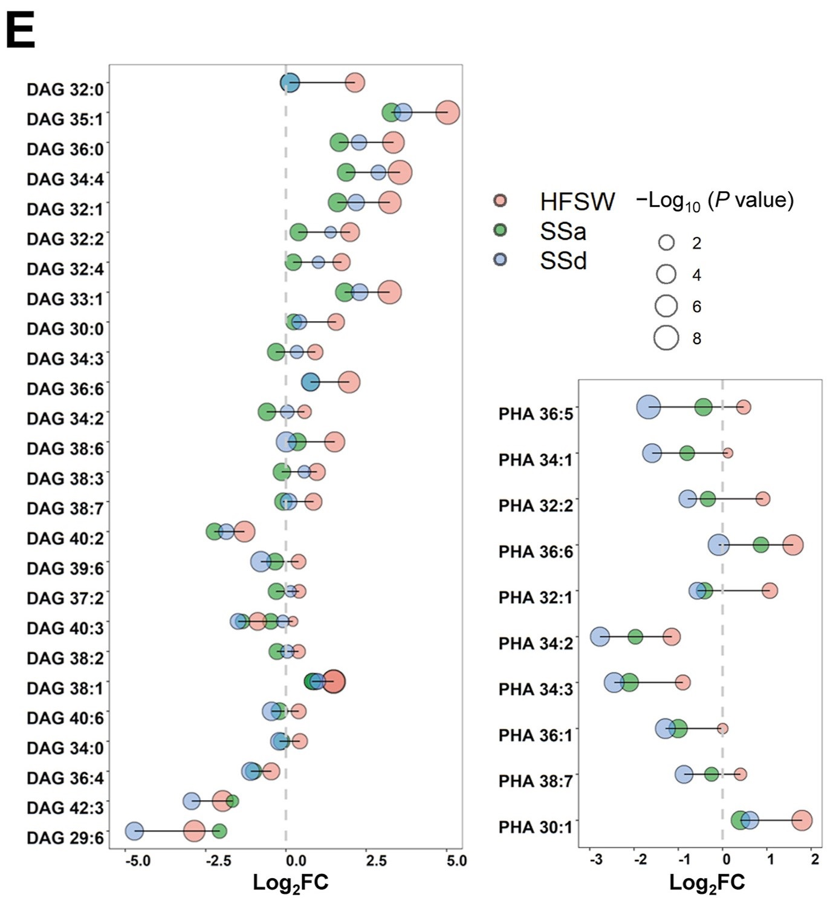
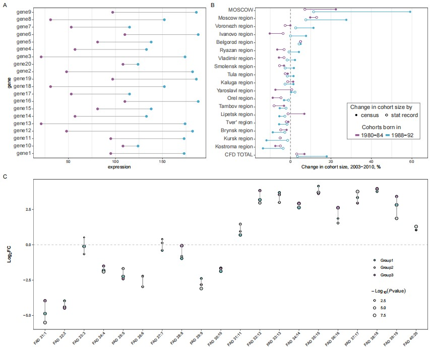

```{r setup, include=FALSE}
knitr::opts_chunk$set(
  collapse = T, echo=T, comment="#>", message=F, warning=F,
	fig.align="center", fig.width=5, fig.height=3, dpi=150)
```


The Dumbbells plot scripts is referenced from MicrobiomeStatPlot [Inerst Reference below].


If you use this script, please cited 如果你使用本代码，请引用：

**Yong-Xin Liu**, Lei Chen, Tengfei Ma, Xiaofang Li, Maosheng Zheng, Xin Zhou, Liang Chen, Xubo Qian, Jiao Xi, Hongye Lu, Huiluo Cao, Xiaoya Ma, Bian Bian, Pengfan Zhang, Jiqiu Wu, Ren-You Gan, Baolei Jia, Linyang Sun, Zhicheng Ju, Yunyun Gao, **Tao Wen**, **Tong Chen**. 2023. EasyAmplicon: An easy-to-use, open-source, reproducible, and community-based pipeline for amplicon data analysis in microbiome research. **iMeta** 2(1): e83. https://doi.org/10.1002/imt2.83

The online version of this tuturial can be found in https://github.com/YongxinLiu/MicrobiomeStatPlot

**Authors**
First draft(初稿)：Defeng Bai(白德凤)；Proofreading(校对)：Ma Chuang(马闯) and Jiani Xun(荀佳妮)；Text tutorial(文字教程)：Defeng Bai(白德凤)


# Introduction简介

什么是哑铃图？
What is dumbbells plot?

参考：https://mp.weixin.qq.com/s/cXi4H6-u9MCmYkoR_dau5w

哑铃图（Dumbbell Plot）是一种用于可视化两个时间点或条件之间的变化的图表类型。它通常用于比较两个或多个群体、类别或变量在不同时间点或条件下的表现。哑铃图的特点是在两个时间点或条件之间用线段连接两个点，形成一个类似哑铃的形状，从而清晰地显示出变化的趋势。

A dumbbell plot is a type of chart used to visualize changes between two points in time or conditions. It is typically employed to compare the performance of two or more groups, categories, or variables at different points in time or under different conditions. The key feature of a dumbbell plot is the use of a line segment to connect two points, creating a dumbbell-like shape that clearly illustrates the trend of change.


关键字：微生物组数据分析、MicrobiomeStatPlot、哑铃图、R语言可视化

Keywords: Microbiome analysis, MicrobiomeStatPlot, Dumbbells plot , R visulization


## Dumbbells plot example 哑铃图案例


这是北京中医药大学Runping Liu团队2021年发表于APSB上的一篇论文用到的图。论文题目为：Integrative lipidomic and transcriptomic study unravels the therapeutic effects of saikosaponins A and D on non-alcoholic fatty liver disease. https://doi.org/10.1016/j.apsb.2021.03.018

This is a picture used in a paper  published in APSB by Runping Liu's team from Beijing University of Chinese Medicine in 2021. The title of the paper is: Integrative lipidomic and transcriptomic study unravels the therapeutic effects of saikosaponins A and D on non-alcoholic fatty liver disease. https://doi.org/10.1016/j.apsb.2021.03.018




Figure 4. Effects of SSa and SSd on glycerollipid metabolism. 
图 4. SSa 和 SSd 对甘油脂代谢的影响。

**结果**

As shown in Fig. 4E and Supporting Information Fig. S6A, the lipidomic analysis revealed that DAG levels were significantly increased in HFSW-induced fatty liver, and both SSa and SSd significantly reversed intrahepatic DAG accumulation. Integrative analysis of transcriptomic and lipidomic data strongly suggested that the clearance of DAGs by SSa and SSd were attributed to the increased expression of TG and DAG hydrolyzing enzymes and decreased expression of DAG producing enzyme Lpin1. Furthermore, SSa and SSd significantly decreased the PHA contents in the fatty liver by 1.5–3-fold and thus contributed to the reduction of DAG levels, since PHA was also an important substrate for DAG synthesis (Fig. 4E and F, and Supporting Information Fig. S6B). These findings were also in accordance with SSa- and SSd-induced downregulation of Pnpla3, the enzyme catalyzing PHA production.

如图 4E 和佐证资料图 S6A 所示，脂质组分析表明，在 HFSW 诱导的脂肪肝中，DAG 水平显著升高，而 SSa 和 SSd 均能显著逆转肝内 DAG 的积累。转录组和脂质组数据的综合分析表明，SSa和SSd清除DAG的作用归因于TG和DAG水解酶表达的增加和DAG产生酶Lpin1表达的减少。此外，由于 PHA 也是 DAG 合成的重要底物，SSa 和 SSd 使脂肪肝中 PHA 的含量显著降低了 1.5-3 倍，从而促进了 DAG 含量的降低（图 4E 和 F，以及佐证资料图 S6B）。这些发现也与 SSa 和 SSd 诱导的 Pnpla3（催化 PHA 生成的酶）下调相一致。


## Packages installation软件包安装

```{r}
# 基于CRAN安装R包，检测没有则安装
p_list = c("ggalt", "reshape", "ggplot2", "ggalt", "tidyverse", "hrbrthemes", 
           "Cairo")
for(p in p_list){if (!requireNamespace(p)){install.packages(p)}
    library(p, character.only = TRUE, quietly = TRUE, warn.conflicts = FALSE)}

# 加载R包 Load the package
suppressWarnings(suppressMessages(library(ggalt)))
suppressWarnings(suppressMessages(library(reshape)))
suppressWarnings(suppressMessages(library(ggplot2)))
suppressWarnings(suppressMessages(library(tidyverse)))
suppressWarnings(suppressMessages(library(hrbrthemes)))
suppressWarnings(suppressMessages(library(Cairo)))
```


# Dumbells plot

## Dumbbells plot using R software 哑铃图R语言实战

参考：
https://mp.weixin.qq.com/s/cXi4H6-u9MCmYkoR_dau5w
https://mp.weixin.qq.com/s/Gs-xCRa9JB9GfEZkhz_kLA
https://gist.github.com/ikashnitsky/2f3e2b2af6f50911bb775bbce6eb0fb8

```{r Dumbbells plot, fig.show='asis', fig.width=4, fig.height=2.5}
# 单组哑铃图
# Single group dumbbells plot
# 构建数据
# Construct data
group1 <- sample(20:110, 10)
group2 <- sample(110:200, 10)
gene <- paste0("gene",1:20)
data <- data.frame(gene = gene,
                  group1 = group1,
                  group2 = group2)
# 绘图
# Plot
p1 <- ggplot(data, aes(y = gene, x = group1, xend = group2)) +
  geom_dumbbell(color = "darkgray",
                size = 0.5, 
                dot_guide = FALSE, 
                size_x = 2, 
                size_xend = 2,
                colour_x = "#945893", 
                colour_xend = "#46a9cb")+
  theme_bw()+
  theme(legend.position = "none", 
              panel.grid.minor.y = element_blank(),
              panel.grid.major.y = element_blank(),
              axis.text.y = element_text(vjust = .3, size = 12))+
  xlab("expression")
#p1


# 两组比较哑铃图
# Two-group compare dumbbells plot
# Load data 载入数据
import_roboto_condensed()
df <- read_delim("data/Dumbbells_plot.txt", delim = "\t")

# Set data order 
# 数据整理和排序
df_plot <- df %>% 
        select(cohort, region, change_cens) %>% 
        spread(cohort, change_cens) %>% 
        arrange(`Cohort 1988-1992`) %>% 
        mutate(
                region = region %>% 
                        as_factor %>% 
                        fct_relevel("CFD TOTAL", after = 0)
        ) %>% 
        arrange(region) %>%
        gather("cohort", "value", 2:3) %>% 
        left_join(df, by = c("region", "cohort")) %>% 
        mutate(region = region %>% as_factor,
               y = region %>% as.numeric,
               adjust = ifelse(cohort=="Cohort 1988-1992", .15, -.15),
               ypos = y - adjust)

# Labels
# 标签
breaks <- 1:length(unique(df_plot$region))
labels <- df_plot %>% pull(region) %>% unique
pal <- c("#945893", "#46a9cb")

# Plot
# 绘图
p2 <- ggplot(df_plot, aes(color = cohort, y = ypos))+
        geom_vline(xintercept = 0, size = 0.5, alpha = .5, color = "black", linetype="dashed")+
        geom_segment(aes(x = change_cens, xend = change_rolling, yend = ypos))+
        geom_point(aes(x = change_cens), shape = 16, size = 2)+
        geom_point(aes(x = change_rolling), shape = 21, size = 2, fill = "white")+
        scale_color_manual(values = pal)+
        scale_y_continuous(breaks = breaks, labels = labels, expand = c(.01, .01))+
        theme_bw()+
        theme(legend.position = "none", 
              panel.grid.minor.y = element_blank(),
              panel.grid.major.y = element_blank(),
              axis.text.y = element_text(vjust = .3, size = 12))+
        labs(x = "Change in cohort size, 2003-2010, %", y = NULL)+
        annotate("rect", xmin = 28, xmax = 64, ymin = 3, ymax = 7.5,
                 color = "grey50", fill = "white")+
        annotate("text", x = 45, y = 7, label = "Change in cohort size by",
                 size = 4.5, hjust = .5, family = "sans", color = "grey20")+
        annotate("point", x = c(32.5, 47.5), y = 6,
                 pch = c(16, 21), size = 2, color = 1)+
        annotate("text", x = c(35, 50), y = 6,
                 label = c("census", "stat record"),
                 size = 4.5, hjust = 0, family = "sans", color = "grey20")+
        annotate("text", x = 45, y = 4.5, label = "Cohorts born in",
                 size = 4.5, hjust = .5, family = "sans", color = "grey20")+
        annotate("segment", x = c(32, 47), xend = c(34, 49),
                 y = 3.5, yend = 3.5,
                 pch = c(16, 21), size = 2, color = pal)+
        annotate("text", x = c(35, 50), y = 3.5,
                 label = c("1980-84", "1988-92"),
                 size = 4.5, hjust = 0, family = "sans", color = "grey20")
#p2
#dev.off()


# 多组别哑铃图
# Multi-group dumbbells plot
# Load packages
library(tidyverse)
library(ggplot2)
library(latex2exp)

# Load data
# 载入数据
data <- read_delim("data/data.txt", delim = "\t")

# 找出每组中log2FC的最小值和最大值
# Find maximum and minimum log2FC
data <- data %>%
  group_by(y) %>%
  mutate(x_min = min(log2FC),
         x_max = max(log2FC))

# Plot
# 绘图
p3 <- ggplot(data)+
 geom_point(aes(log2FC, y, fill = group, size = -log10(p)), shape = 21) +
  geom_linerange(aes(xmin = x_min, xmax = x_max, y = y), 
                 linewidth = 0.3, color = "darkgray")+
  geom_vline(xintercept = 0, linetype = "dashed", color = "grey", linewidth = 0.5)+
  scale_fill_manual(name = "", values = c("#5ebcc2", "#dce8e4", "#b47ab9"))+
  scale_color_manual(values = c("#5ebcc2", "#dce8e4", "#b47ab9"))+
  scale_size_continuous(name = TeX("$-Log_{10}( \\textit{P} value)$"), range = c(1,3))+
  ylab("")+
  xlab(TeX("$Log_{2}FC$", bold = T))+
  theme_bw()+
  coord_flip()+
  theme(panel.grid = element_blank(),
    axis.text = element_text(face = "bold"),
    legend.position = c(0.9,0.3)
    )+
  theme(axis.text.x = element_text(angle = 45, vjust = 1, hjust = 1))
#p3
```


# Combo plots排版

Combo plots to published-ready figure

组合多个子图为发表格式

```{r Dumbbells_plot2, fig.show='asis', fig.width=4, fig.height=2.5}
library(patchwork)
width = 89
height = 59
p0 <- ((p1 + p2) / p3) + plot_layout(ncol = 1)+
  plot_annotation(tag_levels = c('A'),
                  # 在标签后添加点
                  #tag_suffix = '.',
                  # 设置标签的样式，字体大小为12，字体样式为普通
                  theme=theme(plot.tag = element_text(size = 12, face="plain")))
ggsave("results/Dumbbells_combined_plot01.pdf", p0, width = width * 4, height = height * 5, units = "mm")
```





If used this script, please cited:
使用此脚本，请引用下文：

**Yong-Xin Liu**, Lei Chen, Tengfei Ma, Xiaofang Li, Maosheng Zheng, Xin Zhou, Liang Chen, Xubo Qian, Jiao Xi, Hongye Lu, Huiluo Cao, Xiaoya Ma, Bian Bian, Pengfan Zhang, Jiqiu Wu, Ren-You Gan, Baolei Jia, Linyang Sun, Zhicheng Ju, Yunyun Gao, **Tao Wen**, **Tong Chen**. 2023. EasyAmplicon: An easy-to-use, open-source, reproducible, and community-based pipeline for amplicon data analysis in microbiome research. **iMeta** 2: e83. https://doi.org/10.1002/imt2.83

Copyright 2016-2024 Defeng Bai <baidefeng@caas.cn>, Chuang Ma <22720765@stu.ahau.edu.cn>, Jiani Xun <15231572937@163.com>, Yong-Xin Liu <liuyongxin@caas.cn>
