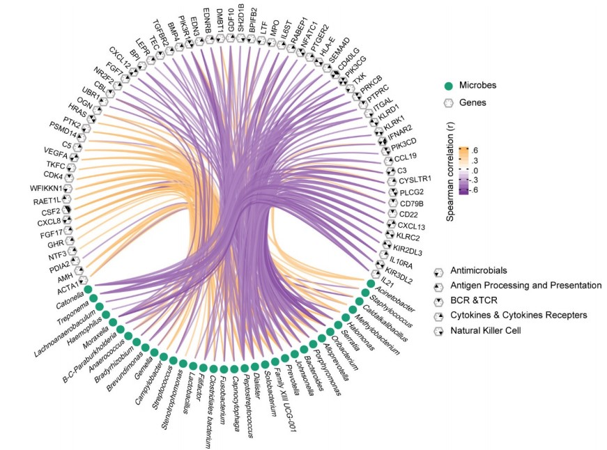
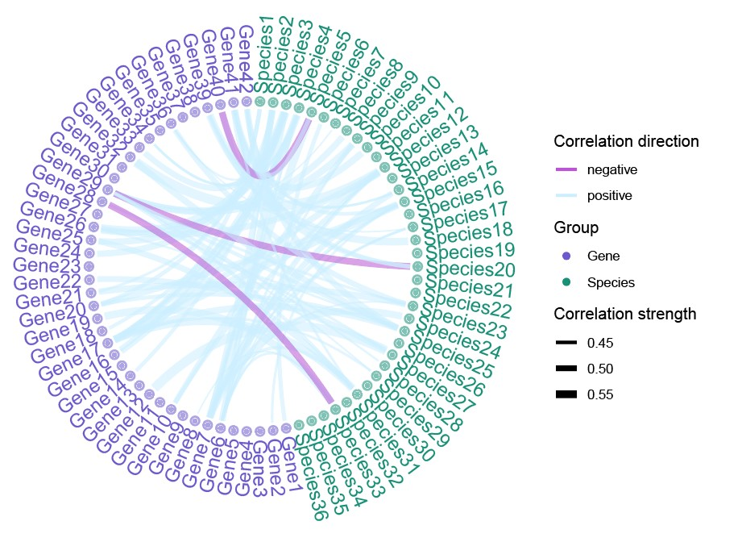

```{r setup, include=FALSE}
knitr::opts_chunk$set(
  collapse = T, echo=T, comment="#>", message=F, warning=F,
	fig.align="center", fig.width=5, fig.height=3, dpi=150)
```


The Edge bundling plot scripts is referenced from MicrobiomeStatPlot [Inerst Reference below].

If you use this script, please cited 如果你使用本代码，请引用：

**Yong-Xin Liu**, Lei Chen, Tengfei Ma, Xiaofang Li, Maosheng Zheng, Xin Zhou, Liang Chen, Xubo Qian, Jiao Xi, Hongye Lu, Huiluo Cao, Xiaoya Ma, Bian Bian, Pengfan Zhang, Jiqiu Wu, Ren-You Gan, Baolei Jia, Linyang Sun, Zhicheng Ju, Yunyun Gao, **Tao Wen**, **Tong Chen**. 2023. EasyAmplicon: An easy-to-use, open-source, reproducible, and community-based pipeline for amplicon data analysis in microbiome research. **iMeta** 2(1): e83. https://doi.org/10.1002/imt2.83

The online version of this tuturial can be found in https://github.com/YongxinLiu/MicrobiomeStatPlot


**Authors**
First draft(初稿)：Defeng Bai(白德凤)；Proofreading(校对)：Ma Chuang(马闯) and Jiani Xun(荀佳妮)；Text tutorial(文字教程)：Defeng Bai(白德凤)


# Introduction简介

什么是Edge Bundling图？
What is Edge Bundling Plot?

参考：https://mp.weixin.qq.com/s/YYvb25LRzpZfB5pTIBSygw

Edge Bundling图是一种数据可视化方式，用于展示不同节点之间的联系。与普通的network的差别在于，它使用曲线来展示节点间的连接，而非直线，并会把相同趋势的曲线捆绑再一起，就像整理数据线的“环”。因此在关联较多的情况下，这一类可视化的方式可能有利于展现趋势的变化，而不会显得复杂而混乱。

Edge Bundling is a data visualization method used to show the connection between different nodes. The difference from ordinary networks is that it uses curves to show the connection between nodes instead of straight lines, and bundles curves with the same trend together, just like a "ring" to organize data lines. Therefore, in the case of many connections, this type of visualization method may be helpful in showing the change of trends without appearing complicated and chaotic.

Edge Bundling图除了环形，还有多种形式。在微生物组领域因为存在物种分类的信息，所以可能环形的排布方式能够呈现出更加直观的规律。

In addition to the circular form, the Edge Bundling diagram has many other forms. In the field of microbiome, because there is information on species classification, the circular arrangement may be able to present a more intuitive pattern.


关键字：微生物组数据分析、MicrobiomeStatPlot、边绑定图、R语言可视化

Keywords: Microbiome analysis, MicrobiomeStatPlot, Edge bundling plot, R visulization


## Edge bundling plot example边绑定图案例

下图是来自于中山大学肿瘤防治中心Liu Na团队2022年发表于Jama Oncology（Qiao et al., 2022）上的一篇论文附件中的图。论文题目为：Association of Intratumoral Microbiota With Prognosis in Patients With Nasopharyngeal Carcinoma From 2 Hospitals in China. https://doi.org/10.1001/jamaoncol.2022.2810

Here is a figure from the supplementary materials of a paper published in JAMA Oncology in 2022 by Liu Na's team from the Sun Yat-sen University Cancer Center (Qiao et al., 2022). The paper is titled: "Association of Intratumoral Microbiota With Prognosis in Patients With Nasopharyngeal Carcinoma From 2 Hospitals in China." https://doi.org/10.1001/jamaoncol.2022.2810




eFigure 17. Network analysis based on the Spearman correlation coefficient of the microbiome and the differentially immunologically expressed genes Green dots represent the microbes, hexagons represent the target genes (adjusted Benjamini-Hochberg P < .05), and black triangles in hexagons represent the immune function in which each gene is involved. The colour of the edge indicates the Spearman correlation of the microbial node and gene node. BCR indicates B-cell receptor; TCR, T- cell receptor.

eFigure 17. 基于微生物组和差异免疫表达基因的Spearman相关系数的网络分析。绿色圆点代表微生物，六边形代表目标基因（调整后的Benjamini-Hochberg P < .05），六边形内的黑色三角形代表每个基因所涉及的免疫功能。边的颜色表示微生物节点和基因节点的Spearman相关性。BCR表示B细胞受体；TCR表示T细胞受体。


**结果**：

We further annotated the differential immunological gene sets and analyzed their correlation with intratumoralbacteria inNPC.The results revealed that theexpression levels ofmostimmune-associatedgenes,suchasCXCL13,were negatively associatedwiththeabundanceofintratumoral bacteria such as Porphyromonas (eFigure 17 in Supplement 1).

我们进一步注释了差异免疫基因集，并分析了它们与鼻咽癌肿瘤内细菌的相关性。结果显示，大多数与免疫相关的基因（如CXCL13）的表达水平与肿瘤内细菌（如牙龈卟啉单胞菌）的丰度呈负相关（见补充材料1中的图eFigure 17）。


## Packages installation软件包安装

```{r}
# 基于CRAN安装R包，检测没有则安装
p_list = c("psych", "magrittr", "reshape2", "dplyr", "readxl", "igraph", "tidyverse", "RColorBrewer", "ggraph")
for(p in p_list){if (!requireNamespace(p)){install.packages(p)}
    library(p, character.only = TRUE, quietly = TRUE, warn.conflicts = FALSE)}

# 加载R包 Load the package
suppressWarnings(suppressMessages(library(psych)))
suppressWarnings(suppressMessages(library(magrittr)))
suppressWarnings(suppressMessages(library(reshape2)))
suppressWarnings(suppressMessages(library(dplyr)))
suppressWarnings(suppressMessages(library(readxl)))
suppressWarnings(suppressMessages(library(igraph)))
suppressWarnings(suppressMessages(library(tidyverse)))
suppressWarnings(suppressMessages(library(RColorBrewer)))
suppressWarnings(suppressMessages(library(ggraph)))
```


## Edge Bundling图R语言实战
Edge Bundling Plot using R software

这里实现两种类型对象数据进行Spearman相关性检验，并通过筛选符合条件的r和p值数据，利用Edge Bundling图展示正负相关性，通过连线的粗细展示相关性的强弱。
Here, we implement the Spearman correlation test for two types of object data, and by screening the r and p value data that meet the conditions, we use the Edge Bundling diagram to show the positive and negative correlations, and show the strength of the correlation by the thickness of the connecting line.

```{r Edge_bundling_plot, fig.show='asis', fig.width=4, fig.height=2.5}
#1.加载数据
#1.Load data
data5 <- read.csv("data/data5_used.csv", row.names = 1, header = TRUE, check.names = FALSE)

#2.计算Spearman相关系数并调整p值
#2. Calculate the Spearman correlation coefficient and adjust the p-value
Cor_selected <- corr.test(data5, method="spearman", adjust="BH")
Cor <- as.data.frame(Cor_selected$r)

# 准备相关性数据
# Prepare correlation data
r.cor <- data.frame(Cor_selected$r)[1:36, 37:78]

#3.创建数据框并设置对角块为零
#3. Create a data frame and set the diagonal blocks to zero
data <- Cor %>% as.data.frame()
data[1:36, 1:36] <- 0
data[37:78, 37:78] <- 0

# 添加id列用于melt
# Add id column for melt
data$id <- colnames(data)

#4.准备用于绘图的相关性Connect数据
#4. Prepare the correlation data for plotting
# 定义相关性计算函数，这里只计算组件对象的相关性，不计算组内对象的相关性
# Define the correlation calculation function. Here, only the correlation of component objects is calculated, not the correlation of objects within the group.
calculate_correlations <- function(data, species_index, start_col, end_col) {
  rows <- end_col - start_col + 1
  Correlations <- data.frame(
    variable = character(length = rows),
    correlation = numeric(length = rows),
    p_adj = numeric(length = rows),
    stringsAsFactors = FALSE
  )
  for (i in 1:rows) {
    temp1 <- colnames(data5)[i + start_col - 1]
    temp2 <- corr.test(data5[, species_index], data5[, i + start_col - 1], method="spearman", adjust="BH")
    temp3 <- temp2$p.adj
    Correlations[i, 1] <- temp1
    Correlations[i, 2] <- temp2$r
    Correlations[i, 3] <- temp3
  }
  Correlations$species <- colnames(data5)[species_index]
  return(Correlations)
}

# 计算相关性
# Calculate correlation
start_col <- 37
end_col <- ncol(data5)
species_count <- 36
all_correlations <- list()

for (species_index in 1:species_count) {
  correlations <- calculate_correlations(data5, species_index, start_col, end_col)
  all_correlations[[species_index]] <- correlations
}

# 合并所有相关性数据
# Merge all related data
final_correlations <- do.call(rbind, all_correlations)

#筛选p_adj <= 0.05和r的绝对值>=0.4的数据
#Filter data with p_adj <= 0.05 and absolute value of r >= 0.4
final_correlations <- final_correlations[abs(final_correlations$correlation) >= 0.4 ,]
final_correlations <- final_correlations[final_correlations$p_adj <= 0.05 ,]

#data2 <- read.csv("species_gene_correlation_36S_42genes_selected.csv", row.names = 1, header = TRUE, check.names = FALSE)
data2 <- data.frame(from = final_correlations$species, to = final_correlations$variable, r = final_correlations$correlation, p_adj = final_correlations$p_adj)
cor.data2 <- data2 %>%
  data.frame() %>%
  mutate(
    linecolor = ifelse(r > 0, "positive", "negative"),
    linesize = abs(r)
  )
colnames(cor.data2) <- c("to", "from", "r", "FDR", "linecolor", "linesize")
connect_n <- cor.data2[, c(2, 1, 3, 5, 6)]

#5. 移除id列并创建分层边数据
#5. Remove the id column and create hierarchical edge data
data <- data %>% select(-id)

edge <- data.frame(from = 'Origin', to = colnames(data))
vertices <- data.frame(name = c('Origin', as.character(edge$to)))
colnames(vertices) <- "name"

# 对顶点进行分组
# Group the vertices
vertices$group <- "group"
vertices$group[1:37] <- "Species"
vertices$group[38:79] <- "Gene"

#6.计算角度并调整标签位置
#6. Calculate the angle and adjust the label position
all_leaves <- which(is.na(match(vertices$name, edge$from)))
nleaves <- length(all_leaves)
vertices$id[all_leaves] <- seq(1, nleaves)
vertices$angle <- 90 - 360 * vertices$id / nleaves
vertices$hjust <- ifelse(vertices$angle < -90, 1, 0)
vertices$angle <- ifelse(vertices$angle < -90, vertices$angle + 180, vertices$angle)

#7.将连接与顶点匹配
#7. Match connections to vertices
from <- match(connect_n$from, vertices$name)
to <- match(connect_n$to, vertices$name)

connect1 <- connect_n[connect_n$r >= 0, ]
from1 <- match(connect1$from, vertices$name)
to1 <- match(connect1$to, vertices$name)
connect2 <- connect_n[connect_n$r < 0, ]
from2 <- match(connect2$from, vertices$name)
to2 <- match(connect2$to, vertices$name)

#8.创建图对象并生成图
#8. Create a graph object and generate a graph
mygraph <- graph_from_data_frame(edge, vertices = vertices)

# 生成图
# Generate graph
pdf("results/EdgeBundingPlot01.pdf",family = "serif",width = 6,height = 7)
ggraph(mygraph, layout = 'dendrogram', circular = TRUE) +
  geom_conn_bundle(data = get_con(from = from, to = to), 
                   aes(edge_width = rep(connect_n$linesize, 3), edge_colour = rep(connect_n$linecolor, 3), edge_alpha = 0.8),
                   tension = 0.8) +
  geom_node_point(aes(filter = leaf, x = 1.05 * x, y = 1.05 * y, size = 5, color = group, alpha = 0.2)) +
  geom_node_text(aes(filter = leaf, x = 1.1 * x, y = 1.1 * y, label = name, angle = angle, hjust = hjust, color = group), size = 2.5) +
  scale_edge_color_manual(values = c("#BA55D3", "#CCEEFF")) +
  scale_edge_width_continuous(range = c(0.2,1.6)) +
  scale_size_continuous(range = c(0.1, 1.5)) +
  scale_color_manual(values = rep(c('#6A5ACD', '#189078', '#54278f'), 30)) +
  theme_void() +
  theme(plot.margin = unit(c(0, 0, 0, 0), 'cm')) +
  coord_fixed() +
  expand_limits(x = c(-1.2, 1.2), y = c(-1.2, 1.2))
dev.off()
```





If you use this script, please cited 如果你使用本代码，请引用：

**Yong-Xin Liu**, Lei Chen, Tengfei Ma, Xiaofang Li, Maosheng Zheng, Xin Zhou, Liang Chen, Xubo Qian, Jiao Xi, Hongye Lu, Huiluo Cao, Xiaoya Ma, Bian Bian, Pengfan Zhang, Jiqiu Wu, Ren-You Gan, Baolei Jia, Linyang Sun, Zhicheng Ju, Yunyun Gao, **Tao Wen**, **Tong Chen**. 2023. EasyAmplicon: An easy-to-use, open-source, reproducible, and community-based pipeline for amplicon data analysis in microbiome research. **iMeta** 2(1): e83. https://doi.org/10.1002/imt2.83

Copyright 2016-2024 Defeng Bai <baidefeng@caas.cn>, Chuang Ma <22720765@stu.ahau.edu.cn>, Jiani Xun <15231572937@163.com>, Yong-Xin Liu <liuyongxin@caas.cn>
