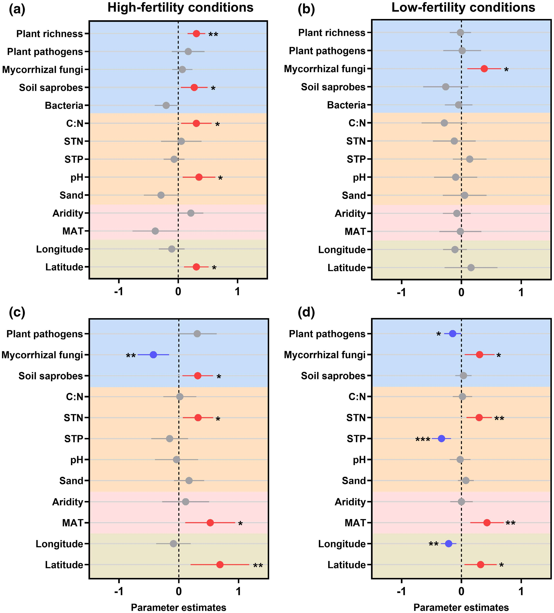
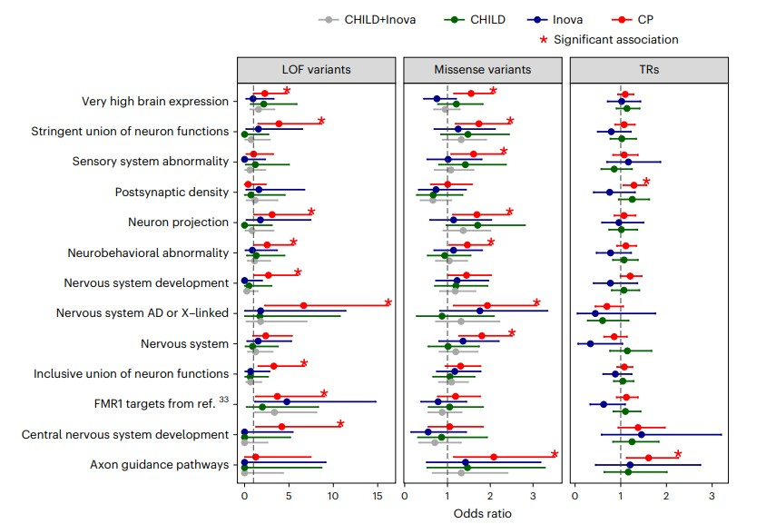
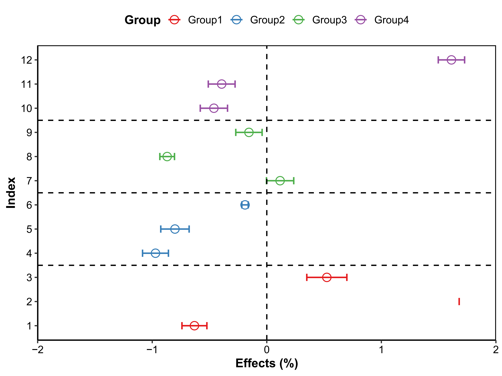
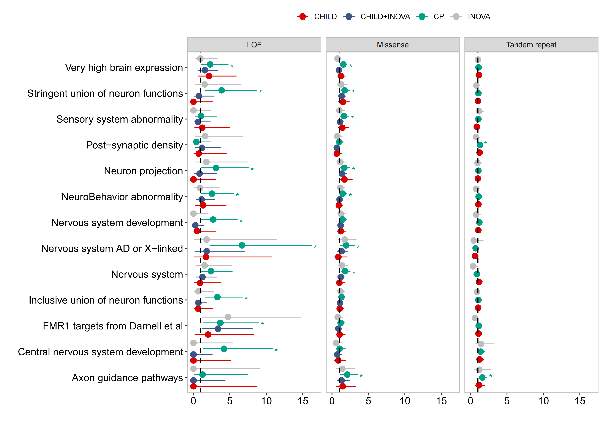

```{r setup, include=FALSE}
knitr::opts_chunk$set(
  collapse = T, echo=T, comment="#>", message=F, warning=F,
	fig.align="center", fig.width=5, fig.height=3, dpi=150)
```


The Error bar plot scripts is referenced from MicrobiomeStatPlot [Inerst Reference below].


If you use this script, please cited 如果你使用本代码，请引用：

**Yong-Xin Liu**, Lei Chen, Tengfei Ma, Xiaofang Li, Maosheng Zheng, Xin Zhou, Liang Chen, Xubo Qian, Jiao Xi, Hongye Lu, Huiluo Cao, Xiaoya Ma, Bian Bian, Pengfan Zhang, Jiqiu Wu, Ren-You Gan, Baolei Jia, Linyang Sun, Zhicheng Ju, Yunyun Gao, **Tao Wen**, **Tong Chen**. 2023. EasyAmplicon: An easy-to-use, open-source, reproducible, and community-based pipeline for amplicon data analysis in microbiome research. **iMeta** 2(1): e83. https://doi.org/10.1002/imt2.83

The online version of this tuturial can be found in https://github.com/YongxinLiu/MicrobiomeStatPlot


**Authors**
First draft(初稿)：Defeng Bai(白德凤)；Proofreading(校对)：Ma Chuang(马闯) and Xun Jiani(荀佳妮)；Text tutorial(文字教程)：Defeng Bai(白德凤)


# Introduction简介

误差棒是用来反映数据不确定性的，以被测量值的算数平均值为重点。一般使用在散点图中，以线段的方式显示出来。误差棒长度越长代表误差越大，反之则误差越小。

Error bars are used to reflect data uncertainty, with a focus on the arithmetic mean of the measured values. Generally used in scatter plots, displayed in the form of line segments. The longer the length of the error bar, the greater the error, and vice versa, the smaller the error.


关键字：微生物组数据分析、MicrobiomeStatPlot、误差棒点图、R语言可视化

Keywords: Microbiome analysis, MicrobiomeStatPlot, Error bar plot, R visulization


## Example of error bar plot 误差棒点图案例

案例一
Example 1

这是北京大学Wang Wei团队2023年发表于Global Change Biology（Zhang et al., 2023）上的一篇论文，题目为：Soil fertility shifts the relative importance of saprotrophic and mycorrhizal fungi for maintaining ecosystem stability.  https://doi.org/10.1111/gcb.16540

This is a paper published by Wang Wei's team from Peking University in Global Change Biology (Zhang et al., 2023), titled: Soil fertility shifts the relative importance of astrology and mycorrhizal fungi for maintaining ecosystem stability. https://doi.org/10.1111/gcb.16540




Figure 3 Controlling factors of ecosystem stability in the (a, b) regional and (c, d) global surveys. Multiple regression analyses reveal the relative importance of biotic and abiotic predictors of ecosystem stability. The standardized regression coefficients are shown for each variable with their 95% confidence intervals. C:N, ratio of soil carbon to nitrogen; MAT, mean annual temperature; STN, soil total nitrogen; STP, soil total phosphorus. Significance levels: *p < .05, **p < .01, ***p < .001. 

图3（a，b）区域调查和（c，d）全球调查中生态系统稳定性的控制因素。多元回归分析揭示了生态系统稳定性的生物和非生物预测因子的相对重要性。显示了每个变量的标准化回归系数及其95%置信区间。C： N，土壤碳氮比；MAT，年平均气温；STN，土壤总氮；STP，土壤总磷。显著性水平：*p<.05，**p<.01，***p<.001。


**结果**：
These positive relationships remained after accounting for plant diversity, climate, soil properties, and geographic distance (Figure 3a,b). And their effects on ecosystem stability were maintained after considering environmental factors (Figure 3c,d). Significant effects of the diversity within fungal functional groups on ecosystem stability were maintained after accounting for plant and environmental variables, indicating that the stabilizing role of microbial diversity was non-substitutable
in real-world ecosystems (Figure 3).

考虑到植物多样性、气候、土壤特性和地理距离后，这些正相关关系仍然存在（图3a、b）。在考虑环境因素后，它们对生态系统稳定性的影响得以维持（图3c，d）。在考虑了植物和环境变量后，真菌官能团内的多样性对生态系统稳定性的显著影响得以维持，这表明微生物多样性的稳定作用在现实世界的生态系统中是不可替代的（图3）。


案例二
Example 2

这是来自于加拿大多伦多大学儿童医院的Stephen W. Scherer团队2024年发表于Nature Genetics上的一篇论文。题目为：Comprehensive whole-genome sequence analyses provide insights into the genomic architecture of cerebral palsy. https://doi.org/10.1038/s41588-024-01686-x

This is a paper published in Nature Genetics by Stephen W. Scherer's team from the University of Toronto Children's Hospital in Canada in 2024. The title is: Comprehensive whole genome sequence analysis provides insights into the genomic architecture of cerebra. https://doi.org/10.1038/s41588-024-01686-x



Fig. 2 | Gene-set analysis of de novo SNVs/indels and large TRs. Three panels represent gene-set-level analysis results of de novo LOF variants (burden analysis), de novo missense variants (burden analysis) and large TRs (transmission test). The colors indicate the different cohorts and the points indicate the effect size as estimated with Fisher’s exact test as the OR with error bars indicating 95% CIs (n = 203, 178 and 314 for Inova, CHILD and CP, respectively). Significant results are marked with asterisks, that is, those with Benjamini–Hochberg FDR < 10%. AD, autosomal dominant.

图2|新SNVs/indels和大TR的基因集分析。三个面板代表了从头LOF变体（负载分析）、从头错义变体（负担分析）和大TR（传播测试）的基因集水平分析结果。颜色表示不同的队列，点表示用Fisher精确检验作为OR估计的效应大小，误差条表示95%的CI（Inova、CHILD和CP分别为n=203178和314）。显著结果用星号标记，即Benjamini–Hochberg FDR<10%的结果。AD，常染色体显性遗传。

**结果**：
In gene sets associated with CP and NDDs, an overtransmission of large TRs detected by ExpansionHunter Denovo in genes associated with axon guidance and postsynaptic density was observed in the CP cohort (Fig. 2 and Supplementary Table 4).

在与CP和NDD相关的基因集中，在CP队列中观察到ExpansionHunter Denovo在与轴突引导和突触后密度相关的基因中检测到的大TR的过度传递（图2和补充表4）。


## Packages installation软件包安装

```{r}
# 基于CRAN安装R包，检测没有则安装
p_list = c("ggplot2", "RColorBrewer")
for(p in p_list){if (!requireNamespace(p)){install.packages(p)}
    library(p, character.only = TRUE, quietly = TRUE, warn.conflicts = FALSE)}

# 加载R包 Load the package
suppressWarnings(suppressMessages(library(ggplot2)))
suppressWarnings(suppressMessages(library(RColorBrewer)))
```


# 误差棒点图Error bar plot

## Error bar plot using R software 误差棒点图R语言实战

实战一
Parctice1

单组误差棒图
Single sets of error bar charts

参考：https://mp.weixin.qq.com/s/60gm99KP8uKoRzna4Nhmwg

```{r Eror bar plot, fig.show='asis', fig.width=4, fig.height=2.5}
# Load data
# 读入数据
df <- read.csv("data/test_otu.csv", row.names = 1)

# Construct dataframe
# 处理数据
plot_data <- df[101:112, c(7, 12)]
colnames(plot_data) <- c("Microbes", "error_bar")
plot_data <- as.data.frame(scale(plot_data))
plot_data$error_bar <- plot_data$error_bar / 5

# Select data for Y axis
plot_data$Factor <- factor(1:12)

# Set group and color
plot_data$Group <- factor(rep(c("Group1", "Group2", "Group3", "Group4"), each = 3))

# Define color palette
color_palette <- brewer.pal(4, "Set1")

# Plot
# 绘图
p1 <- ggplot(plot_data, aes(x = Microbes, y = Factor, color = Group)) +
  geom_point(size = 4, shape = 21, fill = "white", stroke = 0.8) + # Larger point size with border
  geom_errorbar(aes(xmin = Microbes - error_bar, xmax = Microbes + error_bar), 
                width = 0.3, size = 0.8) + # Error bars with adjusted width and size
  labs(y = "Index", x = "Effects (%)") +
  geom_vline(xintercept = 0, linetype = "dashed", color = "black", size = 0.7) +
  geom_hline(yintercept = c(3.5, 6.5, 9.5), linetype = "dashed", color = "black", size = 0.7) +
  scale_x_continuous(expand = c(0, 0), limits = c(-2, 2)) +
  scale_color_manual(values = color_palette) +
  theme_classic(base_size = 14) + # Use a classic theme for a clean look
  theme(
    panel.grid.major = element_blank(), # Remove major grid lines
    panel.grid.minor = element_blank(), # Remove minor grid lines
    axis.text = element_text(color = 'black', size = 12),
    axis.title = element_text(size = 14, face = "bold"),
    legend.position = "top",
    legend.title = element_text(size = 14, face = "bold"),
    legend.text = element_text(size = 12),
    plot.title = element_text(size = 16, face = "bold", hjust = 0.5),
    panel.border = element_rect(color = "black", fill = NA, size = 0.8) # Add border around the plot
  )

# Save the plot
# 图保存
ggsave(filename = "results/Error_bar_plot01.pdf", plot = p1, width = 8, height = 6, useDingbats = FALSE, limitsize = FALSE)

# Display the plot
#print(p1)
```




实战二
Practice2

多组误差棒图
Multiple sets of error bar charts

```{r Eror bar plot2, fig.show='asis', fig.width=4, fig.height=2.5}
# 加载数据
# Load data
df <- read.csv("data/41588_2024_1686_MOESM7_ESM.csv")

# 基础绘图
# Basic plot
p <- ggplot(data = df, aes(x = OR, y = geneset, fill = set)) +
  geom_errorbarh(aes(xmin = lower, xmax = upper, color = set), height = 0, show.legend = FALSE, position = position_dodge(0.9)) +
  geom_point(position = position_dodge(0.9), aes(color = set), size = 3, show.legend = TRUE)

# 美化图形
# Enhance plot appearance
p2 <- ggplot(data = df, aes(x = OR, y = geneset, fill = set, color = set)) +
  geom_errorbarh(aes(xmin = lower, xmax = upper), height = 0, show.legend = TRUE, position = position_dodge(0.9)) +
  geom_point(position = position_dodge(0.9), size = 3) +
  geom_vline(xintercept = 0.5, linetype = "dashed", color = "gray", size = 0.7) +
  scale_fill_manual(values = c("#DC0000FF", "#3C5488FF", "#00A087FF", "gray")) +
  scale_color_manual(values = c("#DC0000FF", "#3C5488FF", "#00A087FF", "gray")) +
  theme(panel.grid = element_blank(), 
        panel.background = element_blank(), 
        panel.border = element_rect(color = "gray", fill = NA, size = 0.7),
        axis.text.x = element_text(size = 12, color = "black", angle = 0, margin = margin(t = 2)), # 设置X轴刻度文本与刻度线距离
        axis.text.y = element_text(size = 12, colour = "black"),
        axis.title.y = element_text(size = 14),
        axis.ticks.length = unit(0.1, "cm")) +
  labs(x = "", y = "") +
  guides(color = guide_legend(title = NULL), fill = guide_legend(title = NULL))

# 分面及分面标签
# Facet and facet labels
vline_data <- data.frame(
  group = c("LOF", "Missense", "Tandem repeat"),  # 替换为你的分面组
  xintercept = c(1, 1, 1)  # 对应的垂直线位置
)

# 完整图形，包括分面和标签
# Complete plot with facets and labels
p3 <- ggplot(data = df, aes(x = OR, y = geneset, fill = set, color = set)) +
  geom_errorbarh(aes(xmin = lower, xmax = upper), height = 0, show.legend = TRUE, position = position_dodge(0.9)) +
  geom_point(position = position_dodge(0.9), size = 3) +
  geom_vline(data = vline_data, aes(xintercept = xintercept), linetype = "dashed", color = "black", size = 0.7) +
  facet_wrap(~variant) +
  # geom_text(data = ann_text,label="*") +
  scale_fill_manual(values = c("#DC0000FF", "#3C5488FF", "#00A087FF", "gray")) +
  scale_color_manual(values = c("#DC0000FF", "#3C5488FF", "#00A087FF", "gray")) +
  theme(panel.grid = element_blank(),
        panel.background = element_blank(),
        panel.border = element_rect(color = "gray", fill = NA, size = 0.7),
        axis.text.x = element_text(size = 12, color = "black", angle = 0, margin = margin(t = 2)),
        axis.text.y = element_text(size = 12, colour = "black"),
        axis.title.y = element_text(size = 14),
        axis.ticks.length = unit(0.1, "cm"),
        legend.position = "top",
        legend.direction = "horizontal",
        strip.background = element_rect(color = "gray")) +
  geom_text(aes(label = significant, x = upper + 0.5)) +
  labs(x = "", y = "") +
  guides(color = guide_legend(title = NULL), fill = guide_legend(title = NULL))

# 保存图形
# Save plot
ggsave(filename = "results/Error_bar_plot02.pdf", plot = p3, width = 10, height = 7, useDingbats = FALSE, limitsize = FALSE)
```




If used this script, please cited:
使用此脚本，请引用下文：

**Yong-Xin Liu**, Lei Chen, Tengfei Ma, Xiaofang Li, Maosheng Zheng, Xin Zhou, Liang Chen, Xubo Qian, Jiao Xi, Hongye Lu, Huiluo Cao, Xiaoya Ma, Bian Bian, Pengfan Zhang, Jiqiu Wu, Ren-You Gan, Baolei Jia, Linyang Sun, Zhicheng Ju, Yunyun Gao, **Tao Wen**, **Tong Chen**. 2023. EasyAmplicon: An easy-to-use, open-source, reproducible, and community-based pipeline for amplicon data analysis in microbiome research. **iMeta** 2: e83. https://doi.org/10.1002/imt2.83

Copyright 2016-2024 Defeng Bai <baidefeng@caas.cn>, Chuang Ma <22720765@stu.ahau.edu.cn>, Jiani Xun <15231572937@163.com>, Yong-Xin Liu <liuyongxin@caas.cn>