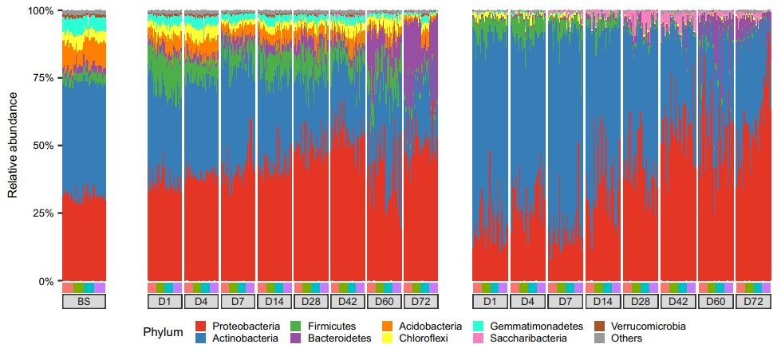
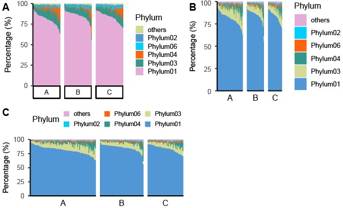

```{r setup, include=FALSE}
knitr::opts_chunk$set(
  collapse = T, echo=T, comment="#>", message=F, warning=F,
	fig.align="center", fig.width=5, fig.height=3, dpi=150)
```


Faceted sorted stack bar plot scripts is referenced from MicrobiomeStatPlot [Inerst Reference below].

If you use this script, please cited 如果你使用本代码，请引用：

**Yong-Xin Liu**, Lei Chen, Tengfei Ma, Xiaofang Li, Maosheng Zheng, Xin Zhou, Liang Chen, Xubo Qian, Jiao Xi, Hongye Lu, Huiluo Cao, Xiaoya Ma, Bian Bian, Pengfan Zhang, Jiqiu Wu, Ren-You Gan, Baolei Jia, Linyang Sun, Zhicheng Ju, Yunyun Gao, **Tao Wen**, **Tong Chen**. 2023. EasyAmplicon: An easy-to-use, open-source, reproducible, and community-based pipeline for amplicon data analysis in microbiome research. **iMeta** 2(1): e83. https://doi.org/10.1002/imt2.83

The online version of this tuturial can be found in https://github.com/YongxinLiu/MicrobiomeStatPlot

**Authors**
First draft(初稿)：Defeng Bai(白德凤)；Proofreading(校对)：Ma Chuang(马闯) and Jiani Xun(荀佳妮)；Text tutorial(文字教程)：Defeng Bai(白德凤)


# Introduction简介

在微生物组分析中，有时候有多个分组，同时每个分组中有多个样本，为了展示所有样本的物种组成，同时根据微生物物种丰度从高到低排序观察微生物组成变化趋势，会用到多组分面排序堆叠柱状图。

In microbiome analysis, there are sometimes multiple groups, and each group has multiple samples. In order to display the species composition of all samples and observe the trend of microbial composition changes by sorting the microbial species abundance from high to low, a multi-group faceted sorted stacked bar chart is used.


关键字：微生物组数据分析、MicrobiomeStatPlot、分面排序堆叠柱状图、R语言可视化

Keywords: Microbiome analysis, MicrobiomeStatPlot, Faceted sorted stack bar plot, R visulization


## Faceted sorted stack bar plot example  分面排序堆叠柱状图案例

这是来自于中科院分子植物卓越创新中心王二涛团队2024年发表于Nature Communications上的一篇论文用到的分组排序堆叠柱状图，展示每个样本的门水平微生物相对丰度组成。论文题目为：Dynamic root microbiome sustains soybean productivity under unbalanced fertilization. https://doi.org/10.1038/s41467-024-45925-5



Fig. 3 | Bacterial loads and composition in the bulk soil, rhizosphere and
endosphere based on 16S rRNA sequencing data.

图 3 | 基于 16S rRNA 测序数据的土体土壤、根际和内土壤中的细菌负荷和组成。


**结果**

Assembly of root-associated microbiome during plant development
植物发育过程中根相关微生物组的组装

The bacterial loads in both the rhizosphere and endosphere exhibited increasing trends with plant development, and bacterial abundances were comparable across days 1–14 (5.8 × 109 copies g−1 in the rhizosphere and 1.5 × 108 copies g−1 in the endosphere), but gradually increased and reached their highest abundance at day 72 (2.3 × 1010 copies g−1 in the rhizosphere and 4.7 × 109 copies g−1 in the endosphere) (Fig. 3, Supplementary Fig. 6). Fertilization treatments had a significant effect on bacterial loads (Supplementary Table 5), and the microbial load was found to be consistently reduced in the rhizosphere of the -P treatment compared to the Control, especially at later developmental stages, showing bacterial load reductions of 54%, 61% and 75% at days 42, 60, and 72, respectively (P < 0.05, Fig. 3B). By contrast, the change of bacterial loads between Control and -P treatment in the endosphere was hardly observed and not consistent during plant developmental stages (Fig. 3C).

根际和内生菌群的细菌负荷随着植物的发育呈现增加趋势，1-14天的细菌丰度相当（根际5.8×109 拷贝/g，内生菌群1.5×108 拷贝/g），但逐渐增加并在第72天达到最高丰度（根际2.3×1010 拷贝/g，内生菌群4.7×109拷贝/g）（图3，补充图6）。施肥处理对细菌负荷有显著影响（补充表 5），与对照相比，-P 处理根际的微生物负荷持续降低，尤其是在后期发育阶段，在第 42、60 和 72 天，细菌负荷分别减少了 54%、61% 和 75%（P < 0.05，图 3B）。相比之下，在植物发育阶段，对照和 -P 处理之间的根际细菌负荷变化几乎未观察到，且不一致（图 3C）。

The root-associated bacteria mainly belonged to the Proteo bacteria, Actinobacteria, and Bacteroidetes, with Actinobacteria being more dominant at early stages and Proteobacteria being more dominant at later stages, particularly in the endosphere (Fig. 3, Supplementary Fig. 6). Although the relative abundance of Actinobacteria exhibited a progressively decreasing trend with plant development (reducing from 33.4% and 68.3% at day 1 to 18.0% and 32.6% at day 72 in the rhizosphere and endosphere, respectively), their absolute abundances increased by 2.1 and 18.8 fold in the rhizosphere and endosphere, respectively (Figs. 3, 4), indicating that the plants support an increasing load of Actinobacteria despite their reduced relative abundance.

根系相关细菌主要属于变形菌、放线菌和拟杆菌，其中放线菌在早期阶段占主导地位，而变形菌在后期阶段占主导地位，尤其是在内生层（图 3，补充图 6）。虽然放线菌的相对丰度随着植物的发育呈现逐渐下降的趋势（在根际和内生层分别从第 1 天的 33.4% 和 68.3% 降低到第 72 天的 18.0% 和 32.6%），但它们的绝对丰度在根际和内生层分别增加了 2.1 倍和 18.8 倍（图 3、4），表明尽管放线菌的相对丰度降低，但植物支撑的放线菌负荷却不断增加。


## Packages installation软件包安装


```{r}
# 基于CRAN安装R包，检测没有则安装 Installing R packages based on CRAN and installing them if they are not detected
p_list = c("ggplot2", "reshape2", "ggprism", "patchwork", "dplyr", "plyr")
for(p in p_list){if (!requireNamespace(p)){install.packages(p)}
    library(p, character.only = TRUE, quietly = TRUE, warn.conflicts = FALSE)}

# 加载R包 Loading R packages
suppressWarnings(suppressMessages(library(ggplot2)))
suppressWarnings(suppressMessages(library(reshape2)))
suppressWarnings(suppressMessages(library(ggprism)))
suppressWarnings(suppressMessages(library(patchwork)))
suppressWarnings(suppressMessages(library(dplyr)))
suppressWarnings(suppressMessages(library(plyr)))
```


# Faceted sorted stack bar plot 分面排序堆叠柱状图

此处选择门水平作为一个案例进行分析，其他分类水平可根据需要进行代码调整。

```{r faceted sorted stacked bar plot, fig.show='asis', fig.width=4, fig.height=2.5}
# 导入数据
# Load data
data <- read.table(file = "data/phylum_data.txt", sep = "\t", header = T, check.names = FALSE)

design <- read.table(file = "data/metadata.txt", sep = "\t", header = T, row.names=1)

# sum of Genus
# 计算每个Genus微生物相对丰度之和，避免有重复Phylum统计
data <- aggregate(.~ Phylum,data=data,sum)
rownames(data) = data$Phylum
data = data[, -1]

# 计算相对丰度
# Calculate relative abundance
data = apply(data , 2, function(x) x/sum(x))

# Decreased sort by abundance
# 相对丰度按降序排列
mean_sort = data[(order(-rowSums(data))), ]
mean_sort = as.data.frame(mean_sort)
mean_sort2 = t(mean_sort)
mean_sort2 = mean_sort2[order(-mean_sort2[,1]),]
mean_sort3 = t(mean_sort2)
mean_sort3 = as.data.frame(mean_sort3)

# Phylum水平展示前5个
# Top 5
other = colSums(mean_sort3[6:dim(mean_sort3)[1], ])
mean_sort3 = mean_sort3[(6 - 1):1, ]
mean_sort3 = rbind(other,mean_sort3)
rownames(mean_sort3)[1] = c("others")
mean_sort3 = as.data.frame(mean_sort3)

# Add taxonomy
# 加入微生物分类信息
mean_sort3$tax = rownames(mean_sort3)
data_all = as.data.frame(melt(mean_sort3, id.vars = c("tax")))
data_all$group = data_all$variable
data_all$group = as.character(data_all$group)
data_all$group = gsub("[0-9]","", data_all$group)

# 给分组排序
# Sort for different groups
levels(as.factor(data_all$group))
data_all2 = data_all %>%
  mutate(group = ordered(group,
                         levels=c("A", "B", "C")))

# Stackplot
# 绘图
p01 = ggplot(data_all2, aes(x=factor(variable, levels = unique(variable)), 
                          y = value, fill = factor(tax, levels = unique(tax)))) +
    geom_bar(stat = "identity",position="stack", width=1)+
    scale_y_continuous(labels = scales::percent, expand = c(0,0)) +
    guides(fill=guide_legend(title="Phylum"))+
    facet_grid( ~ group, scales = "free_x", switch = "x") +  
    theme(strip.background = element_blank())+
    theme(axis.ticks.x = element_blank(), axis.text.x = element_blank())+
    xlab("Groups")+ylab("Percentage (%)")+ 
    theme_classic()+
    theme(axis.text.x=element_text(angle=45,vjust=1, hjust=1))+
    theme(axis.text.x = element_blank(),
          axis.ticks.x = element_blank(),
          legend.key.size = unit(0.4, "cm"),
          axis.title.x =element_blank())+
    scale_fill_manual(values = c("#d2da93","#5196d5","#00ceff","#ff630d","#35978b",
                  "#e5acd7","#77aecd","#ec8181","#dfc6a5","#e50719",
                  "#d27e43","#8a4984","#fe5094","#8d342e","#f94e54",
                  "#ffad00","#36999d","#00fc8d","#b64aa0","#9b82e1"))+
    scale_color_manual(values = c("#d2da93","#5196d5","#00ceff","#ff630d","#35978b",
                  "#e5acd7","#77aecd","#ec8181","#dfc6a5","#e50719",
                  "#d27e43","#8a4984","#fe5094","#8d342e","#f94e54",
                  "#ffad00","#36999d","#00fc8d","#b64aa0","#9b82e1"))
ggsave(paste("results/Phylum_top5_1.pdf",".pdf", sep=""), p01, width=89 * 1.5, height=50 * 1.5, unit='mm')
#p01


# 根据样本数量确定每个分面的宽度，图例在最右侧
# Determine the width of each facet based on the number of samples, the legend is on the far right
# 生成每个 group 的子图，并为后三个分面移除所有 y 轴元素
# Generate subplots for each group and remove all y-axis elements for the last three facets
plots <- lapply(split(data_all2, data_all2$group), function(df) {
  group_name <- unique(df$group)
  ggplot(df, aes(x = factor(variable, levels = unique(df$variable)),
                 y = value, fill = factor(tax, levels = unique(df$tax)))) +
    geom_bar(stat = "identity", position = "stack", width = 1) +
    scale_y_continuous(labels = scales::percent, expand = c(0, 0)) +
    theme_classic() +
    labs(x = group_name, y = NULL) +
    scale_fill_manual(values = c("#e5acd7",  "#00ceff", "#ff630d", "#35978b","#d2da93",
                                  "#5196d5", "#77aecd", "#ec8181", "#dfc6a5", "#e50719",
                                  "#d27e43", "#8a4984", "#fe5094", "#8d342e", "#f94e54",
                                  "#ffad00", "#36999d", "#00fc8d", "#b64aa0", "#9b82e1")) +
    guides(fill = guide_legend(title = "Phylum"))  # 确保图例存在Make sure the legend exists
})

# 移除后三个分面的所有 y 轴元素和图例
# Remove all y-axis elements and legends for the last three facets
for (i in 2:3) {
  plots[[i]] <- plots[[i]] + theme(axis.text.y = element_blank(),
                                   axis.text.x = element_blank(),
                                   axis.ticks.y = element_blank(),
                                   axis.ticks.x = element_blank(),
                                   axis.title.y = element_blank(),
                                   axis.line.y = element_blank(),
                                   legend.position = "none")
}

# 为第一个分面保留 y 轴标签和图例
# Keep y-axis label and legend for the first facet
plots[[1]] <- plots[[1]] + 
  ylab("Percentage (%)") + 
  theme(axis.text.x = element_blank(),
        axis.ticks.x = element_blank(),
        legend.position = "left",  # 将图例放在最右侧Place the legend on the far right
        legend.justification = c("left", "top"))  # 确保图例位置Ensure legend position

# 每个分面的宽度由样本数量决定
# The width of each facet is determined by the number of samples
sample_counts <- table(data_all2$group)
relative_widths <- sample_counts / sum(sample_counts)

# 使用 patchwork 组合图形，设置每个分面的宽度
# Use patchwork to combine graphics and set the width of each facet
p02 <- wrap_plots(plots) +
  plot_layout(widths = relative_widths, 
              design = "ABCD", 
              guides = "collect") & 
  theme(axis.title.y = element_text(size = 10),
        plot.margin = unit(c(0.05, 0.05, 0.05, 0.05), "cm"))  # 调整左右分面的间隔Adjust the spacing between left and right facets

# 保存图像
# Save plot
ggsave("results/Phylum_top5_2.pdf", p02, width = 139 * 1.5, height = 60 * 1.5, unit = 'mm')


# 根据样本数量确定每个分面的宽度，图例在顶部
# Determine the width of each facet based on the number of samples, the legend is at the top
plots <- lapply(split(data_all2, data_all2$group), function(df) {
  group_name <- unique(df$group)
  ggplot(df, aes(x = factor(variable, levels = unique(df$variable)),
                 y = value, fill = factor(tax, levels = unique(df$tax)))) +
    geom_bar(stat = "identity", position = "stack", width = 1) +
    scale_y_continuous(labels = scales::percent, expand = c(0, 0)) +
    theme_classic() +
    labs(x = group_name, y = NULL) +
    scale_fill_manual(values = c("#e5acd7",  "#00ceff", "#ff630d", "#35978b","#d2da93",
                                  "#5196d5", "#77aecd", "#ec8181", "#dfc6a5", "#e50719",
                                  "#d27e43", "#8a4984", "#fe5094", "#8d342e", "#f94e54",
                                  "#ffad00", "#36999d", "#00fc8d", "#b64aa0", "#9b82e1")) +
    guides(fill = guide_legend(title = "Phylum"))
})

# 移除后三个分面的所有 y 轴元素和图例
# Remove all y-axis elements and legends for the last three facets
for (i in 2:3) {
  plots[[i]] <- plots[[i]] + theme(axis.text.y = element_blank(),
                                   axis.text.x = element_blank(),
                                   axis.ticks.y = element_blank(),
                                   axis.ticks.x = element_blank(),
                                   axis.title.y = element_blank(),
                                   axis.line.y = element_blank(),
                                   legend.position = "none")
}

# 为第一个分面保留 y 轴标签和图例
# Keep y-axis label and legend for the first facet
plots[[1]] <- plots[[1]] + 
  ylab("Percentage (%)") + 
  theme(axis.text.x = element_blank(),
        axis.ticks.x = element_blank(),
        legend.position = "left",
        legend.justification = c("left", "top"))

# 每个分面的宽度由样本数量决定
# The width of each facet is determined by the number of samples
sample_counts <- table(data_all2$group)
relative_widths <- sample_counts / sum(sample_counts)

# 使用 patchwork 组合图形，设置每个分面的宽度并统一图例
# Use patchwork to combine graphics, set the width of each facet and unify the legend
p03 <- wrap_plots(plots) +
  plot_layout(widths = relative_widths, guides = "collect") &
  theme(legend.position = "top", 
        legend.justification = "center",
        legend.direction = "horizontal", 
        legend.key.size = unit(0.3, "cm"), 
        legend.text = element_text(size = 8),
        legend.spacing.x = unit(0.1, "cm"),
        axis.title.y = element_text(size = 10),
        plot.margin = unit(c(0.05, 0.05, 0.05, 0.05), "cm")) 

# 保存图像
# Save plot
ggsave("results/Phylum_fungi_top5_3.pdf", p03, width = 139 * 1.5, height = 80 * 1.5, unit = 'mm')


# 组合图
# Combined
library(cowplot)
width = 89
height = 59
p0 = plot_grid(p01, p02, p03, labels = c("A", "B", "C"), ncol = 2)
ggsave("results/multigroup_faceted_sorted_stack_bar_plot_all.pdf", p0, width = width * 2, height = height * 1.7, units = "mm")
```





If used this script, please cited:
使用此脚本，请引用下文：

**Yong-Xin Liu**, Lei Chen, Tengfei Ma, Xiaofang Li, Maosheng Zheng, Xin Zhou, Liang Chen, Xubo Qian, Jiao Xi, Hongye Lu, Huiluo Cao, Xiaoya Ma, Bian Bian, Pengfan Zhang, Jiqiu Wu, Ren-You Gan, Baolei Jia, Linyang Sun, Zhicheng Ju, Yunyun Gao, **Tao Wen**, **Tong Chen**. 2023. EasyAmplicon: An easy-to-use, open-source, reproducible, and community-based pipeline for amplicon data analysis in microbiome research. **iMeta** 2: e83. https://doi.org/10.1002/imt2.83

Copyright 2016-2024 Defeng Bai <baidefeng@caas.cn>, Chuang Ma <22720765@stu.ahau.edu.cn>, Jiani Xun <15231572937@163.com>, Yong-Xin Liu <liuyongxin@caas.cn>
