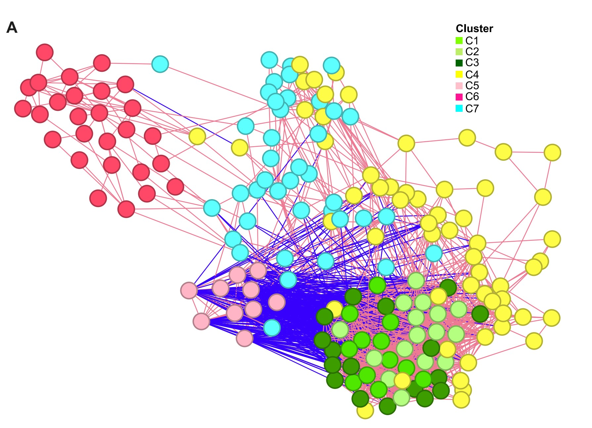

```{r setup, include=FALSE}
knitr::opts_chunk$set(
  collapse = T, echo=T, comment="#>", message=F, warning=F,
	fig.align="center", fig.width=5, fig.height=3, dpi=150)
```


The Bubble plot scripts is referenced from MicrobiomeStatPlot [Inerst Reference below].

If you use this script, please cited 如果你使用本代码，请引用：

**Yong-Xin Liu**, Lei Chen, Tengfei Ma, Xiaofang Li, Maosheng Zheng, Xin Zhou, Liang Chen, Xubo Qian, Jiao Xi, Hongye Lu, Huiluo Cao, Xiaoya Ma, Bian Bian, Pengfan Zhang, Jiqiu Wu, Ren-You Gan, Baolei Jia, Linyang Sun, Zhicheng Ju, Yunyun Gao, **Tao Wen**, **Tong Chen**. 2023. EasyAmplicon: An easy-to-use, open-source, reproducible, and community-based pipeline for amplicon data analysis in microbiome research. **iMeta** 2(1): e83. https://doi.org/10.1002/imt2.83

The online version of this tuturial can be found in https://github.com/YongxinLiu/MicrobiomeStatPlot


**Authors**
First draft(初稿)：Defeng Bai(白德凤)；Proofreading(校对)：Ma Chuang(马闯) and Jiani Xun(荀佳妮)；Text tutorial(文字教程)：Defeng Bai(白德凤)


# Introduction简介

参考：https://mp.weixin.qq.com/s/B9gkW7bB7slddIrybmwkSQ

费舍尔精确检验（Fisher's exact test）是一种用于计算两个类别变量之间的相关性的非参数检验方法。它的目的是确定两个类别变量之间的联合概率分布，从而检验它们之间是否存在显著的相关性。
Fisher's exact test is a non-parametric method used to calculate the correlation between two categorical variables. Its purpose is to determine the joint probability distribution between the two categorical variables in order to test whether there is a significant correlation between them.

在费舍尔精确检验中，我们通常会将数据表示为一个二维列联表（contingency table），其中行表示一个类别变量的不同取值，列表示另一个类别变量的不同取值。然后，我们计算出这个列表中所有可能的数据分布方式下，出现观察数据或更极端情况的概率，也就是p值。如果p值低于预设的显著性水平（通常为0.05），则我们认为这两个类别变量之间存在显著的相关性。

In Fisher's exact test, data is typically represented as a two-dimensional contingency table, where the rows represent different values of one categorical variable, and the columns represent different values of another categorical variable. We then calculate the probability (p-value) of obtaining the observed data or a more extreme distribution under all possible data distributions in the table. If the p-value is below the preset significance level (usually 0.05), we conclude that there is a significant correlation between the two categorical variables.

费舍尔精确检验适用于样本量较小的情况下，特别是在存在稀疏数据的情况下。与卡方检验（chi-square test）相比，费舍尔精确检验更加准确，但计算成本也更高。因此，在大样本和稠密数据的情况下，卡方检验更为常用。

Fisher's exact test is suitable for situations with smaller sample sizes, especially when there is sparse data. Compared to the chi-square test, Fisher's exact test is more accurate, but it also has a higher computational cost. Therefore, in cases with large sample sizes and dense data, the chi-square test is more commonly used.


关键字：微生物组数据分析、MicrobiomeStatPlot、费舍尔精确检验、R语言可视化

Keywords: Microbiome analysis, MicrobiomeStatPlot, Fisher's exact test, R visulization


## Fisher's exact test case 费舍尔精确检验案例

这是Laurence Zitvogel团队2024年发表于Cell上的一篇论文在确定物种之间的关系时用到了Fisher's exact test。论文题目为：Custom scoring based on ecological topology of gut microbiota associated with cancer immunotherapy outcome. https://doi.org/10.1016/j.cell.2024.05.029

This is a paper published in Cell by Laurence Zitvogel's team in 2024, which used Fisher's exact test to determine the relationship between species. The title of the paper is: Custom scoring based on ecological topology of gut microbiota associated with cancer immunotherapy outcome. https://doi.org/10.1016/j.cell.2024.05.029



Figure S2. Co-abundance networks and SIGs associated with overall survival in the discovery cohort of patients with NSCLC (A) Microbial network of the discovery cohort (n = 245) using co-occurrence matrices of 180 selected metagenomics species (MGSs). Edges are significant (p% 0.001) Fisher associations (pink and blue lines for co-occurrence and co-exclusion patterns, respectively). Nodes (representing MGSs) were colored according to the 7 identified co-occurrence clusters, C1 to C7 (refer to Figure S3).

图 S2. NSCLC 患者发现队列中与总体生存率相关的共丰度网络和 SIG (A) 使用 180 个选定的宏基因组物种 (MGS) 的共现矩阵的发现队列 (n = 245) 的微生物网络。边缘显著 (p% 0.001) Fisher 关联 (粉色和蓝色线分别表示共现和共排除模式)。节点 (代表 MGS) 根据已识别的 7 个共现簇 C1 至 C7 着色 (参见图 S3)。


**结果**

Each pair of these 266 MGSs was then analyzed by Fisher’s exact test on 2 3 2 contingency tables based on their absence/presence cooccurrences and scored by the -log10(p) 3 sign(OR - 1) metrics, where p is the Fisher p value and OR, the odds ratio of the 2 3 2 table. This metric defined a score proportional to the significance of the interaction between twoMGSs (-log10(p))that is negative in case of co-exclusion pattern (OR < 1) or positive in case of cooccurrence (OR > 1). Interactions with a Bonferroni-corrected p value % 0.05 were retained for analysis (Figure S2A). 

然后，根据这 266 个 MGS 的缺失/存在共现情况，通过 2 3 2 列联表上的 Fisher 精确检验对它们进行分析，并根据 log10(p) 3 符号 (OR 1) 指标进行评分，其中 p 是 Fisher p 值，OR 是 2 3 2 表的优势比。该指标定义了一个与两个 MGS 之间相互作用的重要性 ( log10(p)) 成比例的分数，如果是共排斥模式 (OR < 1)，则为负数，如果是共现 (OR > 1)，则为正数。保留 Bonferroni 校正 p 值 % 0.05 的相互作用进行分析（图 S2A）。


# Fisher's exact test费舍尔精确检验

## Fisher's exact test in R 费舍尔精确检验R语言实战


```{r Fisher exact test, fig.show='asis', fig.width=4, fig.height=2.5}
# 创建 2x2 列联表
# Create a 2x2 contingency table
data <- matrix(c(10, 20, 30, 40), nrow = 2) 
colnames(data) <- c("group1", "group2") 
rownames(data) <- c("Exposure", "Non_exposure")

# 执行费舍尔精确检验
# Fisher's exact test
fisher_result <- fisher.test(data)

# 提取相关结果
# Extract results
result_df <- data.frame(
  p_value = fisher_result$p.value,
  estimate = fisher_result$estimate,
  conf_int_lower = fisher_result$conf.int[1],
  conf_int_upper = fisher_result$conf.int[2],
  method = fisher_result$method
)

# 将结果保存为 CSV 文件
# Save results
write.csv(result_df, file = "results/fisher_test_result.csv", row.names = FALSE)
```


在这个例子中，我们创建了一个 2x2 的列联表，其中包括两个组（组1和组2）和两个暴露水平（暴露和未暴露）。然后，我们使用 fisher.test() 函数执行费舍尔精确检验，该函数返回测试统计量、P值和置信区间的结果。默认情况下，检验是双侧的，但是我们可以通过将 alternative 参数设置为 "less" 或 "greater" 来指定单侧检验。

In this example, we create a 2x2 contingency table with two groups (Group 1 and Group 2) and two exposure levels (Exposed and Unexposed). We then perform Fisher's exact test using the fisher.test() function, which returns the results of the test statistic, P value, and confidence interval. By default, the test is two-sided, but we can specify a one-sided test by setting the alternative parameter to "less" or "greater".

星号和p值是统计学中常见的两个表示显著性的方式，通常用于表示两组数据或变量之间的差异是否显著。一般来说，p值越小，差异越显著；而星号的数量越多，则显著性越高。

Asterisks and p-values are two common ways to express significance in statistics. They are usually used to indicate whether the difference between two sets of data or variables is significant. Generally speaking, the smaller the p-value, the more significant the difference; and the greater the number of asterisks, the higher the significance.

具体来说，一般使用以下约定：
Specifically, the following conventions are generally used:
p值 < 0.05：通常表示显著差异，并用一个星号（*）表示。
p-value < 0.05: usually indicates a significant difference and is indicated by an asterisk (*).
p值 < 0.01：表示非常显著差异，并用两个星号（**）表示。
p-value < 0.01: indicates a very significant difference and is indicated by two asterisks (**).
p值 < 0.001：表示极其显著差异，并用三个星号（***）表示。
p-value < 0.001: indicates an extremely significant difference and is indicated by three asterisks (***).
需要注意的是，单纯地使用星号来表示显著性不是一个很严谨的方式，因为它并没有明确地告诉读者显著性的具体水平。因此，我们应该在报告中同时给出p值和星号的数量，以便读者能够更好地理解研究结果的显著性。
It should be noted that simply using an asterisk to indicate significance is not a very rigorous way because it does not clearly tell the reader the specific level of significance. Therefore, we should give both the p-value and the number of asterisks in the report so that readers can better understand the significance of the study results.

If used this script, please cited:
使用此脚本，请引用下文：

**Yong-Xin Liu**, Lei Chen, Tengfei Ma, Xiaofang Li, Maosheng Zheng, Xin Zhou, Liang Chen, Xubo Qian, Jiao Xi, Hongye Lu, Huiluo Cao, Xiaoya Ma, Bian Bian, Pengfan Zhang, Jiqiu Wu, Ren-You Gan, Baolei Jia, Linyang Sun, Zhicheng Ju, Yunyun Gao, **Tao Wen**, **Tong Chen**. 2023. EasyAmplicon: An easy-to-use, open-source, reproducible, and community-based pipeline for amplicon data analysis in microbiome research. **iMeta** 2: e83. https://doi.org/10.1002/imt2.83

Copyright 2016-2024 Defeng Bai <baidefeng@caas.cn>, Chuang Ma <22720765@stu.ahau.edu.cn>, Jiani Xun <15231572937@163.com>, Yong-Xin Liu <liuyongxin@caas.cn>
