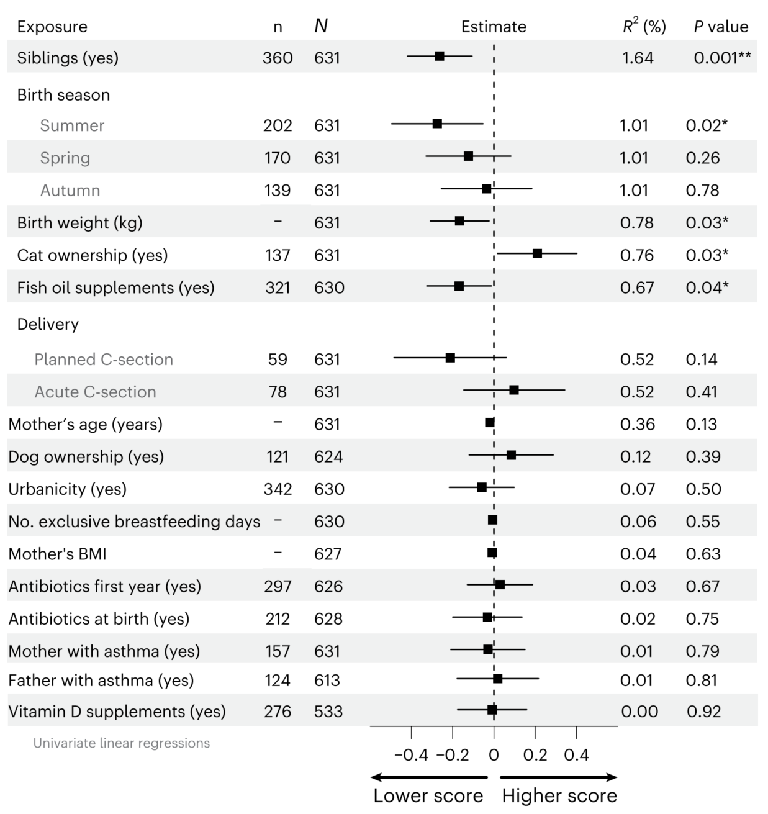
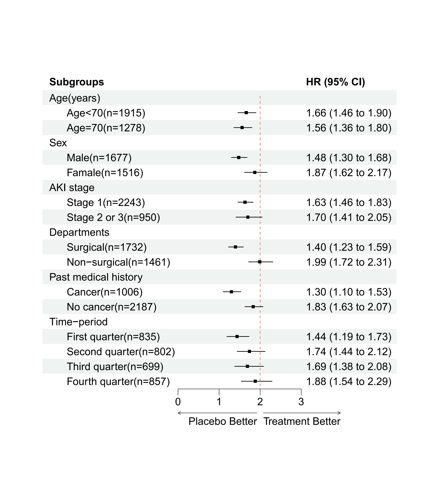

```{r setup, include=FALSE}
knitr::opts_chunk$set(
  collapse = T, echo=T, comment="#>", message=F, warning=F,
	fig.align="center", fig.width=5, fig.height=3, dpi=150)
```


The Forest plot scripts is referenced from MicrobiomeStatPlot [Inerst Reference below].


If you use this script, please cited 如果你使用本代码，请引用：

**Yong-Xin Liu**, Lei Chen, Tengfei Ma, Xiaofang Li, Maosheng Zheng, Xin Zhou, Liang Chen, Xubo Qian, Jiao Xi, Hongye Lu, Huiluo Cao, Xiaoya Ma, Bian Bian, Pengfan Zhang, Jiqiu Wu, Ren-You Gan, Baolei Jia, Linyang Sun, Zhicheng Ju, Yunyun Gao, **Tao Wen**, **Tong Chen**. 2023. EasyAmplicon: An easy-to-use, open-source, reproducible, and community-based pipeline for amplicon data analysis in microbiome research. **iMeta** 2(1): e83. https://doi.org/10.1002/imt2.83

The online version of this tuturial can be found in https://github.com/YongxinLiu/MicrobiomeStatPlot


**Authors**
First draft(初稿)：Defeng Bai(白德凤)；Proofreading(校对)：Ma Chuang(马闯) and Xun Jiani(荀佳妮)；Text tutorial(文字教程)：Defeng Bai(白德凤)


# Introduction简介

什么是森林图？
What is a forest map?
参考：https://mp.weixin.qq.com/s/vwNf_sFlmhp7DeSYaQ3NxQ

森林图是以统计指标和统计分析方法为基础，用数值运算结果绘制出的图形。它在平面直角坐标系中，以一条垂直的无效线（横坐标刻度为1或0）为中心，用平行于横轴的多条线段描述了每个被纳入研究的效应量和置信区间，用一个图形描述了多个研究合并的效应量及置信区间。

A forest map is a graph drawn based on statistical indicators and analysis methods, using numerical operation results. It is in a Cartesian coordinate system, with a vertical invalid line (with a scale of 1 or 0 on the horizontal axis) as the center, and multiple line segments parallel to the horizontal axis are used to describe the effect magnitude and confidence interval of each included study. A graph is used to describe the combined effect magnitude and confidence interval of multiple studies.


关键字：微生物组数据分析、MicrobiomeStatPlot、森林图、R语言可视化

Keywords: Microbiome analysis, MicrobiomeStatPlot, Forest plot, R visulization


## Forest plot example 森林图案例

这是Jakob Stokholm课题组2023年发表于Nature Medicine上的文章，第一作者为Cristina Leal Rodríguez，题目为：The infant gut virome is associated with preschool asthma risk independently of bacteria. https://doi.org/10.1038/s41591-023-02685-x

This is an article published by the Jakob Stokholm research group in Nature Medicine in 2023. The first author is Cristina Leal Rodr í guez, and the title is: The incident gut virus is associated with pre-school astroma risk independently of bacteria. https://doi.org/10.1038/s41591-023-02685-x




Fig. 6 | Virome asthma signature score associations with early life exposures. Forest plot showing beta coefficients and P values from two-sided linear regressions with dots indicating the point estimate and horizontal lines the 95% CIs for the association between early life exposures and the 1-year asthma virome signature score. Exposures are sorted by their R2 contribution. For birth season, the baseline was winter; for delivery, the baseline was vaginal birth. BMI, body mass index.

图6|病毒性哮喘特征评分与早期生活暴露的关系。森林图显示了双侧线性回归的β系数和P值，点表示点估计值，水平线表示早期暴露与1年哮喘病毒组特征评分之间相关性的95%置信区间。风险敞口按其R2贡献进行排序。对于出生季节，基线为冬季；分娩时，基线是阴道分娩。BMI，体重指数。

**结果**：

Next, we examined whether early life exposures could influence the virome signature score (Fig. 6). The presence of siblings at home (R2 = 1.64%; β = −0.26 (−0.41 to −0.10); P = 0.001), summer birth (versus = 0.83%; β = −0.27 (−0.49 to −0.05); P = 0.017), birth weight = 0.78%; β = −0.16 (−0.30 to −0.02); P = 0.027) and fish oil supplementation during pregnancy (R2 winter, R2 (R2 = 0.67%; β = −0.16 (−0.32 to 0.01); P = 0.04) were all negatively associated with a higher virome score. Only cat ownership at birth (R2 = 0.76%; β = 0.21 (0.02–0.41); P = 0.027) was positively associated with a higher virome score. After adjusting for these exposures, the virome score remained associated with later asthma (OR = 1.32 (1.09–1.61); P = 0.005).

接下来，我们研究了早期暴露是否会影响病毒组特征评分（图6）。家中有兄弟姐妹（R2=1.64%；β=−0.26（−0.41至−0.10）；P=0.001），夏季出生（相对=0.83%；β=−0.27（−0.49至−0.05）；P=0.017），出生体重=0.78%；β=−0.16（−0.30至−0.02）；P=0.027）和妊娠期补充鱼油（R2冬季，R2（R2=0.67%；β=−0.16（−0.32至0.01）；P=0.04）均与较高的病毒组评分呈负相关。出生时只养猫（R2=0.76%；β=0.21（0.02–0.41）；P=0.027）与较高的病毒组评分呈正相关。在对这些暴露进行调整后，病毒组评分仍与后期哮喘相关（OR=1.32（1.09-1.61）；P＝0.005）。


## Packages installation软件包安装

```{r}
# 基于CRAN安装R包，检测没有则安装
p_list = c("forestploter", "readxl")
for(p in p_list){if (!requireNamespace(p)){install.packages(p)}
    library(p, character.only = TRUE, quietly = TRUE, warn.conflicts = FALSE)}

# 加载R包 Load the package
suppressWarnings(suppressMessages(library(forestploter)))
suppressWarnings(suppressMessages(library(readxl)))
```


# 森林图Forest plot

## 森林图R语言实战 Forest plot uesing R software 

使用R语言中forestploter软件包实现
Implementing the forestploter package in R language

```{r Forest plot, fig.show='asis', fig.width=4, fig.height=2.5}
# 载入数据
# Load data
dt <- read_excel("data/forest.xlsx")

# 数据处理
# Data processing
# 组别前添加空格
# Add space before group
dt$Subgroups <- ifelse(is.na(dt$HR),
                       dt$Subgroups,
                       paste0("      ", dt$Subgroups))

# 创建一列空列，用来后面存放森林图的图形部分
# Create an empty column to store the graphic part of the forest map later.
dt$` ` <- paste(rep(" ", 20), collapse = " ")

# 正常需要在图形显示数据的文本部分
# Display the text part of the data in the graph
dt$`HR (95% CI)` <- ifelse(is.na(dt$HR), "",
                           sprintf("%.2f (%.2f to %.2f)",
                                   dt$HR, dt$LowerCI, dt$UpperCI))

# 设置主题
# Set theme
custom_theme <- forest_theme(
  base_size = 12,
  refline_col = "#EB746A",
  footnote_col = "#4F4F4F",
  footnote_fontface = "italic",
  title_fontface = "bold",
  title_size = 14
)

# 绘制森林图
# Plot
plot <- forest(
  dt[, c(1, 6, 7)],
  est = dt$HR,
  lower = dt$LowerCI,
  upper = dt$UpperCI,
  ci_column = 2,
  ref_line = 2,
  arrow_lab = c("Placebo Better", "Treatment Better"),
  xlim = c(0, 3),
  ticks_at = c(0, 1, 2, 3),
  theme = custom_theme
)

# 保存图形
# Save plot
pdf("results/Forest_map_Optimized.pdf", width = 7, height = 8)
print(plot)
dev.off()
```




If used this script, please cited:
使用此脚本，请引用下文：

**Yong-Xin Liu**, Lei Chen, Tengfei Ma, Xiaofang Li, Maosheng Zheng, Xin Zhou, Liang Chen, Xubo Qian, Jiao Xi, Hongye Lu, Huiluo Cao, Xiaoya Ma, Bian Bian, Pengfan Zhang, Jiqiu Wu, Ren-You Gan, Baolei Jia, Linyang Sun, Zhicheng Ju, Yunyun Gao, **Tao Wen**, **Tong Chen**. 2023. EasyAmplicon: An easy-to-use, open-source, reproducible, and community-based pipeline for amplicon data analysis in microbiome research. **iMeta** 2: e83. https://doi.org/10.1002/imt2.83

Copyright 2016-2024 Defeng Bai <baidefeng@caas.cn>, Chuang Ma <22720765@stu.ahau.edu.cn>, Jiani Xun <15231572937@163.com>, Yong-Xin Liu <liuyongxin@caas.cn>