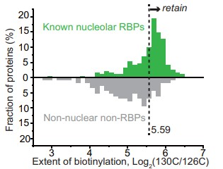

```{r setup, include=FALSE}
knitr::opts_chunk$set(
  collapse = T, echo=T, comment="#>", message=F, warning=F,
	fig.align="center", fig.width=5, fig.height=3, dpi=150)
```


The Frequency distribution histogram scripts is referenced from MicrobiomeStatPlot [Inerst Reference below].

If you use this script, please cited 如果你使用本代码，请引用：

**Yong-Xin Liu**, Lei Chen, Tengfei Ma, Xiaofang Li, Maosheng Zheng, Xin Zhou, Liang Chen, Xubo Qian, Jiao Xi, Hongye Lu, Huiluo Cao, Xiaoya Ma, Bian Bian, Pengfan Zhang, Jiqiu Wu, Ren-You Gan, Baolei Jia, Linyang Sun, Zhicheng Ju, Yunyun Gao, **Tao Wen**, **Tong Chen**. 2023. EasyAmplicon: An easy-to-use, open-source, reproducible, and community-based pipeline for amplicon data analysis in microbiome research. **iMeta** 2(1): e83. https://doi.org/10.1002/imt2.83

The online version of this tuturial can be found in https://github.com/YongxinLiu/MicrobiomeStatPlot


**Authors**
First draft(初稿)：Defeng Bai(白德凤)；Proofreading(校对)：Ma Chuang(马闯) and Jiani Xun(荀佳妮)；Text tutorial(文字教程)：Defeng Bai(白德凤)


# Introduction简介

什么是频率分布直方图？
What is Frequency distribution histogram?

频率分布直方图（histogram）是一种图表，用于显示数据集中各个数值范围内数据出现的频率。它将连续的数据分割为若干个区间（称为bins或箱子），并根据每个区间中的数据点数量绘制矩形柱。柱子的高度表示数据在该区间内出现的频率或次数。频率分布直方图可用于查看数据的分布情况，同时帮助快速了解数据的集中趋势、离散程度等特征。

A frequency distribution histogram is a chart that shows the frequency of data within each numerical range in a data set. It divides continuous data into several intervals (called bins or boxes) and draws rectangular columns based on the number of data points in each interval. The height of the column represents the frequency or number of times the data appears in that interval. The frequency distribution histogram can be used to view the distribution of data and help quickly understand the characteristics of the data, such as the central tendency and degree of dispersion.


关键字：微生物组数据分析、MicrobiomeStatPlot、频率分布直方图、R语言可视化

Keywords: Microbiome analysis, MicrobiomeStatPlot, Frequency distribution histogram , R visulization


## Frequency distribution histogram example 频率分布直方图案例

这个案例是来自于斯坦福大学Alice Y. Ting团队2021年发表于Nature Communications上的一篇论文。论文题目为：Spatiotemporally-resolved mapping of RNA binding proteins via functional proximity labeling reveals a mitochondrial mRNA anchor promoting stress recovery. https://doi.org/10.1038/s41467-021-25259-2

This case comes from a paper published in Nature Communications by Alice Y. Ting's team at Stanford University in 2021. The title of the paper is: Spatiotemporally-resolved mapping of RNA binding proteins via functional proximity labeling reveals a mitochondrial mRNA anchor promoting stress recovery. https://doi.org/10.1038/s41467-021-25259-2




Fig. 4b Sample histogram showing how the cutoff for 130 C/126 C TMT ratio was applied.
图 4b 样本直方图显示了如何应用 130 C/126 C TMT 比率的截止值。


**结果**

We filtered the mass spectrometric data by both the “pairwise ROC approach” (Fig. 4a, b and Supplementary Fig. 7b) and the “statistical approach”.

我们通过“成对 ROC 方法”（图 4a、b 和补充图 7b）和“统计方法”过滤质谱数据。


## Packages installation软件包安装

```{r}
# 基于CRAN安装R包，检测没有则安装 Installing R packages based on CRAN and installing them if they are not detected
p_list = c("ggplot2", "latex2exp", "readxl", "patchwork", "dplyr", "ggdag",
           "dagitty","broom","ggsci","brms" )
for(p in p_list){if (!requireNamespace(p)){install.packages(p)}
    library(p, character.only = TRUE, quietly = TRUE, warn.conflicts = FALSE)}

# 加载R包 Loading R packages
suppressWarnings(suppressMessages(library(ggplot2)))
suppressWarnings(suppressMessages(library(latex2exp)))
suppressWarnings(suppressMessages(library(readxl)))
suppressWarnings(suppressMessages(library(patchwork)))
suppressWarnings(suppressMessages(library(dplyr)))
suppressWarnings(suppressMessages(library(ggdag)))
suppressWarnings(suppressMessages(library(dagitty)))
suppressWarnings(suppressMessages(library(broom)))
suppressWarnings(suppressMessages(library(ggsci)))
suppressWarnings(suppressMessages(library(brms)))
```


# Frequency distribution histogram 频率分布直方图

## Practice1 实战1

参考：https://mp.weixin.qq.com/s/ypxoFaiZBIaBphcNPS5B_A
https://mp.weixin.qq.com/s/nYozxXYdpBXOC4Xh1RWH1A

```{r frequency distribution histogram1, fig.show='asis', fig.width=4, fig.height=2.5}
# 读取数据
# Load data
fig3a <- read_excel("data/data2.xlsx", sheet = "Fig3a", skip = 1)

# 设置颜色
# Set color
mypal <- pal_npg("nrc", alpha = 0.7)(10)
#mypal <- c("#4DBBD5", "#00A087", "#3C5488")
mypal <- c("#d5cabd", "#318eab", "#845ec2")

# 绘图
# plot
p_Frequency <- ggplot(data=fig3a, aes(x=h2)) +
  geom_histogram(aes(fill=type), bins = 100, alpha = 0.7, color = "white") +
  scale_fill_manual(values = mypal,
                    labels = c(TeX(r"(\textit{h}${^2}$ (       )"),
                                 TeX(r"(\textit{h}${^2}$ ()"),
                                 TeX(r"(\textit{h}${^2}$ (    )")),
                    name = "") +
  scale_x_continuous(expand = expansion(mult = c(0,0)),
                     breaks = seq(0, 1, 0.2),
                     limits = c(0, 1)) +
  scale_y_continuous(expand = expansion(mult = c(0,0))) +
  labs(y = "Counts",
       x = TeX(r"(\textit{h}${^2}$)")) +
  geom_vline(xintercept = c(0.27, 0.37, 0.62), linetype = "dashed", color = mypal) +
  theme_bw() +
  theme(panel.grid = element_blank(),
        legend.position = c(0.8, 0.8),
        legend.background = element_blank(),
        legend.box.background = element_rect(color = "black"),
        axis.text = element_text(size = 12),
        axis.title = element_text(size = 14, face = "bold"),
        plot.margin = margin(10, 10, 10, 10)) +
  geom_text(data = data.frame(x = c(0.27, 0.37, 0.62), y = 80, label = c("0.27", "0.37", "0.62")),
            aes(x = x, y = y, label = label),
            hjust = -0.1, size = 4, color = "black")

# 保存为PDF
# Save as PDF
ggsave(filename = "results/Frequency_distribution_histogram1.pdf", plot = p_Frequency, width = 10, height = 6)
```


## Practice2 实战2

堆叠上下频率分布直方图
Stack upper and lower frequency distribution histograms

https://www.andrewheiss.com/blog/2021/12/18/bayesian-propensity-scores-weights/
https://mp.weixin.qq.com/s/ezs2oNKj09RRSEdvqsfiNQ

```{r frequency distribution histogram2,fig.show='asis', fig.width=4, fig.height=2.5}
# 载入数据
# Load data
data <- read.table("data/data_hisogram.txt", header = TRUE, sep = "\t", comment.char = "")

# 绘制上下两轴直方图
# Draw a histogram of the upper and lower axes=
p_Frequency2 <- ggplot(data,aes(x = value, fill = variable))+ 
  geom_histogram(data = filter(data, variable == "group1"),
                 aes(y = ..count..),
                 binwidth = 100
    #aes(fill=type),#直方图函数(histgram)
                 #bins = 100
    )+
  geom_histogram(data = filter(data, variable == "group2"),
                 aes(y = ..count..*(-1)),
                 binwidth = 100
    #aes(fill=type),#直方图函数(histgram)
                 #bins = 100
    )+
  scale_x_continuous(limits = c(0,1100),                     
                     breaks = c(0,250,500,750,1000),                     
                     expand = c(0,0))+  
  scale_y_continuous(limits = c(-3.5,5.5),                     
                     breaks = seq(-4,6,1),          
                     labels = abs(seq(-4,6,1)))+
  theme_classic(base_size = 15)+  
  theme(panel.border = element_rect(size = 1,fill='transparent'),        
        legend.position = 'none',  
        axis.text = element_text(colour = 'black'))+  
  geom_vline(xintercept = 700,linetype=2,cex=1)+  
  scale_fill_manual(values = c('grey60','#2AC643'))
#p_Frequency2
# 保存为PDF
# Save as PDF
ggsave(filename = "results/Frequency_upper_lower1.pdf", width = 10, height = 6)


# 绘制上下多组频率分布直方图
# Draw multiple groups of frequency distribution histograms above and below
nets <- read.csv("data/mosquito_nets.csv")
mosquito_dag <- dagify(
  malaria_risk ~ net + income + health + temperature,
  net ~ income + health + temperature,
  health ~ income,
  exposure = "net",
  outcome = "malaria_risk",
  coords = list(x = c(malaria_risk = 7, net = 3, income = 4, health = 5, temperature = 6),
                y = c(malaria_risk = 2, net = 2, income = 3, health = 1, temperature = 3)),
  labels = c(malaria_risk = "Risk of malaria", net = "Mosquito net", income = "Income",
             health = "Health", temperature = "Nighttime temperatures",
             resistance = "Insecticide resistance")
)
adjustmentSets(mosquito_dag)

# 创建使用混杂因素预测治疗状况的模型
# Create model that predicts treatment status using confounders
model_treatment_freq <- glm(net ~ income + temperature + health,
                            data = nets,
                            family = binomial(link = "logit"))

# 计算治疗权重的倾向得分和逆概率
# Calculate propensity scores and inverse probability of treatment weights
nets_with_weights <- augment(model_treatment_freq, nets,
                             type.predict = "response")
nets_with_weights <- as.data.frame(nets_with_weights)
colnames(nets_with_weights)[colnames(nets_with_weights) == ".fitted"] <- "propensity"
nets_with_weights = nets_with_weights %>%
  mutate(iptw = (net_num / propensity) + ((1 - net_num) / (1 - propensity)))

# 评估治疗对结果的影响
# Estimates the effect of treatment on outcome
model_outcome_freq <- lm(malaria_risk ~ net,
                         data = nets_with_weights,
                         weights = iptw)

# `net` 的系数应为 -10ish
# Coefficient for `net` should be -10ish
tidy(model_outcome_freq)


# 自定义颜色方案 (Customize color palette)
isfahan_colors <- c("#4DBBD5B2", "#3C5488B2")

# 绘图
# Plot
p_Frequency3 <- ggplot() + 
  geom_histogram(data = filter(nets_with_weights, net_num == 1), 
                 bins = 50, aes(x = propensity, weight = iptw), 
                 fill = colorspace::lighten(isfahan_colors[1], 0.35)) +
  geom_histogram(data = filter(nets_with_weights, net_num == 0), 
                 bins = 50, aes(x = propensity, weight = iptw, y = -after_stat(count)),
                 fill = colorspace::lighten(isfahan_colors[2], 0.35)) +
  geom_histogram(data = filter(nets_with_weights, net_num == 1), 
                 bins = 50, aes(x = propensity), 
                 fill = isfahan_colors[1]) + 
  geom_histogram(data = filter(nets_with_weights, net_num == 0), 
                 bins = 50, aes(x = propensity, y = -after_stat(count)),
                 fill = isfahan_colors[2]) +
  annotate(geom = "label", x = 0.8, y = 70, label = "Treated (actual)", 
           fill = isfahan_colors[1], color = "white", hjust = 1, size = 4) +
  annotate(geom = "label", x = 0.8, y = 90, label = "Treated (IPTW pseudo-population)", 
           fill = colorspace::lighten(isfahan_colors[1], 0.35), color = "white", hjust = 1, size = 4) +
  annotate(geom = "label", x = 0.8, y = -60, label = "Untreated (actual)", 
           fill = isfahan_colors[2], color = "white", hjust = 1, size = 4) +
  annotate(geom = "label", x = 0.8, y = -80, label = "Untreated (IPTW pseudo-population)", 
           fill = colorspace::lighten(isfahan_colors[2], 0.35), color = "white", hjust = 1, size = 4) +
  geom_hline(yintercept = 0, color = "white", linewidth = 0.25) +
  scale_y_continuous(label = abs) +
  coord_cartesian(xlim = c(0.1, 0.8), ylim = c(-80, 100)) +
  labs(x = "Propensity", y = "Count") +
  theme_classic(base_size = 15)+  
  theme(panel.border = element_rect(size = 1,fill='transparent'),        
        legend.position = 'none',  
        axis.text = element_text(colour = 'black'))

# 保存为PDF
# Save as PDF
ggsave(filename = "results/Frequency_upper_lower2.pdf", width = 10, height = 6)

# 组合图
library(cowplot)
width = 89
height = 59
p0 = plot_grid(p_Frequency2, p_Frequency3, labels = c("A", "B"), ncol = 2)
ggsave("results/Frequency_distribution_histogram2.pdf", p0, width = width * 3, height = height * 2, units = "mm")
```


If used this script, please cited:
使用此脚本，请引用下文：

**Yong-Xin Liu**, Lei Chen, Tengfei Ma, Xiaofang Li, Maosheng Zheng, Xin Zhou, Liang Chen, Xubo Qian, Jiao Xi, Hongye Lu, Huiluo Cao, Xiaoya Ma, Bian Bian, Pengfan Zhang, Jiqiu Wu, Ren-You Gan, Baolei Jia, Linyang Sun, Zhicheng Ju, Yunyun Gao, **Tao Wen**, **Tong Chen**. 2023. EasyAmplicon: An easy-to-use, open-source, reproducible, and community-based pipeline for amplicon data analysis in microbiome research. **iMeta** 2: e83. https://doi.org/10.1002/imt2.83

Copyright 2016-2024 Defeng Bai <baidefeng@caas.cn>, Chuang Ma <22720765@stu.ahau.edu.cn>, Jiani Xun <15231572937@163.com>, Yong-Xin Liu <liuyongxin@caas.cn>

