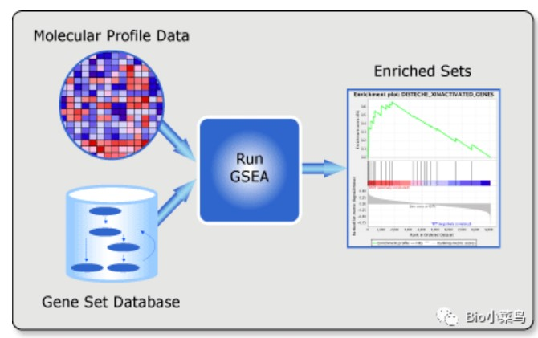
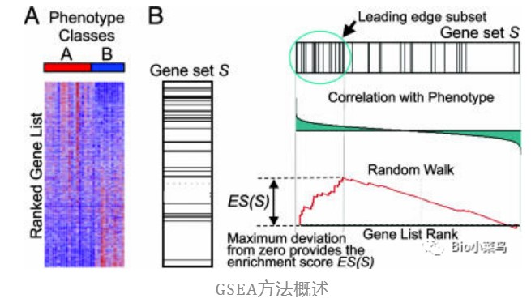
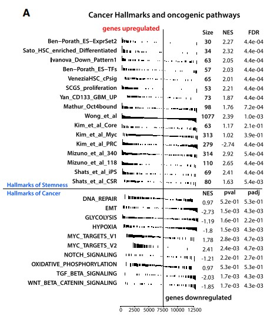
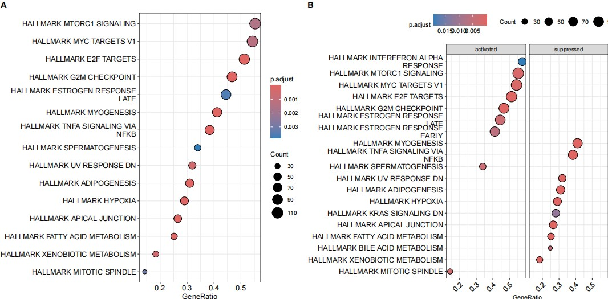
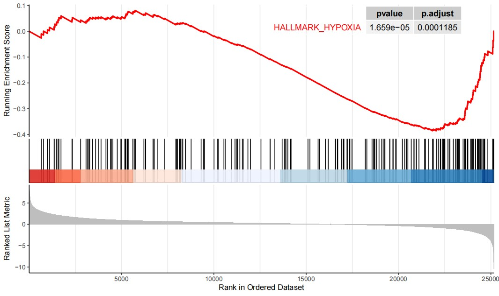
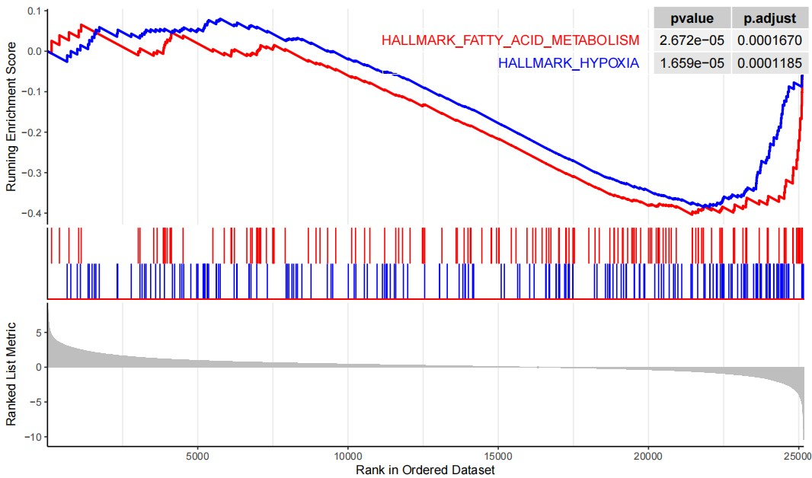

```{r setup, include=FALSE}
knitr::opts_chunk$set(
  collapse = T, echo=T, comment="#>", message=F, warning=F,
	fig.align="center", fig.width=5, fig.height=3, dpi=150)
```


The Gene Set Enrichment Analysis scripts is referenced from MicrobiomeStatPlot [Inerst Reference below].

If you use this script, please cited 如果你使用本代码，请引用：

**Yong-Xin Liu**, Lei Chen, Tengfei Ma, Xiaofang Li, Maosheng Zheng, Xin Zhou, Liang Chen, Xubo Qian, Jiao Xi, Hongye Lu, Huiluo Cao, Xiaoya Ma, Bian Bian, Pengfan Zhang, Jiqiu Wu, Ren-You Gan, Baolei Jia, Linyang Sun, Zhicheng Ju, Yunyun Gao, **Tao Wen**, **Tong Chen**. 2023. EasyAmplicon: An easy-to-use, open-source, reproducible, and community-based pipeline for amplicon data analysis in microbiome research. **iMeta** 2(1): e83. https://doi.org/10.1002/imt2.83

The online version of this tuturial can be found in https://github.com/YongxinLiu/MicrobiomeStatPlot


**Authors**
First draft(初稿)：Defeng Bai(白德凤)；Proofreading(校对)：Ma Chuang(马闯) and Xun Jiani(荀佳妮)；Text tutorial(文字教程)：Defeng Bai(白德凤)


# Introduction简介

GESA富集分析
GESA enrichment analysis

参考：https://mp.weixin.qq.com/s/EadjcnMtLRb2aGRbLj6HMQ
https://mp.weixin.qq.com/s/vFrm5t2WEr3-BwV54i-V0A
https://mp.weixin.qq.com/s/r5BZ_pPMGaeuyGkIH_PXZQ
https://mp.weixin.qq.com/s/jhF9EMO_QLUMiyLsacCp7w


什么是GESA富集分析
What is GESA enrichment analysis?

GESA，全称为Gene Set Enrichment Analysis, 该方法发表于2005年的Gene set enrichment analysis: a knowledge-based approach forinterpreting genome-wide expression profiles，是一种基于基因集的富集分析方法。在常规的转录组分析中，往往会得到大量的差异表达基因，但如何将这些差异基因与生物学功能结合在一起成为一个挑战。传统的KEGG和GO分析可以提取差异基因序列，与预设的通路进行比较，并得到通路富集的结果，但是它们通常只提供了基因集的整体富集信息，没有考虑基因的调控方向(上调或下调)。因此，我们无法了解差异基因如何影响整个通路或生物学功能。GSEA不依赖预定义的基因列表(一般指差异基因)，而是使用整个基因表达数据库。它通过对基因排序和富集得分的计算，能够全面考察基因集的富集情况，并区分富集在基因表达上调或下调的基因集。这样，我们可以更好地理解差异基因在整个通路或生物学功能中的集体影响，而不仅仅是关注单个差异基因的表达情况。

GESA, the full name of which is Gene Set Enrichment Analysis, was published in Gene set enrichment analysis: a knowledge-based approach for interpreting genome-wide expression profiles in 2005. It is an enrichment analysis method based on gene sets. In conventional transcriptome analysis, a large number of differentially expressed genes are often obtained, but how to combine these differentially expressed genes with biological functions becomes a challenge. Traditional KEGG and GO analysis can extract differentially expressed gene sequences, compare them with preset pathways, and obtain pathway enrichment results, but they usually only provide overall enrichment information of gene sets without considering the regulatory direction of genes (upregulation or downregulation). Therefore, we cannot understand how differentially expressed genes affect the entire pathway or biological function. GSEA does not rely on a predefined gene list (generally referring to differentially expressed genes), but uses the entire gene expression database. It can comprehensively examine the enrichment of gene sets and distinguish gene sets enriched in upregulated or downregulated gene expression by ranking genes and calculating enrichment scores. In this way, we can better understand the collective impact of differentially expressed genes in the entire pathway or biological function, rather than just focusing on the expression of a single differentially expressed gene.

GSEA所适用的主要场景之一是：它能帮助生物学家在两种不同的生物学状态中，判断某一组有特定意义的基因集合的表达模式更接近哪一种。因此GSEA是一种非常常见且实用的分析方法，可以将数个基因组成的基因集与整个转录组、修饰组等做出简单而清晰的关联分析。除了对特定gene set的分析，反过来GSEA也可以用于发现两组样本从表达或其它度量水平分别与那些特定生物学意义的基因集有显著关联，或者发现那些基因集的表达模式或其它模式更接近于表型A、哪些更接近于表型B。这些特定的基因集合可以从GO、KEGG、Reactome、hallmark或MSigDB等基因集中获取，其中MSigDB数据库整合了上述所有基因集。研究者也可以自定义gene set(即新发现的基因集或其它感兴趣的基因的集合)。GESA分析和GO分析又有所不同。GO分析更加依赖差异基因，实则是对一部分基因的分析(忽略差异不显著的基因)，而GSEA是从全体基因的表达矩阵中找出具有协同差异的基因集，故能兼顾差异较小的基因。因此二者的应用场景略有区别。另外GO富集是定性的分析，GSEA考虑到了表达或其它度量水平的值的影响。另外，对于时间序列数据或样品有定量属性时，GSEA的优势会更明显，不需要每个分别进行富集，直接对整体进行处理。可以类比于之前的WGCNA分析。

One of the main scenarios where GSEA is applicable is that it can help biologists determine which expression pattern of a specific set of genes is closer to one of two different biological states. Therefore, GSEA is a very common and practical analysis method that can perform simple and clear correlation analysis between a gene set composed of several genes and the entire transcriptome, modification group, etc. In addition to the analysis of specific gene sets, GSEA can also be used to find that two groups of samples are significantly related to those gene sets of specific biological significance from the expression or other metric levels, or to find the expression patterns of those gene sets or other Which patterns are closer to phenotype A and which are closer to phenotype B. These specific gene sets can be obtained from gene sets such as GO, KEGG, Reactome, hallmark, or MSigDB, where the MSigDB database integrates all the above gene sets. Researchers can also customize gene sets (i.e., newly discovered gene sets or other genes of interest). GESA analysis and GO analysis are different again. GO analysis relies more on differential genes, which is actually an analysis of a part of the genes (ignoring genes with insignificant differences), while GSEA finds gene sets with synergistic differences from the expression matrix of all genes, so it can take into account small differences. Gene. Therefore, the application scenarios of the two are slightly different. In addition, GO enrichment is a qualitative analysis, and GSEA takes into account the influence of expression or other metric level values. In addition, when time series data or samples have quantitative attributes, the advantages of GSEA will be more obvious. There is no need to enrich each separately and directly process the whole. It can be compared to the previous WGCNA analysis.

GSEA,基因集富集分析用来评估一个预先定义的基因集在的基因在与表型相关度排序的基因表中的分布趋势，从而判断其对表型的贡献。其输入数据包含两部分，一是已知功能的基因集(可以是GO注释、MsigDB的注释或其它符合格式的基因集定义)，一是表达矩阵(也可以是排序好的列表)，软件会对基因根据其与表型的关联度(可以理解为表达值的变化)从大到小排序，然后判断基因集内每条注释下的基因是否富集于表型相关度排序后基因表的上部或下部，从而判断此基因集内基因的协同变化对表型变化的影响。

GSEA, Gene Set Enrichment Analysis is used to evaluate the distribution trend of genes in a predefined gene set in a gene table sorted by phenotype relevance, so as to determine its contribution to the phenotype. Its input data consists of two parts, one is a gene set with known functions (which can be GO annotations, MsigDB annotations or other gene set definitions that conform to the format), and the other is an expression matrix (which can also be a sorted list). The software will sort the genes from large to small according to their relevance to the phenotype (which can be understood as the change in expression value), and then determine whether the genes under each annotation in the gene set are enriched in the upper or lower part of the gene table sorted by phenotype relevance, so as to determine the impact of the coordinated changes of the genes in this gene set on the phenotypic changes.

与之前的GO富集分析不同。GO富集分析是先筛选差异基因，再判断差异基因在那些注释的通路存在富集；这涉及到阈值的设定，存在一定主观性并且只能用于表达变化较大的基因，即我们定义的显著差异基因。而GSEA则不局限于差异基因，从基因集的富集角度出发，理论上更荣誉囊括席位但协调性的变化对生物通路的影响，尤其是差异倍数不太大的基因集。

Different from previous GO enrichment analysis. GO enrichment analysis first screens differential genes, and then determines whether the differential genes are enriched in those annotated pathways; this involves the setting of thresholds, which is subject to a certain degree and can only be used for genes with large expression changes, which is what we define of significantly different genes. GSEA is not limited to differential genes. From the perspective of gene set enrichment, it theoretically covers the impact of changes in seat but coordination on biological pathways, especially gene sets with small differences in folds.

GSEA富集分析原理(GSEA enrichment analysis principle)
GSEA数据库官网(GSEA database official website)：https://www.gsea-msigdb.org/gsea/index.jsp



主要分为三个步骤(There are three main steps)：



第 1 步：计算丰富分数。计算富集分数（ES ），它反映了集合S在整个排名列表L的极端（顶部或底部）处被过度代表的程度。分数是通过沿着列表L计算的，当遇到S中的基因时增加运行总和统计量，当遇到不在S中的基因时减少运行总和统计量。增量的大小取决于基因与表型的相关性。

Step 1: Calculate enrichment scores. Calculate an enrichment score (ES), which reflects the degree to which set S is overrepresented at the extremes (top or bottom) of the entire ranked list L. The score is calculated by walking along list L, increasing the running sum statistic when encountering a gene in S and decreasing the running sum statistic when encountering a gene not in S. The size of the increment depends on the relevance of the gene to the phenotype.

步骤2：估计ES的显着性水平。通过使用基于经验表型的排列测试程序来估计ES的统计显着性（名义P值） ，该程序保留了基因表达数据的复杂相关结构。具体来说，我们排列表型标签并重新计算排列数据的基因集的ES ，这会生成ES的零分布。观察到的ES的经验名义P值然后相对于该零分布进行计算。

Step 2: Estimate the significance level of the ES. The statistical significance (nominal P value) of the ES is estimated by using an empirical phenotype-based permutation test procedure that preserves the complex correlation structure of the gene expression data. Specifically, we permute the phenotype labels and recalculate the ES for the gene set of the permuted data, which generates a null distribution of the ES. The empirical nominal P value of the observed ES is then calculated relative to this null distribution.

步骤 3：调整多重假设检验。当评估整个基因集数据库时，调整估计的显着性水平以考虑多重假设检验。首先对每个基因集的ES进行归一化以考虑基因组的大小，从而产生归一化的富集分数（NES）。然后，通过计算与每个NES对应的错误发现率（FDR）来控制误报的比例。

Step 3: Adjustment for multiple hypothesis testing. When evaluating the entire gene set database, the estimated significance level was adjusted to account for multiple hypothesis testing. The ES for each gene set was first normalized to account for the size of the genome, resulting in a normalized enrichment score (NES). The proportion of false positives was then controlled by calculating the false discovery rate (FDR) corresponding to each NES.


关键字：微生物组数据分析、MicrobiomeStatPlot、基因集富集分析、R语言可视化

Keywords: Microbiome analysis, MicrobiomeStatPlot, Gene Set Enrichment Analysis , R visulization


## 基因富集分析(GSEA)案例 Gene Set Enrichment Analysis Example

这是来自于波兰医科大学的Maciej Wiznerowicz团队2018年发表于Cell上的一篇论文用到的GSEA分析。论文题目为：Machine Learning Identifies Stemness Features Associated with Oncogenic Dedifferentiation。

This is the GSEA analysis used in a paper published in Cell in 2018 by Maciej Wiznerowicz's team from the Medical University of Poland. The title of the paper is: Machine Learning Identifies Stemness Features Associated with Oncogenic Dedifferentiation.



Figure 2. (A) Gene Set Enrichment Analysis showing RNA sequencing (RNA-seq)-based stemness signature evaluated in the context of gene sets representative for
hallmarks of stemness and cancer.

图 2. (A) 基因集富集分析显示在代表干细胞和癌症特征的基因集背景下评估基于 RNA 测序 (RNA-seq) 的干细胞特征。

**结果**

These sets spanned 2,564 unique genes, with no 2 sets overlapping by more than 134 genes. In all cases, the published stemness gene sets were significantly enriched in mRNAsi (Figure 2A). 
这些集合涵盖 2,564 个独特基因，其中没有两个集合的重叠基因超过 134 个。在所有情况下，已发表的干性基因集合在 mRNAsi 中显著富集（图 2A）。


## Packages installation软件包安装

```{r}
# 基于CRAN安装R包，检测没有则安装
p_list = c("ggplot2", "dplyr", "data.table")
for(p in p_list){if (!requireNamespace(p)){install.packages(p)}
    library(p, character.only = TRUE, quietly = TRUE, warn.conflicts = FALSE)}

# 基于Bioconductor安装R包
if (!requireNamespace("clusterProfiler", quietly = TRUE))
    BiocManager::install("clusterProfiler")

# 基于Bioconductor安装R包
if (!requireNamespace("GSEABase", quietly = TRUE))
    BiocManager::install("GSEABase")

# 加载R包 Load the package
suppressWarnings(suppressMessages(library(clusterProfiler)))
suppressWarnings(suppressMessages(library(ggplot2)))
suppressWarnings(suppressMessages(library(dplyr)))
suppressWarnings(suppressMessages(library(data.table)))
suppressWarnings(suppressMessages(library(GSEABase)))
```


# Gene Set Enrichment Analysis 基因集富集分析

## GSEA using R software 基因富集分析(GSEA)R语言实战

参考(Reference)：https://mp.weixin.qq.com/s/vFrm5t2WEr3-BwV54i-V0A

基因集的下载(Gene dataset download)
可以使用GSEA官网MSigDB提供的基因集，这里选择的是hallmark gene set，自己可以根据情况选择，也可以使用KEGG或GO的基因集来做GSEA分析或者自定义基因集。
You can use the gene set provided by MSigDB on the GSEA official website. Here we choose the hallmark gene set. You can choose according to the situation. You can also use the KEGG or GO gene set to perform GSEA analysis or customize the gene set.
MSigDB链接(MSigDB link)：https://www.gsea-msigdb.org/gsea/msigdb/index.jsp


```{r GSEA, include=TRUE}
# Load data 载入数据
geneSet <- read.gmt("data/h.all.v2023.1.Hs.symbols.gmt") #下载的基因集(downloaded gene set)
BRCA_Mathc_DEG <- fread("data/BRCA_Match_DEG.txt",data.table = F)

# GSEA富集分析的另一个关键是基因排序问题，一般可以直接使用logFC进行排序，也可以使用P值和logFC的结合来进行排序或者其它合理的排序方式。
# Another key to GSEA enrichment analysis is the gene sorting problem. Generally, logFC can be used directly for sorting, or a combination of P value and logFC can be used for sorting, or other reasonable sorting methods can be used.
# 1、直接使用logFC作为排序依据
# 1. Use logFC directly as the sorting basis
geneList <- BRCA_Mathc_DEG$logFC #获取GeneList
names(geneList) <- BRCA_Mathc_DEG$gene_id #使用转换好的ID对GeneList命名(Use the converted ID to name the GeneList)
geneList <- sort(geneList, decreasing = T) #从高到低排序(Sort from high to low)

GSEA_enrichment <- GSEA(geneList, #排序后的gene(Sorted genes)
                        TERM2GENE = geneSet, #基因集(Gene set)
                        pvalueCutoff = 0.05, #P值阈值(p value cutoff)
                        minGSSize = 10, #最小基因数量(minium gene number)
                        maxGSSize = 500, #最大基因数量(maximum gene number)
                        eps = 0, #P值边界(P value boundary)
                        pAdjustMethod = "BH") #校正P值的计算方法(p-value adjusted method)

result <- data.frame(GSEA_enrichment)
dim(GSEA_enrichment@result)

# 富集结果，hallmark基因集中有20个显著富集。
# Enrichment results, there are 20 significant enrichments in the hallmark gene set.
# 每一列代表的含义(What each column represents)：
# ID: 这一列代表基因集的标识符或名称。(This column represents the identifier or name of the gene set.)
# Description: 这一列表示基因集的描述或注释，通常是对基因集功能、通路或生物学过程的解释。(This column represents the description or annotation of the gene set, usually an explanation of the gene set's function, pathway, or biological process.)
# setSize: 这一列表示基因集中包含的基因数量。(This column indicates the number of genes included in the gene set.)
# enrichmentScore: 这一列表示富集得分（Enrichment Score），它是一个反映基因集在基因表达数据中富集程度的统计量。(This column represents the enrichment score, which is a statistic that reflects the degree of enrichment of a gene set in gene expression data.)
# NES: 这一列表示标准化富集得分（Normalized Enrichment Score），它是将富集得分标准化后的值，使得不同基因集的富集得分可比较。(This column represents the Normalized Enrichment Score, which is the value after the enrichment score is standardized so that the enrichment scores of different gene sets can be compared.)
# pvalue: 这一列表示富集得分的显著性水平（p-value），用于衡量基因集在基因表达数据中的显著性富集。(This column represents the significance level (p-value) of the enrichment score, which measures the significant enrichment of the gene set in the gene expression data.)
# p.adjust: 这一列表示多重比较校正后的p-value，通常使用FDR或其他方法进行校正。(This column represents the p-value after correction for multiple comparisons, usually using FDR or other methods.)
# qvalue: 这一列表示估计的FDR（False Discovery Rate），用于控制多重假设检验引起的假阳性。This column represents the estimated FDR (False Discovery Rate), which is used to control the false positives caused by multiple hypothesis testing.
# rank: 这一列表示基因集在排序后的基因列表中的排名。This column indicates the rank of the gene set in the sorted gene list.
# leading_edge: 这一列指示哪些基因在计算富集得分时对富集结果产生了主要贡献。This column indicates which genes made the main contribution to the enrichment result when calculating the enrichment score.
# tags=60%: 这表示60%的基因集中的基因在富集分析中对结果产生了影响。This means that 60% of the genes in the gene set had an impact on the results in the enrichment analysis.
# list=10%: 这表示在富集分析中使用的整体基因列表（gene list）中，有10%的基因在该基因集中。This means that 10% of the genes in the overall gene list used in the enrichment analysis are in this gene set.
# signal=55%: 这表示在整个基因集中，有55%的基因在样本中显示出富集信号，即在表达数据中呈现出差异表达的特征。(由tags和list计算得来)。This means that in the entire gene set, 55% of the genes show enrichment signals in the sample, that is, they show differential expression characteristics in the expression data (calculated by tags and lists).
# core_enrichment: 这一列指示哪些基因是核心富集基因，对于形成富集得分起关键作用。This column indicates which genes are core enriched genes and play a key role in forming the enrichment score.

# GSEA结果绘图
# GSEA result drawing
# 展示最显著的15个通路
# Display the 15 most significant paths
p1 <- dotplot(GSEA_enrichment,showCategory=15,color="p.adjust") 

# 按照上调和下调展示通路
# Show pathways by up-regulation and down-regulation
# 将通路分为激活和抑制两个部分
# Divide the pathway into two parts: activation and inhibition
p2 <- dotplot(GSEA_enrichment,split = ".sign")+facet_grid(~.sign)+
  theme(plot.title = element_text(size = 10,color="black",hjust = 0.5),
        axis.title = element_text(size = 10,color ="black"), 
        axis.text = element_text(size= 10,color = "black"),
        axis.text.x = element_text(angle = 45, hjust = 1 ),
        legend.position = "top",
        legend.text = element_text(size= 10),
        legend.title= element_text(size= 10))

# 绘制特定通路富集情况
# Draw the enrichment of specific pathways
# 特定通路作图
# Mapping specific pathways
library(enrichplot)
#看一下缺氧通路
#Look at the hypoxia pathway
pdf("results/GSEA_specific_pathways.pdf", width = 10, height = 6) 
gseaplot2(GSEA_enrichment,"HALLMARK_HYPOXIA",color="red",pvalue_table = T) 
dev.off()

#同时绘制多个通路
#Draw multiple paths at the same time
#缺氧通路+脂肪酸代谢通路
#Hypoxia pathway + fatty acid metabolism pathway
pdf("results/GSEA_multiple_pathways.pdf", width = 10, height = 6)
gseaplot2(GSEA_enrichment,c("HALLMARK_HYPOXIA","HALLMARK_FATTY_ACID_METABOLISM"),color=c("red","blue"),pvalue_table = T)
dev.off()

#排序方式会影响富集结果，我们来看一下第二种排序方式。
#The sorting method will affect the enrichment results. Let's take a look at the second sorting method.
#这里使用log后的FDR值并乘上logFC的正负号作为排序方式。
#Here we use the logarithmic FDR value and multiply it by the sign of logFC as the sorting method.
# 2、使用FDR作为排序依据
# 2. Use FDR as the basis for sorting
# 将对FDR值取对数后的结果乘以基因表达差异方向的正负号，从而获得一个综合的统计量"stat"作为排序依据。
# Multiply the logarithm of the FDR value by the sign of the gene expression difference to obtain a comprehensive statistic "stat" as the basis for sorting.
BRCA_Mathc_DEG <- BRCA_Mathc_DEG %>% dplyr::mutate(stat = -log10(FDR) * sign(logFC))
geneList <- BRCA_Mathc_DEG$stat #获取GeneList(get GeneList)
names(geneList) <- BRCA_Mathc_DEG$gene_id 
geneList <- sort(geneList, decreasing = T) 

GSEA_enrichment2 <- GSEA(geneList,
                        TERM2GENE = geneSet, 
                        pvalueCutoff = 0.05, 
                        minGSSize = 10, 
                        maxGSSize = 500, 
                        eps = 0, 
                        pAdjustMethod = "BH") 

dim(GSEA_enrichment2@result)

#比第一种方式多出了几个显著的富集通路，说明排序方式对结果的影响还是有一些的。
#There are several more significant enrichment pathways than the first method, indicating that the sorting method still has some impact on the results.
```


# Combo plots排版

Combo plots to published-ready figure

组合多个子图为发表格式

```{r waffle_combo, fig.show='asis', fig.width=8, fig.height=7.5, dpi=72}
library(cowplot)
width = 89
height = 59
p0 = plot_grid(p1, p2, labels = c("A", "B"), ncol = 2)
ggsave("results/GSEA_plot1.pdf", p0, width = width * 4, height = height * 3, units = "mm")
```


图1-2 上调和下调通路




图3 特定通路




图4 多通路

If used this script, please cited:
使用此脚本，请引用下文：

**Yong-Xin Liu**, Lei Chen, Tengfei Ma, Xiaofang Li, Maosheng Zheng, Xin Zhou, Liang Chen, Xubo Qian, Jiao Xi, Hongye Lu, Huiluo Cao, Xiaoya Ma, Bian Bian, Pengfan Zhang, Jiqiu Wu, Ren-You Gan, Baolei Jia, Linyang Sun, Zhicheng Ju, Yunyun Gao, **Tao Wen**, **Tong Chen**. 2023. EasyAmplicon: An easy-to-use, open-source, reproducible, and community-based pipeline for amplicon data analysis in microbiome research. **iMeta** 2: e83. https://doi.org/10.1002/imt2.83

Copyright 2016-2024 Defeng Bai <baidefeng@caas.cn>, Chuang Ma <22720765@stu.ahau.edu.cn>, Jiani Xun <15231572937@163.com>, Yong-Xin Liu <liuyongxin@caas.cn>

