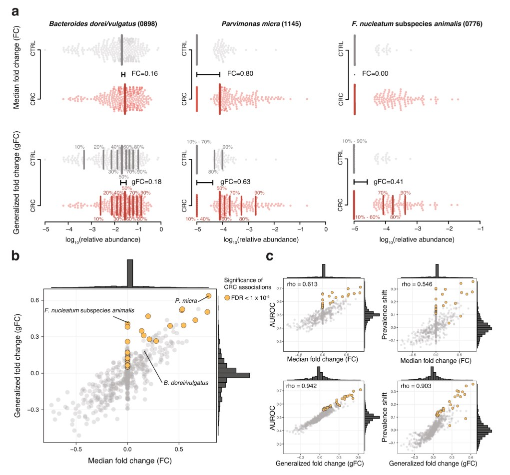
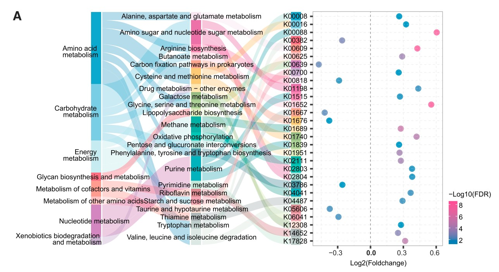
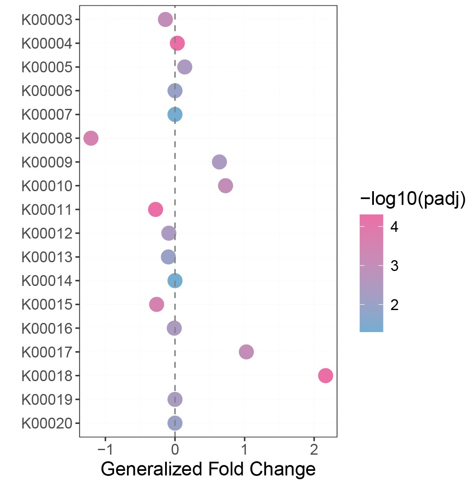

```{r setup, include=FALSE}
knitr::opts_chunk$set(
  collapse = T, echo=T, comment="#>", message=F, warning=F,
	fig.align="center", fig.width=5, fig.height=3, dpi=150)
```


The Generalized fold change scripts is referenced from MicrobiomeStatPlot [Inerst Reference below].

If you use this script, please cited 如果你使用本代码，请引用：

**Yong-Xin Liu**, Lei Chen, Tengfei Ma, Xiaofang Li, Maosheng Zheng, Xin Zhou, Liang Chen, Xubo Qian, Jiao Xi, Hongye Lu, Huiluo Cao, Xiaoya Ma, Bian Bian, Pengfan Zhang, Jiqiu Wu, Ren-You Gan, Baolei Jia, Linyang Sun, Zhicheng Ju, Yunyun Gao, **Tao Wen**, **Tong Chen**. 2023. EasyAmplicon: An easy-to-use, open-source, reproducible, and community-based pipeline for amplicon data analysis in microbiome research. **iMeta** 2(1): e83. https://doi.org/10.1002/imt2.83

The online version of this tuturial can be found in https://github.com/YongxinLiu/MicrobiomeStatPlot


**Authors**
First draft(初稿)：Defeng Bai(白德凤)；Proofreading(校对)：Ma Chuang(马闯) and Xun Jiani(荀佳妮)；Text tutorial(文字教程)：Defeng Bai(白德凤)


# Introduction简介

广义倍数变化（Generalized fold change）是Wirbel et al., 2019在发表于Nature Medicine上的一篇论文引入的，论文题目为：Meta-analysis of fecal metagenomes reveals global microbial signatures that are specific for colorectal cancer. https://doi.org/10.1038/s41591-019-0406-6. 

广义倍数变化在倍数变化中引入了多个分位数的倍数变化，然后计算多个分位数的平均差异，这样能够更广泛的反映菌群丰度数据的倍数变化。

下面是论文中关于Generalized fold change的解释：

We further developed a generalization of the (logarithmic) fold change that is widely used for other types of read abundance data. This generalization is designed to have better resolution for sparse microbiome profiles, where 0 entries can render median-based fold change estimates uninformative for a large portion of species with a prevalence below 0.5. The generalized fold change is calculated as the mean difference in a set of predefined quantiles of the logarithmic CTRL and CRC distributions. We used quantiles ranging from 0.1 to 0.9 in increments of 0.1.

我们进一步开发了广泛用于其他类型读取丰度数据的（对数）倍数变化的泛化。此泛化旨在为稀疏微生物组配置文件提供更好的分辨率，其中 0 个条目可能会导致基于中位数的倍数变化估计对大部分流行率低于 0.5 的物种没有参考价值。广义倍数变化计算为对数 CTRL 和 CRC 分布的一组预定义分位数的平均差异。我们使用的分位数范围从 0.1 到 0.9，增量为 0.1。



Extended Data Fig. 3 | The generalized fold change extends the established (median-based) fold change to provide higher resolution in sparse microbiome data. a, In the top row, the logarithmic relative abundances for Bacteroides dorei/vulgatus, Parvimonas micra, and F. nucleatum subspecies animalis—examples for one high-prevalence and two low-prevalence species—are shown as swarm plots for the CTRL and CRC groups. The thick vertical lines indicate the medians in the different groups and the black horizontal line shows the difference between the two medians, which corresponds to the classical (median-based) fold change. Since F. nucleatum subspecies animalis is not detectable in more than 50% of cancer cases, there is no difference between the CTRL and CRC median; thus, the fold change is 0. The lower row shows the same data, but instead of only the median (or 50th percentile), 9 quantiles ranging from 10 to 90% are shown by the thinner vertical lines. The generalized fold change is indicated by the horizontal black line again, computed as the mean of the differences between the corresponding quantiles in both groups. In the case of the sparse data (for example, F. nucleatum), the differences in the 70, 80, and 90% quantiles cause the generalized fold change to be higher than 0. b, The median fold change is plotted against the newly developed generalized fold change for all microbial species. (The core set of microbial CRC marker species is highlighted in orange.) Marginal histograms visualize the distribution for both fold change and generalized fold change. c, Scatter plots showing the relationship between fold change and generalized fold change and the area under the ROC curve (AUROC) or the shift in prevalence between CRC and CTRL, with Spearman’s rank correlations (rho) added in the top left corners; the generalized fold change provides higher resolution (wider distribution around 0) and better correlation with the non-parametric AUROC effect size measure as well as prevalence shift, which captures the difference in prevalence of a species in CRC metagenomes relative to CTRL metagenomes.

扩展数据图 3 | 广义倍数变化扩展了已建立的（基于中位数的）倍数变化，以在稀疏微生物组数据中提供更高的分辨率。a、在第一行中，Bacteroides dorei/vulgatus、Parvimonas micra 和 F. nucleatum 动物亚种的对数相对丰度（一个高流行率物种和两个低流行率物种的示例）显示为 CTRL 和 CRC 组的群图。粗垂直线表示不同组中的中位数，黑色水平线显示两个中位数之间的差异，这对应于经典的（基于中位数的）倍数变化。由于在超过 50% 的癌症病例中检测不到 F. nucleatum 动物亚种，因此 CTRL 和 CRC 中位数之间没有差异；因此倍数变化为 0。下行显示相同的数据，但不是只有中位数（或第 50 个百分位数），而是用较细的垂直线显示从 10% 到 90% 的 9 个分位数。广义倍数变化再次用水平黑线表示，计算为两组相应分位数之间差异的平均值。对于稀疏数据（例如 F. nucleatum），70%、80% 和 90% 分位数的差异导致广义倍数变化高于 0。b、将中位数倍数变化与所有微生物物种的新开发的广义倍数变化绘制在一起。（微生物 CRC 标记物种的核心集以橙色突出显示。）边际直方图可视化倍数变化和广义倍数变化的分布。 c，散点图显示倍数变化与广义倍数变化以及 ROC 曲线下面积 (AUROC) 或 CRC 与 CTRL 之间的流行率变化之间的关系，左上角添加了 Spearman 等级相关性 (rho)；广义倍数变化提供更高的分辨率（在 0 附近分布更广）并且与非参数 AUROC 效应尺寸测量以及流行率变化具有更好的相关性，这可以捕捉 CRC 宏基因组中物种流行率相对于 CTRL 宏基因组的差异。


关键字：微生物组数据分析、MicrobiomeStatPlot、广义倍数变化、R语言可视化

Keywords: Microbiome analysis, MicrobiomeStatPlot, Generalized fold change, R visulization


## Generalized fold change Example 广义倍数变化应用案例

本文是上海交通大学Chen Haoyan课题组于2023年发表于Cell Host & Microbe上的一篇文章用到的桑基图和气泡图结合，展示KEGG功能通路和KO基因差异。题目为：Multi-kingdom gut microbiota analyses define bacterial-fungal interplay and microbial markers of pan-cancer immunotherapy across cohorts。

This article is an article published by Chen Haoyan's research group at Shanghai Jiao Tong University in 2023 on Cell Host&Microbe, which combines the Sangi plot and bubble plot to demonstrate the differences in KEGG functional pathways and KO genes. The title is: Multi kingdom gut microbiota analyses define bacterial empty interplay and microbial markers of pan cancer immune across cohorts.


Figure 6. A (A) (Left) Sankey plot showing the distribution of Kyoto Encyclopedia of Genes and Genomes (KEGG) levels and differential KO genes involving in metabolism. (Right) Bubble plot showing the generalized fold change of KO genes. Color of the dot represents -log10(FDR).

图 6. (A) (左) 桑基图显示KEGG分布和参与代谢的差异 KO 基因。(右) 气泡图显示 KO 基因的广义倍数变化。点的颜色代表 -log10(FDR)。


**结果**

Since the gut microbiome differed between responders and non-responders, we hypothesized that microbial functions exhibited distinct patterns in the two response phenotypes. To test this, we investigated functional alterations in Kyoto Encyclopedia of Genes and Genomes (KEGG) orthology (KO) genes, pathways, and EggNOG orthology genes in 4 datasets treated with anti-PD-1 monotherapy. The most significantly enriched metabolic KO gene in responders was involved in purine metabolism, followed by a gene involved in butanoate metabolism (Figure 6A). K00700 (EC:2.4.1.18) was involved in starch and sucrose metabolism (Figure 6A), directly responsible for the synthesis of starch from amylose.

由于应答者和无应答者的肠道微生物组不同，我们假设微生物功能在两种应答表型中表现出不同的模式。为了验证这一点，我们研究了京都基因和基因组百科全书 (KEGG) 直系同源 (KO) 基因、通路和 EggNOG 直系同源基因在 4 个接受抗 PD-1 单药治疗的数据集中的功能改变。应答者中代谢富集最显著的 KO 基因参与嘌呤代谢，其次是参与丁酸代谢的基因（图 6A）。K00700 (EC:2.4.1.18) 参与淀粉和蔗糖代谢（图 6A），直接负责从直链淀粉合成淀粉。


## Packages installation软件包安装

```{r}
# 基于CRAN安装R包，检测没有则安装
p_list = c("dplyr", "magrittr", "ggplot2")
for(p in p_list){if (!requireNamespace(p)){install.packages(p)}
    library(p, character.only = TRUE, quietly = TRUE, warn.conflicts = FALSE)}

# 加载R包 Load the package
suppressWarnings(suppressMessages(library(dplyr)))
suppressWarnings(suppressMessages(library(magrittr)))
suppressWarnings(suppressMessages(library(ggplot2)))
```


# 广义倍数变化 Generalized fold change

## Generalized fold change calculation using R software 广义倍数变化计算R语言实战

代码参考Wirbel et al., 2019的文献。

```{r gFC, include=TRUE}
# 载入数据 Load data
df_KO <- read.table(file = "data/ko_unstratified.txt", sep = "\t", header = T, check.names = FALSE)
df_KO2 <- df_KO
rownames(df_KO2) <- df_KO$Gene_family
df_KO2 <- df_KO2[, -1]
df_KO3 <- apply(df_KO2, 2, function(x) x/sum(x))
df_KO4 <- df_KO3[c(-1,-2), ]
feat.all <- df_KO4

# 这里以Drug metabolism - other enzymes举例进行计算
DMO <- read.table(file = "data/DMO.txt", sep = "\t", header = T, row.names=1)

feat.all2 <- feat.all[rownames(feat.all) %in% rownames(DMO), ]

design <- read.table(file = "data/group_KO.txt", sep = "\t", header = T, row.names=1)

design$Sample_ID <- rownames(design)
meta <- design
stopifnot(all(meta$Sample_ID %in% colnames(feat.all)))

result_list <- list()
for (f in row.names(feat.all2)) {
  # other metrics
  x <- feat.all2[f, meta %>% filter(group=='Patients') %>% pull(Sample_ID)]
  y <- feat.all2[f, meta %>% filter(group=='Healthy') %>% pull(Sample_ID)]
  # FC
  q.p <- quantile(log10(x+1e-8), probs=seq(.1, .9, .05))
  q.n <- quantile(log10(y+1e-8), probs=seq(.1, .9, .05))
  fc <- sum(q.p - q.n)/length(q.p)
  # print(fc)
  result_list[f] <- list(col1 = fc)
}
result_df2 <- do.call(rbind, lapply(result_list, data.frame))
colnames(result_df2) <- c("gFC")

write.csv(result_df2, "results/gFC_results.csv")
```


## 气泡图展示广义倍数变化 Display generalized fold change using bubble plot

```{r gFC bubble plot, include=TRUE}
data <- read.table(file = "data/data_bubble.txt", sep = "\t", header = T, check.names = FALSE)
# set order
data$KO <- factor(data$KO,levels = rev(data$KO))
# Bubble plot
p1 <- ggplot() + geom_point(data = data, 
                            aes(x = gFC,
                                y = KO,
                                size = 0.01,
                                color = -log10(padj))) + 
  scale_color_gradient(low = "#74add1",high ="#eb6fa6")+
  theme_bw() + labs(x = "Generalized Fold Change", y = "")+
  theme(panel.grid = element_line(color = "#E8E8E8",
                                   size = 0.02,
                                   linetype = 5))+
  theme(#axis.text.y = element_blank(),
        plot.background = element_blank(),
        text = element_text(size = 14))+
  geom_vline(xintercept = 0, linetype = "dashed", color = "#828282")
#p1
pdf("results/gFC_bubble_plot.pdf", height = 5, width = 5)
p1
dev.off()
```




If used this script, please cited:
使用此脚本，请引用下文：

**Yong-Xin Liu**, Lei Chen, Tengfei Ma, Xiaofang Li, Maosheng Zheng, Xin Zhou, Liang Chen, Xubo Qian, Jiao Xi, Hongye Lu, Huiluo Cao, Xiaoya Ma, Bian Bian, Pengfan Zhang, Jiqiu Wu, Ren-You Gan, Baolei Jia, Linyang Sun, Zhicheng Ju, Yunyun Gao, **Tao Wen**, **Tong Chen**. 2023. EasyAmplicon: An easy-to-use, open-source, reproducible, and community-based pipeline for amplicon data analysis in microbiome research. **iMeta** 2: e83. https://doi.org/10.1002/imt2.83

Copyright 2016-2024 Defeng Bai <baidefeng@caas.cn>, Chuang Ma <22720765@stu.ahau.edu.cn>, Jiani Xun <15231572937@163.com>, Yong-Xin Liu <liuyongxin@caas.cn>
