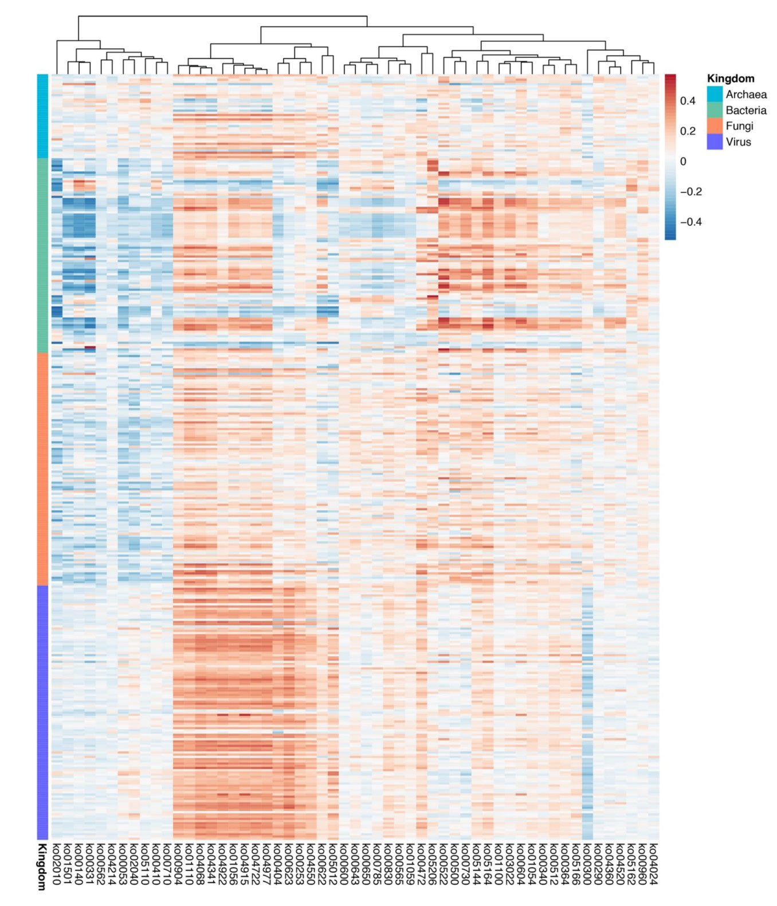

```{r setup, include=FALSE}
knitr::opts_chunk$set(
  collapse = T, echo=T, comment="#>", message=F, warning=F,
	fig.align="center", fig.width=5, fig.height=3, dpi=150)
```


The Hierarchical All-against-All association analysis scripts is referenced from MicrobiomeStatPlot [Inerst Reference below].


If you use this script, please cited 如果你使用本代码，请引用：

**Yong-Xin Liu**, Lei Chen, Tengfei Ma, Xiaofang Li, Maosheng Zheng, Xin Zhou, Liang Chen, Xubo Qian, Jiao Xi, Hongye Lu, Huiluo Cao, Xiaoya Ma, Bian Bian, Pengfan Zhang, Jiqiu Wu, Ren-You Gan, Baolei Jia, Linyang Sun, Zhicheng Ju, Yunyun Gao, **Tao Wen**, **Tong Chen**. 2023. EasyAmplicon: An easy-to-use, open-source, reproducible, and community-based pipeline for amplicon data analysis in microbiome research. **iMeta** 2(1): e83. https://doi.org/10.1002/imt2.83

The online version of this tuturial can be found in https://github.com/YongxinLiu/MicrobiomeStatPlot


**Authors**
First draft(初稿)：Defeng Bai(白德凤)；Proofreading(校对)：Ma Chuang(马闯) and Xun Jiani(荀佳妮)；Text tutorial(文字教程)：Defeng Bai(白德凤)


# Introduction简介

什么是Halla(Hierarchical All-against-All association)分析？
What is Halla analysis?

HAllA（Hierarchical All-against-All association）是一种在高维、异构数据集中寻找多分辨率关联的计算方法。用于以高功率发现数据特征之间的显著关系。对数据类型具有很强的鲁棒性，可以对连续值和分类值进行操作，并且在同质数据集（所有测量值都属于同一类型，例如基因表达微阵列）和异构数据（包含具有不同单位或类型的测量值，例如患者临床数据）上都能很好地工作。HAllA是探索代谢组学、转录组学、微生物组学、蛋白质组学等多个组学之间相关性的有力工具。

HallA (Hierarchical All against All Association) is a computational method for finding multi-resolution associations in high-dimensional and heterogeneous datasets. Used to discover significant relationships between data features at high power. Has strong robustness to data types, can operate on continuous and categorical values, and works well on homogeneous datasets (all measurements belong to the same type, such as gene expression microarrays) and heterogeneous datasets (including measurements with different units or types, such as patient clinical data). HallA is a powerful tool for exploring the correlation between multiple omics such as metabolomics, transcriptomics, microbiome, and proteomics.


参考：https://github.com/biobakery/halla

Andrew R. Ghazi, Kathleen Sucipto, Ali Rahnavard, Eric A. Franzosa, Lauren J. McIver, Jason Lloyd-Price, Emma Schwager, George Weingart, Yo Sup Moon, Xochitl C. Morgan, Levi Waldron and Curtis Huttenhower, “High-sensitivity pattern discovery in large, paired multi-omic datasets”. https://doi.org/10.1093/bioinformatics/btac232


关键字：微生物组数据分析、MicrobiomeStatPlot、分层关联分析、R语言可视化

Keywords: Microbiome analysis, MicrobiomeStatPlot, Hierarchical All-against-All association analysis, R visulization


## Halla Case Halla案例

本文是Hui Wang团队2022年发表于Nature Microbiology(Liu et al., 2022)的文章。题目为：Multi-kingdom microbiota analyses identify bacterial–fungal interactions and biomarkers of colorectal cancer across cohorts. https://doi.org/10.1038/s41564-021-01030-7

This article is published by Hui Wang's team in Nature Microbiology (Liu et al., 2022) in 2022. Title: Multi kingdom microbiota analyses identify bacterial functional interactions and biomarkers of colorectal cancer across cohorts. https://doi.org/10.1038/s41564-021-01030-7



Extended Data Fig. 8 | Associations between differential species from four-kingdom and differential functional pathways. Heatmap shows Spearman correlations between bacterial or fungal species and different metabolic pathways as identified with HAlla.

扩展数据 图 8 | 四界不同物种与不同功能途径之间的关联。热图显示了用 HAlla 确定的细菌或真菌物种与不同代谢途径之间的斯皮尔曼相关性。


Extended Data Fig. 9 | Associations between multi-kingdom markers and differential functional pathways. Heatmap shows Spearman correlations between bacterial or fungal species and different metabolic pathways as identified via HAlla with default parameters. The p value was estimated from two-sided Benjamini-Hochberg-Yekutieli and exact p-value was shown in cells.

扩展数据 图 9 | 多界标记与不同功能途径之间的关联。热图显示了细菌或真菌物种与不同代谢途径之间的斯皮尔曼相关性，这些代谢途径是通过使用默认参数的 HAlla 确定的。P值由双侧Benjamini-Hochberg-Yekutieli估计，精确P值显示在单元格中。


**结果**：
Associations between species and function. Spearman associations between microbial species and their functions were performed using the Hierarchical All-against-All method v.0.8.17 (http://huttenhower.sph.harvard.edu/ halla), a computational method used to find multi-resolution associations in high-dimensional, heterogeneous datasets. Associations with an FDR < 0.01 were included in the downstream analysis.

物种与功能之间的关联。微生物物种与其功能之间的斯皮尔曼关联是使用层次全反方法 v.0.8.17 (http://huttenhower.sph.harvard.edu/ halla)进行的，该方法是一种用于在高维异构数据集中发现多分辨率关联的计算方法。FDR<0.01的关联被纳入下游分析。


## Packages installation软件包安装

```{r}
# 基于CRAN安装R包，检测没有则安装
p_list = c("circlize", "tidyr", "dplyr")
for(p in p_list){if (!requireNamespace(p)){install.packages(p)}
    library(p, character.only = TRUE, quietly = TRUE, warn.conflicts = FALSE)}

# 基于Bioconductor安装R包
if (!requireNamespace("ComplexHeatmap", quietly = TRUE))
    BiocManager::install("ComplexHeatmap")

# 加载R包 Load the package
suppressWarnings(suppressMessages(library(circlize)))
suppressWarnings(suppressMessages(library(tidyr)))
suppressWarnings(suppressMessages(library(dplyr)))
suppressWarnings(suppressMessages(library(ComplexHeatmap)))
```


# Hierarchical All-against-All association analysis分层关联分析

## Halla analysis practice Halla分析实战

通过在线网站http://galaxy.biobakery.org/中的HALLA模块实现
Implementation of HALLA through online websites http://galaxy.biobakery.org/

```{r halla, fig.show='asis', fig.width=4, fig.height=2.5}
# 读取并处理数据 - 关联矩阵数据
# Read and process data - association matrix data
assoc_data <- read.table("data/all_associations.txt", header = TRUE, sep = "\t")

# 转换为宽数据格式
# From wide to long
assoc_matrix <- assoc_data %>%
  pivot_wider(names_from = Y_features, values_from = association)

# 将X_features列设置为行名
# Set the X_features column as row names
rownames(assoc_matrix) <- assoc_matrix$X_features
assoc_matrix <- assoc_matrix[, -1] 

# 生成颜色渐变
# Set color
heatmap_colors <- colorRamp2(c(min(assoc_matrix, na.rm = TRUE), 
                               0, 
                               max(assoc_matrix, na.rm = TRUE)),
                             c("#87CEFF", "white", "#FF7256"))

# 绘制基础热图并展示聚类
# Plot heatmap
heatmap_plot <- Heatmap(as.matrix(assoc_matrix),
                        name = "Association",
                        col = heatmap_colors,
                        cluster_rows = TRUE, 
                        cluster_columns = TRUE,
                        show_row_dend = TRUE,
                        show_column_dend = TRUE,
                        row_names_gp = gpar(fontsize = 10),
                        column_names_gp = gpar(fontsize = 10))

# 保存热图至PDF文件
# Save plot
pdf("results/halla_association01_clustered.pdf", width = 10, height = 8)
draw(heatmap_plot)
dev.off()

# 读取并处理数据 - q值矩阵数据
# Read and process data - q value matrix data
q_value_data <- read.table("data/all_q_value.txt", header = TRUE, sep = "\t")

# 转换为宽数据格式
# Wide to long
q_value_matrix <- q_value_data %>%
  pivot_wider(names_from = Y_features, values_from = q.values)

# 将X_features列设置为行名
# Set the X_features column as row names
rownames(q_value_matrix) <- q_value_matrix$X_features
q_value_matrix <- q_value_matrix[, -1]

# 绘制带有q值的热图，并展示聚类
# Plot heatmap
heatmap_with_q <- Heatmap(as.matrix(assoc_matrix),
                          name = "Association",
                          col = heatmap_colors,
                          cluster_rows = TRUE, 
                          cluster_columns = TRUE,
                          show_row_dend = TRUE,
                          show_column_dend = TRUE,
                          row_names_gp = gpar(fontsize = 10),
                          column_names_gp = gpar(fontsize = 10),
                          cell_fun = function(j, i, x, y, width, height, fill) {
                            q_val <- q_value_matrix[i, j]
                            if (!is.na(q_val) && q_val < 0.05) {
                              grid.text(sprintf("%.3f", q_val), x, y, 
                                        gp = gpar(fontsize = 6))
                            }
                          })

# 保存带有q值的热图至PDF文件
# Save plot
pdf("results/halla_association2_clustered.pdf", width = 10, height = 8)
draw(heatmap_with_q)
dev.off()
```


If used this script, please cited:
使用此脚本，请引用下文：

**Yong-Xin Liu**, Lei Chen, Tengfei Ma, Xiaofang Li, Maosheng Zheng, Xin Zhou, Liang Chen, Xubo Qian, Jiao Xi, Hongye Lu, Huiluo Cao, Xiaoya Ma, Bian Bian, Pengfan Zhang, Jiqiu Wu, Ren-You Gan, Baolei Jia, Linyang Sun, Zhicheng Ju, Yunyun Gao, **Tao Wen**, **Tong Chen**. 2023. EasyAmplicon: An easy-to-use, open-source, reproducible, and community-based pipeline for amplicon data analysis in microbiome research. **iMeta** 2: e83. https://doi.org/10.1002/imt2.83

Copyright 2016-2024 Defeng Bai <baidefeng@caas.cn>, Chuang Ma <22720765@stu.ahau.edu.cn>, Jiani Xun <15231572937@163.com>, Yong-Xin Liu <liuyongxin@caas.cn>
