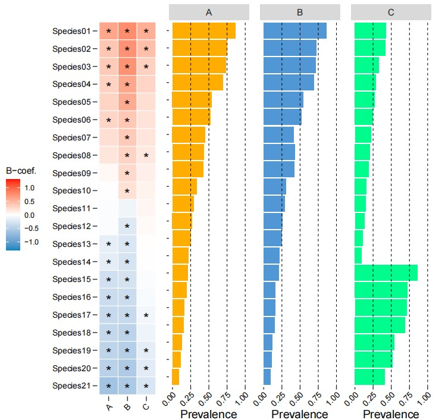
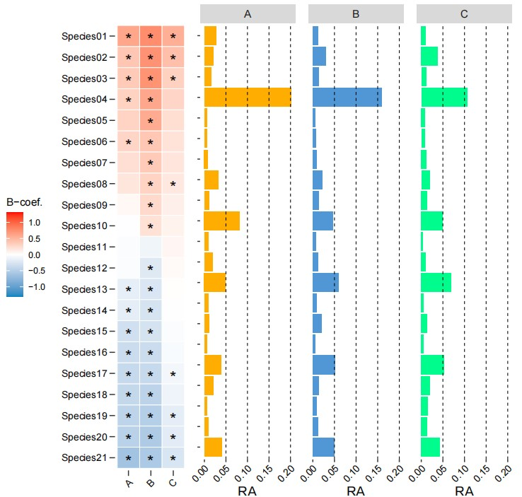

```{r setup, include=FALSE}
knitr::opts_chunk$set(
  collapse = T, echo=T, comment="#>", message=F, warning=F,
	fig.align="center", fig.width=5, fig.height=3, dpi=150)
```


The Heatmap bar plot scripts is referenced from MicrobiomeStatPlot [Inerst Reference below].

If you use this script, please cited 如果你使用本代码，请引用：

**Yong-Xin Liu**, Lei Chen, Tengfei Ma, Xiaofang Li, Maosheng Zheng, Xin Zhou, Liang Chen, Xubo Qian, Jiao Xi, Hongye Lu, Huiluo Cao, Xiaoya Ma, Bian Bian, Pengfan Zhang, Jiqiu Wu, Ren-You Gan, Baolei Jia, Linyang Sun, Zhicheng Ju, Yunyun Gao, **Tao Wen**, **Tong Chen**. 2023. EasyAmplicon: An easy-to-use, open-source, reproducible, and community-based pipeline for amplicon data analysis in microbiome research. **iMeta** 2(1): e83. https://doi.org/10.1002/imt2.83

The online version of this tuturial can be found in https://github.com/YongxinLiu/MicrobiomeStatPlot


**Authors**
First draft(初稿)：Defeng Bai(白德凤)；Proofreading(校对)：Ma Chuang(马闯) and Jiani Xun(荀佳妮)；Text tutorial(文字教程)：Defeng Bai(白德凤)


# Introduction简介

在微生物组分析过程中，常常有多组之间的比较，用常用的柱状图、箱线图等不能同时展现多个物种多组的差异，可以用热图展示微生物物种的组间差异显著性，并用不同的颜色确定物种是显著上升还是下降。同时为了配合显著性差异热图，可以用柱状图展示微生物物种在每个分组中的流行率和相对丰度。

In the process of microbiome analysis, there are often comparisons between multiple groups. Commonly used histograms, box plots, etc. cannot display the differences of multiple species and groups at the same time. Heat maps can be used to display significant differences between groups of microbial species. sex, and use different colors to determine whether a species is significantly rising or declining. At the same time, in order to match the significant difference heat map, a bar chart can be used to display the prevalence and relative abundance of microbial species in each group.


关键字：微生物组数据分析、MicrobiomeStatPlot、热图结合柱状图展示组间差异、R语言可视化

Keywords: Microbiome analysis, MicrobiomeStatPlot, Heatmap bar plot , R visulization


## Heatmap bar plot example 热图结合柱状图展示组间差异分析案例

这是Damian R. Plichta团队2023年发表于Nature Microbiology上的一篇论文，论文题目为：Centenarians have a diverse gut virome with the potential to modulate metabolism and promote healthy lifespan. https://doi.org/10.1038/s41564-023-01370-6

This is a paper published by Damian R. Plichta's team in Nature Microbiology in 2023. The title of the paper is: Centenarians have a diverse gut virome with the potential to modulate metabolism and promote healthy lifespan. https://doi.org/10.1038/s41564-023-01370-6


Fig. 3a Changes in the relative viral abundance of vOTU populations grouped by bacterial host (at species level) between centenarian (CE), older and young participants. The heat map shows differentially abundant vOTU populations (Wilcoxon rank sum test, two-sided, *Padj < 0.05 FDR corrected). Only vOTU populations that were found enriched or depleted in either CE vs older or CE vs young, such as those associated with C. scindens or F. prausnitzii, were included in the final heat map. Colour scale represents the beta-coefficient from the general linear model in MaAslin2 and indicates the degree of enrichment (red) or depletion (blue). vOTUs are sorted by their prevalence (horizontal bar panels), where viruses associated with C. scindens or A. muciniphila are detected in >40% of CE samples and <10% in young adult samples. 

图 3a 百岁老人 (CE)、老年人和年轻参与者之间按细菌宿主分组的 vOTU 种群相对病毒丰度的变化（在物种水平上）。热图显示差异丰富的 vOTU 种群（Wilcoxon 秩和检验，双侧，*Padj < 0.05 FDR 校正）。只有在 CE vs 老年人或 CE vs 年轻人群中发现富集或耗尽的 vOTU 种群，例如与 C. scindens 或 F. prausnitzii 相关的种群，才会被纳入最终的热图。色标表示 MaAslin2 中一般线性模型的 beta 系数，表示富集程度（红色）或耗尽程度（蓝色）。vOTU 按其流行程度（水平条形面板）排序，其中与 C. scindens 或 A. muciniphila 相关的病毒在 >40% 的 CE 样本中检测到，在 <10% 的年轻成人样本中检测到。

**结果**

Using viral-host labels, we identified several overabundant (WRST, two-sided, Padj < 0.05) groups of viruses associated with Alistipes, Parabacteroides, Clostridium, Eggerthella, Ruminococcus and Akkermansia at species level (Fig. 3a). Conversely, we found a significant depletion (WRST, two-sided, Padj < 0.05) of Bacteroides and Faecalibacterium viruses in the centenarian microbiomes (Fig. 3a,c) that coincided with the relative depletion of these previously described commensal bacteria. 


使用病毒宿主标签，我们在物种水平上鉴定出与 Alistipes、Parabacteroides、Clostridium、Eggerthella、Ruminococcus 和 Akkermansia 相关的多发性（WRST，双侧，Padj < 0.05）病毒群（图 3a）。相反，我们发现百岁老人微生物群中拟杆菌和粪杆菌病毒显著减少（WRST，双侧，Padj < 0.05）（图 3a、c），这与这些先前描述的共生细菌的相对减少相吻合。


## Packages installation软件包安装

```{r}
# 基于CRAN安装R包，检测没有则安装 Installing R packages based on CRAN and installing them if they are not detected
p_list = c("ggplot2", "patchwork", "dplyr", "reshape2", "ggprism", "plyr",
           "magrittr","ggfun","cowplot" )
for(p in p_list){if (!requireNamespace(p)){install.packages(p)}
    library(p, character.only = TRUE, quietly = TRUE, warn.conflicts = FALSE)}

# 加载R包 Loading R packages
suppressWarnings(suppressMessages(library(ggplot2)))
suppressWarnings(suppressMessages(library(patchwork)))
suppressWarnings(suppressMessages(library(dplyr)))
suppressWarnings(suppressMessages(library(reshape2)))
suppressWarnings(suppressMessages(library(ggprism)))
suppressWarnings(suppressMessages(library(plyr)))
suppressWarnings(suppressMessages(library(magrittr)))
suppressWarnings(suppressMessages(library(ggfun)))
suppressWarnings(suppressMessages(library(cowplot)))
```


## Calculate species prevalence 计算物种流行率

A组、B组和C组流行率计算
Calculate prevalence for A, B and C group

```{r prevalence, fig.show='asis', fig.width=4, fig.height=2.5}
# 计算流行率
# Load data
data_fungi <- read.table("data/species_count_data.txt", sep = "\t", header = TRUE, check.names = FALSE)
design_A <- read.table("data/design_A.txt", sep = "\t", header = TRUE, row.names = 1)
design_B <- read.table("data/design_B.txt", sep = "\t", header = TRUE, row.names = 1)
design_C <- read.table("data/design_C.txt", sep = "\t", header = TRUE, row.names = 1)
difference_species <- read.table("data/Difference_species.txt", sep = "\t", header = TRUE, row.names = 1)

# Preprocess data
rownames(data_fungi) <- data_fungi$Species
data_fungi <- data_fungi[, -1] %>% apply(2, function(x) x / sum(x))
data_fungi02 <- as.data.frame(t(data_fungi))

# Function to process each design group
process_design <- function(design, data_fungi02, all_counts_value) {
  data_fungi_group <- data_fungi02[rownames(data_fungi02) %in% rownames(design), ] %>% t() %>% as.data.frame()
  
  zero_counts <- rowSums(data_fungi_group == 0)
  data_species2 <- data_fungi_group %>%
    mutate(zero_counts = zero_counts,
           sample_percent = round(1 - zero_counts / all_counts_value, 6))

  data_species3 <- data_species2[rownames(data_species2) %in% rownames(difference_species), ]
  return(data_species3)
}

# Process each design group and write to CSV
data_species3_C <- process_design(design_A, data_fungi02, 30)
write.csv(data_species3_C, "data/data_species3_prevalence_A.csv")

data_species3_E <- process_design(design_B, data_fungi02, 35)
write.csv(data_species3_E, "data/data_species3_prevalence_B.csv")

data_species3_Y <- process_design(design_C, data_fungi02, 50)
write.csv(data_species3_Y, "data/data_species3_prevalence_C.csv")
```


## Difference heatmap and bar plot

热图+柱状图

```{r Difference heatmap and bar plot, fig.show='asis', fig.width=4, fig.height=2.5}
# 载入数据
# Load data
data <- read.table("data/Difference_species2.txt",header = TRUE,row.names = 1,sep = "\t")
data[which(data$FDR<0.05),'sig'] <- '*'

# 排序
# Set order
data$Species2 = factor(data$Species, levels = unique(data$Species))
data = data %>%
  mutate(Species2 = ordered(Species2,
                         levels=c("Species21",
                                  "Species20","Species19",
                                  "Species18","Species17",
                                  "Species16","Species15","Species14",
                                  "Species13",
                                  "Species12","Species11","Species10",
                                  "Species09","Species08","Species07", 
                                  "Species06","Species05","Species04",
                                  "Species03","Species02","Species01"
                                  )))

# 绘图
# Plot
p1 <- ggplot(data, aes(Group,Species2)) +  
  geom_tile(aes(fill=B_coef), color="white") +    
  geom_text(aes(label=sig), color="black", size=6,vjust = 0.8) + 
  scale_fill_gradient2(low='#0085c1', high='red',mid = 'white', limit=c(-1.3,1.3),name=paste0("B-coef.")) +
  labs(x=NULL,y=NULL) +  
  theme_classic()+
  theme(axis.text.x = element_text(size=10,angle = 45,hjust = 1,color = "black"),            
        axis.text.y = element_text(size=10,color = "black"), 
        axis.line.x = element_blank(),
        axis.line.y = element_blank(),
        axis.ticks.length = unit(2.0, "mm"),
        panel.background=element_blank(),
        legend.position = "left")
#p1
#ggsave(paste("results/age_fheatmap01",".pdf", sep=""), p1, width=89 * 1.5, height=180 * 1.5, unit='mm')


# Bar plot prevalence
# 柱状图展示每个物种的流行率
imp_species <- read.table("data/Prevalence2.txt", header = TRUE, sep = "\t")
imp_species <- imp_species %>%
  mutate(Species2 = ordered(Species,
                            levels = c("Species21", "Species20", "Species19", "Species18", "Species17",
                                       "Species16", "Species15", "Species14", "Species13",
                                       "Species12", "Species11", "Species10", "Species09",
                                       "Species08", "Species07", "Species06", "Species05",
                                       "Species04", "Species03", "Species02", "Species01")))

# 获取所有唯一的组名
groups <- unique(imp_species$Group)

# 为每个组指定不同的颜色
colors <- c("A" = "#ffad00", "B" = "#5196d5", "C" = "#00fc8d")

# 使用 lapply 绘制每个组的图
plots <- lapply(seq_along(groups), function(i) {
  g <- groups[i]
  p <- ggplot(subset(imp_species, Group == g), aes(x = Species2, y = Prevalence)) +
    geom_bar(stat = "identity", fill = colors[g]) +
    coord_flip() +
    theme_classic() +
    theme(text = element_text(family = 'sans', size = 14),
          panel.grid.major = element_blank(),
          panel.grid.minor = element_blank(),
          legend.position = "none",
          axis.line.x = element_blank(),
          axis.line.y = element_blank(),
          axis.title.y = element_blank(),
          axis.text.x = element_text(size = 10, angle = 45, hjust = 1, color = "black"),
          axis.text.y = element_blank()
          ) +
    geom_hline(yintercept = c(0.25, 0.5, 0.75, 1), colour = 'black', lwd = 0.36, linetype = "dashed") +
    #scale_y_continuous(expand = expansion(0, 0), limits = c(0, 1), breaks = c(0, 0.25, 0.5, 0.75, 1)) +
    #labs(title = paste("Prevalence for", g))
  facet_set(label=paste(g))
  
  if (i != 1) {
    p <- p + theme(axis.text.y = element_blank(),
                   axis.ticks.y = element_blank())
  }
  
  return(p)
})

# 使用 plot_grid 将三个图放在一起，并确保宽度一致
final_plot <- plot_grid(plotlist = plots, ncol = 3, rel_widths = c(1, 1, 1))

# 显示最终图形
#print(final_plot)

library(cowplot)
p2 <- ggdraw() +
  draw_plot(p1, 0, 0.01, .35, 0.945)+
  draw_plot(final_plot, 0.350, -0.01, .58, 1.002)
#p2

pdf("results/age_fungi_heatmap_ra_bar1.pdf", height = 7.2, width = 8)
p2
dev.off()


# Bar plot relative abundance
# 柱状图展示每个物种的相对丰度
# 如果要按照相对丰度降序排列，请自行调整
imp_species <- read.table("data/Prevalence2.txt", header = TRUE, sep = "\t")
imp_species <- imp_species %>%
  mutate(Species2 = ordered(Species,
                            levels = c("Species21", "Species20", "Species19", "Species18", "Species17",
                                       "Species16", "Species15", "Species14", "Species13",
                                       "Species12", "Species11", "Species10", "Species09",
                                       "Species08", "Species07", "Species06", "Species05",
                                       "Species04", "Species03", "Species02", "Species01")))

# 获取所有唯一的组名
groups <- unique(imp_species$Group)

# 为每个组指定不同的颜色
colors <- c("A" = "#ffad00", "B" = "#5196d5", "C" = "#00fc8d")

# 使用 lapply 绘制每个组的图
plots <- lapply(seq_along(groups), function(i) {
  g <- groups[i]
  p <- ggplot(subset(imp_species, Group == g), aes(x = Species2, y = RA)) +
    geom_bar(stat = "identity", fill = colors[g]) +
    coord_flip() +
    theme_classic() +
    theme(text = element_text(family = 'sans', size = 14),
          panel.grid.major = element_blank(),
          panel.grid.minor = element_blank(),
          legend.position = "none",
          axis.line.x = element_blank(),
          axis.line.y = element_blank(),
          axis.title.y = element_blank(),
          axis.text.x = element_text(size = 10, angle = 45, hjust = 1, color = "black"),
          axis.text.y = element_blank()
          ) +
    geom_hline(yintercept = c(0.05, 0.1, 0.15, 0.20), colour = 'black', lwd = 0.36, linetype = "dashed") +
    #scale_y_continuous(expand = expansion(0, 0), limits = c(0, 1), breaks = c(0, 0.25, 0.5, 0.75, 1)) +
    #labs(title = paste("Prevalence for", g))
  facet_set(label=paste(g))
  
  if (i != 1) {
    p <- p + theme(axis.text.y = element_blank(),
                   axis.ticks.y = element_blank())
  }
  
  return(p)
})

# 使用 plot_grid 将三个图放在一起，并确保宽度一致
final_plot2 <- plot_grid(plotlist = plots, ncol = 3, rel_widths = c(1, 1, 1))

# 显示最终图形
#print(final_plot)

library(cowplot)
p3 <- ggdraw() +
  draw_plot(p1, 0, 0.01, .35, 0.945)+
  draw_plot(final_plot2, 0.350, -0.01, .58, 1.002)
#p2

pdf("results/age_fungi_heatmap_ra_bar2.pdf", height = 7.2, width = 8)
p3
dev.off()

```








If used this script, please cited:
使用此脚本，请引用下文：

**Yong-Xin Liu**, Lei Chen, Tengfei Ma, Xiaofang Li, Maosheng Zheng, Xin Zhou, Liang Chen, Xubo Qian, Jiao Xi, Hongye Lu, Huiluo Cao, Xiaoya Ma, Bian Bian, Pengfan Zhang, Jiqiu Wu, Ren-You Gan, Baolei Jia, Linyang Sun, Zhicheng Ju, Yunyun Gao, **Tao Wen**, **Tong Chen**. 2023. EasyAmplicon: An easy-to-use, open-source, reproducible, and community-based pipeline for amplicon data analysis in microbiome research. **iMeta** 2: e83. https://doi.org/10.1002/imt2.83

Copyright 2016-2024 Defeng Bai <baidefeng@caas.cn>, Chuang Ma <22720765@stu.ahau.edu.cn>, Jiani Xun <15231572937@163.com>, Yong-Xin Liu <liuyongxin@caas.cn>

