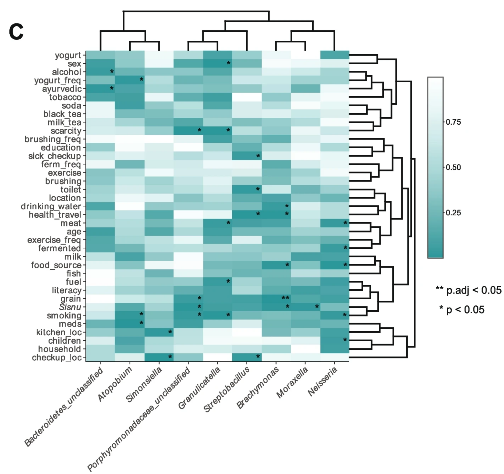

```{r setup, include=FALSE}
knitr::opts_chunk$set(
  collapse = T, echo=T, comment="#>", message=F, warning=F,
	fig.align="center", fig.width=5, fig.height=3, dpi=150)
```


The heatmap with significant marks scripts is referenced from MicrobiomeStatPlot [Inerst Reference below].

If you use this script, please cited 如果你使用本代码，请引用：

**Yong-Xin Liu**, Lei Chen, Tengfei Ma, Xiaofang Li, Maosheng Zheng, Xin Zhou, Liang Chen, Xubo Qian, Jiao Xi, Hongye Lu, Huiluo Cao, Xiaoya Ma, Bian Bian, Pengfan Zhang, Jiqiu Wu, Ren-You Gan, Baolei Jia, Linyang Sun, Zhicheng Ju, Yunyun Gao, **Tao Wen**, **Tong Chen**. 2023. EasyAmplicon: An easy-to-use, open-source, reproducible, and community-based pipeline for amplicon data analysis in microbiome research. **iMeta** 2(1): e83. https://doi.org/10.1002/imt2.83

The online version of this tuturial can be found in https://github.com/YongxinLiu/MicrobiomeStatPlot


**Authors**

First draft(初稿)：Jiani Xun(荀佳妮)；Proofreading(校对)：Ma Chuang(马闯) and Defeng Bai(白德凤)；Text tutorial(文字教程)：Jiani Xun(荀佳妮)

# Introduction简介

## Heatmap plot 热图

什么是热图？
What is a heatmap plot?

热图(heatmap)是对实验数据进行质量控制和差异数据的展现。单个热图由热图主体和热图组件组成。热图主体可以按行和列拆分，位于热图中央。热图组件包括标题、树状图、矩阵名称和热图注释(热图注释以行列为划分进行注释，一般列注释对应其样本来源，行注释对应分子学类型),位于热图主体的四个侧面。色带相应颜色与热图矩阵数据相映射，一般靠近正值颜色即为高表达、正相关，而靠近负值颜色即为低表达、负相关。

Heatmap is the display of quality control and difference data of experimental data. A single heat map consists of a heatmap body and a heat map component. The heatmap body can be split into rows and columns and is located in the center of the heat map. Heatmap components include the title, tree, matrix name and heatmap annotations (heatmap annotations are annotated in rows and columns, general column annotations correspond to their sample sources, row annotations correspond to molecular types), located on the four sides of the body of the heatmap. The corresponding color of the color band is mapped to the heatmap matrix data. Generally, the color near the positive value is high expression and positive correlation, while the color near the negative value is low expression and negative correlation.

关键字：微生物组数据分析、MicrobiomeStatPlot、热图添加显著性标记、R语言可视化

Keywords: Microbiome analysis, MicrobiomeStatPlot, Heatmap Plot With Significant Marks, R visulization


## Heatmap plot example 热图案例

这是 Aashish R. Jha和Emily R. Davenport课题组2024年发表于Microbiome上的文章，第一作者为Erica P. Ryu，题目为：Nepali oral microbiomes reflect a gradient of lifestyles from traditional to industrialized https://microbiomejournal.biomedcentral.com/articles/10.1186/s40168-024-01941-7

This is a 2024 article by Aashish R. Jha & Emily R. Davenport's group published in Microbiome, first authored by Erica P. Ryu, titled: Nepali oral microbiomes reflect a gradient of lifestyles from traditional to industrialized


图5:C几种特定的生活方式因素与个体口腔属有关。基于名义p值阈值的显著关联用 " * " 表示。基于调整后的p值阈值的显著相关性用 " ** " 表示
Fig. 5:C Several specific lifestyle factors are associated with individual oral genera. Significant associations based on a nominal p-value threshold are indicated with * . The significant association based on an adjusted p-value threshold is indicated with **


**结果**

Furthermore, we observe an additional 27 associations that are significant at a nominal p-value < 0.05 (Fig. 5C, Table S5). For example, we observe that the relative abundances of Granulicatella, Neisseria, and Porphyromonadaceae_unclassified are higher in non-smokers, whereas Atopobium relative abundance is lower in non-smokers (p = 0.006, p = 0.032, p = 0.033, and p = 0.023, respectively, Fig. S11 A). Similarly, the relative abundances of Brachymonas, Moraxella, and Porphyromonadaceae_unclassified are higher in individuals that consume sisnu (p = 0.014, p = 0.019, and p = 0.012, respectively, Fig. S11 B). Notably, while both smoking and alcohol are associated with the oral microbiome and both factors are top contributors to lifestyle, neither of these factors significantly follow the lifestyle gradient from traditional to expatriate (p > 0.05; Cochran-Armitage test, Fig. S12). These results demonstrate that a variety of lifestyle factors potentially underlie the differences in oral microbiome composition observed between lifestyles within Nepal.

观察到另外27个关联在名义p值<0.05时显著（图5C）。例如,我们观察到的相对丰度Granulicatella,Neisseria,和Porphyromonadaceae_unclassified高于不吸烟者,而Atopobium相对丰度低于不吸烟者(p =0.006, p = 0.032, p = 0.033,p=0.023)。同样,Brachymonas,Moraxella,Porphyromonadaceae_unclassified的相对丰度在消耗sisnu 的个体中更高(p = 0.014, p = 0.019, p = 0.012)。值得注意的是,虽然吸烟和酒精都与口腔微生物群有关，而且这两个因素都是生活方式的主要影响因素，但这些因素都不明显遵循从传统到外籍的生活方式梯度(p>0.05；Cochran-Armitage检验，图S12)。这些结果表明，各种生活方式因素可能是尼泊尔境内不同生活方式之间观察到的口腔微生物组组成差异的基础。

## Packages installation软件包安装

```{r}
# 基于CRAN安装R包，检测没有则安装 Installing R packages based on CRAN and installing them if they are not detected
p_list = c("ggplot2", "pheatmap")
for(p in p_list){if (!requireNamespace(p)){install.packages(p)}
    library(p, character.only = TRUE, quietly = TRUE, warn.conflicts = FALSE)}

# 加载R包 Loading R packages
suppressWarnings(suppressMessages(library(ggplot2)))
suppressWarnings(suppressMessages(library(pheatmap)))
```


# Heatmap plot热图
## Practice 实战

参考：https://blog.csdn.net/qazplm12_3/article/details/109172871?spm=1001.2014.3001.5506

```{r heatmap,echo=TRUE,collapse=TRUE ,fig.width=7, fig.height=8}
data <- read.table("data/test.txt",  
                   header=T, 
                   row.names=1,
                   sep="\t") 
dim(data) 
p <-pheatmap(data,scale="row",
              border="red", # 设置边框颜色
#聚类树设置
              cluster_cols = T, # 显示横向、纵向聚类
              cluster_rows = T,
              treeheight_col = 30, # 分别设置横、纵向聚类树高
              treeheight_row = 30,
#标题及横纵坐标
              angle_col = 45, # 设置显示角度
              clustering_distance_rows = "minkowski",
              clustering_method="complete",
              main="Gene1", # 设置图形标题
#划分热图
              cellwidth = 30,cellheight = 20, # 设置热图方块宽度和高度
              cutree_cols = 6, cutree_rows =5, # 划分聚类热图区块,列划为6块，行为5块
# 热图上显示数值
              display_numbers = matrix(ifelse(data > 1, "+", "-"), nrow(data)),#如果想用纯数字表示就改成：display_numbers = T
              fontsize_number = 10,#大小
              number_color="red",
              number_format="%.2e"#科学计数法表示
              )
ggsave(p,filename = "result/test1.pdf")
```


添加横纵向分组信息

```{r heatmap2,echo=TRUE,collapse=FALSE ,fig.width=7, fig.height=8}
#横向分组
annotation_row = data.frame(GeneClass = factor(rep(c("WRKY", "AP2", "YABBY"),7)))
rownames(annotation_row) <- rownames(data)
#纵向分组构建
annotation_col = data.frame(Deal_with = factor(rep(c("Salt", "Drought","Heat"), 3)),Day=factor(rep(c("Day1", "Day2","Day3"), 3)))
rownames(annotation_col) <- colnames(data)

data <- read.table("data/test.txt",  
                   header=T, 
                   row.names=1,
                   sep="\t") 
dim(data) 
p <- pheatmap(data,scale="row",
              annotation_col = annotation_col,
              annotation_row = annotation_row,
              border="white",
              cluster_cols = T,
              cluster_rows = T,
              treeheight_col = 30,
              treeheight_row = 30,
              angle_col = 45, 
              clustering_distance_rows = "minkowski",
              clustering_method="complete",
              main="Gene1", 
              cellwidth = 30,cellheight = 20, 
              display_numbers = matrix(ifelse(data > 1, "", "*"), nrow(data)),
              fontsize_number = 10,
              number_color="black",
              number_format="%.2e"
              )
ggsave(p,filename = "result/test2.pdf")
```


If used this script, please cited:
使用此脚本，请引用下文：

**Yong-Xin Liu**, Lei Chen, Tengfei Ma, Xiaofang Li, Maosheng Zheng, Xin Zhou, Liang Chen, Xubo Qian, Jiao Xi, Hongye Lu, Huiluo Cao, Xiaoya Ma, Bian Bian, Pengfan Zhang, Jiqiu Wu, Ren-You Gan, Baolei Jia, Linyang Sun, Zhicheng Ju, Yunyun Gao, **Tao Wen**, **Tong Chen**. 2023. EasyAmplicon: An easy-to-use, open-source, reproducible, and community-based pipeline for amplicon data analysis in microbiome research. **iMeta** 2: e83. https://doi.org/10.1002/imt2.83

Copyright 2016-2024 Jiani Xun <15231572937@163.com>, Defeng Bai <baidefeng@caas.cn>, Chuang Ma <22720765@stu.ahau.edu.cn>, Yong-Xin Liu <liuyongxin@caas.cn>


