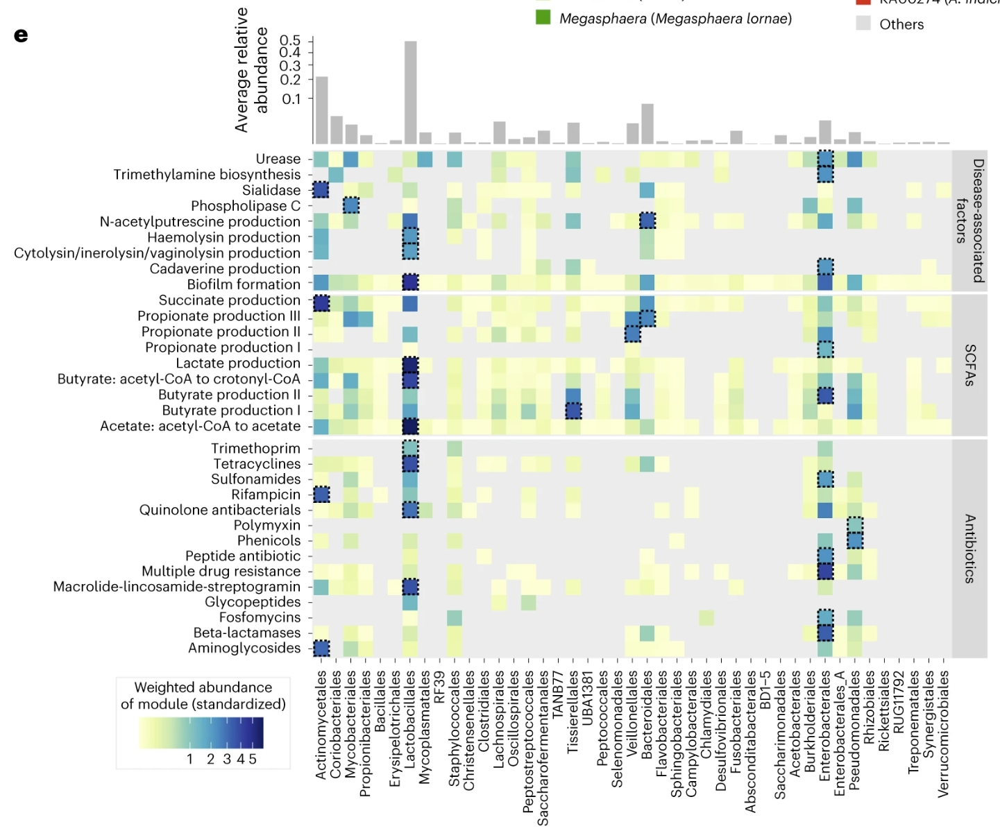
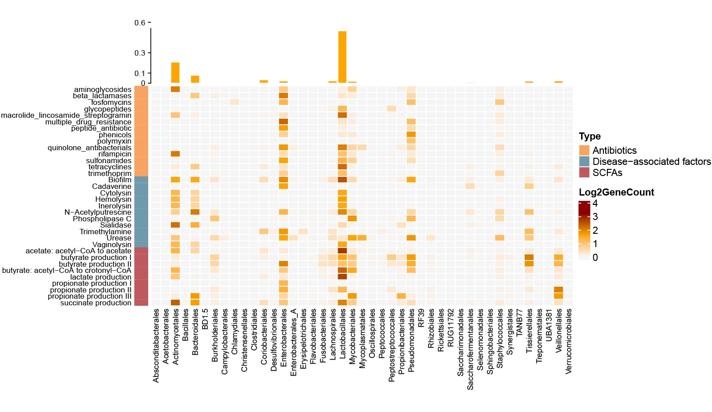

```{r setup, include=FALSE}
knitr::opts_chunk$set(
  collapse = T, echo=T, comment="#>", message=F, warning=F,
	fig.align="center", fig.width=5, fig.height=3, dpi=150)
```


If you use this script, please cited 如果你使用本代码，请引用：

**Yong-Xin Liu**, Lei Chen, Tengfei Ma, Xiaofang Li, Maosheng Zheng, Xin Zhou, Liang Chen, Xubo Qian, Jiao Xi, Hongye Lu, Huiluo Cao, Xiaoya Ma, Bian Bian, Pengfan Zhang, Jiqiu Wu, Ren-You Gan, Baolei Jia, Linyang Sun, Zhicheng Ju, Yunyun Gao, **Tao Wen**, **Tong Chen**. 2023. EasyAmplicon: An easy-to-use, open-source, reproducible, and community-based pipeline for amplicon data analysis in microbiome research. **iMeta** 2(1): e83. https://doi.org/10.1002/imt2.83

The online version of this tuturial can be found in https://github.com/YongxinLiu/MicrobiomeStatPlot


**Authors**
First draft(初稿)：Ma Chuang(马闯)；Proofreading(校对)：Defeng Bai(白德凤) and Xun Jiani(荀佳妮)；Text tutorial(文字教程)：Ma Chuang(马闯)；Video tutorial(视频教程)：Ma Chuang(马闯)


# 热图加柱状图组合图
Heatmap plus Bar chart combination

# Introduction简介

## The application of Heatmap plus bar chart combination in microbial community analysis 热图加柱状图组合图在微生物组分析中的应用


什么是热图加柱状图组合图？
What is a Heatmap plus bar chart combination ?

热图加柱状图组合图是一种数据可视化的复合图表，通常用于展示多维度数据的详细信息，特别适合于高通量生物学数据的展示。热图用于展示数值型数据的相对强度或比例，比如基因在不同条件下的表达情况、不同样本中菌群丰度等;通过颜色的深浅来表示数据的大小，深色一般表示高值，浅色表示低值。热图旁边的柱状图通常用于展示与热图中每一行（或列）数据有关的单独统计量。

Heatmap plus bar chart combination chart is a kind of composite chart for data visualization, which is usually used to display detailed information of multi-dimensional data, especially suitable for the display of high-throughput biological data. Heatmap is used to show the relative intensity or proportion of numerical data, such as the expression of genes under different conditions, the abundance of bacterial colonies in different samples, etc.; the size of the data is indicated by the depth of the color, and the darker color usually indicates the high value, and the lighter color indicates the low value. Bar charts next to heatmaps are often used to show the individual statistics associated with each row (or column) of data in the heatmap.


关键字：微生物组数据分析、MicrobiomeStatPlot、热图加柱状图组合图、R语言可视化

Keywords: Microbiome analysis, MicrobiomeStatPlot, Heatmap plus bar chart , R visulization


## Heatmap plus Bar chart combination Case 热图加柱状图组合图案例

这是深圳市宝安区中医院转化医学中心孙文、大连医科大学鄢秋龙及武汉倍森基因研究所的李胜辉2024年6月21日发表于Nature microbiology上的文章，第一作者为Liansha Huang，题目为：A multi-kingdom collection of 33,804 reference genomes for the human vaginal microbiome

This is an article published in Nature microbiology by Wen Sun, Center for Translational Medicine, Bao'an District Hospital of Traditional Chinese Medicine, Shenzhen, China; Qiulong Yan, Dalian Medical University; and Shenghui Li, Wuhan Bison Genetic Research Institute on June 21, 2024, with Liansha Huang as the first author, and the title is: A multi-kingdom collection of 33,804 reference genomes for the human vaginal microbiome   https://www.nature.com/articles/s41564-024-01751-5


Fig. 2: The 786 prokaryotic species in the VMGC.e, The weighted abundances of different functional modules for each order in vaginal samples. The upper bar plot shows the average relative abundance of each order across vaginal samples. The weighted abundances in the heat map are standardized as row Z-scores. The order with the highest weighted abundance of each functional module is indicated by a dotted box. SCFAs, short-chain fatty acids.

图 2：VMGC 中的 786 个原核生物物种
e, 阴道样本中各目不同功能模块的加权丰度。上部柱状图显示了阴道样本中各目平均相对丰度。热图中的加权丰度以行 Z 值标准化。每个功能模块中加权丰度最高的阶次用虚线框表示。SCFA：短链脂肪酸。


**结果**：
We found that Lactobacillales (mainly L. crispatus and L. iners) and Enterobacterales (primarily Escherichia coli) significantly contributed to gene abundance in biofilm formation synthesis, followed by several potential pathogens such as Pseudomonas aeruginosa and BVAB1 (Fig. 2e and Extended Data Fig. 3b).

我们发现，乳杆菌科（主要是 L.crispatus和L.iners）和肠杆菌科（主要是大肠杆菌）对生物膜形成合成中的基因丰度贡献很大，其次是铜绿假单胞菌和 BVAB1 等几种潜在病原体（图 2e 和扩展数据图 3b）。


## Packages installation软件包安装

```{r}
# 基于CRAN安装R包，检测没有则安装
p_list = c("ComplexHeatmap", "circlize", "tidyr", "dplyr", "reshape2", "ggplot2")
for(p in p_list){if (!requireNamespace(p)){install.packages(p)}
    library(p, character.only = TRUE, quietly = TRUE, warn.conflicts = FALSE)}

# 加载R包 Load the package
suppressWarnings(suppressMessages(library(ComplexHeatmap)))
suppressWarnings(suppressMessages(library(circlize)))
suppressWarnings(suppressMessages(library(tidyr)))
suppressWarnings(suppressMessages(library(dplyr)))
suppressWarnings(suppressMessages(library(reshape2)))
suppressWarnings(suppressMessages(library(ggplot2)))

#从Bioconductor安装稳定版；
#if (!requireNamespace("BiocManager", quietly = TRUE))
#install.packages("BiocManager")
#BiocManager::install("ComplexHeatmap")
#载入ComplexHeatmap、circlize包
```


### 1.Plotting heat maps and adding bar charts 绘制热图并添加柱状图

参考 https://mp.weixin.qq.com/s/VDnTAxa6EFt9Pi-2Su0PXw

```{r Bar Chart, include=TRUE}
# 读取长格式原始数据文件
dt <- read.table("data/data.txt", header = TRUE, sep = "\t")

# 长格式转宽格式
library(reshape2)
dt1 <- dcast(dt, ID ~ Order, value.var = "Standardized_abundance")
dt1[is.na(dt1)] <- 0

# 将第一列内容设为行名
rownames(dt1) <- dt1$ID
dt1 <- dt1[, -1]  # 去掉ID列（ID已成为行名）

# 对数据取对数
dt2 <- log2(dt1 + 1)

# 定义每种 `Type` 的元素
antibiotics <- c("aminoglycosides", "beta_lactamases", "fosfomycins", "glycopeptides", 
                 "macrolide_lincosamide_streptogramin", "multiple_drug_resistance", 
                 "peptide_antibiotic", "phenicols", "polymyxin", "quinolone_antibacterials", 
                 "rifampicin", "sulfonamides", "tetracyclines", "trimethoprim")
disease_associated <- c("Biofilm", "Cadaverine", "Cytolysin", "Hemolysin", "Inerolysin", 
                        "N-Acetylputrescine", "Phospholipase C", "Sialidase", "Trimethylamine", 
                        "Urease", "Vaginolysin")
scfas <- c("acetate: acetyl-CoA to acetate", "butyrate production I", "butyrate production II", 
           "butyrate: acetyl-CoA to crotonyl-CoA", "lactate production", "propionate production I", 
           "propionate production II", "propionate production III", "succinate production")

# 自动为 `ID` 分配类型
type_vector <- ifelse(rownames(dt2) %in% antibiotics, "Antibiotics", 
                      ifelse(rownames(dt2) %in% disease_associated, "Disease-associated factors", 
                             ifelse(rownames(dt2) %in% scfas, "SCFAs", NA)))

# 将类型向量添加为数据框的列，便于排序
dt2 <- data.frame(Type = type_vector, dt2)

# 根据 Type 列排序，确保顺序正确
dt2 <- dt2[order(dt2$Type), ]
rownames(dt2) <- rownames(dt1)[order(type_vector)]  # 重置排序后的行名

# 去掉 Type 列，仅保留数值矩阵
dt_matrix <- as.matrix(dt2[, -1])

# 获取排序后的 Type 注释信息
type_annotation_data <- dt2$Type  

# 创建行注释，调整注释柱子的宽度
type_annotation <- rowAnnotation(
  Type = type_annotation_data, 
  col = list(Type = c(
    "Antibiotics" = "#F9A363", 
    "Disease-associated factors" = "#6F99AD", 
    "SCFAs" = "#BF5960"
  )),
  width = unit(0.1, "cm"),
  show_annotation_name = FALSE
)

# 自定义颜色函数
col_fun2 <- colorRamp2(c(0.001, 1.6, 3.2), 
                       c("whitesmoke", "orange", "darkred"))

# 生成行顺序，确保行按照特定Type顺序排列
row_order <- rownames(dt_matrix)

# 读取order_abundance文件并提取"Relative Abundance"列数据
abundance <- read.table("data/order_abundance.txt", header = TRUE, sep = "\t")
relative_abundance <- abundance$Relative.Abundance

# 生成顶部条形图注释
bar1 <- HeatmapAnnotation(
  sum1 = anno_barplot(
    relative_abundance, 
    bar_width = 0.9,
    gp = gpar(col = "white", fill = "orange"), 
    border = FALSE,
    axis_param = list(
      at = c(0, 0.1, 0.3, 0.6), 
      labels = c("0", "0.1", "0.3", "0.6")
    ),
    height = unit(2, "cm")
  ), 
  show_annotation_name = FALSE
)

# 设置热图尺寸
height <- 8
width <- 9.6 / 5 * height

# 绘制热图
p <- Heatmap(
  dt_matrix, 
  col = col_fun2,
  width = unit(width, "cm"),
  height = unit(height, "cm"),
  name = "Log2GeneCount",
  cluster_columns = FALSE,
  show_row_dend = FALSE,
  rect_gp = gpar(col = "white", lwd = 1),
  top_annotation = bar1,
  left_annotation = type_annotation,
  row_names_side = "left",
  row_names_gp = gpar(fontsize = 8),
  column_names_gp = gpar(fontsize = 8),
  row_order = row_order
)

# 使用 pdf() 来保存热图
pdf("results/Heatmap_Plus_Bar_Chart_Combination.pdf", width = 10, height = 8)
draw(p)
dev.off()
```





If used this script, please cited:
使用此脚本，请引用下文：

**Yong-Xin Liu**, Lei Chen, Tengfei Ma, Xiaofang Li, Maosheng Zheng, Xin Zhou, Liang Chen, Xubo Qian, Jiao Xi, Hongye Lu, Huiluo Cao, Xiaoya Ma, Bian Bian, Pengfan Zhang, Jiqiu Wu, Ren-You Gan, Baolei Jia, Linyang Sun, Zhicheng Ju, Yunyun Gao, **Tao Wen**, **Tong Chen**. 2023. EasyAmplicon: An easy-to-use, open-source, reproducible, and community-based pipeline for amplicon data analysis in microbiome research. **iMeta** 2: e83. https://doi.org/10.1002/imt2.83

Copyright 2016-2024 Defeng Bai <baidefeng@caas.cn>, Chuang Ma <22720765@stu.ahau.edu.cn>, Jiani Xun <15231572937@163.com>, Yong-Xin Liu <liuyongxin@caas.cn>
