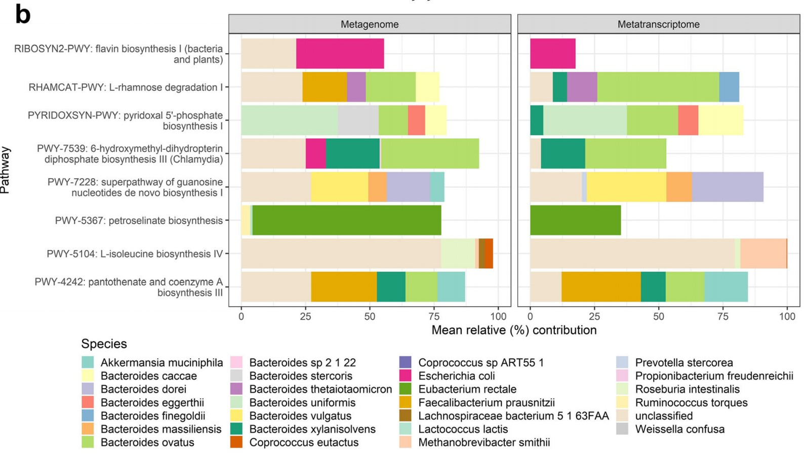
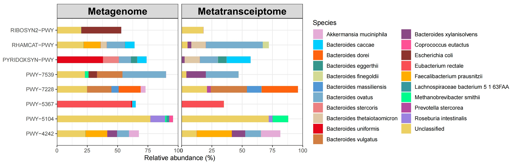
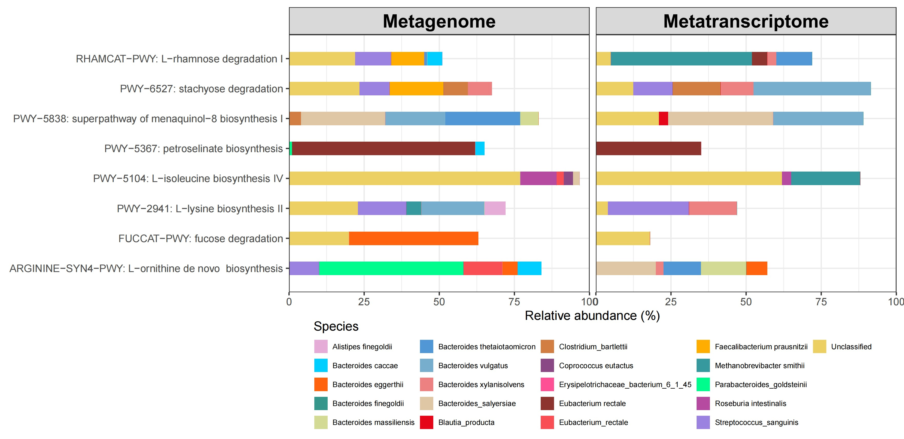

```{r setup, include=FALSE}
knitr::opts_chunk$set(
  collapse = T, echo=T, comment="#>", message=F, warning=F,
	fig.align="center", fig.width=5, fig.height=3, dpi=150)
```


The Horizontal facet stackplot scripts is referenced from MicrobiomeStatPlot [Inerst Reference below].

If you use this script, please cited 如果你使用本代码，请引用：

**Yong-Xin Liu**, Lei Chen, Tengfei Ma, Xiaofang Li, Maosheng Zheng, Xin Zhou, Liang Chen, Xubo Qian, Jiao Xi, Hongye Lu, Huiluo Cao, Xiaoya Ma, Bian Bian, Pengfan Zhang, Jiqiu Wu, Ren-You Gan, Baolei Jia, Linyang Sun, Zhicheng Ju, Yunyun Gao, **Tao Wen**, **Tong Chen**. 2023. EasyAmplicon: An easy-to-use, open-source, reproducible, and community-based pipeline for amplicon data analysis in microbiome research. **iMeta** 2(1): e83. https://doi.org/10.1002/imt2.83

The online version of this tuturial can be found in https://github.com/YongxinLiu/MicrobiomeStatPlot

**Authors**
First draft(初稿)：Defeng Bai(白德凤)；Proofreading(校对)：Ma Chuang(马闯) and Jiani Xun(荀佳妮)；Text tutorial(文字教程)：Defeng Bai(白德凤)


# Introduction简介

横向分面堆叠柱状图在显示组成的同时对比两个分组组成成分占比的差异，同时可以在顶部显示分面标签。

The horizontal faceted stacked bar chart shows the composition and compares the difference in the proportion of components of two groups. The facet labels can be displayed at the top.


关键字：微生物组数据分析、MicrobiomeStatPlot、横向分面堆叠柱状图、R语言可视化

Keywords: Microbiome analysis, MicrobiomeStatPlot, Horizontal facet  stackplot, R visulization


## Horizontal facet stackplot example 横向分面堆叠柱状图

这是纽约大学医学院人口健康系Jiyoung Ahn课题组2019年发表于Genome Medicine上的一篇论文用到的横向分面堆叠柱状图。论文题目是：Relating the gut metagenome and metatranscriptome to immuneotherapy responses in melanoma patients. https://doi.org/10.1186/s13073-019-0672-4

This is a horizontal faceted stacked bar chart used in a paper published in Genome Medicine in 2019 by Jiyoung Ahn's group at the Department of Population Health at New York University School of Medicine. The title of the paper is: Relating the gut metagenome and metatranscriptome to immuneotherapy responses in melanoma patients. https://doi.org/10.1186/s13073-019-0672-4




Fig. 5 b Mean percent contribution of species to functional pathways in the metagenome and metatranscriptome data. Per-species pathway abundance values were normalized to 100% for each pathway within each patient individually, and means were taken across patients; here, we show the mean percent contribution for the top 5 contributing species to each pathway.

图 5b 宏基因组和宏转录组数据中物种对功能途径的平均贡献百分比。每个患者体内每个途径的物种途径丰度值被分别归一化为100%，并且取患者之间的平均值；这里，我们展示了每个途径中贡献最大的 5 个物种的平均贡献百分比。


**结果**

We next explored average species contributions to overall metagenome and metatranscriptome pathways abundances in this patient population (Fig. 5b); while multiple species are involved in each pathway, we noted that Bacteroides ovatus was a signifi cant contributor to degradation of L-rhamnose and biosynthesis of pyridoxal 5-phosphate, 6-hydroxymethyl dihydropterin diphosphate, and pantothenate and coenzyme A, while Bacteroides dorei was a significant contributor to guanosine nucleotides biosynthesis (Fig. 5b).

接下来，我们探讨了该患者群体中物种对整体宏基因组和宏转录组途径丰度的平均贡献（图 5b）；虽然每条途径都涉及多个物种，但我们注意到卵形拟杆菌 (Bacteroides ovatus) 对 L-鼠李糖的降解以及吡哆醛 5-磷酸、6-羟甲基二氢蝶呤二磷酸、泛酸和辅酶 A 的生物合成有显著贡献，而多瑞拟杆菌 (Bacteroides dorei) 则对鸟苷核苷酸的生物合成有显著贡献（图 5b）。


## Packages installation软件包安装

```{r}
# 基于CRAN安装R包，检测没有则安装 Installing R packages based on CRAN and installing them if they are not detected
p_list = c("ggplot2", "ggprism", "tidyr", "dplyr")
for(p in p_list){if (!requireNamespace(p)){install.packages(p)}
    library(p, character.only = TRUE, quietly = TRUE, warn.conflicts = FALSE)}

# 加载R包 Loading R packages
suppressWarnings(suppressMessages(library(ggplot2)))
suppressWarnings(suppressMessages(library(ggprism)))
suppressWarnings(suppressMessages(library(tidyr)))
suppressWarnings(suppressMessages(library(dplyr)))
```


# 横向分面堆叠柱状图 Horizontal facet stackplot

## Horizontal facet stackplot using R software 横向分面堆叠柱状图R语言实战


```{r Horizontal facet stackplot}
# 1.直接使用数据绘图
# 加载数据
df1 <- read.table(file = "data/data_practice5.txt", sep = "\t", header = TRUE, check.names = FALSE)

# 绘制堆叠柱状图并增加facet标签
p1 <- ggplot(df1, aes(x = Pathways, y = values2, fill = Species)) +
  geom_col(width = 0.45, position = position_stack(vjust = 1)) +  # 堆叠柱状图
  scale_fill_manual(values = c("#e5acd7",  "#00ceff", "#ff630d", "#35978b", "#d2da93", 
                               "#5196d5", "#77aecd", "#ec8181", "#dfc6a5", "#e50719", 
                               "#d27e43", "#8a4984", "#fe5094", "#8d342e", "#f94e54",
                               "#ffad00", "#36999d", "#00fc8d", "#b64aa0", "#9b82e1","#edd064")) +  # 自定义颜色
  scale_y_continuous(expand = c(0, 0), limits = c(0, 100)) +  # y轴扩展和限制
  scale_x_discrete(expand = c(0.1, 0.1)) +  # x轴扩展
  coord_flip() +  # 横向堆叠柱状图
  labs(x = "", y = "Relative abundance (%)", title = "") +  # 设置标签
  theme_prism(base_fontface = "plain", base_family = "serif", base_size = 16, base_line_size = 0.8, axis_text_angle = 0) +  # 设置主题
  theme_bw() +
  theme(axis.title.y = element_text(face = "bold", size = 14, color = "black", family = "sans")) +  # y轴标题样式
  facet_wrap(~Group, scales = "fixed", ncol = 2, labeller = labeller(group = label_value)) +  # 分面并共用y轴
  theme(strip.text = element_text(face = "bold", size = 16, color = "black"))# 控制facet标签的样式

# 输出图形
# p1
ggsave(filename = "results/Horizontal_facet_stackplot01.pdf", plot = p1, width = 12, height = 4)


# 2.将宽数据转换为长数据绘图
# 加载数据
df <- read.table(file = "data/data_practice52.txt", sep = "\t", header = TRUE, check.names = FALSE)

# 宽数据转换为长数据
df_long <- df %>%
  pivot_longer(cols = c("FUCCAT-PWY: fucose degradation", "RHAMCAT-PWY: L-rhamnose degradation I", "ARGININE-SYN4-PWY: L-ornithine de novo  biosynthesis", "PWY-2941: L-lysine biosynthesis II", "PWY-5838: superpathway of menaquinol-8 biosynthesis I", 
                        "PWY-5367: petroselinate biosynthesis", "PWY-5104: L-isoleucine biosynthesis IV", "PWY-6527: stachyose degradation"),  # 指定要转换的所有列
               names_to = "Pathways",  # 新列名
               values_to = "values") %>%  # 存储数据的列名
  mutate(values2 = values * 100)  # 计算 values2 列，百分比

# 创建新的数据框
df_long_final <- df_long %>%
  select(Species = Species, Pathways, values, values2, Group)

# 可以将数据保存为新的文件
#write.table(df_long_final, file = "data/converted_data.txt", sep = "\t", row.names = FALSE, col.names = TRUE)

# 绘制堆叠柱状图并增加facet标签
p2 <- ggplot(df_long_final, aes(x = Pathways, y = values2, fill = Species)) +
  geom_col(width = 0.45, position = position_stack(vjust = 1)) +  # 堆叠柱状图
  scale_fill_manual(values = c("#e5acd7",  "#00ceff", "#ff630d", "#35978b", "#d2da93", 
                               "#5196d5", "#77aecd", "#ec8181", "#dfc6a5", "#e50719", 
                               "#d27e43", "#8a4984", "#fe5094", "#8d342e", "#f94e54",
                               "#ffad00", "#36999d", "#00fc8d", "#b64aa0", "#9b82e1","#edd064")) +  # 自定义颜色
  scale_y_continuous(expand = c(0, 0), limits = c(0, 100)) +  # y轴扩展和限制
  scale_x_discrete(expand = c(0.1, 0.1)) +  # x轴扩展
  coord_flip() +  # 横向堆叠柱状图
  labs(x = "", y = "Relative abundance (%)", title = "") +  # 设置标签
  theme_prism(base_fontface = "plain", base_family = "serif", base_size = 16, base_line_size = 0.8, axis_text_angle = 0) +  # 设置主题
  #theme_classic() +
  theme_bw() +
  theme(axis.title.y = element_text(face = "bold", size = 14, color = "black", family = "sans")) +  # y轴标题样式
  facet_wrap(~Group, scales = "fixed", ncol = 2, labeller = labeller(group = label_value)) +  # 保持y轴相同
  theme(strip.text = element_text(face = "bold", size = 16, color = "black"),  # 控制facet标签的样式
        legend.position = "bottom") # 将图例放置在下方

# 输出图形
# p2
ggsave(filename = "results/Horizontal_facet_stackplot02.pdf", plot = p2, width = 11, height = 6)

```








If used this script, please cited:
使用此脚本，请引用下文：

**Yong-Xin Liu**, Lei Chen, Tengfei Ma, Xiaofang Li, Maosheng Zheng, Xin Zhou, Liang Chen, Xubo Qian, Jiao Xi, Hongye Lu, Huiluo Cao, Xiaoya Ma, Bian Bian, Pengfan Zhang, Jiqiu Wu, Ren-You Gan, Baolei Jia, Linyang Sun, Zhicheng Ju, Yunyun Gao, **Tao Wen**, **Tong Chen**. 2023. EasyAmplicon: An easy-to-use, open-source, reproducible, and community-based pipeline for amplicon data analysis in microbiome research. **iMeta** 2: e83. https://doi.org/10.1002/imt2.83

Copyright 2016-2024 Defeng Bai <baidefeng@caas.cn>, Chuang Ma <22720765@stu.ahau.edu.cn>, Jiani Xun <15231572937@163.com>, Yong-Xin Liu <liuyongxin@caas.cn>

