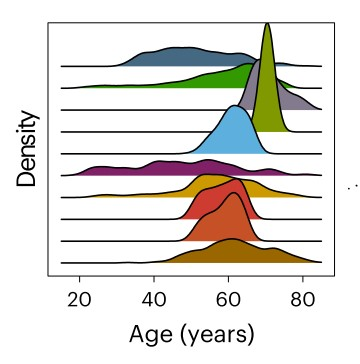
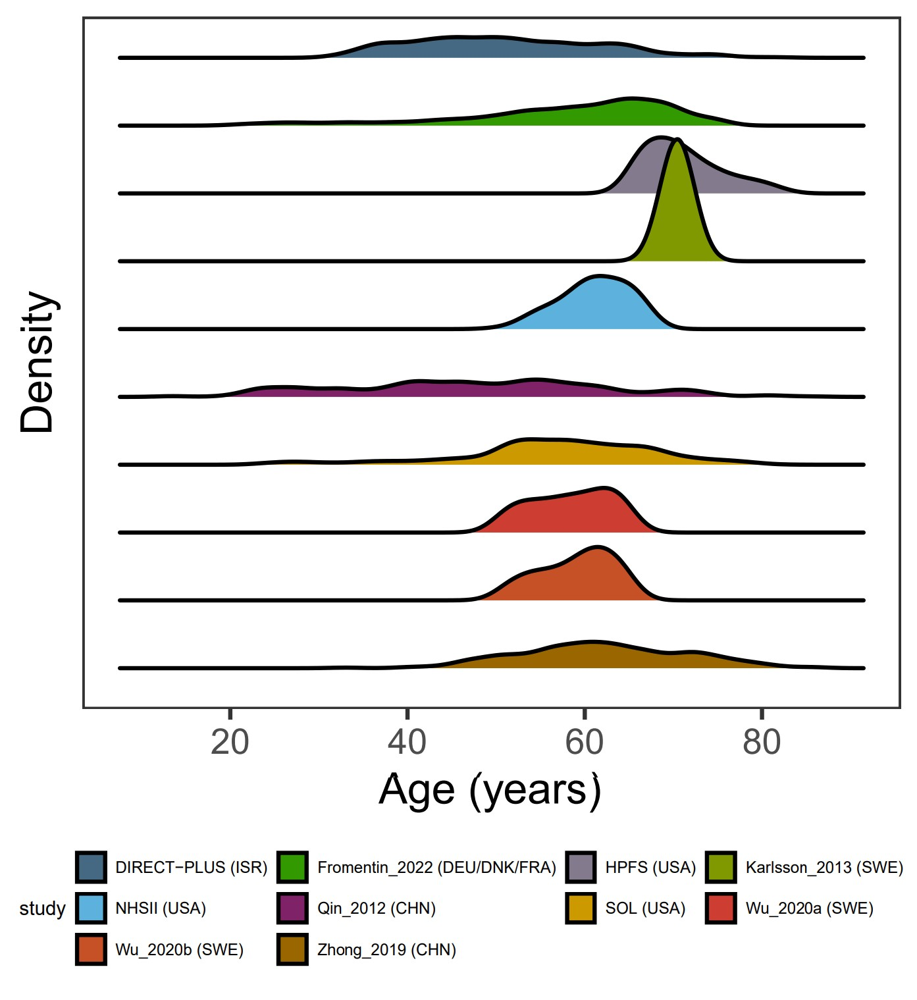

```{r setup, include=FALSE}
knitr::opts_chunk$set(
  collapse = T, echo=T, comment="#>", message=F, warning=F,
	fig.align="center", fig.width=5, fig.height=3, dpi=150)
```


The Kernal density plot scripts is referenced from MicrobiomeStatPlot [Inerst Reference below].

If you use this script, please cited 如果你使用本代码，请引用：

**Yong-Xin Liu**, Lei Chen, Tengfei Ma, Xiaofang Li, Maosheng Zheng, Xin Zhou, Liang Chen, Xubo Qian, Jiao Xi, Hongye Lu, Huiluo Cao, Xiaoya Ma, Bian Bian, Pengfan Zhang, Jiqiu Wu, Ren-You Gan, Baolei Jia, Linyang Sun, Zhicheng Ju, Yunyun Gao, **Tao Wen**, **Tong Chen**. 2023. EasyAmplicon: An easy-to-use, open-source, reproducible, and community-based pipeline for amplicon data analysis in microbiome research. **iMeta** 2(1): e83. https://doi.org/10.1002/imt2.83

The online version of this tuturial can be found in https://github.com/YongxinLiu/MicrobiomeStatPlot


**Authors**
First draft(初稿)：Defeng Bai(白德凤)；Proofreading(校对)：Ma Chuang(马闯) and Xun Jiani(荀佳妮)；Text tutorial(文字教程)：Defeng Bai(白德凤)


# Introduction简介

什么是核密度估计图？
What is kernal density plot?

核密度图（Kernel Density Plot）是一种用于估计数据分布的图形工具，它通过平滑数据点生成一个连续的概率密度函数，从而显示数据的分布情况。核密度图比直方图更为光滑，因为它不会依赖于具体的分箱选择。核密度估计是基于核函数（通常是高斯核函数）计算的，核函数会在每个数据点周围放置一个平滑的曲线，然后将这些曲线相加得到整体的密度估计。核密度图能够很好地显示数据的分布特征，如数据的多峰性和尾部行为。核密度图的优点包括：提供数据分布的平滑估计；不依赖于直方图的分箱选择；更好地展示数据的多峰性。核密度图的缺点包括：对于不同的带宽参数选择，结果可能会有较大差异；对于极端值敏感。

Kernel Density Plot is a graphical tool used to estimate data distribution. It generates a continuous probability density function by smoothing data points to display the distribution of data. Kernel density plots are smoother than histograms because they do not depend on specific binning choices. Kernel density estimates are calculated based on a kernel function (usually a Gaussian kernel function) that places a smooth curve around each data point and then adds these curves to give an overall density estimate. The kernel density plot can well display the distribution characteristics of the data, such as the multimodality and tail behavior of the data. The advantages of kernel density plots include: providing a smooth estimate of the data distribution; not relying on histogram binning selection; and better demonstrating the multimodality of the data. Disadvantages of kernel density plots include: results may vary greatly for different bandwidth parameter selections; sensitivity to extreme values.


关键字：微生物组数据分析、MicrobiomeStatPlot、核密度图、R语言可视化

Keywords: Microbiome analysis, MicrobiomeStatPlot, Kernal density plot, R visulization


## Kernal density plot example核密度估计图案例

这是来自于哈佛大学医学院Dong D. Wang团队2024年发表于Nature Medicine上的一篇论文用到的核密度图展示样本年龄的分布情况。论文题目为：Strain-specific gut microbial signatures in type 2 diabetes identified in a cross-cohort analysis of 8,117 metagenomes. https://doi.org/10.1038/s41591-024-03067-7.

This is a kernel density map used in a paper published in Nature Medicine in 2024 by Dong D. Wang's team from Harvard Medical School to show the distribution of sample age. The title of the paper is: Strain-specific gut microbial signatures in type 2 diabetes identified in a cross-cohort analysis of 8,117 metagenomes



## Packages installation软件包安装

```{r install, echo=TRUE}
# 基于CRAN安装R包，检测没有则安装
p_list = c("ggplot2", "ggridges")
for(p in p_list){if (!requireNamespace(p)){install.packages(p)}
    library(p, character.only = TRUE, quietly = TRUE, warn.conflicts = FALSE)}

# 加载R包 Load the package
suppressWarnings(suppressMessages(library(ggplot2)))
suppressWarnings(suppressMessages(library(ggridges)))
```


# Kernal density plot核密度图

## Kernal density plot usinng R software核密度图R语言实战

```{r kernal_density_plot, fig.show='asis', fig.width=4, fig.height=2.5}
# 读取CSV文件(read csv file)
# 数据来自于Nature Medicine论文
data <- read.csv("data/data01.csv", header = TRUE, sep = ",") 

# 创建颜色映射(creat color)
studycol <- c("#466983", "#339900", "#837B8D", 
              "#809900", "#5DB1DD", "#802268",
              "#CC9900", "#CE3D32","#C75127", "#996600")
study_names <- c("DIRECT-PLUS (ISR)", "Fromentin_2022 (DEU/DNK/FRA)", "HPFS (USA)", 
                 "Karlsson_2013 (SWE)", "NHSII (USA)", "Qin_2012 (CHN)",
                 "SOL (USA)", "Wu_2020a (SWE)", "Wu_2020b (SWE)", "Zhong_2019 (CHN)")
names(studycol) <- study_names

# 将Study列转换为因子，并指定顺序
# Convert the Study column to a factor and specify the order
data$study <- factor(data$study, levels = study_names)

# 按照指定顺序排列数据
# Sort the data in the specified order
# data <- data[order(data$study, decreasing = FALSE), ]

# 创建图形，按照指定顺序绘制, 图例在右侧
# Create graphics and draw them in the specified order, legend on the right
p <- ggplot(data, aes(x = age, y = study, fill = study)) +
  geom_density_ridges(order = order(data$study, decreasing = FALSE)) +
  scale_fill_manual(values = studycol) +
  theme_minimal()

# 将图例放在下方(Place legend below)
# 将Study列转换为因子，并指定顺序
# Create graphics and draw them in the specified order
data$study <- factor(data$study, levels = rev(study_names))  # 将顺序反转(Reverse the order)

# 创建图形，按照指定顺序绘制
# Create graphics and draw them in the specified order
p1 <- ggplot(data, aes(x = age, y = study, fill = study)) +
  geom_density_ridges() +
  scale_fill_manual(values = studycol, guide = guide_legend(reverse = TRUE)) +
  theme_bw()+
  scale_x_continuous(breaks = seq(0,100, by=20))+
  labs(x="Age (years)", y="Density")+
  theme(legend.position = "bottom",
        panel.grid = element_blank(),
        axis.text.y = element_blank(),
        axis.ticks.y = element_blank(),
        element_text(family = "sans"))+
  guides(fill = guide_legend(nrow = 3, byrow = TRUE, reverse = TRUE))  # 将图例分成三行显示
ggsave(paste("results/Kernal_density_plot01",".pdf", sep=""), p1, width=55 * 1.5, height=70 * 1.5, unit='mm')
```





If used this script, please cited:
使用此脚本，请引用下文：

**Yong-Xin Liu**, Lei Chen, Tengfei Ma, Xiaofang Li, Maosheng Zheng, Xin Zhou, Liang Chen, Xubo Qian, Jiao Xi, Hongye Lu, Huiluo Cao, Xiaoya Ma, Bian Bian, Pengfan Zhang, Jiqiu Wu, Ren-You Gan, Baolei Jia, Linyang Sun, Zhicheng Ju, Yunyun Gao, **Tao Wen**, **Tong Chen**. 2023. EasyAmplicon: An easy-to-use, open-source, reproducible, and community-based pipeline for amplicon data analysis in microbiome research. **iMeta** 2: e83. https://doi.org/10.1002/imt2.83

Copyright 2016-2024 Defeng Bai <baidefeng@caas.cn>, Chuang Ma <22720765@stu.ahau.edu.cn>, Jiani Xun <15231572937@163.com>, Yong-Xin Liu <liuyongxin@caas.cn>


