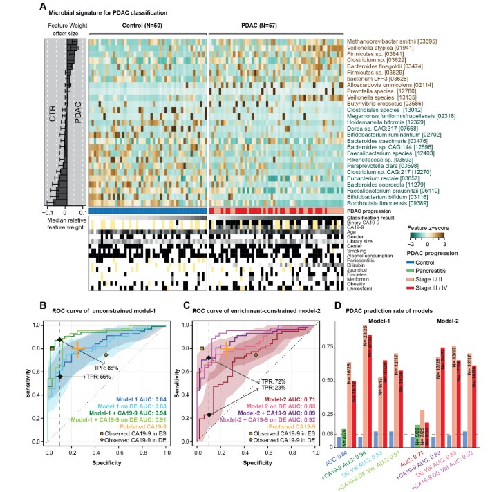
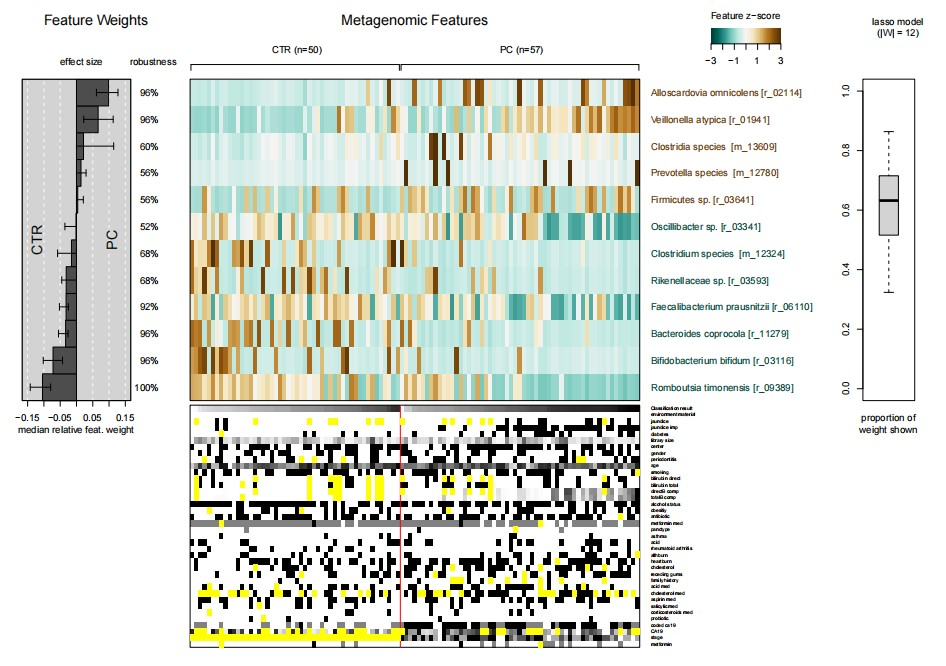
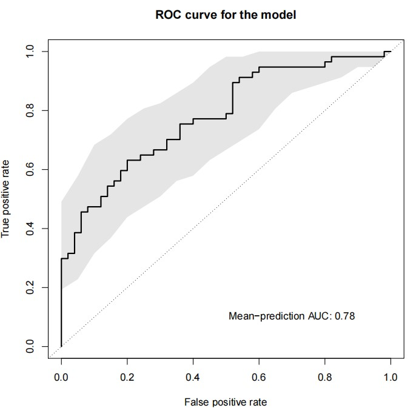
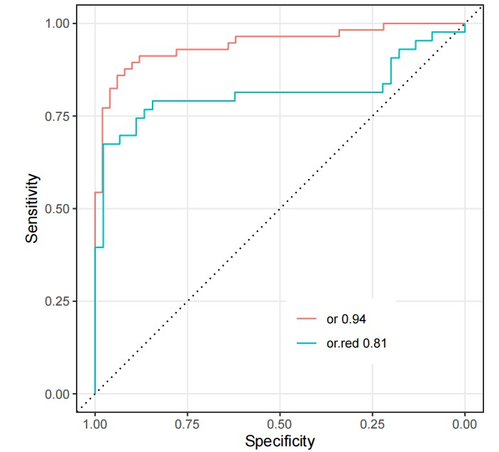
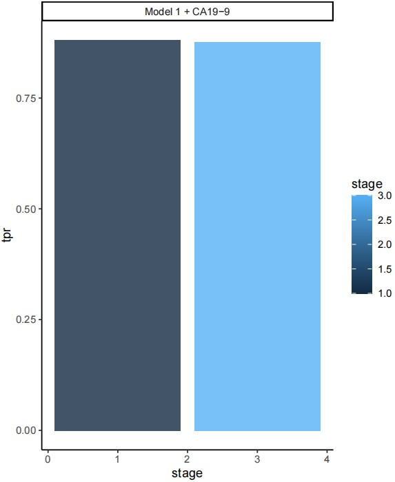

```{r setup, include=FALSE}
knitr::opts_chunk$set(
  collapse = T, echo=T, comment="#>", message=F, warning=F,
	fig.align="center", fig.width=5, fig.height=3, dpi=150)
```


The LassoClassifier_SIAMCAT analysis scripts is referenced from MicrobiomeStatPlot [Inerst Reference below].


If you use this script, please cited 如果你使用本代码，请引用：

**Yong-Xin Liu**, Lei Chen, Tengfei Ma, Xiaofang Li, Maosheng Zheng, Xin Zhou, Liang Chen, Xubo Qian, Jiao Xi, Hongye Lu, Huiluo Cao, Xiaoya Ma, Bian Bian, Pengfan Zhang, Jiqiu Wu, Ren-You Gan, Baolei Jia, Linyang Sun, Zhicheng Ju, Yunyun Gao, **Tao Wen**, **Tong Chen**. 2023. EasyAmplicon: An easy-to-use, open-source, reproducible, and community-based pipeline for amplicon data analysis in microbiome research. **iMeta** 2(1): e83. https://doi.org/10.1002/imt2.83

The online version of this tuturial can be found in https://github.com/YongxinLiu/MicrobiomeStatPlot


**Authors**
First draft(初稿)：Defeng Bai(白德凤)；Proofreading(校对)：Ma Chuang(马闯) and Xun Jiani(荀佳妮)；Text tutorial(文字教程)：Defeng Bai(白德凤)


# Introduction简介

参考：https://github.com/zellerlab/siamcat/tree/master

SIAMCAT是微生物群落和宿主表型之间关联的统计推断的流程分析的软件包。分析微生物组数据的主要目标是确定与环境因素相关的社区组成的变化。特别是，将人类微生物组组成与宿主表型（如疾病）联系起来已成为强烈研究的领域。为此，至关重要的是鲁棒的统计建模和生物标志物提取工具包。 SiamCat提供了完整的管道支持数据预处理，统计关联测试，统计建模（LASSO Logistic回归），包括用于评估和解释这些模型的工具（例如交叉验证，参数选择，ROC分析和诊断模型图）。

SIAMCAT is a pipeline for Statistical Inference of Associations between Microbial Communities And host phenoTypes. A primary goal of analyzing microbiome data is to determine changes in community composition that are associated with environmental factors. In particular, linking human microbiome composition to host phenotypes such as diseases has become an area of intense research. For this, robust statistical modeling and biomarker extraction toolkits are crucially needed. SIAMCAT provides a full pipeline supporting data preprocessing, statistical association testing, statistical modeling (LASSO logistic regression) including tools for evaluation and interpretation of these models (such as cross validation, parameter selection, ROC analysis and diagnostic model plots).


关键字：微生物组数据分析、MicrobiomeStatPlot、Lasso回归模型筛选微生物标志物、R语言可视化

Keywords: Microbiome analysis, MicrobiomeStatPlot, SIAMCAT, R visulization


## LassoClassifier_SIAMCAT example Lasso回归模型筛选微生物标志物案例

这是来自于欧洲分子生物学实验室Peer Bork团队2022年发表于Gut上的一篇论文。论文题目为：A faecal microbiota signature with high specificity for pancreatic cancer. doi:10.1136/gutjnl-2021-324755

This is a paper published in Gut in Gut in 2022 from the European molecular biology laboratory. The thesis title is: A FAECAL MICROBIOTA SIGNATURE With Specification of Pancreatic Cancer. Doi: 10.1136/Gutjnl-2021-3247555



Figure 2 Predictive microbiome signatures of pancreatic ductal adenocarcinoma (PDAC). (A) Normalised abundance of 27 selected species in the faecal microbiome across samples shown as a heat map. The right panel represents the contribution of each selected feature to the overall model- 1, and the robustness (the percentage of models in which the feature is included as predictor) of each feature is presented as percentage. Classification scores from cross- validation of each individual and condition for tested meta- variables are displayed at the bottom of the panel, yellow representing missing information. (B–D) Internal cross- validation results of unconstrained model- 1 (without feature selection), enrichment- constrained model- 2 (constrained to positive features) and combination of carbohydrate antigen (CA)19- 9 (using a threshold of 37 μL/mL) with microbial features (see ‘Methods’) are shown as receiver operating characteristic (ROC) curve with 95% CI shaded in corresponding colour. True positive rates (TPRs) are given as a percentage at a 90% specificity cut- off. Validation of all models on an independent German (DE) PDAC test population (n=76) is represented as well. Published CA19- 9 accuracy from a meta- study shown in orange. The yellow dots represent observed CA19- 9 accuracies in our populations (data available for 33/50 controls (CTRs) and 44/57 patients with PDAC in the Spanish (ES) and for 8/32 CTRs and 44/44 patients with PDAC in the German (DE) population) (D) TPRs of all models at different PDAC progression stages and in addition, the false- positive rate for patients with chronic pancreatitis and controls at a 90% specificity cut- off are shown as bar plots. Stages I and II and stages III and IV are combined owing to the overall low sample size. The number of predicted cases compared with the total is also shown on the top of each bar. DE- Val, German validation population.

图2胰腺导管腺癌（PDAC）的预测性微生物组特征。 （a）在作为热图显示的样品中，粪便微生物组中27个选定物种的归一化丰度。右面板代表每个选定特征对整个模型1的贡献，并且将每个功能的功能（其中包含作为预测指标）的模型的百分比表示为百分比。分类从每个个体的交叉验证和测试元变量的条件分数显示在面板的底部，黄色表示丢失的信息。 （b – d）无约束模型1（无特征选择）的内部交叉验证结果，富集受约束的模型2（约束至阳性特征）和碳水化合物抗原（CA）19-9的组合（使用37个阈值具有微生物特征的μL/mL）显示为接收器操作特征（ROC）曲线，其95％CI的相应颜色为95％。真正的正率（TPR）以削减90％的特异性为百分比给出。在独立德语（DE）PDAC测试人群（n = 76）上对所有模型的验证也被代表。从橙色显示的元研究中发表的CA19-9精度。黄点代表了我们人群中观察到的CA19-9精度（可用于33/50对照（CTRS）的数据，西班牙语（ES）的44/57患者PDAC和44/32 CTR和44/4444例PDAC患者的PDAC患者在不同PDAC进展阶段的所有模型的德国（DE）人口（d）TPR，此外，慢性胰腺炎患者的假阳性率和90％特异性削减的对照组显示为条形图。I和II阶段以及III和IV阶段是由于总体低样本量而合并的。与总数相比，预测案例的数量也显示在每个条的顶部。德国，德国验证人群。


**结果**

Multivariable statistical modelling and model evaluation
多变量统计建模和模型评估

In order to train multivariable statistical models for the prediction of pancreatic cancer, we first removed taxa with low overall abundance and prevalence (abundance cut- off point: 0.001). Then, features were normalised by log10 transformation (to avoid infinite values from the logarithm, a pseudo- count of 1e- 05 was added to all values) followed by standardisation as centred log- ratio ( log. clr). Data were randomly split into test and training sets in a 10 times repeated 10- fold cross- validation. For each test fold, the remaining folds were used as training data to train an L1- regularised (LASSO) logistic regression model using the implementation within the LiblineaR R package v2.10. The trained model was then used to predict the left- out test set and finally, all predictions were used to calculate the area under the receiver operating characteristics curve (AUROC) (figure 2).

为了训练胰腺癌预测的多变量统计模型，我们首先删除了总体丰度和患病率较低的分类单元（较低的削减点：0.001）。然后，通过log10转换将特征归一化（为避免对数中的无限值，将伪计数添加到所有值中为1e-05），然后以标准化为中心对数比率（log。clr）。将数据随机分为测试，并在10次重复10倍跨验证中进行训练集。对于每个测试折叠，其余折叠用作训练数据，以使用Liblinear R软件包v2.10中的实现来训练L1正则化（LASSO）Logistic回归模型。然后使用训练的模型预测剩余的测试集，最后，所有预测均用于计算接收器操作特性曲线下的面积（AUROC）（图2）。

In a second approach, features were filtered within the crossvalidation (that is, for each training set) by first calculating the single- feature AUROC and then removing features with an AUROC <0.5, thereby selecting features enriched in PDAC (‘enrichment- constrained’ model).

在第二种方法中，通过首先计算单特征AUROC，然后以AUROC <0.5 来删除特征，从而在交叉验证（即每个训练集）中过滤特征（即每个训练集），从而选择了富含PDAC的功能（“富集约束），模型）。

In order to combine the predictions from the microbiomebased machine learning models with the CA19- 9 marker, the coded CA19- 9 marker (1 for positive, 0 for negative or not available) was added to the mean predictions from the repeated cross- validation runs, resulting in an OR combination. Alternatively, the AND combination was calculated by multiplying the predictions with the CA19- 9 marker. ROC curves and AUROC values were calculated for both combinations using the pROC R package v1.15. The 95% CI is shaded in corresponding colour and specified in figure legends for each ROC curve.

为了将基于微生物组的机器学习模型的预测与CA19-9标记相结合，将编码的Ca19-9标记（1个正值，0，负或不可用）添加到重复交叉验证运行中的平均预测中，导致或组合。或者，通过将预测乘以CA19-9标记来计算和组合。使用Proc R Package V1.15计算了两种组合的ROC曲线和AUROC值。 95％CI以相应的颜色为阴影，并在每个ROC曲线的图中指定。

The trained ES metagenomic classifiers for PDAC were then applied to the DE dataset after applying a data normalisation routine, which selects the same set of features and uses the same normalisation parameters (for example, the mean of a feature for standardisation by using the frozen normalisation functionality in SIAMCAT) as in the normalisation procedure from the ES pancreatic cancer dataset. For this analysis, the cut- off point for the predictions was set to a false- positive rate of 10% among controls in the initial ES PDAC study population (figure 2).

在应用数据归一化例程后，将训练的PDAC的训练有素的ES元基因组分类器应用于DE数据集，该程序选择相同的功能集并使用相同的归一化参数（例如，通过使用Frozen归一化来实现标准化的特征的平均值Siamcat中的功能）与ES胰腺癌数据集的标准化程序一样。在此分析中，在初始ES PDAC研究人群中，预测的切开点被设置为对照组的错误正率为10％（图2）。

All steps of data preprocessing (filtering and normalisation), model training, predictions and model evaluation were performed using the SIAMCAT R package v.1.5.0 (https://siamcat.embl.de/).

数据预处理（过滤和归一化），模型训练，预测和模型评估的所有步骤均使用Siamcat R软件包V.1.5.0（https：//siamcat.embl.de/）进行。


## Packages installation软件包安装

```{r}
# 基于CRAN安装R包，检测没有则安装
p_list = c("gtools", "readr", "tidyverse", "readxl", "matrixStats", "ggrepel",
           "dplyr", "plyr")
for(p in p_list){if (!requireNamespace(p)){install.packages(p)}
    library(p, character.only = TRUE, quietly = TRUE, warn.conflicts = FALSE)}

# 基于BiocManager安装
library(BiocManager)
if (!requireNamespace("SIAMCAT", quietly = TRUE))
    BiocManager::install("SIAMCAT")

# 加载R包 Load the package
suppressWarnings(suppressMessages(library(gtools)))
suppressWarnings(suppressMessages(library(readr)))
suppressWarnings(suppressMessages(library(tidyverse)))
suppressWarnings(suppressMessages(library(readxl)))
suppressWarnings(suppressMessages(library(matrixStats)))
suppressWarnings(suppressMessages(library(ggrepel)))
suppressWarnings(suppressMessages(library(dplyr)))
suppressWarnings(suppressMessages(library(plyr)))
suppressWarnings(suppressMessages(library(SIAMCAT)))
```


# LassoClassifier_SIAMCAT tutorial Lasso 回归模型筛选微生物标志物

## Codes according to the data of the example and the code provided 根据示例文献的数据及提供的代码进行复现

参考：https://github.com/psecekartal/PDAC/blob/main/Rmd/metag_modell_building.Rmd

### Prapare metagenomic data 准备数据 

```{r Prapare metagenomic data, include=TRUE}
set.seed("3456")

# Set parameters
PARAM <- list()
PARAM$folder.R <- paste0(getwd(), "/data/")
PARAM$folder <- gsub("Rmd/", "", PARAM$folder.R)
PARAM$folder.Rdata <- paste0(PARAM$folder, "Rdata/")

# load metadata
load(paste0(PARAM$folder.Rdata, "metag.pc.metadata.Rdata"))
load(paste0(PARAM$folder.Rdata, "metag.pc.metadata.imputed.Rdata"))
# load taxonomic profile
load(paste0(PARAM$folder.Rdata, "data.table.metag.Rdata"))

# clean the table
dim(motu.abs.3mg)
# calculate relative abundance
motu.rel.3mg <- prop.table(as.matrix(motu.abs.3mg), 2)
motu.rel.3mg <- motu.rel.3mg[rowSums(motu.rel.3mg >= 10^-5) >= 2, ]
dim(motu.rel.3mg)

#Split metadata
#meta.total <- complete.cases(meta.total)# subset metadata
meta.or = subset(meta.total,
                 meta.total$environment_material=="saliva [ENVO:02000036]")
meta.st = subset(meta.total, 
                 meta.total$environment_material=="feces [ENVO:00002003]")
meta.st.cancer = subset(meta.total, 
                        meta.total$status!="Pancreatitis" & 
                        meta.total$environment_material=="feces [ENVO:00002003]")
meta.or.cancer = subset(meta.total, 
                        meta.total$status!="Pancreatitis" & 
                        meta.total$environment_material=="saliva [ENVO:02000036]")
meta.st.pc = subset(meta.total, 
                    meta.total$status!="PC" & 
                    meta.total$environment_material=="feces [ENVO:00002003]")
meta.or.pc = subset(meta.total, 
                    meta.total$status!="PC" & 
                    meta.total$environment_material=="saliva [ENVO:02000036]")
meta.total.cancer = rbind(meta.st.cancer, meta.or.cancer)

meta.or.temp = subset(meta.total, 
                 meta.total$environment_material=="saliva [ENVO:02000036]")
meta.st.temp = subset(meta.total, 
                 meta.total$environment_material=="feces [ENVO:00002003]")

# subset otu profiles
feat.st.rel.cancer.3mg <- motu.rel.3mg[, match(rownames(meta.st.cancer),
                                               colnames(motu.rel.3mg))]
feat.or.rel.cancer.3mg <- motu.rel.3mg[, match(rownames(meta.or.cancer),
                                               colnames(motu.rel.3mg))]
feat.st.rel.pc.3mg <- motu.rel.3mg[, match(rownames(meta.st.pc),
                                           colnames(motu.rel.3mg))]
feat.or.rel.pc.3mg <- motu.rel.3mg[, match(rownames(meta.or.pc),
                                           colnames(motu.rel.3mg))]

#Save files
save.image(paste0(PARAM$folder.Rdata, "metag.pc.Rdata"))
```


### Model building 构建模型

SIAMCAT needs a feature matrix (matrix or data.frame) 
features (in rows) samples (in columns)
metadata in a data.frame, samples as row names

SIAMCAT需要一个特征矩阵（矩阵或data.frame）
特征（行）样本（列）
data.frame中的元数据，样本为行名称

```{r model building, echo=TRUE}
# check siamcat version
packageVersion("SIAMCAT")

PARAM <- list()
PARAM$folder.R <- paste0(getwd(), "/data/")
PARAM$folder <- gsub("Rmd/", "", PARAM$folder.R)
PARAM$folder.metadata <- paste0(PARAM$folder, "metadata/")
PARAM$folder.Rdata <- paste0(PARAM$folder, "Rdata/")
PARAM$folder.data <- paste0(PARAM$folder, "data/")
PARAM$folder.results <- paste0(PARAM$folder, "results/")

# load data metag motu and genes
load(paste0(PARAM$folder.Rdata, "metag.pc.Rdata"))

# Spanish MetaG Taxonomic Modelling
# choose the meta variables to test
metatest <- c("jaundice", "diabetes","asthma", "acid", "rheumatoid arthritis", 
              "library_size", "center", "periodontitis", "age", "smoking", "acid_med",
              "bilirubin_direct","directB_comp", "totalB_comp", "alcohol_status", 
              "antibiotic", "metformin","obesitiy", "salicylic_med", "allhburn",
              "probiotic","heartburn", "cholesterol", "receding gums", "coded_ca19")

# Function to run siamcat with centered log transformation (clr) normalization
# 10 fold cross validation and 10 fold re-sampling, can adjust accordingly
# Confounder check based on fisher exact test
#runsiamcat <- function(featTable, metaTable, fileName, case, ml, norm){
featTable = feat.st.rel.cancer.3mg
metaTable = meta.st.cancer
fileName = "status"
case = "PC"
dim(featTable)
# create SIAMCAT object and classify
siamcat1 <- siamcat(feat=featTable, meta=metaTable, label="status", case=case)
# filter based on abundance 
siamcat1 <- filter.features(siamcat1, filter.method = 'abundance', 
                            cutoff=0.001, verbose=3)
check.confounders(siamcat1, fn.plot = paste0(PARAM$folder.results, 
                            fileName, 'confounders.pdf'),
                            meta.in=metatest, verbose = 3)
# normalize with log.clr
siamcat1 <- normalize.features(siamcat1, norm.method = "log.clr", feature.type = 'filtered',
                                norm.param = list(log.n0=1e-05, sd.min.q=1))
# compute associations 
siamcat1 <- check.associations(siamcat1, feature.type = 'normalized'#, 
                                #detect.lim = 10^-5, 
                                #plot.type = "quantile.box",
                                #fn.plot = paste0(PARAM$folder.results, 
                                #          Sys.Date(), '.', fileName,'assoc.plot.pdf')
                               )
# train model
siamcat1 <- create.data.split(siamcat1, num.folds =5, num.resample = 5)  
siamcat1 <- train.model(siamcat1, method = "lasso_ll", verbose = 2)
siamcat1 <- make.predictions(siamcat1)
siamcat1 <- evaluate.predictions(siamcat1)    
print(siamcat1@eval_data$auroc)
# evaluation plot
model.evaluation.plot(siamcat1, fn.plot = paste0(PARAM$folder.results, Sys.Date(), '.',
                                                  fileName, 'eval.plot.pdf'))
# interpretation plot
model.interpretation.plot(siamcat1, fn.plot = paste0(PARAM$folder.results, 
                           Sys.Date(), '.', fileName,'interpret.plot.pdf'),
                            consens.thres = 0.5,
                            #detect.lim = 1e-05,
                            heatmap.type = 'zscore')
# save siamcat object
save(siamcat1, file = paste0(PARAM$folder.results, fileName, 'siamcat.Rdata'))
#return(siamcat1)
#}

# Direction: positive
# positive: the top positively associated featured (enriched in the case group for binary classification or enriched in higher values for regression)
#runsiamcat.pos <- function(featTable, metaTable, fileName, case){
featTable = feat.or.rel.cancer.3mg
metaTable = meta.or.cancer
fileName = "status"
case = "PC"  
dim(featTable)
# create SIAMCAT object and classify
siamcat2 <- siamcat(feat=featTable, meta=metaTable, label="status", case=case)
# filter based on abundance 
siamcat2 <- filter.features(siamcat2, filter.method = 'abundance', 
                            cutoff=0.001, verbose=3)
check.confounders(siamcat2, fn.plot = paste0(PARAM$folder.results, 
                            fileName, 'confounders.pdf'),
                            meta.in=metatest, verbose = 3)
# normalize with log.clr
siamcat2 <- normalize.features(siamcat2, norm.method = c("log.clr"), feature.type = 'filtered',
                                norm.param = list(log.n0=1e-05, sd.min.q=1))
# compute associations 
siamcat2 <- check.associations(siamcat2, feature.type = 'normalized'#, 
                                #detect.lim = 10^-5, 
                                #plot.type = "quantile.box",
                                #fn.plot = paste0(PARAM$folder.results, 
                                #          Sys.Date(), '.', fileName,'assoc.plot.pdf')
                                )
# train model
siamcat2 <- create.data.split(siamcat2, num.folds =5, num.resample = 5)  
# siamcat <- train.model(siamcat, method='lasso_ll', verbose = 2,, measure = "classif.acc",
#                        perform.fs = TRUE,
#                        #modsel.crit = list('pr'),
#                        param.fs = list(thres.fs = 50,
#                                        method.fs = 'gFC',
#                                        direction='positive'))
siamcat2 <- train.model(siamcat2, method = "lasso", measure = "classif.acc",
              param.set = NULL, grid.size=11, min.nonzero=5, perform.fs = FALSE,
              param.fs = list(thres.fs = 50, method = "gFC", direction="positive"),
              feature.type='normalized', verbose = 1)
siamcat2 <- make.predictions(siamcat2)
siamcat2 <- evaluate.predictions(siamcat2)    
print(siamcat2@eval_data$auroc)
# evaluation plot
model.evaluation.plot(siamcat2, fn.plot = paste0(PARAM$folder.results, Sys.Date(), '.',
                                                  fileName, 'eval.plot.pdf'))
# interpretation plot
model.interpretation.plot(siamcat2, fn.plot = paste0(PARAM$folder.results, 
                           Sys.Date(), '.', fileName,'interpret.plot.pdf'),
                            consens.thres = 0.5, 
                            #detect.lim = 1e-05,
                            heatmap.type = 'zscore')
# save siamcat object
save(siamcat2, file = paste0(PARAM$folder.results, fileName, 'siamcat2.Rdata'))
#  return(siamcat) 
#}

# run siamcat
# runsiamcat(feat.st.rel.cancer.3mg, meta.st.cancer, "status", "PC")
# runsiamcat(feat.or.rel.cancer.3mg, meta.or.cancer, "status", "PC")
# runsiamcat(feat.st.rel.pc.3mg, meta.st.pc, "status", "Pancreatitis")
# runsiamcat(feat.or.rel.pc.3mg, meta.or.pc, "status", "Pancreatitis")

# temp=meta.st[meta.st$status!="CTR",]
# feat.st.rel.total.3mg = motu.rel.3mg
# feat.st.relpdac.cp.3mg=feat.st.rel.total.3mg[,rownames(temp)]
# runsiamcat(feat.st.relpdac.cp.3mg, temp, "status", "PC")

# run positive mode siamcat
# runsiamcat.pos(feat.st.rel.cancer.3mg, meta.st.cancer, "status", "PC")
# runsiamcat.pos(feat.or.rel.cancer.3mg, meta.or.cancer, "status", "PC")
# runsiamcat.pos(feat.st.rel.pc.3mg, meta.st.pc, "status", "Pancreatitis")
# runsiamcat.pos(feat.or.rel.pc.3mg, meta.or.pc, "status", "Pancreatitis")
```






### Add CA19-9 data to microbiome data
### 将CA19-9数据添加到微生物组数据

```{r add data, echo=TRUE}
# reassign ca19 
siamcat.pc = siamcat1
siamcat.pos = siamcat2
a = meta(siamcat.pc)
meta.st.cancer$CA19.new <- as.numeric(gsub("<", "", meta.st.cancer$CA19))
# meta(siamcat.pc) <- a
# meta(siamcat.pos) <- meta(siamcat.pc)
# function for AND and OR combination
.f_and_or_combination <- function(x){
  require("tidyverse")
  require("pROC")
  require(SIAMCAT)
  stopifnot(class(x) == 'siamcat')
  stopifnot('coded_ca19' %in% colnames(meta(x)))
  stopifnot(!is.null(eval_data(x, verbose=0)))
  temp <- eval_data(x)$roc

  # compute for AND combination and OR combination separately
  pred <- enframe(rowMeans(pred_matrix(x)),
                  name='Sample_ID', value="pred_status") %>% 
    full_join(tibble(Sample_ID=rownames(meta(x)),
                     ca_status=meta(x)$coded_ca), by='Sample_ID') %>% 
    full_join(enframe(label(x)$label, 
                      name='Sample_ID', value='Group'), by='Sample_ID')
  pred$ca_status <- as.numeric(pred$ca_status)
  # AND combo
  combo <- pred %>% 
    filter(ca_status!=0) %>% 
    mutate(ca_status=case_when(ca_status==-1~0, TRUE~ca_status)) %>% 
    mutate(combo=pred_status*ca_status)
  roc.and.red <- roc(predictor=combo$combo, response=combo$Group, 
                     levels = c(-1, 1), direction = '<')
  
  combo <- pred %>% 
    mutate(ca_status=case_when(ca_status==-1~0, TRUE~ca_status)) %>% 
    mutate(combo=pred_status*ca_status)
  roc.and <- roc(predictor=combo$combo, response=combo$Group, 
                 levels = c(-1, 1), direction = '<')
  
  # OR combo
  combo <- pred %>% 
    filter(ca_status!=0) %>% 
    mutate(ca_status=case_when(ca_status==-1~0, TRUE~ca_status)) %>% 
    mutate(combo=pred_status+ca_status)
  roc.or.red <- roc(predictor=combo$combo, response=combo$Group, 
                    levels = c(-1, 1), direction = '<')
  
  combo <- pred %>% 
    mutate(ca_status=case_when(ca_status==-1~0, TRUE~ca_status)) %>% 
    mutate(combo=pred_status+ca_status)
  roc.or <- roc(predictor=combo$combo, response=combo$Group, 
                levels = c(-1, 1), direction = '<')
  
  df.res <- list('or'=roc.or, 'or.red'=roc.or.red, 
                 'and'=roc.and, 'and.red'=roc.and.red)
  return(df.res)
}
# combine Ca19-9 with microbiome data
sc.ca19=.f_and_or_combination(siamcat.pc)
sc.ca19.pos=.f_and_or_combination(siamcat.pos)
save(sc.ca19.pos,sc.ca19, file = paste0(PARAM$folder.results,
                                       'ca19-9.combined.Rdata'))

# plot ROCs
get.roc <- function(sc, name){
  #sc = sc.ca19
  #name = "OR"
  roc.obj <- sc$or
  df.return <- tibble(sensitivity=roc.obj$sensitivities,
                      specificitiy=roc.obj$specificities,
                      name=name,
                      auroc=roc.obj$auc)
}

df1 <- get.roc(sc.ca19, 'or')
df2 <- get.roc(sc.ca19.pos, 'or.red')
#df.plot <- bind_rows(df1, df2)
df.plot <- rbind(df1, df2)

p <- df.plot %>% 
  arrange(sensitivity) %>% 
  mutate(label=paste0(name, ' ', sprintf(fmt='%.2f', auroc))) %>% 
  ggplot(aes(x=specificitiy, y=sensitivity, col=label)) + 
  geom_abline(intercept = 1, slope = 1, col='black', lty=3) +
  geom_line() + 
  #scale_color_tableau(name='') + 
  xlab('Specificity') + 
  ylab('Sensitivity') + 
  theme_bw() + 
  scale_x_reverse() +
  theme(panel.grid.minor = element_blank(),
        aspect.ratio = 1,
        legend.position = c(0.65, 0.2), legend.title = element_blank())
# save the plots
ggsave(p, filename = paste0(PARAM$folder.results, 'results/roc.ca19.pdf'), width = 5.5, height = 4.5)
```




### Calculate TPR of models
### 计算模型的TPR

```{r TPR, echo=TRUE}
# TRP rate for different stages
calculate.tpr <- function(x){
  siamcat=x
  pred <- rowMeans(pred_matrix(siamcat))
  threshold <- siamcat@eval_data$roc$thresholds[
    which(siamcat@eval_data$roc$specificities > 0.90)[1]]
  
  pred=as.data.frame(pred)
  rownames(pred) <- colnames(siamcat@phyloseq@otu_table)
  pred = merge(pred, meta.st.cancer, by="row.names", all.x=TRUE)
  table(pred$stage)
  
  # combine stage 1+2 and 3+4
  pred <- pred %>%  
    mutate(stage.n=dplyr::recode(stage,  "1"=1,"2"=1,"3"=3,"4"=3))
  
  stage=pred$stage.n
  df.tpr <- tibble(pred=pred$pred, Group=(label(siamcat))[[1]], stage=stage)
  df.tpr <- df.tpr %>% 
    group_by(stage) %>% 
    dplyr::summarise(n=n(), 
                     pred.pos=sum(pred>threshold), 
                     pred.neg=sum(pred < threshold)) %>% 
    ungroup() %>% 
    mutate(tpr=pred.pos/n)
}
# naive mdoels
df.tpr.m1 = calculate.tpr(siamcat.pc)
df.tpr.m1$model = "Model 1"

df.tpr.m2 = calculate.tpr(siamcat.pos)
df.tpr.m2$model = "Model 2"

# repeat for combinations
calculate.tpr <- function(x){
  
  #x = sc.ca19.pos
  siamcat=x
  pred <- siamcat$or$predictor
  threshold <- siamcat$or$thresholds[which(siamcat$or$specificities > 0.90)[1]]
  
  pred=as.data.frame(pred)
  rownames(pred) <- colnames(siamcat.pc@phyloseq@otu_table)
  #rownames(pred) <- colnames(siamcat@phyloseq@otu_table)
  pred = merge(pred, meta.st.cancer, by="row.names", all.x=TRUE)
  table(pred$stage)
  
  pred <- pred %>%  
    mutate(stage.n=dplyr::recode(stage,  "1"=1,"2"=1,"3"=3,"4"=3))
  
  stage=pred$stage.n
  
  df.tpr <- tibble(pred=pred$pred, Group=(label(siamcat.pc))[[1]], stage=stage)
  df.tpr <- df.tpr %>% 
    group_by(stage) %>% 
    dplyr::summarise(n=n(), 
                     pred.pos=sum(pred>threshold), 
                     pred.neg=sum(pred < threshold)) %>% 
    ungroup() %>% 
    mutate(tpr=pred.pos/n)
}

# CA19-9 combined models
df.tpr.ca19.m1 = calculate.tpr(sc.ca19)
df.tpr.ca19.m1$model = "Model 1 + CA19-9"

df <- df.tpr.ca19.m1

# plot tpr
p.tpr <- ggplot(data=df, aes(x=stage, y=tpr, fill=stage)) + 
  geom_col(alpha=0.8) + 
  theme_classic()  +  facet_grid(cols = vars(model), scales = "free") 

ggsave(p.tpr, filename=paste0(PARAM$folder.results, "results/stage.tpr.barplot.pdf"), 
       width = 5, height=6)
```




If used this script, please cited:
使用此脚本，请引用下文：

**Yong-Xin Liu**, Lei Chen, Tengfei Ma, Xiaofang Li, Maosheng Zheng, Xin Zhou, Liang Chen, Xubo Qian, Jiao Xi, Hongye Lu, Huiluo Cao, Xiaoya Ma, Bian Bian, Pengfan Zhang, Jiqiu Wu, Ren-You Gan, Baolei Jia, Linyang Sun, Zhicheng Ju, Yunyun Gao, **Tao Wen**, **Tong Chen**. 2023. EasyAmplicon: An easy-to-use, open-source, reproducible, and community-based pipeline for amplicon data analysis in microbiome research. **iMeta** 2: e83. https://doi.org/10.1002/imt2.83

Copyright 2016-2024 Defeng Bai <baidefeng@caas.cn>, Chuang Ma <22720765@stu.ahau.edu.cn>, Jiani Xun <15231572937@163.com>, Yong-Xin Liu <liuyongxin@caas.cn>


