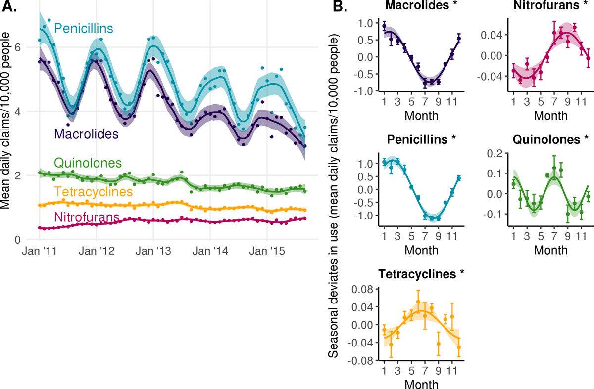
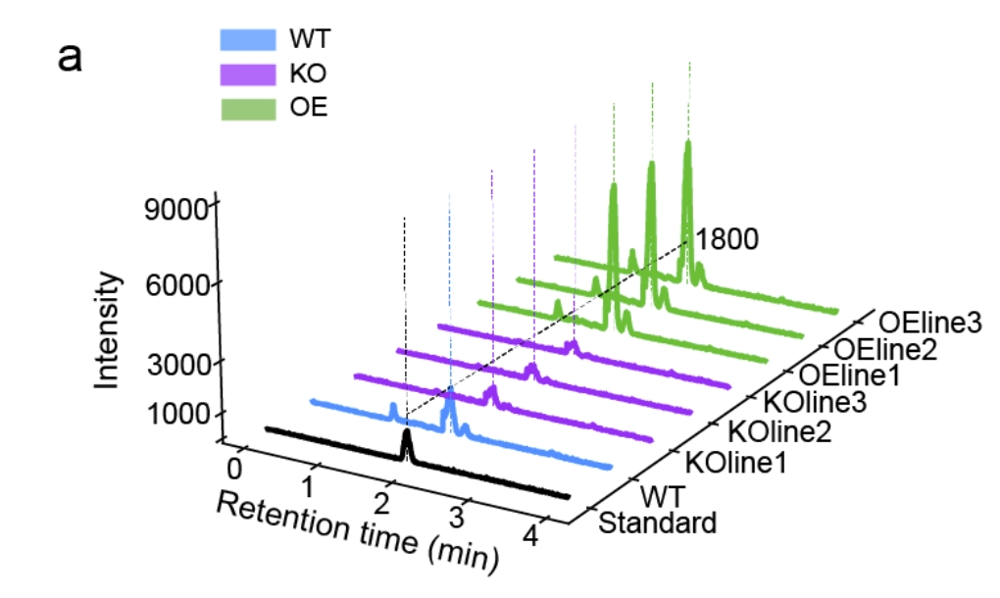
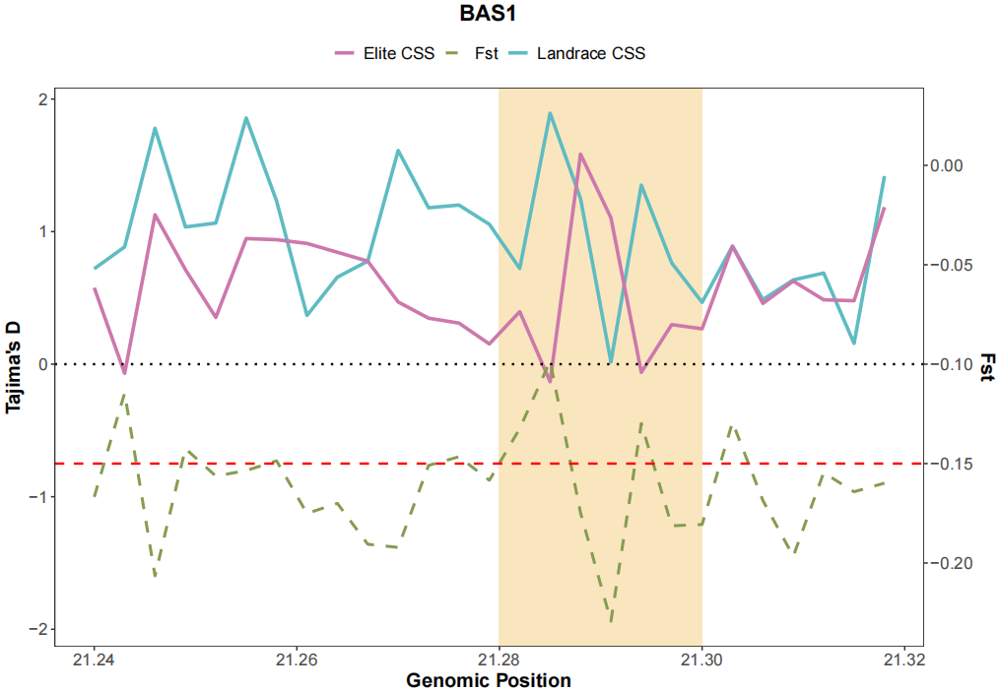
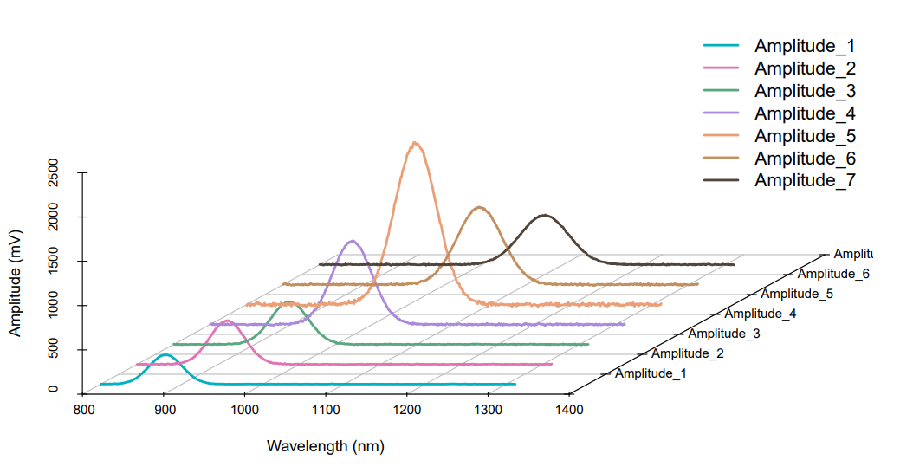
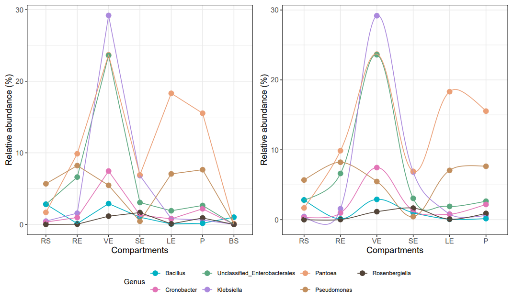
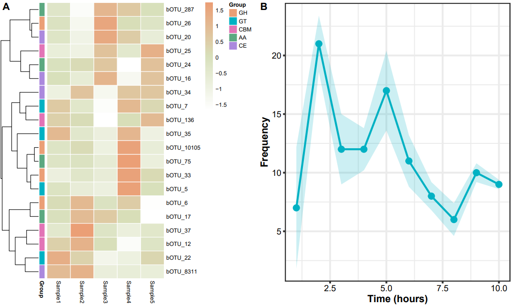
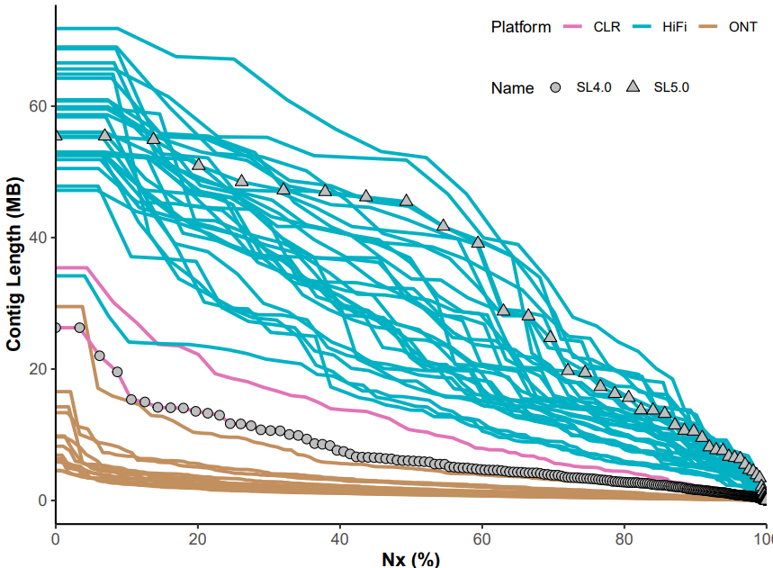
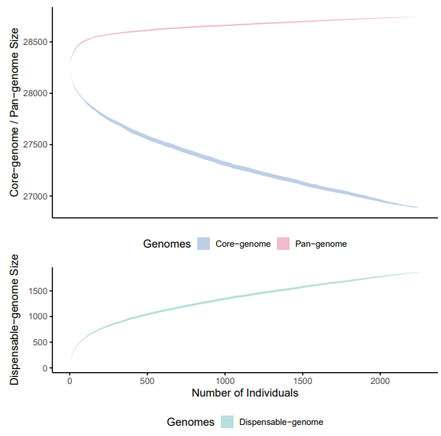
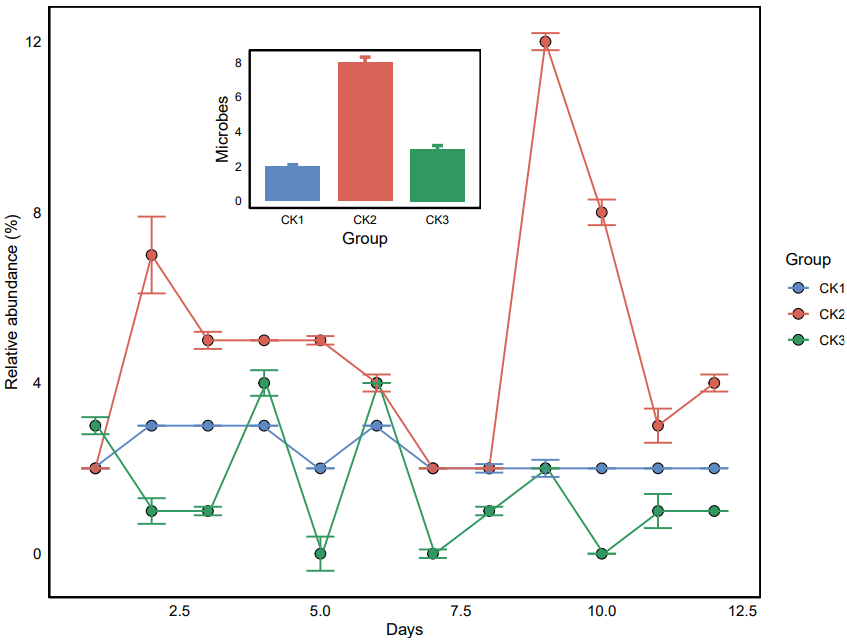
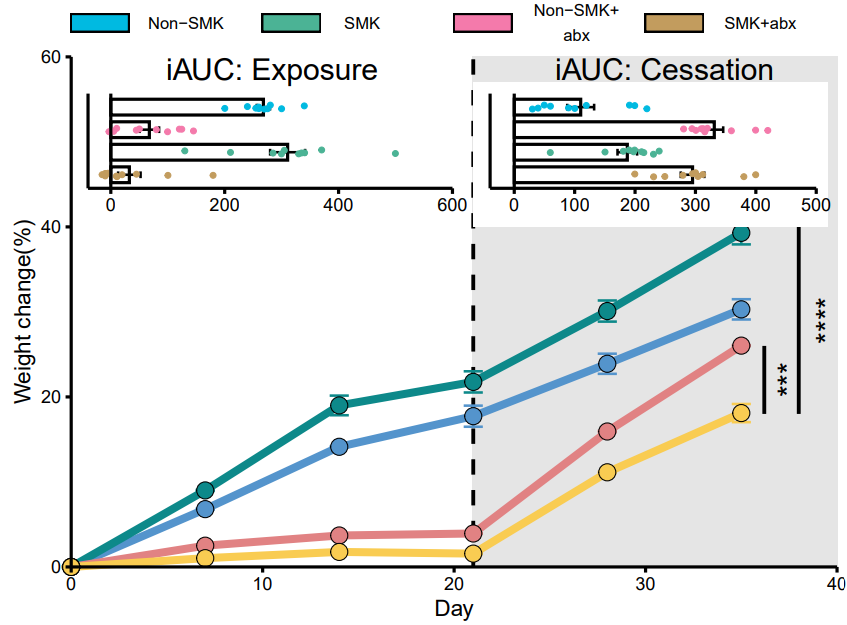

```{r setup, include=FALSE}
knitr::opts_chunk$set(
  collapse = T, echo=T, comment="#>", message=F, warning=F,
	fig.align="center", fig.width=5, fig.height=3, dpi=150)
```


The Line plot scripts is referenced from MicrobiomeStatPlot [Inerst Reference below].

If you use this script, please cited 如果你使用本代码，请引用：

**Yong-Xin Liu**, Lei Chen, Tengfei Ma, Xiaofang Li, Maosheng Zheng, Xin Zhou, Liang Chen, Xubo Qian, Jiao Xi, Hongye Lu, Huiluo Cao, Xiaoya Ma, Bian Bian, Pengfan Zhang, Jiqiu Wu, Ren-You Gan, Baolei Jia, Linyang Sun, Zhicheng Ju, Yunyun Gao, **Tao Wen**, **Tong Chen**. 2023. EasyAmplicon: An easy-to-use, open-source, reproducible, and community-based pipeline for amplicon data analysis in microbiome research. **iMeta** 2(1): e83. https://doi.org/10.1002/imt2.83

The online version of this tuturial can be found in https://github.com/YongxinLiu/MicrobiomeStatPlot


**Authors**

First draft(初稿)：Defeng Bai(白德凤)；Proofreading(校对)：Ma Chuang(马闯) and Jiani Xun(荀佳妮)；Text tutorial(文字教程)：Defeng Bai(白德凤)


# Introduction简介

## Line plot 线图

什么是线图？
What is a line plot?

线图最常用于绘制连续的数据。线图中点与点连成线，暗示了数据间的联系以及数据的趋势。线图可以用来反映某一变量随着另一变量变化的趋势或者说速度，一般用线段的升降来表示数值的大小变化。线图有多种多样的展现形式。

Line plot are most commonly used to plot continuous data. Lines connect points in a line graph, suggesting the connection between data and the trend of the data. Line plots can be used to reflect the trend or speed of a variable changing with another variable. Generally, the rise and fall of the line segment is used to represent the change in the magnitude of the value. Line graphs have a variety of display forms.


关键字：微生物组数据分析、MicrobiomeStatPlot、线图、R语言可视化

Keywords: Microbiome analysis, MicrobiomeStatPlot, Line plot, R visulization


## Line Chart example 线图应用案例

### Case1 案例1：

这是Yonatan H. Grad课题组2022年发表于Plos Biology上的文章，第一作者为Daphne S. Sun，题目为：Analysis of multiple bacterial species and antibiotic classes reveals large variation in the association between seasonal antibiotic use and resistance https://journals.plos.org/plosbiology/article?id=10.1371/journal.pbio.3001579

This is a 2022 article by Yonatan H. Grad's group published in Plos Biology, first authored by Daphne S. Sun, titled: Analysis of multiple bacterial species and antibiotic classes reveals large variation in association between seasonal antibiotic use and resistance. Sun, titled: Analysis of multiple bacterial species and antibiotic classes reveals large variation in association between seasonal antibiotic use and resistance




Fig 1. Seasonal patterns of antibiotic use by class.
(A) Average daily antibiotic claims per 10,000 people by calendar month in Boston, Massachusetts from 2011 to 2015. Lines indicate LOESS smoothing curves and shaded regions indicate 95% CIs. (B) Sinusoidal model fits for monthly prescribing rate. Points indicate monthly mean seasonal deviates in average daily antibiotic claims per 10,000 people by calendar month and error bars indicate the standard error of the mean. Lines indicate the point estimate for the amplitude and phase of the sinusoidal model. Shaded regions indicate the 95% CIs for the amplitude. Asterisks indicate the amplitude of seasonality is statistically significant (FDR < 0.05). FDR, false discovery rate.

图 1. 各类抗生素使用的季节性模式。
(A) 2011 年至 2015 年马萨诸塞州波士顿市按日历月划分的每万人日均抗生素使用量。线条表示LOESS平滑曲线，阴影区域表示95%CI。(B)每月处方率的正弦模型拟合。点表示历月每万人日均抗生素处方量的月平均季节偏差，误差条表示平均值的标准误差。线表示正弦模型振幅和相位的点估计值。阴影区域表示振幅的95%CI。星号表示季节性振幅具有统计学意义（FDR < 0.05）。FDR，错误发现率。

**结果**：

The 5 antibiotic classes included in this study each displayed statistically significant seasonal patterns of use (Fig 1A). Penicillins and macrolides were most frequently prescribed, with year-round averages of 4.8 and 4.1 daily claims per 10,000 people, respectively. Quinolones, tetracyclines, and nitrofurans were prescribed with year-round averages of 1.8, 1.0, and 0.54 daily claims per 10,000 people, respectively.

本研究中包括的 5 类抗生素在统计上都显示出显著的季节性使用模式（图 1A）。青霉素类和大环内酯类是最常用的处方药，全年平均每天每万人分别有 4.8 和 4.1 个处方。喹诺酮类、四环素类和硝基呋喃类药物的全年平均处方量分别为每万人 1.8、1.0 和 0.54 次。

Penicillins had the greatest magnitude change in prescribing rate across seasons, with the seasonal component having an amplitude of 1.1 additional daily claims per 10,000 people (peak to mean) (95% CI, 0.96 to 1.3). This was followed by macrolides (amplitude, 0.74; 95% CI, 0.59 to 0.89), quinolones (amplitude, 0.081; 95% CI, 0.044 to 0.12), nitrofurans (amplitude, 0.044; 95% CI, 0.024 to 0.064), and tetracyclines use (amplitude, 0.031; 95% CI, 0.011 to 0.052) (Fig 1B).

青霉素类药物的处方率在不同季节的变化幅度最大，其季节性部分的振幅为每 10,000 人中每天增加 1.1 个处方（峰值至平均值）（95% CI，0.96 至 1.3）。其次是大环内酯类（振幅为 0.74；95% CI 为 0.59 至 0.89）、喹诺酮类（振幅为 0.081；95% CI 为 0.044 至 0.12）、硝基呋喃类（振幅为 0.044；95% CI 为 0.024 至 0.064）和四环素类（振幅为 0.031；95% CI 为 0.011 至 0.052）（图 1B）。

The timing of peak prescribing varied by antibiotic class (Fig 1B). Macrolide and penicillin use peaked in the winter, around late January (phase, 1.7 months; 95% CI, 1.3 to 2.1; note that phase is indexed to 1.0 representing January 1) and early February (phase, 2.2 months; 95% CI, 2.0 to 2.5), respectively. Tetracycline and nitrofuran use peaked in the summer, around mid-June (phase, 6.5 months; 95% CI, 4.6 to 8.5) and late August (phase, 8.8 months; 95% CI, 8.2 to 9.4), respectively. Finally, quinolone use peaked twice a year in early January and early July (phases, 1.0 (95% CI, 0.6 to 1.5) and 7.0 (95% CI, 6.6 to 7.5) months).

不同抗生素类别的处方高峰时间各不相同（图 1B）。大环内酯类和青霉素类药物的使用高峰期分别出现在冬季的 1 月下旬（阶段，1.7 个月；95% CI，1.3 至 2.1；注意阶段指数为 1.0，代表 1 月 1 日）和 2 月上旬（阶段，2.2 个月；95% CI，2.0 至 2.5）。四环素和硝基呋喃类药物的使用高峰期在夏季，分别在 6 月中旬（阶段，6.5 个月；95% CI，4.6 至 8.5）和 8 月下旬（阶段，8.8 个月；95% CI，8.2 至 9.4）。最后，喹诺酮类药物的使用在每年的 1 月初和 7 月初达到两次高峰（分别为 1.0 个月（95% CI，0.6 至 1.5）和 7.0 个月（95% CI，6.6 至 7.5））。


### Case2 案例2：

这是Yong Liu 课题组2023年发表于NC上的文章，第一作者为Pin Su，题目为：Microbiome homeostasis on rice leaves isregulated by a precursor molecule of ligninbiosynthesis https://doi.org/10.1038/s41467-023-44335-3

This is an article published in NC by Yong Liu's group in 2023, first author Pin Su, titled: Microbiome homeostasis on rice leaves isregulated by a precursor molecule of ligninbiosynthesis (lignin A precursor molecule of ligninbiosynthesis regulates microbiome homeostasis on rice leaves



Supplementary Fig. 11. Concentration of 4-HCA in WT, KO and OE lines. (a) Comparative LC-MS total ion
chromatograms (TICs) of leave extracts of the WT (wild-type, ZH11 rice variety), KOline1, KOline2, KOline3,OEline1, OEline2 and OEline3 plants and the 4-HCA standard.

补充图 11. WT、KO 和 OE 株系中 4-HCA 的浓度。(a) 比较 LC-MS 总离子色谱图（TICs
(a) WT（野生型，ZH11 水稻品种）、KOline1、KOline2、KOline3、OEline1、OEline2 和 OEline3 植物的叶提取物与 4-HCA 标准品的 LC-MS 总离子色谱图 (TIC)。

**结果**：

As expected, the concentration of 4-HCA was significantly higher in the three OsPAL02-OE lines and lower in the three OsPAL02-KO lines when compared to WT plants (Supplementary Fig. 11, Supplementary Table 6, Supplementary Data 5). 

不出所料，与 WT 植物相比，三个 OsPAL02-OE 株系的 4-HCA 浓度明显更高，而三个 OsPAL02-KO 株系的 4-HCA 浓度则更低（补充图 11、补充表 6 和补充数据 5）。


## Packages installation软件包安装

```{r}
# 基于CRAN安装R包，检测没有则安装
p_list = c("aplot", "tidyverse", "readxl", "cowplot", "pheatmap", "patchwork", 
           "ggalt", "scatterplot3d", "reshape2", "ggplot2", "ggthemes", "gridExtra")
for(p in p_list){if (!requireNamespace(p)){install.packages(p)}
    library(p, character.only = TRUE, quietly = TRUE, warn.conflicts = FALSE)}

# 加载R包 Load the package
suppressWarnings(suppressMessages(library(ggplot2)))
suppressWarnings(suppressMessages(library(reshape2)))
suppressWarnings(suppressMessages(library(readxl)))
suppressWarnings(suppressMessages(library(scatterplot3d)))
suppressWarnings(suppressMessages(library(ggalt)))
suppressWarnings(suppressMessages(library(patchwork)))
suppressWarnings(suppressMessages(library(pheatmap)))
suppressWarnings(suppressMessages(library(cowplot)))
suppressWarnings(suppressMessages(library(tidyverse)))
suppressWarnings(suppressMessages(library(aplot)))
suppressWarnings(suppressMessages(library(ggthemes)))
suppressWarnings(suppressMessages(library(gridExtra)))
```


# Line plot 线图

## 1.Dual-coordinate line chart双坐标折线图

参考：https://mp.weixin.qq.com/s/Rn6Q_xRGcXaNJtc2tn5KWw
参考文献：Haplotype-resolved genome assembly provides insights into evolutionary history of the tea plant Camellia sinensis. https://doi.org/10.1038/s41588-021-00895-y


```{r Dual-coordinate line chart, fig.show='asis', fig.width=4, fig.height=2.5}
# 模拟一些数据
# Simulate some data
set.seed(123)
data <- data.frame(
  Position = seq(21.24, 21.32, by = 0.003),
  Landrace_CSS = rnorm(27, mean = 1, sd = 0.5),
  Elite_CSS = rnorm(27, mean = 0.5, sd = 0.5),
  Fst = rnorm(27, mean = 0.04, sd = 0.03)
)

# 定义阴影区域
# Define the region for the shaded area
shade_start <- 21.28
shade_end <- 21.30

# 田岛的 D 临界值
# Tajima's D threshold
tajimas_d_threshold <- 0

# Fst 阈值
# Fst threshold
fst_threshold <- 0.05
fst_threshold_scaled <- fst_threshold * 15 - 1.5  # Rescale Fst as done for the line

# 绘图
# Create the plot
p1 <- ggplot(data, aes(x = Position)) +
  geom_rect(aes(xmin = shade_start, xmax = shade_end, ymin = -Inf, ymax = Inf),
            fill = "#FAE6BE", alpha = 0.3, inherit.aes = FALSE) +
  geom_line(aes(y = Landrace_CSS, color = "Landrace CSS"), size = 1.2) +
  geom_line(aes(y = Elite_CSS, color = "Elite CSS"), size = 1.2) +
  geom_line(aes(y = Fst * 15 - 1.5, color = "Fst"), size = 1, linetype = "dashed") +
  geom_hline(yintercept = tajimas_d_threshold, linetype = "dotted", color = "black", size = 0.8) +
  geom_hline(yintercept = fst_threshold_scaled, linetype = "dashed", color = "red", size = 0.8) +
  scale_color_manual(values = c("Landrace CSS" = "#5ebcc2", "Elite CSS" = "#cd78ac", "Fst" = "#869c51")) +
  theme_bw() +
  theme(
    legend.title = element_blank(),
    legend.position = "top",
    legend.text = element_text(size = 12),
    panel.grid.major = element_blank(),
    panel.grid.minor = element_blank(),
    axis.text = element_text(size = 12),
    axis.title = element_text(size = 14, face = "bold"),
    plot.title = element_text(size = 16, face = "bold", hjust = 0.5),
    plot.subtitle = element_text(size = 14, hjust = 0.5)
  ) +
  labs(y = "Tajima's D", x = "Genomic Position") +
  ggtitle("BAS1")

# 为 Fst 添加二级 Y 轴
# Add a secondary y-axis for Fst
p11 <- p1 + scale_y_continuous(sec.axis = sec_axis(~ (. - 1.5) / 15, name = "Fst"))
# p11

# 保存图形为PDF
# Save as plot
ggsave("results/Plot_01.pdf", plot = p11, width = 10, height = 7)
```





## 2.3D multi-group curve chart 3D多分组曲线图

参考：https://mp.weixin.qq.com/s/dVEhs700e3k8va9jCeqjBw

参考文献:Su, P., Kang, H., Peng, Q. et al. Microbiome homeostasis on rice leaves is regulated by a precursor molecule of lignin biosynthesis. Nat Commun 15, 23 (2024). https://doi.org/10.1038/s41467-023-44335-3


```{r 3D_multi_group_curve, fig.show='asis', fig.width=4, fig.height=2.5}
# 加载数据
# load data
df <- read.table("data/data.txt",header = T, check.names = F)

# 数据格式转换
# Data format conversion
df1 <- reshape2::melt(df, id.vars = c("Wavelength"), 
            measure.vars = c('Amplitude_1','Amplitude_2','Amplitude_3',
                     'Amplitude_4','Amplitude_5','Amplitude_6','Amplitude_7'))

# 添加轨道列
# Add track column
df1$y <- rep(c(0.5,1.5,2.5,3.5,4.5,5.5,6.5),each = 512)

# 定义颜色
# Defining the colour
colors <- c("#00b1c3", "#e274b6", "#5ba880", "#ab89dd", "#eb9f76", "#c28f5e", "#524438")

# 创建 PDF 文件
# Creating PDF files
pdf("results/Plot_02.pdf", width = 10, height = 6)

# 绘制第 1 组数据 Amplitude_1
# Plotting data set 1 Amplitude_1
p2 <- scatterplot3d(x = df1$Wavelength[1:512], 
                   y = df1$y[1:512], 
                   z = df1$value[1:512], 
                   type = 'l', lwd = 2.5, 
                   color = colors[1], 
                   scale.y = 0.9, 
                   y.ticklabs = c("", 'Amplitude_1', 'Amplitude_2', 'Amplitude_3', 
                                  'Amplitude_4', 'Amplitude_5', 'Amplitude_6', 'Amplitude_7'),
                   xlim = c(min(df1$Wavelength), max(df1$Wavelength)), 
                   ylim = c(0, 7), zlim = c(0, 2500), 
                   y.axis.offset = 0.5, 
                   box = FALSE, grid = TRUE, angle = 45,
                   xlab = paste0(colnames(df1)[1], " (nm)"), 
                   ylab = '', zlab = 'Amplitude (mV)'
                   )

# 绘制其他组数据
# Plotting other sets of data
for (i in 2:7) {
  p2$points3d(df1$Wavelength[((i-1)*512+1):(i*512)], 
             df1$y[((i-1)*512+1):(i*512)], 
             df1$value[((i-1)*512+1):(i*512)], 
             type = 'l', col = colors[i], lwd = 2.5)
}

# 添加图例 - 更高对比度且颜色相互区分清晰
# Add legend - higher contrast and colours are clearly distinguishable from each other
legend('topright', legend = c('Amplitude_1', 'Amplitude_2', 'Amplitude_3', 
                              'Amplitude_4', 'Amplitude_5', 'Amplitude_6', 'Amplitude_7'),
       col = colors, lty = 1, bty = 'n', lwd = 2.5, 
       cex = 1.2, text.col = "black", inset = c(0.01, 0.01))

# 关闭 PDF 文件设备
# Close PDF file device
dev.off()
```




## 3.Smooth curve line chart平滑曲线折线图

参考：https://mp.weixin.qq.com/s/jHFlveANWrHX-HzJMdz9tA
参考论文：A highly conserved core bacterial microbiota with nitrogen-fixation capacity inhabits the xylem sap in maize plants. https://doi.org/10.1038/s41467-022-31113-w

```{r Smooth curve line chart, fig.show='asis', fig.width=4, fig.height=2.5}
# 读取数据
# Load data
top_genus <- read.delim("data/top_genus.txt",
                       header = TRUE, 
                       row.names = 1, 
                       sep = "\t",
                       stringsAsFactors = FALSE,
                       check.names = FALSE)

# 设置 Genus 因子级别
# Setting Genus Factor Levels
top_genus$Genus <- factor(
  top_genus$Genus,
  levels = c("Bacillus","Cronobacter", "Unclassified_Enterobacterales",
             "Klebsiella", "Pantoea", "Pseudomonas", "Rosenbergiella"), 
  labels = c("Bacillus", "Cronobacter", "Unclassified_Enterobacterales", 
             "Klebsiella", "Pantoea", "Pseudomonas", "Rosenbergiella")
)

# 设置颜色
# Setting colours
phy.cols <- c("#00b1c3", "#e274b6", "#5ba880", "#ab89dd",
              "#eb9f76", "#c28f5e", "#524438")

# 普通折线图
# Ordinary Line Chart
p1 <- ggplot(data = top_genus,
             aes(x = Compartment, y = RA, group = Genus, colour = Genus)) +
  geom_point(size = 3) +
  geom_line() +
  scale_x_discrete(limits = c("RS", "RE", "VE", "SE", "LE", "P", "BS")) +
  scale_colour_manual(values = phy.cols) +
  labs(x = "Compartments", y = "Relative abundance (%)") +
  theme_bw() +
  theme(axis.text.x = element_text(size = 10), 
        axis.text.y = element_text(size = 10),
        axis.title.x = element_text(size = 12),
        axis.title.y = element_text(size = 12),
        legend.title = element_text(size = 10),
        legend.text = element_text(size = 8),
        legend.position = "bottom")

# 平滑曲线图
# Smoothing Curve Diagram
p2 <- ggplot(data = top_genus, 
             aes(x = Compartment, y = RA, group = Genus, colour = Genus)) +
  geom_point(size = 3) +
  geom_xspline(spline_shape = -0.5) +
  scale_x_discrete(limits = c("RS", "RE", "VE", "SE", "LE", "P")) +
  scale_colour_manual(values = phy.cols) +
  labs(x = "Compartments", y = "Relative abundance (%)") +
  theme_bw() +
  theme(axis.text.x = element_text(size = 10), 
        axis.text.y = element_text(size = 10),
        axis.title.x = element_text(size = 12),
        axis.title.y = element_text(size = 12),
        legend.title = element_text(size = 10),
        legend.text = element_text(size = 8),
        legend.position = "bottom")

# 拼接图形
# montage
final_plot <- p1 + p2 + plot_layout(guides = "collect") + 
  plot_annotation(theme = theme(legend.position = "bottom"))

# 保存为 PDF
# Save as PDF
ggsave("results/Plot_03.pdf", final_plot, width = 10, height = 6)
```





## 4.Add confidence interval to line chart 折线图添加置信区间

参考：https://mp.weixin.qq.com/s/MDEo_z1JCPhGvLUKu513_w
参考文献：Metabolic cross-feeding structures the assembly of polysaccharide degrading communities. https://www.science.org/doi/10.1126/sciadv.abk3076


```{r Add confidence interval to line chart, fig.show='asis', fig.width=4, fig.height=2.5}
# 加载数据
# Load data
design <- read.csv("data/test_design.csv", row.names = 1)
otu <- read.csv("data/test_otu.csv", row.names = 1)
df <- otu[1:20, 1:5]

# Z-score 转换
# Z-score conversion
df_map <- t(scale(t(df), center = TRUE, scale = TRUE))
annotation_row <- data.frame(Group = factor(rep(c("GH", "GT", "CBM", "AA", "CE"), c(4, 4, 4, 4, 4))))
rownames(annotation_row) <- rownames(df_map)

# 设置颜色
# Setting colours
col = list(Group = c(GH = "#eb9f76", GT = "#00b1c3", CBM = "#e274b6", AA = "#5ba880", CE = "#ab89dd"))

# 颜色优化 - 白色到绿色渐变色
# Colour optimisation - white to green gradient
heatmap_colors <- colorRampPalette(c("white", "#D8E0BB", "#eb9f76"))(100)

# 绘制热图，调整字体大小和边框
# Drawing heat maps, adjusting font size and borders
mfs <- pheatmap(df_map,
                annotation_row = annotation_row,
                fontsize_number = 10, fontsize = 8,
                cluster_cols = FALSE, 
                annotation_colors = col,
                border_color = "white",
                color = heatmap_colors)

# 绘制折线图
# Plotting line graphs
df <- read.csv("data/test_otu.csv", row.names = 1)
plot_data <- df[700:709, c(7, 12)]
colnames(plot_data) <- c("Microbes", "error_bar")

# 计算误差条
# Calculation error bars
plot_data$error_bar <- plot_data$error_bar / 5
Days <- as.data.frame(1:10)
plot_data <- cbind(plot_data, Days)
colnames(plot_data) <- c("Microbes", "Error_bar", "Days")

# 绘制优化折线图，增强视觉效果
# Plotting optimised line charts for visual enhancement
p2 <- ggplot(plot_data, aes(Days, Microbes)) +
  geom_point(color = "#00b1c3", size = 4) +
  geom_line(position = position_dodge(0.1), color = "#00b1c3", cex = 1.3) +
  geom_ribbon(aes(ymin = Microbes - Error_bar, ymax = Microbes + Error_bar), 
              fill = "#00b1c3", alpha = 0.2) +
  theme_bw(base_line_size = 1.2, base_rect_size = 1.2) +
  labs(y = "Frequency", x = "Time (hours)") +
  theme(axis.text = element_text(colour = 'black', size = 12),
        axis.title = element_text(size = 14, face = "bold"))

# 组合图像并保存为 PDF
# Combine images and save as PDF
combined_plot <- cowplot::plot_grid(mfs$gtable, p2, ncol = 2, labels = LETTERS[1:2])

# 保存为 PDF
# Save as PDF
ggsave("results/Plot_04.pdf", plot = combined_plot, width = 10, height = 6)
```




## 5.Grouped line chart showing Nx of multiple genomes 分组折线图展示多个基因组的Nx

参考：https://mp.weixin.qq.com/s/fjygBXghR79SkN_3r7TyvQ
参考文献：https://www.nature.com/articles/s41586-022-04808-9

```{r Grouped line chart showing Nx of multiple genomes, fig.show='asis', fig.width=4, fig.height=2.5}
# 加载数据
# Load data
dat <- read_excel("data/41586_2022_4808_MOESM5_ESM.xlsx",
                  sheet = "Fig1b",
                  skip = 1)

# 绘图
# Plot
p5 <- ggplot(data = dat, aes(x = Nx, y = Contig, group = Name)) +
  geom_line(aes(color = Tech), size = 1.2) + 
  theme_classic(base_size = 14) +  
  labs(x = "Nx (%)", y = "Contig Length (MB)") +
  scale_y_continuous(labels = function(x) {x / 1e6}, 
                     limits = c(min(dat$Contig), max(dat$Contig))) +
  scale_x_continuous(expand = expansion(mult = c(0, 0)), 
                     labels = function(x) {x * 100},
                     breaks = seq(0, 1, 0.2)) +
  scale_color_manual(values = c('HiFi' = "#00b1c3", 
                                'ONT' = "#c28f5e", 
                                'CLR' = "#e274b6"),
                     name = "Platform") +
  geom_point(data = dat %>% filter(Name == "SL4.0" | Name == "SL5.0"),
             aes(x = Nx, y = Contig, shape = Name, fill = Name),
             size = 3, color = "black") +
  scale_shape_manual(values = c(21, 24)) +
  scale_fill_manual(values = c("gray", "gray")) +
  theme(panel.grid = element_blank(),
        legend.position = c(0.8, 0.9),
        legend.direction = "horizontal",
        legend.title = element_text(size = 12),
        legend.text = element_text(size = 10),
        axis.text = element_text(size = 12),
        axis.title = element_text(size = 14, face = "bold"))

# 保存为 PDF
# Save as PDF
ggsave("results/Plot_05.pdf", plot = p5, width = 8, height = 6, units = "in")
```




## 6.Line chart showing the number of core genes and non-essential genes 折线图展示核心基因和非必须基因的数量

参考：https://mp.weixin.qq.com/s/nlku124HSEPMoka7od5jwg
参考文献：A chickpea genetic variation map based on the sequencing of 3,366 genomes. https://doi.org/10.1038/s41586-021-04066-1


```{r Line chart showing the number of core genes and non-essential genes, fig.show='asis', fig.width=4, fig.height=2.5}
# 读取数据
# Load data
df<-read_excel("data/41586_2021_4066_MOESM13_ESM.xlsx")
head(df)
table(df$Repeat)

# 非必须基因绘图
# Optional gene mapping
p61 <- ggplot() +
  stat_summary(data = df, aes(x = `Number of individuals`, y = `Core-genome`, fill = "Core-genome"), 
               geom = "ribbon", alpha = 0.4, 
               fun.data = "mean_cl_boot", fun.args = list(conf.int = 0.99)) +
  stat_summary(data = df, aes(x = `Number of individuals`, y = `Pan-genome`, fill = "Pan-genome"), 
               geom = "ribbon", alpha = 0.4, 
               fun.data = "mean_cl_boot", fun.args = list(conf.int = 0.99)) +
  scale_fill_manual(values = c("Core-genome" = "#5e88c2", "Pan-genome" = "#db5983"), 
                    name = "Genomes") +
  theme_minimal(base_size = 14) +
  labs(x = NULL, y = "Core-genome / Pan-genome Size") +
  theme(panel.grid = element_blank(),
        axis.line = element_line(),
        axis.text.x = element_blank(),
        axis.ticks.x = element_blank(),
        axis.ticks.y = element_line(),
        legend.position = "bottom")

# 可选基因组（Dispensable-genome）部分
# Dispensable-genome (DG) section
p62 <- ggplot() +
  stat_summary(data = df, aes(x = `Number of individuals`, y = `Dispensable-genome`, fill = "Dispensable-genome"), 
               geom = "ribbon", alpha = 0.4, 
               fun.data = "mean_cl_boot", fun.args = list(conf.int = 0.99)) +
  scale_fill_manual(values = c("Dispensable-genome" = "#51afa8"), 
                    name = "Genomes") +
  theme_minimal(base_size = 14) +
  labs(x = "Number of Individuals", y = "Dispensable-genome Size") +
  theme(panel.grid = element_blank(),
        axis.line = element_line(),
        axis.ticks.x = element_line(),
        axis.ticks.y = element_line(),
        legend.position = "bottom")

# 保存为 PDF
# Save as PDF
pdf(file = "results/Plot_06.pdf", width = 8, height = 8)
(p61 / p62) + plot_layout(heights = c(2, 1)) +
  plot_annotation(theme = theme(plot.margin = margin(10, 10, 10, 10)))
dev.off()
```




## 7.Add error bars to nodes in line chart 折线图给节点添加误差棒
 
参考：https://mp.weixin.qq.com/s/fsd73VyBonTALRzfpKF7LA

```{r Add error bars to nodes in line chart, fig.show='asis', fig.width=4, fig.height=2.5}
# 载入数据
# Load data
df <- read.csv("data/test_otu.csv",row.names = 1)
plot_data <- df[2021:2056,c(7,12)]
colnames(plot_data) <- c("Microbes","error_bar")

# 除以10倍作为误差棒，没有实际意义
# Dividing by 10 is used as the error bar, which has no practical significance
plot_data$error_bar = plot_data$error_bar/10

# 随机选择1-10天作为纵坐标时间
# Randomly select 1-10 days as the vertical axis time
Days <- as.data.frame(c(1:12,1:12,1:12))
plot_data <- cbind(plot_data,Days)

# 添加分组
# Add groups
Group <- as.data.frame(c(rep("CK1",12),rep("CK2",12),rep("CK3",12)))
plot_data <- cbind(plot_data,Group)

# 数据命名
# Name the data
colnames(plot_data) <- c("Microbes","Error_bar","Days","Group")

# 调整数据范围
# Adjust the data range
plot_data[1:12,]$Microbes <- plot_data[1:12,]$Microbes+2
plot_data[13:24,]$Microbes <- plot_data[13:24,]$Microbes+2

# 添加小型柱状图
# Add a small bar chart
plot_data2 <- plot_data[c(8, 22, 25), ]
p71 <- ggplot() +
  geom_bar(data = plot_data2, aes(x = Group, y = Microbes, fill = Group), 
           position = "dodge", stat = "identity", width = 0.75) +
  geom_errorbar(data = plot_data2, aes(x = Group, ymin = Microbes - Error_bar, ymax = Microbes + Error_bar, color = Group), 
                width = 0.15, size = 1.1) +
  scale_fill_manual(values = c("#5e88c2", "#d66356", "#31985f")) + 
  scale_color_manual(values = c("#5e88c2", "#d66356", "#31985f")) + 
  theme_minimal() +
  theme(legend.position = 'none', 
        axis.text = element_text(colour = 'black', size = 8),
        panel.grid.major = element_blank(), panel.grid.minor = element_blank(),
        axis.line = element_line(color = "black"),  # 添加黑色轴线
        panel.border = element_rect(color = "black", fill = NA, size = 1))  

# 绘制散点图，添加折线和平均值点，可自行调整和添加分组, annotation_custom添加左上角小图。
# Draw a scatter plot, add a line and average point, you can adjust and add groups by yourself, annotation_custom adds a small picture in the upper left corner.
pdf("results/Plot_07.pdf", width = 8, height = 6)
ggplot(plot_data, aes(Days, Microbes, color = Group, fill = Group)) +
  geom_point(size = 3, shape = 21, color = "gray2") +
  geom_line(position = position_dodge(0.1), cex = 0.6) +
  geom_errorbar(aes(ymin = Microbes - Error_bar, ymax = Microbes + Error_bar), width = 0.5, cex = 0.6) +
  scale_color_manual(values = c("#5e88c2", "#d66356", "#31985f")) + 
  scale_fill_manual(values = c("#5e88c2", "#d66356", "#31985f")) +
  labs(x = "Days", y = "Relative abundance (%)") +
  theme_minimal() +
  theme(panel.grid.major = element_blank(), panel.grid.minor = element_blank(),
        axis.line = element_line(color = "black"),  
        panel.border = element_rect(color = "black", fill = NA, size = 1),  
        axis.text = element_text(colour = 'black', size = 10)) +
  # 调整小图位置
  # Adjusting the position of the small picture
  annotation_custom(grob = ggplotGrob(p71),ymin = 7, ymax = 12, xmin = 3, xmax = 8 ) 
dev.off()
```





## 8.Add error bars to nodes in line chart and add comparison of differences between groups 折线图给节点添加误差棒，并添加组间差异比较

参考：https://mp.weixin.qq.com/s/WQkkqRA4Zx7cSnpTAVaqPg
参考文献：Gut microbiota modulates weight gain in mice after discontinued smoke exposure. https://doi.org/10.1038/s41586-021-04194-8


```{r Add error bars to nodes in line chart2, fig.show='asis', fig.width=4, fig.height=2.5}
# 载入数据
# Load data
data <- read.csv('data/2022.1.15.CSV',header = T)
head(data)  #View(data)

# 数据整理
# Data processing
data1 <- data[,c(1:5)] %>%
  reshape2::melt(id=c('treat','Day'))

# 设置绘制误差棒errorbar时用到的函数
# Set the function used to draw the error bar errorbar
topbar <- function(x){
  return(mean(x)+sd(x)/sqrt(length(x))) #误差采用了mean+-sem(The error is expressed as mean+-sem)
}

bottombar <- function(x){
  return(mean(x)-sd(x)/sqrt(length(x)))
}

# 绘图
# Plot
p81 <- ggplot(data1, aes(Day, value, color = treat)) +
  geom_rect(aes(xmin = 21, xmax = 40, ymin = (-Inf), ymax = Inf),
            fill = 'grey90', color = 'grey90') +
  geom_vline(xintercept = 21, linetype = 2, cex = 1.2) +
  stat_summary(geom = 'line', fun = 'mean', cex = 2.5) +
  stat_summary(geom = 'errorbar',
               fun.min = bottombar, fun.max = topbar,
               width = 1, cex = 0.8, aes(color = treat)) +
  stat_summary(geom = 'point', fun = 'mean', aes(fill = treat),
               size = 5, pch = 21, color = 'black') +
  theme_classic(base_size = 15) +
  theme(legend.position = 'none')

# 折线图添加细节
# Add details to the line chart
p82 <- p81 +
  scale_color_manual(values = c('#5494cc', '#0d898a', '#e18283', '#f9cc52')) +
  scale_fill_manual(values = c('#5494cc', '#0d898a', '#e18283', '#f9cc52')) +
  scale_y_continuous(breaks = seq(0, 60, 20), expand = c(0, 0)) +
  scale_x_continuous(breaks = seq(0, 40, 10), expand = c(0, 0)) +
  labs(y = 'Weight change(%)') +
  theme(axis.line = element_line(size = 1),
        axis.text = element_text(color = 'black'),
        axis.ticks = element_line(size = 1, color = 'black')) +
  ggplot2::annotate(geom = 'segment', x = 36.2, xend = 36.2, y = 18, yend = 26, cex = 1.2) +
  ggplot2::annotate(geom = 'text', label = '***', x = 37.5, y = 22, size = 7, angle = 90) +
  ggplot2::annotate(geom = 'segment', x = 38, xend = 38, y = 18, yend = 40, cex = 1.2) +
  ggplot2::annotate(geom = 'text', label = '****', x = 39.5, y = 29, size = 7, angle = 90)

# 添加图例(add legend)
# 折线图最终效果(The final effect of the line chart)
linechart <- p82 +
  coord_cartesian(clip = 'off', ylim = c(0, 60), xlim = c(0, 40)) +
  theme(plot.margin = margin(1.5, 0.5, 0.5, 0.5, 'cm')) +
  geom_rect(aes(xmin = 0, xmax = 3, ymin = 63, ymax = 65), fill = '#00bae1', color = 'black') +
  geom_rect(aes(xmin = 10, xmax = 13, ymin = 63, ymax = 65), fill = '#4bb395', color = 'black') +
  geom_rect(aes(xmin = 20, xmax = 23, ymin = 63, ymax = 65), fill = '#f47aab', color = 'black') +
  geom_rect(aes(xmin = 30, xmax = 33, ymin = 63, ymax = 65), fill = '#c29c5e', color = 'black') +
  ggplot2::annotate('text', x = 6, y = 64, label = 'Non-SMK', size = 4) +
  ggplot2::annotate('text', x = 15.2, y = 64, label = 'SMK', size = 4) +
  ggplot2::annotate('text', x = 26.4, y = 64, label = 'Non-SMK+\nabx', size = 4) +
  ggplot2::annotate('text', x = 36, y = 64, label = 'SMK+abx', size = 4)

# 添加柱状图(Add a bar chart)
# 数据处理(data processing)
data2 <- data[,6:9] %>%
  gather(key = treat)

data3 <- data[,10:13] %>%
  gather(key = treat)

# 左边柱状图(Left column chart)
leftchart <- ggplot(data2, aes(factor(treat, levels = c('SMK.abx', 'Non_SMK.abx', 'SMK', 'Non_SMK')), value)) +
  stat_summary(geom = 'bar', fun = 'mean', fill = 'white', color = 'black', width = 0.7, cex = 1) +
  stat_summary(geom = 'errorbar', fun.min = bottombar, fun.max = topbar, width = 0.3, cex = 0.8, color = 'black') +
  geom_jitter(aes(color = factor(treat, levels = c('SMK.abx', 'Non_SMK.abx', 'SMK', 'Non_SMK'))),
              width = 0.1, size = 1.5) +
  scale_color_manual(values = c('#c29c5e', '#4bb395', '#f47aab', '#00bae1')) +
  labs(x = NULL, y = NULL) +
  scale_y_continuous(limits = c(-40, 600), expand = c(0, 0)) +
  geom_hline(yintercept = 0, cex = 1) +
  theme_classic(base_size = 15) +
  theme(axis.ticks.y = element_blank(),
        axis.text.y = element_blank(),
        legend.position = 'none',
        axis.line = element_line(size = 1),
        axis.text = element_text(color = 'black'),
        axis.ticks = element_line(size = 1, color = 'black')) +
  coord_flip()

# 右边柱状图(Right bar graph)
rightchart <- ggplot(data3, aes(factor(treat, levels = c('SMK.abx.1', 'Non_SMK.abx.1', 'SMK.1', 'Non_SMK.1')), value)) +
  stat_summary(geom = 'bar', fun = 'mean', fill = 'white', color = 'black', width = 0.7, cex = 1) +
  stat_summary(geom = 'errorbar', fun.min = bottombar, fun.max = topbar, width = 0.3, cex = 0.8, color = 'black') +
  geom_jitter(aes(color = factor(treat, levels = c('SMK.abx.1', 'Non_SMK.abx.1', 'SMK.1', 'Non_SMK.1'))),
              width = 0.1, size = 1.5) +
  scale_color_manual(values = c('#c29c5e', '#4bb395', '#f47aab', '#00bae1')) +
  labs(x = NULL, y = NULL) +
  scale_y_continuous(limits = c(-40, 500), expand = c(0, 0)) +
  geom_hline(yintercept = 0, cex = 1) +
  theme_classic(base_size = 15) +
  theme(axis.ticks.y = element_blank(),
        axis.text.y = element_blank(),
        legend.position = 'none',
        axis.line = element_line(size = 1),
        axis.text = element_text(color = 'black'),
        axis.ticks = element_line(size = 1, color = 'black')) +
  coord_flip()

# 叠加绘图
# Added plot
final_plot <- linechart +
  annotation_custom(ggplotGrob(leftchart), xmin = 0, xmax = 20.5, ymin = 40, ymax = 57) +
  annotation_custom(ggplotGrob(rightchart), xmin = 21, xmax = 39.5, ymin = 40, ymax = 57) +
  ggplot2::annotate('text', label = 'iAUC: Exposure', x = 10.5, y = 58.5, size = 7) +
  ggplot2::annotate('text', label = 'iAUC: Cessation', x = 31, y = 58.5, size = 7)

# 保存为PDF
# Save plot
ggsave('results/Plot_08.pdf', final_plot, width = 8, height = 6)
```





If used this script, please cited:
使用此脚本，请引用下文：

**Yong-Xin Liu**, Lei Chen, Tengfei Ma, Xiaofang Li, Maosheng Zheng, Xin Zhou, Liang Chen, Xubo Qian, Jiao Xi, Hongye Lu, Huiluo Cao, Xiaoya Ma, Bian Bian, Pengfan Zhang, Jiqiu Wu, Ren-You Gan, Baolei Jia, Linyang Sun, Zhicheng Ju, Yunyun Gao, **Tao Wen**, **Tong Chen**. 2023. EasyAmplicon: An easy-to-use, open-source, reproducible, and community-based pipeline for amplicon data analysis in microbiome research. **iMeta** 2: e83. https://doi.org/10.1002/imt2.83

Copyright 2016-2024 Defeng Bai <baidefeng@caas.cn>, Chuang Ma <22720765@stu.ahau.edu.cn>, Jiani Xun <15231572937@163.com>, Yong-Xin Liu <liuyongxin@caas.cn>
